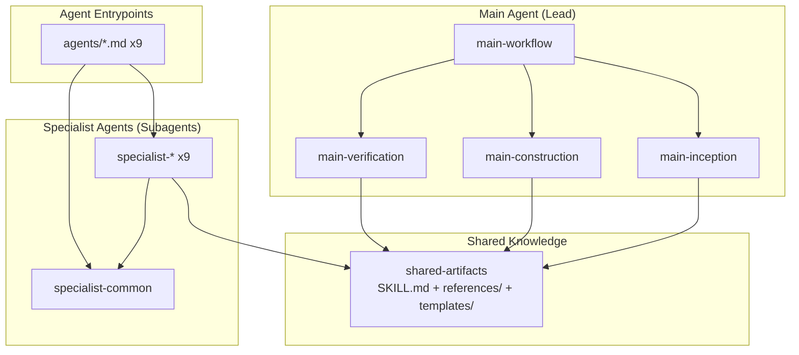

# Design Document: AI-DLC Plugin Bootstrap

- **Identifier:** 2026-04-24-ai-dlc-plugin-bootstrap
- **Author:** architect（逆算再構築）
- **Created at:** 2026-04-24T13:50:00Z
- **Last updated:** 2026-04-24T14:00:00Z
- **Status:** approved

## 設計目標と制約

**目的（Intent Spec より）:** Claude Code 環境で動作する AI-DLC プラグインを、Main + Specialist の体制で実行可能な形で提供する。

**成功基準:** スキル・エージェント・テンプレート・書き方ガイドが揃い、中断再開可能で、Claude Code 仕様と整合した構造になっていること。

**主要制約:**

- サブエージェント階層の制約（ネスト不可、Lead 固定）
- プラグイン標準ディレクトリ階層の準拠
- Markdown のみ（実行可能コードなし）
- GPG 署名必須、Conventional Commits 準拠

## アプローチの概要

本プラグインは **3 層のスキル群 + 1 層のエージェント定義** で構成する。

1. **Main 用スキル** (`main-*`): ワークフロー進行のルールと手順を Main が読む
2. **Specialist 用スキル** (`specialist-*` + `specialist-common`): 各専門エージェントが自身の作業手順として読む
3. **共有成果物スキル** (`shared-artifacts`): Main と全 Specialist が参照する成果物仕様（書き方 + テンプレート）
4. **エージェント定義** (`agents/*.md`): Main がサブエージェントを起動する際のエントリポイント

Main / Specialist の 2 層構成に Orchestrator を含めないのは Claude Code の階層制約が理由（詳細は `research/claude-code-constraints.md`）。

## コンポーネント構成



### 主要な型・インターフェース

プラグインは YAML frontmatter + Markdown のみで構成され、プログラミング言語的な型定義は持たない。ただし「暗黙の型」として以下を意識する:

- **`<identifier>`**: kebab-case 文字列（例: `2026-04-24-ai-dlc-plugin-bootstrap`）
- **`<topic>`**, **`<aspect>`**: kebab-case 文字列（research / review の観点名）
- **`<task-id>`**: `T1`, `T2`, ... のタスク識別子
- **`progress.yaml` スキーマ**: `shared-artifacts/templates/progress.yaml` で定義
- **プレースホルダ記法**: `{{name}}`（将来 EJS 等への移行可）

## データフロー / API 設計

### ワークフロー呼び出しフロー

```
User → Main (main-workflow 読込)
      → Main (main-inception 読込) → Specialist (intent-analyst, ...) → 成果物
      → ユーザー承認ゲート (成果物そのものを提示)
      → Main (main-construction 読込) → Specialist (implementer ×N, self-reviewer) → 成果物 + diff
      → Main (main-verification 読込) → Specialist (reviewer ×N, validator, retrospective-writer) → 成果物
```

### 成果物パス規則

| 種別                     | パス                                                |
| ------------------------ | --------------------------------------------------- |
| サイクル作業ディレクトリ | `docs/ai-dlc/<identifier>/`                         |
| サイクル内成果物         | `docs/ai-dlc/<identifier>/<name>.{md,yaml}`         |
| 分割成果物               | `docs/ai-dlc/<identifier>/{research,review}/<x>.md` |
| 一時レポート             | `$TMPDIR/ai-dlc/<phase>-<step>-<purpose>.md`        |
| プロジェクト横断 ADR     | プロジェクト既存 ADR 格納場所（`doc/adr/` 等）      |

### Specialist 起動の入力仕様

Main から Specialist へ渡す情報:

- `<identifier>`
- 役割・スコープ境界
- 入力成果物のパス
- 成果物保存パス
- **reference のパス** (`shared-artifacts/references/<name>.md`)
- **テンプレートのパス** (`shared-artifacts/templates/<name>.md`)

## 代替案と採用理由

| 案                                                              | 概要                                              | 採用 / 却下 | 理由                                                                                                                         |
| --------------------------------------------------------------- | ------------------------------------------------- | ----------- | ---------------------------------------------------------------------------------------------------------------------------- |
| 3 層構成（Main / Orchestrator / Specialist）                    | Orchestrator を独立サブエージェントとして切り出し | **却下**    | Claude Code 仕様でサブエージェントのネスト不可。Orchestrator を独立させても指示を Main に戻す必要があり、実効的に 2 層と等価 |
| 2 層構成（Main / Specialist）                                   | Orchestrator の責務を Main に統合                 | **採用**    | 仕様制約と合致、冗長さがない                                                                                                 |
| スキルに prefix なし（`workflow`, `inception` 等）              | フラットな命名                                    | **却下**    | Main 用 / Specialist 用の区別が視認できず、ユーザーが誤った役割で参照する恐れ                                                |
| `main-*` / `specialist-*` prefix                                | 役割ベースの命名                                  | **採用**    | 読み手が明確に区別でき、誤用リスク低減                                                                                       |
| テンプレートを各 specialist に配置                              | 各 specialist が templates/ を持つ                | **却下**    | 書き方ガイド（reference）と分断し、メンテ時に更新漏れが発生しやすい。Main とユーザーからの発見性も悪い                       |
| shared-artifacts に集約                                         | templates / references / 保存構造を 1 スキルに    | **採用**    | 1:1 対応が担保され、誰でも読める共通基盤になる                                                                               |
| 承認ゲート毎に一時レポート作成                                  | ゲート判断時も `$TMPDIR` に集約レポート           | **却下**    | 成果物そのものが承認材料として機能するため冗長。作業途中の質問のみ一時レポートが必要                                         |
| Artifact-as-Gate-Review + In-Progress Questions の 2 モード分離 | 承認は成果物ベース、途中質問のみ一時レポート      | **採用**    | 各モードの適正な使い分けで無駄なレポート作成を防止                                                                           |
| `task-plan.md` を Construction 中も書き換える                   | タスク追加時に同ファイル更新                      | **却下**    | 計画と実行状態の混在で追跡性が悪化                                                                                           |
| `task-plan.md` 不変 + `TODO.md` で状態追跡                      | 計画書は immutable、状態は別ファイル              | **採用**    | TaskCreate との同期設計が綺麗、再開時の真のソースが明確                                                                      |

## 想定される拡張ポイント

- **Phase 追加**: Operations フェーズを将来追加する場合、`main-operations` + 対応 specialist を追加する構造
- **Specialist 追加**: 新しい観点が必要な場合、`specialist-<role>` を追加し、`agents/<role>.md` と対応テンプレートを登録
- **テンプレートエンジン移行**: プレースホルダを `{{name}}` から EJS `<%= name %>` 等に移行可能
- **MCP サーバー連携**: `.mcp.json` を後追加することで外部ツールとの統合が可能
- **スラッシュコマンド**: `commands/ai-dlc-start.md` のようなエントリポイントを後追加可能

## 運用上の考慮事項

- **監視 / 観測:** 本プラグインは Markdown のみで実行時プロセスを持たないため、ランタイム監視は不要。Retrospective の統計（ループ回数・Blocker 数・時間）が品質指標
- **移行 / 切替:** 既存スキルと名前空間が被らないため、追加インストールで既存プラグインを壊さない
- **ロールアウト:** このリポジトリ内の `plugins/ai-dlc/` に配置するだけ。Claude Code が自動探索する
- **ロールバック:** 単純に `plugins/ai-dlc/` を削除すれば除去可能
- **セキュリティ:** Markdown のみで実行可能スクリプトを含まないため、セキュリティサーフェスは最小
- **パフォーマンス予測:** スキル本文の長さが SKILL.md で 500 行を超えると発火品質低下の懸念あり → 本サイクルでは main-workflow が長くなりがちなので、shared-artifacts に分離することで対応済み

## プロジェクト横断 ADR への参照

本サイクルでは**プロジェクト全体に及ぶ意思決定は発生しなかった**ため、ADR の起票はなし。`design.md` 内で完結する判断のみ。

（候補として検討したが ADR にしなかったもの: 「本プロジェクトで AI-DLC ワークフローを採用する」という判断は、本サイクルの範囲では本プラグインの配置のみで、他機能の開発プロセスを強制していない → プロジェクト横断ではない）

## Task Decomposition への引き継ぎポイント

- 実装順序は依存関係優先:
  1. プラグイン骨格（`plugin.json`） と main-\* スキル（MVP）
  2. specialist-\* スキル（common 含む）
  3. agents/\*.md
  4. shared-artifacts 抽出（templates 移管 + references 執筆）
- **並列可能な箇所**:
  - main-\* スキル 4 つ（相互参照はあるが独立して書ける）
  - specialist-\* スキル 9 つ（specialist-common 完成後に並列）
  - agents/_.md 9 つ（specialist-_ 完成後に並列）
  - references/\*.md 11 つ（templates 移管後に並列）
- **逐次必須**: shared-artifacts の SKILL.md（目次）は templates/references が揃う前後で整理する必要がある
