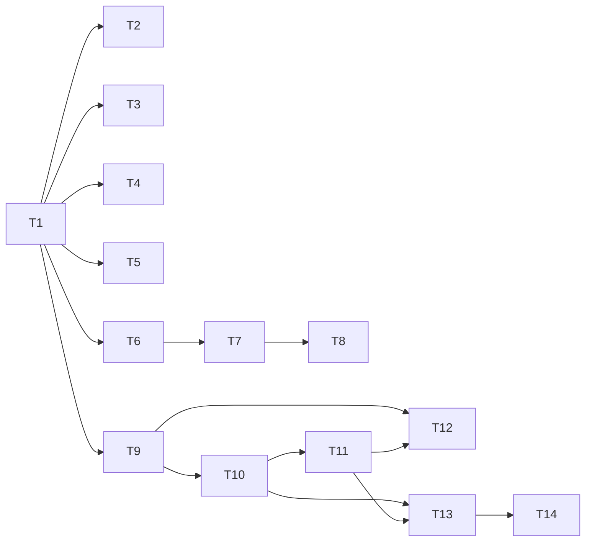

# Task Plan: AI-DLC Plugin Bootstrap

- **Identifier:** 2026-04-24-ai-dlc-plugin-bootstrap
- **Author:** planner（逆算再構築）
- **Source:** `design.md`
- **Created at:** 2026-04-24T14:10:00Z
- **Status:** approved

## 前提

- Design Document の「Task Decomposition への引き継ぎポイント」に沿って分解
- Markdown ファイル作成のみなので実装は idempotent
- 既存リポジトリ構造（`plugins/` 配下）への追加のみ

## タスク一覧

### T1: プラグイン骨格を作成

- **概要:** `plugins/ai-dlc/.claude-plugin/plugin.json` を作成し、プラグインマニフェストを配置
- **成果物:** `plugins/ai-dlc/.claude-plugin/plugin.json`
- **依存タスク:** なし
- **並列可否:** no（後続タスクすべての起点）
- **見積り規模:** S
- **テスト追加方針:** なし（マニフェストファイルのみ）
- **設計ドキュメント参照箇所:** "コンポーネント構成"

### T2: main-workflow スキルを作成

- **概要:** ワークフロー全体の管理ルールを記述した main-workflow スキル
- **成果物:** `plugins/ai-dlc/skills/main-workflow/SKILL.md`
- **依存タスク:** T1
- **並列可否:** yes（T3-T5 と並列）
- **見積り規模:** L
- **テスト追加方針:** なし（markdown スキルのみ）
- **設計ドキュメント参照箇所:** "コンポーネント構成" Main Agent

### T3: main-inception スキルを作成

- **概要:** Inception フェーズ（Step 1-4）の詳細手順
- **成果物:** `plugins/ai-dlc/skills/main-inception/SKILL.md`
- **依存タスク:** T1
- **並列可否:** yes
- **見積り規模:** M
- **テスト追加方針:** なし
- **設計ドキュメント参照箇所:** "ワークフロー呼び出しフロー"

### T4: main-construction スキルを作成

- **概要:** Construction フェーズ（Step 5-6）の詳細手順、TaskCreate と TODO.md の同期ルールを含む
- **成果物:** `plugins/ai-dlc/skills/main-construction/SKILL.md`
- **依存タスク:** T1
- **並列可否:** yes
- **見積り規模:** M
- **テスト追加方針:** なし
- **設計ドキュメント参照箇所:** "ワークフロー呼び出しフロー"

### T5: main-verification スキルを作成

- **概要:** Verification フェーズ（Step 7-9）の詳細手順
- **成果物:** `plugins/ai-dlc/skills/main-verification/SKILL.md`
- **依存タスク:** T1
- **並列可否:** yes
- **見積り規模:** M
- **テスト追加方針:** なし
- **設計ドキュメント参照箇所:** "ワークフロー呼び出しフロー"

### T6: specialist-common スキルを作成

- **概要:** 全 Specialist が継承する共通ルール（ライフサイクル、入出力契約、失敗時プロトコル等）
- **成果物:** `plugins/ai-dlc/skills/specialist-common/SKILL.md`
- **依存タスク:** T1
- **並列可否:** no（他 specialist の前提）
- **見積り規模:** M
- **テスト追加方針:** なし
- **設計ドキュメント参照箇所:** "コンポーネント構成" Specialist Agents

### T7: specialist-* 9 スキルを作成

- **概要:** intent-analyst, researcher, architect, planner, implementer, self-reviewer, reviewer, validator, retrospective-writer の各スキル
- **成果物:** `plugins/ai-dlc/skills/specialist-{role}/SKILL.md` × 9
- **依存タスク:** T6
- **並列可否:** yes（9 つは相互独立）
- **見積り規模:** L（9 ファイル）
- **テスト追加方針:** なし
- **設計ドキュメント参照箇所:** "コンポーネント構成" Specialist Agents

### T8: agents/*.md を作成

- **概要:** 各 specialist 用のサブエージェント起動エントリポイント
- **成果物:** `plugins/ai-dlc/agents/{role}.md` × 9
- **依存タスク:** T7
- **並列可否:** yes（9 つは相互独立）
- **見積り規模:** M（9 ファイル、各短め）
- **テスト追加方針:** なし
- **設計ドキュメント参照箇所:** "コンポーネント構成" Agent Entrypoints

### T9: shared-artifacts スキル骨格と SKILL.md（目次）を作成

- **概要:** 成果物仕様の目次として機能する SKILL.md
- **成果物:** `plugins/ai-dlc/skills/shared-artifacts/SKILL.md`
- **依存タスク:** T1
- **並列可否:** yes（T10-T11 と並列可能だが SKILL.md は後半で整理し直す想定）
- **見積り規模:** M
- **テスト追加方針:** なし
- **設計ドキュメント参照箇所:** "コンポーネント構成" Shared Knowledge

### T10: テンプレート 11 件を作成/移管

- **概要:** 各成果物のテンプレート（progress.yaml, intent-spec.md, research-note.md, design.md, task-plan.md, TODO.md, implementation-log.md, self-review-report.md, review-report.md, validation-report.md, retrospective.md）
- **成果物:** `plugins/ai-dlc/skills/shared-artifacts/templates/*` × 11
- **依存タスク:** T9
- **並列可否:** yes（11 つ相互独立）
- **見積り規模:** L
- **テスト追加方針:** なし
- **設計ドキュメント参照箇所:** "成果物パス規則"

### T11: references 11 件を作成

- **概要:** 各成果物の書き方ガイド（1:1 対応）
- **成果物:** `plugins/ai-dlc/skills/shared-artifacts/references/*` × 11
- **依存タスク:** T10
- **並列可否:** yes（11 つ相互独立）
- **見積り規模:** L
- **テスト追加方針:** なし
- **設計ドキュメント参照箇所:** "成果物パス規則"

### T12: 成果物保存構造と進捗記録フォーマットを shared-artifacts に統合

- **概要:** main-workflow にあった保存構造・progress.yaml 仕様を shared-artifacts/SKILL.md に移管
- **成果物:** `plugins/ai-dlc/skills/shared-artifacts/SKILL.md`（更新）、`plugins/ai-dlc/skills/main-workflow/SKILL.md`（参照のみに縮小）
- **依存タスク:** T9, T11
- **並列可否:** no（T9 の SKILL.md を書き換えるため）
- **見積り規模:** M
- **テスト追加方針:** なし
- **設計ドキュメント参照箇所:** "Shared Knowledge"

### T13: 相互参照を shared-artifacts に統一

- **概要:** main-* / specialist-* / agents/*.md のテンプレート・reference パス参照を shared-artifacts/ 配下に統一
- **成果物:** 影響各ファイル
- **依存タスク:** T10, T11
- **並列可否:** no（T2-T8 の内容を書き換える）
- **見積り規模:** M
- **テスト追加方針:** `grep` で旧パス残存確認
- **設計ドキュメント参照箇所:** "Specialist 起動の入力仕様"

### T14: ステップ完了コミット規約を追記

- **概要:** main-workflow に「ステップ完了時のコミット規約」セクションを追加、各 main-* の Exit Criteria にコミット要件を明記
- **成果物:** `plugins/ai-dlc/skills/main-workflow/SKILL.md`, `main-inception/SKILL.md`, `main-construction/SKILL.md`, `main-verification/SKILL.md`
- **依存タスク:** T13
- **並列可否:** no
- **見積り規模:** M
- **テスト追加方針:** Exit Criteria 4 ステップ分の抜け漏れを `grep` で確認
- **設計ドキュメント参照箇所:** "運用上の考慮事項"

## 依存グラフ

## 並列実行可能グループ (Wave)

- **Wave 1（起点）:** T1
- **Wave 2:** T2, T3, T4, T5, T6, T9（T1 完了後並列）
- **Wave 3:** T7（T6 完了後）
- **Wave 4:** T8, T10（T7 / T9 完了後並列）
- **Wave 5:** T11（T10 完了後）
- **Wave 6:** T12, T13（T9, T11 完了後、並列可）
- **Wave 7:** T14（T13 完了後）

## リスク / 想定される Blocker

- **スキル間の参照不整合**: 多数のスキルファイルが相互参照するため、`workflow` → `main-workflow` などのリネーム時に漏れが発生するリスク。→ `grep` で網羅確認を必ず実施
- **テンプレートのプレースホルダ名統一**: `{{name}}` 形式でバラバラの名前になりうる。→ references で命名規則を統一する
- **shared-artifacts と main-workflow の重複**: 保存構造を両方に書いてしまうリスク。→ shared-artifacts を真のソースとし main-workflow は参照のみに縮小
- **会話が長大になり context window 問題**: 大規模改修の途中で途切れるリスク。→ ステップごとにコミットし、中断再開可能な状態を維持
