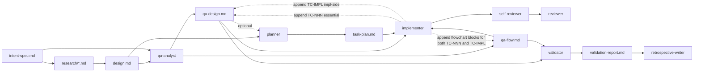
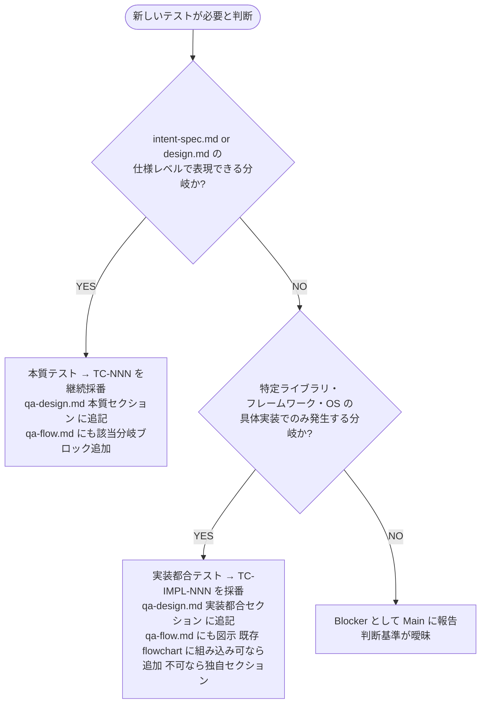

# Design Document: Add Step 4 "QA Design" to dev-workflow

- **Identifier:** 2026-04-26-add-qa-design-step
- **Author:** Main (architect 役を兼任)
- **Created at:** 2026-04-26T14:00:00Z
- **Last updated:** 2026-04-26T14:30:00Z
- **Status:** approved

## 設計目標と制約

### 目的 (Intent Spec より)

> `Step 4 QA Design` を新設して `qa-analyst` Specialist が成功基準を観測可能なテストケース集合 (`qa-design.md`) と本質ロジックの分岐図 (`qa-flow.md`) として確定させ、`planner` を分解のみの役割に純化する。

### 主要成功基準 (Intent Spec の 14 項目から抜粋)

- 新 Specialist `qa-analyst` の skill + agent ファイル存在
- `qa-design.md` (必須 6 列 + 条件付き 1 列 + 任意列) と `qa-flow.md` (Mermaid flowchart 複数ブロック対応) の template / reference 整備
- ステップ番号シフト (旧 5〜9 → 新 6〜10) の網羅完了
- planner からテスト方針記述削除、implementer / validator が qa-design.md / qa-flow.md を入力に取る
- ロールバック早見表に Step 4 関連 2 件追加

### 主要制約

- 前 ADR (`2026-04-26-dev-workflow-rename-and-flatten.md`) の決定 (フラット step リスト構造、フェーズ概念非導入、責務分離による specialist 配置) を覆さない
- Markdown + Mermaid のみ、追加レンダラ要求なし
- 既存 ai-dlc サイクル (`docs/ai-dlc/2026-04-24-...`) に手を入れない
- monorepo memory rules (`gsed`、`vp run` 経由、git commit は sandbox 外) 遵守

## アプローチの概要

QA Design ステップは、Step 3 Design で確定した「振る舞い」を、Step 5 Task Decomposition の前に**観測可能なテストケース集合**へと展開する独立ステップとして挿入する。`qa-analyst` 専門エージェントが新設されるが、これは前 ADR の「責務分離による specialist 追加」原則に整合する (フェーズ概念の再導入ではない)。

成果物は **2 ファイル** に分離する:

1. **`qa-design.md`** — テストケース表 (1 ケース = 1 行)。各ケースは「実行主体 × 検証スタイル」2 軸で抽象化分類。具体ツール名 (Vitest / Playwright 等) は持たない
2. **`qa-flow.md`** — Mermaid flowchart 複数コードブロック (関心領域別に分割可)。テストケース ID を葉として可視化、skip は理由付き

`planner` は qa-design.md を入力として受け取り、tasks に**任意で** TC-ID を紐付ける。`implementer` は qa-design.md / qa-flow.md を入力に取り、両方への追記責任を持つ (実装段階で発見された防御的テストや本質的分岐)。`validator` は qa-design.md / qa-flow.md のカバレッジを Step 9 で実測する。

## コンポーネント構成

### 新規ファイル

| 種別             | パス                                                                   | 役割                                                                 |
| ---------------- | ---------------------------------------------------------------------- | -------------------------------------------------------------------- |
| Specialist Skill | `plugins/dev-workflow/skills/specialist-qa-analyst/SKILL.md`           | qa-analyst の役割 / 入出力 / 手順 / 失敗モード / スコープ外          |
| Agent            | `plugins/dev-workflow/agents/qa-analyst.md`                            | qa-analyst エントリポイント (description + 参照スキル)               |
| Reference        | `plugins/dev-workflow/skills/shared-artifacts/references/qa-design.md` | qa-design.md の書き方ガイド (列定義 + 2 軸 enum + TC-ID 命名)        |
| Reference        | `plugins/dev-workflow/skills/shared-artifacts/references/qa-flow.md`   | qa-flow.md の書き方ガイド (Mermaid flowchart + 分割指針 + skip 規約) |
| Template         | `plugins/dev-workflow/skills/shared-artifacts/templates/qa-design.md`  | qa-design.md の雛形 (プレースホルダ + サンプル 1 行)                 |
| Template         | `plugins/dev-workflow/skills/shared-artifacts/templates/qa-flow.md`    | qa-flow.md の雛形 (Mermaid flowchart 2 ブロック例)                   |

### 修正ファイル

| ファイル                                                                                                     | 修正内容                                                                                         |
| ------------------------------------------------------------------------------------------------------------ | ------------------------------------------------------------------------------------------------ |
| `plugins/dev-workflow/skills/dev-workflow/SKILL.md`                                                          | ステップ一覧 9→10 行、全体図、コミット規約、並列起動ガイド、ロールバック早見表、ステップ詳細追加 |
| `plugins/dev-workflow/skills/specialist-planner/SKILL.md`                                                    | テスト方針記述削除、qa-design.md 入力追加、TC-ID 紐付け運用 (任意) 追加、Step 4→5 リナンバー     |
| `plugins/dev-workflow/skills/specialist-implementer/SKILL.md`                                                | 入力に qa-design.md / qa-flow.md 追加、両者への追記責任明記、Step 5→6 リナンバー                 |
| `plugins/dev-workflow/skills/specialist-validator/SKILL.md`                                                  | 入力に qa-design.md / qa-flow.md 追加、qa-flow 葉カバレッジ検証責任、Step 8→9 リナンバー         |
| `plugins/dev-workflow/skills/specialist-self-reviewer/SKILL.md`                                              | Step 6→7 リナンバーのみ                                                                          |
| `plugins/dev-workflow/skills/specialist-reviewer/SKILL.md`                                                   | Step 7→8 リナンバーのみ                                                                          |
| `plugins/dev-workflow/skills/specialist-retrospective-writer/SKILL.md`                                       | Step 9→10 リナンバー、ループテーブル参照更新                                                     |
| `plugins/dev-workflow/agents/{planner,implementer,self-reviewer,reviewer,validator,retrospective-writer}.md` | description 内の Step 番号リナンバー                                                             |
| `plugins/dev-workflow/skills/shared-artifacts/SKILL.md`                                                      | 成果物一覧テーブルに qa-design / qa-flow 行を 2 行挿入、Step 4 の成果物として位置づけ            |
| `plugins/dev-workflow/skills/shared-artifacts/templates/progress.yaml`                                       | `artifacts.qa_design: null` / `artifacts.qa_flow: null` を追加                                   |
| `plugins/dev-workflow/skills/shared-artifacts/references/progress-yaml.md`                                   | artifacts 説明に qa_design / qa_flow を追加                                                      |
| `plugins/dev-workflow/skills/shared-artifacts/templates/task-plan.md`                                        | `{{task_N_test_strategy}}` 削除、`{{task_N_covered_test_cases}}` 任意追加                        |
| `plugins/dev-workflow/skills/shared-artifacts/references/task-plan.md`                                       | 「テスト追加方針」(L33) 削除、「カバーする TC-ID (任意)」追記                                    |
| `plugins/dev-workflow/skills/shared-artifacts/templates/{TODO,self-review-report,retrospective}.md`          | Step 番号参照のリナンバー                                                                        |
| `plugins/dev-workflow/README.md`                                                                             | 9-step → 10-step に更新                                                                          |

### 関係図 (Mermaid)



## 主要な型・インターフェース

### qa-design.md のテストケース表 (列構造)

```text
必須:
  ID                    string  // "TC-NNN" or "TC-IMPL-NNN" (3 桁ゼロ埋め)
  対象成功基準           string  // "SC-1" 等または "(なし)"
  期待される振る舞い      string  // 観測可能な事象として記述
  実行主体              "automated" | "ai-driven" | "manual"
  検証スタイル           "assertion" | "scenario" | "observation" | "inspection"
  判定基準               string  // 合格条件

条件付き必須:
  必要理由               string  // 対象成功基準 = "(なし)" の場合のみ必須

任意:
  備考                  string  // △組み合わせ理由 / その他
  配置候補               string  // 配置 hint (具体パスは task-plan で確定)
  担当 implementer       string  // Step 7 で埋まる
  実装状況               "pending" | "implemented" | "passed" | "failed" | "" // Step 9 で埋まる
```

### qa-design.md のセクション構造

```text
1. # qa-design (タイトル)
2. ## 概要 (intent-spec.md の成功基準を深掘りした観測可能な形)
3. ## 自動 vs 手動の判断方針 (アーキテクチャと design.md からの根拠)
4. ## テストファイル配置ポリシー (カテゴリ別の配置方針、具体パスは task-plan)
5. ## 本質テストケース (TC-NNN: 仕様レベルで表現可能な振る舞いを検証)
   - Step 4 で qa-analyst が設計したケースが起点
   - Step 6 で implementer が「振る舞いの追加パターン」を発見した場合は **TC-NNN を継続採番**してこのセクションに追記
   - qa-flow.md の Mermaid 葉として参照される
6. ## 実装都合テストケース (TC-IMPL-NNN: 具体実装でのみ発生する防御的分岐を検証)
   - Step 4 では空 (qa-analyst は本質テストのみ設計、実装都合は予見しない)
   - Step 6 で implementer が「ライブラリ制約由来の防御的分岐」を発見した場合のみ追記
   - **qa-flow.md にも必ず反映** (テスト網羅性確認は人間にとって認知負荷が高いため、原則すべての TC を図示する)
   - 本質テストとの区別は **ID prefix (`TC-` vs `TC-IMPL-`)** で十分なので、qa-flow.md 上では混在可
7. ## カバレッジ表 (成功基準 → TC-ID の逆引き、Validation で使用)
   - 本質テスト (TC-NNN) のみが対象 (成功基準と紐付くのは本質テストのみ)
   - TC-IMPL-NNN はカバレッジ表には現れない (成功基準対応がないため)
```

### 本質テスト vs 実装都合テストの判断基準

| 区分                                 | ID 形式             | 起点               | qa-flow.md 反映   | 性質                                                                  |
| ------------------------------------ | ------------------- | ------------------ | ----------------- | --------------------------------------------------------------------- |
| **本質テスト (Step 4 設計)**         | `TC-NNN`            | Step 4 qa-analyst  | ✓                 | 仕様レベル (intent-spec.md) で表現可能な振る舞い                      |
| **本質テスト (Step 6 振る舞い追加)** | `TC-NNN` (継続採番) | Step 6 implementer | ✓ (分岐追加)      | Step 4 で予見できなかった本質ロジック分岐                             |
| **実装都合テスト**                   | `TC-IMPL-NNN`       | Step 6 implementer | ✓ (prefix で区別) | ライブラリ / フレームワーク / OS 等の具体実装でのみ発生する防御的分岐 |

**重要:** 3 区分の判別は **ID prefix (`TC-` vs `TC-IMPL-`)** で十分。qa-flow.md にはすべての TC を図示する (本質テストと実装都合テストを混在可)。区別が必要な場合は ID を見れば判断できる。

**判断フロー (Step 6 implementer 用):**



### qa-flow.md の構造

````text
1. # qa-flow (タイトル)
2. ## (関心領域 1) — 本質テスト中心、必要なら関連 TC-IMPL も組み込み
   - カバーする成功基準: SC-X, SC-Y
   - ​```mermaid flowchart TD ... ​``` (TC-NNN を主軸、関連する TC-IMPL-NNN があれば同 flowchart の葉に追加)
3. ## (関心領域 2)
   - カバーする成功基準: SC-Z
   - ​```mermaid flowchart TD ... ​```
4. ## 横断的処理 (任意、エラーハンドリング等)
   - ​```mermaid flowchart TD ... ​```
5. ## 実装都合分岐 (任意、独立した TC-IMPL を一括表示)
   - 既存 flowchart に組み込めない TC-IMPL-NNN をここに集約
   - ​```mermaid flowchart TD ... ​```
````

**実装都合テストの qa-flow.md への組み込み方針:**

- **Step 6 implementer が判断**: 既存の本質テスト flowchart の分岐構造に自然に組み込める TC-IMPL があれば、同じ flowchart に葉として追加 (例: 認証 flowchart の中で「ライブラリの仕様で `null` を返すケース」を分岐として追加)
- **組み込めない場合**: 「実装都合分岐」セクションを新設 (or 既存) して、そこに集約
- **テスト網羅性確認の認知負荷軽減**: qa-design.md のテーブルだけでは「漏れに気づきにくい」ため、qa-flow.md で図示することで人間レビュアーの認知負荷を下げる。これは設計判断の根本理由

### 2 軸の値域 (enum)

```text
ExecutionActor:    "automated" | "ai-driven" | "manual"
VerificationStyle: "assertion" | "scenario" | "observation" | "inspection"
```

禁止組み合わせ: `automated × inspection` (主観判定の自動化は本質矛盾)。
条件付き組み合わせ (備考に理由必須): `ai-driven × assertion`, `manual × assertion`, `manual × observation`。

### Step 4 における qa-analyst の入出力契約

| 項目                    | 値                                                                                                                                                                    |
| ----------------------- | --------------------------------------------------------------------------------------------------------------------------------------------------------------------- |
| 入力                    | `intent-spec.md`, `design.md`, `references/qa-design.md`, `references/qa-flow.md`, `templates/qa-design.md`, `templates/qa-flow.md`, プロジェクト言語固有テストスキル |
| 出力                    | `docs/dev-workflow/<id>/qa-design.md`, `docs/dev-workflow/<id>/qa-flow.md`                                                                                            |
| Gate                    | User (qa-design.md / qa-flow.md そのものをユーザー提示)                                                                                                               |
| 並列性                  | 1 名のみ (テスト戦略の一貫性のため)                                                                                                                                   |
| ロールバック先 (失敗時) | 観測不能な成功基準発見 → Step 1、design.md が振る舞いを定めきれない → Step 3                                                                                          |

## データフロー / API 設計

このサイクルは API 設計を伴わない (ドキュメント・スキル整備のみ)。代わりに、ステップ間の**情報フロー**を以下に記述する:

| 流入元                     | qa-analyst 起動時の用途                                           |
| -------------------------- | ----------------------------------------------------------------- |
| `intent-spec.md`           | 成功基準を深掘り (観測可能な形へ)、必要理由の判断軸               |
| `design.md`                | アーキテクチャから自動 vs 手動の判断、振る舞いの観測点特定        |
| `references/qa-design.md`  | 列構造・TC-ID 命名規則・2 軸 enum・組み合わせガイド               |
| `references/qa-flow.md`    | Mermaid flowchart 構文・分割指針・skip 葉規約                     |
| `templates/qa-design.md`   | 出力フォーマット雛形                                              |
| `templates/qa-flow.md`     | 出力フォーマット雛形                                              |
| プロジェクト言語固有スキル | 自動テスト基盤の選択肢 (具体ツール名は qa-design.md には書かない) |

| 流出先                 | qa-analyst 出力の利用                                                                                                                                                                                     |
| ---------------------- | --------------------------------------------------------------------------------------------------------------------------------------------------------------------------------------------------------- |
| `planner` (Step 5)     | qa-design.md を任意参照、TC-ID をタスクに任意紐付け                                                                                                                                                       |
| `implementer` (Step 6) | qa-design.md / qa-flow.md を必須参照。本質追加 (TC-NNN 継続採番) も実装都合 (TC-IMPL-NNN) も**両方へ追記**。区別は ID prefix で十分。網羅性確認の認知負荷軽減のため、すべての TC を qa-flow.md に図示する |
| `validator` (Step 9)   | qa-design.md / qa-flow.md のカバレッジを実測                                                                                                                                                              |

## 代替案と採用理由

### 1. qa-analyst の配置

| 案                                                 | 概要                                                         | 採用 / 却下 | 理由                                                                                                   |
| -------------------------------------------------- | ------------------------------------------------------------ | ----------- | ------------------------------------------------------------------------------------------------------ |
| **A. 新 specialist (qa-analyst) を Step 4 に新設** | qa-analyst が独立ステップで qa-design.md + qa-flow.md を作成 | **採用**    | 責務分離が明確、planner 純化、validator との整合性、specialist の追加は前 ADR の「責務分離」原則に整合 |
| B. planner 拡張                                    | planner がテスト設計も兼任 (現状の延長)                      | 却下        | 責務 overload。本サイクルの主目的「planner 純化」と相反                                                |
| C. architect 拡張                                  | architect が design.md にテスト設計も含める                  | 却下        | architect の関心 (アーキテクチャ判断) とテスト設計 (品質視点) は別関心。design.md が肥大化             |
| D. validator 前倒し                                | Step 9 validator が Step 4 にも参加してテスト設計            | 却下        | One-Shot Specialist 原則 (1 specialist = 1 step) と矛盾                                                |

### 2. テストカテゴリの抽象化

| 案                                                                   | 概要                                                                      | 採用 / 却下 | 理由                                                                                                 |
| -------------------------------------------------------------------- | ------------------------------------------------------------------------- | ----------- | ---------------------------------------------------------------------------------------------------- |
| **A. 2 軸 (実行主体 × 検証スタイル)**                                | 3 値 × 4 値の独立軸、業界 taxonomy を網羅 (research/verification-axes.md) | **採用**    | 言語/プロジェクト非依存、業界 taxonomy 全カバー、qa-design.md の列が独立で組み合わせがマスクされない |
| B. 単体 / 統合 / E2E 階層                                            | テストピラミッド準拠、業界一般的                                          | 却下        | ユーザー指示で明示的に除外。境界が不明確、言語/フレームワーク依存                                    |
| C. カテゴリ複合語 1 軸 (`code-assertion`, `automated-scenario` など) | 単一カラムでシンプル                                                      | 却下        | 拡張時に enum 値が爆発、組み合わせがマスクされる                                                     |

### 3. qa-flow ファイル形式

| 案                                                     | 概要                                                      | 採用 / 却下 | 理由                                                                                      |
| ------------------------------------------------------ | --------------------------------------------------------- | ----------- | ----------------------------------------------------------------------------------------- |
| **A. `qa-flow.md` (Markdown + 複数 Mermaid ブロック)** | Markdown 内に 1+ Mermaid コードブロック、関心領域別分割可 | **採用**    | 複雑な分岐の分割可、レビュアー負荷軽減、implementer 追記が局所化、GitHub レンダリング自動 |
| B. `qa-flow.mmd` (Mermaid 単一ファイル)                | 1 ファイル = 1 図                                         | 却下        | 複雑時に巨大化、分割不可、レビュー困難                                                    |
| C. `qa-flow/` ディレクトリ (複数 .mmd)                 | 領域別に複数ファイル                                      | 却下        | ファイル数が増えて管理コスト高、目次が別途必要                                            |

### 4. task-plan.md の TC-ID フィールド

| 案                    | 概要                                                     | 採用 / 却下 | 理由                                                                                                         |
| --------------------- | -------------------------------------------------------- | ----------- | ------------------------------------------------------------------------------------------------------------ |
| **A. 任意 (推奨)**    | 各タスクに「カバーする TC-ID」フィールドを追加するが任意 | **採用**    | planner 純化と整合、二重管理回避、Step 7 で implementer が qa-design.md を直接参照する運用 (research で詳細) |
| B. 必須               | planner が全タスクに TC-ID を紐付ける                    | 却下        | planner overload 再発、qa-design 変更時の同期負荷                                                            |
| C. フィールド追加せず | task-plan には TC-ID を持たせない                        | 却下        | 大規模タスクで「このタスクが何のテストをカバーするか」を planner レベルで議論する余地が消失                  |

### 5. ADR 起票 vs design.md 完結

| 案                                 | 概要                                                    | 採用 / 却下 | 理由                                                                                                              |
| ---------------------------------- | ------------------------------------------------------- | ----------- | ----------------------------------------------------------------------------------------------------------------- |
| **A. design.md で完結 (ADR なし)** | 本サイクルの設計は本ファイルに記録、新 ADR は起票しない | **採用**    | 前 ADR の主要決定を覆さない sub-decision、ADR 起票プロセスの運用コスト削減 (research/column-and-tcid-policy 参照) |
| B. 新 ADR を起票                   | step 数 9→10 / specialist 数 9→10 を ADR で記録         | 却下        | 前 ADR の枠組み内、sub-decision の度に ADR 起票するのは過剰                                                       |

## 想定される拡張ポイント

1. **3 軸目「テスト目的」の追加** (functional / non-functional / structural / security 等): 必要になれば任意列で追加可能。現状は 2 軸で十分網羅
2. **qa-flow.md の自動カバレッジ計測**: Mermaid AST を解析して TC-ID 葉と qa-design.md のテーブルを自動突合する script。将来課題
3. **TC-ID の階層化** (TC-AUTH-001 等): プロジェクトが大規模化した場合、関心領域別 prefix を導入する余地。命名規則は qa-design.md reference で柔軟に拡張可能
4. **Test Pyramid 導入のオプション化**: プロジェクト固有スキルで「単体/統合/E2E」分類を持たせたい場合、qa-design.md の任意「備考」列で表現可。本ワークフローの汎用構造には影響しない

## 運用上の考慮事項

- **監視 / 観測:** N/A (ドキュメント整備のみ、ランタイム挙動なし)
- **移行 / 切替:** 既存 `docs/ai-dlc/2026-04-24-...` サイクル成果物は不変。新サイクルから新 10 ステップを使う。`docs/dev-workflow/` パスは前 ADR で確定済み
- **ロールアウト:** 1 PR で全変更を反映 (本サイクルの Step 6 Implementation 成果物)。プラグイン reload で新スキル / 新 agent が利用可能に
- **ロールバック:** 前 ADR と本 design.md を破棄、`git revert` で旧 9 ステップに戻せる (無破壊変更のため安全)
- **セキュリティ:** N/A (ドキュメント整備のみ、認証/認可/秘匿情報の取り扱いなし)
- **パフォーマンス予測:** スキル context 増加 (qa-analyst skill + 2 reference + 2 template = 約 5 ファイル分)。Claude Code の context 制限内で十分余裕あり

## プロジェクト横断 ADR への参照

本サイクルでは新規 ADR を起票しない。前提となる既存 ADR:

- [`doc/adr/2026-04-26-dev-workflow-rename-and-flatten.md`](../../doc/adr/2026-04-26-dev-workflow-rename-and-flatten.md) (前 ADR、フラット構造 / specialist 配置の決定)

## Task Decomposition への引き継ぎポイント

Step 5 (Task Decomposition) で `planner` が以下のヒントを参照:

### タスク分割の主軸

- **新規ファイル作成タスク** (6 ファイル): specialist-qa-analyst SKILL / agent / 4 reference・template
- **既存ファイル修正タスク** (約 15 ファイル): カテゴリ別にグループ化可
  - 番号シフトのみ: specialist-self-reviewer / reviewer + agents/{self-reviewer, reviewer, retrospective-writer}.md
  - 入出力契約の変更を伴う: specialist-planner / implementer / validator
  - スキーマ変更を伴う: shared-artifacts/SKILL.md + templates/progress.yaml + references/progress-yaml.md + templates/task-plan.md + references/task-plan.md
  - 大規模修正: dev-workflow/SKILL.md (ステップ一覧 / 全体図 / 詳細セクション / コミット規約 / 並列ガイド / ロールバック早見表)
- **README 更新** (1 ファイル)

### 並列性の手掛かり

- 新規ファイル作成は全て独立 (並列可)
- 既存ファイル修正のうち「番号シフトのみ」グループは並列可 (file-level の独立性)
- dev-workflow/SKILL.md は単独で大規模 (シリアル実行推奨)
- specialist-planner/implementer/validator の修正は qa-design.md / qa-flow.md の reference 確定後に着手 (依存関係)

### 推奨タスク粒度

- 1 タスク = 1〜3 ファイル (1 implementer が数時間で完遂可能な粒度)
- 番号シフトの機械置換は 1 タスクで複数ファイルまとめて可
- Mermaid 図の追加 / 修正は 1 タスクで完結
- ロールバック早見表の更新は dev-workflow/SKILL.md の他の修正とまとめる

### TC-ID 紐付けの推奨

本サイクルの task-plan では TC-ID 紐付けは**任意**。Step 4 (本サイクル開発を含む) で qa-analyst が成果物を作る場合は TC-ID リストが既に存在するため、planner が任意で参照する形となる。本サイクルは「自分自身の qa-analyst 化」のメタタスクのため、TC-ID は qa-design.md template のサンプル行から借りて記述するか、空欄でも可。

### 実装の作業順序 (推奨)

1. shared-artifacts の reference + template (qa-design / qa-flow) を先に作成 (specialist-qa-analyst が参照するため)
2. specialist-qa-analyst の SKILL.md と agents/qa-analyst.md を作成
3. dev-workflow/SKILL.md の大規模更新 (ステップ番号シフト含む)
4. specialist-planner / implementer / validator の入出力契約変更
5. その他 specialist (self-reviewer / reviewer / retrospective-writer) の番号シフト
6. shared-artifacts/SKILL.md と progress.yaml / task-plan の template / reference 更新
7. README 更新
8. 最終 grep で旧 step 番号への参照ゼロ確認
