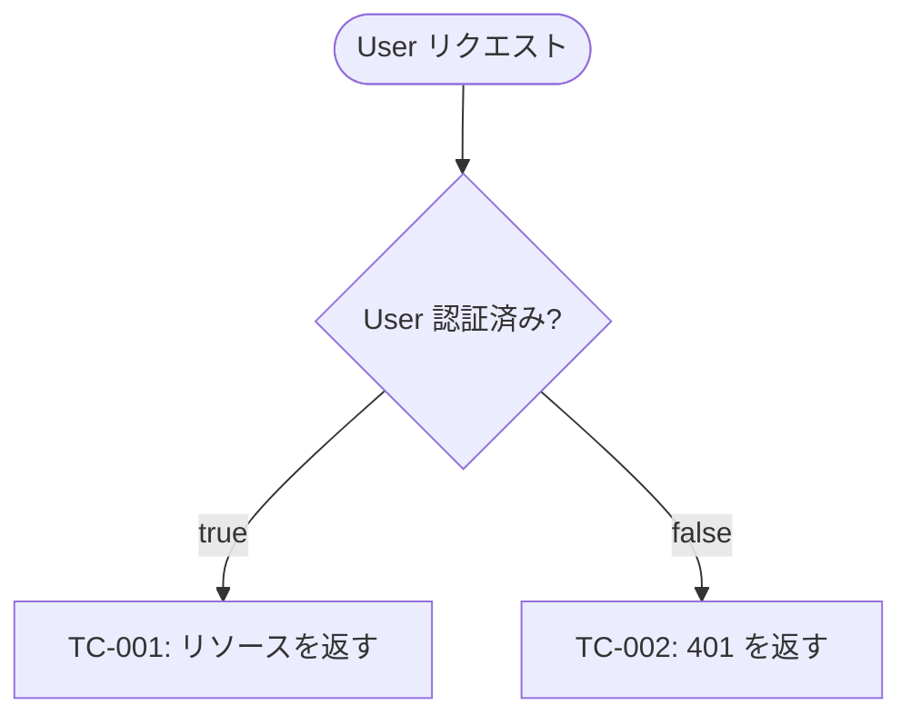
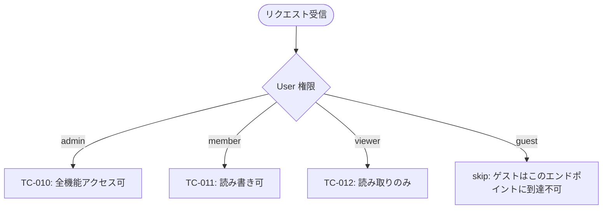
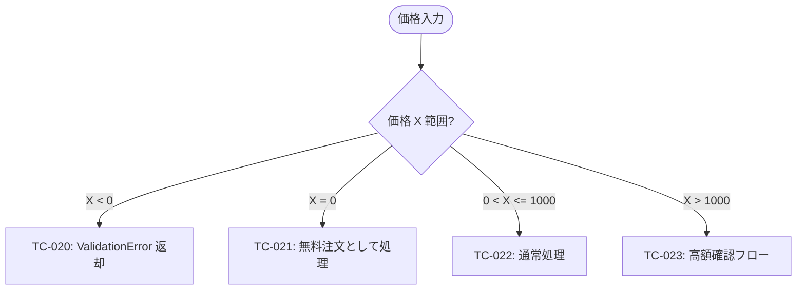

# Research Note: mermaid-syntax

- **Identifier:** 2026-04-26-add-qa-design-step
- **Topic:** mermaid-syntax
- **Researcher:** Main (intent-analyst → researcher 兼任、知識 + GitHub 公式ドキュメント)
- **Created at:** 2026-04-26T13:45:00Z
- **Scope:** qa-flow.md で使用する Mermaid 図種の選定 / GitHub レンダラ互換性 / 複数コードブロック分割の指針

## 調査対象

Intent Spec の未解決事項:

- 「`qa-flow.md` の Mermaid 構文選択 (`flowchart TD` vs `stateDiagram-v2` vs その他)」
- 「`qa-flow.md` を分割する際の単位の指針 (関心領域別 / サブシステム別 / 成功基準グループ別)」

これらに対し、GitHub のネイティブ Mermaid レンダラ (Markdown 内 ` ```mermaid ` コードブロック自動レンダリング) で動作する範囲で最適解を確定する。

## 発見事項

### GitHub の Mermaid 対応

- 2022-02 以降、GitHub は Markdown 内の ` ```mermaid ` コードブロックを自動レンダリング (リポジトリ閲覧 / Issue / PR / Wiki / Gist 全てで有効)
- 同一 `.md` ファイルに**複数の Mermaid コードブロックを含めることが可能** (各々独立した図としてレンダリング)
- 対応図種 (主要): `flowchart`, `sequenceDiagram`, `classDiagram`, `stateDiagram-v2`, `erDiagram`, `journey`, `gantt`, `pie`, `mindmap`, `quadrantChart`, `gitGraph`, etc.

### テスト分岐表現に適した図種の比較

| 観点                       | `flowchart TD`                                | `stateDiagram-v2`                       | `journey`                  |
| -------------------------- | --------------------------------------------- | --------------------------------------- | -------------------------- | ---------------------------- | -------- |
| 主目的                     | プロセス・判断分岐                            | 状態遷移                                | ユーザー体験タイムライン   |
| 条件分岐 (if)              | ✓ `{Cond?}` 菱形 + `-->                       | true/false                              | `                          | △ 状態間の遷移条件として表現 | ✗ 不向き |
| 多択分岐 (switch)          | ✓ ラベル付き複数矢印                          | △ 多状態への遷移                        | ✗ 不向き                   |
| 葉ノード (テストケース ID) | ✓ 任意の四角形で表現                          | △ 状態として表現 (テストの概念に遠回り) | ✗ ユーザータスクとしてのみ |
| skip 表現                  | ✓ `[skip: reason]` のような特別ノード         | △ 終了状態 `[*]` で代用                 | ✗ 不向き                   |
| ノード形状の自由度         | 高 (`[]`, `()`, `{}`, `[[]]`, `(())`, `[/\]`) | 低                                      | 低                         |
| GitHub レンダラ動作        | 安定                                          | 安定                                    | 安定                       |
| 視覚的可読性 (テスト用途)  | 高 (フローが直感的)                           | 中 (状態指向で違和感)                   | 低                         |

→ **`flowchart TD` (Top-Down) を採用**。テスト = 「入力条件 → 判断ノード → 期待される結果 (テストケース)」のフローはまさに flowchart の自然な表現。

### `flowchart TD` の主要構文

#### ノード形状

| 構文         | 意味         | 用途                      |
| ------------ | ------------ | ------------------------- |
| `A[Label]`   | 四角         | 通常ノード / テストケース |
| `A([Label])` | スタジアム   | start / end               |
| `A{Label}`   | 菱形         | 判断 (if 条件)            |
| `A((Label))` | 円           | 副次的ステップ            |
| `A[[Label]]` | サブルーチン | 別 flowchart への参照     |
| `A[/Label/]` | 平行四辺形   | 入出力                    |

#### 矢印 (エッジ)

| 構文       | 意味                |
| ---------- | ------------------- | --- | ----------------------------------- |
| `A --> B`  | 通常の遷移          |
| `A -->     | label               | B`  | ラベル付き遷移 (条件分岐の値を記述) |
| `A -.-> B` | 点線 (オプショナル) |
| `A ==> B`  | 太線 (主要パス強調) |

#### 例: シンプル if 分岐



#### 例: switch (多択) 分岐



#### 例: 境界値分岐 (数値範囲)



### 複数コードブロック分割の指針

#### なぜ分割が必要か

- 1 つの flowchart で 30 ノードを超えると視覚的に追いにくい
- レビュアーが特定機能の分岐に集中したい場合に、関係ない図が混ざると認知負荷が高い
- 後の implementer が修正・追記する際に、修正範囲を局所化できる

#### 分割単位の候補と評価

| 単位                   | メリット                                   | デメリット                                     |
| ---------------------- | ------------------------------------------ | ---------------------------------------------- |
| **関心領域 (concern)** | 機能ドメイン (認証/データ/UI) に直結、自然 | 領域の境界が設計次第                           |
| サブシステム           | アーキテクチャ層と一致                     | UI〜DB 横断する分岐を表現できない              |
| 成功基準グループ       | Intent Spec とトレーサビリティが取りやすい | 複数基準を貫くフローが分散する                 |
| ユーザーフロー (story) | 主要ユースケース別に整理                   | 横断的な技術分岐 (エラーハンドリング等) が分散 |

#### 推奨方針

**主軸: 関心領域 (concern) 単位**で分割し、各図の見出しで「カバーする成功基準 ID」をコメント明示する。

- ヒューリスティック: 1 つの flowchart が 15〜20 ノードを超えるなら分割を検討
- ファイル構成例:

```markdown
## 認証・認可

このセクションがカバーする成功基準: SC-1, SC-2, SC-5

​`mermaid
flowchart TD
  ...
​`

## 注文処理

このセクションがカバーする成功基準: SC-3, SC-4

​`mermaid
flowchart TD
  ...
​`
```

- セクション見出しは `##` (h2) で揃え、目次から飛べるように
- 各 flowchart の直前に「カバーする成功基準 ID」を 1 行で明示
- 横断的な分岐 (例: エラーハンドリング) は専用セクション「## 横断的処理」で別図として記述

### skip 葉の運用

- 形状: `[skip: 理由]` の四角形ノード
- 配置: 該当する条件分岐の葉として
- 理由必須: なぜスキップするのか (例: 「ガード条件で到達不能」「別 flowchart で扱う」「Validation 不要 (Spec 上保証済み)」)
- 理由がない skip は禁止 (= テスト漏れを隠蔽するアンチパターン)

## 引用元

- GitHub Docs: "Creating diagrams" (https://docs.github.com/en/get-started/writing-on-github/working-with-advanced-formatting/creating-diagrams)
- Mermaid 公式ドキュメント flowchart syntax (https://mermaid.js.org/syntax/flowchart.html)
- Mermaid 公式 stateDiagram-v2 (https://mermaid.js.org/syntax/stateDiagram.html)
- 既存 monorepo 内の Mermaid 使用例: `doc/adr/2026-04-26-dev-workflow-rename-and-flatten.md` (Step 5 ↔ 6 ループ図、ASCII で書かれているが Mermaid 化可能)

## 設計への含意

1. **qa-flow.md の図種は `flowchart TD` 一択**として template に明記。`stateDiagram-v2` 等は将来の拡張で必要になれば追加検討
2. **template に複数コードブロックの例を含める** (single-block のみのテンプレートだと「分割可」が伝わらない)
3. **分割単位の主軸は「関心領域 (concern)」**として reference に明記。Step 4 で qa-analyst が判断する余地を残しつつ、デフォルト方針を提示
4. **各 flowchart の前に「カバーする成功基準 ID」をマークダウンで併記**するルールを reference に追加
5. **skip 葉には必ず理由を付す**ことを reference に明記。理由がない skip はレビューで差し戻す
6. **判断ノード形状の規約**: if = `{Cond?}` 菱形、switch = `{State}` 菱形 + 多ラベル矢印。一貫性のため reference に例示

## 残存する不明点

なし。Step 3 Design で template の具体内容 (サンプル flowchart の構造、最小例 2-3 個) を確定する。
