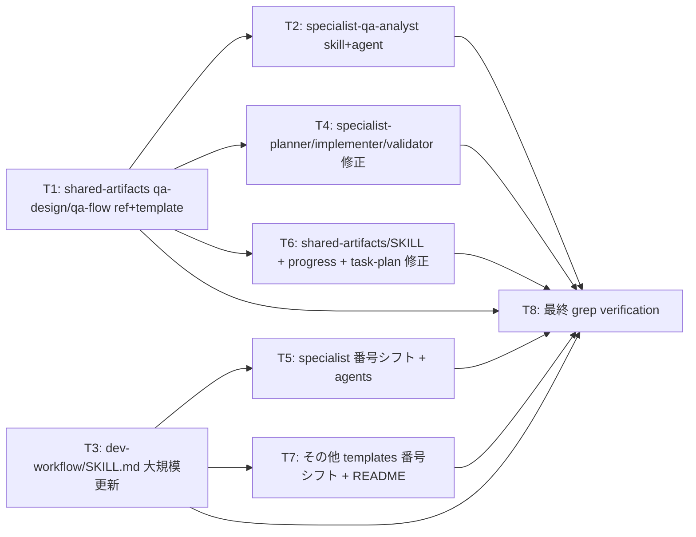

# Task Plan: Add Step 4 "QA Design" to dev-workflow

- **Identifier:** 2026-04-26-add-qa-design-step
- **Author:** Main (planner 役を兼任)
- **Source:** `design.md`
- **Created at:** 2026-04-26T15:00:00Z
- **Status:** draft

このドキュメントは **Step 4 で確定する不変な計画書**。Step 5〜6 中のタスク状態追跡は `TODO.md` で行う。

## 前提

- Design Document の「コンポーネント構成」「Task Decomposition への引き継ぎポイント」に基づき 8 タスクに分解
- 1 タスク = 1 人の `implementer` が完遂可能な粒度 (数時間〜半日程度)
- 並列実行可能なタスクは明示されている
- **テスト追加方針は本サイクルでは N/A** (本サイクルは現行の 9 ステップ dev-workflow で進行中であり、qa-design.md / qa-flow.md による事前テスト設計はまだ存在しない。本サイクルで追加するテストは Step 5 で implementer が `vp test` 等を用いた最低限の動作確認のみ。本格的な QA Design 運用は次サイクル以降)

## タスク一覧

### T1: shared-artifacts に qa-design / qa-flow の reference + template を追加

- **概要:** `qa-design.md` と `qa-flow.md` の書き方ガイド (reference) と雛形 (template) を新規作成。後続 specialist (qa-analyst / planner / implementer / validator) が参照する真のソース
- **成果物:**
  - `plugins/dev-workflow/skills/shared-artifacts/references/qa-design.md` (新規)
  - `plugins/dev-workflow/skills/shared-artifacts/references/qa-flow.md` (新規)
  - `plugins/dev-workflow/skills/shared-artifacts/templates/qa-design.md` (新規)
  - `plugins/dev-workflow/skills/shared-artifacts/templates/qa-flow.md` (新規)
- **依存タスク:** なし (起点)
- **並列可否:** yes (T3 と並列実行可)
- **見積り規模:** M (4 ファイル新規、各 50-150 行、design.md の主要型・セクション構造を素直に落とし込む)
- **テスト追加方針:** N/A (本サイクル開発時点で qa-design 不在。Step 5 implementer が template の構文妥当性を `vp run check` 等で確認)
- **設計ドキュメント参照箇所:** design.md「主要な型・インターフェース」(qa-design.md 列構造 / セクション構造 / 2 軸 enum / qa-flow.md セクション構造 / 判断フロー)

### T2: specialist-qa-analyst skill + agent を新規作成

- **概要:** Step 4 の Specialist として qa-analyst を新設。SKILL.md (役割 / 入力 / 手順 / 失敗モード / スコープ外) と agents/qa-analyst.md (description + 参照スキル) を作成
- **成果物:**
  - `plugins/dev-workflow/skills/specialist-qa-analyst/SKILL.md` (新規)
  - `plugins/dev-workflow/agents/qa-analyst.md` (新規)
- **依存タスク:** T1 (qa-design.md / qa-flow.md の reference を参照する)
- **並列可否:** no (T1 完了後に着手)
- **見積り規模:** M (2 ファイル新規、specialist-\* 既存スキル形式に合わせる)
- **テスト追加方針:** N/A
- **設計ドキュメント参照箇所:** design.md「Step 4 における qa-analyst の入出力契約」「コンポーネント構成 → 新規ファイル」

### T3: dev-workflow/SKILL.md の大規模更新

- **概要:** メインスキル本体を 9 ステップ → 10 ステップ構成に更新。ステップ一覧 / ワークフロー全体図 / Step 4 詳細追加 / 旧 Step 5〜9 を Step 6〜10 にリナンバー / Step 5↔6 ループ → Step 6↔7 / コミット規約 / 並列起動ガイド / ロールバック早見表 (Step 4 関連 2 件追加)
- **成果物:**
  - `plugins/dev-workflow/skills/dev-workflow/SKILL.md` (修正)
- **依存タスク:** T1 (qa-design.md / qa-flow.md パスの reference)
- **並列可否:** yes (T1 と並列、T2 とは独立)
- **見積り規模:** L (1 ファイル大規模修正、複数セクション、機械置換 + 構造変更が混在。研究ノート existing-structure.md L75-87 の 6 観点をすべてカバー)
- **テスト追加方針:** N/A (Step 5 implementer が機械置換後の grep verification で網羅性確認)
- **設計ドキュメント参照箇所:** design.md「コンポーネント構成 → 修正ファイル」(dev-workflow/SKILL.md 行) / Task Decomposition「実装の作業順序 (推奨) 3」

### T4: specialist-planner / implementer / validator の入出力契約変更

- **概要:** 3 specialist の固有入力に qa-design.md / qa-flow.md を追加。planner はテスト方針記述削除 + TC-ID 任意紐付け運用追加。implementer は両方への追記責任 (TC-NNN 継続採番 / TC-IMPL-NNN 採番、両方を qa-flow.md にも図示) を明記。validator はカバレッジ検証責任を明記。担当ステップ番号もリナンバー (Step 4→5 / 5→6 / 8→9)
- **成果物:**
  - `plugins/dev-workflow/skills/specialist-planner/SKILL.md` (修正)
  - `plugins/dev-workflow/skills/specialist-implementer/SKILL.md` (修正)
  - `plugins/dev-workflow/skills/specialist-validator/SKILL.md` (修正)
- **依存タスク:** T1 (qa-design.md / qa-flow.md の reference パスを参照する)
- **並列可否:** yes (T1 完了後、T2 / T3 と並列可)
- **見積り規模:** M (3 ファイル修正、それぞれ frontmatter description + 本文の入出力欄 + Step 番号)
- **テスト追加方針:** N/A
- **設計ドキュメント参照箇所:** design.md「コンポーネント構成 → 修正ファイル」(specialist-planner/implementer/validator 行) / 主要型・インターフェース「本質テスト vs 実装都合テストの判断基準」「判断フロー」

### T5: 機械的番号シフト (specialist-self-reviewer / reviewer / retrospective-writer + agents)

- **概要:** Step 番号のみリナンバーすればよい specialist 3 件と agents 6 件を機械置換でまとめて処理。`gsed` で逆順 (Step 9→10, 8→9, ..., 4→5) で実行 (連鎖二重置換回避)
- **成果物:**
  - `plugins/dev-workflow/skills/specialist-self-reviewer/SKILL.md` (修正)
  - `plugins/dev-workflow/skills/specialist-reviewer/SKILL.md` (修正)
  - `plugins/dev-workflow/skills/specialist-retrospective-writer/SKILL.md` (修正)
  - `plugins/dev-workflow/agents/planner.md` (修正)
  - `plugins/dev-workflow/agents/implementer.md` (修正)
  - `plugins/dev-workflow/agents/self-reviewer.md` (修正)
  - `plugins/dev-workflow/agents/reviewer.md` (修正)
  - `plugins/dev-workflow/agents/validator.md` (修正)
  - `plugins/dev-workflow/agents/retrospective-writer.md` (修正)
- **依存タスク:** T3 (Step 番号シフト方針の確定後)
- **並列可否:** no (T3 完了後、T7 と並列可)
- **見積り規模:** S (機械置換中心、9 ファイル一括処理)
- **テスト追加方針:** N/A (実行後の grep で旧番号 0 件を確認)
- **設計ドキュメント参照箇所:** design.md「コンポーネント構成 → 修正ファイル」 / research/existing-structure.md「設計への含意 1 (番号シフトの順序)」

### T6: shared-artifacts/SKILL.md + progress.yaml + task-plan の template/reference 更新

- **概要:** 成果物一覧テーブルに qa-design / qa-flow 行追加 (shared-artifacts/SKILL.md)。progress.yaml の artifacts に qa_design / qa_flow フィールド追加 (template + reference)。task-plan.md の「テスト追加方針」削除 + 「カバーするテストケース ID (任意)」追加 (template + reference)
- **成果物:**
  - `plugins/dev-workflow/skills/shared-artifacts/SKILL.md` (修正)
  - `plugins/dev-workflow/skills/shared-artifacts/templates/progress.yaml` (修正)
  - `plugins/dev-workflow/skills/shared-artifacts/references/progress-yaml.md` (修正)
  - `plugins/dev-workflow/skills/shared-artifacts/templates/task-plan.md` (修正)
  - `plugins/dev-workflow/skills/shared-artifacts/references/task-plan.md` (修正)
- **依存タスク:** T1 (qa-design.md / qa-flow.md パス確定後)
- **並列可否:** yes (T1 完了後、T2 / T3 / T4 と並列可)
- **見積り規模:** M (5 ファイル修正、各小規模変更だがスキーマ整合が必要)
- **テスト追加方針:** N/A
- **設計ドキュメント参照箇所:** design.md「コンポーネント構成 → 修正ファイル」(shared-artifacts 関連の 5 行)

### T7: その他 templates の Step 番号シフト + README 更新

- **概要:** TODO.md / self-review-report.md / retrospective.md template の Step 番号参照をリナンバー。README.md (10 ステップ反映)
- **成果物:**
  - `plugins/dev-workflow/skills/shared-artifacts/templates/TODO.md` (修正)
  - `plugins/dev-workflow/skills/shared-artifacts/templates/self-review-report.md` (修正)
  - `plugins/dev-workflow/skills/shared-artifacts/templates/retrospective.md` (修正)
  - `plugins/dev-workflow/README.md` (修正)
- **依存タスク:** T3 (Step 番号シフト方針確定後)
- **並列可否:** yes (T3 完了後、T5 / T6 と並列可)
- **見積り規模:** S (機械置換中心 + README は 1 セクションのみ更新)
- **テスト追加方針:** N/A
- **設計ドキュメント参照箇所:** design.md「コンポーネント構成 → 修正ファイル」 / research/existing-structure.md L48-50 (templates の Step 言及行)

### T8: 最終 grep verification

- **概要:** Intent Spec 成功基準 13 (`grep -nF "Step 5 (Implementation)" plugins/dev-workflow/` が 0 件) を含む全 14 成功基準の機械的検証を実行し、不一致があれば該当タスクに差し戻し。手動目視 (Mermaid レンダリング、qa-design.md template 構文) も合わせて実施
- **成果物:**
  - 検証結果の進捗記録への反映 (新規ファイルなし、コミット時のメッセージで報告)
- **依存タスク:** T1, T2, T3, T4, T5, T6, T7 (全実装タスク完了後)
- **並列可否:** no (最終ゲート)
- **見積り規模:** S (grep + 目視確認のみ、修正は元タスクへ差し戻し)
- **テスト追加方針:** N/A
- **設計ドキュメント参照箇所:** intent-spec.md「成功基準」14 項目 / design.md「Task Decomposition への引き継ぎポイント → 実装の作業順序 8」

## 依存グラフ

## 並列実行可能グループ

Step 5 で Main が参照する並列起動単位:

- **Wave 1 (起点、並列可):** T1, T3
- **Wave 2 (T1 完了後、並列可):** T2, T4, T6
- **Wave 3 (T3 完了後、並列可):** T5, T7
- **Wave 4 (全完了後、最終):** T8

注: Wave 2 と Wave 3 は依存元 (T1 / T3) が異なるため、T1 と T3 が同時完了しなくても、それぞれ完了したものから順次次の Wave に進める。

## リスク / 想定される Blocker

- **R1: Mermaid 構文エラー** — qa-flow.md template の Mermaid コードブロックが GitHub レンダラで描画されない場合、Step 5 implementer が手動修正。対応: T1 完了時に手動目視確認 (research/mermaid-syntax.md L65-92 の例を参考に minimal な構文を採用)
- **R2: 番号シフトの連鎖二重置換** — `gsed` を順方向 (Step 4→5 → 5→6 → ...) で実行すると連鎖して二重置換される (Step 4 が結果として Step 6 になる)。対応: T5 / T7 では必ず**逆順** (9→10, 8→9, ..., 5→6) で実行 (research/existing-structure.md L105 の含意 1 参照)
- **R3: dev-workflow/SKILL.md の整合性破綻** — T3 が大規模修正のため、ステップ番号 / コミット規約 / ロールバック早見表 / 並列起動ガイドの相互参照に齟齬が生じる可能性。対応: T8 の最終 grep + 目視で網羅確認、不整合があれば T3 に差し戻し
- **R4: planner / implementer / validator の入出力契約と qa-analyst 契約の不整合** — T2 と T4 が並列で進むため、qa-analyst の出力フォーマットを implementer/validator が解釈できない可能性。対応: T1 の reference (qa-design.md / qa-flow.md) を共通の真のソースとして両者が参照、整合性を担保
- **R5: 既存 ai-dlc サイクル成果物への影響** — 機械置換 (T5 / T7) で `docs/dev-workflow/` パターンが `docs/ai-dlc/` にも誤適用される可能性 (現状の sed でこれは起きない設計だが、念のため `plugins/dev-workflow/` 配下に限定して実行)。対応: T5 / T7 の sed コマンドはパスを明示的に `plugins/dev-workflow/` に限定
