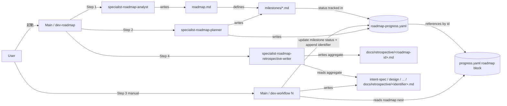
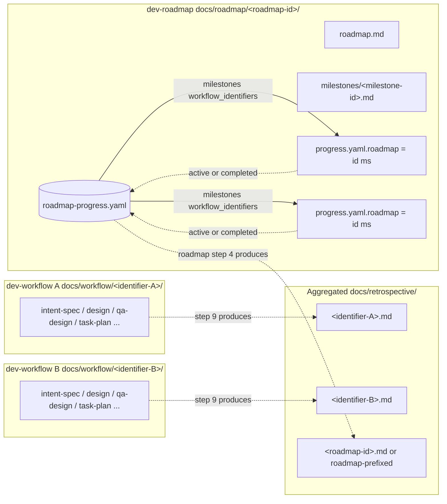
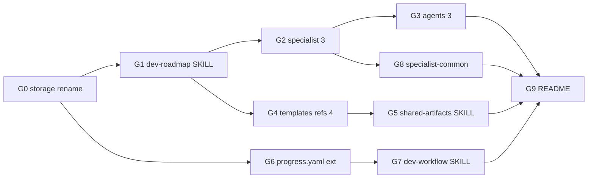

# Design Document: dev-roadmap スキル新設による戦略層の整備

- **Identifier:** 2026-04-29-add-dev-roadmap-skill
- **Author:** architect (single instance)
- **Created at:** 2026-04-29T05:00:00Z
- **Last updated:** 2026-05-01T01:00:00Z
- **Status:** revised after main-merge breaking changes (rollback)

## 設計目標と制約

### Intent Spec からの引用

- **目的 (intent-spec.md:21):** 「`dev-workflow` プラグイン配下に `dev-roadmap` スキルを新設し、複数の `dev-workflow` サイクルを束ねる**戦略層**として機能させる。具体的には、ロードマップ全体の世界観・スコープ境界を定義し、それを観測可能なマイルストーンに分割し、各マイルストーンの実行を `dev-workflow` サイクルに委譲する流れを成果物ベースで定義する。」
- **成功基準 (intent-spec.md:103-120、改訂版 14 項目):** 機械的または手動目視で合否を一意に判定可能な観測可能基準。本設計はこの 14 項目すべてを構造的に充足することを必須とする。特に成功基準 #12 は本サイクル開始基準点 (= main マージ直後の `HEAD`、`progress.yaml.rollbacks[0].at` 時点に対応) を baseline として `git diff --find-renames <baseline>..HEAD -- docs/workflow/2026-04-26-add-qa-design-step/` の**内容差分が 0** (パス変更のみ許容) であることを要求する。
- **主要制約 (intent-spec.md:122-136):**
  - 全成果物は Markdown / YAML 形式に限定 (build ツール非依存)
  - Mermaid コードブロックで図示可、追加レンダラ不要
  - スキル frontmatter スキーマは既存 `dev-workflow` 系と同一 (`name` / `description` / `metadata: {author, version}`)
  - `dev-workflow` の 9 つの基本方針 (Main-Centric Orchestration / Single-Source-of-Progress / One-Shot Specialist & Within-Step Persistence / Gate-Based Progression / Artifact-Driven Handoff / Project-Rule Precedence / Commit-Based Resumability / Clean-Transition / Artifact-as-Gate-Review / Report-Based Confirmation) を `dev-roadmap` も全継承
  - 既存サイクル `2026-04-26-add-qa-design-step/` の内容差分は 0 (後方互換厳守、リネーム後パス基準、成功基準 #12)
  - ドキュメント言語は Intent Spec と既存 SKILL の本文に倣い**日本語**で記述 (intent-spec.md:136 の制約に従い、本文は日本語、見出しキーワード・コードブロックは英語混在を許容)

### main マージによる前提崩壊への追従 (本設計改訂の 4 起因)

本設計は当初 (initial) Step 3 完了後に main マージで前提が崩壊し、Step 1 ロールバック (`progress.yaml.rollbacks[0].at = 2026-04-29T07:00:00Z`) を経て Intent Spec が改訂された結果、以下 4 起因に追従する形で改訂された:

1. **9 ステップ体系への移行**: dev-workflow 本体は 10 ステップ → **9 ステップ** (Step 1=Intent / 2=Research / 3=Design / 4=QA Design / 5=Task Decomposition / 6=Implementation / 7=External Review / 8=Validation / 9=Retrospective、旧 Step 7 Self-Review は External Review に統合済)。サイクル完了 (`completed` 遷移) のタイミングは **Step 9 Retrospective 完了時** (旧表記 Step 10 → 新 Step 9)
2. **保存先ディレクトリのリネーム**: スキル名 `dev-workflow` / `dev-roadmap` は維持。作業ディレクトリ保存先のみ `docs/dev-workflow/<identifier>/` → **`docs/workflow/<identifier>/`** および `docs/dev-roadmap/<roadmap-id>/` → **`docs/roadmap/<roadmap-id>/`** に変更。本サイクル Step 6 implementer の**最初のタスク**で `git mv docs/dev-workflow/ docs/workflow/` 単独コミット (および `docs/roadmap/` の新規作成) を先行投入する
3. **Retrospective 集約保存形式への追従**: `dev-workflow` 本体は既に `docs/dev-workflow/<id>/retrospective.md` → `docs/retrospective/<identifier>.md` (`docs/adr/` 同パターン) に移行済。`dev-roadmap` の retrospective も同じ集約ディレクトリ `docs/retrospective/<roadmap-id>.md` に保存する
4. **成功基準 #12 の再定義**: 旧版は単純な `git diff = 0` だったが、本サイクル Step 6 で `docs/dev-workflow/` → `docs/workflow/` のリネームを実施するため、`git diff --find-renames <baseline>..HEAD` でリネームを許容しつつ**内容 diff 0** を判定する形に再定義。`<baseline>` はロールバック時点 HEAD コミット

### 設計原則 (ユーザー承認ゲート後の確定方針)

ユーザー承認ゲート (initial Step 3) で以下の単純化指示が確定し、本改訂版でも維持する:

> マイルストーンの細かいステータスは workflow の方を見れば辿れるので、一旦、ここでは**紐付けだけできれば良い**。不足分は適宜考えて拡張する。

この指示により、本設計の中核原則を以下に再定義する:

- **最小限の責務 (紐付けのみ)**: `roadmap-progress.yaml` の責務は「マイルストーン ↔ workflow identifier の紐付け」と粗粒度ステータス (`planned` / `active` / `completed` / `blocked` / `cancelled`) のみとする
- **細かい進捗は workflow 側に委ねる**: 現在ステップ名 / ゲート状況 / ms 精度タイムスタンプ / 詳細イベント履歴は `roadmap-progress.yaml` に持たない。必要時は `workflow_identifiers[]` から該当 `docs/workflow/<identifier>/progress.yaml` を辿る
- **不足は将来拡張**: 運用上必要性が判明した時点で events 構造 / ステップ単位進捗反映 / status_view 派生ビュー等を別サイクルで追加する。本サイクルでは導入しない
- **9 ステップ体系前提**: workflow 側のサイクル完了は Step 9 Retrospective 完了時。本設計の各種プロトコル (更新タイミング、再開プロトコル) は 9 ステップ体系を前提に記述する
- **保存先リネームを織り込んだ設計**: design.md 内で言及する全 path は**リネーム後** (`docs/workflow/` / `docs/roadmap/` / `docs/retrospective/`) を前提に記述する。リネーム実施は本サイクル Step 6 implementer の最初のタスク

### 設計判断の評価軸

本設計は以下 5 つの評価軸で代替案を比較する。Intent Spec の目的・制約と上記単純化方針を実装可能な形に翻訳した独自の判定基準である。

1. **戦略層と戦術層の責務分離度**: roadmap (戦略: 何を / どの順で / なぜ) と workflow (戦術: どう作る / どう検証する) の境界がコード/成果物レベルで明示されているか
2. **後方互換性**: 既存 `dev-workflow` サイクルおよび既存成果物への破壊的変更がないか (成功基準 #12、リネーム後パス基準で内容 diff 0)
3. **疎結合・独立性**: roadmap 配下と非配下を `roadmap` キー単独 null 判定で一意に分岐できるか、ID 文字列ベースの双方向参照のみで完結するか (intent-spec.md:75 / :61 の要請)
4. **最小責務性**: スキーマ・更新プロトコルが「紐付けのみ」に絞られ、運用負荷とメンテ対象が最小化されているか (上記設計原則)
5. **拡張余地**: events 構造 / status_view / ステップ単位進捗反映 / roadmap-of-roadmaps / CI 連携を将来追加する余地を、本サイクルでは導入せず**閉じない設計**で残せているか

## アプローチの概要

戦略層 `dev-roadmap` を `dev-workflow` の上位レイヤーとして新設し、両者を **(a) ID 文字列の双方向参照**と **(b) `roadmap-progress.yaml` の最小スキーマ (マイルストーン定義 + 紐付け配列 + 粗粒度ステータス)** で疎結合に接続する。`dev-roadmap` 自身は Step 1-2 (戦略意図の言語化とマイルストーン分解)、Step 3 (Execution: ユーザー手動起動の dev-workflow サイクル群を観察するマーカー的ステップ、Specialist を持たない)、Step 4 (Roadmap Retrospective) の 4 ステップ構成で、戦略レベルの設計・実装・検証は持たず、それらは個別マイルストーンの `dev-workflow` サイクルに完全委譲する。

成果物の保存先は **(i) ロードマップ作業ディレクトリ `docs/roadmap/<roadmap-id>/`** (roadmap.md / milestones/<milestone-id>.md / roadmap-progress.yaml)、**(ii) ロードマップ retrospective `docs/retrospective/<roadmap-id>.md`** (集約形式、`docs/adr/` 同パターン) の 2 系統に分かれる。`docs/workflow/<identifier>/` (リネーム後パス) と並列配置で疎結合。`<roadmap-id>` と `<identifier>` の名前空間衝突回避は本設計の「未解決事項 / Open Questions」セクションで提示する prefix 案で確定する。

このアプローチの核心は **「`dev-workflow` 側を能動的書き手、`dev-roadmap` 側を受動的観察者にする」** という非対称な接続にある。`dev-roadmap` は `dev-workflow` サイクルを能動起動せず、起動された各 `dev-workflow` が自身の `progress.yaml.roadmap` ネストブロックを通じて roadmap 文脈を検知し、`roadmap-progress.yaml` の該当マイルストーンに対して **(a) サイクル開始時に `status: active` 遷移 + `workflow_identifiers[]` への自身の identifier 追記**、**(c) サイクル完了時 (= dev-workflow Step 9 Retrospective 完了時) に `status: completed` 遷移**の 2 タイミングで更新する。これにより `dev-roadmap` の Step 3 は「ユーザーがサイクルを起動していく期間を表すマーカー」として最小化でき、戦略層と戦術層の認知負荷を分離できる (Intent Spec 背景 §1-3)。

並行更新の競合は**最小スキーマ + 通常の git 3-way merge (案 A)** で十分耐えられる。本バージョンではマイルストーン状態のスカラ書き換えが発生するが、更新タイミングが「サイクル開始時」「サイクル完了時」の 2 点に絞られたことで衝突可能性は劇的に低下する (旧 案 B が想定した「各ステップ完了時の進捗サマリ反映」を本バージョンでは scope out したため)。`workflow_identifiers[]` への追記は append であり 3-way merge で自動マージ親和性が高い。残存する稀な衝突は `pre-commit` hook の YAML syntax 検査で阻止され、衝突解消手順は `references/roadmap-progress-yaml.md` に明記する。

## コンポーネント構成

### 新規 / 変更ファイル一覧 (確定)

| 種別 | パス | 状態 | 役割 |
| ---- | ---- | ---- | ---- |
| Skill | `plugins/dev-workflow/skills/dev-roadmap/SKILL.md` | 新規 | roadmap 全体の進行プロトコル (4 ステップ / ゲート判定 / `dev-workflow` 接続 / 再開プロトコル) |
| Skill | `plugins/dev-workflow/skills/specialist-roadmap-analyst/SKILL.md` | 新規 | Step 1 (Roadmap Intent) 担当 |
| Skill | `plugins/dev-workflow/skills/specialist-roadmap-planner/SKILL.md` | 新規 | Step 2 (Milestone Decomposition) 担当 |
| Skill | `plugins/dev-workflow/skills/specialist-roadmap-retrospective-writer/SKILL.md` | 新規 (確定 1) | Step 4 (Roadmap Retrospective) 担当 |
| Agent | `plugins/dev-workflow/agents/roadmap-analyst.md` | 新規 | `specialist-roadmap-analyst` を参照する起動定義 |
| Agent | `plugins/dev-workflow/agents/roadmap-planner.md` | 新規 | `specialist-roadmap-planner` を参照する起動定義 |
| Agent | `plugins/dev-workflow/agents/roadmap-retrospective-writer.md` | 新規 (確定 1) | `specialist-roadmap-retrospective-writer` を参照する起動定義 |
| Template | `plugins/dev-workflow/skills/shared-artifacts/templates/roadmap.md` | 新規 | roadmap.md 用 |
| Template | `plugins/dev-workflow/skills/shared-artifacts/templates/milestone.md` | 新規 | milestone 単票用 |
| Template | `plugins/dev-workflow/skills/shared-artifacts/templates/roadmap-progress.yaml` | 新規 | roadmap-progress.yaml 用 |
| Template | `plugins/dev-workflow/skills/shared-artifacts/templates/roadmap-retrospective.md` | 新規 (確定 1) | roadmap 単位 retrospective 用 |
| Reference | `plugins/dev-workflow/skills/shared-artifacts/references/roadmap.md` | 新規 | `templates/roadmap.md` の書き方ガイド |
| Reference | `plugins/dev-workflow/skills/shared-artifacts/references/milestone.md` | 新規 | `templates/milestone.md` の書き方ガイド |
| Reference | `plugins/dev-workflow/skills/shared-artifacts/references/roadmap-progress-yaml.md` | 新規 | `templates/roadmap-progress.yaml` の書き方ガイド (1:1 例外、3 件目) |
| Reference | `plugins/dev-workflow/skills/shared-artifacts/references/roadmap-retrospective.md` | 新規 (確定 1) | `templates/roadmap-retrospective.md` の書き方ガイド |
| 既存追記 | `plugins/dev-workflow/skills/dev-workflow/SKILL.md` | 追記 | 「ワークフロー開始時」段落追加 + 新規セクション「`roadmap-progress.yaml` 更新プロトコル」を独立トップレベルで挿入 (確定 3) |
| 既存追記 | `plugins/dev-workflow/skills/specialist-common/SKILL.md` | 追記 | Specialist 列挙に roadmap 系 3 + qa-analyst 1 を追加 (確定 2) |
| 既存追記 | `plugins/dev-workflow/skills/shared-artifacts/SKILL.md` | 追記 | 成果物一覧テーブル 4 行追加 + 1:1 例外リスト「2 件 → 3 件」更新 + roadmap 作業ディレクトリ説明追加 |
| 既存追記 | `plugins/dev-workflow/skills/shared-artifacts/templates/progress.yaml` | 追記 | トップレベル任意フィールド `roadmap` (default null) 追加 |
| 既存追記 | `plugins/dev-workflow/skills/shared-artifacts/references/progress-yaml.md` | 追記 | `roadmap` ネストブロックの説明追加 |
| 既存追記 | `plugins/dev-workflow/README.md` | 追記 | `dev-roadmap` の存在・位置づけを 1 段落以上 |

合計: **新規 14 ファイル + 既存追記 6 ファイル**。

### コンポーネント関係図



### データフロー (`<roadmap-id>` ↔ `<identifier>` 双方向参照)



データ流の重要ポイント:

- **roadmap → workflow**: `roadmap-progress.yaml.milestones[].workflow_identifiers[]` に紐付け済み `<identifier>` を保持。1:N 許容のため配列。詳細進捗は当該 `docs/workflow/<identifier>/progress.yaml` を辿って取得 (本バージョンでは roadmap-progress.yaml に詳細を持たない)。
- **workflow → roadmap**: `progress.yaml.roadmap = {id: <roadmap-id>, milestone: {id: <milestone-id>}}` または `null`。non-null ならサイクル開始時/完了時 (= **Step 9 Retrospective 完了時**) に `roadmap-progress.yaml` の該当マイルストーンを更新する責務が発生。
- **Retrospective の集約**: workflow と roadmap の双方の retrospective は `docs/retrospective/` 配下に集約される (`docs/adr/` 同パターン)。命名衝突回避は roadmap 側に prefix を付与する方針 (詳細は本設計「未解決事項 / Open Questions」参照)。
- **書き手の非対称性**: `dev-roadmap` は `dev-workflow` を能動起動しない (intent-spec.md:87 / :100)。よって書き込み方向は **workflow → roadmap が常態**、roadmap → workflow への書き込みは Step 1-2 / Step 4 中の自身の成果物作成のみ。

## `roadmap-progress.yaml` スキーマ詳細 (確定 5 修正版: 最小スキーマ + git マージ任せ)

### 修正の経緯

旧版の本設計では Research progress-yaml-concurrency 推奨の **案 B (append-only events 構造 + status_view 派生ビュー)** を採用していた。ユーザー承認ゲートにて「マイルストーンの細かいステータスは workflow を見れば辿れる、ここでは紐付けだけできれば良い」との単純化指示を受け、本セクションを以下方針で全面書き直す:

- events 配列を廃止 (細かい進捗を持たないため append-only 履歴の必要性が消滅)
- status_view 派生ビューを廃止 (`milestones[].status` で代替、派生ビューを別途持たない)
- ms 精度タイムスタンプを廃止 (ISO8601 秒精度で十分)
- 並行更新の競合回避戦略を **案 A (通常の git 3-way merge + pre-commit hook の syntax 検査)** に変更
- フィールドは「紐付けに必要な最小限」に絞り、不足分は将来拡張余地として残す

### 全体構造 (新スキーマ)

```yaml
roadmap_id: <roadmap-id>
title: <短い説明>
status: planned | active | completed   # ロードマップ全体
created_at: <ISO8601 秒精度>
updated_at: <ISO8601 秒精度>

milestones:
  - id: <milestone-id>
    title: <短い説明>
    status: planned | active | completed | blocked | cancelled
    depends_on: []                       # マイルストーン依存 (id 配列、DAG)
    workflow_identifiers: []             # 紐付き dev-workflow サイクル (1:N 許容)
    notes: null                          # 任意の補足 (default null)
```

### フィールド設計の根拠

| フィールド | 性質 | 根拠 |
| ---------- | ---- | ---- |
| `roadmap_id` / `title` / `status` (ロードマップ全体) | スカラ | roadmap 全体の最低限の識別と粗粒度状態。`status` は `planned` (Step 1-2 進行中) / `active` (Step 3 進行中) / `completed` (Step 4 完了) の 3 値で十分 |
| `created_at` / `updated_at` | ISO8601 秒精度 | ms 精度は不要 (events 廃止で同一秒の競合に依存しない)。`progress.yaml` の既存パターンと整合 |
| `milestones[].id` / `title` / `depends_on` | immutable | Step 2 で planner が確定。並行 workflow サイクルは触らない |
| `milestones[].status` | スカラ書き換え | `planned` / `active` / `completed` / `blocked` / `cancelled` の 5 値。サイクル開始時 `active`、完了時 `completed` のみ書き換える (更新タイミングが 2 点に絞られたため衝突確率が低い) |
| `milestones[].workflow_identifiers[]` | append-only (運用規約) | サイクル開始時に追記のみ、削除しない。3-way merge で自動マージ親和性が高い |
| `milestones[].notes` | optional | 任意補足。default `null`。スキーマを将来拡張する際の自由領域として機能 |

### 並行更新時の競合回避 (案 A 採用)

旧 案 B が想定した「各ステップ完了時の進捗サマリ反映」を本バージョンでは scope out したため、書き換えタイミングは「サイクル開始時」と「サイクル完了時」の 2 点のみに絞られる。これにより衝突可能性は劇的に低下する。残存する競合パターンと対策:

| 競合シナリオ | 発生確率 | 対策 |
| ------------ | -------- | ---- |
| 別ブランチで同一マイルストーンの `status` を別の値 (例: A が `completed`、B が `blocked`) に書き換える | 低 (2 サイクル完了が同時刻、かつ別ブランチで起こるケースのみ) | `pre-commit` hook の YAML syntax 検査で衝突マーカ残存を阻止。Specialist は独断で解消せず Main に Blocker 報告 (specialist-common §4 ケース B) |
| `workflow_identifiers[]` への追記が両ブランチで同位置に発生 | 極低 (append であり通常は異なる行) | git 3-way merge で自動マージ。「両方追加」競合になった場合のみ手動で両者を残す形でマージ |
| マイルストーン `notes` の同時書き換え | 極低 (本バージョンでは更新責務がほぼない) | 通常の 3-way merge |

### マージ衝突発生時のリカバリ手順 (`references/roadmap-progress-yaml.md` に明記)

1. 衝突マーカ (`<<<<<<<` / `>>>>>>>`) が `pre-commit` hook で検出された場合、commit が阻止される
2. Specialist は独断で解消せず Main に Blocker として報告
3. Main は以下を実行:
   1. 該当マイルストーンの状態論理整合性を確認 (例: 両ブランチが `completed` を主張するなら `completed` 採用、片方が `blocked` なら状況に応じてユーザー判断)
   2. `workflow_identifiers[]` は両ブランチの追加分を両方残す (set union)
   3. `updated_at` を再生成
   4. 通常コミット (`docs(dev-roadmap/<roadmap-id>): resolve concurrent updates`)

### 初期化と更新の責務分担

| タイミング | 担当 | 内容 |
| ---------- | ---- | ---- |
| roadmap Step 1 (Roadmap Intent) 完了時 | roadmap-analyst | `roadmap_id` / `title` / `status: planned` / `created_at` / `updated_at` / 空の `milestones: []` を初期化してコミット |
| roadmap Step 2 (Milestone Decomposition) 完了時 | roadmap-planner | `milestones[]` を確定 (`id` / `title` / `status: planned` / `depends_on` / 空の `workflow_identifiers: []` / `notes: null`)。ロードマップ全体 `status: active` に遷移 |
| roadmap Step 3 (Execution) 中: dev-workflow サイクル開始時 | dev-workflow Main | 該当 `milestones[].status` を `active` に遷移、`workflow_identifiers[]` に自身の identifier を追記 |
| roadmap Step 3 (Execution) 中: dev-workflow サイクル完了時 (= dev-workflow **Step 9 Retrospective** 完了時、9 ステップ体系) | dev-workflow Main | 該当 `milestones[].status` を `completed` に遷移 |
| roadmap Step 4 (Roadmap Retrospective) 完了時 | roadmap-retrospective-writer | ロードマップ全体 `status: completed` に遷移、`docs/retrospective/<roadmap-id>.md` (集約形式) を生成 |

## `dev-workflow/SKILL.md` への追記内容草稿

main マージ後の `dev-workflow/SKILL.md` の現状セクション構造 (確認済み):

- `## 調整プロトコル (Main ↔ Specialist)` (L548) 配下の `### 1. ワークフロー開始時` (L550-558) — ユーザー指示後の 5 段落フロー。`progress.yaml` 初期化はステップ 4 (L557)
- `## ステップ完了時のコミット規約` (L687-755) — 末尾の `### 一時ファイルの扱い` が L749-755
- `## 並列起動のガイドライン` (L757) — コミット規約の直後

新規セクションは「コミット規約」と「並列起動のガイドライン」の間 (L756 相当) に**独立トップレベル `##` セクション**として挿入する。

### 追記 1: 「ワークフロー開始時」段落追加 (intent-spec.md:64 / 成功基準 #7)

挿入位置: `## 調整プロトコル (Main ↔ Specialist)` 配下の `### 1. ワークフロー開始時` の **ステップ 4 「`progress.yaml` 初期化」と既存ステップ 5 「Step 1 から着手」の間**。Research existing-skill-structure F2-2 の指針 (「`progress.yaml` 初期化の中、または直後」が論理的に最も自然) に従う。

> 4'. **roadmap 配下サイクルの場合の追加初期化**: ユーザーから `<roadmap-id>` および `<milestone-id>` の指定がある場合 (= 上位 roadmap のマイルストーンから起動された場合)、`progress.yaml` のトップレベル `roadmap` ブロックを `{id: <roadmap-id>, milestone: {id: <milestone-id>}}` で初期化する。同時に `docs/roadmap/<roadmap-id>/roadmap-progress.yaml` の該当 `milestones[].status` を `planned → active` に遷移、`milestones[].workflow_identifiers[]` に自身の `<identifier>` を追記する (詳細は本ファイル末尾の「`roadmap-progress.yaml` 更新プロトコル」セクション参照)。roadmap 配下でない独立サイクルでは `roadmap` ブロックは `null` のまま (デフォルト) とし、本ステップはスキップする。

加えて、ステップ 2 (再開可能サイクル確認) の対象範囲は本来 `docs/workflow/<identifier>/` だが、roadmap 配下サイクルの再開検出には別途 `docs/roadmap/<roadmap-id>/` の検出が必要となる。これは `dev-roadmap/SKILL.md` 側「ワークフロー開始時」相当セクションでカバーする (独立スキャン、Research existing-skill-structure F8 / I7 と整合)。

### 追記 2: 新規セクション「`roadmap-progress.yaml` 更新プロトコル」(intent-spec.md:65 / 成功基準 #8)

挿入位置: `## ステップ完了時のコミット規約` (L687-755) 直後、`## 並列起動のガイドライン` (L757) の手前。**独立トップレベル `##` セクション**として配置 (確定 3、Research existing-skill-structure B-2 / B-5)。

ユーザー単純化方針 (「紐付けだけできれば良い」) に基づき、更新タイミングは **(a) サイクル開始時** と **(c) サイクル完了時** の 2 点のみ。**(b) 各ステップ完了時の進捗サマリ反映は本バージョンでは scope out** とする。Intent Spec 成功基準 #8 が要求する (a)-(e) の 5 点明文化は、(b) を「将来拡張、本バージョンでは scope out」として明示記述することで形式的に維持する (Intent Spec 改訂は不要)。

骨子:

```markdown
## roadmap-progress.yaml 更新プロトコル

`progress.yaml.roadmap` が non-null のサイクル (= 上位 roadmap のマイルストーンに紐付いた dev-workflow サイクル) は、自身の進行に応じて `docs/roadmap/<roadmap-id>/roadmap-progress.yaml` の該当マイルストーン状態を**自律的に更新**する責務を持つ。

### 設計方針: 最小限の責務

本バージョンの `roadmap-progress.yaml` の責務は「マイルストーン ↔ workflow identifier の紐付け」と粗粒度ステータス (`planned` / `active` / `completed` / `blocked` / `cancelled`) のみとする。**細かい進捗 (現在ステップ名、ゲート状況、詳細イベント履歴) は持たない**。必要時は `milestones[].workflow_identifiers[]` 経由で対応する `docs/workflow/<identifier>/progress.yaml` を辿って取得する。

### 適用条件 (e) — roadmap == null のスキップ規則

- `progress.yaml.roadmap == null` のサイクルは本セクションを完全にスキップする (独立サイクルとして従来どおり進行)
- `progress.yaml.roadmap` が non-null かつ `progress.yaml.roadmap.milestone.id` が存在する場合のみ本プロトコルが発動する
- roadmap ブロックは存在するが `milestone.id` が欠損している場合は不正状態として Blocker 報告 (上位スキーマ違反、specialist-common §0 のルール優先順位に従う)

### 更新タイミングと値の遷移

本バージョンでは以下 2 タイミングでのみ `roadmap-progress.yaml` を更新する:

| タイミング | 更新内容 |
| ---------- | -------- |
| **(a) サイクル開始時** (`progress.yaml` 初期化と同タイミング) | 該当 `milestones[].status` を `planned → active` に遷移、`milestones[].workflow_identifiers[]` に自身の `<identifier>` を append、`roadmap-progress.yaml.updated_at` を更新 |
| **(c) サイクル完了時** (= **Step 9 Retrospective** 完了時、9 ステップ体系) | 該当 `milestones[].status` を `active → completed` に遷移、`roadmap-progress.yaml.updated_at` を更新。並行サイクルが残っている場合 (= `workflow_identifiers[]` の他のサイクルがまだ `active`) は、当該マイルストーンの最終状態判定はユーザー判断に委ねる (例: 「全 N サイクル完了で `completed`」「最初の 1 サイクル完了で `completed`」のいずれを採るかはユーザーが roadmap Step 4 で確定) |

### (b) 各ステップ完了時の進捗サマリ反映 — 本バージョンでは scope out

ユーザー単純化方針に基づき、本バージョンでは workflow 側の各ステップ完了時に `roadmap-progress.yaml` を更新しない。理由は以下:

- 細かい進捗は workflow 側 `docs/workflow/<identifier>/progress.yaml` を見れば辿れる (二重管理を避ける)
- 更新タイミングを 2 点に絞ることで並行更新の競合可能性が劇的に低下する
- 不足が判明した場合、将来の別サイクルで events 構造 / ステップ単位反映を追加拡張可能 (本設計の拡張ポイントセクション参照)

将来的にステップ単位の進捗反映が必要になった場合は、`milestones[]` に `last_step` フィールドを追加するか、別途 events 配列を導入する形で拡張する。

### (d) 更新時のコミット粒度

- (a) サイクル開始時の `roadmap-progress.yaml` 更新は **`progress.yaml` 初期化コミットに同梱** する (別コミットを切らない)
- (c) サイクル完了時の `roadmap-progress.yaml` 更新は **Step 9 Retrospective 完了コミットに同梱** する
- コミットメッセージ例: `docs(dev-workflow/<identifier>): initialize cycle (linked to roadmap <roadmap-id> milestone <milestone-id>)` / `docs(dev-workflow/<identifier>): close cycle with retrospective (roadmap milestone <milestone-id> completed)`
- ファイル指定: `git add` は明示的にパス指定 (`-A` / `.` 禁止、specialist-common Git ガードレールと整合)

### 並行サイクル時の競合回避

- 書き込みは原則 `milestones[].status` のスカラ書き換えと `milestones[].workflow_identifiers[]` への append のみ
- `milestones[]` の `id` / `title` / `depends_on` (roadmap Step 2 で確定後 immutable) は触らない
- 残存する稀な衝突は `pre-commit` hook の YAML syntax 検査で阻止される
- マージ衝突発生時のリカバリ手順は `references/roadmap-progress-yaml.md` を参照: ① 衝突マーカ除去、② `status` の論理的整合確認、③ `workflow_identifiers[]` は両ブランチの追加分を両方残す (set union)、④ `updated_at` 再生成、⑤ commit
- 解消困難な衝突は Blocker として Main に報告 (`## 調整プロトコル ### 4. Blocker 発生時` のフローに従う)
```

合計で `roadmap-progress.yaml` の言及件数: セクション見出し 1 + 本文 6 件以上 = **7 件以上**。Intent Spec 成功基準 #8 が要求する `grep -nF "roadmap-progress.yaml" plugins/dev-workflow/skills/dev-workflow/SKILL.md` ≥ 3 件を構造的に充足する。成功基準 #8 の (a)-(e) 5 点も「(b) は scope out として明記」する形ですべて言及される。

## 既存スキルへの最小変更影響表

main マージ後の現状を再特定した結果、以下に更新する。**注**: 行番号は main マージ後の現状 (2026-05-01 時点)。本サイクル Step 6 で `docs/dev-workflow/` → `docs/workflow/` の `git mv` リネームを先行実施するため、`dev-workflow/SKILL.md` 等の本文中の `docs/dev-workflow/` 表記の置換タスクも Step 6 で実施する (機械的 path 置換)。

| 対象ファイル | 変更箇所 (main マージ後の行番号目安) | 変更内容 |
| ------------ | ----------------------------------- | -------- |
| `plugins/dev-workflow/skills/dev-workflow/SKILL.md` | L557 直後 (ワークフロー開始時 step 4 と step 5 の間) | ステップ「4'. roadmap 配下の追加初期化」段落を追加 |
| `plugins/dev-workflow/skills/dev-workflow/SKILL.md` | L756-757 (`## ステップ完了時のコミット規約` 末尾 L755 と `## 並列起動のガイドライン` L757 の間) | 新規セクション `## roadmap-progress.yaml 更新プロトコル` を挿入 (上記草稿) |
| `plugins/dev-workflow/skills/dev-workflow/SKILL.md` | 全文 (`docs/dev-workflow/` 21 箇所、main マージ後の現状) | 本文中の `docs/dev-workflow/<identifier>/` 表記を `docs/workflow/<identifier>/` に一括置換。`docs(dev-workflow/<identifier>): ...` のコミットスコープは**スキル名なので維持** (path 表記のみ置換、スコープ表記は据え置き) |
| `plugins/dev-workflow/skills/specialist-common/SKILL.md` | L5-6 (frontmatter description 内 Specialist 列挙、main 現状で `intent-analyst, researcher, architect, qa-analyst, planner, implementer, reviewer, validator, retrospective-writer` の 9 specialists) | 列挙に roadmap 系 3 名 (`roadmap-analyst, roadmap-planner, roadmap-retrospective-writer`) を追加して計 12 名に更新。**self-reviewer は main マージで削除済**のため復元しない (確定 2 を 9 ステップ現状に合わせて再判断) |
| `plugins/dev-workflow/skills/specialist-common/SKILL.md` | L12-15 (Do NOT use for 内 specialist-* スキル名) | 列挙に roadmap 系 3 個 (`specialist-roadmap-analyst / specialist-roadmap-planner / specialist-roadmap-retrospective-writer`) を追加 |
| `plugins/dev-workflow/skills/specialist-common/SKILL.md` | L72, L94 (`docs/dev-workflow/` の 2 箇所) | path 表記を `docs/workflow/` に置換 |
| `plugins/dev-workflow/skills/shared-artifacts/SKILL.md` | L24-29 (1:1 対応の例外リスト) | 「これら 2 件以外で...」を「これら 3 件以外で...」に変更し、`references/roadmap-progress-yaml.md` ↔ `templates/roadmap-progress.yaml` を 3 件目として追記 |
| `plugins/dev-workflow/skills/shared-artifacts/SKILL.md` | L41-54 (成果物一覧テーブル) | `roadmap.md` / `milestone.md` / `roadmap-progress.yaml` / `docs/retrospective/roadmap-<roadmap-id>.md` 等 (集約形式 + prefix) の 4 行を末尾に追加。Phase / Step 列は `dev-roadmap Step 1` / `dev-roadmap Step 2` / `dev-roadmap Step 1-4` (継続更新) / `dev-roadmap Step 4` の prefix 付き表記とする (Research existing-skill-structure D-5) |
| `plugins/dev-workflow/skills/shared-artifacts/SKILL.md` | L104-136 付近 (保存構造セクション、サイクル作業ディレクトリ図 L108-134) | 新規見出し `### roadmap 作業ディレクトリ` を `### サイクル作業ディレクトリ` の直後 (図の直後) に追加し、`docs/roadmap/<roadmap-id>/` 配下の構造 (roadmap.md / milestones/<milestone-id>.md / roadmap-progress.yaml) を図示。retrospective は集約ディレクトリへ別途出力されるため作業ディレクトリ図には含めない。並列配置である旨を明記 (成功基準 #14) |
| `plugins/dev-workflow/skills/shared-artifacts/SKILL.md` | L34, L78, L86, L111, L136, L152, L163, L182, L195 (`docs/dev-workflow/` の path 記述) | path 表記を `docs/workflow/` に置換 |
| `plugins/dev-workflow/skills/shared-artifacts/SKILL.md` | L162-166 付近 (`#### Retrospective (Step 9 成果物)` の説明) | 既存の workflow retrospective 記述に加え、roadmap retrospective も同じ集約ディレクトリ `docs/retrospective/<prefix>-<roadmap-id>.md` (詳細は roadmap retrospective reference 参照) に保存される旨を 1 段落で追記 (成功基準 #14) |
| `plugins/dev-workflow/skills/shared-artifacts/templates/progress.yaml` | トップレベル末尾 (artifacts ブロックの後または前) | `roadmap: null  # roadmap 配下サイクルでは {id: <roadmap-id>, milestone: {id: <milestone-id>}} 形式のオブジェクト` を追加 |
| `plugins/dev-workflow/skills/shared-artifacts/references/progress-yaml.md` | `### artifacts` 直後 | 新規 `### roadmap` セクションを追加。(a) `null` は独立サイクル、(b) non-null では `roadmap.id` および `roadmap.milestone.id` が必須、(c) `roadmap == null` で `milestone` 相当を単独で書く形は不正、の 3 点を明記 (成功基準 #6) |
| `plugins/dev-workflow/README.md` | 概要セクション末尾 | `dev-roadmap` スキルの存在と「1 サイクル超の大規模開発を束ねる戦略層」としての位置づけを 1 段落以上で記述 (成功基準 #9) |

### qa-analyst 同時修正の正当化 — main マージ後の再評価 (確定 2 改訂版)

main マージ後の `specialist-common/SKILL.md` を確認した結果、**qa-analyst は既に Specialist 列挙に含まれている** (L5: `intent-analyst, researcher, architect, qa-analyst, planner, implementer, reviewer, validator, retrospective-writer` の 9 specialists)。これは Step 4 (QA Design) を導入した companion サイクルが main マージで qa-analyst の Specialist 列挙への追加を完了したためであり、本改訂版 design.md 時点で**当該技術的負債は既に解消済**である。

したがって、initial Step 3 で「確定 2: qa-analyst 同時修正」として計上していた負債解消タスクは**本サイクルでは不要**となる。本サイクルでは Specialist 列挙への追加対象は**roadmap 系 3 名のみ** (`roadmap-analyst, roadmap-planner, roadmap-retrospective-writer`)。Self-Review 統合により `self-reviewer` は削除済のため復元しない。

確定 2 の代替案比較自体は**歴史的記録として後段「代替案比較」セクションに残す** (本改訂で確定 2 の方針が変わった事実を retrospective で参照可能にするため)。

## 代替案比較 (Research 確定事項の総括)

各 Research 確定事項について、Research 推奨案 vs 別案の比較を 1 表にまとめる。本設計はすべて Research 推奨案を採用する。

| 確定 | 論点 | 案 | 採否 | 理由 |
| ---- | ---- | -- | ---- | ---- |
| 1 | retrospective-writer の流用可否 | 案 A: 完全流用 | 却下 | 保存先パス固定 + 入力契約乖離 + テンプレ N/A 大量化で実体として成立しない (Research retrospective-writer-reusability §A) |
| 1 | 同上 | 案 B: モードフラグで部分流用 | 却下 | 既存 SKILL の条件分岐肥大化 + 1:1 対応原則の揺らぎ + description-based ルーティング影響リスク |
| 1 | 同上 | 案 C: `specialist-roadmap-retrospective-writer` 新設 | **採用** | 既存スキル改変ゼロ + 入力契約最適化 + 1:1 対応維持 + 前サイクル (qa-analyst 新設) と同型運用 |
| 2 | Specialist 列挙統合方針 | 案 A: roadmap 系を同列挙に統合 | **採用** | F1-4 「ステップ数とは独立した継承対象リスト」原則に整合。本文影響最小 (Research existing-skill-structure A-3 / A-5) |
| 2 | 同上 | 案 B: roadmap 系を別系統 H3 サブセクションで明示分離 | 却下 | 構造改変が大きく、本文の整合性確認コストが増加 (A-4) |
| 2 | qa-analyst 負債修正 | 同サイクル修正 | **採用** | コスト極小、Spec の言い回しと整合、非スコープ抵触なし (上述「正当化根拠」) |
| 2 | 同上 | 別 ADR / 別サイクル | 却下 | 認知負荷高、本サイクルでも避けて通れない箇所を編集するため作業重複 |
| 3 | `dev-workflow/SKILL.md` 新規セクション挿入位置 | (A) コミット規約と隣接 | 却下 | コミット規約セクションが肥大化、`roadmap == null` 条件分岐が cohesive な規約を散らかす (Research B-3) |
| 3 | 同上 | (B) ワークフロー開始時直後 (調整プロトコル配下) | 却下 | 調整プロトコルが yaml ファイル仕様まで巻き込み章のスコープ拡散 |
| 3 | 同上 | (C) 独立トップレベル | **採用** | 第一級概念として扱える + grep 件数 ≥3 件を最も自然に達成 + 既存セクション非汚染 (Research B-2) |
| 3 | 同上 | (D) コミット規約セクション内 H3 | 却下 | コミット規約のスコープが roadmap ファイルまで拡大しセクション意味が拡散 |
| 4 | Mermaid 記法 | `flowchart LR` (Intent Spec 仮置き) | 却下 | 既存 `task-plan.md` (`graph LR`) と表記分裂、本サイクル外で task-plan を `flowchart LR` に揃える別変更が必要になる (Research existing-skill-structure C-1〜C-2) |
| 4 | 同上 | `graph LR` (既存パターン) | **採用** | DAG 同型 + 最小変更 + 既存 `task-plan.md` の引用パターンとして自然 |
| 5 | `roadmap-progress.yaml` スキーマ | (A) git マージ任せ + 最小フィールド | **採用 (修正後)** | ユーザー単純化方針 (「紐付けだけできれば良い」) で更新タイミングが 2 点 (サイクル開始時 / 完了時) に絞られ衝突可能性が激減。最小スキーマで運用負荷とメンテ対象を最小化、不足は将来拡張余地として残せる |
| 5 | 同上 | (B) 追記専用 events 構造 | 却下 (修正後) | events 構造の根拠だった「各ステップ完了時の進捗サマリ反映」を本バージョンで scope out したため、append-only 履歴の必要性が消滅。最小責務原則と整合しない |
| 5 | 同上 | (C) ファイル分割 (1 milestone = 1 file) | 却下 | 単一ファイル原則を破る、全体俯瞰に N ファイル open 必要、最小スキーマ + 案 A で十分なため過剰設計 |
| 5 | 同上 | (D) シリアライズ規則 (lock ファイル) | 却下 | 新規概念導入、git 環境ではアドバイザリのみ・強制不可、Intent Spec の自動化機構非導入方針と矛盾、最小責務原則と整合しない |
| 6 | 再開プロトコル | (a) dev-workflow の流用のみ | 却下 | Step 3 が Specialist 不在 + 1:N で進行中 workflow が複数ありうる + 双方向参照を活かせない (Research resumption-protocol-adaptation I1) |
| 6 | 同上 | (b) `dev-roadmap/SKILL.md` に独立「セッション再開時」セクションを設ける | **採用** | 流用 5 + 修正 3 + 新規追加 4 (進行中 workflow 確認 / workflow 再開を優先 / 次マイルストーン起動可否確認 / 双方向参照逆引き) を統合的に明示でき、Main が再開時に迷わない |

## 拡張ポイント

YAGNI 原則に反しない範囲で、将来の拡張のために本設計が**閉じない**形で残している余地。ユーザー単純化方針 (「不足分は適宜考えて拡張する」) に基づき、本バージョンで scope out した機能は明示的に拡張余地として列挙する:

### スキーマ拡張余地 (本バージョン scope out、将来追加可能)

- **events 配列の追加**: 細かい進捗履歴 (cycle_started / step_completed / cycle_completed / blocked / resumed / cancelled) を追跡する必要が生じた場合、`roadmap-progress.yaml` トップレベルに `events: []` を追加する形で導入可能。既存 `progress.yaml` の `completed_steps` / `user_approvals` / `rollbacks` 等と同型の append-only 構造で、git 3-way merge 親和性が高い (旧 案 B、Research progress-yaml-concurrency 推奨スキーマ参照)。
- **ms 精度タイムスタンプ**: events 追加時に同一秒に複数イベントが発生する可能性が出るため、その時点で ISO8601 ms 精度に切り替える。本バージョンは秒精度で十分。
- **status_view 派生ビュー**: events 配列追加後、人間/Main の俯瞰用に派生ビューを保持する形に拡張可能。本バージョンは `milestones[].status` で代替。
- **ステップ単位の進捗反映 ((b))**: workflow 側の各ステップ完了時に `roadmap-progress.yaml` を更新する責務を追加可能。`milestones[].last_step` フィールド単体追加から始め、必要に応じて events 配列に発展させる段階的拡張が可能。
- **`milestones[]` の動的編集**: 現状は roadmap Step 2 で確定後 immutable。将来「roadmap Step 3 中に新規マイルストーンを追加 / 既存マイルストーンを取消」する非破壊変更が必要になれば、events に `milestone_added` / `milestone_cancelled` を導入する形で拡張可能。

### 構造拡張余地

- **roadmap-of-roadmaps (1 階層を超える入れ子)**: Intent Spec 非スコープ。`progress.yaml.roadmap` ネストブロックは `id` / `milestone` 以外のフィールド (`parent_roadmap_id` 等) を将来追加可能なオブジェクト構造であり、roadmap 自身の `roadmap-progress.yaml` も同様にトップレベルに `parent` ブロックを足す形で拡張できる (intent-spec.md:61 のネスト構造採用意図 (c) を引き継ぐ)。本サイクルでは導入しない。
- **CI / 外部システム連携**: Intent Spec 非スコープ (intent-spec.md:99)。最小スキーマは機械可読な YAML であり、将来 GitHub Actions / webhook 等から `roadmap-progress.yaml` を更新することは構造的に可能。本サイクルでは追加機構を持たない。
- **再開シナリオの自動化**: Research resumption-protocol-adaptation I6 のシナリオ A/B/C は現状 Main の判定で分岐するが、将来的に判定ロジックを `dev-roadmap/SKILL.md` の擬似コード形式で詳細化する余地を残す。本サイクルでは Markdown 散文での記述に留める。
- **Retrospective 集約形式の命名衝突回避方式の見直し**: 本改訂で採用する `roadmap-` prefix 案 (本設計「未解決事項 / Open Questions」#1) は最小変更で済む反面、roadmap が大量に積まれた場合の検索性が劣化する可能性がある。将来的に `docs/retrospective/workflow/` / `docs/retrospective/roadmap/` のサブディレクトリ分離方式に切り替える拡張余地を残す。

## 運用上の考慮事項

| カテゴリ | 内容 |
| -------- | ---- |
| 監視 / 観測 | 本サイクルは Markdown / YAML 成果物のみで build 成果物を持たないため、ランタイム監視は **N/A**。ただし `pre-commit` hook の YAML syntax 検査は維持必須 (Research progress-yaml-concurrency 副次的含意)。Step 6 Implementation で hook 設定を変更しないこと。 |
| 移行 / 切替 | 既存 `dev-workflow` サイクルへの内容差分なし (リネーム後パス基準で diff 0、成功基準 #12)。新規 `progress.yaml.roadmap` フィールドはデフォルト `null`、既存サイクルに**遡及修正を行わない** (intent-spec.md:61 / 成功基準 #6 / #12)。`docs/dev-workflow/` → `docs/workflow/` の `git mv` リネームは Step 6 implementer の最初のタスクで実施 (本サイクルが負う一時的な機械的タスク)。 |
| ロールアウト | 全変更が 1 PR で完結する。本 PR マージ後すぐに新規 `dev-roadmap` サイクルが開始可能。既存サイクルは引き続き旧手順 (= roadmap == null、ただし path はリネーム後の `docs/workflow/<identifier>/`) で動作。 |
| ロールバック | 万が一本機能を巻き戻す必要が生じた場合、`progress.yaml.roadmap` フィールド削除と `dev-workflow/SKILL.md` の追加セクション削除のみで構造的に元に戻る。`docs/roadmap/` 配下のロードマップ実績は別途保持される。`docs/dev-workflow/` → `docs/workflow/` のリネームを巻き戻す場合は逆方向の `git mv` を行えばよい。 |
| セキュリティ | `roadmap-progress.yaml` には粗粒度ステータスと identifier 紐付けのみを保持し、ペイロード/秘匿情報を含めない設計 (specialist-common §9 と整合)。`milestones[].notes` は任意の補足だが、PII / トークン / 内部 URL を入れない運用規約とする。`docs/roadmap/<roadmap-id>/` は `docs/workflow/<identifier>/` と同じ可視範囲 (リポジトリ内 public)。新規攻撃面なし。 |
| パフォーマンス予測 | 最小スキーマ採用により `roadmap-progress.yaml` のサイズは「マイルストーン定義 N 個 × 紐付け identifier 数」で線形に増加するのみ。長期運用でも数十〜数百行レベル (events 配列を持たないため成長率は旧版より大幅に小さい)。テキストファイルとして十分扱える範囲。Mermaid ノード数は `qa-flow.md` の既存基準 (15-20 推奨、30 超で分割) を `references/roadmap.md` に踏襲する (Research existing-skill-structure C-4)。 |
| main マージ追従の運用上の留意点 | 本サイクルは initial Step 3 完了後の main マージで前提崩壊 (9 ステップ移行 + 保存先リネーム + retrospective 集約) を経験した。今後類似の前提崩壊が他サイクルで発生する可能性に備え、各サイクルは Step 1 / Step 3 / Step 4 / Step 5 のユーザー承認ゲート前に main 最新状態との整合確認を組み込むことが推奨されるが、これは**本設計のスコープ外** (CI 自動化非導入方針と整合) であり、retrospective での議論項目として残す。 |

### 再開プロトコル運用 (確定 6)

`dev-roadmap/SKILL.md` 内に独立した「セッション再開時」セクションを設ける。構造は以下:

1. **冒頭 1 段落**: dev-workflow からの全継承基本方針 (Specialist セッション跨ぎ禁止 / 成果物ベース文脈復元) を明示
2. **流用 5 項目** (Research I2):
   - `roadmap-progress.yaml` を真のソースとして読み込む
   - 既存成果物 (`roadmap.md` / `milestones/<milestone-id>.md` 群) の全読み込み
   - 前セッション Specialist は全て役割終了扱い
   - `blockers` 再提示 (In-Progress 問い合わせ形式)
   - `updated_at` 更新 + 再開マーカーコミット
3. **修正 3 項目** (Research I3):
   - 読み込み対象を `roadmap-progress.yaml` に差し替え
   - 状態確認を「ロードマップ全体状態 + 各マイルストーン状態 + 対応 dev-workflow `<identifier>` 群」に拡張 (二段構造)
   - roadmap Step 1/2/4 再開なら新規 Specialist 起動、roadmap Step 3 再開時は Specialist 起動せず進行中 workflow の存在確認とユーザー再提示に分岐
4. **新規追加 4 項目** (Research I4):
   - **N1**: 進行中 dev-workflow サイクルの存在確認 (`milestones[].status == active` のマイルストーンに紐付く `milestones[].workflow_identifiers[]` を走査し、対応する `docs/workflow/<identifier>/progress.yaml` の `status: active` を確認)
   - **N2**: workflow 再開を roadmap 再開より優先するガード (workflow 側「5. セッション再開時」を呼び出してから roadmap 側継続)
   - **N3**: ユーザー再提示と次マイルストーン起動可否の確認分岐 (進行中 workflow がない場合)
   - **N4**: `progress.yaml.roadmap` ネストブロックからの逆引き起動シナリオ (workflow 起動時に上位 roadmap 文脈をユーザー通知)
5. **末尾の分岐表**: シナリオ A (roadmap Step 1-2 完了直後)、B (roadmap Step 3 進行中)、C (roadmap Step 4 進行中) の動線を表または箇条書きで明示 (Research I6)

加えて `dev-roadmap/SKILL.md` の「ワークフロー開始時」相当セクションでは `docs/roadmap/` 配下の再開可能 roadmap 検出ロジックを配置 (`docs/workflow/` 検出と並列、独立スキャン、Research F8 / I7)。

### 競合発生時のリカバリ手順

1. dev-workflow サイクル側でマージ衝突を検知した場合、`pre-commit` hook の YAML syntax 検査が衝突マーカ残存を阻止する
2. Specialist は独断で衝突を解消せず、Main に Blocker として報告 (specialist-common §4 ケース B、本 SKILL の Blocker 発生時フロー L590-597 と整合、main マージ後の現状行番号)
3. Main は以下の手順でリカバリ:
   1. 衝突マーカ (`<<<<<<<` / `>>>>>>>`) を除去
   2. 該当 `milestones[].status` の論理的整合性を確認 (例: 両ブランチが `completed` を主張するなら `completed` 採用、片方が `blocked` なら状況に応じてユーザー判断)
   3. `milestones[].workflow_identifiers[]` は両ブランチの追加分を両方残す (set union)
   4. `roadmap-progress.yaml.updated_at` を再生成
   5. 通常コミットメッセージ (`docs(dev-roadmap/<roadmap-id>): resolve concurrent updates`) でコミット
4. このリカバリ手順は `references/roadmap-progress-yaml.md` に必須セクション「`dev-workflow` 側からの更新プロトコル」内で明文化する (Intent Spec 成功基準 #10)
5. 更新タイミングが「サイクル開始時」「サイクル完了時」の 2 点に絞られた本バージョンでは、衝突発生確率は旧版 (各ステップ完了時更新を想定) より大幅に低い見込み

## プロジェクト横断 ADR への参照

### 起票要否の判定: **不要**

Intent Spec (intent-spec.md:101 / 制約) の通り、本サイクルの設計判断はすべて `design.md` 内に閉じる。ADR 起票が必要な「プロジェクト全体に及ぶ意思決定」(specialist-architect SKILL §設計判断と ADR の役割分担) には該当しない理由:

1. **本サイクルの設計は前 ADR の枠組み内**: `docs/adr/2026-04-26-dev-workflow-rename-and-flatten.md` で「`dev-workflow` を独立した手法として位置づけ直す」決定があり、その上位層の追加は当該 ADR の範囲内 (intent-spec.md:101)
2. **他機能・他チーム・将来サイクルへの規範影響がない**: `dev-roadmap` は `dev-workflow` 配下の任意拡張であり、roadmap を使わない場合の動作は完全な後方互換 (成功基準 #12)
3. **specialist-architect の判定基準と整合**: 「ADR 対象外（design.md 内で完結）」の例示「この機能のキャッシュ戦略を LRU に / この API のページネーションは cursor 型」と同類のサイクル固有判断
4. **ADR 起票が必要となる前提崩壊**: initial Step 3 完了後の main マージで前提崩壊 (9 ステップ移行 + 保存先リネーム + retrospective 集約) が発生したが、これらの規範変更は**いずれも companion サイクル (`2026-04-29-integrate-self-review-into-external` および `2026-04-29-retro-cleanup`) で既に決定・実装済**であり、本サイクルが追加で ADR 起票すべき横断規範は発生していない。本サイクルが行う `docs/dev-workflow/` → `docs/workflow/` のリネームはディレクトリ命名のみの変更で、横断規範の意思決定には該当しない (intent-spec.md:134)

### 運用上の留意点 (本サイクル固有の経験から)

本サイクル中に main マージで 4 起因の前提崩壊が発生し、Step 1 ロールバックを実施した経緯は本サイクルの retrospective に記録する。**ADR 起票には至らない**が、複数サイクルが同一プラグイン (dev-workflow) を並行で改変する場合の同期コストが顕在化したため、retrospective での改善議題として残す。

万が一 Step 6 Implementation 中に「dev-workflow 自体の構造変更」「他プラグインへの影響」「全プロジェクト規範の変更」が発覚した場合のみ、Main の判定で ADR 起票を再検討する。

## Task Decomposition への引き継ぎポイント

Step 5 (Task Decomposition) で planner が利用するヒント。**重要**: 本サイクルは main マージ後の前提崩壊を経た改訂版設計のため、Step 6 implementer は機械的タスク (path 一括置換、ステップ番号置換) を含む特殊な構成となる。

### Step 6 implementer の最初のタスク (G0: 必須先行)

**G0: 保存先ディレクトリの一括リネーム** (Step 6 全体の最初のコミットとして単独実施、ユーザー明示指示)

| 操作 | コマンド (例) | 補足 |
| ---- | ------------- | ---- |
| `docs/dev-workflow/` → `docs/workflow/` の一括リネーム | `git mv docs/dev-workflow docs/workflow` | 5 サイクル分の作業ディレクトリを一括移動 (本サイクル含む)。`git diff --find-renames` でパス変更のみが検出され内容差分は 0 |
| `docs/dev-roadmap/` ディレクトリ作成 | `mkdir -p docs/roadmap` | まだ存在しないので新規作成。中身は本サイクルでは生成しない (新規 dev-roadmap サイクル開始時に初めて使われる) |
| 単独コミット | `docs(workflow,roadmap): rename storage dirs (dev-workflow → workflow, prepare roadmap)` | 後続タスクの diff からリネームが切り離されることで `--find-renames` 判定が安定する |

これは Intent Spec L23 / L75 で明示された方針であり、Step 6 の他全タスクの前提条件。**G0 が完了するまで G1〜G9 のいかなるタスクも開始しない**。

### タスク分割の粒度目安 (G0 完了後)

新規 14 ファイル + 既存追記 6 ファイルは以下の論理グルーピングが可能。1 implementer = 1 タスク = 数時間〜1 日で完遂可能な粒度を意識する:

| グループ | ファイル | 並列性 |
| -------- | -------- | ------ |
| G0: 保存先リネーム (上記、必須先行) | `docs/dev-workflow/` → `docs/workflow/` mv + `docs/roadmap/` 新規 | 単独・最初・他全タスクの前提 |
| G1: dev-roadmap 主スキル | `dev-roadmap/SKILL.md` | G0 完了後、単独 |
| G2: roadmap 系 Specialist スキル 3 件 | `specialist-roadmap-analyst/SKILL.md` / `specialist-roadmap-planner/SKILL.md` / `specialist-roadmap-retrospective-writer/SKILL.md` | G1 完了後に並列 3 タスクで実装可 |
| G3: roadmap 系エージェント定義 3 件 | `agents/roadmap-analyst.md` / `agents/roadmap-planner.md` / `agents/roadmap-retrospective-writer.md` | G2 完了後に並列 3 タスクで実装可 |
| G4: 新規テンプレート/リファレンス対 4 セット | `templates/roadmap.md` ↔ `references/roadmap.md` / `templates/milestone.md` ↔ `references/milestone.md` / `templates/roadmap-progress.yaml` ↔ `references/roadmap-progress-yaml.md` / `templates/roadmap-retrospective.md` ↔ `references/roadmap-retrospective.md` | G1 完了後に並列 4 タスクで実装可 (各タスク内でテンプレ→リファレンス順) |
| G5: 既存 shared-artifacts/SKILL.md 追記 | `shared-artifacts/SKILL.md` (テーブル + 例外リスト + 保存構造 + retrospective 集約形式での roadmap 言及 + path 置換) | G4 完了後 (新規テンプレ存在を前提とするため) |
| G6: 既存 progress.yaml + reference 拡張 | `templates/progress.yaml` + `references/progress-yaml.md` | G0 完了後・G1 と並列可 (`roadmap` ブロックスキーマは確定 5 で固定) |
| G7: dev-workflow/SKILL.md 追記 + path 置換 | `dev-workflow/SKILL.md` (ワークフロー開始時段落追加 + 新規セクション挿入 + 本文中の `docs/dev-workflow/` 21 箇所を `docs/workflow/` に一括置換) | G6 完了後 (`progress.yaml.roadmap` 仕様を参照するため) |
| G8: specialist-common/SKILL.md 追記 + path 置換 | `specialist-common/SKILL.md` (Specialist 列挙に roadmap 系 3 名追加 + 本文中の `docs/dev-workflow/` 2 箇所置換)。**qa-analyst は main マージで既に追加済のため対象外** | G2 完了後 (新規 specialist-* スキルの存在を前提) |
| G9: README 更新 | `plugins/dev-workflow/README.md` | 全体完了後 (位置づけを総括するため、最後に書く) |

### 依存関係 (Wave 構造の手掛かり)



Wave 案 (planner が確定):

- Wave 0: G0 (単独・最初・必須先行)
- Wave 1: G1 + G6 (並列、G0 依存)
- Wave 2: G2 + G4 (並列、G1 依存)
- Wave 3: G3 + G5 + G7 + G8 (並列、Wave 2 依存)
- Wave 4: G9 (収束)

### 並列性の手掛かり

- G2 / G4 内の各ファイルは互いに独立で並列実装可
- G7 (dev-workflow/SKILL.md) は単一ファイルへの 2 箇所追記 + 21 箇所 path 置換のため**逐次** (1 implementer)
- G8 は単一ファイルの frontmatter 編集 + 2 箇所 path 置換で小タスク
- 新規 14 ファイル + 既存追記 6 ファイル + G0 の合計で 21 編集箇所だが、G3 / G4 の並列化により 5 Wave (G0 含む) で完了見込み

### Self-Review 削除と External Review への統合の影響 (機械的調整)

main マージで Step 7 Self-Review が External Review に統合 (旧 Step 7 → 新 Step 7 External Review 単独) されたため、initial Step 3 設計時点で前提としていた以下の機械的調整が必要:

- **内部レビュー観点の統合**: 旧 Step 7 Self-Review が担っていた「設計違反 / Intent Spec 未達見込み / 明白な bug の早期検出」は新 Step 7 External Review の `holistic` 観点 (固定 6 観点の 1 つ) に統合済 (main マージ後の `dev-workflow/SKILL.md:411` で確認)。本設計の planner ヒントには Self-Review 関連の言及を残さない
- **ステップ番号の置換**: design.md 内の旧 Step 番号 (Step 8 Self-Review / Step 9 External Review / Step 10 Retrospective) は本改訂で全て新 Step 番号 (Step 7 External Review / Step 8 Validation / Step 9 Retrospective) に置換済

### 留意事項

- **後方互換性検査タスク**: Step 8 Validation で成功基準 #12 (既存サイクル `2026-04-26-add-qa-design-step/` の内容差分 0) を機械的に検査するため、planner は Step 8 の検査タスクに `git diff --find-renames <baseline>..HEAD -- docs/workflow/2026-04-26-add-qa-design-step/` の確認を含めること。`<baseline>` は `progress.yaml.rollbacks[0].at` 時点の HEAD コミット (= main マージ直後)
- **grep 件数検査タスク**: 成功基準 #8 が要求する `grep -nF "roadmap-progress.yaml" plugins/dev-workflow/skills/dev-workflow/SKILL.md` ≥ 3 件は本設計で 7 件以上を見込むが、Step 8 Validation で実測すること
- **(b) scope out の明示確認タスク**: 成功基準 #8 が要求する (a)-(e) 5 点明文化のうち (b) は「本バージョンでは scope out」として明記する形で形式的に維持される。Step 8 Validation で `dev-workflow/SKILL.md` 追記本文に「scope out」「将来拡張」等の明示記述があることを目視確認する
- **path リネーム検査タスク**: Step 8 Validation で `ggrep -rn "docs/dev-workflow" plugins/dev-workflow/` を実行して、リネーム後 0 件 (もしくは仕様書中の意図的な歴史的記述のみ) であることを確認する
- **retrospective 集約形式の整合性検査**: Step 8 Validation で `docs/retrospective/` 配下に dev-workflow と dev-roadmap の retrospective が prefix で衝突なく共存できる構造になっていることを目視確認 (本設計「未解決事項 / Open Questions」#1 の確定方針と整合)
- **ドキュメント言語**: Intent Spec 制約 (intent-spec.md:136) の「英語 (skill / template / reference / agent description) ただし本 Intent Spec / 既存 SKILL.md の本文は日本語を踏襲」について、本サイクルでは**既存パターン (日本語本文 + 英語見出しキーワード混在)** を踏襲する (Research existing-skill-structure F-1 の判断、最小摩擦)
- **スキーマ単純化に伴う実装タスクの軽量化**: 旧版 (案 B、events + status_view) からの簡素化により、`templates/roadmap-progress.yaml` および `references/roadmap-progress-yaml.md` の記述量が大幅に減少する。G4 の該当タスクは旧見積より小さい工数で完了見込み。events スキーマ定義 / status_view 整合性ルール / events ペイロード規約等の実装タスクは**本サイクルでは作成しない** (将来拡張時に別サイクルで追加)
- **本サイクルが扱う retrospective の所在**: 本サイクル (`2026-04-29-add-dev-roadmap-skill`) 自身の Step 9 retrospective は `docs/retrospective/2026-04-29-add-dev-roadmap-skill.md` に保存される (集約形式)。本サイクル中に発生した main マージ前提崩壊と Plan D 復旧の経験は、retrospective の重要素材となる

## 未解決事項 / Open Questions

本設計時点で残存する論点と、本サイクル内での確定方針:

### #1. retrospective 集約形式における `<roadmap-id>` と `<identifier>` の命名衝突回避 (Intent Spec 未解決事項 #7、本設計で確定)

**論点**: `dev-workflow` retrospective が `docs/retrospective/<identifier>.md`、`dev-roadmap` retrospective が `docs/retrospective/<roadmap-id>.md` と同一ディレクトリへ集約されるため、両者の ID 名前空間を構造的に分離する必要がある。

**確定方針 (本設計が採用)**: **roadmap 側に `roadmap-` prefix を付与する**。具体パス:

| 種別 | 保存先 |
| ---- | ------ |
| dev-workflow サイクル retrospective | `docs/retrospective/<identifier>.md` (例: `docs/retrospective/2026-04-29-add-dev-roadmap-skill.md`) |
| dev-roadmap retrospective | `docs/retrospective/roadmap-<roadmap-id>.md` (例: `docs/retrospective/roadmap-oauth-rollout.md`) |

**この prefix 案を採用する根拠**:

1. **既存 dev-workflow 運用への影響ゼロ**: 既に集約形式で運用中の `<identifier>.md` 命名はそのまま維持。本サイクル前から存在する `docs/retrospective/2026-04-29-retro-cleanup.md` 等の現状ファイルに改名不要
2. **構造改変の最小化**: ディレクトリ階層の追加 (例: `docs/retrospective/roadmap/`) は不要。既存 `docs/adr/` 同パターンでフラット維持
3. **検索性の確保**: `gls docs/retrospective/roadmap-*.md` で roadmap retrospective を一括抽出可能
4. **将来サブディレクトリ分離方式への移行余地**: ファイル数が増えて検索性が劣化した時点で、prefix 命名から `docs/retrospective/roadmap/<roadmap-id>.md` 方式へ機械的に移行可能

**代替案** (採用せず):

- 案 B: `docs/retrospective/roadmap/<roadmap-id>.md` (サブディレクトリ分離) — 構造が若干複雑化、`docs/adr/` パターンと不整合
- 案 C: workflow 側に `workflow-` prefix を付与 — 既存ファイルの全リネームが必要、後方互換性違反

**この方針は `dev-roadmap/SKILL.md` および `references/roadmap-retrospective.md` に明記する**。本設計から Step 6 implementer への指示として確定。

### #2. roadmap retrospective テンプレート設計の詳細 (Step 6 implementer に委譲)

`templates/roadmap-retrospective.md` の具体プレースホルダ構成は本設計で確定せず、Step 6 implementer (G4 内タスク) が `references/retrospective.md` を参照しつつ、roadmap 文脈に合わせて以下のセクションを含む形で起草する:

- マイルストーン達成度の総括
- 依存グラフ妥当性の振り返り
- 配下 dev-workflow `retrospective.md` 群の集約 (1 段落 / 各サイクル)
- roadmap 固有の改善案 (`roadmap-progress.yaml` のスキーマ拡張提案、ステップ単位反映の必要性検討等)

planner はこれを G4 の roadmap-retrospective タスクの input として `references/retrospective.md` (workflow 用) を参考リファレンスとして指定する。
