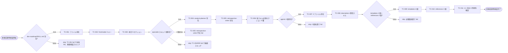
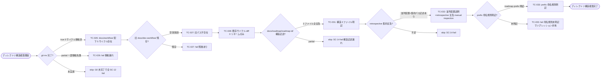
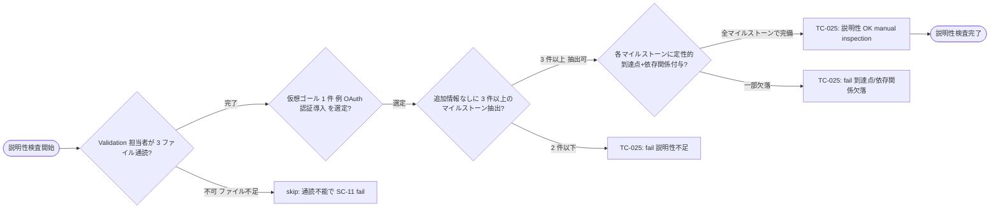

# QA Flow: dev-roadmap スキル新設による戦略層の整備

- **Identifier:** 2026-04-29-add-dev-roadmap-skill
- **Author:** qa-analyst (single instance, post-rollback re-creation)
- **Source:** `qa-design.md` (32 TC)
- **Created at:** 2026-05-01T20:40:00Z
- **Last updated:** 2026-05-01T20:40:00Z
- **Status:** draft

このドキュメントは `qa-design.md` のテストケースを **Mermaid flowchart で可視化**した網羅性確認用の図集。テストの分岐構造をレビュアーが俯瞰できる形で図示することで、認知負荷を下げる。書き方の詳細は `shared-artifacts/references/qa-flow.md` を参照。

## 概要

本サイクルは Markdown / YAML 成果物のみを生み出すドキュメント生成サイクルであり、**実行可能コードに伴う本質ロジック分岐は存在しない**。よって qa-flow.md は「成果物の存在 / 構造 / 意味」を検査軸として 4 つの関心領域に分割する:

- **新規成果物の存在と構造** (SC-1 / SC-2 / SC-3 / SC-4 系) — `dev-roadmap` 系の skill / specialist / agent / テンプレート / reference の有無確認
- **既存成果物の追記整合性** (SC-5 / SC-6 / SC-7 / SC-8 / SC-9 / SC-10 / SC-13 系) — `shared-artifacts/SKILL.md` / `progress.yaml` 関連 / `dev-workflow/SKILL.md` / `README.md` / `specialist-common/SKILL.md` への追記が漏れなく入っているか
- **ディレクトリ構造と命名規則** (SC-12 / SC-14 系 + TC-033) — Step 6 G0 の `git mv` 完了確認、`docs/roadmap/` 構造、retrospective prefix 命名規則
- **説明性 (manual)** (SC-11) — 仮想マイルストーン分解が読者に一意に伝わるか

design.md 確定 4 (Mermaid 記法) に従い、本ファイルでも `graph LR` (DAG 同型 + 既存 task-plan.md パターンと整合) を採用する。各葉ノードには TC-ID または `skip [理由必須]` を配置する。横断的処理 / 実装都合分岐セクションは本サイクル特性上不要のため省略する。

ノード形状の `<` `>` は Mermaid のラベル内で parse 失敗するため、本ファイル内では使用しない (代わりに `lt` `gt` 等で代替、または日本語表記)。

---

## 新規成果物の存在と構造

このセクションがカバーする成功基準: SC-1, SC-2, SC-3, SC-4

`dev-roadmap` 系の新規ファイル群について、(1) ファイルが物理的に存在するか、(2) 期待された frontmatter / 本文セクションを保持しているか、を順に検査する。

---

## 既存成果物の追記整合性

このセクションがカバーする成功基準: SC-5, SC-6, SC-7, SC-8, SC-9, SC-10, SC-13

既存 6 ファイル (`shared-artifacts/SKILL.md` / `templates/progress.yaml` / `references/progress-yaml.md` / `dev-workflow/SKILL.md` / `README.md` / `specialist-common/SKILL.md`) への追記内容と、独立 reference (`references/roadmap-progress-yaml.md`) の必須セクション存在を順に検査する。

```mermaid
graph LR
    Start([既存追記検査開始]) --> Q1{shared-artifacts/SKILL.md 追記?}
    Q1 -->|true| TC12[TC-012: テーブル 4 行追加]
    Q1 -->|false| Skip1[skip: 追記なしで SC-5 fail]
    TC12 --> TC13[TC-013: 1:1 例外リスト 3 件目+件数文言]

    TC13 --> Q2{progress.yaml 関連 2 ファイル更新?}
    Q2 -->|true| TC14[TC-014: roadmap null フィールド存在]
    Q2 -->|false| Skip2[skip: 更新なしで SC-6 fail]
    TC14 --> TC15[TC-015: YAML parseable+roadmap キー]
    TC15 --> TC16[TC-016: references 3 観点 a/b/c]
    TC16 --> TC17[TC-017: 既存サイクル diff 0]

    TC17 --> Q3{dev-workflow/SKILL.md 追記?}
    Q3 -->|true| TC18[TC-018: 開始時段落追加]
    Q3 -->|false| Skip3[skip: 追記なしで SC-7/SC-8 fail]
    TC18 --> TC19[TC-019: 新規セクション独立トップレベル]
    TC19 --> Q4{セクション 5 観点?}
    Q4 -->|all 5 covered| TC20[TC-020: 5 観点 a-e 言及]
    Q4 -->|some missing| TC20F[TC-020: fail 該当観点欠落]
    TC20 --> TC21[TC-021: grep 件数 ≥ 3]

    TC21 --> Q5{README 1 段落?}
    Q5 -->|true| TC22[TC-022: dev-roadmap 段落]
    Q5 -->|false| Skip5[skip: 追記なしで SC-9 fail]

    TC22 --> Q6{references/roadmap-progress-yaml.md 必須セクション?}
    Q6 -->|true| TC23[TC-023: 必須セクション存在]
    Q6 -->|false| Skip6[skip: SC-10 fail]
    TC23 --> TC24[TC-024: 3 観点 何 / いつ / どう書く]

    TC24 --> Q7{specialist-common 列挙更新?}
    Q7 -->|3 名追加| TC29[TC-029: 列挙 12 名]
    Q7 -->|不足| Skip7[skip: SC-13 fail]
    TC29 --> TC30[TC-030: Do NOT use for 列挙更新]
    TC30 --> End2([既存追記検査完了])
```

---

## ディレクトリ構造と命名規則

このセクションがカバーする成功基準: SC-12, SC-14 (および TC-033 = SC なし)

Step 6 G0 の `git mv` 完了確認、`docs/roadmap/<roadmap-id>/` 構造の SKILL.md / shared-artifacts/SKILL.md への記述、retrospective 集約 + prefix 命名規則の明文化を順に検査する。本サイクル特有の機械的タスク (リネーム) の検証が中心。

---

## 説明性 (manual inspection)

このセクションがカバーする成功基準: SC-11

`dev-roadmap/SKILL.md` および `references/roadmap.md` / `milestone.md` を読んだ第三者が、追加情報なしに任意の仮想ゴールから 3 件以上のマイルストーンを抽出できるか、を `manual × inspection` で検証する。

注: TC-025 は `manual × inspection` であり、Validation 担当者の判定は `manual-tests/TC-025.md` 手順書に従って実施する。判定の客観性を担保するため、レビュアー 1 名が同じ手順を踏んで実質的に同等のマイルストーンセット (個数 ≥ 3 / 定性到達点が同種 / 依存方向 DAG 一致) を導出できれば pass、別マイルストーン群が導出されたら原文の説明性に揺らぎがあるとして fail。

---

## 横断的処理 (該当なし)

エラーハンドリング / リトライ / ロギング等の横断的関心は本サイクルの検査対象に含まれない (Markdown / YAML 生成のみ、ランタイム挙動なし)。よって本セクションは省略する。

---

## 実装都合分岐 (Step 4 時点では空)

`TC-IMPL-NNN` は Step 6 で implementer が発見した場合のみ追記される。Step 4 時点 (本ファイル作成時) では空。本サイクルは実行可能コードを伴わず、TC-IMPL-NNN が発生する典型的状況 (ライブラリ仕様で null が返る / OS 依存挙動 等) は理論的に発生しにくいため、Step 6 で発見・追記される TC-IMPL は 0〜数件の範囲を見込む。

