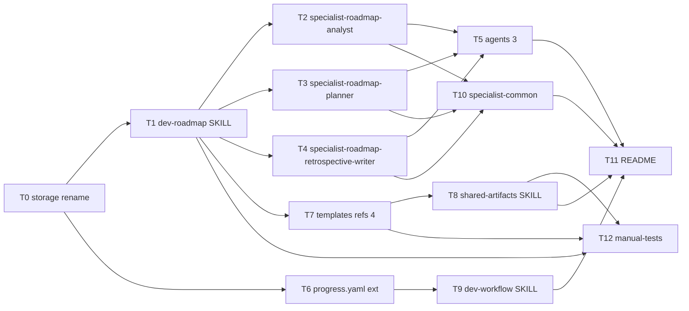

# Task Plan: dev-roadmap スキル新設による戦略層の整備

- **Identifier:** 2026-04-29-add-dev-roadmap-skill
- **Author:** planner (single instance)
- **Source:** `design.md` (revised, 9-step system + Open Questions #1 prefix decision), `intent-spec.md` (revised, 14 success criteria)
- **Created at:** 2026-05-01T22:00:00Z
- **Status:** draft

このドキュメントは **Step 5 で確定する不変な計画書**。Step 6 開始後の状態追跡は `TODO.md` で行い、本ファイルは書き換えない (追加タスクが発生した場合は `TODO.md` 側「後発追加タスク」セクションに追記)。

> **重要 (path 表記)**: 本ファイル内のパス表記は **T0 (保存先リネーム) 完了後の新パス** を前提に記述する (`docs/workflow/<identifier>/` / `docs/roadmap/<roadmap-id>/` / `docs/retrospective/<...>.md`)。本ファイル自身も T0 完了時点で `docs/workflow/2026-04-29-add-dev-roadmap-skill/task-plan.md` に位置する。

## 前提

- Intent Spec は 14 成功基準 (SC-1〜SC-14) を持ち、design.md は 9 ステップ体系および main マージ後の前提崩壊 (4 起因) に追従する改訂版である。
- 本サイクルは Markdown / YAML 成果物のみのドキュメント生成サイクルで、実行可能コードを伴わない。
- 新規 14 ファイル + 既存追記 6 ファイル + T0 リネーム + 検証補助ファイル群で構成される。
- design.md「Task Decomposition への引き継ぎポイント」(L451-533) の Wave 案を planner として確定する。Wave 0 は単独・最初・他全タスクの前提とする。
- テスト方針は `qa-design.md` (TC-001〜TC-033) が真のソース。本 task-plan は TC-ID をタスクに紐付けるのみで、テスト戦略を新たに発明しない。
- 1 タスク = 1 implementer が数時間〜半日で完遂可能な粒度を目安。並列化可能な独立タスクは Wave で明示する。

## タスク一覧

### T0: 保存先ディレクトリの一括リネーム (G0、最優先・必須先行)

- **概要:** 既存 `docs/dev-workflow/` を `git mv` で `docs/workflow/` に一括リネームし、`docs/roadmap/` ディレクトリを新規作成して `.gitkeep` を追加する。本サイクルの全後続タスクの前提となる単独コミットとして先行実施する。リネームのみで内容変更を含めない (`git diff --find-renames -M50%` で `R100%` のみ検出される状態)。
- **成果物:**
  - `docs/dev-workflow/` 配下 5 サイクル分のディレクトリ全体を `docs/workflow/` に移動 (本サイクル含む)
  - `docs/roadmap/.gitkeep` 新規作成
  - 単独コミット (例: `chore(workflow): rename docs/dev-workflow/ → docs/workflow/ and add docs/roadmap/`)
- **依存タスク:** なし
- **並列可否:** no (単独・最初・他全タスクの前提)
- **見積り規模:** S
- **カバーするテストケース ID:** TC-026, TC-027, TC-028 (リネーム完了 + 旧パス不存在 + 内容差分 0)
- **設計ドキュメント参照箇所:** design.md §「Step 6 implementer の最初のタスク (G0: 必須先行)」(L455-465)、intent-spec.md L23 / L75-76

---

### T1: `dev-roadmap/SKILL.md` 新規作成

- **概要:** roadmap 全体の進行プロトコルを定義する Main 用スキル本体を作成する。frontmatter (`name: dev-roadmap` / description / metadata) と本文 (役割定義 / 4 ステップ構造 / ゲート判定 / `dev-workflow` 接続プロトコル / 進捗管理プロトコル / セッション再開時セクション / `docs/roadmap/<roadmap-id>/` 保存構造図 / `docs/retrospective/roadmap-<roadmap-id>.md` prefix 命名規則明記) を含む。再開プロトコルは流用 5 + 修正 3 + 新規 4 (進行中 workflow 確認 / workflow 再開優先 / 次マイルストーン起動可否 / 双方向参照逆引き) を統合的に記述。`dev-roadmap` は `dev-workflow` を能動起動しないという非対称接続を本文で明示する。
- **成果物:** `plugins/dev-workflow/skills/dev-roadmap/SKILL.md` (新規)
- **依存タスク:** T0
- **並列可否:** yes (T6 と並列可)
- **見積り規模:** L
- **カバーするテストケース ID:** TC-001, TC-002, TC-003, TC-031, TC-032, TC-033
- **設計ドキュメント参照箇所:** design.md §「アプローチの概要」(L56-65)、§「再開プロトコル運用 (確定 6)」(L397-419)、§「Open Questions #1」(L539-562)、intent-spec.md SC-1 / SC-11 / SC-14

---

### T2: `specialist-roadmap-analyst/SKILL.md` 新規作成

- **概要:** Step 1 (Roadmap Intent) を担当する Specialist スキルを作成する。frontmatter + 本文 (役割 / 入力 / 手順 / 失敗モード / スコープ外)。`specialist-common` を継承し、`roadmap.md` の Intent セクション初稿および `roadmap-progress.yaml` の初期化 (`roadmap_id` / `title` / `status: planned` / `created_at` / `updated_at` / 空 `milestones: []`) を担う旨を明記。
- **成果物:** `plugins/dev-workflow/skills/specialist-roadmap-analyst/SKILL.md` (新規)
- **依存タスク:** T1
- **並列可否:** yes (T3, T4 と並列可)
- **見積り規模:** M
- **カバーするテストケース ID:** TC-004, TC-006
- **設計ドキュメント参照箇所:** design.md §「コンポーネント構成」(L66-94)、§「初期化と更新の責務分担」(L223-231)、intent-spec.md SC-2

---

### T3: `specialist-roadmap-planner/SKILL.md` 新規作成

- **概要:** Step 2 (Milestone Decomposition) を担当する Specialist スキルを作成する。frontmatter + 本文 (役割 / 入力 / 手順 / 失敗モード / スコープ外)。`milestones/<milestone-id>.md` 群および `roadmap.md` 内のマイルストーン一覧 / 依存グラフ (Mermaid `graph LR`) の作成、`roadmap-progress.yaml.milestones[]` の確定 (`id` / `title` / `status: planned` / `depends_on` / 空 `workflow_identifiers: []` / `notes: null`)、ロードマップ全体 `status: active` 遷移を担う旨を明記。
- **成果物:** `plugins/dev-workflow/skills/specialist-roadmap-planner/SKILL.md` (新規)
- **依存タスク:** T1
- **並列可否:** yes (T2, T4 と並列可)
- **見積り規模:** M
- **カバーするテストケース ID:** TC-004, TC-006
- **設計ドキュメント参照箇所:** design.md §「コンポーネント構成」、§「初期化と更新の責務分担」、§「代替案比較 確定 4 (graph LR 採用)」(L357-358)、intent-spec.md SC-2

---

### T4: `specialist-roadmap-retrospective-writer/SKILL.md` 新規作成 (確定 1 案 C 新設)

- **概要:** Step 4 (Roadmap Retrospective) を担当する Specialist スキルを作成する。frontmatter + 本文 (役割 / 入力 / 手順 / 失敗モード / スコープ外)。`docs/retrospective/roadmap-<roadmap-id>.md` (集約形式 + roadmap- prefix) の作成、配下 dev-workflow `retrospective.md` 群の集約段落化、ロードマップ全体 `status: completed` 遷移を担う旨を明記。`specialist-common` を継承。
- **成果物:** `plugins/dev-workflow/skills/specialist-roadmap-retrospective-writer/SKILL.md` (新規)
- **依存タスク:** T1
- **並列可否:** yes (T2, T3 と並列可)
- **見積り規模:** M
- **カバーするテストケース ID:** TC-005, TC-006
- **設計ドキュメント参照箇所:** design.md §「コンポーネント構成」、§「代替案比較 確定 1 (案 C 採用)」(L347-348)、§「Open Questions #2」(L564-573)、intent-spec.md SC-2

---

### T5: roadmap 系 Agent 定義 3 個の新規作成

- **概要:** `agents/roadmap-analyst.md` / `agents/roadmap-planner.md` / `agents/roadmap-retrospective-writer.md` の 3 ファイルを既存 `agents/qa-analyst.md` の構造を踏襲して作成する。各ファイルに `description:` フィールドおよび「参照スキル」セクション (該当 `specialist-roadmap-*` への明示参照) を含める。3 ファイルは互いに独立しているため、1 タスク内で 3 個まとめて実装する。
- **成果物:**
  - `plugins/dev-workflow/agents/roadmap-analyst.md` (新規)
  - `plugins/dev-workflow/agents/roadmap-planner.md` (新規)
  - `plugins/dev-workflow/agents/roadmap-retrospective-writer.md` (新規)
- **依存タスク:** T2, T3, T4
- **並列可否:** yes (T8, T9, T10 と並列可)
- **見積り規模:** S
- **カバーするテストケース ID:** TC-007, TC-008
- **設計ドキュメント参照箇所:** design.md §「コンポーネント構成」(L72-94)、intent-spec.md SC-3

---

### T6: `progress.yaml` テンプレート + reference 拡張 (`roadmap` ネストブロック)

- **概要:** `templates/progress.yaml` のトップレベルに `roadmap: null` フィールド (コメントで `{id: <roadmap-id>, milestone: {id: <milestone-id>}}` 形式を案内) を追加。あわせて `references/progress-yaml.md` に `roadmap` ネストブロックの 3 観点 ((a) `null` = 独立サイクル、(b) non-null では `roadmap.id` および `roadmap.milestone.id` 必須、(c) `roadmap == null` で `milestone` 単独は不正) を明記する。`templates/progress.yaml` は YAML として parse 可能 (`yq` / `python -c "import yaml"` で検証可能) に保つ。
- **成果物:**
  - `plugins/dev-workflow/skills/shared-artifacts/templates/progress.yaml` (追記)
  - `plugins/dev-workflow/skills/shared-artifacts/references/progress-yaml.md` (追記)
- **依存タスク:** T0
- **並列可否:** yes (T1 と並列可)
- **見積り規模:** S
- **カバーするテストケース ID:** TC-014, TC-015, TC-016
- **設計ドキュメント参照箇所:** design.md §「既存スキルへの最小変更影響表」(L311-330)、§「`roadmap-progress.yaml` スキーマ詳細」(L162-231)、intent-spec.md SC-6

---

### T7: 新規テンプレート/リファレンス 4 セット (roadmap.md / milestone.md / roadmap-progress.yaml / roadmap-retrospective.md)

- **概要:** roadmap 系の新規 template ↔ reference 4 対 (計 8 ファイル) を作成する。各セットでは「テンプレ → リファレンス」の順に作成し、reference 側で書き方ガイド・品質基準・関連成果物との関係を明記する。`roadmap-progress.yaml` ↔ `roadmap-progress-yaml.md` は 1:1 対応の例外 (3 件目)。`references/roadmap-progress-yaml.md` には必須セクション「`dev-workflow` 側からの更新プロトコル」を含め、何を (フィールド) / いつ (タイミング) / どう書くか (遷移ルール / コミット粒度 / 並行サイクル時の競合回避) の 3 観点を全て含む。`references/roadmap.md` は Mermaid `graph LR` 採用と仮想マイルストーン分解の説明性 (SC-11) を確保する記述を含める。`references/milestone.md` には「最終マイルストーン = 統合検証マイルストーン」を配置パターン例として 1 段落程度言及する (intent-spec.md L97 の方針)。`references/roadmap-retrospective.md` には `references/retrospective.md` を参考リファレンスとして指定し、roadmap 文脈固有のセクション (マイルストーン達成度総括 / 依存グラフ妥当性振り返り / 配下 dev-workflow retrospective の集約 / roadmap 固有の改善案) を含める。あわせて `roadmap-` prefix 命名規則 (`docs/retrospective/roadmap-<roadmap-id>.md`) も明記する。
- **成果物:**
  - `plugins/dev-workflow/skills/shared-artifacts/templates/roadmap.md` (新規)
  - `plugins/dev-workflow/skills/shared-artifacts/templates/milestone.md` (新規)
  - `plugins/dev-workflow/skills/shared-artifacts/templates/roadmap-progress.yaml` (新規)
  - `plugins/dev-workflow/skills/shared-artifacts/templates/roadmap-retrospective.md` (新規)
  - `plugins/dev-workflow/skills/shared-artifacts/references/roadmap.md` (新規)
  - `plugins/dev-workflow/skills/shared-artifacts/references/milestone.md` (新規)
  - `plugins/dev-workflow/skills/shared-artifacts/references/roadmap-progress-yaml.md` (新規)
  - `plugins/dev-workflow/skills/shared-artifacts/references/roadmap-retrospective.md` (新規)
- **依存タスク:** T1
- **並列可否:** yes (T2, T3, T4 と並列可。本タスク内では 4 セットを 1 implementer で逐次的に作成。さらに細粒度に分けたい場合は T7 を 4 サブタスクに分割可能だが、reference のスタイル統一のため 1 implementer での実装を推奨)
- **見積り規模:** L
- **カバーするテストケース ID:** TC-009, TC-010, TC-011, TC-023, TC-024, TC-033
- **設計ドキュメント参照箇所:** design.md §「コンポーネント構成」(L72-94)、§「`roadmap-progress.yaml` スキーマ詳細」(L162-231)、§「Open Questions #1 / #2」(L539-573)、intent-spec.md SC-4 / SC-10

---

### T8: `shared-artifacts/SKILL.md` 追記 (成果物一覧テーブル + 1:1 例外リスト + 保存構造 + retrospective 集約 + path 置換)

- **概要:** 既存 `shared-artifacts/SKILL.md` に対し以下を追記/更新する。① 成果物一覧テーブルに 4 行 (`roadmap.md` / `milestone.md` / `roadmap-progress.yaml` / `roadmap-retrospective.md` 相当行) を追加。Phase / Step 列は `dev-roadmap Step 1` / `Step 2` / `Step 1-4` / `Step 4` の prefix 付き表記。② 1:1 対応の例外リスト「これら 2 件以外で...」を「これら 3 件以外で...」に変更し、`roadmap-progress.yaml` ↔ `roadmap-progress-yaml.md` を 3 件目として追記。③ 保存構造セクションに新規見出し `### roadmap 作業ディレクトリ` を `### サイクル作業ディレクトリ` の直後に追加し、`docs/roadmap/<roadmap-id>/` 配下構造を図示。`docs/workflow/<identifier>/` と並列配置である旨を明記。④ Retrospective (Step 9 成果物) の説明に roadmap retrospective が同じ集約ディレクトリ `docs/retrospective/roadmap-<roadmap-id>.md` に保存される旨を 1 段落で追記。⑤ 本文中の `docs/dev-workflow/` 表記 (約 9 箇所) を `docs/workflow/` に一括置換。
- **成果物:** `plugins/dev-workflow/skills/shared-artifacts/SKILL.md` (追記/置換)
- **依存タスク:** T7
- **並列可否:** yes (T5, T9, T10 と並列可)
- **見積り規模:** M
- **カバーするテストケース ID:** TC-012, TC-013, TC-031, TC-032
- **設計ドキュメント参照箇所:** design.md §「既存スキルへの最小変更影響表」(L323-327)、intent-spec.md SC-5 / SC-14

---

### T9: `dev-workflow/SKILL.md` 追記 (起動時連携 + roadmap-progress.yaml 更新プロトコル + path 置換)

- **概要:** 既存 `dev-workflow/SKILL.md` に対し以下を追記/更新する。① 「ワークフロー開始時」セクションのステップ 4 (`progress.yaml` 初期化) と 5 (Step 1 着手) の間に **ステップ 4'「roadmap 配下サイクルの追加初期化」** 段落を挿入 (`<roadmap-id>` / `<milestone-id>` 指定時の `roadmap` ブロック初期化、`roadmap-progress.yaml` の `planned → active` 遷移、`workflow_identifiers[]` 追記、独立サイクルでの `null` デフォルト時のスキップ規則を明記)。② 「ステップ完了時のコミット規約」セクション末尾と「並列起動のガイドライン」の間に**独立トップレベル `##` 新規セクション「`roadmap-progress.yaml` 更新プロトコル」**を挿入。本文には設計方針 (最小限の責務) / 適用条件 (e) / 更新タイミング (a) サイクル開始時・(c) サイクル完了時 (= **Step 9 Retrospective** 完了時) / (b) 各ステップ完了時の進捗サマリ反映を「scope out 明記」/ (d) コミット粒度 / 並行サイクル時の競合回避を含める。`roadmap-progress.yaml` の言及件数が `grep -nF` で 3 件以上 (実際は 7 件以上見込み) になるよう構成する。③ 本文中の `docs/dev-workflow/` 表記 (約 21 箇所) を `docs/workflow/` に一括置換。コミットスコープ表記 `docs(dev-workflow/<identifier>): ...` はスキル名なので維持 (path 表記のみ置換)。
- **成果物:** `plugins/dev-workflow/skills/dev-workflow/SKILL.md` (追記/置換)
- **依存タスク:** T6
- **並列可否:** yes (T5, T8, T10 と並列可)
- **見積り規模:** L
- **カバーするテストケース ID:** TC-018, TC-019, TC-020, TC-021
- **設計ドキュメント参照箇所:** design.md §「`dev-workflow/SKILL.md` への追記内容草稿」(L233-309)、§「既存スキルへの最小変更影響表」(L317-319)、intent-spec.md SC-7 / SC-8

---

### T10: `specialist-common/SKILL.md` 追記 (Specialist 列挙 + Do NOT use for + path 置換)

- **概要:** 既存 `specialist-common/SKILL.md` に対し以下を追記/更新する。① frontmatter description 内の Specialist 列挙 (現状 9 specialists: `intent-analyst, researcher, architect, qa-analyst, planner, implementer, reviewer, validator, retrospective-writer`) に roadmap 系 3 名 (`roadmap-analyst, roadmap-planner, roadmap-retrospective-writer`) を追加して計 **12 specialists** に更新。本文中で「9 specialists」「9 個」等の数値表記があれば「12 specialists」「12 個」に同期更新。② frontmatter description 内の `Do NOT use for` 列挙にも roadmap 系 3 個 (`specialist-roadmap-analyst / specialist-roadmap-planner / specialist-roadmap-retrospective-writer`) を追加。③ 本文中の `docs/dev-workflow/` 表記 (2 箇所、L72 / L94 相当) を `docs/workflow/` に置換。**qa-analyst は main マージで既に追加済のため対象外、self-reviewer は main マージで削除済のため復元しない**。
- **成果物:** `plugins/dev-workflow/skills/specialist-common/SKILL.md` (追記/置換)
- **依存タスク:** T2, T3, T4
- **並列可否:** yes (T5, T8, T9 と並列可)
- **見積り規模:** S
- **カバーするテストケース ID:** TC-029, TC-030
- **設計ドキュメント参照箇所:** design.md §「既存スキルへの最小変更影響表」(L320-322)、§「qa-analyst 同時修正の正当化 (確定 2 改訂版)」(L332-338)、intent-spec.md SC-13

---

### T11: `plugins/dev-workflow/README.md` 追記

- **概要:** README の概要セクション末尾に `dev-roadmap` スキルの存在および「1 サイクル超の大規模開発を束ねる戦略層」としての位置づけを 1 段落以上で追記する。`dev-workflow` (戦術層) との関係も短く触れる。
- **成果物:** `plugins/dev-workflow/README.md` (追記)
- **依存タスク:** T5, T8, T9, T10
- **並列可否:** no (収束タスク、最後に配置)
- **見積り規模:** S
- **カバーするテストケース ID:** TC-022
- **設計ドキュメント参照箇所:** design.md §「既存スキルへの最小変更影響表」(L330)、intent-spec.md SC-9

---

### T12: 検証用 manual-tests 手順書 (TC-025 / TC-032)

- **概要:** Step 8 Validation で使用する手動目視検査の手順書を 2 件作成する。① `manual-tests/TC-025.md`: 仮想マイルストーン分解の説明性検証 (SC-11)。Validation 担当者が任意の仮想ゴール (例: "OAuth 認証導入") を選び、`dev-roadmap/SKILL.md` / `references/roadmap.md` / `references/milestone.md` の 3 ファイルのみを参照して、30 分以内に 3 件以上のマイルストーン候補と依存関係を紙に書き出せる手順 (a)〜(d) を具体的に記述。② `manual-tests/TC-032.md`: 並列配置 + retrospective 集約言及の目視検証 (SC-14)。`dev-roadmap/SKILL.md` および `shared-artifacts/SKILL.md` の 2 ファイル通読により、(a) 並列配置の図示/説明、(b) `docs/retrospective/<集約名>` への保存記述、(c) `roadmap-` prefix 命名規則の明記、の 3 点を判定する手順を記述。両ファイルともリネーム後パス `docs/workflow/2026-04-29-add-dev-roadmap-skill/manual-tests/` 配下に配置。
- **成果物:**
  - `docs/workflow/2026-04-29-add-dev-roadmap-skill/manual-tests/TC-025.md` (新規)
  - `docs/workflow/2026-04-29-add-dev-roadmap-skill/manual-tests/TC-032.md` (新規)
- **依存タスク:** T1, T7, T8 (検証対象ファイルが揃ってから手順を fix できるため)
- **並列可否:** yes (T11 と並列可)
- **見積り規模:** S
- **カバーするテストケース ID:** TC-025 (本タスクは TC-025 / TC-032 の手順書実体を生成する。手順実行は Step 8 で別途行う)
- **設計ドキュメント参照箇所:** qa-design.md §「自動 vs 手動の判断方針」(L37-65)、TC-025 / TC-032 の row、design.md §「留意事項」(L524-533)

---

## 依存グラフ

## 並列実行可能グループ

Step 6 で Main が並列起動単位として参照する Wave。**最大並列数は Wave 2 の 4 タスク**。

- **Wave 0 (起点・必須先行):** T0
  - T0 が完了するまで他のいかなるタスクも開始しない。
- **Wave 1 (T0 完了後、並列 2):** T1, T6
  - T1 (dev-roadmap SKILL) と T6 (progress.yaml ext) は互いに独立し、ともに T0 のみに依存する。
- **Wave 2 (T1 完了後、並列 4):** T2, T3, T4, T7
  - 3 つの specialist-roadmap-* と templates/references 4 セットは互いに独立した別ファイル群を編集するため並列実装可能。T7 内 4 セットのスタイル統一を意識する場合は 1 implementer で逐次実装、細粒度化したい場合は T7a〜T7d に分割可能 (本計画では 1 タスクで保持)。
- **Wave 3 (Wave 2 完了後、並列 4):** T5, T8, T9, T10
  - T5 は T2/T3/T4 完了を待つ、T8 は T7 完了、T9 は T6 完了 (Wave 1 で完了済)、T10 は T2/T3/T4 完了を待つ。本 Wave で並列実行可能。
- **Wave 4 (Wave 3 完了後、並列 2):** T11, T12
  - T11 は T5 / T8 / T9 / T10 のすべての完了を待つ収束タスク、T12 は T1 / T7 / T8 完了で着手可能 (Wave 3 完了時点で全条件成立)。最後に並列実行。

### Wave 別の見積り規模 (S=Small / M=Medium / L=Large の合算)

| Wave   | タスク             | 規模合計      | 想定並列効果 |
| ------ | ------------------ | ------------- | ------------ |
| Wave 0 | T0 (S)             | S             | -            |
| Wave 1 | T1 (L), T6 (S)     | L+S           | 並列 2       |
| Wave 2 | T2-T4 (3M), T7 (L) | 3M+L          | 並列 4       |
| Wave 3 | T5 (S), T8 (M), T9 (L), T10 (S) | 2S+M+L | 並列 4       |
| Wave 4 | T11 (S), T12 (S)   | 2S            | 並列 2       |

## リスク / 想定される Blocker

- **R1 (T0 起因の path 整合性破綻):** リネーム後の path に既存ドキュメントが追従しないと、後続タスクの参照が壊れる。緩和策: T0 のコミットは `git mv` のみで内容変更を含めない。本文中 path 置換は T8 / T9 / T10 で機械的に実施し、T0 では一切触れない。Step 8 Validation で `ggrep -rn "docs/dev-workflow" plugins/dev-workflow/` を実行して残存箇所が 0 件 (もしくは意図的歴史的記述のみ) であることを確認する (TC-027 / TC-028 関連)。
- **R2 (T9 grep 件数不足):** SC-8 が要求する `roadmap-progress.yaml` 言及 ≥ 3 件を実装後に下回るリスク。緩和策: design.md L309 で 7 件以上を見込む構成 (見出し + 設計方針 + 適用条件 + 更新タイミング表 + scope out 説明 + コミット粒度 + 競合回避) を踏襲し、T9 完了時に implementer 自身が `grep -nF "roadmap-progress.yaml" plugins/dev-workflow/skills/dev-workflow/SKILL.md` を実行して件数を自己検証する (TC-021)。
- **R3 (T10 列挙数の整合崩れ):** Specialist 列挙を 9 → 12 に更新する際、本文中の「9 specialists」「9 個」表記の更新漏れが発生するリスク。緩和策: T10 着手時に `ggrep -nE "9\s*specialists?|9\s*(個|名)" plugins/dev-workflow/skills/specialist-common/SKILL.md` を実行して全箇所を洗い出し、frontmatter description / 本文を一括更新する (TC-029)。
- **R4 (T7 における 1:1 例外の数え間違い):** SC-5 / TC-013 が要求する「3 件」(既存 2 件 + 新規 1 件) の文言更新が漏れるリスク。緩和策: T8 着手時に `ggrep -nE "(これら|以下の)?\s*2\s*(件|つ)" plugins/dev-workflow/skills/shared-artifacts/SKILL.md` で旧表記を洗い出し、3 件目の追記と同時に文言を更新する (TC-013)。
- **R5 (T7 reference の品質基準逸脱):** templates と references の対応表記揺れにより、reference の品質基準 (`shared-artifacts/references/qa-design.md` 同等の構造性) を満たさないリスク。緩和策: T7 implementer は既存 `references/qa-design.md` / `references/retrospective.md` を参考リファレンスとして読み込み、セクション構成を踏襲する (TC-009 / TC-010 / TC-011 / TC-023 / TC-024)。
- **R6 (Wave 2 の T7 並列負荷):** T7 は 8 ファイル一括作成のため、見積り L が想定を超えて Wave 2 全体の完了が遅れる可能性。緩和策: 必要に応じて T7 を T7a (roadmap.md ↔ ref) / T7b (milestone.md ↔ ref) / T7c (roadmap-progress.yaml ↔ ref) / T7d (roadmap-retrospective.md ↔ ref) の 4 サブタスクに分割し並列化する (Step 6 開始時に Main が判断、`TODO.md` で運用)。
- **R7 (T12 手順書の検証対象未確定):** T12 は T1 / T7 / T8 完了を前提とするが、これらの実装途中で SKILL.md / reference のセクション名が変動する可能性。緩和策: T12 は Wave 4 配置として最終段階で着手し、確定済みセクション名に基づいて手順を記述する。
- **R8 (T0 と本サイクル成果物の path 移動による作業中断):** T0 リネーム実行時、本サイクル成果物 (本 task-plan.md 含む) も `docs/dev-workflow/2026-04-29-add-dev-roadmap-skill/` → `docs/workflow/2026-04-29-add-dev-roadmap-skill/` に移動する。Step 6 implementer は移動後のパスで以降の作業を継続する旨を Main の TODO.md 冒頭で明記する (Step 5 完了報告にも残す)。
- **R9 (Self-Review 統合済みに対する旧情報残存):** main マージで Self-Review が External Review に統合されたが、過去版の design / qa-design / 本 task-plan が誤って Self-Review 関連タスクを含む場合のリスク。緩和策: 本 task-plan は Self-Review 関連タスクを含まないことを明示 (本注記)。Step 6 implementer も Self-Review 関連の追加タスクを発生させない。
- **R10 (T11 README の位置づけ表現が SC-9 grep に引っかからない):** TC-022 が要求する「(戦略層|大規模|複数の.*サイクル|束ねる)」のいずれかを含む文言が記述から欠落するリスク。緩和策: T11 implementer は intent-spec.md L21 の目的引用文 (戦略層 / 複数の dev-workflow サイクル / 束ねる) を README 内でほぼそのまま参照する。

## 留意事項 (Step 6 実行時の前提)

- 本 task-plan は **不変な計画書** として扱う。Step 6 開始後に発生する追加タスク (実装中発見) は `TODO.md` 側の「後発追加タスク」セクションでのみ管理する (本ファイル本体は書き換えない)。
- T0 完了後、本 task-plan を含むサイクル成果物のパスは `docs/workflow/2026-04-29-add-dev-roadmap-skill/` に移動する。Step 6 開始時に Main が `TODO.md` を生成する場所もリネーム後パス。
- 既存サイクル (例: `docs/workflow/2026-04-26-add-qa-design-step/progress.yaml`) は内容変更しない (T0 でリネームのみ実施、SC-12 / TC-017 / TC-026 〜 TC-028)。
- 本サイクルは Self-Review が External Review に統合済 (9 ステップ体系) のため、Step 7 Self-Review に関するタスクは作らない (R9 関連)。
- 各タスク完了時のコミット粒度は `dev-workflow/SKILL.md` の「ステップ完了時のコミット規約」に従い、明示的なファイルパス指定でステージする (`git add -A` / `git add .` 禁止、specialist-common Git ガードレール)。
- ドキュメント言語: 既存パターンに倣い、本文は日本語、frontmatter / 見出しキーワード / コードブロックは英語混在を許容 (Research existing-skill-structure F-1)。

## カバレッジ確認 (qa-design.md TC-001〜TC-033)

| TC-ID  | カバータスク | 備考                                          |
| ------ | ------------ | --------------------------------------------- |
| TC-001 | T1           | dev-roadmap SKILL 存在                        |
| TC-002 | T1           | frontmatter キー                              |
| TC-003 | T1           | 必須セクション 5 種                           |
| TC-004 | T2, T3       | specialist 2 個存在                           |
| TC-005 | T4           | specialist-roadmap-retrospective-writer 存在  |
| TC-006 | T2, T3, T4   | 必須セクション 4 種                           |
| TC-007 | T5           | agents 3 個存在                               |
| TC-008 | T5           | description / 参照スキル                      |
| TC-009 | T7           | templates 4 個存在                            |
| TC-010 | T7           | references 4 個存在                           |
| TC-011 | T7           | 1:1 対応 + 例外 3 件                          |
| TC-012 | T8           | 成果物一覧 4 行追加                           |
| TC-013 | T8           | 1:1 例外リスト 3 件目                         |
| TC-014 | T6           | `roadmap: null` フィールド                    |
| TC-015 | T6           | YAML parseable                                |
| TC-016 | T6           | reference 3 観点                              |
| TC-017 | T0           | 既存 progress.yaml diff 0                     |
| TC-018 | T9           | ワークフロー開始時段落                        |
| TC-019 | T9           | 新規セクション存在                            |
| TC-020 | T9           | 5 観点 (a/b/c/d/e)                            |
| TC-021 | T9           | grep ≥ 3 件                                   |
| TC-022 | T11          | README 段落                                   |
| TC-023 | T7           | references 必須セクション                     |
| TC-024 | T7           | references 3 観点                             |
| TC-025 | T12          | 仮想マイルストーン分解 (手順書)               |
| TC-026 | T0           | 既存 5 サイクル mv 完了                       |
| TC-027 | T0           | 旧 docs/dev-workflow/ 不存在                  |
| TC-028 | T0           | 既存サイクル diff 0                           |
| TC-029 | T10          | Specialist 列挙 12 名                         |
| TC-030 | T10          | Do NOT use for 列挙更新                       |
| TC-031 | T1, T8       | docs/roadmap/ 構造記述                        |
| TC-032 | T1, T8, T12  | 並列配置 + 集約言及 (手順書)                  |
| TC-033 | T1, T7       | prefix 命名規則明記                           |

全 33 TC が少なくとも 1 つのタスクでカバーされていることを確認。
