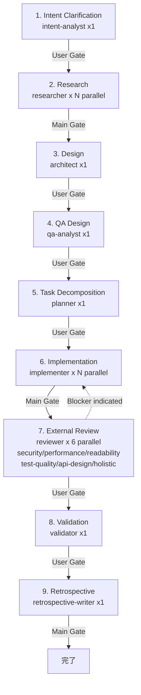
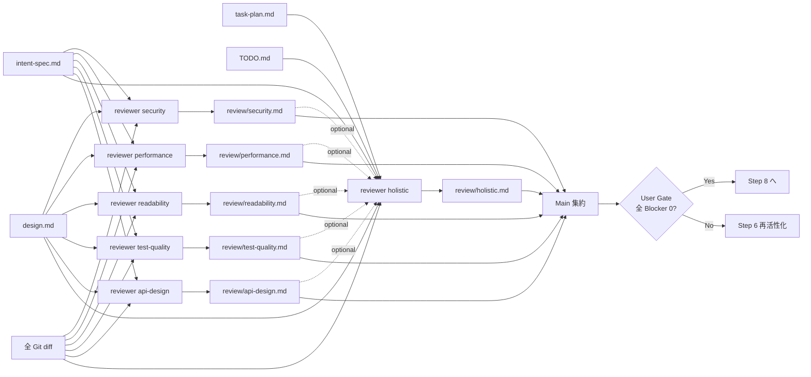

# Design Document: Integrate Self-Review (Step 7) into External Review

- **Identifier:** 2026-04-29-integrate-self-review-into-external
- **Author:** architect (Specialist instance #1)
- **Created at:** 2026-04-29T14:00:00Z
- **Last updated:** 2026-04-29T14:00:00Z
- **Status:** draft

## 設計目標と制約

### 目的（Intent Spec より）

> `dev-workflow` プラグインから Step 7 Self-Review を撤廃し、その責務を Step 7（旧 Step 8）External Review の `reviewer` 群に統合した 9-step 構成に再整理する。`specialist-self-reviewer` スキル / `agents/self-reviewer.md` / `shared-artifacts` の `self-review-report.md` 関連 (template + reference) を削除し、外部レビューが「観点別深掘り」と「全体整合性チェック（旧 Self-Review の役割）」を兼ねる形にスキル本文を更新する。プラグインを横断的に grep して旧 Step 番号と self-review 表記の残存をゼロにし、別セッションのユーザーが新フローのみで作業を継承できる状態にする。

### 主要成功基準（Intent Spec から抜粋、本設計が満たすべき外形条件）

- 削除確認 4 件（`specialist-self-reviewer/` ディレクトリ非存在、`self-reviewer.md` agent 非存在、`self-review-report.md` template / reference 非存在）
- 残存表記の根絶 4 件（`self[-_]review|Self-Review` 0 件、`self-reviewer|specialist-self-reviewer` 0 件、`Step 10` 0 件、`Step 9 (Validation)|Step 10 (Retrospective)` 0 件、いずれも `plugins/dev-workflow/` 配下）
- 構造的完全性 5 件（`dev-workflow/SKILL.md` のステップ一覧 9 行、ロールバック早見表に新 Step 7/8/9 エントリ、`specialist-reviewer/SKILL.md` 本文に「全体整合性」キーワード、`shared-artifacts/SKILL.md` 成果物一覧連番、`progress.yaml` から `self_review:` フィールド削除）
- メタ整合性 4 件（README 9-step 反映、`plugin.json` description 9-step、`agents/` 配下 9 ファイル、クロスリファレンスのリンク切れ非発生）

### 主要制約（Intent Spec より）

- 全ファイルは Markdown / JSON / YAML のみ（実行コード非該当）
- ステップ番号置換は順序依存。`Step 10 → 9`、`Step 9 → 8`、`Step 8 → 7` を **降順で** 置換しないと連鎖二重置換が発生
- macOS 環境のため `gsed` を使用（`macos-cli-rules` 準拠）
- 複合表現（`Step 6 ↔ Step 7` 等）と ASCII 図枠線数字は機械的一括置換せず、`gsed` の placeholder 戦略 + Edit ハイブリッドで処理
- agent / skill の frontmatter `description` は 250 文字程度の制約あり
- 過去サイクル成果物 (`docs/dev-workflow/2026-04-*/`) は遡及修正禁止
- 既存 ADR `docs/adr/2026-04-26-dev-workflow-rename-and-flatten.md` のフラット構造を維持
- `dev-workflow` の基本方針（Main-Centric / One-Shot / Gate-Based / Artifact-Driven / Project-Rule Precedence）は全継承

> **Intent Spec L169 typo 注記:** Intent Spec L169 には ADR パスが `doc/adr/2026-04-26-dev-workflow-rename-and-flatten.md` と記載されているが、実際のディレクトリは `docs/adr/` (s 付き)。本設計では正しいパスで参照する。Step 6 Implementation で Intent Spec への影響は無く、ADR を直接編集対象とはしない（参照のみ）。

## アプローチの概要

本サイクルは「Self-Review を独立ステップとして残すコスト対効果に疑問」という直前サイクル retrospective の定量分析（Round 2 Self-Review = Medium 4 件、Round 3 External Review = 13/16 件修正）を踏まえ、Self-Review の責務を **External Review 内に専用観点 `holistic` として明示的に吸収する** 形で構造を再編する。

設計の核は以下の 3 点に集約される:

1. **責務の物理的吸収**: 旧 Self-Review が担っていた「全体俯瞰 / Task Plan 完了判定 / Intent Spec 成功基準充足見込み / 明白な bug」を、External Review に新設する `holistic` 観点 reviewer の専任責務として移植する。観点を増やすことで責務が単一インスタンスに集約され、漏れ・重複が抑制される（Research Note `reviewer-scope-merge` の案 B 推奨を採用）。
2. **深刻度ラベルの統一**: 旧 Self-Review の `High/Medium/Low` を全廃し、External Review の `Blocker/Major/Minor` に一本化。既存 5 観点 reviewer の本文・テンプレートが既に Blocker/Major/Minor を採用しているため、改修コストが最小。一律の語彙でループ運用・ロールバック早見表・TODO.md の `re_activations` 文言が統一できる。
3. **降順機械置換 + placeholder + Edit のハイブリッド**: ステップ番号繰り上げは `Step 10 → 9 → 8 → 7` の降順で gsed 実行（連鎖二重置換を避ける）。複合表現（`Step 6 ↔ Step 7` / `Step 6〜7` / `Step 6/7` / `Step 1〜5` / `Step 1〜3`）は事前に placeholder 化。ASCII 図・テーブル・大規模セクションは Edit ツールで文脈ごと書き換え。前例サイクル `2026-04-26-add-qa-design-step` で確立された手法を継承する。

なぜこのアプローチか — 本変更は「責務の再配置 + 表記揺れの全消し + ステップ番号繰り上げ」が同時並行で起きる **メタサイクル** であり、機械置換だけでは知見を失い、Edit だけでは作業量が爆発する。ハイブリッドにすることで前例サイクルが既に検証済みの安全帯（B-1〜B-4 アンチパターン回避）を再利用できる。

## コンポーネント構成

### 9-step 構成の全体図（新フロー）



### Step 7 ループ構造の新運用版

旧 `Step 6 ↔ Step 7` の Self-Review 単体ループ（reviewer B1 単一インスタンス）から、**N 並列 reviewer + holistic** 構成のループに再構築する。

```
[Step 6 活性化] implementer A1..AN 並列
    ↓ Exit Criteria 満たす
[Step 6 完了] implementer A1..AN 役割終了
    ↓
[Step 7 活性化] reviewer B1..B6 並列起動
   (security / performance / readability / test-quality / api-design / holistic)
    ↓
   各 reviewer が観点別 Review Report 生成
    ↓
   全 reviewer の Blocker 件数を Main が集約
    ├── 全観点 Blocker 0 件 ─────→ User Gate → Step 8 へ (B1..B6 役割終了)
    └── いずれか観点で Blocker 検出
              ↓
        [Step 6 再活性化]
        該当タスクを TODO.md で in_progress に戻し re_activations++
        新規 implementer C1..Ck を起動 (B1..B6 は Step 7 継続維持)
        修正 diff コミット
              ↓
        [Step 6 再完了] C1..Ck 役割終了
              ↓
        既存 B1..B6 が再レビュー (Round 2)
              ↓
        Round N に進む or 全観点 Blocker 0 → User Gate
```

**ループ上限**: 同一 Round で全 reviewer 群の合計 Blocker 数が 3 周連続して 0 にならない、または同一指摘が 3 周以上再発する場合、設計レベルの問題を疑い Step 3 へロールバック検討。Main が判断し、In-Progress ユーザー問い合わせで承認を得る。

### 削除 / 更新 / 新規追加の影響マップ

| 種別 | 件数 | 詳細 |
| ---- | ---- | ---- |
| 削除（`git rm`） | 4 件 | `skills/specialist-self-reviewer/SKILL.md` / `agents/self-reviewer.md` / `shared-artifacts/templates/self-review-report.md` / `shared-artifacts/references/self-review-report.md` |
| 更新（Edit） | 約 24 件 | `dev-workflow/SKILL.md`（最大）、`specialist-reviewer/SKILL.md`、`shared-artifacts/SKILL.md`、`shared-artifacts/templates/{progress.yaml, TODO.md, retrospective.md, implementation-log.md}`、`shared-artifacts/references/{progress-yaml.md, todo.md, retrospective.md, review-report.md, implementation-log.md, intent-spec.md, qa-design.md, qa-flow.md, validation-report.md}`、その他 specialist skill / agents / README / plugin.json |
| 新規追加 | 0 件 | （観点 `holistic` は既存 `<aspect>` enum に追加するのみで新規ファイル不要） |

詳細マッピングは Research Note `self-review-references.md` および `step-renumber-map.md` を参照。

### 主要な型・インターフェース

#### `<aspect>` enum の拡張

```text
// 旧
type Aspect = "security" | "performance" | "readability" | "test-quality" | "api-design" | <project-specific>

// 新
type Aspect = "security" | "performance" | "readability" | "test-quality" | "api-design" | "holistic" | <project-specific>
```

#### `holistic` reviewer の責務契約

```text
HolisticReviewer responsibilities (旧 Self-Review の核を完全継承):
  1. cross-cutting consistency      // 観点を横断する整合性 (モジュール A/B 命名衝突 等)
  2. task-plan completion check     // TODO.md と diff 突合、未実装タスク検出
  3. intent-spec coverage outlook   // 「満たす見込み / 懸念あり / 未達の恐れ」三段評価
  4. obvious bug detection (markdown版): リンク切れ / template-reference 不整合 / frontmatter スキーマ違反
  5. modification round history     // Round 単位 Blocker 件数推移の記録 (review-report.md 内)

入力: 全 Git コミット履歴と diff、design.md、intent-spec.md、task-plan.md、TODO.md（必須）
他 reviewer の出力: 任意参照（Round 2 以降のクロスチェックで利用可、Round 1 は独立並列）
```

#### 深刻度ラベル統一マッピング

```text
旧 Self-Review (High/Medium/Low) → 新 External Review (Blocker/Major/Minor)

旧 High  → Blocker  // ただし「Step 6 進行不可」相当で、リリース阻害級
                  // (Task Plan 未実装 / Intent Spec 成功基準未達の恐れ / null 参照クラス bug)
旧 High  → Major    // 「修正必須だが Step 7 内議論で吸収可能」のケース
                  // (テスト網羅不足 / エラーハンドリング甘さ / 中規模 design 整合性違反)
旧 Medium → Major    // 「修正推奨、ユーザー承認前に議論」と一致
旧 Low    → Minor    // 「記録のみ、改善提案レベル」と一致

判定ガイドライン (review-report.md reference に追記):
  - Validation で確実に止まる → Blocker
  - Intent Spec 成功基準未達の恐れ → Blocker
  - Task Plan 未実装タスクの残存 → Blocker
  - 設計レベルの大幅逸脱 (design.md と diff 矛盾) → Blocker
  - テスト網羅不足、エラーハンドリング甘さ → Major
  - 命名 / コメント品質 / 微細な可読性 → Minor
  - 改善提案レベル (現状動作に問題なし) → Minor
```

#### `progress.yaml` 構造変更

```yaml
artifacts:
  intent_spec: null
  research: []
  design: null
  qa_design: null
  qa_flow: null
  external_adrs: []
  task_plan: null
  todo: null
  # self_review: null    ← 削除
  review: []             # review/<aspect>.md のリスト (holistic.md を含む可能性あり)
  validation: null
  retrospective: null
```

`review:` のリスト構造は維持。`holistic.md` も他観点と同列に並ぶ単一エントリとして扱う（別フィールド分離は不採用、Research Note `reviewer-scope-merge` I7 推奨に従う）。

#### `re_activations` カウンタ意味の更新

```text
旧 (TODO.md template / references/todo.md):
  re_activations: <Self-Review High 指摘で Step 6 に戻った回数>

新:
  re_activations: <External Review Blocker 指摘で Step 6 に戻った回数>
```

`Major` は Step 6 への差し戻しを必須としない（Step 7 内 Round 進行で議論吸収可）ため、再活性化トリガから除外。`Blocker` のみが再活性化トリガとなる運用を `dev-workflow/SKILL.md` の Step 7 セクションに明記する。

## データフロー / API 設計

本サイクルは API を伴わない（Markdown スキル整備のみ）。代わりに Step 7 内の **情報フロー** を以下に記述する。

### Step 7 内の情報フロー



**holistic reviewer の他 reviewer 出力参照ルール（重要）**:

- **Round 1**: 純粋に並列。他 reviewer の出力を待たず独立に diff を読む。
- **Round 2 以降**: 任意で他 reviewer の Round 1 出力を参照可（重複指摘の特定・クロスリファレンス目的）。ただし他 reviewer の指摘を holistic 側で再度書き起こすのは禁止（責務重複の温床）。

### スコープ重複時の Main 集約運用

複数 reviewer が同一問題を異なる観点で指摘した場合、Main が以下の優先順位で集約する:

1. **より具体的な観点** が一次責任を持つ（例: 認証バグは security が一次、holistic はクロスリファレンスのみ）
2. **holistic 専属の指摘** は他観点に再分類できないもののみ（Task Plan 未実装、Intent Spec 充足見込み、観点跨ぎの整合性問題）
3. **重複指摘** は `progress.yaml.review` に集約サマリを記録し、各 review report の「他レビューとの整合性」セクションでクロスリファレンス

## 代替案と採用理由

### 代替案 1: 「全体整合性観点」の配置方式

| 案 | 概要 | 採用 / 却下 | 理由 |
| --- | --- | ----------- | ---- |
| **A. 6 観点目 `holistic` を追加 (推奨)** | 既存 5 観点 + holistic を 1 名追加。N=6 並列。Self-Review 役割を holistic reviewer が完全継承 | **採用** | 責務が単一インスタンスに明確に集約され、Intent Spec 成功基準 #11 「全体整合性キーワードが grep で検出」を自然に満たす。Specialist 命名は `specialist-reviewer` のままで `<aspect>` enum に追加するだけ。Markdown 並列コストは線形のため +1 並列の負荷は軽微 |
| B. 既存 5 観点の各 reviewer 本文に「全体整合性も検出する」を追記 | 5 名の全員が観点 + 全体整合性を兼任 | 却下 | 「全体整合性は誰が一次責任か」が分散し、漏れと重複を同時に生む。旧 Self-Review が解決していた問題が部分的に戻る。Intent Spec 成功基準 #11 を満たすには本文表現が冗長になる |
| C. 5 + 1（lead reviewer が観点間を統合） | lead-reviewer 新 Specialist を 1 体追加。他 5 reviewer 完了後に統合レポート作成 | 却下 | Intent Spec 非スコープ「新たな Specialist の追加」(L113) に抵触。Sequential Workflow が混入し純粋並列が崩れる |

**採用案 A の補足**:

- `holistic` 命名は `consistency` / `integration` / `cross-cutting` の代替候補があったが、「全体俯瞰 + 整合性 + bug 検出 + 充足見込み判定」を最もよく総括する単一語として `holistic` を採用。`<aspect>` enum 内で他観点（security / performance 等）と並んだ際の自然な英語。
- holistic reviewer は **Round 1 では他 reviewer の出力を読まず独立並列**（純粋並列性維持）。Round 2 以降のみクロスリファレンス目的で任意参照可。Intent Spec の「Sequential Workflow 混入禁止」スコープに整合する。

### 代替案 2: 深刻度ラベルの統合

| 案 | 概要 | 採用 / 却下 | 理由 |
| --- | --- | ----------- | ---- |
| **A. Blocker/Major/Minor に統一 (推奨)** | External Review 側のラベルに統一、Self-Review の High/Medium/Low は廃止 | **採用** | 削除対象は Self-Review 側のため改修最小。既存 `specialist-reviewer` / `references/review-report.md` / `templates/review-report.md` / Step 8 セクション全てが Blocker/Major/Minor を使用済み。Gate 判定 `approved/needs_fix/blocked` と `Blocker` の対応が直接的 |
| B. High/Medium/Low に統一 | Self-Review 側のラベルを残し External Review 側を書き換え | 却下 | 改修ファイル数が激増（既存 5 観点 reviewer 全てと dev-workflow/SKILL.md / templates / references で書き換え必要）。Gate semantic との対応も緩い |
| C. 5 段階ラベル新設（Critical/High/Medium/Low/Info） | より細かい粒度で表現 | 却下 | スコープ外（Intent Spec 非スコープ「External Review 観点の再定義」に近接）。実用上 3 段階で十分との既存実績あり |

**採用案 A の補足 — 一律変換禁止規則**:

- 旧 High → Blocker / Major のマッピングは **指摘内容で再判定**。「Validation で止まる」「Intent Spec 成功基準未達」「Task Plan 未実装」は Blocker、「テスト網羅不足」「エラーハンドリング甘さ」は Major と振り分ける。
- マッピング表は `references/review-report.md` の「深刻度の判定基準」表に追記する（後述）。

### 代替案 3: External Review ループ運用

| 案 | 概要 | 採用 / 却下 | 理由 |
| --- | --- | ----------- | ---- |
| **A. 全観点並列 → Blocker 検出で Step 6 再活性化、3 周以上で Step 3 ロールバック検討 (推奨)** | 旧 Self-Review の 3 周ルールを継承。集約閾値は「全 reviewer の Blocker 合計 0 件」 | **採用** | 旧 Self-Review の知見を素直に移植。N 並列での集約閾値は AND 条件（全観点 Blocker 0）で運用がシンプル |
| B. 観点単位で 3 周判定（観点ごとに独立カウント） | 各観点 reviewer が個別にループ上限を持つ | 却下 | Round 単位の集約が複雑化。ある観点で 3 周、他で 1 周のような不整合が頻発し、Step 3 ロールバック判定の客観性が崩れる |
| C. ループ上限なし（ユーザー判断のみ） | Main が毎 Round ユーザーに進行可否を確認 | 却下 | ユーザー負荷増。前例サイクルでは 3 周ルールが機能した実績あり、撤廃の合理性なし |

**採用案 A の補足 — 集約閾値の明確化**:

- **Round 終了条件**: 全 6 reviewer の Blocker 合計が 0 件
- **3 周検出条件**: 同一指摘（または同類指摘）が 3 Round 連続で残存、または合計 Blocker 件数が 3 Round 経過しても収束しない
- **判定主体**: Main が `progress.yaml.review` の Round 履歴を見て判定し、In-Progress ユーザー問い合わせで Step 3 ロールバックの承認を得る

### 代替案 4: ステップ番号シフト戦略

| 案 | 概要 | 採用 / 却下 | 理由 |
| --- | --- | ----------- | ---- |
| **A. 降順 gsed + placeholder 戦略 (推奨)** | `Step 10 → 9 → 8 → 7` の順で gsed。複合表現は事前 placeholder 化、ASCII / テーブル / 大規模セクションは Edit | **採用** | 連鎖二重置換を機械的に防ぐ。前例サイクル `2026-04-26-add-qa-design-step` で検証済み手法を継承 |
| B. 順方向 gsed（Step 8 → 7、9 → 8、10 → 9） | 直前サイクルとは逆の方向 | 却下 | 順方向シフト（番号が小さくなる方向）は **降順実行** が安全（旧 Step 8 の `Step 7` 化を先に行うと、続く `Step 9 → 8` で新規生成された Step 8 が再シフトされる事故が起きうる）。Research Note `step-renumber-map` で詳述 |
| C. Edit のみで全箇所手動置換 | gsed を使わず Edit で全 47 行を個別書き換え | 却下 | 作業量が爆発、ヒューマンエラーで取りこぼし発生。前例の retrospective が「shared-artifacts/references の漏れ」を反省済み |

**採用案 A の補足 — placeholder 命名規則**:

- 前例サイクルの `__SRK_*__` 命名を踏襲（`SRK` = Step Renumber Keep）
- 衝突防止のため事前 `grep -F __SRK_ plugins/dev-workflow/` で 0 件確認を Step 6 タスクのチェックリストに含める
- placeholder 一覧:

```text
__SRK_67ARROW__   ← Step 6 ↔ Step 7
__SRK_67TILDE__   ← Step 6〜7
__SRK_67SLASH__   ← Step 6/7
__SRK_15TILDE__   ← Step 1〜5
__SRK_13TILDE__   ← Step 1〜3
```

複合表現で他に発見されたものがあれば事前 grep で追加。本サイクル特有の `Step 7 → Step 8` のような複合表現は Self-Review 削除に伴い構造ごと書き換えるため placeholder 不要。

### 代替案 5: ループ知見の保存先

| 案 | 概要 | 採用 / 却下 | 理由 |
| --- | --- | ----------- | ---- |
| **A. dev-workflow/SKILL.md と specialist-reviewer/SKILL.md の両方に書き分け (推奨)** | 普遍ルール（フロー全体）は前者、Specialist の失敗モード対応は後者 | **採用** | Research Note `reviewer-scope-merge` I4 推奨。役割分担が明確で、Main も Specialist も適切なドキュメントを参照できる |
| B. dev-workflow/SKILL.md のみ | Specialist 側には書かず Main 用ドキュメントに集約 | 却下 | Specialist が失敗モードで Step 3 ロールバック相談を Main に上げる際の判断根拠が不在 |
| C. retrospective.md template に記録 | 各サイクルの retrospective で記録 | 却下 | サイクルを跨いだ普遍ルールは template ではなく SKILL.md に記述すべき。retrospective は学びの抽出が目的 |

**採用案 A の書き分け**:

- `plugins/dev-workflow/skills/dev-workflow/SKILL.md` の **新 Step 7 セクション「Step 6 ↔ Step 7 ループ」** に、ループ上限「3 周」と集約閾値「全 reviewer Blocker 合計 0」を明記
- `plugins/dev-workflow/skills/specialist-reviewer/SKILL.md` の **失敗モード表** に「Blocker 指摘が 3 Round 以上発生 → 設計レベル疑い、Main に Step 3 ロールバック相談」を追記
- `plugins/dev-workflow/skills/shared-artifacts/references/review-report.md` の **修正ラウンド履歴** セクションを新設（template 側にも対応欄を追加）

## 想定される拡張ポイント

1. **観点別 reviewer の追加**: プロジェクト固有の観点（例: `accessibility` / `i18n` / `data-privacy`）は `<aspect>` enum に追加すれば即時組み込み可。本設計で `holistic` を追加したパターンが踏襲可能。
2. **holistic reviewer のチェックリスト拡充**: Markdown プラグイン以外（実行コードを含むサイクル）では「明白な bug」の定義が拡張される。プロジェクト固有スキル（言語別）でチェック項目を追記する余地。
3. **修正ラウンド履歴の自動集計**: `progress.yaml.review` の Round 単位 Blocker 件数推移を script で集計するツール化（将来課題）。
4. **Step 3 ロールバック自動提案**: Round 履歴から 3 周検出を機械的にトリガする仕組み（将来課題、現状は Main の手動判断）。

## 運用上の考慮事項

- **監視 / 観測:** N/A（Markdown 整備のみ、ランタイム挙動なし）
- **移行 / 切替:** 過去サイクル成果物 (`docs/dev-workflow/2026-04-*/`) は不変。**本サイクル自身の成果物（`self-review-report.md` 含む）は廃止前の旧 10-step フローで作成済みのため、本サイクル中に作る成果物は混在する**。具体的には Step 1 (Intent Spec) は旧 10-step、Step 2 (Research) も旧 10-step、本 Step 3 (Design) で **新 9-step フローを定義**、Step 6 Implementation で **新フローに切り替え** という過渡期になる。本サイクルの `self-review-report.md` は作成しない（既に Step 7 自体を廃止する設計）。
- **ロールアウト:** 1 サイクル分の 9 commit（推定）で全変更を反映。プラグイン reload で新スキル / 新 agent が即時有効化。
- **ロールバック:** 本 design.md と関連 commits を `git revert` で旧 10-step に復帰可能（無破壊変更）。ADR 起票なしのため ADR の取り消しは不要。
- **セキュリティ:** N/A（Markdown のみ、認証 / 認可 / 秘匿情報の取り扱いなし）
- **パフォーマンス予測:**
  - スキル context 削減（specialist-self-reviewer SKILL = 98 行 + agent 38 行 + template 62 行 + reference 89 行 = 約 287 行が消える）
  - reviewer の並列度が +1（5 → 6）。Markdown 成果物のためコストは線形、Claude Code の context 制限内で十分余裕あり
  - 過渡期の混乱コスト: メタサイクル特有の番号体系新旧混在は 1 サイクルのみで解消

### 同時読み込み context window 予算の見積もり

Step 6 Implementation 中に Main が同時に保持する想定 context:

| 入力 | 推定行数 |
| ---- | -------- |
| design.md (本ファイル) | 約 400 行 |
| intent-spec.md | 201 行 |
| research/*.md (4 本) | 約 1500 行 |
| dev-workflow/SKILL.md (現状) | 847 行 |
| specialist-reviewer/SKILL.md (現状) | 130 行 |
| その他 specialist skills (8 ファイル平均 100 行) | 約 800 行 |
| shared-artifacts (templates + references) | 約 1500 行 |
| **計** | **約 5400 行** |

実装 implementer は 1 タスク = 1〜3 ファイル単位で部分参照する設計のため、単一 implementer の context は 1000 行以内に収まる。Main は集約役のため最大時に 5000 行を超えるが、Step 6 中はタスク完了ごとに不要 context を捨てて回せる前提。

## プロジェクト横断 ADR への参照

本サイクルでは新 ADR を起票しない（Intent Spec 非スコープ L119 で明記）。前提となる既存 ADR:

- [`docs/adr/2026-04-26-dev-workflow-rename-and-flatten.md`](../../adr/2026-04-26-dev-workflow-rename-and-flatten.md) — フラット step リスト構造、フェーズ概念非導入、責務分離による specialist 配置の決定。本サイクルは specialist 1 体（self-reviewer）を削除し、その責務を既存 reviewer の新観点 `holistic` に移植する。これは前 ADR の「責務分離」原則に整合する（責務の再配置であって新たな specialist 追加ではない）

## Task Decomposition への引き継ぎポイント

Step 5 (Task Decomposition) で `planner` が以下のヒントを参照する。

### タスク分割の主軸

前例サイクル `2026-04-26-add-qa-design-step` の T1〜T8 構造を本サイクル向けに翻訳した参考粒度:

| タスク | 内容 | 規模 | 依存 |
| ------ | ---- | ---- | ---- |
| T1 (削除) | `specialist-self-reviewer/` ディレクトリ + agent + template + reference の `git rm` | S | (Wave 1, 起点) |
| T2 (reviewer 責務拡張) | `specialist-reviewer/SKILL.md` 本文に holistic 観点・全体整合性キーワード追記、`agents/reviewer.md` description 改訂、`references/review-report.md` の深刻度判定基準・修正ラウンド履歴セクション追加、`templates/review-report.md` 対応 | M | T1 後 |
| T3a (dev-workflow/SKILL.md - ステップ表系) | ステップ一覧テーブル / フロー図 ASCII / コミット規約表 / 並列度表の 9-step 化 | M | (Wave 1, 並列可) |
| T3b (dev-workflow/SKILL.md - Step 7 セクション) | 旧 Step 7 Self-Review セクション（L398–L464）削除、新 Step 7 External Review セクションに holistic 役割吸収を追記、Step 6 ↔ Step 7 ループ図を N 並列版に書き換え | L | T3a 後 |
| T3c (dev-workflow/SKILL.md - ロールバック早見表) | L819–L835 のロールバック早見表更新（Self-Review 由来 2 行削除、Step 7/8/9 新エントリ追加） | S | T3a 後 |
| T3d (dev-workflow/SKILL.md - その他 grep ヒット) | L343 / L485 / L697 / L739 等の Self-Review 言及置換、L6 / L23 / L663 の `10 ステップ` → `9 ステップ` | S | T3a 後 |
| T4 (specialist 入出力契約) | implementer / validator / retrospective-writer / common / intent-analyst の Self-Review 言及削除 + Step 番号シフト | M | T1 後、並列可 |
| T5 (機械置換 - 番号シフト + Self-Review 表記) | 残りの specialist skills + agents + shared-artifacts/references/* + templates の番号シフト降順 gsed + 単純表記置換 | M | T1 / T2 / T3a 後 |
| T6 (shared-artifacts schema) | `progress.yaml` から `self_review:` 削除、`references/progress-yaml.md` の Step 番号 / フィールド説明更新、`shared-artifacts/SKILL.md` 成果物一覧テーブル + 保存構造 ASCII の連番再付番 | M | T1 後、並列可 |
| T7 (TODO / retrospective / README / plugin.json) | TODO.md / retrospective.md template の Self-Review 表現置換と Step 番号シフト、README 9-step 化、plugin.json description 9-step 化 | S | T5 後 |
| T8 (検証) | 後述の grep 検証コマンド全実行 + 削除確認 + 構造検証 | S | 全 Wave 完了後 |

### Wave 構成（推奨）

```
Wave 1 (起点、並列可):  T1 (削除), T3a (ステップ表系), T6 (schema)
Wave 2 (T1 / T3a 後):   T2 (reviewer 拡張), T3b (Step 7 セクション), T3c (ロールバック表), T3d (その他 grep), T4 (specialist 契約)
Wave 3 (T2 / T3 完了後): T5 (機械置換), T7 (TODO / retrospective / README / plugin.json)
Wave 4 (最終):          T8 (検証)
```

T3 を T3a〜T3d の 4 サブタスクに分解しているのは、前例サイクル B-2 アンチパターン（246 行差分の単一 commit）を回避するため。各 sub-commit は `feat(dev-workflow/2026-04-29-integrate-self-review-into-external/T3-<sub>): ...` のように粒度を粗くしすぎない命名で管理する。

### 委譲チェックリスト（真のソースが 1 つしかないことを grep で機械的に確認できる設計）

Step 6 Implementation 完了時、以下を機械的に確認することで「Self-Review の知見が消滅していない」「真のソースが 1 つしかない」を検証できる:

```bash
# 1. holistic 観点が specialist-reviewer SKILL に明記されている (Self-Review 役割が吸収された証跡)
grep -nE 'holistic|全体整合性' plugins/dev-workflow/skills/specialist-reviewer/SKILL.md
# 期待: 5 件以上ヒット

# 2. 3 周ルールが dev-workflow/SKILL.md と specialist-reviewer/SKILL.md の両方に書かれている
grep -rnE '3 周以上|3 Round 以上' plugins/dev-workflow/skills/dev-workflow/ plugins/dev-workflow/skills/specialist-reviewer/
# 期待: 各 1 件以上

# 3. 深刻度ラベルが Blocker/Major/Minor のみ (旧 High/Medium/Low が残っていない)
grep -rnE -i 'High[ /:]|Medium[ /:]|Low[ /:]' plugins/dev-workflow/ \
  --include='*.md' --include='*.yaml' --include='*.json' \
  | grep -vE '^Binary|//|##' | head
# 期待: review コンテキスト由来は 0 件 (一般文中の "high"/"low" は除外、目視確認)
```

これらの「真のソース 1 つ」チェックは Step 5 task-plan.md の T8 検証タスクに組み込む。

### 並列性の手掛かり

- Wave 1 の T1 / T3a / T6 は file-level で独立、完全並列可
- T3a〜T3d は dev-workflow/SKILL.md 単一ファイルへの編集が直列だが、内部セクションが独立しているため Edit で順次でも安全
- T4 / T5 は specialist skills / agents の独立ファイル群、並列可
- T8 は最終検証のため必ずシリアル

### 検証用 grep 式の最終形（Step 8 Validation で機械実行）

Intent Spec 成功基準 5–8 + 13 を機械実行するための確定コマンドセット。`.git/` / `node_modules` / 過去サイクル成果物 (`docs/dev-workflow/2026-04-*/`) は本コマンドの対象パス `plugins/dev-workflow/` から自然に除外される。

```bash
# === 削除確認 (成功基準 1–4) ===
test ! -d plugins/dev-workflow/skills/specialist-self-reviewer && \
test ! -f plugins/dev-workflow/agents/self-reviewer.md && \
test ! -f plugins/dev-workflow/skills/shared-artifacts/templates/self-review-report.md && \
test ! -f plugins/dev-workflow/skills/shared-artifacts/references/self-review-report.md && \
echo "DELETED OK"
# 期待: "DELETED OK"

# === 成功基準 5: self-review 表記の全消し ===
grep -rnE -i 'self[-_]review|Self-Review' \
  --exclude-dir=.git --exclude-dir=node_modules \
  plugins/dev-workflow/
# 期待: 0 件

# === 成功基準 6: self-reviewer / specialist-self-reviewer の全消し ===
grep -rnE 'self-reviewer|specialist-self-reviewer' \
  --exclude-dir=.git --exclude-dir=node_modules \
  plugins/dev-workflow/
# 期待: 0 件

# === 成功基準 7: Step 10 表記の全消し ===
grep -rnF 'Step 10' \
  --exclude-dir=.git --exclude-dir=node_modules \
  plugins/dev-workflow/
# 期待: 0 件

# === 成功基準 8: 旧番号での Step 9 (Validation) / Step 10 (Retrospective) 表記が二重存在しない ===
grep -rnE 'Step 9 \(Validation\)|Step 10 \(Retrospective\)' \
  --exclude-dir=.git --exclude-dir=node_modules \
  plugins/dev-workflow/
# 期待: 0 件 (新は Step 8 (Validation) / Step 9 (Retrospective))

# === 成功基準 13 補助: progress.yaml の self_review フィールド非存在 ===
grep -nE '^\s*self_review:' \
  plugins/dev-workflow/skills/shared-artifacts/templates/progress.yaml
# 期待: 0 件

# === 成功基準 11 補助: holistic / 全体整合性 キーワードが specialist-reviewer/SKILL.md に存在 ===
grep -cE 'holistic|全体整合性|整合性' \
  plugins/dev-workflow/skills/specialist-reviewer/SKILL.md
# 期待: 5 件以上 (本文 + 観点別評価 + 失敗モード等で複数箇所言及)

# === 構造的完全性: 9 specialist subagents が agents/ 配下に存在 ===
ls plugins/dev-workflow/agents/ | wc -l
# 期待: 9 (intent-analyst / researcher / architect / qa-analyst / planner / implementer / reviewer / validator / retrospective-writer)

# === 構造的完全性: README が 9-step 反映 ===
grep -nE 'nine specialist|9-step|9 specialist' plugins/dev-workflow/README.md
# 期待: 1 件以上

# === 構造的完全性: plugin.json の description が 9-step かつ Self-Review なし ===
grep -nF 'Self-Review' plugins/dev-workflow/.claude-plugin/plugin.json
# 期待: 0 件
grep -nE '9-step|9 step' plugins/dev-workflow/.claude-plugin/plugin.json
# 期待: 1 件以上
```

これらは validator スキル（Step 8）から呼び出され、validation-report.md にコマンド実行ログとして記録される。

### TODO.md template と progress.yaml の同時編集ルール

前例サイクル B-4 アンチパターン（progress.yaml キー重複）回避のため:

- `progress.yaml` から `self_review:` フィールドを削除する Edit は、関連する null フィールド整理（あれば）と **1 回の Edit 操作にまとめる**
- `TODO.md` template の `re_activations` コメント変更と `Active Steps` 表現変更は **1 回の Edit 操作にまとめる**
- 各 commit 直前に `git diff --staged` で意図しない変更が混入していないか確認

### 過渡期の合意事項

本サイクル中、以下のメタサイクル特有の合意を Intent Spec L243 と一致させて運用する:

- 本サイクルの Step 7 (Self-Review) は **実施しない**（既に Step 7 自体を廃止する設計）。直接 Step 7 の旧 External Review に進む（旧フロー基準では Step 8 だが、本サイクルは新フロー基準で Step 7 と呼ぶ）
- 本サイクルの `progress.yaml` には旧フロー基準のステップ番号が残っている可能性があるが、Step 6 完了時に新フロー基準に書き換える
- Validation 段階での「番号体系新旧混在」誤検知を避けるため、検証 grep は **`plugins/dev-workflow/` 配下のみ** を対象とし、`docs/dev-workflow/2026-04-29-integrate-self-review-into-external/` 配下の自身の成果物は遡及対象外とする
