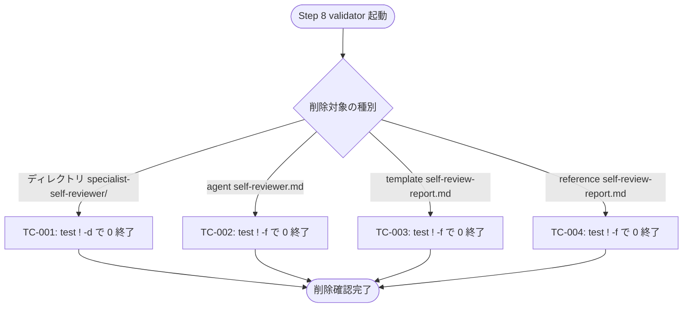
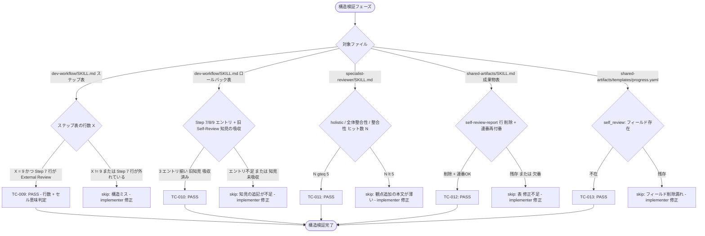
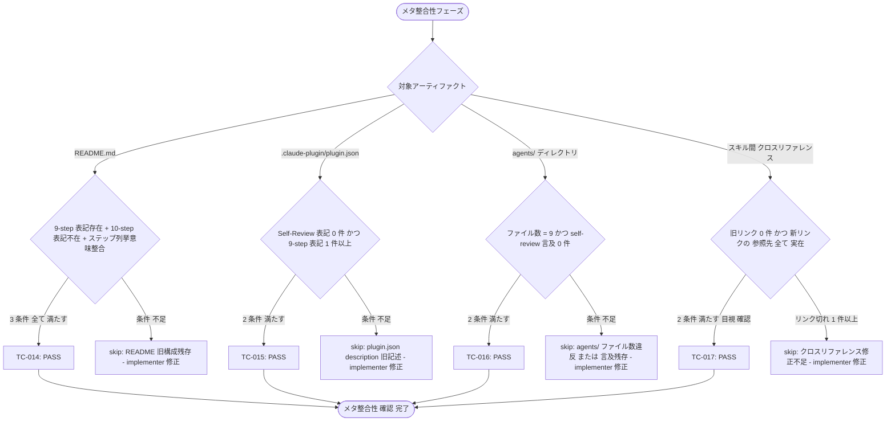
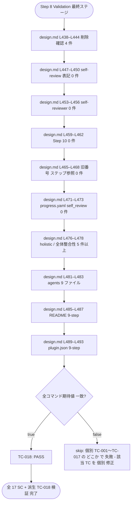
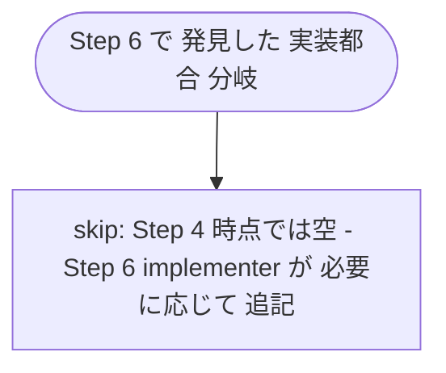
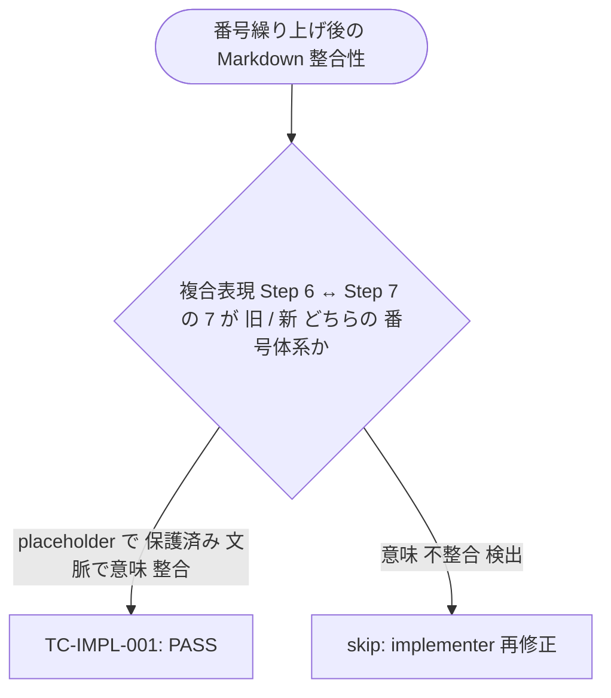

# QA Flow: Integrate Self-Review (Step 7) into External Review

- **Identifier:** 2026-04-29-integrate-self-review-into-external
- **Author:** qa-analyst (Specialist instance #1)
- **Source:** `qa-design.md`
- **Created at:** 2026-04-29T15:00:00Z
- **Last updated:** 2026-04-29T15:00:00Z
- **Status:** draft <!-- draft | approved -->

このドキュメントは `qa-design.md` のテストケース 18 件を **Mermaid flowchart で可視化**した網羅性確認用の図集。本サイクルは Markdown プラグインの自己改修であるため、実行コードのフロー図ではなく **「変更ファイルの種別 × 検証種別」の決定木** を可視化する。書き方の詳細は `plugins/dev-workflow/skills/shared-artifacts/references/qa-flow.md` を参照。

## 概要

本ドキュメントは次の 4 関心領域に分割する。

1. **削除確認** (SC-1〜SC-4 / TC-001〜TC-004): 旧 Self-Review 関連 4 ファイルの非存在確認
2. **残存表記の根絶** (SC-5〜SC-8 / TC-005〜TC-008): grep ベースの旧表記 0 件確認
3. **構造的完全性** (SC-9〜SC-13 / TC-009〜TC-013): 主要更新ファイル群の構造再付番 / 観点追加 / フィールド削除
4. **メタ整合性** (SC-14〜SC-17 / TC-014〜TC-017): README / plugin.json / agents/ ディレクトリ / クロスリファレンスの整合
5. **横断的処理** (TC-018): 検証コマンドセット 1 セット連続実行のシナリオ

各葉に `qa-design.md` の TC-NNN または `skip [理由]` を割り付ける。ループは存在しない（Markdown 静的検証は 1 パスで完結）ため、すべて単純な分岐構造で表現可能。

---

## 削除確認

このセクションがカバーする成功基準: SC-1, SC-2, SC-3, SC-4

旧 Self-Review 関連の 4 ファイル（ディレクトリ + agent + template + reference）について、それぞれ独立に存在 / 非存在を判定する。



---

## 残存表記の根絶

このセクションがカバーする成功基準: SC-5, SC-6, SC-7, SC-8

`plugins/dev-workflow/` 配下の Markdown / JSON / YAML を grep して旧表記が 0 件であることを確認する。4 種類の grep パターンを並列で実行し、AND 条件で合格判定する。

```mermaid
flowchart TD
  Start([grep セッション開始]) --> Q1{検索パターン}
  Q1 -->|self[-_]review / Self-Review| TC5[TC-005: 0 件で PASS]
  Q1 -->|self-reviewer / specialist-self-reviewer| TC6[TC-006: 0 件で PASS]
  Q1 -->|Step 10| TC7[TC-007: 0 件で PASS]
  Q1 -->|Step 9 Validation / Step 10 Retrospective| TC8[TC-008: 0 件で PASS]
  TC5 --> Agg{全 4 件 PASS?}
  TC6 --> Agg
  TC7 --> Agg
  TC8 --> Agg
  Agg -->|true| OK([残存表記 0 件 確認完了])
  Agg -->|false| NG[skip: いずれか 1 件でも 1 以上ヒット したら Step 6 再活性化対象 - validator が validation-report.md に記録]
```

---

## 構造的完全性

このセクションがカバーする成功基準: SC-9, SC-10, SC-11, SC-12, SC-13

dev-workflow / specialist-reviewer / shared-artifacts の 3 主要 SKILL.md および progress.yaml の構造 (テーブル行数 / セル内容 / フィールド有無) を確認する。**5 つの独立判定**で構成され、ループなし。



---

## メタ整合性

このセクションがカバーする成功基準: SC-14, SC-15, SC-16, SC-17

README / plugin.json / agents/ ディレクトリ全体 / クロスリファレンスのメタレベル整合を確認する。SC-14, SC-15, SC-16 は automated 補助 + 目視のハイブリッド、SC-17 のみ純粋に manual。



---

## 横断的処理 (シナリオ系)

このセクションがカバーする成功基準: (なし、TC-018 派生検証)

design.md L438–L494 の検証コマンドセット全体を 1 セッションで連続実行し、コマンド遂行性を確認する。**個別 TC-001〜TC-017 と二重カバレッジになるが、validator の実行手順遵守を独立に保証する目的**。



---

## 実装都合分岐

このセクションがカバーする成功基準: (なし、TC-IMPL-NNN 用、Step 4 時点では空)

Step 6 implementer が発見した実装都合分岐をここに集約する。Step 4 時点では空でよい。

`qa-design.md` の「実装都合テストケース」セクションに記載した予測ヒント (TC-IMPL 候補 A〜D: 番号繰り上げ後の Markdown 整合性 / frontmatter スキーマ違反 / agent description 文字数制約 / 内部リンク参照先存在検証) を Step 6 implementer が必要に応じて TC-IMPL-001〜 の連番で追記する。追記時は本セクションに対応する Mermaid flowchart を追加する。



<!-- Step 6 で TC-IMPL-001 が追記されたら、上記 skip ノードを置き換えて以下のような分岐を記述する例:

-->
