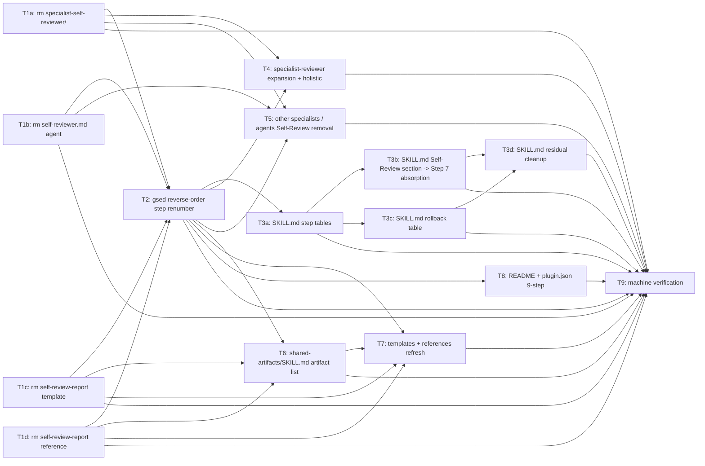

# Task Plan: Integrate Self-Review (Step 7) into External Review

- **Identifier:** 2026-04-29-integrate-self-review-into-external
- **Author:** planner (Specialist instance #1)
- **Source:** `design.md`
- **Created at:** 2026-04-29T16:00:00Z
- **Status:** draft <!-- draft | approved -->

このドキュメントは **Step 5 で確定する不変な計画書**。Step 6〜7 中のタスク状態追跡は `TODO.md` で行う。

## 前提

- 本サイクルは `dev-workflow` プラグインの **自己改修 (meta-reflexive)**。変更対象は Markdown / JSON / YAML のみで実行可能コードを含まない
- Design Document の「Task Decomposition への引き継ぎポイント」(L372–L513) に基づき、前例サイクル `2026-04-26-add-qa-design-step` の T1〜T8 を本サイクル向けに翻訳した粒度で分解
- 1 タスク = 1 implementer = 1 commit (前例 B-2「246 行差分の単一 commit」アンチパターン回避のため、`dev-workflow/SKILL.md` の編集は a〜d の 4 サブタスクに分割)
- 並列実行可能なタスクは Wave 単位で明示
- placeholder 命名は `__SRK_*__` (前例踏襲、`SRK` = Step Renumber Keep)
- 全タスク完了時に Wave 4 の機械検証で TC-001〜TC-018 のうち事前実行可能な分を一括 PASS させる
- TODO.md の `Active Steps` / `re_activations` / コミット文言の刷新と `progress.yaml` の `self_review:` 削除は、前例 B-4「キー重複」回避のため**各々 1 Edit にまとめる**
- shared-artifacts は前例 B-3「references 漏れ」を避けるため、Wave 4 で `references/*.md` を全件 grep 確認するチェックを必ず通す
- macOS 環境のため `gsed` を使用 (`macos-cli-rules` 準拠)
- Git コミットは pre-commit hook がファイル書き込みを行うため sandbox 外実行 (memory `feedback_sandbox_git_commit.md`)

## タスク一覧

### T1a: `specialist-self-reviewer/` ディレクトリの削除

- **概要:** `plugins/dev-workflow/skills/specialist-self-reviewer/` ディレクトリ全体を `git rm -r` で削除する。約 287 行の Self-Review 知見が消えるが、その吸収は T3b / T4 / T5 で別途実施するため本タスクは純粋な削除のみ
- **成果物:**
  - 削除: `plugins/dev-workflow/skills/specialist-self-reviewer/` (ディレクトリごと)
- **依存タスク:** なし (Wave 1 起点)
- **並列可否:** yes (T1b, T1c, T1d, T2, T6 と完全並列)
- **見積り規模:** S
- **手順:**
  1. `git rm -r plugins/dev-workflow/skills/specialist-self-reviewer/`
  2. `git status` で削除のみがステージされていることを確認
  3. `git commit -m "feat(dev-workflow): remove specialist-self-reviewer skill directory"` で単独 commit
- **success_check:**
  - `test ! -d plugins/dev-workflow/skills/specialist-self-reviewer && echo OK` が `OK` を出力 (TC-001)
  - `git status` が clean
- **コミットメッセージ案:** `feat(dev-workflow): remove specialist-self-reviewer skill directory`
- **カバーするテストケース ID:** TC-001
- **設計ドキュメント参照箇所:** design.md L101 (削除影響マップ), L382 (T1)
- **notes:** 旧 Self-Review の運用知見（3 周ルール / Step 6 ↔ Step 7 ループ図 / 焦点リスト）はファイル削除前に design.md (本サイクル) と T3b の実装で specialist-reviewer 側へ移植済みであることが前提。Wave 1 起点だが、本タスクは T2/T3 系より前に実行することで grep ヒット約 38% を即時消滅させ、後続作業の grep 出力を見やすくする効果がある

### T1b: `agents/self-reviewer.md` の削除

- **概要:** `plugins/dev-workflow/agents/self-reviewer.md` (38 行) を `git rm` で削除し、agents/ 配下を 9 ファイル構成にする
- **成果物:**
  - 削除: `plugins/dev-workflow/agents/self-reviewer.md`
- **依存タスク:** なし
- **並列可否:** yes (T1a, T1c, T1d, T2, T6 と並列)
- **見積り規模:** S
- **手順:**
  1. `git rm plugins/dev-workflow/agents/self-reviewer.md`
  2. `gls plugins/dev-workflow/agents/ | gwc -l` で 9 を確認
  3. `git commit -m "feat(dev-workflow): remove self-reviewer agent"` で単独 commit
- **success_check:**
  - `test ! -f plugins/dev-workflow/agents/self-reviewer.md && echo OK` が `OK` (TC-002)
  - `gls plugins/dev-workflow/agents/ | gwc -l` が `9` (TC-016 部分)
- **コミットメッセージ案:** `feat(dev-workflow): remove self-reviewer agent`
- **カバーするテストケース ID:** TC-002, TC-016 (件数判定部)
- **設計ドキュメント参照箇所:** design.md L101 (削除影響マップ), L382 (T1)
- **notes:** agents/ 配下の他ファイルから self-reviewer.md への参照は agents/reviewer.md / retrospective-writer.md / validator.md の description に存在するが、その置換は T6 の責務

### T1c: `shared-artifacts/templates/self-review-report.md` の削除

- **概要:** `plugins/dev-workflow/skills/shared-artifacts/templates/self-review-report.md` (62 行) を `git rm` で削除する
- **成果物:**
  - 削除: `plugins/dev-workflow/skills/shared-artifacts/templates/self-review-report.md`
- **依存タスク:** なし
- **並列可否:** yes (T1a, T1b, T1d, T2, T6 と並列)
- **見積り規模:** S
- **手順:**
  1. `git rm plugins/dev-workflow/skills/shared-artifacts/templates/self-review-report.md`
  2. `git commit -m "feat(dev-workflow): remove self-review-report template"` で単独 commit
- **success_check:**
  - `test ! -f plugins/dev-workflow/skills/shared-artifacts/templates/self-review-report.md && echo OK` が `OK` (TC-003)
- **コミットメッセージ案:** `feat(dev-workflow): remove self-review-report template`
- **カバーするテストケース ID:** TC-003
- **設計ドキュメント参照箇所:** design.md L101 (削除影響マップ), L382 (T1)
- **notes:** templates/ 配下の他ファイルからの参照は templates/TODO.md / templates/retrospective.md に存在し、それらは T7 の責務

### T1d: `shared-artifacts/references/self-review-report.md` の削除

- **概要:** `plugins/dev-workflow/skills/shared-artifacts/references/self-review-report.md` (89 行) を `git rm` で削除する
- **成果物:**
  - 削除: `plugins/dev-workflow/skills/shared-artifacts/references/self-review-report.md`
- **依存タスク:** なし
- **並列可否:** yes (T1a, T1b, T1c, T2, T6 と並列)
- **見積り規模:** S
- **手順:**
  1. `git rm plugins/dev-workflow/skills/shared-artifacts/references/self-review-report.md`
  2. `git commit -m "feat(dev-workflow): remove self-review-report reference"` で単独 commit
- **success_check:**
  - `test ! -f plugins/dev-workflow/skills/shared-artifacts/references/self-review-report.md && echo OK` が `OK` (TC-004)
- **コミットメッセージ案:** `feat(dev-workflow): remove self-review-report reference`
- **カバーするテストケース ID:** TC-004
- **設計ドキュメント参照箇所:** design.md L101 (削除影響マップ), L382 (T1)
- **notes:** 削除前に「3 周ルール」「Self-Review 焦点リスト」が design.md と T3b の specialist-reviewer 強化で吸収済みであることを確認。本タスクは T1a と論理的にペアだが、ファイルが独立しているため別 commit にする (前例 B-2 アンチパターン回避)

### T2: ステップ番号機械置換 (placeholder + gsed 降順)

- **概要:** Wave 1 削除完了後、`plugins/dev-workflow/` 配下の残存ファイルに対し複合表現を `__SRK_*__` placeholder で保護した上で、`Step 10 → 9 → 8 → 7` の降順 gsed を実行する。連鎖二重置換を機械的に防ぐ
- **成果物:**
  - 修正: `plugins/dev-workflow/` 配下の `Step 8`/`Step 9`/`Step 10` を含む全ファイル (Wave 1 削除後の残存ファイルのみ。design.md `step-renumber-map.md` の表 2/5 で約 17 ファイル特定済み)
- **依存タスク:** T1a, T1b, T1c, T1d (削除対象ファイルが残存しているとそこの Step 番号も誤って書き換えてしまうため、必ず削除完了後に実行)
- **並列可否:** no (単一タスクで全ファイルに gsed をかけるため、内部に並列性なし)
- **見積り規模:** M
- **手順:**
  1. **事前 placeholder 衝突チェック (B-1 アンチパターン回避):**
     ```bash
     ggrep -rn -F '__SRK_' plugins/dev-workflow/
     # 期待: 0 件 (前例サイクル `__SRK_*__` 残骸が無いことを確認)
     ```
  2. **対象ファイル特定:**
     ```bash
     TARGETS=$(ggrep -rlE 'Step (7|8|9|10)\b' plugins/dev-workflow/)
     ```
  3. **複合表現 placeholder 化 (置換前文字列を保護):**
     ```bash
     gsed -i 's/Step 6 ↔ Step 7/__SRK_67ARROW__/g' $TARGETS
     gsed -i 's/Step 6〜7/__SRK_67TILDE__/g'        $TARGETS
     gsed -i 's/Step 6\/7/__SRK_67SLASH__/g'        $TARGETS
     gsed -i 's/Step 1〜5/__SRK_15TILDE__/g'        $TARGETS
     gsed -i 's/Step 1〜3/__SRK_13TILDE__/g'        $TARGETS
     ```
     注: design.md L308–L312 で命名確定。新規複合表現が見つかれば追加 placeholder を挟む
  4. **単独数字降順置換:**
     ```bash
     gsed -i 's/\bStep 10\b/Step 9/g' $TARGETS
     gsed -i 's/\bStep 9\b/Step 8/g'  $TARGETS
     gsed -i 's/\bStep 8\b/Step 7/g'  $TARGETS
     ```
  5. **placeholder 復元:**
     ```bash
     gsed -i 's/__SRK_67ARROW__/Step 6 ↔ Step 7/g' $TARGETS
     gsed -i 's/__SRK_67TILDE__/Step 6〜7/g'       $TARGETS
     gsed -i 's/__SRK_67SLASH__/Step 6\/7/g'       $TARGETS
     gsed -i 's/__SRK_15TILDE__/Step 1〜5/g'       $TARGETS
     gsed -i 's/__SRK_13TILDE__/Step 1〜3/g'       $TARGETS
     ```
  6. **placeholder 残骸 0 件確認:**
     ```bash
     ggrep -rn -F '__SRK_' plugins/dev-workflow/
     # 期待: 0 件
     ```
  7. **`git diff --staged` で意図しない数値変更が無いか目視確認**
  8. `git commit -m "feat(dev-workflow): renumber steps 8/9/10 -> 7/8/9 via reverse-order gsed"` で単独 commit
- **success_check:**
  - `ggrep -rn -F '__SRK_' plugins/dev-workflow/` が 0 件
  - `ggrep -rnF 'Step 10' plugins/dev-workflow/` が 0 件 (TC-007)
  - `ggrep -rnE 'Step 9 \(Validation\)|Step 10 \(Retrospective\)' plugins/dev-workflow/` が 0 件 (TC-008)
- **コミットメッセージ案:** `feat(dev-workflow): renumber steps 8/9/10 -> 7/8/9 via reverse-order gsed with placeholder protection`
- **カバーするテストケース ID:** TC-007, TC-008 (主要), TC-018 (補助)
- **設計ドキュメント参照箇所:** design.md L296–L314 (代替案 4), `research/step-renumber-map.md` 含意 1/2
- **notes:**
  - **B-1 リスク (placeholder 命名衝突):** 手順 1 の事前 grep を必ず実行
  - 本タスクは Self-Review 文脈の Step 7 セクション (旧 dev-workflow/SKILL.md L398–L464) を**機械置換しない**。当該セクションは T3b で物理削除されるため、本タスクの gsed は当該セクション内の文字列を一旦書き換えても問題ないが、後続 T3b で完全に削除されるため二重作業にはならない
  - 旧 Self-Review 言及 (`Self-Review` / `self-reviewer` 等の単語) は本タスクでは触らない。それらは T3〜T7 で文脈ごと書き換える

### T3a: `dev-workflow/SKILL.md` ステップ表系の 9-step 化

- **概要:** ステップ一覧テーブル (L125–L138)、フロー図 ASCII (L100–L121)、コミット規約表 (L720–L734)、並列度表 (L781–L792) の 4 箇所を Edit ツールで 9-step 化する。Self-Review 行を物理削除し、Step 7 行を「External Review / reviewer × N (観点並列、6 観点: security/performance/readability/test-quality/api-design/holistic) / Gate=Main / 主要成果物 `review/<aspect>.md`」に書き換える
- **成果物:**
  - 修正: `plugins/dev-workflow/skills/dev-workflow/SKILL.md` (該当 4 セクション)
- **依存タスク:** T2 (番号シフト後の本文を前提に Edit する。T2 が L466- の旧 Step 8 → Step 7 セクションタイトルを書き換え済みであることを利用)
- **並列可否:** no (T3b/T3c/T3d と同一ファイルへの順次 Edit のため、内部で直列。ただしセクション間が独立しているため Edit 単位では安全)
- **見積り規模:** M
- **手順:**
  1. **ステップ一覧テーブル (L125–L138):**
     - Self-Review 行 (L135) を削除
     - Step 7 行を `External Review / reviewer × N (観点並列) / Gate=Main / review/<aspect>.md` に書き換え
     - 後続 4 行 (Step 8/9/10) → Step 7/8/9 へ番号と内容を整合（T2 の gsed で番号は変わっているが、テーブル整列を Edit で確認）
  2. **フロー図 ASCII (L100–L121):**
     - `7. Self-Review ─────────...` 行を削除
     - 旧 8/9/10 のノードを 7/8/9 に番号変更（T2 の gsed では ASCII 内の枠線数字は対象外のため Edit 必須）
     - ループ矢印を再配置 (Step 6 ↔ Step 7 のループは維持、Step 7 ↔ Step 8 のループは新フローでは存在しない)
  3. **コミット規約表 (L720–L734):**
     - `7. Self-Review` 行 (L731) を削除
     - 後続テーブル行の Step 番号を 7/8/9 に整合
  4. **並列度表 (L781–L792):**
     - `7. Self-Review / 低 / 全体整合性が必要なので原則 1 名` 行 (L789) を削除
     - 新 Step 7 (External Review) 行を「reviewer × N（観点並列、6 並列を上限目安）」と更新
     - 後続行を Step 8/9 として整合
  5. `git diff --staged` でテーブル列のズレ・改行漏れを目視確認
  6. `git commit -m "feat(dev-workflow): update step list / flow / commit-rule / parallelism tables to 9-step"` で commit
- **success_check:**
  - `ggrep -nE '^\| Step [1-9] \|' plugins/dev-workflow/skills/dev-workflow/SKILL.md | gwc -l` が `9` (TC-009 件数部)
  - `ggrep -nF 'Self-Review' plugins/dev-workflow/skills/dev-workflow/SKILL.md` が、本タスク後で 0 件 (このスコープ部分のみ。L398–L464 の Self-Review セクションは T3b で削除のため、現時点ではまだ残存)
  - フロー図内の枠線数字が 7/8/9 のみ (`8`/`10` が ASCII 図に残らない)
- **コミットメッセージ案:** `feat(dev-workflow): update step list / flow diagram / commit-rule / parallelism tables to 9-step`
- **カバーするテストケース ID:** TC-009 (件数部)
- **設計ドキュメント参照箇所:** design.md L384 (T3a), `research/step-renumber-map.md` 含意 3 (Edit 必須箇所)
- **notes:**
  - 本タスクは大規模ファイル分割の (a) サブタスク。前例 B-2「246 行差分単一 commit」アンチパターン回避のため、Self-Review セクション削除 (T3b) / ロールバック早見表 (T3c) / その他 grep ヒット (T3d) と分離
  - Step 7 行の「主要成果物」列に `review/<aspect>.md` を必ず含める (TC-009 manual 部の意味判定基準)

### T3b: `dev-workflow/SKILL.md` Step 7 Self-Review セクションの物理削除と新 Step 7 統合

- **概要:** 旧 Step 7 Self-Review セクション (L398–L464) を物理削除し、旧 Step 8 External Review セクション (L466–L505、T2 の番号シフトで現在は新 Step 7 セクション) の本文に「Self-Review が担っていた『全体整合性チェック』『implementer 直後の手戻り抑止』を本ステップで吸収する」旨と holistic 観点 reviewer の責務を追記する。Step 6 ↔ Step 7 ループ ASCII 図 (L437–L464) を N 並列 reviewer 版に書き換え
- **成果物:**
  - 修正: `plugins/dev-workflow/skills/dev-workflow/SKILL.md`
    - 削除: 旧 Step 7 Self-Review セクション全体 (約 67 行)
    - 追記: 新 Step 7 External Review セクションへの holistic 観点 / Self-Review 役割吸収 / 6 reviewer 並列 ループ ASCII 図 / 3 周ルール
- **依存タスク:** T2 (番号シフト済み), T3a (テーブル系が新 Step 7 表記になっている前提で本文を書き換える)
- **並列可否:** no (T3a と同一ファイルへの順次 Edit。セクションが大きいため commit を独立させる)
- **見積り規模:** L (前例 T3 が 246 行 diff の単一 commit でアンチパターン化したため、本タスクは「セクション削除 + 新セクション統合」の 1 コミットに限定。約 100–150 行 diff 想定)
- **手順:**
  1. 旧 Step 7 Self-Review セクション (L398–L464、67 行) を Edit で完全削除
  2. 新 Step 7 External Review セクション (旧 L466–L505 から番号シフトされた箇所) の本文に以下を追記:
     - 「Self-Review が担っていた『全体整合性チェック』『implementer 直後の手戻り抑止』を本ステップで吸収する」(Intent Spec 成功基準 #11 をクリアする「全体整合性」キーワードを必ず含める)
     - holistic 観点 reviewer の責務 5 項目 (design.md L121–L131): cross-cutting consistency / task-plan completion / intent-spec coverage outlook / obvious bug detection / modification round history
     - 観点リストを 5 → 6 (security/performance/readability/test-quality/api-design/holistic) に拡張
  3. Step 6 ↔ Step 7 ループ ASCII 図 (旧 L437–L464) を N 並列 reviewer 版に再構築 (design.md L65–L93 の ASCII 図を流用)
  4. ループ上限「3 周以上で Step 3 ロールバック検討」「集約閾値: 全 reviewer Blocker 合計 0 件」を本文に明記
  5. 本文の `Self-Review` 言及を全削除 (`ggrep -nF 'Self-Review' plugins/dev-workflow/skills/dev-workflow/SKILL.md` で 0 件)
  6. `git commit -m "feat(dev-workflow): integrate Self-Review responsibility into External Review (holistic aspect)"` で commit
- **success_check:**
  - `ggrep -nF 'Self-Review' plugins/dev-workflow/skills/dev-workflow/SKILL.md` が 0 件
  - `ggrep -nE 'holistic|全体整合性|整合性' plugins/dev-workflow/skills/dev-workflow/SKILL.md` が 1 件以上
  - Step 7 セクションの ASCII 図に「reviewer × 6」または「B1..B6」相当の表現が含まれる
  - `gwc -l plugins/dev-workflow/skills/dev-workflow/SKILL.md` が現在の 847 行から約 70 行減少 (旧 Step 7 セクション削除分。追記分が相殺するため正確な値は実測)
- **コミットメッセージ案:** `feat(dev-workflow): integrate Self-Review responsibility into External Review (holistic aspect)`
- **カバーするテストケース ID:** TC-005 (本ファイル分), TC-009 (Step 7 行の意味整合)
- **設計ドキュメント参照箇所:** design.md L120–L185 (holistic 責務 / 深刻度マッピング / re_activations 更新), L320–L328 (代替案 5 ループ知見保存先), L385 (T3b)
- **notes:**
  - 本タスクは前例 B-2 アンチパターン (246 行単一 commit) を意識して **削除 + 統合の 1 コミット** に集約。これより細分化すると新旧セクションの不整合状態が中間 commit に残るため逆効果
  - 「全体整合性」キーワードは Intent Spec 成功基準 #11 / TC-011 をクリアする要件
  - holistic reviewer の Round 1 純粋並列 / Round 2 以降クロスリファレンス可のルール (design.md L237–L240) も本セクションで明記する

### T3c: `dev-workflow/SKILL.md` ロールバック早見表の 9-step 化

- **概要:** ロールバック早見表 (L819–L835) を 9-step 構成に書き換える。旧 Self-Review 由来の 2 行 (L829: Step 7 / High 指摘 / Step 6、L830: Step 7 / 設計レベル / Step 3) を削除し、新 Step 7 (External Review) に統合された形 (Blocker 指摘 → Step 6、設計レベル問題 → Step 3) で記載する。後続行 (旧 Step 8/9 → 新 Step 7/8) の番号を整合
- **成果物:**
  - 修正: `plugins/dev-workflow/skills/dev-workflow/SKILL.md` (L819–L835 のロールバック早見表)
- **依存タスク:** T2, T3a (T3a が大きい変更を入れた後、本タスクで早見表を最終調整)
- **並列可否:** no (T3a/T3b と同一ファイル順次 Edit)
- **見積り規模:** S
- **手順:**
  1. 旧 L829 / L830 の Self-Review 由来 2 行を削除
  2. 新 Step 7 (External Review) 行を以下のエントリに統合:
     - `Step 7 | Blocker 指摘 | Step 6 (再活性化、re_activations++)`
     - `Step 7 | 設計レベルの問題 / 3 Round 連続 Blocker | Step 3 (Main が In-Progress ユーザー問い合わせで承認)`
  3. 旧 Step 8 (Validation) → Step 8 のまま、旧 Step 9 (実装バグ → Step 6 等の 4 行) → Step 8 に整合 (T2 の gsed で番号は変わっているが Edit でテーブル整列を確認)
  4. 旧 Step 9 / 設計ミス → Step 8、旧 Step 9 / 成功基準が不適切 → Step 8、旧 Step 9 / qa-flow カバレッジ不足 → Step 8 と整合
  5. `git diff --staged` で行数 / セル整列を確認
  6. `git commit -m "feat(dev-workflow): update rollback table to 9-step with Self-Review absorbed into External Review"` で commit
- **success_check:**
  - ロールバック早見表のエントリに Step 7 (External Review) / Step 8 (Validation) / Step 9 (Retrospective) が揃う
  - Step 7 エントリに「Blocker」または「Blocker 指摘」が含まれる
  - 旧 Self-Review 由来エントリ (`Step 7 | High 指摘 | Step 6` など) が残存しない
  - `ggrep -nE 'Step (8|9|10) \|' plugins/dev-workflow/skills/dev-workflow/SKILL.md` (テーブル列セパレータでヒットする旧番号) が 0 件
- **コミットメッセージ案:** `feat(dev-workflow): update rollback table to 9-step with Self-Review absorbed into External Review`
- **カバーするテストケース ID:** TC-010
- **設計ドキュメント参照箇所:** design.md L386 (T3c), `research/step-renumber-map.md` 含意 5 (ロールバック早見表のロジック整合性)
- **notes:** T3a で「ステップ表系」と本タスク「ロールバック早見表」を分離するのは、表の意味再解釈が大きく単一 commit にすると目視レビューが困難になるため

### T3d: `dev-workflow/SKILL.md` その他 Self-Review 言及の文脈書き換え

- **概要:** T3a/T3b/T3c でカバーしきれない `dev-workflow/SKILL.md` 内の Self-Review 言及 (L343 / L485 / L697 / L739 等) を文脈ごと書き換え、`10 ステップ` → `9 ステップ` のスペル表記 (L6 / L23 / L663) を更新する
- **成果物:**
  - 修正: `plugins/dev-workflow/skills/dev-workflow/SKILL.md` (個別行 Edit、約 7 箇所)
- **依存タスク:** T2, T3a, T3b, T3c (前段で大規模変更が完了した後の最終クリーンアップ)
- **並列可否:** no (同一ファイル順次 Edit)
- **見積り規模:** S
- **手順:**
  1. **L6:** `Step 10 (Retrospective) までフラットな 10 ステップ` → `Step 9 (Retrospective) までフラットな 9 ステップ`
  2. **L23:** `10 ステップをゲート式で進行させる` → `9 ステップをゲート式で進行させる`
  3. **L343:** `タスク再活性化時 (Self-Review High 指摘で Step 6 に戻った場合等)` → `タスク再活性化時 (External Review Blocker 指摘で Step 6 に戻った場合等)`
  4. **L485:** `2. 観点ごとに reviewer を 並列起動 (Step 6 / 6 の implementer / self-reviewer とは別個の新規インスタンス)` → `2. 観点ごとに reviewer を 並列起動 (Step 6 の implementer とは別個の新規インスタンス)`
  5. **L663:** `10 ステップ構成と各ステップのゲート判定` → `9 ステップ構成と各ステップのゲート判定`
  6. **L697:** `Self-Review の汎用観点、プロジェクトに固有のレビュー観点あり` → `External Review の汎用観点、プロジェクトに固有のレビュー観点あり`
  7. **L739:** `Self-Review High 指摘で再実装する場合` → `External Review Blocker 指摘で再実装する場合`
  8. その他の grep ヒットを `ggrep -nE -i 'self[-_]review|Self-Review|10[ -]?step|10 ステップ|ten specialist' plugins/dev-workflow/skills/dev-workflow/SKILL.md` で再確認し、残存があれば書き換え
  9. `ggrep -nE -i 'self[-_]review|Self-Review' plugins/dev-workflow/skills/dev-workflow/SKILL.md` が 0 件であることを確認
  10. `git commit -m "feat(dev-workflow): clean residual Self-Review references and 10-step spelling in SKILL.md"` で commit
- **success_check:**
  - `ggrep -nE -i 'self[-_]review|Self-Review' plugins/dev-workflow/skills/dev-workflow/SKILL.md` が 0 件
  - `ggrep -nE '10[ -]?step|10 ステップ|ten specialist' plugins/dev-workflow/skills/dev-workflow/SKILL.md` が 0 件
  - `ggrep -nE '9 ステップ|9-step' plugins/dev-workflow/skills/dev-workflow/SKILL.md` が 1 件以上
- **コミットメッセージ案:** `feat(dev-workflow): clean residual Self-Review references and 10-step spelling in SKILL.md`
- **カバーするテストケース ID:** TC-005 (本ファイル分の最終クリーンアップ)
- **設計ドキュメント参照箇所:** design.md L387 (T3d), `research/step-renumber-map.md` 含意 4 (英語/スペル表記の取りこぼしリスク)
- **notes:**
  - スペル表記 `10 ステップ` / `ten specialist` は T2 の単独数字 gsed では拾えないため本タスクで明示的に処理
  - T3a〜T3d 4 サブタスク完了後、`dev-workflow/SKILL.md` の Self-Review 言及は完全に 0 件になる

### T4: `specialist-reviewer/SKILL.md` の責務拡張 (holistic 観点追加 / Self-Review 言及削除 / 全体整合性キーワード追記)

- **概要:** `specialist-reviewer/SKILL.md` 本文に旧 Self-Review が担っていた責務 (全体整合性チェック / implementer 直後の手戻り抑止) を吸収した旨を明記し、observation 6 観点 (security/performance/readability/test-quality/api-design/holistic) を本文に列挙する。description / Do NOT use for から `specialist-self-reviewer` 言及を削除。3 周ルール / Round 1 純粋並列・Round 2 以降クロスリファレンスのルール / 修正ラウンド履歴の保存責任を追記。`agents/reviewer.md` の description も Self-Review 言及削除 + holistic 言及追加で更新
- **成果物:**
  - 修正: `plugins/dev-workflow/skills/specialist-reviewer/SKILL.md`
  - 修正: `plugins/dev-workflow/agents/reviewer.md`
- **依存タスク:** T1a (specialist-self-reviewer ディレクトリ削除済み), T2 (Step 番号シフト済み)
- **並列可否:** yes (T5, T6, T7, T8 と並列可)
- **見積り規模:** M
- **手順:**
  1. **`specialist-reviewer/SKILL.md` の責務拡張:**
     - description / 本文の `specialist-self-reviewer` 言及 (L13 description Do NOT use, L48 本文) を削除 (`(specialist-self-reviewer、全観点統合の事前レビュー)、` 等のトークン除去)
     - 「役割」セクションに holistic 観点の責務 5 項目 (cross-cutting consistency / task-plan completion / intent-spec coverage outlook / obvious bug detection / modification round history) を追記
     - 「全体整合性」「整合性」キーワードを本文中に最低 5 箇所配置 (Intent Spec 成功基準 #11 / TC-011 を満たす目安として)
     - 「失敗モード」表に「Blocker 指摘が 3 Round 以上発生 → 設計レベル疑い、Main に Step 3 ロールバック相談」を追記 (design.md L322–L328 採用案 A の書き分け)
     - 観点リストを `security / performance / readability / test-quality / api-design / holistic` の 6 観点に拡張
     - 深刻度ラベルを `Blocker / Major / Minor` で統一する旨を明記 (旧 High/Medium/Low 廃止)
     - Round 1 純粋並列 / Round 2 以降のみ他 reviewer 出力をクロスリファレンス可、というルール (design.md L237–L240) を追記
  2. **`agents/reviewer.md` の更新:**
     - description 内 `Do NOT use for: 複数観点の統合レビュー（self-reviewer を使う）` 行を削除 (research/self-review-references.md L67)
     - description 末尾に holistic 観点を追加した観点列挙 (security/performance/readability/test-quality/api-design/holistic)
     - 担当ステップ Step 8 → Step 7 (T2 の gsed で済んでいるが目視確認)
     - description が 250 文字程度の制約に収まるか文字数確認 (`gawk '/^description:/,/^[a-z_]+:/' agents/reviewer.md | gwc -c`)
  3. `git diff --staged` で目視確認
  4. `git commit -m "feat(dev-workflow): expand specialist-reviewer to absorb Self-Review (holistic aspect)"` で commit
- **success_check:**
  - `ggrep -nE 'holistic|全体整合性|整合性' plugins/dev-workflow/skills/specialist-reviewer/SKILL.md | gwc -l` が `5` 以上 (TC-011)
  - `ggrep -nE 'self-reviewer|specialist-self-reviewer' plugins/dev-workflow/skills/specialist-reviewer/SKILL.md plugins/dev-workflow/agents/reviewer.md` が 0 件
  - `ggrep -nE -i 'self[-_]review|Self-Review' plugins/dev-workflow/skills/specialist-reviewer/SKILL.md plugins/dev-workflow/agents/reviewer.md` が 0 件
  - `ggrep -nE '3 周以上|3 Round 以上' plugins/dev-workflow/skills/specialist-reviewer/SKILL.md` が 1 件以上 (design.md 委譲チェックリスト)
- **コミットメッセージ案:** `feat(dev-workflow): expand specialist-reviewer to absorb Self-Review (holistic aspect)`
- **カバーするテストケース ID:** TC-011 (主要), TC-005 / TC-006 (本ファイル分)
- **設計ドキュメント参照箇所:** design.md L256–L264 (代替案 1 採用案 A 補足), L320–L328 (代替案 5), L383 (T2 reviewer 責務拡張)
- **notes:**
  - holistic reviewer の責務契約 (design.md L120–L131) は本ファイルの公式記述場所
  - description が 250 文字超過しないよう注意 (TC-IMPL 候補 C / qa-design.md L147)
  - 新規 reviewer Specialist の追加ではなく既存 reviewer の `<aspect>` enum 拡張なので、SKILL.md は単一ファイルで責務追記を行う（前例パターン T2 と同型）

### T5: 他 specialist スキル / agents の Self-Review 言及削除 + Step 番号整合性確認

- **概要:** specialist-implementer / specialist-validator / specialist-retrospective-writer / specialist-common / specialist-intent-analyst の SKILL.md と、agents/retrospective-writer.md / agents/validator.md / その他 6 agents の description / 本文から Self-Review 言及を削除する (research/self-review-references.md の DEL/REPL 指示に従う)。T2 で gsed 済みの Step 番号も目視確認
- **成果物:**
  - 修正: `plugins/dev-workflow/skills/specialist-implementer/SKILL.md`
  - 修正: `plugins/dev-workflow/skills/specialist-validator/SKILL.md`
  - 修正: `plugins/dev-workflow/skills/specialist-retrospective-writer/SKILL.md`
  - 修正: `plugins/dev-workflow/skills/specialist-common/SKILL.md`
  - 修正: `plugins/dev-workflow/skills/specialist-intent-analyst/SKILL.md`
  - 修正: `plugins/dev-workflow/agents/retrospective-writer.md`
  - 修正: `plugins/dev-workflow/agents/validator.md`
  - 修正: `plugins/dev-workflow/agents/architect.md` / `agents/implementer.md` / `agents/intent-analyst.md` / `agents/planner.md` / `agents/qa-analyst.md` / `agents/researcher.md` (Step 番号目視 + 残存 Self-Review 言及があれば削除)
- **依存タスク:** T1a, T1b (specialist-self-reviewer ディレクトリ・self-reviewer agent が削除済み), T2 (Step 番号シフト済み)
- **並列可否:** yes (T4, T6, T7, T8 と並列可)
- **見積り規模:** M
- **手順:**
  1. **`specialist-implementer/SKILL.md`:**
     - L10: `レビュー（specialist-self-reviewer / specialist-reviewer）` → `レビュー（specialist-reviewer）`
     - L104: `自己レビュー（specialist-self-reviewer の領域）` → `外部レビュー（specialist-reviewer の領域）`
  2. **`specialist-validator/SKILL.md`:**
     - L9: `Do NOT use for: レビュー（specialist-reviewer）、自己レビュー（specialist-self-reviewer）` → `Do NOT use for: レビュー（specialist-reviewer）` (`、自己レビュー（specialist-self-reviewer）` トークン削除)
  3. **`specialist-retrospective-writer/SKILL.md`:**
     - L12: description 内 `... specialist-self-reviewer）、実装（specialist-implementer）、...` の `specialist-self-reviewer）、` トークン削除
     - L49: `Self-Review / Review Reports / Validation Report` → `Review Reports / Validation Report`
     - L51: `Self-Review ループ履歴` → `External Review ループ履歴`
     - L97: `実装の評価（Self-Review / External Review で既に完了済み）` → `実装の評価（External Review で既に完了済み）`
  4. **`specialist-common/SKILL.md`:**
     - L5: description Specialist 名列挙から `self-reviewer,` を削除
     - L14: description 内 `specialist-implementer / specialist-self-reviewer /` から `specialist-self-reviewer /` を削除
  5. **`specialist-intent-analyst/SKILL.md`:**
     - L10: `レビュー（specialist-self-reviewer / specialist-reviewer）` → `レビュー（specialist-reviewer）`
  6. **`agents/retrospective-writer.md`:**
     - L8: `Do NOT use for: ...（self-reviewer を使う）、成功基準の実測判定（validator を使う）` から `（self-reviewer を使う）、` トークン削除
     - L34: `Self-Review Report / Review Reports / Validation Report` → `Review Reports / Validation Report`
  7. **`agents/validator.md`:**
     - L8: `Do NOT use for: ...（self-reviewer を使う）、設計妥当性の検証...` から `（self-reviewer を使う）、` トークン削除
  8. **その他 6 agents (architect / implementer / intent-analyst / planner / qa-analyst / researcher):**
     - 各 description の Step 番号を確認 (T2 gsed 済み)
     - 残存 Self-Review 言及があれば削除 (`ggrep -nE -i 'self[-_]review' agents/*.md` で残存箇所特定)
  9. **description 文字数チェック:** `gawk '/^description:/,/^[a-z_]+:/' agents/*.md | gwc -c` で 250 文字程度の制約超過がないか確認 (TC-IMPL 候補 C 対応)
  10. `git diff --staged` で目視確認
  11. 1 コミットでまとめる: `git commit -m "feat(dev-workflow): remove Self-Review references from specialists and agents"`
- **success_check:**
  - `ggrep -rnE -i 'self[-_]review|Self-Review' plugins/dev-workflow/skills/specialist-*/ plugins/dev-workflow/agents/` が 0 件
  - `ggrep -rnE 'self-reviewer|specialist-self-reviewer' plugins/dev-workflow/skills/specialist-*/ plugins/dev-workflow/agents/` が 0 件
  - `gls plugins/dev-workflow/agents/ | gwc -l` が `9` (TC-016 件数部の最終確認)
- **コミットメッセージ案:** `feat(dev-workflow): remove Self-Review references from specialists and agents`
- **カバーするテストケース ID:** TC-005, TC-006, TC-016 (件数部)
- **設計ドキュメント参照箇所:** design.md L388 (T4 specialist 入出力契約), `research/self-review-references.md` 各 specialist / agents の DEL/REPL 指示
- **notes:**
  - 本タスクは前例 T4 と同型 (specialist 入出力契約変更)。複数ファイルへの単純置換が中心のため 1 コミットで処理する
  - description 文字数制約は frontmatter 250 文字程度。超過時は別途 TC-IMPL として qa-design.md に追記する余地

### T6: `shared-artifacts/SKILL.md` 成果物一覧 + 保存構造 ASCII の連番再付番

- **概要:** `shared-artifacts/SKILL.md` の成果物一覧テーブル (L48–L56) から `self-review-report.md` 行 (L52) を削除し、行番号列 (`#` 列) を `1, 2, ..., N` の連番に再付番。保存構造 ASCII (L117–L133) からも `self-review-report.md` 行 (L125) を削除し、コメントの Step 番号 (Step 8 → Step 7 等) を整合
- **成果物:**
  - 修正: `plugins/dev-workflow/skills/shared-artifacts/SKILL.md`
- **依存タスク:** T1c, T1d (templates / references の self-review-report.md ファイルが削除済み), T2 (Step 番号シフト済み)
- **並列可否:** yes (T4, T5, T7, T8 と並列可)
- **見積り規模:** M
- **手順:**
  1. **成果物一覧テーブル (L48–L56):**
     - L52 (`| 10 | self-review-report.md | Step 7 | self-reviewer ...`) を削除
     - 後続行 #11/#12/#13 を #10/#11/#12 に再付番 (連番、欠番なし)
     - 各行の Step 列を T2 後の番号に整合 (Step 7 = External Review、Step 8 = Validation、Step 9 = Retrospective)
  2. **保存構造 ASCII (L117–L133):**
     - L125 (`├── self-review-report.md      # Step 7 成果物`) を削除
     - L126 (`review/`) のコメントを `# Step 7 成果物` に更新 (T2 で番号は変わっているはずだが目視確認)
     - L130 (validation-report.md) のコメントを `# Step 8 成果物` に整合
     - L133 (retrospective.md) のコメントを `# Step 9 成果物` に整合
  3. `git diff --staged` でテーブル列の連番性とコメントを目視確認
  4. `git commit -m "feat(dev-workflow): remove self-review-report from artifact list and renumber to 9-step"` で commit
- **success_check:**
  - `ggrep -nF 'self-review-report' plugins/dev-workflow/skills/shared-artifacts/SKILL.md` が 0 件 (TC-012 automated 部)
  - 成果物一覧テーブルの `#` 列が連番 (欠番なし) — 目視確認 (TC-012 manual structural 部)
  - `ggrep -nE -i 'self[-_]review|Self-Review' plugins/dev-workflow/skills/shared-artifacts/SKILL.md` が 0 件
- **コミットメッセージ案:** `feat(dev-workflow): remove self-review-report from artifact list and renumber to 9-step`
- **カバーするテストケース ID:** TC-012
- **設計ドキュメント参照箇所:** design.md L390 (T6 shared-artifacts schema), Intent Spec 成功基準 #12 (L144)
- **notes:**
  - テーブルの `#` 列は手動連番。gsed では拾えない (前例サイクルでも Edit で対応)
  - 保存構造 ASCII の枠線数字も Edit 必須 (gsed 対象外)

### T7: `progress.yaml` / `TODO.md` / `retrospective.md` template と reference の刷新

- **概要:** `templates/progress.yaml` から `self_review:` フィールドを 1 Edit で削除 (B-4 アンチパターン回避: 関連する null フィールド整理を 1 操作にまとめる)。`templates/TODO.md` の `Active Steps` / `re_activations` コメント / コミット例を 1 Edit で更新。`templates/retrospective.md` の `self_reviewer_improvement` プレースホルダ削除 + ループ表更新。各 references (`progress-yaml.md` / `todo.md` / `retrospective.md` / `review-report.md` / `implementation-log.md`) の Self-Review 言及を `External Review` 表現に書き換え
- **成果物:**
  - 修正: `plugins/dev-workflow/skills/shared-artifacts/templates/progress.yaml`
  - 修正: `plugins/dev-workflow/skills/shared-artifacts/templates/TODO.md`
  - 修正: `plugins/dev-workflow/skills/shared-artifacts/templates/retrospective.md`
  - 修正: `plugins/dev-workflow/skills/shared-artifacts/templates/implementation-log.md`
  - 修正: `plugins/dev-workflow/skills/shared-artifacts/references/progress-yaml.md`
  - 修正: `plugins/dev-workflow/skills/shared-artifacts/references/todo.md`
  - 修正: `plugins/dev-workflow/skills/shared-artifacts/references/retrospective.md`
  - 修正: `plugins/dev-workflow/skills/shared-artifacts/references/review-report.md`
  - 修正: `plugins/dev-workflow/skills/shared-artifacts/references/implementation-log.md`
- **依存タスク:** T1c, T1d (削除完了), T2 (Step 番号シフト済み), T6 (shared-artifacts/SKILL.md が新スキーマで整合済み)
- **並列可否:** yes (T4, T5, T6, T8 と並列可。ただし上記 9 ファイルへの編集を本タスク内で完結)
- **見積り規模:** M
- **手順:**
  1. **`templates/progress.yaml` (1 Edit):**
     - L39 `self_review: null # self-review-report.md` 行を削除
     - 関連する null フィールドの並び (artifacts セクション全体) を**同一 Edit 操作**で確認・整列 (B-4 アンチパターン回避: キー重複や順序逆転を作らない)
     - コメント内の Step 番号 `Step 8 Review` → `Step 7 Review` (T2 gsed 済みだが目視確認)
  2. **`templates/TODO.md` (1 Edit):**
     - L4 `Active Steps: Step 6〜7 (Implementation / Self-Review)` → `Active Steps: Step 6〜7 (Implementation / External Review)`
     - L27 `re_activations: ... <!-- Self-Review High 指摘で Step 6 に戻った回数 -->` → `re_activations: ... <!-- External Review Blocker 指摘で Step 6 に戻った回数 -->`
     - L47 `Self-Review High 指摘で戻す場合` → `External Review Blocker 指摘で戻す場合`
     - L55 `(self-review feedback)` → `(external-review feedback)`
     - **これら 4 箇所の刷新は B-4 回避のため 1 Edit にまとめる**
  3. **`templates/retrospective.md`:**
     - L72 `- self-reviewer: {{self_reviewer_improvement}}` プレースホルダ行を削除 (Intent Spec L92 で明記)
     - L36–L38 / L94–L95 の Step 番号と意味を整合 (T2 gsed 済みだが意味再解釈を Edit で確認)
  4. **`templates/implementation-log.md`:**
     - L56 `Self-Review および Retrospective の材料` → `External Review および Retrospective の材料`
     - L64 `Self-Review で確認され` → `External Review で確認され`
  5. **`references/progress-yaml.md`:**
     - L75 `- self_review (Step 7) — self-review-report.md` フィールド説明行を削除
     - L76–L78 の Step 番号整合 (review = Step 7、validation = Step 8、retrospective = Step 9)
  6. **`references/todo.md`:**
     - L61 / L68 / L91 の `Self-Review High 指摘` → `External Review Blocker 指摘`
  7. **`references/retrospective.md`:**
     - L98 `self-review-report.md の修正ラウンド履歴` → `review/<aspect>.md の修正ラウンド履歴`
     - その他 Step 6 ↔ Step 7 ループ表は意味再解釈で Edit
  8. **`references/review-report.md`:**
     - L5 `Self-Review（全体整合性）とは別層` → 「観点固有の深い検査と、全体整合性チェック（旧 Self-Review が担っていた役割）の両方を扱う」(design.md L320–L328 採用案 A 書き分けに従う)
     - L121 `Self-Review レポート（Step 7）とは別層。内容が重複することはあるが独立して作成` を削除し、深刻度判定基準表に `Blocker / Major / Minor` のマッピング (design.md L137–L153) を追記
     - 修正ラウンド履歴セクションを新設 (design.md L328 設計指示)
  9. **`references/implementation-log.md`:**
     - L51 `Self-Review や Retrospective の材料` → `External Review や Retrospective の材料`
     - L55 `Self-Review への引き継ぎ` → `External Review への引き継ぎ`
     - L69 `出力先: self-review-report.md（self-reviewer が参照）` → `出力先: review/<aspect>.md（reviewer が参照）`
  10. **shared-artifacts/references の全件 grep 確認 (B-3 アンチパターン回避):**
      ```bash
      ggrep -rnE -i 'self[-_]review|Self-Review' plugins/dev-workflow/skills/shared-artifacts/references/
      # 期待: 0 件
      ```
  11. `git diff --staged` で各ファイルの編集を目視確認
  12. `git commit -m "feat(dev-workflow): refresh templates and references for 9-step External Review"` で commit
- **success_check:**
  - `ggrep -nE '^\s*self_review:' plugins/dev-workflow/skills/shared-artifacts/templates/progress.yaml` が 0 件 (TC-013)
  - `ggrep -rnE -i 'self[-_]review|Self-Review' plugins/dev-workflow/skills/shared-artifacts/` が 0 件
  - `ggrep -rnE 'self-reviewer|specialist-self-reviewer' plugins/dev-workflow/skills/shared-artifacts/` が 0 件
  - `ggrep -nF 'self-review-report' plugins/dev-workflow/skills/shared-artifacts/` が 0 件
- **コミットメッセージ案:** `feat(dev-workflow): refresh templates and references for 9-step External Review`
- **カバーするテストケース ID:** TC-013, TC-005 (本ファイル群分)
- **設計ドキュメント参照箇所:** design.md L389 (T5 機械置換 + 単純表記置換), L498–L505 (TODO.md と progress.yaml の同時編集ルール / B-4 アンチパターン回避)
- **notes:**
  - **B-4 アンチパターン回避:** progress.yaml と TODO.md の各々の刷新を 1 Edit にまとめるのが必須要件
  - **B-3 アンチパターン回避:** shared-artifacts/references/ 全件 grep を手順 10 で機械確認 (前例で取りこぼしが発生したため)
  - 9 ファイルを 1 commit にまとめるのは「shared-artifacts のスキーマ刷新」という単一の論理的単位だから (前例 T6 と T7 を統合した粒度)。ただし diff が膨らむので、進行中で diff が 200 行を超える兆しが見えたら implementer が Main に分割相談する余地

### T8: README + plugin.json の 9-step 化

- **概要:** `plugins/dev-workflow/README.md` の `ten specialist subagents` / `flat 10-step lifecycle` / ステップ列挙 / AI-DLC 比較段落を 9-step / 9 specialist 構成に更新する。`plugin.json` description の `Self-Review` 言及を削除し、9-step 列挙 (Intent → Research → Design → QA Design → Task Decomposition → Implementation → External Review → Validation → Retrospective) に正規化する
- **成果物:**
  - 修正: `plugins/dev-workflow/README.md`
  - 修正: `plugins/dev-workflow/.claude-plugin/plugin.json`
- **依存タスク:** T2 (Step 番号シフト済み)
- **並列可否:** yes (T4, T5, T6, T7 と並列可)
- **見積り規模:** S
- **手順:**
  1. **`README.md`:**
     - L5 `ten specialist subagents` → `nine specialist subagents`
     - L5 `flat 10-step lifecycle` → `flat 9-step lifecycle`
     - L7 ステップ列挙 `... 7. Self-Review → 8. External Review → 9. Validation → 10. Retrospective` → `... 6. Implementation → 7. External Review → 8. Validation → 9. Retrospective`
     - L19 AI-DLC 比較段落 `Research, QA Design, Self-Review, External Review, and Retrospective` → `Research, QA Design, External Review (which absorbs the role of an internal self-review), and Retrospective` または同等の統合表現
  2. **`plugin.json`:**
     - L3 `description` 内の `... → Self-Review → External Review → ...` を `Intent → Research → Design → QA Design → Task Decomposition → Implementation → External Review → Validation → Retrospective` の 9-step 列挙に置換
     - description が JSON valid であることを確認 (`gjq . plugin.json` 等で構文チェック)
  3. `git diff --staged` で目視確認
  4. `git commit -m "feat(dev-workflow): update README and plugin.json to 9-step lifecycle"` で commit
- **success_check:**
  - `ggrep -nF 'Self-Review' plugins/dev-workflow/.claude-plugin/plugin.json` が 0 件 (TC-015 part 1)
  - `ggrep -nE '9-step|9 step' plugins/dev-workflow/.claude-plugin/plugin.json` が 1 件以上 (TC-015 part 2)
  - `ggrep -nE 'nine specialist|9-step|9 specialist' plugins/dev-workflow/README.md` が 1 件以上 (TC-014 automated 部 1)
  - `ggrep -nE 'ten specialist|10-step|10 specialist' plugins/dev-workflow/README.md` が 0 件 (TC-014 automated 部 2)
  - `ggrep -nE -i 'self[-_]review|Self-Review' plugins/dev-workflow/README.md plugins/dev-workflow/.claude-plugin/plugin.json` が 0 件 (TC-005 / TC-006 該当ファイル分)
- **コミットメッセージ案:** `feat(dev-workflow): update README and plugin.json to 9-step lifecycle`
- **カバーするテストケース ID:** TC-014, TC-015
- **設計ドキュメント参照箇所:** design.md L391 (T7 README + plugin.json), Intent Spec L97–L102
- **notes:**
  - plugin.json の description は JSON 値として valid (改行・引用符のエスケープ) を保つ必要がある
  - AI-DLC 比較段落の文言は inspection で目視確認するため、表現は揺れて良いが「External Review が Self-Review の役割を吸収した」旨が読み取れること

### T9: 機械検証 (TC-001 〜 TC-018 のうち事前実行可能な分)

- **概要:** 全実装タスク完了後、design.md L438–L494 の検証コマンドセットを 1 セッションで連続実行し、全 grep が期待値 (0 件 or 1 件以上) を満たすことを確認する。失敗があれば該当タスクに差し戻し、修正後に再実行。最終的に Step 8 Validation で validator が同コマンドを再実行することを前提に、本タスクは「Step 5 (Implementation) 内での事前検証」として位置付ける
- **成果物:**
  - 検証ログ: コミットメッセージ内に grep 結果と件数を記録 (`validation-report.md` は Step 8 で validator が作成)
  - 修正コミット (発見された不整合があれば該当タスクに差し戻して別 commit)
- **依存タスク:** T1a, T1b, T1c, T1d, T2, T3a, T3b, T3c, T3d, T4, T5, T6, T7, T8 (全実装タスク)
- **並列可否:** no (最終ゲート、シリアル実行)
- **見積り規模:** S
- **手順:**
  1. **削除確認 (TC-001 〜 TC-004):**
     ```bash
     test ! -d plugins/dev-workflow/skills/specialist-self-reviewer && \
     test ! -f plugins/dev-workflow/agents/self-reviewer.md && \
     test ! -f plugins/dev-workflow/skills/shared-artifacts/templates/self-review-report.md && \
     test ! -f plugins/dev-workflow/skills/shared-artifacts/references/self-review-report.md && \
     echo "DELETED OK"
     # 期待: "DELETED OK"
     ```
  2. **残存表記の根絶 (TC-005 〜 TC-008):**
     ```bash
     ggrep -rnE -i 'self[-_]review|Self-Review' --exclude-dir=.git --exclude-dir=node_modules plugins/dev-workflow/
     # 期待: 0 件 (TC-005)
     ggrep -rnE 'self-reviewer|specialist-self-reviewer' --exclude-dir=.git --exclude-dir=node_modules plugins/dev-workflow/
     # 期待: 0 件 (TC-006)
     ggrep -rnF 'Step 10' --exclude-dir=.git --exclude-dir=node_modules plugins/dev-workflow/
     # 期待: 0 件 (TC-007)
     ggrep -rnE 'Step 9 \(Validation\)|Step 10 \(Retrospective\)' --exclude-dir=.git --exclude-dir=node_modules plugins/dev-workflow/
     # 期待: 0 件 (TC-008)
     ```
  3. **構造的完全性 (TC-009 〜 TC-013):**
     ```bash
     # TC-009 (件数部)
     ggrep -nE '^\| Step [1-9] \|' plugins/dev-workflow/skills/dev-workflow/SKILL.md | gwc -l
     # 期待: 9
     # TC-011
     ggrep -cE '全体整合性|整合性|holistic' plugins/dev-workflow/skills/specialist-reviewer/SKILL.md
     # 期待: 5 以上
     # TC-013
     ggrep -nE '^\s*self_review:' plugins/dev-workflow/skills/shared-artifacts/templates/progress.yaml
     # 期待: 0 件
     ```
  4. **メタ整合性 (TC-014 〜 TC-016):**
     ```bash
     # TC-014 (automated 補助)
     ggrep -nE 'nine specialist|9-step|9 specialist' plugins/dev-workflow/README.md
     # 期待: 1 件以上
     ggrep -nE 'ten specialist|10-step|10 specialist' plugins/dev-workflow/README.md
     # 期待: 0 件
     # TC-015
     ggrep -nF 'Self-Review' plugins/dev-workflow/.claude-plugin/plugin.json
     # 期待: 0 件
     ggrep -nE '9-step|9 step' plugins/dev-workflow/.claude-plugin/plugin.json
     # 期待: 1 件以上
     # TC-016
     gls plugins/dev-workflow/agents/ | gwc -l
     # 期待: 9
     ggrep -rnE -i 'self[-_]review|Self-Review' plugins/dev-workflow/agents/
     # 期待: 0 件
     ```
  5. **shared-artifacts/references 全件 grep (B-3 アンチパターン最終確認):**
     ```bash
     ggrep -rnE -i 'self[-_]review|Self-Review' plugins/dev-workflow/skills/shared-artifacts/references/
     # 期待: 0 件
     ggrep -rnF 'self-review-report' plugins/dev-workflow/skills/shared-artifacts/
     # 期待: 0 件
     ```
  6. **placeholder 残骸最終確認:**
     ```bash
     ggrep -rnF '__SRK_' plugins/dev-workflow/
     # 期待: 0 件
     ```
  7. **委譲チェックリスト (design.md L405–L425):**
     ```bash
     # 真のソース 1 つ確認: holistic 観点の唯一の責任者は specialist-reviewer
     ggrep -rnE 'holistic' plugins/dev-workflow/skills/
     # 期待: specialist-reviewer/SKILL.md と dev-workflow/SKILL.md にのみヒット
     # 真のソース 1 つ確認: 3 周ルール
     ggrep -rnE '3 周以上|3 Round 以上' plugins/dev-workflow/skills/dev-workflow/ plugins/dev-workflow/skills/specialist-reviewer/
     # 期待: 各 1 件以上
     ```
  8. **TC-009 / TC-010 / TC-012 / TC-014 / TC-017 の manual 部:** Main または validator が目視で実行 (本タスクは Step 5 内事前検証なので skip 可、Step 8 で実施)
  9. 全てが期待値を満たした場合、本タスクは追加 commit を作らず、進捗を `progress.yaml` の `validation: null` の前段準備として記録
  10. 不一致があれば該当タスクに差し戻し、修正後に再度本タスクを実行
- **success_check:**
  - 上記手順 1〜7 の全 grep / test コマンドが期待値を満たす
  - `ggrep -rnE -i 'self[-_]review|Self-Review' plugins/dev-workflow/` が 0 件 (TC-005 final)
  - `gls plugins/dev-workflow/agents/ | gwc -l` が 9 (TC-016 final)
- **コミットメッセージ案:** (commit を作成しない。検証成功で TODO.md / progress.yaml に記録のみ)
- **カバーするテストケース ID:** TC-001 〜 TC-018 (TC-009 / TC-010 / TC-012 / TC-014 / TC-017 の manual 部は Step 8 Validation の領域)
- **設計ドキュメント参照箇所:** design.md L432–L494 (検証 grep の最終形), L498–L505 (B-4 アンチパターン回避)
- **notes:**
  - 本タスクは「Step 5 内事前検証」であり、Step 8 Validation で validator が同じコマンドセットを再実行する (TC-018 の主旨)
  - 失敗時の差し戻しは Step 5 内で完結する。差し戻しコミットは元タスクの ID に紐付けて作成する
  - placeholder 残骸 (`__SRK_*__`) の最終確認は B-1 アンチパターン回避の最後の砦

## 依存グラフ



## 並列実行可能グループ

Step 6 で Main が並列起動単位として参照する。

- **Wave 1 (起点、削除タスク 4 並列):** T1a, T1b, T1c, T1d
  - 4 つは互いに独立ファイルへの `git rm` のため完全並列可
  - 全て完了後に Wave 2 へ進む
- **Wave 2 (機械置換、単独):** T2
  - placeholder + 降順 gsed の単一タスク。並列性なし (内部で全ファイルに対して gsed を順次実行)
- **Wave 3 (Edit + 観点統合、最大 5 並列):**
  - **シリーズ A (dev-workflow/SKILL.md 内、直列):** T3a → T3b → T3c → T3d (同一ファイル順次 Edit、並列不可)
  - **シリーズ B (並列実行可能):** T4 (specialist-reviewer 拡張), T5 (他 specialists / agents), T6 (shared-artifacts/SKILL.md), T7 (templates + references), T8 (README + plugin.json)
  - シリーズ A と シリーズ B は完全並列。Main は最大 5 implementer (T3a + T4 + T5 + T6 + T8) を同時起動可、T3a 完了後は T3b + T7 を追加起動して計 6 並列を維持
  - T7 のみ T6 完了が必要 (shared-artifacts/SKILL.md のスキーマ確定後に templates/references を整合させる)
- **Wave 4 (最終検証、単独):** T9
  - 全 13 タスク完了後にシリアル実行。失敗時は該当タスクに差し戻し

並列度の概算: Wave 1 で 4 並列、Wave 3 で最大 5〜6 並列、Wave 2 / Wave 4 で 1 並列。前例サイクルが 8 タスクで Wave 4 構成だったのに対し、本サイクルは 14 タスクで同じ Wave 4 構成を維持し、削除タスク細分化と dev-workflow/SKILL.md サブタスク化により 1 commit あたりの diff 量を抑制する。

## リスク / 想定される Blocker

- **R1 (B-1 placeholder 命名衝突):** T2 で `__SRK_*__` placeholder が前例サイクルの残骸と衝突する可能性。**対応:** T2 手順 1 の事前 `ggrep -rn -F '__SRK_' plugins/dev-workflow/` で 0 件確認。残骸があれば T2 着手前に Main に報告し、別 placeholder 命名 (`__SRK2_*__` 等) に変更する
- **R2 (B-2 巨大単一 commit):** dev-workflow/SKILL.md は 847 行の最大ファイル。**対応:** T3a/T3b/T3c/T3d の 4 サブタスク分割で各 commit を 50–150 行 diff に抑制。前例 T3 (246 行 diff) を上限の警戒ラインとし、超過の兆しがあれば implementer が Main に追加分割を相談
- **R3 (B-3 shared-artifacts/refs 漏れ):** templates / references の 9 ファイル全件編集で取りこぼし発生の懸念。**対応:** T7 手順 10 と T9 手順 5 で `ggrep -rnE -i 'self[-_]review|Self-Review' plugins/dev-workflow/skills/shared-artifacts/references/` を 0 件確認。前例で発生した「追加 gsed バッチで対応」は本サイクルで T7 内で完結させる
- **R4 (B-4 progress.yaml キー重複):** T7 で `self_review:` 削除と他フィールド整理を分離 Edit すると重複キーが残る危険。**対応:** T7 手順 1 で「1 Edit にまとめる」ルールを implementer に明示。`git diff --staged` で重複キーがないか目視
- **R5 (description 文字数超過):** T4 / T5 で agent description / skill description が 250 文字を超える可能性 (TC-IMPL 候補 C / qa-design.md L147)。**対応:** T4 手順 2 / T5 手順 9 で `gawk` による文字数計測。超過時は `Do NOT use for` リストの圧縮で対応
- **R6 (T2 gsed の意図しないヒット):** ASCII 図内の枠線数字 `8` / `10` を `7` / `9` に誤って書き換える可能性。**対応:** `\bStep <N>\b` のように `\b` (word boundary) で囲んで gsed することで枠線数字 (前後が空白でない箇所) との衝突を回避。T3a で枠線数字を Edit で再構築する際に最終確認
- **R7 (本サイクル成果物への遡及修正の混入):** T2 / T9 の grep が `docs/dev-workflow/2026-04-29-integrate-self-review-into-external/` 配下を含めると、本サイクル自身の成果物 (intent-spec.md / design.md / qa-design.md) が遡及対象になる。**対応:** 全 grep / gsed のスコープを `plugins/dev-workflow/` に限定 (design.md L508–L513 過渡期合意)
- **R8 (新規 Self-Review 表記の混入):** 全タスク完了後に何らかの commit で Self-Review 言及が再混入する可能性。**対応:** T9 で TC-005 / TC-006 を必ず再実行。pre-commit hook での検出も将来課題
- **R9 (commit 数の増加):** Wave 1 (4 commits) + Wave 2 (1) + Wave 3 (8: T3a-d + T4-8) = 13 commits + 差し戻し分 = 14〜18 commits 程度。前例 8 commits より増えるが、各 commit が小さく目視レビューしやすいトレードオフ。**対応:** PR 作成時に commit 数の妥当性を Main が User に説明 (前例 B-2 の教訓を踏襲した結果である旨)
