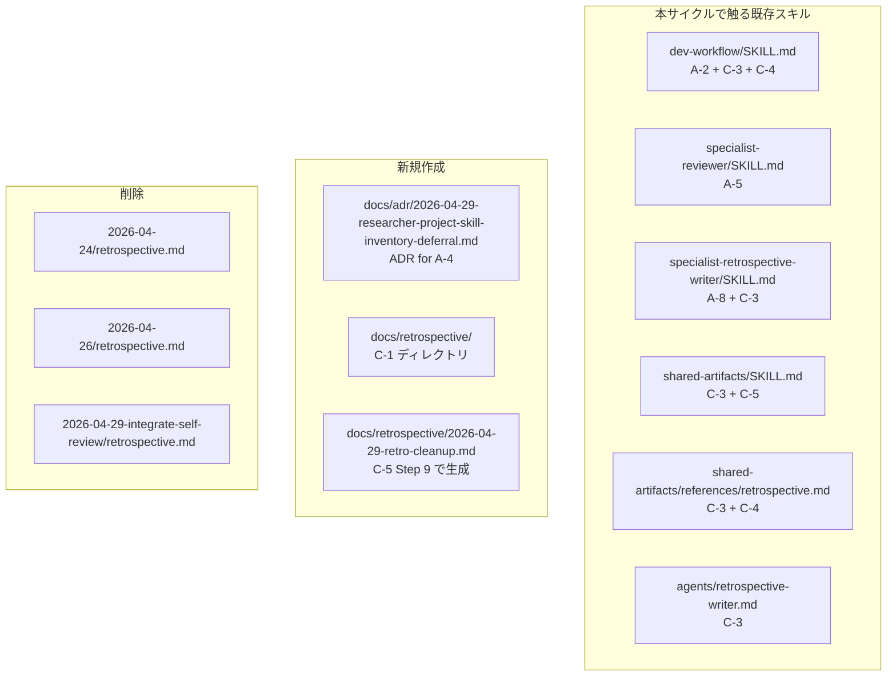

# Design Document: Retrospective Cleanup (2026-04-29-retro-cleanup)

- **Identifier:** 2026-04-29-retro-cleanup
- **Author:** Main (architect 兼任、軽量スコープのため)
- **Created at:** 2026-04-29T13:00:00Z
- **Last updated:** 2026-04-29T13:00:00Z
- **Status:** draft
- **Baseline commit:** `5e71ece`（Step 1 ユーザー承認時点）

## 設計目標と制約

### 目的（Intent Spec より）

retrospective 由来の運用ルールを 5 項目 (A-2 / A-5 / A-8 / ADR for A-4 / C retrospective 構造変更) に絞って反映する。skill-reviewer ルール違反を新たに発生させず、Specialist 個別本文への重複追記を避ける。

### 主要制約

- Markdown のみ、実行可能コードなし
- `references/` 新規ディレクトリは作成しない
- `docs/retrospective/` は新規作成 (ADR と同じパターン)
- 過去 retrospective 3 件は `git rm` で削除 (移動不要)
- Specialist 本文への追記は実証引用なしで簡潔に
- gsed 機械置換は不要 (本サイクルは新規追記中心)

## アプローチの概要

5 項目のうち 4 項目 (A-2 / A-5 / A-8 / C) は**既存スキル本文の限定追記**、1 項目 (ADR) は**新規ファイル 1 件の作成**。C は加えて**過去ファイルの削除**と**新規ディレクトリ作成**を含む。

各項目は独立しており、依存関係はないため Step 5 task-plan で全項目を Wave 1 並列に配置可能。検証は Step 8 で grep ベースに統一。

## 5 項目の詳細設計

### A-2. dev-workflow/SKILL.md に 3-5 案推奨ルールを追記

**対象ファイル**: `plugins/dev-workflow/skills/dev-workflow/SKILL.md`

**対象セクション**: `Report-Based Confirmation for In-Progress Questions` (現状 L41-L52)

**追記位置**: 「レポート最小構成」行の直下に 1 行追加

**追記文言** (実証引用なしの簡潔版):

```diff
   - レポート最小構成: `# 目的` / `# これまでの経緯` / `# 選択肢と根拠` / `# 推奨案` / `# 確認したい事項`
+   - 「選択肢と根拠」は **3-5 案を推奨**。2-3 案では選択肢を絞りすぎて事後修正が必要になりやすいため、複数アプローチを比較する場面では原則 3-5 案を提示する
```

**設計判断**:

- セクション内の既存項目 (端的な質問は禁止 / レポートは最終成果物に含めない / 保存先 / 最小構成 / ユーザー案内) と並列に配置することで、3-5 案ルールが Report-Based Confirmation プロトコルの一部であることが構造的に伝わる
- 計画段階の Specialist (intent-analyst / architect / qa-analyst / planner) はいずれも `dev-workflow/SKILL.md` を参照する設計のため、このルールは Specialist 個別本文に追記不要

### A-5. specialist-reviewer に holistic 小節を新設

**対象ファイル**: `plugins/dev-workflow/skills/specialist-reviewer/SKILL.md`

**対象セクション**: `## 観点別のレビュー指針` (現状 L88-L122)

**現状の構造**: `#### security` / `#### performance` / `#### readability` / `#### test-quality` / `#### api-design` の 5 小節。`holistic` 小節が完全欠落。

**追記内容**: 既存 5 小節の末尾に `#### holistic` 小節を新設:

```markdown
#### holistic

- design.md と実装の整合性チェック (Round 1 必須項目)
- Task Plan 完了判定 (TODO.md の全タスクが完了状態か)
- Intent Spec 成功基準充足見込み (各 SC が観測可能な形で達成されているか)
- 明白な bug の早期検出 (リンク切れ / frontmatter 不整合 / yaml syntax error / Mermaid 図の壊れ等)
```

**設計判断**:

- 旧 Self-Review が担っていた責務を holistic 観点に明示的に列挙
- `Round 1 必須項目` を冒頭に置くことで、実証されていた最頻出の見落とし (design.md 約束未達) を最初にチェックする運用を促す
- frontmatter / Step 7 セクションには既に holistic が反映済みのため、本文小節欠落のみを補完

### A-8. specialist-retrospective-writer に再活性化 SHA 列挙手順を追記

**対象ファイル**: `plugins/dev-workflow/skills/specialist-retrospective-writer/SKILL.md`

**対象セクション**: `## 作業手順` の 「データ分析」項目 (現状 L57-L62 付近)

**追記内容**: ループ回数・Blocker 履歴と並列に追加:

```markdown
- **再活性化タスクの SHA 列挙**: `TODO.md` で `re_activations >= 1` のタスクについて、再活性化を引き起こした修正コミット SHA を列挙する (retrospective.md の「課題」セクションで参照)
```

**設計判断**:

- データ分析セクションの既存項目 (ループ回数 / Blocker / ユーザー承認 / In-Progress 件数 / Specialist 起動回数) と並列配置
- 出力先は retrospective.md の「課題」セクション (既存テンプレ構造を活用、テンプレ自体は変更不要)
- A-8 と C-3 (specialist-retrospective-writer の出力先パス更新) は同一ファイルへの修正のため同一コミットにまとめる

### ADR. A-4 の保留記録

**対象ファイル**: `docs/adr/2026-04-29-researcher-project-skill-inventory-deferral.md` (新規作成)

**ファイル名**: 日付 (`2026-04-29`) + 内容 slug (`researcher-project-skill-inventory-deferral`)

**Frontmatter**: `confirmed: false` (adr スキル準拠)

**本文構成** (adr スキルテンプレート準拠):

```markdown
---
confirmed: false
---

# ADR: researcher Specialist の言語固有スキル棚卸し提案を保留

## Context
2026-04-26 サイクル (qa-design-step 追加) で researcher が言語固有スキルを能動的に
棚卸しした観点が高品質だったことから、改善提案として「researcher 本文にデフォルト
調査項目化」が出された。

## Decision
本提案を **対応せず保留**。Claude Code の自動ロード機構 (skill discovery) に期待し、
Specialist 起動コンテキストに必要な言語固有スキルが含まれることを前提とする。

## Impact
- researcher が言語固有スキルを能動的に棚卸しせず、自動ロードで暗黙利用
- サイクル間で必要なスキル取りこぼしが発生する可能性は残る

## 再検討トリガー
- Claude Code の skill discovery 挙動変更 (動的ロード廃止 / トリガー精度低下等)
- dev-workflow サイクルで「言語固有スキル取りこぼし」起因の Blocker / Major 発生
- dev-workflow CLI 化で Specialist 起動コンテキストを明示制御する設計が固まったとき

## 関連サイクル
- `docs/dev-workflow/2026-04-26-add-qa-design-step/`
```

**設計判断**:

- 本サイクル `2026-04-29-retro-cleanup` の C-4 で `2026-04-26-add-qa-design-step/retrospective.md` が削除されるため、ADR 内では retrospective ファイルではなくサイクルディレクトリを参照
- ADR は永続記録、retrospective は揮発レポートという役割分担を本 ADR 自体が体現

### C. retrospective 構造変更

5 つのサブ項目に分解:

#### C-1. 新規ディレクトリ作成

`docs/retrospective/` ディレクトリを作成。`docs/adr/` と同パターン。明示的な `mkdir` または最初のファイル作成 (C-5 の本サイクル retrospective) で自動作成。`.gitkeep` 不要。

#### C-2. 過去 retrospective 3 件の削除

`git rm` で削除:
- `docs/dev-workflow/2026-04-24-ai-dlc-plugin-bootstrap/retrospective.md`
- `docs/dev-workflow/2026-04-26-add-qa-design-step/retrospective.md`
- `docs/dev-workflow/2026-04-29-integrate-self-review-into-external/retrospective.md`

サイクルディレクトリ自体は維持 (intent-spec.md / design.md / etc. が残る)。

#### C-3. スキル本文の保存先パス更新

以下 6 箇所を新パス `docs/retrospective/<cycle-id>.md` に更新:

| ファイル | 行 | 現在 | 更新後 |
|---|---|---|---|
| `dev-workflow/SKILL.md` | L135 (Step 一覧テーブル) | `retrospective.md` | `retrospective.md (集約: docs/retrospective/<id>.md)` |
| `dev-workflow/SKILL.md` | L529 (成果物パス) | `docs/dev-workflow/<identifier>/retrospective.md` | `docs/retrospective/<identifier>.md` |
| `shared-artifacts/SKILL.md` | L54 (成果物一覧テーブル) | (Phase/Step 列のみ) | パス参照を新形式に更新 |
| `shared-artifacts/SKILL.md` | L134 (ASCII 図) | `└── retrospective.md` | ASCII 図から削除 (集約ディレクトリへ移動) |
| `shared-artifacts/references/retrospective.md` | L15 (ファイル位置) | `docs/dev-workflow/<identifier>/retrospective.md` | `docs/retrospective/<identifier>.md` |
| `specialist-retrospective-writer/SKILL.md` | L29 (成果物テーブル) | `docs/dev-workflow/<identifier>/retrospective.md` | `docs/retrospective/<identifier>.md` |
| `agents/retrospective-writer.md` | L25 (概要) | `docs/dev-workflow/<identifier>/retrospective.md` | `docs/retrospective/<identifier>.md` |

`<identifier>` はサイクル ID (`2026-04-29-retro-cleanup` 等)。

#### C-4. 削除ポリシーの記述追加

以下 2 箇所に「対応済み retrospective は削除する」運用ポリシーを記述:

- `dev-workflow/SKILL.md` の Step 9 (Retrospective) セクションまたは「サイクル外の成果物」相当に追加
- `shared-artifacts/references/retrospective.md` の「ファイル位置」直下に追加

**ポリシー文言** (簡潔版):

```markdown
**ライフサイクル**: retrospective.md は次サイクルで改善案項目を消化した時点で削除する一時的な報告ボックス。永続記録すべき判断は ADR に切り出す。`docs/adr/` (永続) と `docs/retrospective/` (揮発) の役割分担。
```

#### C-5. 本サイクル自身の retrospective 保存先

本サイクル `2026-04-29-retro-cleanup` の Step 9 で生成される retrospective は `docs/retrospective/2026-04-29-retro-cleanup.md` に保存。`docs/dev-workflow/2026-04-29-retro-cleanup/` ディレクトリには `retrospective.md` を作らない。

`shared-artifacts/SKILL.md` の「サイクル外の成果物」セクション (現 L148-L166) に **Retrospective** 項目を ADR / In-Progress 一時レポートと並列に追記:

```markdown
#### Retrospective (揮発)

- **保存場所:** `docs/retrospective/<cycle-id>.md` (`docs/adr/` 同様の集約ディレクトリ)
- **ライフサイクル:** 次サイクルで改善案項目を消化した時点で削除する一時的な報告ボックス
- **ADR との対比:** ADR は永続記録 (`confirmed: true` で不変)、retrospective は揮発レポート
```

## コンポーネント構成



## 代替案と採用理由

### A-2 配置先

| 案 | 内容 | 採用 |
|---|---|---|
| 案 1: specialist-architect 本文 | retrospective 出典どおりに architect に追記 | ❌ Specialist 個別本文への重複追記 |
| 案 2: shared-artifacts/references/design.md 更新 (2-3 → 3-5) | 設計書品質要件を直接更新 | ❌ 本サイクル外の概念 (設計書品質 vs 質問プロトコル) を混同 |
| 案 3: dev-workflow Report-Based Confirmation セクション | 質問プロトコルとして集約 | ✅ 採用 (ユーザー判断) |

### C 保存先構造

| 案 | 内容 | 採用 |
|---|---|---|
| 案 1: 現状維持 (`docs/dev-workflow/<id>/retrospective.md`) | 変更なし | ❌ 「対応済みかどうか判別困難」を解決しない |
| 案 2: `docs/retrospective/<id>.md` (ADR と同パターン) | 集約 | ✅ 採用 (ユーザー判断) |
| 案 3: `docs/dev-workflow/retrospective/<id>.md` (dev-workflow 配下) | プラグイン専属化 | ❌ 他プラグインの retrospective も将来同居する場合に拡張性が低い |

### C 過去ファイルの扱い

| 案 | 内容 | 採用 |
|---|---|---|
| 案 1: 移動 (`git mv` で旧パス → 新パス) | 履歴保持 | ❌ ユーザー判断で削除指示 |
| 案 2: 削除 (`git rm`) | git 履歴のみで参照可能 | ✅ 採用 (ユーザー判断、移動不要明示) |

## 拡張ポイント

- **将来 dev-workflow CLI 化時**: `docs/retrospective/` を CLI が走査して未消化提案を一覧表示する機能が追加可能。本サイクルで集約構造を採用したことで CLI 設計が容易になる
- **ADR 対比の運用拡張**: 永続記録すべき判断を ADR に切り出すフローが定着すれば、retrospective は提案ボックスとして純粋な役割に絞れる
- **A-4 / A-6 / A-7 の再検討**: 各 ADR / 不要マークの再検討トリガーが満たされた時点で個別判断

## 運用上の考慮事項

### 後方互換性

- 削除される 3 retrospective ファイルは git 履歴で参照可能。情報損失なし
- 進行中サイクル (本サイクル除く) はないため再開時の混乱なし
- 新パス `docs/retrospective/` は新規作成のため既存ディレクトリ衝突なし

### リスク

- **C-3 の更新漏れ**: 6 箇所の修正で 1 箇所でも漏れると整合性が崩れる → Step 8 Validation で `ggrep -nE 'docs/dev-workflow/<identifier>/retrospective\.md' plugins/dev-workflow/` が 0 件になることを確認
- **削除ポリシー文言の重複**: dev-workflow と reference の 2 箇所に書くため、将来更新時に片方だけ更新するとずれる → reference を真のソースとし、dev-workflow からは 1 行参照に統一する

### Task Decomposition への引き継ぎ

5 項目は独立しているため Step 5 task-plan で並列 Wave 配置可能:

- T1: A-2 (dev-workflow/SKILL.md 1 行追記)
- T2: A-5 (specialist-reviewer holistic 小節新設)
- T3: A-8 + C-3 retrospective-writer 部分 (specialist-retrospective-writer 同一ファイル修正)
- T4: ADR 新規作成 (docs/adr/ 新ファイル)
- T5: C-1 + C-2 + C-3 残り部分 (dev-workflow / shared-artifacts / references / templates / agents) + C-4 + C-5

検証は全 T 完了後に Step 8 で grep ベース一括実行。

## ADR 起票判定

本サイクル変更は dev-workflow プラグイン内のスキル責務再配置 + retrospective 構造変更であり、横断的決定ではない。新規 ADR は **A-4 の保留記録 1 件のみ** 起票。retrospective 構造変更 (C 項目) も dev-workflow プラグインの内部運用変更のため、ADR 起票せず本 design.md / Intent Spec で記録するに留める。

既存 ADR `docs/adr/2026-04-26-dev-workflow-rename-and-flatten.md` のフラット構造方針には違反しない (ステップ追加・削除・フェーズ概念再導入なし)。
