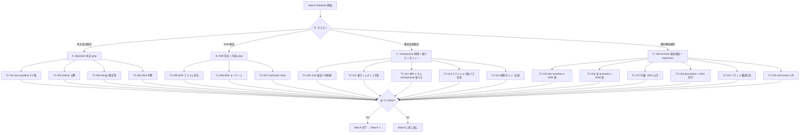
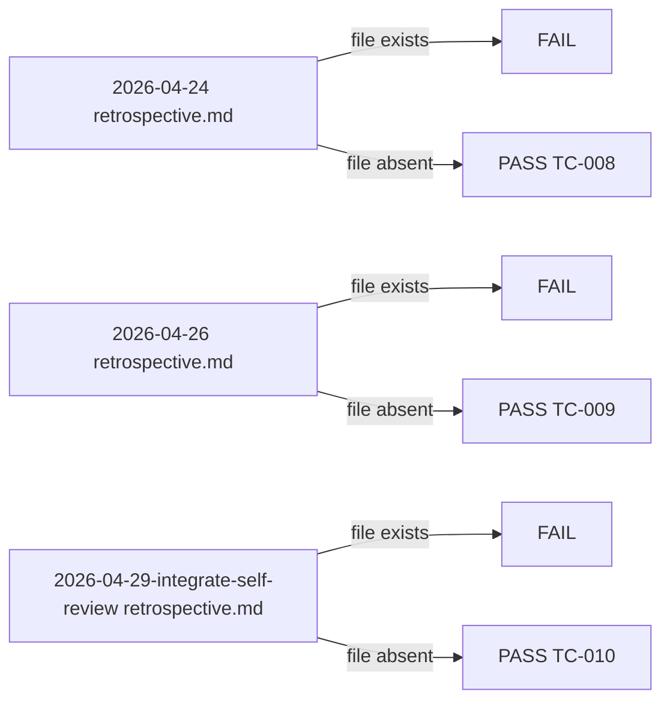

# QA Flow: 2026-04-29-retro-cleanup

本サイクルは静的観測のみのため、本質ロジック分岐は単純。ファイル存在 / grep 件数 / 行数の各観点から TC を分配。

## 全体フロー

## 過去 3 件削除分岐の詳細

## 各葉の TC-ID 対応

| 分岐結果 | TC-ID または skip 理由 |
|---|---|
| 全 TC PASS | Step 8 完了 |
| 1 つでも FAIL | Step 6 に差し戻し (該当タスクの再活性化) |
| TC-012 (Step 8 時点) | skip [Step 9 完了後に検証可、Step 8 では未検証で OK] |
| TC-IMPL-NNN | skip [Step 6 implementer が必要時に追記、現時点で予測なし] |

## 補足

- 全 TC のうち `manual × inspection` は TC-019 のみ (1/20 件、5%)
- 残り 19 件は automated でバッチ実行可能
- Step 6 ↔ Step 7 ループ (Round 1 で Major 検出 → Round 2 修正) は本サイクルでも適用
