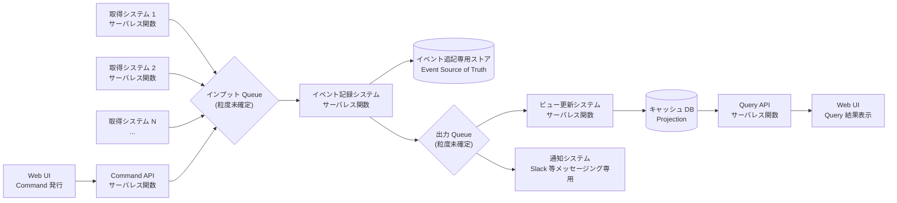

# Design Hint: feed-platform 全体アーキテクチャ素案

- **対象ロードマップ:** `feed-platform` (`docs/roadmap/feed-platform/roadmap.md`)
- **作成:** 2026-05-03
- **ステータス:** 揮発的な戦略層補助メモ (ADR ではない)

> **ライフサイクル方針:**
> 本ファイルはロードマップ Intent 段階 (戦略層) で記録された**未確定の構造素案**を、配下 `dev-workflow` サイクル (戦術層) に引き継ぐための**揮発的なメモ**である。次のいずれかの状態に到達した時点で本ファイルは**削除**または**ADR への昇格**を行う:
>
> - 配下 `dev-workflow` サイクル (特に永続化基盤 / 入力プラグイン基盤 / 定期実行基盤) の Step 3 (Design) で全体構造が確定し、各サイクルの `design.md` に反映された
> - 横断的な意思決定として ADR にすべき部分が抽出され、`docs/adr/` 配下に切り出された
>
> ADR ではないため、本ファイルの記述を「確定方針」として参照しないこと。確定済み制約はロードマップ本体 (`roadmap.md`) の「アーキテクチャ的制約」セクションに記載される。

## 目的

ロードマップの「アーキテクチャ的制約」(サーバレス原則 / マイクロサービス境界 / **イベントソーシング + CQRS**) を**具体的なフロー構造の素案**として可視化し、配下 `dev-workflow` サイクルの設計議論の出発点を提供する。**素案であり、配下サイクルでの再設計を妨げない**。

## 全体フロー素案 (CQRS パターン)

CQRS の本質は **「書き込み (Command) 軸と読み出し (Query) 軸の責務分離」**。両軸はイベントストア (Event Source of Truth) を介して結合する。

### 構造図

**入力 → queue → 記録 → queue → 出力** を左→右の一方向で表現する。subgraph によるグルーピングはレイアウトを乱すため使わない (グルーピングは図の前後の文章で説明する)。

書き込みの入力源 (取得システム N 件 + Web UI からの Command) はすべて**インプット Queue (`IQ`) に集約**される。Web UI からの mutation は `Command API` を経由する。`IQ` から右側はメインフロー (記録 → 出力 Queue → ビュー更新 / 通知 → キャッシュ DB → Query API → Web UI) が一直線に進む。

**図の補足:**

- 左端の入力源 (`A1` / `A2` / `AN` / `UI_CMD` 経由の `CMDAPI`) はすべて `IQ` に合流する。**入力 → Queue が必ず一方向**で、戻るエッジはない
- 図上で `Web UI` が 2 箇所 (`UI_CMD` と `UI_QRY`) に出るのは、CQRS で **mutation と query が別 API エンドポイント** (Command API / Query API) に分かれるため。実装上は同一クライアントプロセス
- `ES` (イベント追記専用ストア) は終端ノード (Source of Truth として保存されるのみ、本フローでは下流に流れない。再構築時のみ `VU` から参照される)
- `VU` と `NT` は `OQ` を購読する**並列分岐**。それ以降は完全に独立 (Web UI は `VC → QUERYAPI` のルート、通知は Slack 等の外部サービス)

### 流れの読み方 (2 軸 × 2 段階)

#### Command 軸 (書き込みフロー、左 → 中央)

1. **`Command 入力源`** が mutation を発火
   - **自動トリガー**: 取得システム (RSS / HTML 解析 / X リスト等) が定期実行基盤に呼ばれ、外部から取得したフィードを新規イベント候補として発行
   - **手動トリガー**: ユーザーが Web UI 上で操作 (例: 既読化 / お気に入り登録) し、`Command API` に mutation request を送信
2. `Command API` は受け取った mutation を**インプット Queue に投入**して即座に応答 (取得システムは直接 IQ に投入)
3. `イベント記録システム`が IQ からイベントを取り出し、検証後に**`イベント追記専用ストア`に追記** (UPDATE は使わない、INSERT 専用)
4. 同時に `出力 Queue` に「このイベントが起きた」というシグナルを投入 (Query 軸への引き渡し)

#### Query 軸 (読み出しフロー、中央 → 右)

1. `出力 Queue` を購読する 2 系統が**並列に走る**:
   - `ビュー更新システム` が `キャッシュ DB (Projection)` を更新 (= Query API が見るデータを最新化)
   - `通知システム` が Slack 等のメッセージングサービスに通知を送信 (CQRS の Query 軸とは独立した副作用)
2. ユーザーが Web UI で画面を表示 / リロードすると、`Query API` が `キャッシュ DB` を読み出して Web UI に返却

### 構造的制約 (図示済み方針)

- **Command 入力源と Query 出力先が両方 Web UI**: 実装は同一プロセスだが、CQRS により mutation と query が**異なる API エンドポイント** (Command API / Query API) に分かれる
- **`ビュー更新` と並列に走れるのは `通知` (Slack 等メッセージング) のみ**: Web UI への配信は必ず `キャッシュ DB → Query API → Web UI` の直列 pull 型ルート (push 型は採らない、SSE/WebSocket 採否は L7 で検討)
- **書き込みと読み出しの間に必ず非同期遅延が入る** (Eventual Consistency): Read-Your-Write 戦略は L7 で確定 (個人開発スコープでは「楽観的更新」が default 候補)
- **本図は L8 で言及する「Command API → IQ 経由」案を default として描画**: もう一方の選択肢「Command API → ER 直結」も実装上は妥当だが、図のシンプル化のため IQ 経由ルートを描き、論点として L8 に残している

## 採用方針 (ロードマップ「アーキテクチャ的制約」の具現化)

| 制約 (roadmap.md) | 本素案での実装方針 |
| --- | --- |
| サーバレス原則 | 取得 / Command API / イベント記録 / ビュー更新 / Query API / 通知の各システムは独立サーバレス関数。状態は Queue / DB / オブジェクトストレージ等に外出し |
| マイクロサービス境界 | 取得システムごと (アダプタごと) に独立関数。Command API / Query API / ビュー更新 / 通知も独立関数として展開し、責務単位でデプロイ・スケール可能 |
| イベントソーシング | 「イベント追記専用ストア」を中核 (Event Source of Truth)。キャッシュ DB はそのプロジェクション (再構築可能) |
| **CQRS** | **Command API (書き込み = mutation 受付) と Query API (読み出し = ビュー提供) を別関数 / 別エンドポイントに分離**。両者は同一 API レイヤに混在させない。Command 側は ER (イベント記録) 経由でイベント発行に専念し、Query 側は VC (キャッシュ DB) からの読み出しに専念。Read-Your-Write 整合戦略 (L7) は配下サイクル Step 3 で確定 |

## 未確定論点 (配下 `dev-workflow` サイクルに委譲)

### L1: インプット Queue の粒度

| 選択肢 | メリット | デメリット |
| --- | --- | --- |
| **取得システム単位** で個別 Queue | 取得元ごとに retry / DLQ / レート制限を独立設定可能。1 アダプタの障害が他に波及しない | Queue 数が取得システム数に比例して増加 (運用コスト・コスト増) |
| **全体で 1 Queue** に統一 | 運用シンプル / 観測一元化 | メッセージ種別ルーティングが必要 / 1 アダプタの暴走が全体に影響 |

→ **委譲先:** 入力プラグイン基盤マイルストーン Step 3 (Design)

### L2: イベント記録の出力性 (= 通知の起動経路)

| 選択肢 | 概要 |
| --- | --- |
| **イベント記録システム内で同期通知** | イベント記録時に通知も同関数内で発火。レイテンシ低 / イベント記録の責務肥大化 |
| **出力 Queue 経由の非同期通知** | 通知は別関数 (NT)。責務分離 / 非同期化 / 通知失敗のリトライが容易 / レイテンシ増 |
| **イベントストアの変更ストリーム駆動** | DynamoDB Streams 相当のストリーム機構で通知システムを起動。コードカップリング極小 / 機構依存 |

→ **委譲先:** 永続化基盤マイルストーン Step 3 (Design) + 出力プラグイン基盤マイルストーン Step 3 (Design) の調整

### L3: 出力 Queue の粒度

ビュー更新 (`VU`) と通知 (`NT` = Slack 等メッセージング) で同一 Queue を使うか責務ごとに分離するか。L2 の選択次第で消失する論点。

注: API / Web UI は出力 Queue の subscriber には**ならない** (`VC` → `API` の同期 pull 型に統一)。出力 Queue の購読側は `VU` と `NT` の 2 系統のみ。

→ **委譲先:** L2 と一体で議論

### L4: 取得情報用 DB の必要性

| 選択肢 | 概要 |
| --- | --- |
| **取得システムが状態を持つ** | 前回取得時刻 / カーソル / 差分検出ハッシュ等を取得システム側で保持。取得効率良好 / 関数のステートレス性が崩れる |
| **イベントストアに状態集約** | 取得進捗もイベントとして記録。取得システムは完全ステートレス / イベント数増加 / 取得効率低下の懸念 |
| **取得システム単位で軽量 KV** | サーバレス KV (Cloudflare KV / DynamoDB 等) を取得システムごとに割り当て。中庸 |

→ **委譲先:** 入力プラグイン基盤マイルストーン Step 3 (Design)

### L5: イベント追記専用ストアの選定軸

具体的サービス名 (DynamoDB / EventStore / Postgres 上の append-only テーブル等) は本ロードマップで確定しないが、選定軸として以下が候補:

- 強整合性が必要な集計範囲 (Aggregate 単位での順序保証)
- イベントの冪等性検証 (重複排除キー)
- スナップショット戦略 (大量イベント時の再構築コスト軽減)
- マルチリージョン / バックアップ戦略

→ **委譲先:** 永続化基盤マイルストーン Step 1 (Intent Clarification) + Step 3 (Design)

### L6: 定期実行基盤と取得システムの結合方式

定期実行基盤 (Cron 的サービス) が取得システムを起動する際、以下が論点:

- Cron が直接サーバレス関数を呼ぶか / インプット Queue にトリガーメッセージを投入するか
- AI 要約の周期起動も同じ機構で扱うか / 別系統にするか

→ **委譲先:** 定期実行基盤マイルストーン Step 3 (Design)

### L7: Read-Your-Write 整合戦略 (CQRS / イベントソーシング由来の本質的論点)

CQRS + イベントソーシングを採用する以上、**書き込み (Command 発行) から読み出し (Query 反映) までに必ず非同期遅延 (Eventual Consistency) が発生**する。Web UI から Command を発行したユーザーが直後に Query を行ったとき、自分の書き込みが反映されていない状態を見せてしまう問題への対処戦略を選定する必要がある。

| 戦略 | 概要 | メリット | デメリット |
| --- | --- | --- | --- |
| **A. 楽観的更新 (Optimistic UI)** | Command 発行と同時に Web UI が結果を予測表示。Query API から確定データが届いたら整合 (差分があれば修正・ロールバック) | サーバ実装シンプル / UX 滑らか / サーバレス関数の冷起動レイテンシを隠せる | クライアント実装が複雑 (予測ロジック / 整合判定 / ロールバック UI) / 失敗時の UX 設計が必要 |
| **B. 同期プロジェクション (Read-Your-Write 保証)** | Command API がイベント記録**と当該 Aggregate のプロジェクション更新を同一トランザクション**で完了させ、応答時には最新ビューも更新済みであることを保証 | クライアント実装シンプル / 認知負荷低 | Command レイテンシが伸びる / イベント記録とビュー更新の atomic 性確保が困難 (異種ストレージ間 transaction) / サーバレスとの相性悪 |
| **C. WebSocket / SSE による push** | Web UI が Query 側からの subscription を持ち、ビュー更新完了時にサーバから push を受信して画面を更新 | リアルタイム性 / 他ユーザーの変更も反映 / Web UI 側ロジック比較的シンプル | 接続維持コスト (サーバレスとの相性悪) / fanout 機構必要 / オフライン復帰時の差分同期が別途必要 |
| **D. Command 応答にイベント結果を含める** | Command API が応答ボディに「発行したイベント」を含めて返す。Web UI は予測ではなく確定情報で UI を更新 (ただしビューはまだ古い可能性あり) | 楽観的更新より確実 / クライアントロジック軽量 | ビュー (集計結果) は別途 Query で取り直し必要 / 楽観的更新と本質的に大差ない場面が多い |
| **E. Polling** | Web UI が Command 後に Query API を短い間隔で polling して更新を取得 | 実装極めてシンプル | サーバ負荷高 / レイテンシ目に見える / UX 劣化 |

**個人開発スコープでの推奨初期戦略:**

- **A (楽観的更新) + D (Command 応答にイベント結果) の組み合わせ**を Web UI のデフォルト戦略として採る。サーバレス前提と整合し、実装複雑性も許容範囲
- リアルタイム性が要件化された機能 (例: 取得結果の即時通知) のみ C (SSE) を選択的に採用
- B (同期プロジェクション) は採らない (サーバレス関数 + 異種ストレージ間 atomic transaction が困難なため)
- **「楽観的更新は必須か」への回答:** **必須ではないが、CQRS + サーバレス + 個人開発の組み合わせでは事実上の最有力候補**。代替戦略 (B/C/D/E) はそれぞれ明確なトレードオフを持ち、個人開発スコープでは A が最もコスト効率が良い

→ **委譲先:** 出力プラグイン基盤マイルストーン Step 1 (Intent Spec で UX 期待を成功基準化) + Step 3 (Design で戦略確定)

### L8: Web UI からの Command 経路における Queue 経由可否

Web UI が Command を発行する際、以下のいずれを採用するか:

| 選択肢 | 概要 |
| --- | --- |
| **Command API → ER 直結 (同期)** | Command API が直接 ER (イベント記録システム) を呼び、応答までユーザーを待たせる |
| **Command API → IQ 経由 (取得システムと同じ Queue 共用)** | Command を入力イベントとして取得システムからの経路と同じ Queue に流す。応答は acceptance のみ |
| **Command API → 専用 Queue 経由** | Web UI 由来の Command 専用 Queue を分け、ER に流す |

→ **委譲先:** 永続化基盤マイルストーン Step 3 (Design) + 出力プラグイン基盤マイルストーン Step 3 (Design) の調整 (L7 の戦略選択と一体)

## 関連

- ロードマップ本体: [`./roadmap.md`](./roadmap.md)
- ロードマップ進捗: [`./roadmap-progress.yaml`](./roadmap-progress.yaml)
- 配下 `dev-workflow` サイクル: 未着手 (`dev-roadmap` Step 2 Milestone Decomposition 後に確定)
