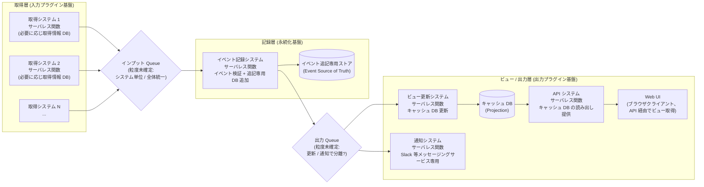

# Design Hint: feed-platform 全体アーキテクチャ素案

- **対象ロードマップ:** `feed-platform` (`docs/roadmap/feed-platform/roadmap.md`)
- **作成:** 2026-05-03
- **ステータス:** 揮発的な戦略層補助メモ (ADR ではない)

> **ライフサイクル方針:**
> 本ファイルはロードマップ Intent 段階 (戦略層) で記録された**未確定の構造素案**を、配下 `dev-workflow` サイクル (戦術層) に引き継ぐための**揮発的なメモ**である。次のいずれかの状態に到達した時点で本ファイルは**削除**または**ADR への昇格**を行う:
>
> - 配下 `dev-workflow` サイクル (特に永続化基盤 / 入力プラグイン基盤 / 定期実行基盤) の Step 3 (Design) で全体構造が確定し、各サイクルの `design.md` に反映された
> - 横断的な意思決定として ADR にすべき部分が抽出され、`docs/adr/` 配下に切り出された
>
> ADR ではないため、本ファイルの記述を「確定方針」として参照しないこと。確定済み制約はロードマップ本体 (`roadmap.md`) の「アーキテクチャ的制約」セクションに記載される。

## 目的

ロードマップの「アーキテクチャ的制約」(サーバレス原則 / マイクロサービス境界 / イベントソーシング / CORS) を**具体的なフロー構造の素案**として可視化し、配下 `dev-workflow` サイクルの設計議論の出発点を提供する。**素案であり、配下サイクルでの再設計を妨げない**。

## 全体フロー素案

**並列性の原則 (図中の構造的制約):**

- **`VU` (ビュー更新) と並列に走れるのは `NT` (通知システム = Slack 等メッセージング) のみ**
- **`Web UI` への配信は必ず `VC` → `API` の直列ルート**を経由する。`Web UI` は通知の並列ノードにはならない (push 型クライアントとしては扱わない)
- 「通知」は **Slack 等のメッセージング型サービス**に限定される。ブラウザ向け配信は `API` 経由の pull 型に統一

## 採用方針 (ロードマップ「アーキテクチャ的制約」の具現化)

| 制約 (roadmap.md) | 本素案での実装方針 |
| --- | --- |
| サーバレス原則 | 取得 / イベント記録 / ビュー更新 / 通知の各システムは独立サーバレス関数。状態は Queue / DB / オブジェクトストレージ等に外出し |
| マイクロサービス境界 | 取得システムごと (アダプタごと) に独立関数。ビュー更新 / API / 通知も独立関数として展開し、責務単位でデプロイ・スケール可能 |
| イベントソーシング | 「イベント追記専用ストア」を中核 (Event Source of Truth)。キャッシュ DB はそのプロジェクション (再構築可能) |
| CORS 配慮 | **Web UI への配信は必ず `キャッシュ DB → API → Web UI` の直列ルートに統一** (push 型は採らない)。CORS 方針は API システムが一手に引き受け、出力プラグイン基盤マイルストーン内で確定。Slack 等メッセージング系通知は CORS 対象外 |

## 未確定論点 (配下 `dev-workflow` サイクルに委譲)

### L1: インプット Queue の粒度

| 選択肢 | メリット | デメリット |
| --- | --- | --- |
| **取得システム単位** で個別 Queue | 取得元ごとに retry / DLQ / レート制限を独立設定可能。1 アダプタの障害が他に波及しない | Queue 数が取得システム数に比例して増加 (運用コスト・コスト増) |
| **全体で 1 Queue** に統一 | 運用シンプル / 観測一元化 | メッセージ種別ルーティングが必要 / 1 アダプタの暴走が全体に影響 |

→ **委譲先:** 入力プラグイン基盤マイルストーン Step 3 (Design)

### L2: イベント記録の出力性 (= 通知の起動経路)

| 選択肢 | 概要 |
| --- | --- |
| **イベント記録システム内で同期通知** | イベント記録時に通知も同関数内で発火。レイテンシ低 / イベント記録の責務肥大化 |
| **出力 Queue 経由の非同期通知** | 通知は別関数 (NT)。責務分離 / 非同期化 / 通知失敗のリトライが容易 / レイテンシ増 |
| **イベントストアの変更ストリーム駆動** | DynamoDB Streams 相当のストリーム機構で通知システムを起動。コードカップリング極小 / 機構依存 |

→ **委譲先:** 永続化基盤マイルストーン Step 3 (Design) + 出力プラグイン基盤マイルストーン Step 3 (Design) の調整

### L3: 出力 Queue の粒度

ビュー更新 (`VU`) と通知 (`NT` = Slack 等メッセージング) で同一 Queue を使うか責務ごとに分離するか。L2 の選択次第で消失する論点。

注: API / Web UI は出力 Queue の subscriber には**ならない** (`VC` → `API` の同期 pull 型に統一)。出力 Queue の購読側は `VU` と `NT` の 2 系統のみ。

→ **委譲先:** L2 と一体で議論

### L4: 取得情報用 DB の必要性

| 選択肢 | 概要 |
| --- | --- |
| **取得システムが状態を持つ** | 前回取得時刻 / カーソル / 差分検出ハッシュ等を取得システム側で保持。取得効率良好 / 関数のステートレス性が崩れる |
| **イベントストアに状態集約** | 取得進捗もイベントとして記録。取得システムは完全ステートレス / イベント数増加 / 取得効率低下の懸念 |
| **取得システム単位で軽量 KV** | サーバレス KV (Cloudflare KV / DynamoDB 等) を取得システムごとに割り当て。中庸 |

→ **委譲先:** 入力プラグイン基盤マイルストーン Step 3 (Design)

### L5: イベント追記専用ストアの選定軸

具体的サービス名 (DynamoDB / EventStore / Postgres 上の append-only テーブル等) は本ロードマップで確定しないが、選定軸として以下が候補:

- 強整合性が必要な集計範囲 (Aggregate 単位での順序保証)
- イベントの冪等性検証 (重複排除キー)
- スナップショット戦略 (大量イベント時の再構築コスト軽減)
- マルチリージョン / バックアップ戦略

→ **委譲先:** 永続化基盤マイルストーン Step 1 (Intent Clarification) + Step 3 (Design)

### L6: 定期実行基盤と取得システムの結合方式

定期実行基盤 (Cron 的サービス) が取得システムを起動する際、以下が論点:

- Cron が直接サーバレス関数を呼ぶか / インプット Queue にトリガーメッセージを投入するか
- AI 要約の周期起動も同じ機構で扱うか / 別系統にするか

→ **委譲先:** 定期実行基盤マイルストーン Step 3 (Design)

## 関連

- ロードマップ本体: [`./roadmap.md`](./roadmap.md)
- ロードマップ進捗: [`./roadmap-progress.yaml`](./roadmap-progress.yaml)
- 配下 `dev-workflow` サイクル: 未着手 (`dev-roadmap` Step 2 Milestone Decomposition 後に確定)
