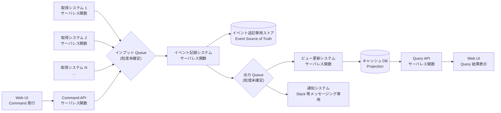
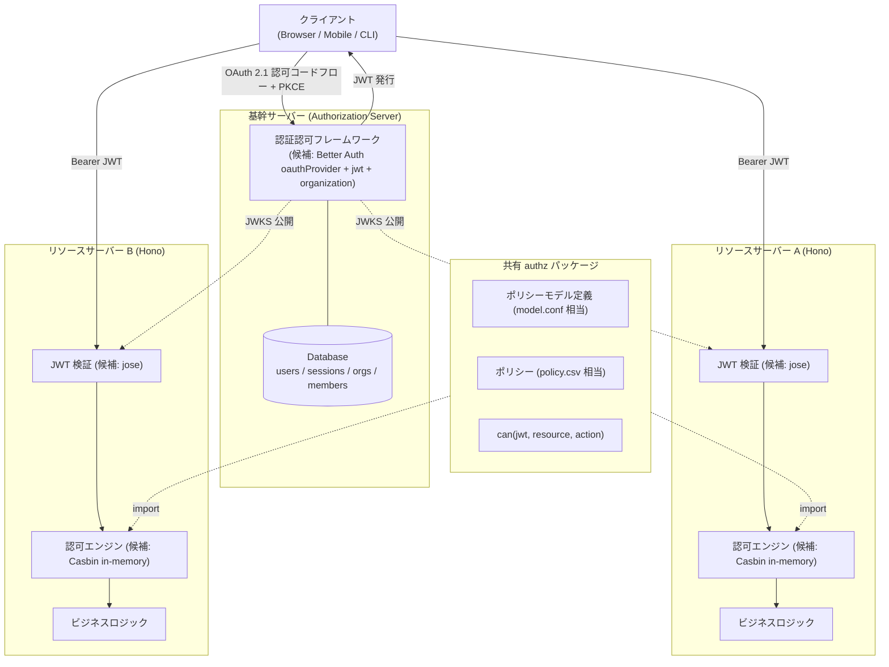
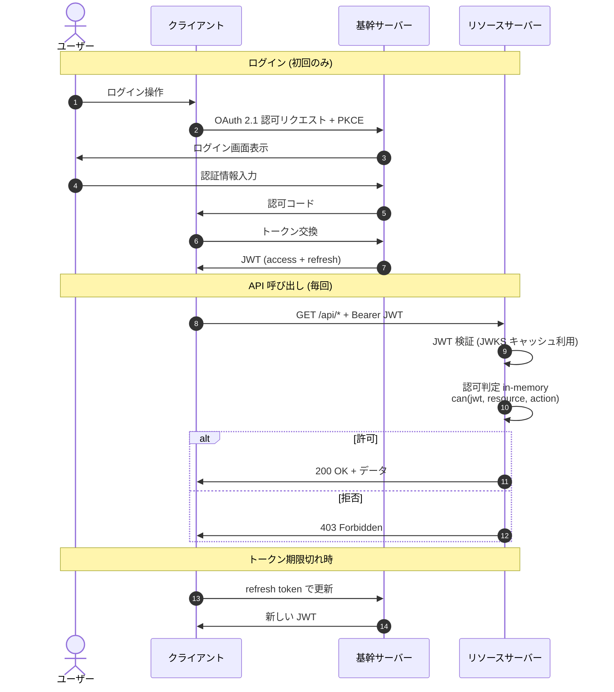

# Design Hint: feed-platform 全体アーキテクチャ素案

- **対象ロードマップ:** `feed-platform` (`docs/roadmap/feed-platform/roadmap.md`)
- **作成:** 2026-05-03
- **ステータス:** 揮発的な戦略層補助メモ (ADR ではない)

> **ライフサイクル方針:**
> 本ファイルはロードマップ Intent 段階 (戦略層) で記録された**未確定の構造素案**を、配下 `dev-workflow` サイクル (戦術層) に引き継ぐための**揮発的なメモ**である。次のいずれかの状態に到達した時点で本ファイルは**削除**または**ADR への昇格**を行う:
>
> - 配下 `dev-workflow` サイクル (特に永続化基盤 / 入力プラグイン基盤 / 定期実行基盤) の Step 3 (Design) で全体構造が確定し、各サイクルの `design.md` に反映された
> - 横断的な意思決定として ADR にすべき部分が抽出され、`docs/adr/` 配下に切り出された
>
> ADR ではないため、本ファイルの記述を「確定方針」として参照しないこと。確定済み制約はロードマップ本体 (`roadmap.md`) の「アーキテクチャ的制約」セクションに記載される。

## 目的

ロードマップの「アーキテクチャ的制約」(サーバレス原則 / マイクロサービス境界 / **イベントソーシング + CQRS**) を**具体的なフロー構造の素案**として可視化し、配下 `dev-workflow` サイクルの設計議論の出発点を提供する。**素案であり、配下サイクルでの再設計を妨げない**。

## 全体フロー素案 (CQRS パターン)

CQRS の本質は **「書き込み (Command) 軸と読み出し (Query) 軸の責務分離」**。両軸はイベントストア (Event Source of Truth) を介して結合する。

### 構造図

**入力 → queue → 記録 → queue → 出力** を左→右の一方向で表現する。subgraph によるグルーピングはレイアウトを乱すため使わない (グルーピングは図の前後の文章で説明する)。

書き込みの入力源 (取得システム N 件 + Web UI からの Command) はすべて**インプット Queue (`IQ`) に集約**される。Web UI からの mutation は `Command API` を経由する。`IQ` から右側はメインフロー (記録 → 出力 Queue → ビュー更新 / 通知 → キャッシュ DB → Query API → Web UI) が一直線に進む。



**図の補足:**

- 左端の入力源 (`A1` / `A2` / `AN` / `UI_CMD` 経由の `CMDAPI`) はすべて `IQ` に合流する。**入力 → Queue が必ず一方向**で、戻るエッジはない
- 図上で `Web UI` が 2 箇所 (`UI_CMD` と `UI_QRY`) に出るのは、CQRS で **mutation と query が別 API エンドポイント** (HTTP 動詞ベース) に分かれるため。実装上は同一クライアントプロセス
- 図中の `Command API` / `Query API` ノードは**リソース単位 BFF 内部の Command Handler 経路 / Query Handler 経路**を表す論理表現 (= 物理的には同一 BFF 関数内のコードパス)。物理デプロイ単位の方針は L9 (リソース単位 BFF + 内部 CQRS) を参照
- `ES` (イベント追記専用ストア) は終端ノード (Source of Truth として保存されるのみ、本フローでは下流に流れない。再構築時のみ `VU` から参照される)
- `VU` と `NT` は `OQ` を購読する**並列分岐**。それ以降は完全に独立 (Web UI は `VC → QUERYAPI` のルート、通知は Slack 等の外部サービス)

### 流れの読み方 (2 軸 × 2 段階)

#### Command 軸 (書き込みフロー、左 → 中央)

1. **`Command 入力源`** が mutation を発火
   - **自動トリガー**: 取得システム (RSS / HTML 解析 / X リスト等) が定期実行基盤に呼ばれ、外部から取得したフィードを新規イベント候補として発行
   - **手動トリガー**: ユーザーが Web UI 上で操作 (例: 既読化 / お気に入り登録) し、`Command API` に mutation request を送信
2. `Command API` は受け取った mutation を**インプット Queue に投入**して即座に応答 (取得システムは直接 IQ に投入)
3. `イベント記録システム`が IQ からイベントを取り出し、検証後に**`イベント追記専用ストア`に追記** (UPDATE は使わない、INSERT 専用)
4. 同時に `出力 Queue` に「このイベントが起きた」というシグナルを投入 (Query 軸への引き渡し)

#### Query 軸 (読み出しフロー、中央 → 右)

1. `出力 Queue` を購読する 2 系統が**並列に走る**:
   - `ビュー更新システム` が `キャッシュ DB (Projection)` を更新 (= Query API が見るデータを最新化)
   - `通知システム` が Slack 等のメッセージングサービスに通知を送信 (CQRS の Query 軸とは独立した副作用)
2. ユーザーが Web UI で画面を表示 / リロードすると、`Query API` が `キャッシュ DB` を読み出して Web UI に返却

### 構造的制約 (図示済み方針)

- **Command 入力源と Query 出力先が両方 Web UI**: 実装は同一プロセスだが、CQRS により mutation と query が**異なる API エンドポイント** (Command API / Query API) に分かれる
- **`ビュー更新` と並列に走れるのは `通知` (Slack 等メッセージング) のみ**: Web UI への配信は必ず `キャッシュ DB → Query API → Web UI` の直列 pull 型ルート (push 型は採らない、SSE/WebSocket 採否は L7 で検討)
- **書き込みと読み出しの間に必ず非同期遅延が入る** (Eventual Consistency): Read-Your-Write 戦略は L7 で確定 (個人開発スコープでは「楽観的更新」が default 候補)
- **本図は L8 で言及する「Command API → IQ 経由」案を default として描画**: もう一方の選択肢「Command API → ER 直結」も実装上は妥当だが、図のシンプル化のため IQ 経由ルートを描き、論点として L8 に残している

## 採用方針 (ロードマップ「アーキテクチャ的制約」の具現化)

| 制約 (roadmap.md)    | 本素案での実装方針                                                                                                                                                                                                                                                                                                                |
| -------------------- | --------------------------------------------------------------------------------------------------------------------------------------------------------------------------------------------------------------------------------------------------------------------------------------------------------------------------------- |
| サーバレス原則       | 取得 / Command API / イベント記録 / ビュー更新 / Query API / 通知の各システムは独立サーバレス関数。状態は Queue / DB / オブジェクトストレージ等に外出し                                                                                                                                                                           |
| マイクロサービス境界 | 取得システムごと (アダプタごと) に独立関数。Command API / Query API / ビュー更新 / 通知も独立関数として展開し、責務単位でデプロイ・スケール可能                                                                                                                                                                                   |
| イベントソーシング   | 「イベント追記専用ストア」を中核 (Event Source of Truth)。キャッシュ DB はそのプロジェクション (再構築可能)                                                                                                                                                                                                                       |
| **CQRS**             | **Command API (書き込み = mutation 受付) と Query API (読み出し = ビュー提供) を別関数 / 別エンドポイントに分離**。両者は同一 API レイヤに混在させない。Command 側は ER (イベント記録) 経由でイベント発行に専念し、Query 側は VC (キャッシュ DB) からの読み出しに専念。Read-Your-Write 整合戦略 (L7) は配下サイクル Step 3 で確定 |

## 未確定論点 (配下 `dev-workflow` サイクルに委譲)

### L1: インプット Queue の粒度

| 選択肢                            | メリット                                                                              | デメリット                                                      |
| --------------------------------- | ------------------------------------------------------------------------------------- | --------------------------------------------------------------- |
| **取得システム単位** で個別 Queue | 取得元ごとに retry / DLQ / レート制限を独立設定可能。1 アダプタの障害が他に波及しない | Queue 数が取得システム数に比例して増加 (運用コスト・コスト増)   |
| **全体で 1 Queue** に統一         | 運用シンプル / 観測一元化                                                             | メッセージ種別ルーティングが必要 / 1 アダプタの暴走が全体に影響 |

→ **委譲先:** 入力プラグイン基盤マイルストーン Step 3 (Design)

### L2: イベント記録の出力性 (= 通知の起動経路)

| 選択肢                                 | 概要                                                                                         |
| -------------------------------------- | -------------------------------------------------------------------------------------------- |
| **イベント記録システム内で同期通知**   | イベント記録時に通知も同関数内で発火。レイテンシ低 / イベント記録の責務肥大化                |
| **出力 Queue 経由の非同期通知**        | 通知は別関数 (NT)。責務分離 / 非同期化 / 通知失敗のリトライが容易 / レイテンシ増             |
| **イベントストアの変更ストリーム駆動** | DynamoDB Streams 相当のストリーム機構で通知システムを起動。コードカップリング極小 / 機構依存 |

→ **委譲先:** 永続化基盤マイルストーン Step 3 (Design) + 出力プラグイン基盤マイルストーン Step 3 (Design) の調整

### L3: 出力 Queue の粒度

ビュー更新 (`VU`) と通知 (`NT` = Slack 等メッセージング) で同一 Queue を使うか責務ごとに分離するか。L2 の選択次第で消失する論点。

注: API / Web UI は出力 Queue の subscriber には**ならない** (`VC` → `API` の同期 pull 型に統一)。出力 Queue の購読側は `VU` と `NT` の 2 系統のみ。

→ **委譲先:** L2 と一体で議論

### L4: 取得情報用 DB の必要性

| 選択肢                        | 概要                                                                                                            |
| ----------------------------- | --------------------------------------------------------------------------------------------------------------- |
| **取得システムが状態を持つ**  | 前回取得時刻 / カーソル / 差分検出ハッシュ等を取得システム側で保持。取得効率良好 / 関数のステートレス性が崩れる |
| **イベントストアに状態集約**  | 取得進捗もイベントとして記録。取得システムは完全ステートレス / イベント数増加 / 取得効率低下の懸念              |
| **取得システム単位で軽量 KV** | サーバレス KV (Cloudflare KV / DynamoDB 等) を取得システムごとに割り当て。中庸                                  |

→ **委譲先:** 入力プラグイン基盤マイルストーン Step 3 (Design)

### L5: イベント追記専用ストアの選定軸

具体的サービス名 (DynamoDB / EventStore / Postgres 上の append-only テーブル等) は本ロードマップで確定しないが、選定軸として以下が候補:

- 強整合性が必要な集計範囲 (Aggregate 単位での順序保証)
- イベントの冪等性検証 (重複排除キー)
- スナップショット戦略 (大量イベント時の再構築コスト軽減)
- マルチリージョン / バックアップ戦略

→ **委譲先:** 永続化基盤マイルストーン Step 1 (Intent Clarification) + Step 3 (Design)

### L6: 定期実行基盤と取得システムの結合方式

定期実行基盤 (Cron 的サービス) が取得システムを起動する際、以下が論点:

- Cron が直接サーバレス関数を呼ぶか / インプット Queue にトリガーメッセージを投入するか
- AI 要約の周期起動も同じ機構で扱うか / 別系統にするか

→ **委譲先:** 定期実行基盤マイルストーン Step 3 (Design)

### L7: Read-Your-Write 整合戦略 (CQRS / イベントソーシング由来の本質的論点)

CQRS + イベントソーシングを採用する以上、**書き込み (Command 発行) から読み出し (Query 反映) までに必ず非同期遅延 (Eventual Consistency) が発生**する。Web UI から Command を発行したユーザーが直後に Query を行ったとき、自分の書き込みが反映されていない状態を見せてしまう問題への対処戦略を選定する必要がある。

#### 個別戦略の評価

| 戦略                                                 | 概要                                                                                                                        | 評価                                                                                                                                                                                                     |
| ---------------------------------------------------- | --------------------------------------------------------------------------------------------------------------------------- | -------------------------------------------------------------------------------------------------------------------------------------------------------------------------------------------------------- |
| **A. 楽観的更新 (Optimistic UI)**                    | Command 発行と同時に Web UI が結果を予測表示。Query API から確定データが届いたら整合 (差分があれば修正・ロールバック)       | **採用**。サーバレスの cold start を隠せる。Web UI 側の予測ロジックが必要                                                                                                                                |
| **B. 同期プロジェクション (Aggregate 単位部分採用)** | Command API がイベント記録と**当該 Aggregate のキャッシュ DB エントリ更新**を同一トランザクションで完了させ、確定断面を返す | **部分採用 (Aggregate 単位限定)**。同一 DB / DynamoDB TransactWriteItems 等で実装可能。全プロジェクション (集計値含む) の同期は不可                                                                      |
| **C. WebSocket / SSE による push**                   | Web UI が Query 側からの subscription を持ち、ビュー更新完了時にサーバから push を受信して画面を更新                        | **限定採用**。リアルタイム要件の機能 (集計バッジ / 他ユーザー変更反映等) のみ                                                                                                                            |
| **D. Command 応答にイベント情報を返す**              | Command API が応答ボディに「発行したイベント」を含めて返す                                                                  | **採らない** — Web UI 側にバックエンド `VU` と同じプロジェクションロジック (イベント → ビュー差分) を複製する必要があり DRY 違反。A と組み合わせるとロジック二重化 (予測ロジック + イベント適用ロジック) |
| **E. Polling**                                       | Web UI が Command 後に Query API を短い間隔で polling して更新を取得                                                        | **限定用途のみ**。長時間処理の進捗監視等 (例: AI 要約完了待ち)                                                                                                                                           |

#### Tier 階層推奨 (Web UI 実装パターン)

mutation の性質に応じて 3 階層で使い分ける:

##### Tier 1 (default): 純粋な楽観的更新 (戦略 A のみ)

```
[t=0]    Web UI: 予測ロジックでローカル state 即時更新
[t=0]    POST /feeds/123/mark-as-read
[t=0.3s] 200 OK (空ボディ)
[t=0.3s] Web UI: 何もしない (予測値が正解とみなす)
         4xx/5xx → ローカル state を rollback + エラー表示
```

- 単純な mutation (toggle 既読 / 削除 / お気に入り) はこれで十分
- Web UI 側のロジックは「予測」だけ
- 集計値や関連エンティティの更新は次回 Query で取得 (Eventual Consistency 受容)

##### Tier 2 (複雑な mutation): 楽観的更新 + Aggregate 断面返却 (戦略 A + B 部分採用)

```
[t=0]    Web UI: 予測ロジックで暫定 state 更新
[t=0]    POST /feeds/123/add-tag
[t=0.3s] 200 OK + { feed: { id: 123, tags: [...], updatedAt: "..." } }  # 当該 Aggregate の確定断面
[t=0.3s] Web UI: レスポンスのデータで state を**上書き** (差分計算ロジック不要)
         エラーなら rollback
```

- 複数フィールドが連動して更新される mutation (例: タグ追加で関連集計も変わる)
- Command API は当該 Aggregate のキャッシュ DB エントリを同期更新し、確定断面を返す (戦略 B の Aggregate 単位部分採用)
- Web UI 側のロジックは「予測」のみ。受信時は単純な上書きで済む (戦略 D の二重ロジック問題を回避)
- 全プロジェクション (集計値 / 関連エンティティ含む) の同期は不可なので、それらは Eventual Consistency 領域に残る

##### Tier 3 (集計値 / リアルタイム): SSE / Polling 補強

- 集計値の即時反映 (例: 「未読数バッジ」) — `C (SSE)` を選択追加
- 長時間処理の完了監視 (例: AI 要約生成) — `E (Polling)` で割り切る

#### 「楽観的更新は必須か」への回答

**必須ではないが、CQRS + サーバレス + 個人開発の組み合わせでは事実上の最有力候補**。Tier 1 / Tier 2 はいずれも基盤に楽観的更新 (戦略 A) を据えており、Web UI の即時反応性を確保する。戦略 D (イベント情報返却) は「楽観的更新の代替」になりそうに見えて実は Web UI 側ロジックを増やす罠なので採用しない。

→ **委譲先:** 出力プラグイン基盤マイルストーン Step 1 (Intent Spec で UX 期待を成功基準化) + Step 3 (Design で Tier 1/2/3 の適用ルール確定)

### L8: Web UI からの Command 経路における Queue 経由可否

Web UI が Command を発行する際、以下のいずれを採用するか:

| 選択肢                                                        | 概要                                                                                          |
| ------------------------------------------------------------- | --------------------------------------------------------------------------------------------- |
| **Command Handler → ER 直結 (同期)**                          | Command Handler が直接 ER (イベント記録システム) を呼び、応答までユーザーを待たせる           |
| **Command Handler → IQ 経由 (取得システムと同じ Queue 共用)** | Command を入力イベントとして取得システムからの経路と同じ Queue に流す。応答は acceptance のみ |
| **Command Handler → 専用 Queue 経由**                         | Web UI 由来の Command 専用 Queue を分け、ER に流す                                            |

注: Tier 2 (Aggregate 断面返却) を採る場合は Command Handler 内で Cache DB の同期更新が必要なので、**ER 直結 (同期)** が事実上の必然。Tier 1 (純粋な楽観的更新) なら Queue 経由でも成立。

→ **委譲先:** 永続化基盤マイルストーン Step 3 (Design) + 出力プラグイン基盤マイルストーン Step 3 (Design) の調整 (L7 の戦略選択と一体)

### L9: Command API / Query API の物理デプロイ単位 (リソース単位 BFF + 内部 CQRS)

#### 論点の本質

CQRS の責務分離 (Command と Query の分離) を**物理デプロイ単位でも分離するか**、それとも**論理分離だけ守って物理は統合するか**。design-hint.md 初版では Mermaid 図上に `Command API` と `Query API` を別ノードとして描いたが、これは**物理分離を default にしてしまっている**ため再検討が必要。

#### 一般論的なコンセンサス

業界の現代的な合意 (Martin Fowler "MonolithFirst", Sam Newman "Building Microservices" 第 2 版):

- **「最初から物理分離するのは過剰」** — 物理分離は段階的に必要時に切り出す
- 物理分離が必要となる「明確な閾値」 — Read/Write のスループット差が桁違い / Query 側の独立 fan-out 処理 / 別チーム所有 / 障害分離が SLA 必須
- 個人開発スコープではこれらの閾値はほぼ現れない

#### 採用方針: **Resource-Oriented BFF + Internal CQRS** パターン

**フロントエンドから見えるリソース単位で BFF を集約し、各 BFF 内部で Command Handler / Query Handler を論理分離する**:

```
Web UI ──┬─→ Feed BFF       (POST/PUT/DELETE → Cmd Handler / GET → Query Handler)
         ├─→ Tag BFF        (同上)
         ├─→ Summary BFF    (AI 要約リソース)
         └─→ User BFF       (認証認可)

各 BFF 内部:
  - Command Handler 経路: → IQ → ER → ES (Event Store) → (Tier 2 なら) Cache DB の Aggregate エントリ同期更新
  - Query Handler 経路:   → Cache DB の対応リソースエントリ読み出し
```

リソース境界の指針は **DDD の Aggregate**。BFF の責務は「単一リソースに対する全操作 (Command + Query) を集約」。

#### 採用根拠

| 観点                                   | Resource-Oriented BFF (採用)                         | Command/Query 物理分離                        |
| -------------------------------------- | ---------------------------------------------------- | --------------------------------------------- |
| コロケーション原則                     | **★★★** リソース単位で全コードが集約、変更が局所化   | ★ Command/Query が分散                        |
| マイクロサービス境界の自然性           | **★★★** リソース境界 = ビジネス境界 = Aggregate 境界 | ★ Read/Write 軸は技術的境界、ビジネス的意味薄 |
| Tier 2 (Aggregate 断面返却) 実装容易性 | **★★★** 1 関数内で完結                               | ★ ネットワーク hop + 認証情報持ち越し必要     |
| 独立スケーリング                       | ★★ リソース別 (例: AI 要約と認証は別最適化)          | ★★★ Read/Write 別 (個人開発では効きにくい)    |
| 段階的移行容易性                       | **★★★** 内部分離維持で物理分離に切替容易             | — (既に分離済)                                |
| 個人開発スコープ適合度                 | **★★★**                                              | ★★                                            |

リソース境界の分離は **「Read/Write 軸の分離」より個人開発における実用上重要な軸での分離**。AI 要約 BFF (重く頻度低) と認証 BFF (軽く頻度高) は明らかに別最適化の対象だが、両者の中の Read/Write 軸は本質的にスケーリング特性が同じ。

#### 注意点

- **リソース境界の決め方**: DDD の Aggregate を境界指針にする。細かすぎると依存スパゲティ、大きすぎるとモノリス化
- **クロス-リソース操作 (例: 「既読化 + AI 要約トリガー」)**: 既存の Event Sourcing + 出力 Queue 構造で対応 (Saga / イベント駆動)。BFF 統合してもこの仕組みは変わらない
- **共通横断関心事 (認証 / Rate Limit / Logging)**: Edge Layer (Cloudflare Workers の middleware 等) や Sidecar / Layer で実装し、各リソース BFF は本質ロジックに専念
- **将来の物理分離移行**: BFF 内で Command Handler / Query Handler のコード分離を厳守しておけば、必要になった時点でリソース内 Read/Write 物理分割も容易

#### Mermaid 図への影響

本論点は **API レイヤの内部実装に閉じる**ため、`design-hint.md` の構造図 (取得 → IQ → ER → ES → OQ → VU/NT → VC) は変更不要。図中の `Command API` / `Query API` ノードは「リソース単位 BFF 内の Command Handler 経路 / Query Handler 経路」と読み替える (= 物理的には同一 BFF 関数内のコードパス)。図の補足にこの注釈を追加することで二重表現を保つ。

→ **委譲先:** 各リソース系マイルストーン (永続化基盤 / 出力プラグイン基盤 / AI 要約 / 認証認可) の Step 3 (Design) で BFF 単位の確定。Edge Layer の共通横断関心事は別マイルストーンとして切り出す可能性あり (Step 2 Milestone Decomposition で判断)

## 認証認可アーキテクチャの素案

> 出典: 2026-05-05 に提供された外部メモ (architecture.md / architecture-diagrams.md) を本ファイルに統合。ms-01 サイクルで「アーキテクチャ大枠」は intent-spec.md に確定済 (Q2.7) だが、**具体技術選定は本セクションに素案として留め、配下マイルストーン (主に ms-02 / ms-03 / ms-04) の Step 3 (Design) で確定 / ADR 化する**。本セクションは ADR ではない。
>
> 本素案は OAuth 2.1 + JWT + 共有静的ポリシー という前提を採る。これは「リクエスト処理経路に認可サーバー問い合わせを発生させない」「ポリシーを Git 管理可能とする」「認可判定をローカルで完結させる」目的のもと、個人開発スコープに過剰でない最小構成として選定。

### A. 構成要素の役割と責務

| 構成要素 | 役割 | DB 所有 | 認証認可ロジック |
| --- | --- | --- | --- |
| **クライアント** (Web フロント / 将来 mobile / CLI) | OAuth 2.1 クライアントとして JWT を取得 / `Authorization: Bearer <JWT>` 送信 | × | なし (トークン保持のみ) |
| **基幹サーバー** (Authorization Server) | 認証 + 組織 / メンバー / ロール管理 + OAuth 2.1 認可フロー + JWT 発行 + JWKS 公開 | **○** (users / sessions / orgs / members) | あり (ロール割当の唯一の真実) |
| **リソースサーバー** (バックエンド側 BFF / API) | JWT 検証 (JWKS キャッシュ) + 認可判定 (in-memory) + ビジネスロジック | × (基幹 DB は共有しない / 業務 DB は別個) | あり (リクエスト時判定) |
| **共有 authz パッケージ** | ロール定義 (`owner` / `admin` / `member` 等) + ポリシー (`policy.csv` 相当) + `can(jwt, resource, action)` 関数 | — | ポリシー定義のソース |

### B. 全体構成図



### C. 認証認可シーケンス



### D. 具体技術選定 (素案 / 配下マイルストーンで確定 or 差し替え)

| レイヤー | 候補ツール | 役割 | 委譲先マイルストーン |
| --- | --- | --- | --- |
| 基幹サーバー実装 | Better Auth (`oauthProvider` + `jwt` + `organization` プラグイン) | OAuth 2.1 認可サーバー / JWT 発行 / 組織管理 | ms-02 (Passkey + Magic Link) / ms-03 (RBAC + Organization) |
| JWT 検証 | `jose` (`createRemoteJWKSet` + `jwtVerify`) | JWKS キャッシュ + 署名 / クレーム検証 | ms-02 / 各リソースサーバー導入時 |
| 認可エンジン | Casbin (in-memory) | ロールベースのポリシー判定 | ms-03 (RBAC) |
| 共有 authz パッケージ | `@<scope>/authz` 形式の monorepo パッケージ (`model.conf` + `policy.csv` + `can()` 関数を内包) | ポリシー定義の Git 管理配布 | ms-03 (作成) / ms-04 (期間限定共有で拡張) |

### E. JWT ペイロード設計 (素案)

```typescript
type AppJWTPayload = {
  sub: string                                 // user id
  org_id: string                              // active organization id
  org_role: 'owner' | 'admin' | 'member'      // 組織内のロール
}
```

JWT 発行時に `definePayload` 等の機構で active organization のロールを展開して埋め込む方式を素案とする。ロード時のクレーム形状は ms-03 で確定。

### F. 認可判定の実装イメージ (リソースサーバー側、素案)

```typescript
app.delete('/projects/:id', authMiddleware, async (c) => {
  const jwt = c.get('user')
  const project = await db.projects.findById(c.req.param('id'))

  if (!await can(jwt, { type: 'project', org_id: project.orgId }, 'delete')) {
    return c.json({ error: 'Forbidden' }, 403)
  }
  // ビジネスロジック
})
```

### G. DB 所有方針

- **基幹サーバーのみ**が認証認可 DB を所有 (users / sessions / orgs / members 等)
- **リソースサーバー**は基幹 DB を共有しない。業務 DB (フィードイベントストア / プロジェクション等) は別個に管理
- **共有 DB は採用しない**: 複数サービスが同一 DB を共有する設計上のリスク (スキーマ結合 / 障害伝播 / 認可境界の曖昧化) を回避

### H. 拡張パス (`can()` インターフェース不変原則)

認可判定インターフェース (`can(jwt, resource, action)`) を不変に保ったまま内部実装を段階的に差し替え可能な構造を採用する:

| Phase | 移行のトリガー | 内部実装変更 |
| --- | --- | --- |
| Phase 1 (現行素案) | — | Casbin in-memory + 静的ポリシー |
| Phase 2 | permission 単位の判定が必要 | JWT に permissions 配列を展開、policy も permission ベースに変更 |
| Phase 3 | テナント独自ロールが必要 | 基幹サーバーで動的アクセス制御を有効化 |
| Phase 4 | 動的ポリシー管理が必要 | 認可サービスを分離し `can()` を HTTP 呼び出しに差し替え |
| Phase 5 | 言語混在や大規模化 | OPA 等の独立 PDP に移行 |

各 Phase でリソースサーバー側のコードはほぼ変更不要 (= 共有 authz パッケージの内部実装のみが進化)。

### I. 委譲先 / 配下マイルストーンへの引き継ぎ事項

- **ms-02 (Passkey + Magic Link)**: 基幹サーバー実装の選定 (Better Auth 採用判定 / 代替候補比較 / Passkey + Magic Link の組合せ実装) + JWT 発行設計確定
- **ms-03 (RBAC + Organization)**: ロール定義 (`owner` / `admin` / `member` または ロードマップ通り `Admin` / `Member` / `Guest`) + 共有 authz パッケージ作成 + 個人 / 汎用 Organization 切替
- **ms-04 (期間限定共有)**: ロードマップ Intent「できればこれも RBAC で関してみたい」を、本素案の Phase 拡張 (例: 期限フィールド付き role / 動的ポリシー) のどこに位置付けるか確定
- **ms-05 (永続化)**: 業務 DB (イベントストア + プロジェクション) は基幹 DB と分離する前提で設計

## 関連

- ロードマップ本体: [`./roadmap.md`](./roadmap.md)
- ロードマップ進捗: [`./roadmap-progress.yaml`](./roadmap-progress.yaml)
- 配下 `dev-workflow` サイクル: 未着手 (`dev-roadmap` Step 2 Milestone Decomposition 後に確定)
