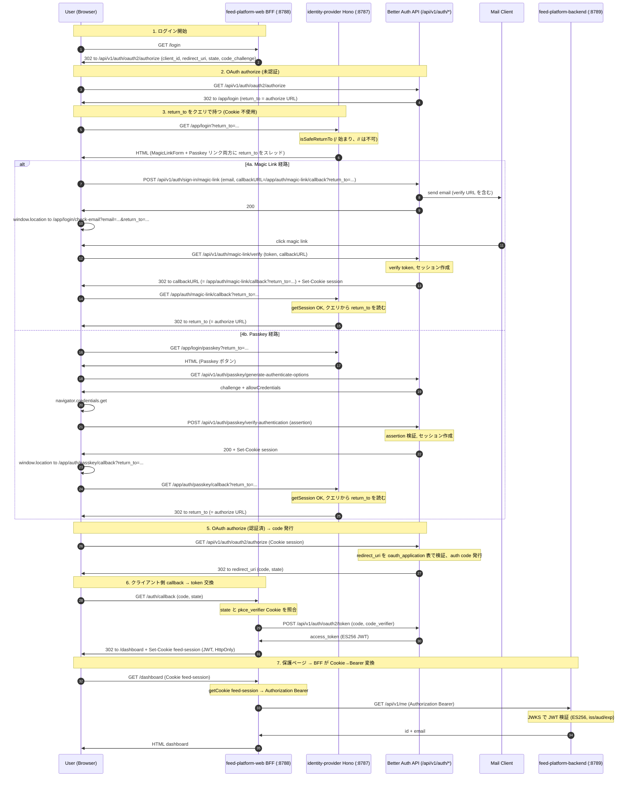

# feed-platform ms-02 ログインフロー

`feat/ms-02-pr-idp-ui` の **OAuth 2.1 PKCE + Magic Link / Passkey** ログインフローのシーケンス図。
認証途中の状態は **クエリパラメータのみで伝搬** (Cookie 不使用)。Better Auth `session` Cookie は認証完了後の通常 Cookie。

## 全体図

## ステップ詳細

| #             | アクター              | 動作                                                                               | 関連ファイル                                                                                                                                        |
| ------------- | --------------------- | ---------------------------------------------------------------------------------- | --------------------------------------------------------------------------------------------------------------------------------------------------- |
| 1             | feed-platform-web     | `/login` で OAuth authorize URL を構築して 302                                     | `js/app/feed-platform-web/app/app.tsx` (`/login` handler), `js/app/feed-platform-web/app/feature/auth/oauth-client.ts` (`buildAuthorizeUrl` + PKCE) |
| 2             | Better Auth           | セッション未確認 → IdP ログイン画面へ 302 (`return_to` をクエリで付与)             | Better Auth `oauthProvider` プラグイン                                                                                                              |
| 3             | IdP                   | `?return_to` を validate して Cookie に固定、URL から query を除去                 | `js/app/identity-provider/app/app.tsx` (`/login` handler), `isSafeReturnTo`                                                                         |
| 4a            | Browser → Better Auth | Magic Link 送信 + 受信 + 検証                                                      | `js/app/identity-provider/app/ui/login.client.tsx` (MagicLinkForm), Better Auth `magicLink` プラグイン                                              |
| 4a (callback) | IdP                   | `/app/auth/magic-link/callback` で session 確認 + Cookie を消費 + return_to へ 302 | `js/app/identity-provider/app/app.tsx` (`/auth/magic-link/callback`)                                                                                |
| 4b            | Browser → Better Auth | WebAuthn assertion を取得 + 検証                                                   | `js/app/identity-provider/app/ui/login-passkey.client.tsx` (PasskeyLoginButton), `app/ui/webauthn.ts`, Better Auth `passkey` プラグイン             |
| 4b (callback) | IdP                   | `/app/auth/passkey/callback` で session 確認 + Cookie 消費 + return_to へ 302      | `app/app.tsx` (`/auth/passkey/callback`)                                                                                                            |
| 5             | Better Auth           | OAuth authorize 再呼び出し時に session 確認 → auth code 発行                       | Better Auth `oauthProvider`                                                                                                                         |
| 6             | feed-platform-web     | `/auth/callback` で state 検証 → token 交換 → `feed-session` Cookie 発行           | `js/app/feed-platform-web/app/feature/auth/callback.ts` (`handleAuthCallback`)                                                                      |
| 7             | feed-platform-web BFF | `feed-session` Cookie → `Bearer <JWT>` 変換 → backend にプロキシ                   | `js/app/feed-platform-web/app/feature/api/client.ts` (`BackendClient`), `app/app.tsx` (`/dashboard`)                                                |
| 7 (verify)    | feed-platform-backend | JWKS 経由で JWT 検証 (ES256, iss=IdP URL, aud=feed-platform-web)                   | `js/app/feed-platform-backend/src/feature/auth/jwt.ts` (`JwtService`), `feature/auth/middleware.ts`                                                 |

## 設計上のポイント

### URL 構造で意図を表現

| URL                                     | 担当                                       |
| --------------------------------------- | ------------------------------------------ |
| `/app/login?return_to=...`              | ログイン画面 (return_to を Cookie に保存)  |
| `/app/auth/magic-link/callback`         | Magic Link 専用ポストログイン              |
| `/app/auth/passkey/callback`            | Passkey 専用ポストログイン                 |
| `/api/v1/auth/oauth2/authorize`         | OAuth 認可エンドポイント (Better Auth)     |
| `/auth/callback` (feed-platform-web 側) | OAuth client の callback (code → JWT 交換) |

各認証方式の callback は **URL から方式が判別できる構造** に揃えている。汎用の `/auth/callback` や `/auth/post-login` といった命名は避ける。

### return_to の伝搬

| ステップ                      | 保持方法                                                                |
| ----------------------------- | ----------------------------------------------------------------------- |
| OAuth authorize → IdP login   | クエリパラメータ `?return_to=...`                                       |
| IdP login → ページ内リンク    | SSR が `?return_to=...` をリンク先 URL に追記 (`withReturnTo` ヘルパー) |
| login form → Better Auth      | POST body の `callbackURL` に `?return_to=...` を埋め込み               |
| Passkey 検証 → callback       | `window.location.href` に `?return_to=...` を付与                       |
| callback ハンドラ → return_to | `c.req.query('return_to')` を直読 (Cookie 不使用)                       |

- **認証中の Cookie はゼロ**。クエリのみで状態を伝搬する完全ステートレス。
- `withReturnTo` (`app/ui/return-to.ts`) で `encodeURIComponent` を集約 → 二重エンコード事故防止。
- Magic Link はメール URL に return_to が埋め込まれるので別タブでも保持される。

### Open Redirect 対策

`isSafeReturnTo` は以下を満たす値のみ通す:

- `/` で始まる (相対パス)
- `//` で始まらない (protocol-relative URL を block)

→ IdP 相対 URL のみ Cookie に保存。**外部クライアントの callback URL は OAuth `redirect_uri` 側で `oauth_application` テーブルが allowlist として機能** するため、IdP login flow は内部 URL の伝搬に専念できる。

### Cookie 配布の責任分離

| Cookie                         | 発行者                             | スコープ               | 用途                             |
| ------------------------------ | ---------------------------------- | ---------------------- | -------------------------------- |
| Better Auth `session`          | IdP (Better Auth)                  | IdP ドメイン全体       | IdP 内の認証状態 (認証完了後)    |
| `pkce_verifier`, `oauth_state` | feed-platform-web                  | web ドメイン、短命     | OAuth 2.1 PKCE / CSRF 対策       |
| `feed-session`                 | feed-platform-web `/auth/callback` | web ドメイン、HttpOnly | Bearer に変換するための JWT 保管 |

**認証途中の IdP 側 Cookie は無い** (return_to はクエリで運ぶ)。

- **feed-platform-web BFF が唯一の `feed-session` Cookie 保持者**。
- backend (`feed-platform-backend`) は Bearer のみ受け付ける (Cookie は読まない)。
- backend は JWKS (IdP の `/api/v1/auth/jwks`) から公開鍵を取得して JWT を検証。秘密鍵は IdP のみが保持。

## 参考

- ADR: [`docs/adr/2026-05-24-feed-platform-auth-provider.md`](../../adr/2026-05-24-feed-platform-auth-provider.md)
- ADR: [`docs/adr/2026-05-24-feed-platform-cross-app-session-strategy.md`](../../adr/2026-05-24-feed-platform-cross-app-session-strategy.md)
- ADR: [`docs/adr/2026-05-24-feed-platform-magic-link-strategy.md`](../../adr/2026-05-24-feed-platform-magic-link-strategy.md)
- Retrospective: [`docs/retrospective/feed-platform-ms-02-auth-passkey-magiclink.md`](../../retrospective/feed-platform-ms-02-auth-passkey-magiclink.md)
