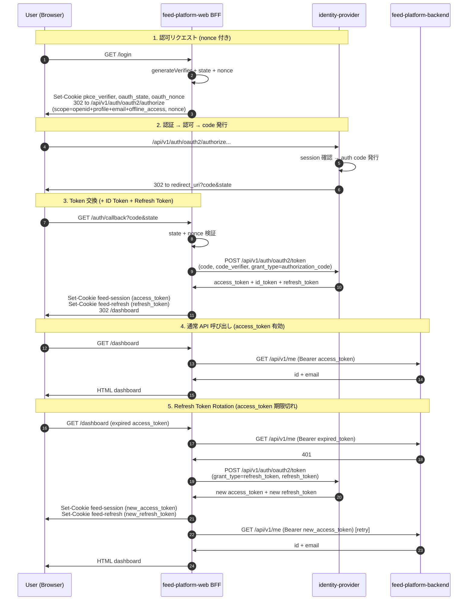

# feed-platform — OIDC ID Token + Refresh Token 設計提案

**日付**: 2026-05-29
**対象 PR**: #144 (ms-02 Auth) の後続
**前提**: Better Auth 1.5.5 は OIDC と refresh token を**組み込みサポート**。設定変更 + 消費側コードの追加で実現可能。

---

## 1. Better Auth 組み込みサポート状況

| 機能                               | Better Auth のサポート                                                                  | 確認方法                                                 |
| ---------------------------------- | --------------------------------------------------------------------------------------- | -------------------------------------------------------- |
| OIDC ID Token                      | `openid` scope を含めると自動発行                                                       | `oauth-provider` の `OAuthOptions.scopes`                |
| ID Token expiry                    | `idTokenExpiresIn` 設定                                                                 | `oauth-provider` の `OAuthOptions.idTokenExpiresIn`      |
| nonce 検証                         | authorize URL の `nonce` を ID Token の `nonce` claim に反映                            | OIDC Core §3.1.2 (仕様上必須)                            |
| Refresh Token                      | `offline_access` scope を含めると自動発行                                               | `oauth-provider` の InternallySupportedScopes            |
| Refresh Token expiry               | `refreshTokenExpiresIn` (default 30 days)                                               | `oauth-provider` の `OAuthOptions.refreshTokenExpiresIn` |
| Token refresh                      | `grant_type=refresh_token` at `/token` endpoint                                         | RFC 6749 §6 (OAuth 2.1 準拠)                             |
| `.well-known/openid-configuration` | 自動生成 (oauth-provider 設定ベース)                                                    | `oauth-provider` の `OIDCMetadata`                       |
| Open ID Provider Metadata          | `issuer`, `authorization_endpoint`, `token_endpoint`, `jwks_uri`, `scopes_supported` 等 | Better Auth 自動出力                                     |

**キーインサイト**: OIDC + Refresh Token の導入に必要な IdP 側の新規実装は**実質ゼロ**。消費側 (feed-platform-web BFF) の適応のみが主作業。

---

## 2. 変更概要

```
┌──────────────────────────────────────────────────────┐
│                    IdP 側 (設定変更)                   │
│                                                      │
│ ✏️ better-auth.ts                                     │
│   - scopes: +'offline_access'                       │
│   - idTokenExpiresIn: 3600 (1 hour)                 │
│   - refreshTokenExpiresIn: 2592000 (30 days,default)│
│   - validAudiences: ['feed-platform-web']           │
│                                                      │
│ ✏️ app.tsx                                            │
│   - /.well-known/openid-configuration route 削除    │
│     (Better Auth が natively 提供)                   │
└──────────────────────────────────────────────────────┘
                          │
                          ▼
┌──────────────────────────────────────────────────────┐
│          feed-platform-web BFF 側 (新規実装)           │
│                                                      │
│ ✏️ oauth-client.ts                                    │
│   + generateNonce()                                  │
│   + buildAuthorizeUrl に nonce, scope(+offline_acc) │
│                                                      │
│ ✏️ nonce-store.ts (新規)                              │
│   + DB (Kysely) に state→nonce を保存                │
│   + callback で state から lookup + 削除             │
│   + 期限切れレコードの定期 cleanup                    │
│                                                      │
│ ✏️ callback.ts                                       │
│   + nonce 検証 (id_token.nonce === DB lookup by state)│
│   + id_token / refresh_token 抽出                    │
│   + Set-Cookie: feed-session (access_token)         │
│   + Set-Cookie: feed-refresh (refresh_token)        │
│                                                      │
│ ✏️ constants.ts                                       │
│   + FEED_REFRESH_COOKIE = 'feed-refresh'            │
│   + OAUTH_SCOPES (openid+profile+email+offline_acc) │
│                                                      │
│ ✏️ api/client.ts                                     │
│   + callMe: 401 時に refresh → retry                │
│   + refresh token rotation (new refresh_token)      │
│                                                      │
│ ✏️ app.tsx                                           │
│   + /logout: feed-refresh cookie も削除              │
└──────────────────────────────────────────────────────┘
                          │
                          ▼
┌──────────────────────────────────────────────────────┐
│         feed-platform-backend 側 (変更不要)            │
│                                                      │
│ ✓ JwtService は現状のまま access_token を JWKS 検証   │
│ ✓ ID Token は BFF が消費するので backend は関与不要   │
│ ✓ Refresh Token は BFF が IdP と通信 (backend 不要)  │
│ ✓ backend は 401 を返すだけ (BFF が refresh trigger) │
└──────────────────────────────────────────────────────┘
```

---

## 3. IdP 側の変更

### 3.1 `better-auth.ts` — OAuth provider 設定

```diff
  oauthProvider({
    cachedTrustedClients: new Set(['feed-platform-web']),
    consentPage: '/app/oauth/consent',
    loginPage: '/app/login',
+   idTokenExpiresIn: 3600,
+   refreshTokenExpiresIn: 2592000,
+   validAudiences: ['feed-platform-web', 'http://localhost:8789'],
    schema: {
      oauthAccessToken: {
        fields: { scopes: 'scope' },
        modelName: 'oauth_access_token',
      },
      oauthClient: {
        modelName: 'oauth_application',
      },
      oauthConsent: {
        fields: { scopes: 'scope' },
        modelName: 'oauth_consent',
      },
    },
-   scopes: ['openid', 'profile', 'email'],
+   scopes: ['openid', 'profile', 'email', 'offline_access'],
  }),
```

**理由**:

- `idTokenExpiresIn`: 1 時間 (access_token より長め。OIDC では短命 access_token + やや長め id_token が一般的)
- `refreshTokenExpiresIn`: 30 日 (Better Auth default。回転型で実質無限)
- `validAudiences`: backend が JWT 検証する際の `aud` 値を明示。`http://localhost:8789` は dev
- `offline_access`: OIDC で refresh token 発行に必須の標準 scope

### 3.2 `app.tsx` — `.well-known/openid-configuration` ルート削除

現状の手動実装 (`js/app/identity-provider/app/app.tsx:26-37`):

```ts
// 削除対象
.get('/auth/oauth/.well-known/openid-configuration', (c) => {
  const { origin } = new URL(c.req.url)
  return c.json({
    authorization_endpoint: `${origin}/api/v1/auth/oauth2/authorize`,
    issuer: `${origin}/api/v1/auth`,
    // ...
  })
})
```

Better Auth は `oauthProvider` が有効な場合、**自動的に** `.well-known/openid-configuration` を提供する。URL は `/api/v1/auth/oauth/.well-known/openid-configuration` (`all('/auth/*')` が捕捉するパス配下)。手動実装は以下が不足しており、Better Auth ネイティブ版の方が完全:

| 項目                                    | 手動実装 (現在) | Better Auth native                          | OIDC 必須   |
| --------------------------------------- | --------------- | ------------------------------------------- | ----------- |
| `issuer`                                | ✓               | ✓                                           | MUST        |
| `authorization_endpoint`                | ✓               | ✓                                           | MUST        |
| `token_endpoint`                        | ✓               | ✓                                           | MUST        |
| `jwks_uri`                              | ✓               | ✓                                           | MUST        |
| `scopes_supported`                      | ✓               | ✓                                           | SHOULD      |
| `id_token_signing_alg_values_supported` | ✓               | ✓                                           | MUST        |
| **`response_types_supported`**          | ✓ (code only)   | ✓ (code + implicit + etc.)                  | MUST        |
| **`grant_types_supported`**             | ❌              | ✓ (authorization_code, refresh_token, etc.) | **SHOULD**  |
| **`subject_types_supported`**           | ✓ (public)      | ✓ (public, pairwise)                        | MUST        |
| **`userinfo_endpoint`**                 | ✓               | ✓ (将来的に)                                | RECOMMENDED |
| **`claims_supported`**                  | ❌              | ✓                                           | RECOMMENDED |
| **`code_challenge_methods_supported`**  | ❌              | ✓                                           | RECOMMENDED |

→ 手動実装を削除し、Better Auth に完全委譲する。**削除するだけの変更**。

### 3.3 IdP 側 nonce 対応 — **不要**

nonce は **feed-platform-web BFF が発行・検証するサーバサイドの値** であり、IdP は一切関知しない。IdP が authorize URL の `nonce` クエリを受け取っても、loginPage にリダイレクトする際に nonce が削られても問題ない。nonce は OAuth authorize リクエストに含めて IdP に渡り、ID Token の `nonce` claim として返ってくることだけが要件。

→ **IdP 側の nonce 伝搬コードは不要。IdP の変更は 3.1 + 3.2 のみ。**

---

## 4. feed-platform-web BFF 側の変更

### 4.1 `oauth-client.ts` — nonce 生成 + autorize URL 拡張

```diff
+ export const generateNonce = (): string => {
+   const bytes = new Uint8Array(32)
+   crypto.getRandomValues(bytes)
+   return toBase64Url(bytes.buffer)
+ }

  export interface AuthorizeParams {
    readonly clientId: string
    readonly redirectUri: string
    readonly idpBaseUrl: string
    readonly codeChallenge: string
    readonly state: string
+   readonly nonce: string
  }

  export const buildAuthorizeUrl = (params: AuthorizeParams): URL => {
    const url = new URL('/api/v1/auth/oauth2/authorize', params.idpBaseUrl)
    url.searchParams.set('response_type', 'code')
    url.searchParams.set('client_id', params.clientId)
    url.searchParams.set('redirect_uri', params.redirectUri)
    url.searchParams.set('code_challenge', params.codeChallenge)
    url.searchParams.set('code_challenge_method', 'S256')
    url.searchParams.set('state', params.state)
-   url.searchParams.set('scope', 'openid profile email')
+   url.searchParams.set('scope', 'openid profile email offline_access')
+   url.searchParams.set('nonce', params.nonce)
    return url
  }
```

### 4.2 `constants.ts` — 新しい定数

```diff
  export const FEED_SESSION_COOKIE = 'feed-session'
+ export const FEED_REFRESH_COOKIE = 'feed-refresh'
  export const OAUTH_BASE_PATH = '/api/v1/auth/oauth'
  export const OAUTH_CLIENT_ID = 'feed-platform-web'
  export const OAUTH_SCOPES = ['openid', 'profile', 'email', 'offline_access'] as const
```

### 4.3 `nonce-store.ts`（新規）— DB ベースの nonce 管理

serverless 環境ではリクエスト間でメモリ共有不可のため、DB（Kysely + Turso）に保存する。

```ts
// app/feature/auth/nonce-store.ts
import type { Kysely } from 'kysely'
import type { DB } from '#@/feature/db/generated'

export interface NonceRecord {
  readonly state: string
  readonly nonce: string
  readonly expiresAt: number // Unix ms
}

/** `/login` 時に nonce を登録する */
export const storeNonce = async (db: Kysely<DB>, state: string, nonce: string): Promise<void> => {
  await db
    .insertInto('oauth_nonce')
    .values({
      state,
      nonce,
      expiresAt: Date.now() + 10 * 60 * 1000, // 10 min (Code の有効期限に合わせる)
    })
    .execute()
}

/** `/auth/callback` 時に nonce を検証し、レコードを削除する */
export const verifyAndDeleteNonce = async (db: Kysely<DB>, state: string, nonce: string): Promise<boolean> => {
  const row = await db.selectFrom('oauth_nonce').selectAll().where('state', '=', state).executeTakeFirst()

  if (row == null) return false
  if (row.nonce !== nonce) {
    // mismatch → レコード削除 (1回限りの使い捨て)
    await db.deleteFrom('oauth_nonce').where('state', '=', state).execute()
    return false
  }
  await db.deleteFrom('oauth_nonce').where('state', '=', state).execute()
  return true
}

/** 期限切れ nonce の定期 cleanup */
export const cleanupExpiredNonces = async (db: Kysely<DB>): Promise<void> => {
  await db.deleteFrom('oauth_nonce').where('expiresAt', '<', Date.now()).execute()
}
```

**DB テーブル**: feed-platform-web BFF の `oauth_nonce` テーブル（新規）

```sql
CREATE TABLE oauth_nonce (
  state     TEXT PRIMARY KEY,
  nonce     TEXT NOT NULL,
  expiresAt INTEGER NOT NULL
);
```

**キー選定**: `state` を PRIMARY KEY にする。state は `/login` で生成した一意な値であり、OAuth authorize URL → IdP → callback URL と往復する。callback で `c.req.query('state')` から lookup 可能。

**cleanup**: `cleanupExpiredNonces` は `/login` リクエストの度に実行（もしくは cron）。1 リクエストあたり 1 件の DELETE なので負荷は軽微。

### 4.4 `callback.ts` — id_token + refresh_token + nonce 検証

**OIDC + Refresh Token 対応後**:

```ts
const handleAuthCallback = async (c: Context): Promise<Response> => {
  // ... (code / state / verifier 検証は同じ) ...

  const tokenJson = await tokenRes.json()
  const accessToken = tokenJson.access_token
  const idToken = tokenJson.id_token // 新規
  const refreshToken = tokenJson.refresh_token // 新規

  if (!Predicate.isString(accessToken) || String.isEmpty(accessToken)) {
    return new Response('auth failed', { status: 401 })
  }

  // OIDC: nonce 検証（DB lookup by state）
  if (Predicate.isString(idToken)) {
    const db = c.get('db') as Kysely<DB>
    const idTokenPayload = jose.decodeJwt(idToken) // 検証なしで payload だけ読む
    const urlState = c.req.query('state')
    if (Predicate.isNotNullish(urlState)) {
      const valid = await verifyAndDeleteNonce(db, urlState, idTokenPayload.nonce as string)
      if (!valid) {
        return new Response('nonce mismatch', { status: 403 })
      }
    }
  }

  const headers = new Headers({ Location: '/dashboard' })
  headers.append('Set-Cookie', `${FEED_SESSION_COOKIE}=${accessToken}; HttpOnly; SameSite=Lax; Path=/`)

  // Refresh token: separate HttpOnly cookie, longer Path scope
  if (Predicate.isString(refreshToken) && String.isNonEmpty(refreshToken)) {
    headers.append(
      'Set-Cookie',
      `${FEED_REFRESH_COOKIE}=${refreshToken}; HttpOnly; SameSite=Lax; Path=/; Max-Age=2592000`,
    )
  }

  // Clear one-time OAuth artifacts (nonce は DB にあり Cookie 不要)
  headers.append('Set-Cookie', 'pkce_verifier=; Max-Age=0; Path=/; SameSite=Lax; HttpOnly')
  headers.append('Set-Cookie', 'oauth_state=; Max-Age=0; Path=/; SameSite=Lax; HttpOnly')

  return new Response(null, { headers, status: 302 })
}
```

**nonce 保管戦略**: `/login` で `state` をキーに DB に保存 → callback で `state` から fetch + 検証 → 即削除。ブラウザには nonce を一切渡さない。

**非依存性**: `idToken` が `null` でも OAuth 2.1 の最低限機能（access_token のみ）は動作するようガード。旧バージョン IdP との後方互換。

### 4.5 `app.tsx` — nonce DB 保存 + logout

`/login` ハンドラ:

```ts
.get('/login', async () => {
  // ... (idpBaseUrl / clientId / webBaseUrl の初期化) ...

  const verifier = generateVerifier()
  const state = generateState()
  const nonce = generateNonce()          // 新規
  const codeChallenge = await generateChallenge(verifier)

  const authorizeUrl = buildAuthorizeUrl({
    clientId,
    codeChallenge,
    idpBaseUrl,
    nonce,                               // 新規
    redirectUri,
    state,
  })

  // DB に state → nonce を保存（ブラウザには渡さない）
  const db = c.get('db') as Kysely<DB>
  await storeNonce(db, state, nonce)

  const headers = new Headers({ Location: authorizeUrl.toString() })
  headers.append('Set-Cookie', `pkce_verifier=${verifier}; HttpOnly; SameSite=Lax; Path=/`)
  headers.append('Set-Cookie', `oauth_state=${state}; HttpOnly; SameSite=Lax; Path=/`)

  return new Response(null, { headers, status: 302 })
})
```

- **nonce はブラウザに渡さない** — 認可リクエストのクエリに含めて IdP に渡り、ID Token の `nonce` claim として返ってくる
- **`state` が lookup key** — IdP から callback に戻ってくる `state` パラメータで DB から nonce を引く
- **DB に保存する理由**: serverless 環境ではインスタンス間でメモリ共有不可のため

`/logout` ハンドラ (refresh_token cookie も削除):

```diff
  const headers = new Headers({ Location: '/login' })
  headers.append('Set-Cookie', `${FEED_SESSION_COOKIE}=; Max-Age=0; Path=/; SameSite=Lax; HttpOnly`)
+ headers.append('Set-Cookie', `${FEED_REFRESH_COOKIE}=; Max-Age=0; Path=/; SameSite=Lax; HttpOnly`)
```

### 4.6 `api/client.ts` — Refresh Token Rotation

```ts
interface BackendClientService {
  readonly callMe: (authorization: string | null) => Effect.Effect<UserDTO, BackendError>
  readonly refreshAccessToken: (currentRefreshToken: string) => Effect.Effect<string, BackendError>
}

// Refresh token → new access_token + rotation
const IDP_BASE_URL = process.env.IDP_BASE_URL ?? 'http://localhost:8787'

const liveService: BackendClientService = {
  callMe: (authorization) =>
    Effect.tryPromise({
      catch: (cause) => new BackendError({ cause }),
      try: async () => {
        if (Predicate.isNullish(authorization)) {
          throw new TypeError('missing authorization')
        }
        const res = await fetch(`${BACKEND_BASE_URL}/api/v1/me`, {
          headers: { Authorization: authorization },
        })
        // If 401, the caller should try refreshAccessToken and retry
        if (!res.ok) {
          throw new Error(`HTTP ${res.status}`)
        }
        // ... (existing response parsing) ...
      },
    }),

  refreshAccessToken: (currentRefreshToken) =>
    Effect.tryPromise({
      catch: (cause) => new BackendError({ cause }),
      try: async () => {
        const res = await fetch(`${IDP_BASE_URL}/api/v1/auth/oauth2/token`, {
          body: new URLSearchParams({
            grant_type: 'refresh_token',
            refresh_token: currentRefreshToken,
            client_id: process.env.OAUTH_CLIENT_ID ?? 'feed-platform-web',
          }).toString(),
          headers: { 'Content-Type': 'application/x-www-form-urlencoded' },
          method: 'POST',
        })
        if (!res.ok) throw new Error('refresh failed')
        const data = await res.json()
        if (!Predicate.isObject(data)) throw new TypeError('Invalid refresh response')

        const accessToken = data.access_token
        const newRefreshToken = data.refresh_token

        if (Predicate.isString(accessToken) && String.isNonEmpty(accessToken)) {
          // Rotation: update the refresh token if a new one was returned
          if (Predicate.isString(newRefreshToken) && String.isNonEmpty(newRefreshToken)) {
            // Return both; caller updates both cookies
          }
          return accessToken
        }
        throw new Error('refresh failed: no access_token')
      },
    }),
}
```

**Rotation の return type**: access_token と new refresh_token の**両方**を返す必要がある (Better Auth の refresh は refresh_token を更新するので、古い refresh_token は無効化される)。

→ `refreshAccessToken` の返り値を `{ accessToken: string; refreshToken?: string }` に拡張。

### 4.7 `app.tsx` `/dashboard` — 401 時の refresh + retry

```ts
.get('/dashboard', async (c) => {
  const { user } = c.var
  if (Predicate.isNullish(user)) return c.redirect('/login')

  const token = getCookie(c, FEED_SESSION_COOKIE)
  const authorization = Predicate.isNullish(token) ? null : `Bearer ${token}`

  const result = await Effect.runPromise(
    Effect.provide(
      Effect.gen(function* () {
        const backend = yield* BackendClient
        return yield* backend.callMe(authorization)
      }),
      liveLayer,
    ),
  ).catch(async (error) => {
    // 401: try refresh
    if (error instanceof BackendError) {
      const refreshToken = getCookie(c, FEED_REFRESH_COOKIE)
      if (Predicate.isNotNullish(refreshToken)) {
        // Call IdP refresh
        const idpBaseUrl = process.env.IDP_BASE_URL ?? 'http://localhost:8787'
        const refreshRes = await fetch(`${idpBaseUrl}/api/v1/auth/oauth2/token`, {
          body: new URLSearchParams({
            grant_type: 'refresh_token',
            refresh_token: refreshToken,
            client_id: process.env.OAUTH_CLIENT_ID ?? 'feed-platform-web',
          }).toString(),
          headers: { 'Content-Type': 'application/x-www-form-urlencoded' },
          method: 'POST',
        })
        if (refreshRes.ok) {
          const refreshData = await refreshRes.json()
          const newAccessToken = refreshData.access_token
          const newRefreshToken = refreshData.refresh_token
          if (Predicate.isString(newAccessToken)) {
            // Update cookies and re-render
            const responseHeaders = new Headers()
            responseHeaders.append('Set-Cookie', `${FEED_SESSION_COOKIE}=${newAccessToken}; HttpOnly; SameSite=Lax; Path=/`)
            if (Predicate.isString(newRefreshToken)) {
              responseHeaders.append('Set-Cookie', `${FEED_REFRESH_COOKIE}=${newRefreshToken}; HttpOnly; SameSite=Lax; Path=/; Max-Age=2592000`)
            }
            // Retry backend call with new access_token
            const retryRes = await fetch(`${BACKEND_BASE_URL}/api/v1/me`, {
              headers: { Authorization: `Bearer ${newAccessToken}` },
            })
            if (retryRes.ok) {
              const data = await retryRes.json()
              return c.render(<Document>...</Document>, { headers: responseHeaders })
            }
          }
        }
      }
    }
    return c.redirect('/login')
  })

  // Normal render with user data...
})
```

---

## 5. シーケンス図



---

## 6. Cookie 設計 (最終形)

| Cookie             | 発行者                   | 寿命                        | スコープ                    | 用途                        |
| ------------------ | ------------------------ | --------------------------- | --------------------------- | --------------------------- |
| `feed-session`     | web BFF `/auth/callback` | access_token.exp (1h)       | `/`, HttpOnly, SameSite=Lax | 通常 API 呼び出し           |
| **`feed-refresh`** | web BFF `/auth/callback` | **30d** (refresh_token.exp) | `/`, HttpOnly, SameSite=Lax | access_token 切れ時の再発行 |
| `pkce_verifier`    | web BFF `/login`         | 短期 (callback 後即削除)    | `/`, HttpOnly, SameSite=Lax | PKCE code_verifier          |
| `oauth_state`      | web BFF `/login`         | 短期 (callback 後即削除)    | `/`, HttpOnly, SameSite=Lax | CSRF state 検証             |

**nonce は Cookie ではなく DB に保存**（serverless 対応）。OAuth アーティファクト (verifier, state) の 2 つは `/auth/callback` 後即削除。永続するのは access_token と refresh_token の 2 つのみ。

---

## 7. IdP 側 DB スキーマ変更

**不要**。Better Auth の `oauthAccessToken` テーブルは refresh token と expiry をすでに保持。`refreshToken` カラムは `oauthAccessToken` に存在する。

確認: `js/app/identity-provider/app/feature/db/generated.ts` の `OauthAccessToken` interface

```ts
export interface OauthAccessToken {
  accessToken: string
  clientId: string
  createdAt: string
  expiresAt: string
  id: string
  refreshToken: string | null // ← すでに存在
  scope: string | null
  updatedAt: string
  userId: string
}
```

→ **columns 変更不要**。`offline_access` scope を含めると `refreshToken` が populate される。

---

## 8. ステートレス認証との整合性

現行のステートレス設計 (`return_to` をクエリのみで伝搬) と OIDC nonce は完全に直交する:

- nonce は web BFF (feed-platform-web) が `/login` で生成し、**DB に保存**（`state` をキー） → callback (`/auth/callback`) で `state` から lookup → 検証 → DB から削除
- nonce は **ブラウザにも IdP にも一切渡らない**サーバサイドの値
- IdP 側の認証フローは nonce を一切関知しない (return_to で往復させる必要なし)
- nonce は authorize URL のクエリパラメータとして渡り、ID Token 内に戻ってくる（これは OIDC プロトコル上の必須挙動）

→ **IdP 側の return_to ステートレス性は維持される**。nonce のサーバサイド保存により、ブラウザに渡す Cookie も 1 つ削減。

---

## 9. 環境変数の追加

| 変数                          | 場所                             | デフォルト                              | 用途                        |
| ----------------------------- | -------------------------------- | --------------------------------------- | --------------------------- |
| `OAUTH_SCOPES`                | feed-platform-web wrangler.jsonc | `"openid profile email offline_access"` | 認可リクエストの scope      |
| `FEED_REFRESH_COOKIE_MAX_AGE` | (コード定数)                     | 2592000 (30 days)                       | refresh_token cookie の寿命 |
| `OAUTH_CLIENT_ID`             | (既存)                           | `"feed-platform-web"`                   | refresh token call で必要   |

---

## 10. テスト計画

### ユニットテスト

| テスト対象                         | 内容                                                                 |
| ---------------------------------- | -------------------------------------------------------------------- |
| `nonce-store.storeNonce`           | DB 保存 → 正常 / `state` 重複 → overwrite                            |
| `nonce-store.verifyAndDeleteNonce` | match → true + 削除 / mismatch → false + 削除 / 不在 → false         |
| `callback` refresh_token 抽出      | 存在時: Cookie 設定 / 不在時: Cookie 未設定                          |
| `BackendClient.refreshAccessToken` | 正常 refresh → access_token 取得 / 不正 refresh_token → BackendError |
| `BackendClient.callMe` 401 → retry | 401 後に refresh → retry → 成功                                      |

### E2E テスト (mock, real jose)

| シナリオ                                                 | 検証                                                     |
| -------------------------------------------------------- | -------------------------------------------------------- |
| ID Token に nonce claim が含まれる                       | Better Auth が authorize URL の nonce を ID Token に反映 |
| 正常ログインで access + refresh 両方 Cookie が設定される | playwright-cli `cookie-list` で両方確認                  |
| access_token 期限切れ後に refresh で継続                 | 短命 access_token (5min) + refresh → dashboard が 200    |
| 不正 refresh_token でログアウト                          | 改ざん refresh → redirect to `/login`                    |
| 同一 refresh_token の使い回し (rotation 検証)            | 古い refresh_token で 2 回目 → 401                       |

---

## 11. 工数見積もり

| タスク                                    | 工数     | 備考                                       |
| ----------------------------------------- | -------- | ------------------------------------------ |
| IdP better-auth.ts 設定変更               | S (0.5d) | scopes + expiry 追加のみ                   |
| `.well-known/openid-configuration` 削除   | S (0.5h) | 1 route 削除                               |
| nonce 生成 + authorize URL + DB 保存      | S (0.5d) | oauth-client.ts + nonce-store.ts + app.tsx |
| callback.ts id_token + refresh_token 抽出 | S (0.5d) | callback.ts 拡張                           |
| `api/client.ts` refresh support           | M (1d)   | refresh endpoint + rotation + retry        |
| `/dashboard` 401 → refresh → retry        | M (1d)   | app.tsx 拡張                               |
| `/logout` refresh cookie 削除             | S (0.5h) | 1 行追加                                   |
| ユニットテスト追加                        | M (1d)   | 7 テスト                                   |
| E2E テスト (mock jose)                    | M (1d)   | 5 シナリオ                                 |
| CI / lint / test 作業                     | S (0.5d) | 標準作業                                   |

**合計**: **M〜L (4〜6 日)**。BFF 側の refresh loop の慎重な設計が必要。

---

## 12. リスク

| リスク                                                      | 対策                                                                                                                                                                               |
| ----------------------------------------------------------- | ---------------------------------------------------------------------------------------------------------------------------------------------------------------------------------- |
| Better Auth `loginPage` redirect が nonce を URL から落とす | nonce は DB（`state` をキー）に保存。URL から落ちても DB から読めるので影響なし。認可リクエストに nonce が含まれず ID Token の nonce claim が空だった場合、検証は skip（後方互換） |
| `oauth_nonce` テーブルの expire 漏れで肥大化                | `cleanupExpiredNonces` を毎回の `/login` で実行（DELETE WHERE expiresAt < now()）。負荷は極小                                                                                      |
| refresh_token 漏洩時の被害拡大                              | refresh_token cookie は HttpOnly で JS から読み取れない。refresh_token rotation で 1 回使った refresh_token は無効化 (Better Auth が自動)。漏洩しても直ちにローテーションで無効    |
| 並行リクエストで refresh が複数走る                         | `/dashboard` リクエストの直列処理で回避。もしくは Inflight refresh の Dedup (`Map<string, Promise>`) を実装                                                                        |
| Better Auth の refresh endpoint が client_secret を要求     | `OAUTH_CLIENT_SECRET` (現在 `"dev-secret-pkce-not-used"`) を refresh リクエストに追加。PKCE での public client 扱いのまま refresh できるか検証必要                                 |

---

## 13. 実装順序

1. **PR-A: IdP 設定** — `better-auth.ts` 変更 + `.well-known` route 削除 (backend サイド変更なし、単独 merge 可)
2. **PR-B: nonce + OIDC callback** — oauth-client / nonce-store / callback / constants / app.tsx の nonce 関連 + `oauth_nonce` DB テーブル
3. **PR-C: Refresh Token + BFF retry** — api/client.ts の refresh support + dashboard retry
4. **PR-D: E2E テスト** — ユニット + mock e2e (real jose)

**並列度**: PR-A と PR-B は非依存 (IdP は nonce 関知しないため)。PR-C は PR-B 完了後。
