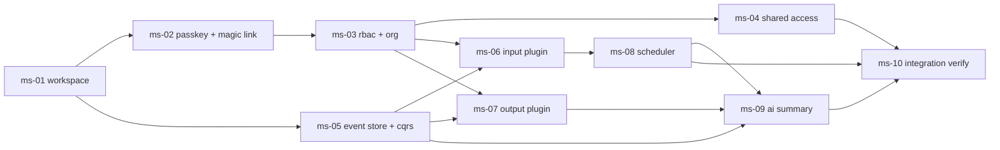

# Roadmap: Pluggable Multi-Source Feed Platform

- **Roadmap ID:** feed-platform
- **Author:** totto2727 (roadmap-analyst 役割を Main が代行)
- **Created at:** 2026-05-02T13:29:59Z
- **Last updated:** 2026-05-04T00:00:00Z
- **Status:** active <!-- planned | active | completed (`progress.yaml.status` と一致させる) -->

このドキュメントは、1 サイクルの oh-my-codingagent execution では収まらない複数サイクル規模の開発を束ねる**戦略層の不変な計画書**。ロードマップの意図、マイルストーン一覧、依存グラフを一体で保持する。書き方の詳細は `plugins/totto2727-dev-flow/skills/share-artifacts/references/roadmap.md` を参照。

## 背景

「任意の入力 (HTML 解析 / RSS / X リスト等) からフィードを収集し、共通の永続層に保存して、任意の出力 (API / Slack / Web UI 等) へ配信する」という性格上独立した複数の関心領域 (入力アダプタ層 / 永続化層 / 出力アダプタ層 / 認証認可基盤 / 定期実行基盤 / AI 要約) を束ねる必要がある。各領域は以下の理由で**単一の oh-my-codingagent execution サイクル (= 1 PR 規模 / 1 機能粒度) では収まらない**:

1. **強い順序依存と前提共有が領域間にまたがる**: 認証認可基盤は他全領域 (永続化層を除く) の利用前提となり、永続化層の Feed データモデルは入出力アダプタ契約より先に確定する必要がある。これらを 1 サイクルで束ねると Intent Spec が観測可能性を失い、設計と実装の分離が崩壊する
2. **各領域自体が複数サイクルに分割される**: 認証認可だけでも Passkey / Magic Link / 3 ロール RBAC / 個人&汎用 Organization / 期間限定共有という独立した観測可能機能を持ち、それぞれ独立 oh-my-codingagent execution サイクル相当
3. **アダプタ追加可能性をコードレベル契約として確立する責務**: 入力・出力それぞれの「プラグイン契約」を抽象化し、後からアダプタを追加できる構造を作ることそのものが独立した戦略テーマであり、参照アダプタ実装と切り分けて検証する必要がある
4. **進捗の俯瞰と並行サイクル統制の必要性**: 個人開発であっても 6 領域を平行に進める意思決定 (どの順序で / どこで一旦立ち止まるか / 領域間の整合性) を戦略層で明示しないと、サイクル間の暗黙依存が事故化する

ユーザーの観察として「具体的なサービス名・技術スタックは廃して大枠だけ考える」状態で全体像を確定したい意図があり、ロードマップ層 (実装非依存・戦略合意層) と配下 oh-my-codingagent execution サイクル (戦術・実装層) の責務分離が本ドキュメントの存在意義である。

## 目的

プラガブルな入出力契約を備えた**多様入力・多様出力フィード収集配信プラットフォーム**を、6 つの関心領域 (認証認可基盤 / 永続化基盤 / 入力プラグイン基盤 / 出力プラグイン基盤 / 定期実行基盤 / AI 要約) が**疎結合かつ独立進化可能**な構造として整備する。各領域に最低 1 つの参照実装が稼働し、コードレベルでアダプタを追加できる状態に到達する。

## スコープ境界

ロードマップ全体で扱う 6 つの関心領域:

1. **認証認可基盤** — Passkey + Magic Link / 3 ロール RBAC (Admin / Member / Guest 固定) / 個人 Organization (自動生成) と汎用 Organization の 2 種別 / 任意期間・対象に対する共有 (理想的には RBAC 統合)
2. **永続化基盤** — フィード共通データモデルとリポジトリ層。入力プラグインからの取り込みと出力プラグインへの提供を仲介し、入出力契約の境界面となる
3. **入力プラグイン基盤** — 任意入力源を**コードレベルで後付け可能**にする契約 (実装上は**独立サーバレス関数 = マイクロサービス境界**として展開)。HTML 解析 / RSS / X リストの取り込みを参照アダプタとして含む
4. **出力プラグイン基盤** — 任意出力先を**コードレベルで後付け可能**にする契約 (実装上は**独立サーバレス関数 = マイクロサービス境界**として展開)。API / Slack / Web UI 配信を参照アダプタとして含む
5. **定期実行基盤** — Cron 的な定期処理基盤。実行監視機能と Pub/Sub 等によるバッチ処理分割を含む。入力プラグインの周期起動と AI 要約の周期起動の双方を担う
6. **AI 要約機能** — 任意トリガー (期間 / 取得時条件等) で対象フィードを要約する機能。永続化基盤からの読み出しと出力プラグイン経由での配信に依存する

対象ユーザーは個人 + 汎用 Organization 切り替えを前提とした小規模利用者層。self-host 単独利用での動作を最低保証線とする。

## 非スコープ

- **マルチテナント以上の SaaS 化** — 請求 / プラン / 組織横断管理 / SLA / 利用量計測等は将来別ロードマップで扱う
- **モバイル / デスクトップアプリ** — Web UI 出力プラグインのみ対象とし、ネイティブクライアントは出力プラグインの後付け追加で対応可能性を残すのみ
- **高度な検索機能** — 全文検索エンジン統合 / ベクトル検索 / セマンティック検索は別ロードマップ。AI 要約は対象に含むが検索機能とは責務を分離する
- **プラグインの動的ロード / Web UI からの登録** — プラグイン拡張は**コードレベル契約のみ**。ランタイムのアップロード機構 / マーケットプレイス / hot-reload は本ロードマップで一切扱わない
- **RBAC のカスタムロール定義 / ポリシーエンジン** — Admin / Member / Guest の 3 ロール固定。カスタムロール / ABAC / OPA 等のポリシー言語統合は将来別ロードマップ
- **本リポジトリ外への横展開** — 本 monorepo 単独で完結する。OSS 公開 / 配布パッケージ化等は対象外
- **CI / 本番デプロイ自動化** — 具体的サービス選定後の別ロードマップで扱う。本ロードマップは実装非依存の段階で完結する
- **具体的サービス名・技術スタックの確定** — 本ロードマップ Intent は「大枠だけ考える」スタンスであり、永続化技術 / Cron 提供サービス / AI モデル提供事業者等の選定は配下マイルストーンの oh-my-codingagent execution サイクルに委譲する

## 大局的制約

複数サイクルを横断して効く制約のみを列挙する (個別サイクル内で完結する制約は配下サイクルの Intent Spec の責務)。

### 技術的制約

- 既存 monorepo (`js/` `mbt/` `go/` のいずれか) のワークスペース上に構築する。ワークスペース選定はマイルストーン段階で確定
- プラグイン拡張は**コードレベルの契約 (interface / trait / module 境界等)** で完結すること。Web ベースの動的ロード / プラグインマーケットプレイス / ランタイム拡張機構は禁止
- 実装非依存の段階を本ロードマップで完結させ、具体的サービス名 (例: 「Cloudflare Workflow など」のユーザー言及) は「外部 Cron / 監視系の存在を前提とする」程度の抽象度で受け止める

### アーキテクチャ的制約

(全領域を貫く構造的制約。詳細フロー素案は `docs/roadmap/feed-platform/design-hint.md` を参照)

- **サーバレスアーキテクチャを原則採用** — 各領域 (取得 / イベント記録 / ビュー更新 / 通知 / 出力配信等) は独立したサーバレス関数として実装することを基本とする。状態は Queue / DB / オブジェクトストレージ等に外出しし、関数自体はステートレスを保つ。常駐サーバ前提の設計は許容しない (具体的サービス選定は配下サイクルに委譲)
- **マイクロサービス境界としてのプラグイン分割** — 「プラグイン契約」と表現された入力 / 出力アダプタは、**実装上は独立サーバレス関数 (マイクロサービス境界)** として疎結合に展開する。共通プロセス内のモジュール分割では責務分離が不十分であり、独立デプロイ・独立スケーリング可能であること
- **イベントソーシング + CQRS パターンを永続化基盤の中核とする** — フィードデータの永続化は**イベント追記専用ストア (Event Source of Truth)** を核に据え、書き込み側 (Command) と読み出し側 (Query) を**責務分離した CQRS**として展開する。Command 側はイベント発行のみを担い、Query 側はイベントから派生するプロジェクション (キャッシュ DB / 検索インデックス等) を読み出す。ビューの再構築可能性 / イベントの不変性 / Read-Your-Write 整合戦略 (同期プロジェクション / 楽観的更新 / SSE push 等のいずれか) を全領域共通の論点として持つ (具体戦略は配下サイクル Step 3 で決定)

### 組織的制約

- 個人 (totto2727 単独) 開発を想定。レビュー観点は `specialist-reviewer` の観点別並列起動で代替
- 並行 oh-my-codingagent execution サイクル数の上限は **2** (実装中サイクル + ドキュメント / レビュー作業の並走を許容)
- 期間目標は本ロードマップでは設定しない (個人開発の特性上、配下サイクル単位で柔軟に進める)

### 規範的制約

- 既存プロジェクト固有スキル (`effect-layer` / `effect-runtime` / `effect-hono` / `git-workflow` / `adr` / `script-rules` 等) のパターン優先
- 認証認可基盤を他全領域 (永続化層を除く) の利用前提とする (順序依存制約)
- 永続化基盤の Feed 共通データモデルを入出力アダプタの契約より先に確定する (依存制約)
- 個人情報 / API キー / 共有トークン等の機密情報をリポジトリに保存しない
- ロードマップ全体および配下サイクル群が oh-my-codingagent execution の 9 ステップ体系および本スキル (`roadmap`) の 4 ステップ体系に準拠すること

## マイルストーン一覧

`roadmap` Step 2 (Milestone Decomposition) にて `roadmap-planner` が確定。各マイルストーンの詳細は `milestones/<milestone-id>.md` を参照。粒度判断の根拠は本セクション末尾の「分解粒度の根拠」を参照。

| ID                             | タイトル                                                         | 想定 oh-my-codingagent execution サイクル数 | 依存マイルストーン  | 詳細                                           |
| ------------------------------ | ---------------------------------------------------------------- | ------------------------------------------- | ------------------- | ---------------------------------------------- |
| ms-01-workspace-foundation     | Workspace Foundation (Phase 1 完了 + Phase 2 共通ライブラリ抽出) | 2                                           | (なし)              | `milestones/ms-01-workspace-foundation.md`     |
| ms-02-auth-passkey-magiclink   | Auth — Passkey + Magic Link 認証                                 | 1                                           | ms-01               | `milestones/ms-02-auth-passkey-magiclink.md`   |
| ms-03-auth-rbac-organization   | Auth — RBAC + Organization                                       | 1                                           | ms-02               | `milestones/ms-03-auth-rbac-organization.md`   |
| ms-04-auth-shared-access       | Auth — 期間限定共有                                              | 1                                           | ms-03               | `milestones/ms-04-auth-shared-access.md`       |
| ms-05-persistence-event-store  | Persistence — Event Store + CQRS + Plugin Contracts              | 1〜2                                        | ms-01               | `milestones/ms-05-persistence-event-store.md`  |
| ms-06-input-plugin-platform    | Input Plugin Platform                                            | 1                                           | ms-03, ms-05        | `milestones/ms-06-input-plugin-platform.md`    |
| ms-07-output-plugin-platform   | Output Plugin Platform                                           | 1                                           | ms-03, ms-05        | `milestones/ms-07-output-plugin-platform.md`   |
| ms-08-scheduler-platform       | Scheduler Platform                                               | 1                                           | ms-06               | `milestones/ms-08-scheduler-platform.md`       |
| ms-09-ai-summary               | AI Summary                                                       | 1                                           | ms-05, ms-07, ms-08 | `milestones/ms-09-ai-summary.md`               |
| ms-10-integration-verification | Integration Verification (最終統合検証)                          | 1                                           | ms-04, ms-08, ms-09 | `milestones/ms-10-integration-verification.md` |

### 分解粒度の根拠

- **6 領域 → 10 マイルストーン**: Intent スコープ境界の 6 領域 (認証認可 / 永続化 / 入力プラグイン / 出力プラグイン / 定期実行 / AI 要約) のうち、認証認可は単一サイクルでは過大 (Intent 未解決事項記載) のため 3 マイルストーンに分割 (Passkey + Magic Link / RBAC + Organization / 期間限定共有)。永続化を 1 マイルストーン、入出力プラグインを各 1 マイルストーンずつ、定期実行と AI 要約を各 1 マイルストーンとし、最後にロードマップ全体の統合検証マイルストーンを配置 (合計 10)
- **永続化と入出力プラグイン契約の境界面 (Intent 未解決事項)**: 永続化マイルストーン (`ms-05`) 内で入出力プラグイン契約スケルトン (interface のみ) を先行確定する方針を採用。これにより `ms-06` / `ms-07` は「契約準拠 + 1 つの参照アダプタ実装」に専念可能となり単一サイクル粒度に収まる
- **採用ワークスペース確定 (Intent 未解決事項)**: 全領域共通の前提のため、最初の独立マイルストーン `ms-01-workspace-foundation` として切り出し。配下 oh-my-codingagent execution サイクル Step 1〜2 で確定する
- **最終統合検証マイルストーン**: `plugins/totto2727-dev-flow/skills/share-artifacts/references/milestone.md` の「最終マイルストーン = 統合検証マイルストーン」配置パターンに従い、6 領域横断の End-to-End シナリオ動作確認とコードレベル契約による拡張可能性の実証を目的として `ms-10-integration-verification` を配置

## 依存グラフ

マイルストーン間の依存関係を Mermaid `graph LR` で図示。DAG 性 (循環依存なし) を `roadmap-planner` が目視確認済み。

### 並列実行可能なマイルストーン群

依存グラフ上で同じ前提を満たし互いに依存しないマイルストーン群を Wave 形式で識別する。Intent「組織的制約: 並行 oh-my-codingagent execution サイクル数の上限は 2」のため、識別された並列群でも実行段階では 2 並行までに留める。

- **Wave 0 (起点)**: `ms-01-workspace-foundation`
- **Wave 1 (ms-01 完了後)**: `ms-02-auth-passkey-magiclink` と `ms-05-persistence-event-store` が並列可能 (前提が ms-01 のみで共通)
- **Wave 2 (ms-02 完了後)**: `ms-03-auth-rbac-organization`
- **Wave 3 (ms-03 + ms-05 完了後)**: `ms-04-auth-shared-access` / `ms-06-input-plugin-platform` / `ms-07-output-plugin-platform` の 3 つが並列可能 (`ms-04` は ms-03 のみ依存、`ms-06` / `ms-07` は ms-03 + ms-05 共通)
- **Wave 4 (ms-06 完了後)**: `ms-08-scheduler-platform`
- **Wave 5 (ms-05 + ms-07 + ms-08 完了後)**: `ms-09-ai-summary`
- **Wave 6 (最終)**: `ms-10-integration-verification` (ms-04 + ms-08 + ms-09 を要求)

実行順の参考例 (2 並行上限を考慮): Wave 1 で ms-02 と ms-05 を並走、Wave 3 で ms-04 と ms-06 を並走 (ms-07 は ms-06 完了後に着手)、というように 2 並行を埋めながら左から右へ進める運用が想定される。実際の着手順は Step 3 (Execution) でユーザーが判断する。

## 関連リンク

- 関連プロジェクト固有スキル: `effect-layer` / `effect-runtime` / `effect-hono` (採用ワークスペースが `js/` の場合の主要パターン)
- 関連横断スキル: `git-workflow` / `adr` / `script-rules` / `totto2727-fp`
- 関連既存サイクル: `docs/workflow/` 配下 (本リポジトリ内の oh-my-codingagent execution サイクル群、本ロードマップは新規ドメインのため直接の前提サイクルはなし)
- 関連 ADR: `docs/adr/` 配下 (本ロードマップ着手時点で本ドメインに直接関連する ADR はなし。マイルストーン段階で必要に応じて新規 ADR 起票)
- 戦略層補助メモ: `docs/roadmap/feed-platform/design-hint.md` (全体アーキテクチャ素案。配下 oh-my-codingagent execution サイクルで具体構造が確定後に削除 or ADR 昇格予定)

## 未解決事項

戦略レベルで残った論点。配下の oh-my-codingagent execution サイクルが Step 1〜2 で扱う論点はここに列挙せず、配下サイクルに委譲する。

- **採用ワークスペースの確定** (`js/` / `mbt/` / `go/` のいずれか): 全領域共通の前提であるため、本ロードマップ Step 2 のマイルストーン分解と同時に大枠を合意する必要がある (具体的決定は最初の oh-my-codingagent execution サイクルの Step 1〜2 に委譲)
- **「期間限定共有」の RBAC 統合方針**: ユーザー要望「できればこれも RBAC で関してみたい」の実現方法が未確定 (専用ポリシーレイヤを設けるか / 既存 RBAC + 期限フィールド付与で表現するか)。認証認可マイルストーン内の最初の oh-my-codingagent execution サイクル Step 1〜3 で詳細を詰める前提とする
- **マイルストーン分割の粒度方針**: 6 領域それぞれを 1 マイルストーン = 1 oh-my-codingagent execution サイクルにまとめるか、領域内をさらに分割するか (例: 認証認可を Passkey マイルストーンと RBAC マイルストーンに分割) は Step 2 `roadmap-planner` の判断に委ねる
- **「永続化基盤」と「入出力プラグイン契約」の境界面確定タイミング**: 永続化のデータモデルと入出力契約は密結合になる可能性があるため、永続化マイルストーン内で入出力契約のスケルトン (`interface` 定義のみ) を先行確定するか、それとも入出力マイルストーン側で逆引きするかの戦略選択が残る (Step 2 で議論)
- **アーキテクチャ素案 (`design-hint.md`) の採否**: 全体フロー素案 (取得 → インプット Queue → イベント記録 → 出力 Queue → ビュー更新 / 通知) を最終的にどこまで採用するかは、配下 oh-my-codingagent execution サイクル (特に永続化基盤 / 入力基盤 / 定期実行基盤) の Step 3 (Design) で確定。素案内の論点 (Queue 粒度、イベント記録の出力性、通知経路、取得 DB の必要性等) は配下サイクルに委譲
