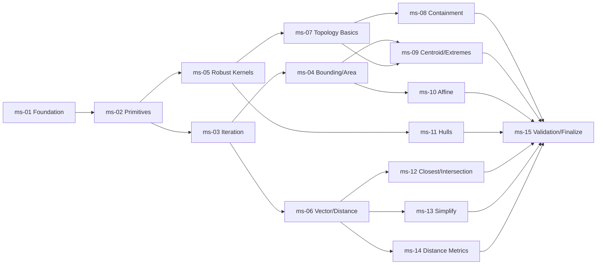
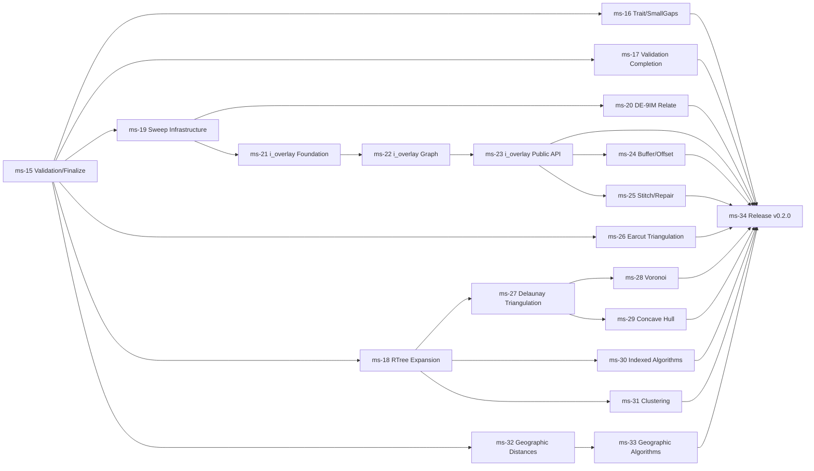

# Roadmap: georust/geo Library Port to MoonBit (geo-mbt)

- **Roadmap ID:** geo-mbt
- **Author:** totto2727 (roadmap-analyst 役割を Main が代行)
- **Created at:** 2026-05-05T00:00:00Z
- **Last updated:** 2026-05-10T00:00:00Z
- **Status:** active <!-- planned | active | completed (`roadmap-progress.yaml.status` と一致) -->
  - **Phase 1 (ms-01〜ms-15) は 2026-05-06 に completed**。後述 "Phase 2 マイルストーン一覧" に列挙する ms-16 以降の大規模 port / scope 拡張作業のため、ロードマップ全体としては再度 active 扱いに復帰している

このドキュメントは `dev-roadmap` の **Step 1 (Roadmap Intent)** で起草され、**Step 2 (Milestone Decomposition)** でマイルストーン一覧と依存グラフが追記されて確定する**戦略層の不変な計画書**。1 サイクルの `dev-workflow` では収まらない複数サイクル規模の開発を束ねる。書き方の詳細は `share-artifacts/references/roadmap.md` を参照。

## 背景

[georust](https://georust.org/) の `geo` クレートは Rust 製の地理空間プリミティブ・アルゴリズム集合で、85 以上のアルゴリズムモジュールと 11 種のジオメトリ型を有する成熟した OSS である。一方で MoonBit エコシステムには現状、同等の汎用地理空間ライブラリが存在しない。既存の `mbt/package/geo` (`@totto2727/geo`) は GeoJSON 中心で Turf.js 風の API を志向しており、georust/geo の網羅的アルゴリズム群とは設計思想が異なる。

この移植を 1 サイクルの `dev-workflow` に収められない理由は次のとおり:

1. **対象規模が単一 PR を遥かに超える** — `geo-types` のジオメトリ 11 種 + `geo` の 85 アルゴリズムモジュールに加え、`robust` (堅牢述語) など外部依存も移植対象になる。1 PR 単位の Intent Spec では観測可能性が成立しない
2. **アルゴリズム間に強い順序依存がある** — Coord/Point などのプリミティブは全アルゴリズムの前提、CoordsIter/LinesIter/MapCoords は多数のアルゴリズムが内部で利用、Kernel (orient2d 等の堅牢述語) は ConvexHull/Contains/Relate などの述語系の前提、AffineTransform は Translate/Rotate/Scale の前提というレイヤ構造を持つ
3. **テストの完全移植が必須** — ユーザー要件として「必ず同等のテストを移植する」が指定されているため、単に API を写すだけでなく Rust 製 `#[cfg(test)]` ブロックを MoonBit blackbox/whitebox テストに置き換える作業が各アルゴリズムごとに発生する
4. **MoonBit の言語特性差を体系的に吸収する必要がある** — Rust の `T: CoordNum` ジェネリクスを `f64` 固定化、`Mul<T>`/`Div<T>` の代わりに `mul`/`div` 関数化、トレイト境界の制限など、設計指針をロードマップ層で確定する必要がある (個別サイクルで再発見すると一貫性を失う)

ユーザー意図として「2D 限定 / `f64` 固定 / トレイト化は後回し」が明示されており、Rust 版の汎用ジェネリクス設計を簡素化しつつコア機能を網羅する移植戦略が必要。本ロードマップは対象範囲の合意・移植順序の確定・MoonBit 固有の設計方針の確立をその責務とし、配下 `dev-workflow` サイクルが各機能群の Intent / Design / 実装 / 検証を実行する。

## 目的

`geo-mbt` を、`geo-types` 由来のジオメトリ型と `geo` 由来の 2D 平面アルゴリズム群を含む MoonBit 製地理空間ライブラリとして稼働状態に到達させる。`vp run --filter @totto2727/geo-mbt check` および `vp run --filter @totto2727/geo-mbt test` が PASS し、Rust 版で網羅されている主要 2D 平面アルゴリズム (面積 / 重心 / 境界 / 包含 / 交差 / 距離 / 単純化 / アフィン変換 / 凸包等) が同等テストとともに利用可能な状態を到達点とする。

## スコープ境界

- **対象パッケージ**: `mbt/package/geo-mbt/` (新規作成)
- **対象ソース構造**:
  - `src/geo/2d/` — `geo` 本体由来のアルゴリズム群 (2D 限定)
  - `src/geo/2d/type/` — `geo-types` 由来のジオメトリ型
  - `src/robust/` — `robust` クレート由来の堅牢述語 (`orient2d`, `incircle` 等; 既存 `mbt/package/geo/src/util/robust/` を参考にしつつ独立実装)
  - 必要に応じて他の周辺パッケージを `src/<name>/` として移植
- **対象 georust リポジトリ** (参照ソース): `~/proj/geo/` 配下にクローン済み (`georust-geo`, `robust`, `rstar`, `earcutr`, `i_overlay`, `spade`, `geographiclib-rs`, `num-traits`)
- **対象アルゴリズム種別**: 平面 (Euclidean) アルゴリズム全般、堅牢述語ベースの述語演算、アフィン変換、単純化、凸包、距離・長さ、面積、境界、包含・交差、座標位置、座標反復
- **対象テスト**: Rust 版に存在する unit test / doctest 相当のテスト (移植時には MoonBit blackbox `*_test.mbt` および whitebox `*_wbtest.mbt` の慣例に従う)
- **数値型**: `Coord` の x/y は `Double` (= `f64`) 固定。`T: CoordNum` 汎用ジェネリクスは展開しない

## 非スコープ

平面座標系を前提とし、以下は本ロードマップでは扱わない (本ロードマップ完了後の作業順序は「非スコープ後続作業の優先順位」節を参照):

- **3D ジオメトリ** — `Coord3DTrait` 相当 / Z 座標 / 体積計算等は本ロードマップでは扱わない。Generic / 3D 対応は MoonBit のトレイト制約上無理があることが `mbt/package/geo` 側で検証済みであり、**今後も実装しない方針が確定**
- **緯度経度 / 球面・測地距離 (Geodesic / Haversine / Rhumb / Vincenty)** — `geographiclib-rs` 依存の地球楕円体計算は別ロードマップに延期 (本ロードマップは平面 Euclidean に集中)
- **Boolean Operations (Union / Intersection / Difference / XOR)** — `i_overlay` 依存。実装規模が極めて大きく、独立ロードマップとして扱う
- **三角形分割 (Earcut / Delaunay / Spade) / Voronoi 図** — `earcut` / `spade` 依存。独立ロードマップに延期
- **空間索引 (R\*-tree / BallTree / 区間木)** — `rstar` / `sif-itree` 依存。独立ロードマップに延期
- **Buffer (オフセット) 演算** — `i_overlay` ベースで提供されており Boolean Ops と一括延期
- **PROJ ベースの投影変換 (`Transform` / `proj` モジュール)** — Rust 版でも `feature = "proj"` フラグ。本ロードマップでは扱わない
- **Relate (DE-9IM) / Bentley-Ottmann スイープ / 単調分割 (Monotone / MonotoneChain)** — 実装規模が大きく、堅牢述語と空間索引の整備後に別ロードマップで扱う
- **トレイト化** — ユーザー意図に基づき初期は具体型 (`Coord` = `(Double, Double)` 固定) に対する関数群として実装。**ただしトレイトによる制約は今後必要になる可能性が高いため将来対応する**。Generic / 3D 対応は対象外とし、共通の振る舞い (例: `coords_iter`, `bounding_rect`, `area` 等の関数群を統一インターフェイス化) を抽出する目的に限定する
- **既存 `mbt/package/geo` (`@totto2727/geo`) の置換 / 統合** — `geo-mbt` は独立パッケージとして並走し、`@totto2727/geo` は GeoJSON / Turf.js 系として残す。統合方針は将来検討
- **Rust 版 fuzz テスト / benchmark の移植** — テストは unit/doctest 相当のみ移植

## 非スコープ後続作業の優先順位

本ロードマップ (ms-01〜ms-15) 完了後、以下の順序で進めた (2026-05-06 同一ブランチ上で完了):

1. **空間索引 (Spatial Index)** ✅ — `src/rtree/` に bulk-loaded R-tree (Sort-Tile-Recursive packing) を実装。`query_rect_intersection` / `query_nearest` を提供。完全な R\*-tree ではなく読み取り専用版だが、`indexed` 系ユースケースに十分。詳細はコミット `bdce595`
2. **トレイト化 (制約用途のみ)** ✅ — `src/geo/2d/traits.mbt` に `CoordsCarrier`, `Bounded`, `HasArea`, `HasCentroid`, `HasLength` を定義。Generic な数値型対応 / 3D 対応は方針通り行わず、各既存ジオメトリ型への impl のみで構成。詳細はコミット `125eb71`。その後 `c8b61f2` で `traits.mbt` を解体し、各 trait をアルゴリズム実装ファイルにコロケート
3. **Boolean Operations (部分実装)** ⚠️ — `src/geo/2d/bool_ops.mbt` に Sutherland-Hodgman アルゴリズムを実装。**凸クリップ多角形による任意多角形のクリッピング限定**。`i_overlay` 相当の任意の多角形 (穴付き / 非凸) 同士の Union / Intersection / Difference / XOR は今後の作業として残る (Phase 2 ms-21〜ms-23 で扱う)。詳細はコミット `c182ff5`
4. **Rust 版 fuzz テスト / benchmark の移植** ✅ (プロパティテスト部分) — `src/geo/2d/property_test.mbt` に 11 個の不変性テストを追加。signed_area の符号反転、centroid が凸 polygon に含まれること、convex hull の凸性、translate の可逆性等。`moon bench` 移植は `moonbitlang/x/benchmark` が deprecated のため将来作業として保留。詳細はコミット `4acaccf`

## Phase 2: 大規模 port / scope 拡張 マイルストーン一覧 (ms-16 以降)

Phase 1 (ms-01〜ms-15 + 上記 post-scope 4 項目) 完了後、Rust 版 `geo` との
**残挙動差分のうち 3D を除く全項目**を Phase 2 として追加した (2026-05-10
追記)。各マイルストーンは Phase 1 と同じ粒度 (1〜3 dev-workflow サイクル
規模) で、原則として独立に着手可能だが、依存グラフに沿って進める。

Phase 2 の特徴:

- **i_overlay-equivalent の汎用 BooleanOps** が最大規模 (ms-21〜ms-23)。
  上流 Rust `i_overlay` クレートは ~19,400 LOC + 4 つの依存 crate
  (`i_float`, `i_shape`, `i_tree`, `i_key_sort`)。Pure MoonBit port を
  前提に 3 サブマイルストーンへ分割した。Rust/WASM bridge は scope 上
  の代替案として `milestones/ms-21-ioverlay-foundation.md` の Notes に
  併記するが、ロードマップ上の正準アプローチは pure MoonBit port
- **空間索引 (R\*-tree) の本格化** は ms-18 (現在は bulk-load 限定)
- **DE-9IM relate** (ms-20) は **sweep infrastructure** (ms-19) に依存
- **Triangulation** (ms-26〜ms-28) は **earcut** → **Delaunay** → **Voronoi** の順で積む
- **Geographic algorithms** (ms-32〜ms-33) は scope 上、本来の `geo-mbt`
  CLAUDE.md では out-of-scope として記載されている。Phase 2 で取り込む
  にあたっては `mbt/package/geo-mbt/CLAUDE.md` の "Scope" セクションを
  ms-32 着手時に更新する必要がある (planar Euclidean only 制約の緩和)
- **3D は Phase 2 でも引き続き対象外**。Phase 2 完了後も 3D は実装しない方針

| ID                           | Title                                                       | Estimated dev-workflow cycle count | Milestone dependencies       | Detail                                       |
| ---------------------------- | ----------------------------------------------------------- | ---------------------------------- | ---------------------------- | -------------------------------------------- |
| ms-16-trait-and-small-gaps   | Trait Surface Expansion + Small ⏳ Items                    | 1                                  | ms-15-validation-finalize    | `milestones/ms-16-trait-and-small-gaps.md`   |
| ms-17-validation-completion  | Validation Completion (RingRole + indices)                  | 1                                  | ms-15-validation-finalize    | `milestones/ms-17-validation-completion.md`  |
| ms-18-rtree-expansion        | R\*-tree Full Implementation (insert/remove/locate/iter)    | 2                                  | ms-15-validation-finalize    | `milestones/ms-18-rtree-expansion.md`        |
| ms-19-sweep-infrastructure   | Sweep Infrastructure (Bentley-Ottmann + monotone)           | 2                                  | ms-15-validation-finalize    | `milestones/ms-19-sweep-infrastructure.md`   |
| ms-20-relate-de9im           | DE-9IM Relate                                               | 2                                  | ms-19-sweep-infrastructure   | `milestones/ms-20-relate-de9im.md`           |
| ms-21-ioverlay-foundation    | i_overlay Foundation (deps + segments + grid layout)        | 3                                  | ms-19-sweep-infrastructure   | `milestones/ms-21-ioverlay-foundation.md`    |
| ms-22-ioverlay-graph         | i_overlay Graph + Extraction                                | 2                                  | ms-21-ioverlay-foundation    | `milestones/ms-22-ioverlay-graph.md`         |
| ms-23-ioverlay-public-api    | i_overlay Public BooleanOps API + Line Clipping             | 2                                  | ms-22-ioverlay-graph         | `milestones/ms-23-ioverlay-public-api.md`    |
| ms-24-buffer-offset          | Buffer (Offset) — i_overlay mesh layer                      | 2                                  | ms-23-ioverlay-public-api    | `milestones/ms-24-buffer-offset.md`          |
| ms-25-stitch-repair          | Stitch + Repair Polygon                                     | 1                                  | ms-23-ioverlay-public-api    | `milestones/ms-25-stitch-repair.md`          |
| ms-26-earcut-triangulation   | Earcut Triangulation                                        | 1                                  | ms-15-validation-finalize    | `milestones/ms-26-earcut-triangulation.md`   |
| ms-27-delaunay-triangulation | Delaunay Triangulation (Spade-equivalent)                   | 3                                  | ms-18-rtree-expansion        | `milestones/ms-27-delaunay-triangulation.md` |
| ms-28-voronoi                | Voronoi (Delaunay dual)                                     | 1                                  | ms-27-delaunay-triangulation | `milestones/ms-28-voronoi.md`                |
| ms-29-concave-hull           | Concave Hull (k-NN + Delaunay-based)                        | 1                                  | ms-27-delaunay-triangulation | `milestones/ms-29-concave-hull.md`           |
| ms-30-indexed-algorithms     | Indexed Algorithms (`indexed_*`)                            | 1                                  | ms-18-rtree-expansion        | `milestones/ms-30-indexed-algorithms.md`     |
| ms-31-clustering             | Clustering (DBSCAN + KMeans + Outlier Detection)            | 2                                  | ms-18-rtree-expansion        | `milestones/ms-31-clustering.md`             |
| ms-32-geographic-distances   | Geographic Distance/Length/Bearing (Haversine/Vincenty/etc) | 2                                  | ms-15-validation-finalize    | `milestones/ms-32-geographic-distances.md`   |
| ms-33-geographic-algorithms  | Geographic Algorithms (Densify + cross_track + chamberlain) | 1                                  | ms-32-geographic-distances   | `milestones/ms-33-geographic-algorithms.md`  |
| ms-34-release-v02            | API Surface Review + v0.2.0 Release Prep                    | 1                                  | (all of ms-16〜ms-33)        | `milestones/ms-34-release-v02.md`            |

## 大局的制約

複数サイクルを横断して効く制約のみを列挙する。個別サイクル内で完結する制約は配下サイクルの Intent Spec の責務。

### 技術的制約

- パッケージ配置は `mbt/package/geo-mbt/` 固定。プロジェクト名 `@totto2727/geo-mbt`、moon module 名 `totto2727/geo-mbt`
- ソース構造は `src/geo/2d/` を本体とし、関連モジュールは `src/<name>/` として配置 (例: `src/robust/`)
- 数値型は `f64` (MoonBit `Double`) 固定。`Int` / `Float` (32bit) サポートは行わない
- 2D に限定し、3D の `Coord3D` 系および Z 座標は扱わない (型シグネチャから Z を排除)
- Rust の `T: CoordNum` ジェネリクスは `Double` に具体化。`Mul<T>` / `Div<T>` は MoonBit のトレイト制約上 `mul(Self, Double) -> Self` / `div(Self, Double) -> Self` メソッドとして実装
- トレイト化は当面行わず、特定型 (`Coord`, `Point`, `LineString` 等) に対する関数群として実装する。将来トレイト化する余地を残しつつ、現時点では単純な関数 / メソッド形式
- 同等テストの完全移植が必須 — Rust 版の `#[cfg(test)]` ブロックおよび doctest 相当を MoonBit blackbox `*_test.mbt` に移植
- `vp run --filter @totto2727/geo-mbt check` および `vp run --filter @totto2727/geo-mbt test` の PASS が各サイクルの完了条件

### アーキテクチャ的制約

- **レイヤ依存方向の固定** — `src/robust/` (堅牢述語) は最下層、`src/geo/2d/type/` (ジオメトリ型) はその上、`src/geo/2d/algorithm/` 系 (各アルゴリズム) は型レイヤに依存。逆方向の依存は許可しない
- **モジュール境界 = ファイル粒度** — Rust 版の 1 ファイル ≒ 1 モジュールの粒度を MoonBit でも踏襲する。`src/geo/2d/area.mbt` のように `<algorithm>.mbt` を基本単位とする (やむを得ず分割する場合のみサブディレクトリ化)
- **API 命名規則** — Rust 版の trait 名 (`Area`, `Centroid`, `BoundingRect` 等) を関数名 (`area_of`, `centroid_of`, `bounding_rect_of`) または型固有メソッド (`Polygon::area`) として MoonBit 慣習に合わせて再命名する。命名規則の確定は ms-01 で行う
- **外部依存の最小化** — `moonbitlang/x` を除く外部 MoonBit 依存は原則追加しない (移植元 Rust が依存する `num-traits` 等は MoonBit 標準で代替)

### 規範的制約

- 既存リポジトリのコーディング規約 (`CLAUDE.md` / 既存 `mbt/package/geo/CLAUDE.md` / `mbt/package/geo` のスタイル) に従う
- Apache-2.0 ライセンスを継承 (`geo-types` / `geo` は MIT OR Apache-2.0、`robust` は Apache-2.0)。各移植ファイルの先頭に上流ファイルへの参照コメントを残す慣例とする
- すべてのサイクルが `dev-workflow` の 9 ステップ体系および本スキル (`dev-roadmap`) の 4 ステップ体系に準拠する

### 組織的制約

- 個人 (totto2727 単独) 開発を想定。レビュー観点は `specialist-reviewer` の観点別並列起動で代替
- 並行 `dev-workflow` サイクル数の上限は **2** (実装中サイクル + ドキュメント / レビュー作業の並走を許容)
- 期間目標は本ロードマップでは設定しない。配下サイクル単位で柔軟に進める
- 本ロードマップは離席中の自律実行を許容する。マイルストーン間の実行順序は依存グラフに従い、ユーザー判断を要する Blocker は In-Progress Report を作成して翌日のレビューに委ねる

## マイルストーン一覧

`dev-roadmap` の Step 2 で確定した本節以降は immutable。`milestones/<milestone-id>.md` に各マイルストーンの詳細を記載。

| ID                         | Title                                               | Estimated dev-workflow cycle count | Milestone dependencies                                                                                                                    | Detail                                     |
| -------------------------- | --------------------------------------------------- | ---------------------------------- | ----------------------------------------------------------------------------------------------------------------------------------------- | ------------------------------------------ |
| ms-01-foundation           | Foundation: Package Skeleton + Coord Type           | 1                                  | (none)                                                                                                                                    | `milestones/ms-01-foundation.md`           |
| ms-02-primitives           | Geometry Primitives (Point/Line/LineString/etc.)    | 1                                  | ms-01-foundation                                                                                                                          | `milestones/ms-02-primitives.md`           |
| ms-03-iteration            | Iteration & Traversal (CoordsIter/LinesIter/Map)    | 1                                  | ms-02-primitives                                                                                                                          | `milestones/ms-03-iteration.md`            |
| ms-04-bounding-area        | Bounding & Area (BoundingRect/Area/Dimensions)      | 1                                  | ms-03-iteration                                                                                                                           | `milestones/ms-04-bounding-area.md`        |
| ms-05-robust-kernels       | Robust Predicates (orient2d/incircle) + Kernel      | 1                                  | ms-02-primitives                                                                                                                          | `milestones/ms-05-robust-kernels.md`       |
| ms-06-vector-distance      | Vector Ops + Euclidean Distance/Length/Bearing      | 1                                  | ms-03-iteration                                                                                                                           | `milestones/ms-06-vector-distance.md`      |
| ms-07-topology-basics      | Topology Basics (CoordinatePosition/Intersects)     | 1                                  | ms-05-robust-kernels                                                                                                                      | `milestones/ms-07-topology-basics.md`      |
| ms-08-containment          | Containment (Contains/Within/Covers)                | 1                                  | ms-07-topology-basics                                                                                                                     | `milestones/ms-08-containment.md`          |
| ms-09-centroid-extremes    | Centroid / Extremes / Winding / IsConvex / Orient   | 1                                  | ms-04-bounding-area, ms-07-topology-basics                                                                                                | `milestones/ms-09-centroid-extremes.md`    |
| ms-10-affine               | Affine Ops (Translate/Rotate/Scale/Skew)            | 1                                  | ms-04-bounding-area                                                                                                                       | `milestones/ms-10-affine.md`               |
| ms-11-hulls                | Convex Hull / Concave Hull                          | 1                                  | ms-05-robust-kernels                                                                                                                      | `milestones/ms-11-hulls.md`                |
| ms-12-closest-intersection | Closest Point / Line Intersection / Locate / Interp | 1                                  | ms-06-vector-distance                                                                                                                     | `milestones/ms-12-closest-intersection.md` |
| ms-13-simplify             | Simplify (RDP/VW) / Chaikin / RemoveRepeated        | 1                                  | ms-06-vector-distance                                                                                                                     | `milestones/ms-13-simplify.md`             |
| ms-14-distance-metrics     | Frechet / Hausdorff Distance / Densify              | 1                                  | ms-06-vector-distance                                                                                                                     | `milestones/ms-14-distance-metrics.md`     |
| ms-15-validation-finalize  | Validation + API Surface Review + Release Prep      | 1                                  | ms-08-containment, ms-09-centroid-extremes, ms-10-affine, ms-11-hulls, ms-12-closest-intersection, ms-13-simplify, ms-14-distance-metrics | `milestones/ms-15-validation-finalize.md`  |

## 依存グラフ

### Phase 1 (ms-01〜ms-15)

### Phase 2 (ms-16〜ms-34)

## 関連リンク

- georust 公式: https://georust.org/
- georust/geo 監修リポジトリ (本ロードマップ用にクローン済み): `~/proj/geo/georust-geo/`
- 関連外部依存クレート (本ロードマップ用にクローン済み): `~/proj/geo/{robust,rstar,earcutr,i_overlay,spade,geographiclib-rs,num-traits}/`
- 既存類似パッケージ: `mbt/package/geo/` (`@totto2727/geo` — GeoJSON / Turf.js 系)
- 既存 `mbt/package/geo` の robust 実装: `mbt/package/geo/src/util/robust/`
- 移植元の主要モジュール一覧: `~/proj/geo/georust-geo/geo/src/algorithm/mod.rs` (85 モジュール)、`~/proj/geo/georust-geo/geo-types/src/geometry/` (11 ファイル)
- 関連 ADR: `docs/adr/` (本ロードマップ実行中に発生する横断的決定は General mode ADR としてここに追加)

## オープン質問

- **`sif-itree` および `float_next_after` の代替** — ユーザー要件により全依存を `~/proj/geo/` にクローンする方針だったが、これら 2 件は GitHub 検索で公式リポジトリが特定できなかった。本ロードマップでは sif-itree (区間木) と float_next_after (浮動小数点 next-after) を非依存とし、必要時に MoonBit 標準ライブラリで代替実装する方針で進める。配下サイクルで影響が顕在化した場合は追加クローンを検討
- **API 命名規則の最終確定** — Rust trait 名 (`Area`, `Centroid` 等) を MoonBit でどう表現するか (`area_of(geometry)` 関数 vs `Polygon::area` メソッド vs 両方提供) は ms-01 配下サイクルの Step 3 (Design) で決定し、以降のマイルストーン全体の前提とする
- **既存 `@totto2727/geo` の `src/util/robust/` 流用範囲** — `geo-mbt` の `src/robust/` として独立実装するか、共通パッケージとして抽出するかは ms-05 配下サイクルの Step 3 で決定。当面は独立実装を前提
- **テスト fixture 共有** — Rust 版が参照する `geo-test-fixtures` (WKT 形式) の MoonBit への取り込み方針 (WKT パーサ移植 / JSON 変換 / 直書き) は配下サイクルで個別判断

## ブランチ運用ポリシー

**Phase 1** は単一ブランチ (`cobalt-ocotillo`) ですべてのマイルストーンを実装した。各マイルストーンは独立コミットとして履歴に積み、後からチェリーピックや分割 PR 化が可能な単位粒度を保っている。

**Phase 2** はマイルストーンあたりの実装規模が大きく (i_overlay foundation だけで数千 LOC 規模)、単一ブランチに積み続けると履歴が散らかるため、**マイルストーン単位で個別ブランチ + 個別 PR を起こす運用に切り替える**。`cobalt-ocotillo` ブランチは Phase 1 のアーカイブとして残し、Phase 2 の各サイクルは `geo-mbt/<milestone-id>` のような短命ブランチで進めて main にマージする。具体のブランチ命名規則は ms-16 着手サイクルの `dev-workflow` Step 1 (Intent Spec) で確定する。
