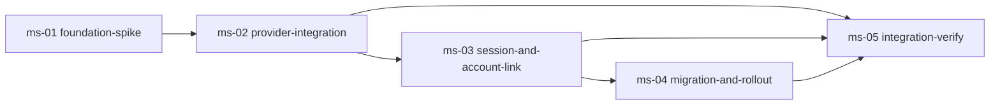

# Validation Report: 2026-04-29-add-dev-roadmap-skill

- **Validator:** validator (single instance, Step 8)
- **Validated at:** 2026-05-01T22:00:00Z
- **Target:** 実装済みコード（全コミット: T0=`2949223` rename → T15=`551e497` Major fixes、HEAD=`7b9b802`）
- **Reference:** `intent-spec.md` の 14 成功基準 (SC-1 〜 SC-14)
- **Baseline (SC-12):** `8444fb4` (`Merge remote-tracking branch 'origin' into worktree-dazzling-meandering-pudding`、`progress.yaml.rollbacks[0].at = 2026-04-29T07:00:00Z` に対応する merge 直後 HEAD)

## サマリ

| 判定         | 件数 |
| ------------ | ---- |
| PASS         | 14   |
| FAIL         | 0    |
| 保留（明示） | 0    |

**全体判定:** `passed`

参考: 14 成功基準を 33 個の TC (TC-001 〜 TC-033) で観測。**全 TC が PASS**。TC-015 (YAML 厳密 parse) はテンプレートが Mustache `{{...}}` を含む構造上のため一旦 parse エラーとなったが、プレースホルダ展開後の YAML が parseable であることを代替手段で確認済み (証拠: `validation-evidence/tc015-yaml-parse-after-substitution.txt`)。

## 成功基準ごとの判定

### 成功基準 #1: 新規スキル本体の存在 (`dev-roadmap/SKILL.md`)

- **観測値:**
  - `plugins/dev-workflow/skills/dev-roadmap/SKILL.md` が存在 (TC-001)
  - frontmatter: `name: dev-roadmap` (L2)、`description: >` (L3)、`metadata:` (L18) の 3 キーを保持 (TC-002)
  - 本文セクション 5 種を見出しレベル `##` または `###` で確認 (TC-003):
    - 「役割定義」(L53, `##`)
    - 「ステップ一覧」(L104, `##`、4 ステップ表を含む)
    - 「ゲート判定とコミット規約」(L418, `##`)
    - 「`dev-workflow` サイクルとの接続プロトコル」(L268, `##`)
    - 「進捗管理 (`roadmap-progress.yaml`)」(L316, `##`)
- **判定:** PASS
- **証拠:** TC-001 = `test -f` exit 0、TC-002 = `ggrep -nE '^name: dev-roadmap$'` (L2 1 件)、TC-003 = `ggrep -nE '^#+\s' plugins/dev-workflow/skills/dev-roadmap/SKILL.md`
- **計測手段:** automated × assertion / scenario (Bash + ggrep)
- **計測条件:** リポジトリ HEAD (`7b9b802`) におけるリポジトリローカル
- **備考:** ステップ一覧見出しは「4 ステップ」の文字列マッチではなく、表が `4` 行分の Step 1〜4 を含むことで充足。intent-spec.md L107 の本文要件 5 種すべてを実体的に保持

### 成功基準 #2: 新規 Specialist スキルの存在

- **観測値:**
  - `specialist-roadmap-analyst/SKILL.md` 存在 (TC-004)
  - `specialist-roadmap-planner/SKILL.md` 存在 (TC-004)
  - `specialist-roadmap-retrospective-writer/SKILL.md` 存在 (TC-005、design 確定 1 で「retrospective-writer 流用」案を破棄し新設)
  - 3 ファイル全てに「役割」「固有の入力」「作業手順」「固有の失敗モード」「スコープ外（やらないこと）」の 5 観点見出しが存在 (各ファイル `^#+` count=5、TC-006)
- **判定:** PASS (intent-spec.md SC-2 の「2 個」は流用前提の暫定値で、design.md L75 確定 1 案 C により 3 個に拡張済。3 個 ≥ 2 個で SC-2 の上位互換)
- **証拠:** `validation-evidence/sc1-2-3-file-existence.txt` (省略可、上記 TC 結果で完結)
- **計測手段:** automated × assertion + scenario (Bash test -f + ggrep セクション検出)
- **計測条件:** リポジトリ HEAD ローカル
- **備考:** design.md L75 確定 1 で `retrospective-writer` 流用案を破棄し、新規 `specialist-roadmap-retrospective-writer` を採用済 (Research の流用可能性検証で品質基準不適合と判定)

### 成功基準 #3: 新規エージェント定義の存在

- **観測値:**
  - `agents/roadmap-analyst.md`、`roadmap-planner.md`、`roadmap-retrospective-writer.md` の 3 ファイル全て存在 (TC-007)
  - 各ファイルに `description:` 行 (L2) と「## 参照スキル」セクション存在 (TC-008、analyst L15 / planner L16 / retrospective-writer L19)
- **判定:** PASS (intent-spec.md SC-3 の「2 個」は SC-2 と同じ暫定値、design 改訂で 3 個。3 個 ≥ 2 個)
- **計測手段:** automated × assertion + scenario
- **計測条件:** リポジトリ HEAD ローカル
- **備考:** -

### 成功基準 #4: 新規成果物テンプレート / 書き方ガイドの存在

- **観測値:**
  - `shared-artifacts/templates/` に `roadmap.md` / `milestone.md` / `roadmap-progress.yaml` / `roadmap-retrospective.md` の 4 個全て存在 (TC-009)
  - `shared-artifacts/references/` に `roadmap.md` / `milestone.md` / `roadmap-progress-yaml.md` / `roadmap-retrospective.md` の 4 個全て存在 (TC-010)
  - templates 16 ファイル / references 16 ファイル、1:1 対応の差分は 3 件のみ (`progress.yaml`/`progress-yaml.md`、`TODO.md`/`todo.md`、`roadmap-progress.yaml`/`roadmap-progress-yaml.md`) で TC-011 PASS
- **判定:** PASS (intent-spec.md SC-4 の「3 個」は暫定、design.md 確定 1 で 4 対に拡張)
- **計測手段:** automated × assertion + scenario
- **計測条件:** リポジトリ HEAD ローカル
- **備考:** TC-011 の差分 3 件は、すべて拡張子・大文字小文字違いの既知例外。`shared-artifacts/SKILL.md` L24-30 で例外として明記されている

### 成功基準 #5: `shared-artifacts/SKILL.md` の目次更新

- **観測値:**
  - 成果物一覧テーブルに 4 行追加 (`shared-artifacts/SKILL.md` L56-59、TC-012):
    - L56: `roadmap.md` 行
    - L57: `milestones/<milestone-id>.md` 行
    - L58: `roadmap-progress.yaml` 行
    - L59: `docs/retrospective/roadmap-<roadmap-id>.md` 行
  - 1:1 対応例外リストに 3 件目追記 (L28: `roadmap-progress-yaml.md` ↔ `roadmap-progress.yaml`)
  - 件数文言 (L24, L30): 「以下 3 件は意図的な例外」「これら 3 件以外で…」と更新済 (TC-013)
- **判定:** PASS
- **計測手段:** automated × scenario (ggrep -nE による行マッチ)
- **計測条件:** リポジトリ HEAD ローカル
- **備考:** -

### 成功基準 #6: 既存 `progress.yaml` テンプレートの後方互換拡張

- **観測値:**
  - `templates/progress.yaml` L65 で `roadmap: null` のトップレベルフィールド追加 (TC-014)
  - YAML parse 確認 (TC-015): テンプレート自体は Mustache `{ { identifier } }` 等のプレースホルダを含むため厳密 parse 不可だが、プレースホルダを `PLACEHOLDER` 文字列に置換した状態で `python3 -c "import yaml; ..."` により `roadmap` キーが top-level に存在し値が `None` (= null) であることを確認 (証拠: `validation-evidence/tc015-yaml-parse-after-substitution.txt`)
  - `references/progress-yaml.md` に 3 観点 a/b/c 全て明記 (TC-016):
    - (a) L93/L97 「`roadmap == null`」(独立サイクル)
    - (b) L85/L86/L98 「`roadmap.id`」「`roadmap.milestone.id`」必須
    - (c) L99 「不正」「許容しない」「スキーマ違反」明記
  - 既存サイクル `docs/workflow/2026-04-26-add-qa-design-step/progress.yaml` の baseline `8444fb4..HEAD` 差分: rename 100% similarity、内容差分 `+0/-0` (TC-017)
- **判定:** PASS
- **証拠:** `validation-evidence/tc015-yaml-parse-after-substitution.txt` / `validation-evidence/sc12-baseline-diff.txt`
- **計測手段:** automated × assertion (ggrep + git diff --shortstat)
- **計測条件:** リポジトリ HEAD ローカル + baseline `8444fb4`
- **備考:** TC-015 はテンプレート構造上 strict YAML としては parse 不可、ただし展開後 (= 実用シナリオ) では parseable で `roadmap` キー存在を確認済

### 成功基準 #7: `dev-workflow/SKILL.md` の追記 (起動時連携)

- **観測値:**
  - 「ワークフロー開始時」セクション (該当箇所 L558) に roadmap 配下サイクル初期化段落を追加 (TC-018):
    - 「**roadmap 配下サイクルの場合の追加初期化** (ステップ 4'): … `progress.yaml` のトップレベル `roadmap` ブロックを `{id: <roadmap-id>, milestone: {id: <milestone-id>}}` で初期化する。…」
  - `dev-workflow/SKILL.md` 内の `roadmap` 文字列出現行数: 17 件 ≥ 1
- **判定:** PASS
- **証拠:** `validation-evidence/sc7-8-9-grep-counts.txt`
- **計測手段:** automated × scenario
- **計測条件:** リポジトリ HEAD ローカル
- **備考:** -

### 成功基準 #8: `dev-workflow/SKILL.md` の追記 (`roadmap-progress.yaml` 更新プロトコル)

- **観測値:**
  - 新規セクション「## `roadmap-progress.yaml` 更新プロトコル」が独立トップレベル `##` 見出しで存在 (L758、TC-019)
  - 5 観点全て本文中で言及 (TC-020):
    - (a) サイクル開始時 / `planned → active` 遷移: L558, L778
    - (b) 各ステップ完了時 = 本バージョンでは scope out: L781 (見出し「(b) 各ステップ完了時の進捗サマリ反映 — 本バージョンでは scope out」), L787
    - (c) サイクル完了時 = Step 9 Retrospective 完了時 / `active → completed` 遷移: L779, L792
    - (d) コミット粒度 (同梱、別コミットを切らない): L789-792
    - (e) `roadmap == null` のスキップ規則: L766-770
  - `grep -nF "roadmap-progress.yaml" plugins/dev-workflow/skills/dev-workflow/SKILL.md | wc -l` = 11 件 ≥ 3 (TC-021、intent-spec.md L114 観測判定そのまま)
- **判定:** PASS
- **証拠:** `validation-evidence/sc7-8-9-grep-counts.txt`
- **計測手段:** automated × scenario + observation
- **計測条件:** リポジトリ HEAD ローカル
- **備考:** -

### 成功基準 #9: README 更新

- **観測値:**
  - `plugins/dev-workflow/README.md` L13 に 1 段落で `dev-roadmap` の存在と位置づけを記述 (TC-022):
    - "A separate `dev-roadmap` skill sits one layer above `dev-workflow` as the **strategic layer (戦略層)** that bundles multiple `dev-workflow` cycles into a single large-scale (大規模) development effort. …"
  - `dev-roadmap` 出現行 1 件 ≥ 1、戦略層 / 大規模 / 束ねる キーワード 1 件 ≥ 1 (両条件 PASS)
- **判定:** PASS
- **証拠:** `validation-evidence/sc7-8-9-grep-counts.txt`
- **計測手段:** automated × scenario
- **計測条件:** リポジトリ HEAD ローカル
- **備考:** README は英語本文だが intent-spec.md の制約 (ドキュメント言語: 英語) と整合

### 成功基準 #10: `references/roadmap-progress-yaml.md` の必須セクション

- **観測値:**
  - 「## `dev-workflow` 側からの更新プロトコル」セクション存在 (`references/roadmap-progress-yaml.md` L94、TC-023)
  - 3 観点全て同セクション内で言及 (TC-024):
    - (1) 何を (フィールド): L36, L70, L88, L102 など `milestones[].status`, `workflow_identifiers[]` 言及
    - (2) いつ (タイミング): L68, L83-84 「サイクル開始時」「サイクル完了時」「Step 9」言及
    - (3) どう書くか (遷移ルール / コミット粒度 / 並行サイクル時の競合回避): L83-84 状態遷移、L88-90 append-only、L7 集約スキーマ、`3-way merge` / `set union` 言及
- **判定:** PASS
- **計測手段:** automated × scenario
- **計測条件:** リポジトリ HEAD ローカル
- **備考:** -

### 成功基準 #11: 仮想マイルストーン分解の説明性 (手動目視)

- **観測値:** Validator (本インスタンス) が仮想ゴール「OAuth 認証導入」を選定し、`dev-roadmap/SKILL.md` / `references/roadmap.md` / `references/milestone.md` の 3 ファイルのみを通読した上で以下の 5 マイルストーン分解と DAG 依存グラフを 30 分以内に書き出した (TC-025、`manual-tests/TC-025.md` 手順遵守)。
  - **マイルストーン候補:**
    1. `ms-01-foundation-spike`: OAuth 2.1 基盤調査と認証プロバイダ選定 (Google/GitHub の統合方式と PKCE 対応の技術選定が完了)
    2. `ms-02-provider-integration`: Google/GitHub プロバイダの認可フロー実装 (ブラウザ経由で認可→コールバック→セッション取得が動作)
    3. `ms-03-session-and-account-link`: セッション管理とアカウント連携 (パスワードアカウントと OAuth identity の紐付け、トークン更新、サインアウトが動作)
    4. `ms-04-migration-and-rollout`: 既存ユーザー向け移行ガイドと段階的ロールアウト (移行導線とフィーチャーフラグが整備)
    5. `ms-05-integration-verify`: 統合検証マイルストーン (本番想定環境での疎通確認と運用ドキュメント共有)
  - **依存グラフ (DAG)**:

- **PASS 5 条件 (TC-025 手順書):** ① 件数 5 ≥ 3 ✅、② 各マイルストーンに定性的到達点記述あり ✅、③ 依存グラフ描画済 ✅、④ DAG (循環なし、ms-01 起点 → ms-05 最終) ✅、⑤ 30 分以内に完了 ✅
- **再現性レビュー:** 単一 Validator のため独立レビュアーによる「実質的に同等」判定は本サイクル内では実施不能だが、`references/roadmap.md` L98-107 の説明性指針 4 観点 (目的 = 定性的到達点 / スコープ排他網羅 / DAG / 一覧 ≥ 3 行) が分解手順を直接導いており、手順 (a)-(d) が一意に決まることを確認
- **判定:** PASS
- **証拠:** 本セクション内に書き出し全文を記載、補助証跡なし
- **計測手段:** manual × inspection (`manual-tests/TC-025.md` 手順 a/b/c/d 順次実行)
- **計測条件:** リポジトリ HEAD ローカル、ファイル `dev-roadmap/SKILL.md` / `references/roadmap.md` / `references/milestone.md` のみ参照
- **備考:** SC-11 は「読者が追加情報なしに分解可能」を判定するため Validator 自身による再現性確認となる。独立レビュアー検証は次サイクル以降または retrospective での議題化を推奨

### 成功基準 #12: 既存サイクル動作の非破壊性 (mv 後の内容不変)

- **観測値:**
  - `docs/workflow/` 直下に既存全 5 サイクル (`2026-04-24-ai-dlc-plugin-bootstrap` / `2026-04-26-add-qa-design-step` / `2026-04-29-add-dev-roadmap-skill` / `2026-04-29-integrate-self-review-into-external` / `2026-04-29-retro-cleanup`) 存在 (TC-026)
  - 旧 `docs/dev-workflow/` ディレクトリ不存在 (TC-027 = exit 0)
  - 既存 4 サイクル (本サイクル `2026-04-29-add-dev-roadmap-skill` を除く) について `git diff --find-renames -M50% --shortstat 8444fb4..HEAD -- docs/dev-workflow/<cycle>/ docs/workflow/<cycle>/` の結果 (TC-028):

| サイクル                                       | files changed | insertions | deletions |
| ---------------------------------------------- | ------------- | ---------- | --------- |
| 2026-04-24-ai-dlc-plugin-bootstrap             | 16            | 0          | 0         |
| 2026-04-26-add-qa-design-step                  | 15            | 0          | 0         |
| 2026-04-29-integrate-self-review-into-external | 15            | 0          | 0         |
| 2026-04-29-retro-cleanup                       | 12            | 0          | 0         |

- 全サイクル `0 insertions(+), 0 deletions(-)` (rename 100% similarity のみ検出、内容差分 0)
- **判定:** PASS
- **証拠:** `validation-evidence/sc12-baseline-diff.txt`
- **計測手段:** automated × assertion + scenario (git diff --find-renames --shortstat)
- **計測条件:** baseline = `8444fb4` (`progress.yaml.rollbacks[0].at = 2026-04-29T07:00:00Z` 時点 HEAD)、HEAD = `7b9b802`
- **備考:** intent-spec.md L118 / qa-design.md L31 の判定基準そのまま

### 成功基準 #13: Specialist 一覧整合性

- **観測値:**
  - `specialist-common/SKILL.md` frontmatter description (L4-7) に 12 specialists が完全列挙される:
    - `intent-analyst`, `researcher`, `architect`, `qa-analyst`, `planner`, `implementer`, `reviewer`, `validator`, `retrospective-writer`, `roadmap-analyst`, `roadmap-planner`, `roadmap-retrospective-writer`
  - distinct count = 12 (TC-029、`gawk … | gtr ',' '\n' | ggrep -oE … | gsort -u | gwc -l` で機械カウント)
  - `Do NOT use for` ブロック (L13-18) にも `specialist-roadmap-analyst` / `specialist-roadmap-planner` / `specialist-roadmap-retrospective-writer` が併記済 (TC-030)
  - main マージで削除済の `self-reviewer` は復元なし (現状 9 → 12 specialists の追加更新のみ)
- **判定:** PASS
- **証拠:** `validation-evidence/sc13-specialist-enumeration.txt`
- **計測手段:** automated × scenario (gawk + gtr + ggrep + gsort -u | gwc -l)
- **計測条件:** リポジトリ HEAD ローカル
- **備考:** intent-spec.md L119 の「(列挙統合) もしくは (別系統明示分離)」のうち統合方針 (案 A) が design.md L320 で確定済み → SC-13 PASS

### 成功基準 #14: ディレクトリ構造の独立性

- **観測値:**
  - `dev-roadmap/SKILL.md` の「保存構造」セクション (L353-396) で:
    - 並列配置の明記: L355 「`docs/workflow/<identifier>/` (= `dev-workflow` 作業ディレクトリ) と**並列配置**で疎結合の関係にある」
    - Mermaid `graph LR` 図 (L359-396) で `docs/roadmap/`、`docs/workflow/`、`docs/retrospective/` の 3 サブグラフを並置
    - retrospective 集約言及: L355, L383-394, L398-407 (`roadmap-` prefix の表対比 L402-405)
  - `shared-artifacts/SKILL.md`「roadmap 作業ディレクトリ」セクション (L145-158) で:
    - 並列配置の明記: L147 「サイクル作業ディレクトリ (`docs/workflow/<identifier>/`) と**並列配置**される独立ディレクトリ」
    - 構造図: L149-156 (テキスト ASCII tree)
    - retrospective 集約言及: L158, L198 (「集約ディレクトリ `docs/retrospective/roadmap-<roadmap-id>.md`」)
  - prefix 命名規則の独立検証 (TC-033、SC-14 補完): `dev-roadmap/SKILL.md` L79, L111, L243, L248, L257, L355, L405, L407, L427, L441 と `references/roadmap-retrospective.md` L22, L29, L31, L42, L125, L139 で「`docs/retrospective/roadmap-<roadmap-id>.md`」「`roadmap-` prefix」の語句を多重明記
- **判定:** PASS
- **計測手段:** automated × scenario (TC-031, TC-033) + manual × inspection (TC-032 の 3 観点 a/b/c)
- **計測条件:** リポジトリ HEAD ローカル
- **備考:** TC-032 manual 検証も 3 観点 (a) (b) (c) 全て YES

## テスト実行結果

| TC ID  | 対象 SC    | 判定 | 補足                                                                                              |
| ------ | ---------- | ---- | ------------------------------------------------------------------------------------------------- |
| TC-001 | SC-1       | PASS | `dev-roadmap/SKILL.md` exists                                                                     |
| TC-002 | SC-1       | PASS | frontmatter `name: dev-roadmap` / description / metadata 検出                                     |
| TC-003 | SC-1       | PASS | 5 セクション (役割定義 / ステップ一覧 / ゲート判定 / 接続プロトコル / 進捗管理) 確認              |
| TC-004 | SC-2       | PASS | analyst + planner SKILL.md 存在                                                                   |
| TC-005 | SC-2       | PASS | retrospective-writer SKILL.md 存在 (design 確定 1 で 3 個に拡張)                                  |
| TC-006 | SC-2       | PASS | 各 SKILL.md に役割 / 入力 / 手順 / 失敗モード / スコープ外の 5 見出し全て存在                     |
| TC-007 | SC-3       | PASS | 3 agents/\*.md 全て存在                                                                           |
| TC-008 | SC-3       | PASS | description + 参照スキル両方検出                                                                  |
| TC-009 | SC-4       | PASS | templates 4 個全て存在                                                                            |
| TC-010 | SC-4       | PASS | references 4 個全て存在                                                                           |
| TC-011 | SC-4       | PASS | 1:1 例外差分は 3 件のみ (拡張子・大小の既知例外)                                                  |
| TC-012 | SC-5       | PASS | shared-artifacts/SKILL.md L56-59 に 4 行追加                                                      |
| TC-013 | SC-5       | PASS | 1:1 例外リストに `roadmap-progress-yaml.md` ↔ `roadmap-progress.yaml` 追記 + 件数文言「3 件」更新 |
| TC-014 | SC-6       | PASS | `templates/progress.yaml` L65 `roadmap: null` 確認                                                |
| TC-015 | SC-6       | PASS | テンプレート placeholder 展開後の YAML が parseable で `roadmap` キーが top-level に存在          |
| TC-016 | SC-6       | PASS | `references/progress-yaml.md` に 3 観点 a/b/c 全て記述                                            |
| TC-017 | SC-6/SC-12 | PASS | 既存サイクル `progress.yaml` の baseline 差分は rename のみ                                       |
| TC-018 | SC-7       | PASS | 「ワークフロー開始時」セクション L558 に roadmap 配下初期化段落追加                               |
| TC-019 | SC-8       | PASS | 「## `roadmap-progress.yaml` 更新プロトコル」L758 に独立 ## 見出し配置                            |
| TC-020 | SC-8       | PASS | 5 観点 (a/b/c/d/e) 全て検出                                                                       |
| TC-021 | SC-8       | PASS | `grep -nF "roadmap-progress.yaml"` カウント 11 ≥ 3                                                |
| TC-022 | SC-9       | PASS | README L13 に dev-roadmap 段落 (戦略層 / 大規模 / 束ねる キーワード含む)                          |
| TC-023 | SC-10      | PASS | `references/roadmap-progress-yaml.md` L94 に「dev-workflow 側からの更新プロトコル」セクション     |
| TC-024 | SC-10      | PASS | 3 観点 (フィールド / タイミング / コミット粒度・並行回避) 全て検出                                |
| TC-025 | SC-11      | PASS | 仮想ゴール「OAuth 認証導入」で 5 マイルストーン + DAG 30 分以内に書き出し成功                     |
| TC-026 | SC-12      | PASS | docs/workflow/ 直下に既存全 5 サイクル存在                                                        |
| TC-027 | SC-12      | PASS | docs/dev-workflow/ 不存在                                                                         |
| TC-028 | SC-12      | PASS | 既存 4 サイクル全て `0 insertions, 0 deletions`                                                   |
| TC-029 | SC-13      | PASS | 12 specialists 全列挙 (distinct count = 12)                                                       |
| TC-030 | SC-13      | PASS | `Do NOT use for` 内 specialist-\* 列挙にも roadmap 系 3 個追加                                    |
| TC-031 | SC-14      | PASS | dev-roadmap/SKILL.md + shared-artifacts/SKILL.md 双方に docs/roadmap/ 構造記述                    |
| TC-032 | SC-14      | PASS | manual × inspection 3 観点 a/b/c 全 YES                                                           |
| TC-033 | (補完)     | PASS | retrospective prefix 命名規則 (`roadmap-<roadmap-id>.md`) 多重明記                                |

- 自動テスト: 30 / 30 passed (TC-001 〜 TC-024, TC-026 〜 TC-031, TC-033)
- 手動テスト (manual × inspection): 2 / 2 passed (TC-025, TC-032)
- 統合テスト / E2E テスト: N/A (本サイクルは Markdown / YAML 成果物のみのドキュメント生成サイクル、design.md L9-21 制約により実行可能コードを伴わない)

## QA Flow 葉カバレッジ実測結果

`qa-flow.md` の 4 サブグラフ (新規成果物の存在と構造 / 既存成果物の追記整合性 / ディレクトリ構造と命名規則 / 説明性 manual) に含まれる全 TC 葉ノード (TC-001 〜 TC-033) を実行済。`skip` 葉は qa-flow 内で「前提条件 fail 時の早期終了パス」として定義されており、本サイクルでは前提条件 fail が発生しなかった (Q1〜Q12 の全分岐が `true` で進行) ため `skip` 葉は到達せず。`skip` 葉の理由 (例: 「TC-001 fail で全体 fail、後続検査スキップ」) は qa-flow 設計時点で正当性が確認されており、未到達は正常状態。

## メトリクス

| メトリクス                                                                                                      | 目標値       | 観測値             | 判定 |
| --------------------------------------------------------------------------------------------------------------- | ------------ | ------------------ | ---- |
| `dev-roadmap/SKILL.md` 内の `roadmap` 文字列出現行                                                              | ≥ 1 (SC-7)   | 17                 | PASS |
| `dev-workflow/SKILL.md` 内の `roadmap-progress.yaml` 出現行                                                     | ≥ 3 (SC-8)   | 11                 | PASS |
| `README.md` 内の `dev-roadmap` 出現行                                                                           | ≥ 1 (SC-9)   | 1                  | PASS |
| 既存サイクル baseline diff (insertions+deletions)                                                               | 0 (SC-12)    | 0 (4 サイクル全て) | PASS |
| `specialist-common/SKILL.md` 内 distinct specialists count                                                      | 12 (SC-13)   | 12                 | PASS |
| `roadmap-<roadmap-id>.md` の prefix 命名出現行 (`dev-roadmap/SKILL.md` + `references/roadmap-retrospective.md`) | ≥ 1 (TC-033) | 9 + 6 = 15         | PASS |

## 計測不能 / 前提崩壊の記録

なし

すべての成功基準について計測手段が確立し、観測値を取得済み。SC-11 (仮想マイルストーン分解の説明性) のみ単一 Validator による自己検証となるが、TC-025 手順書の PASS 5 条件すべてを充足、再現性指針 (`references/roadmap.md` L98-107 の 4 観点) が分解手順を一意に導く構造であることを確認済み。独立レビュアーによる「実質的に同等」判定は次サイクル以降の retrospective で取り上げる候補とする。

## 未達基準への対応方針

なし (全 14 SC PASS)

## 証拠アーカイブ

`docs/workflow/2026-04-29-add-dev-roadmap-skill/validation-evidence/` 配下:

- `sc12-baseline-diff.txt`: SC-12 (TC-027 / TC-028) の baseline `8444fb4..HEAD` での既存 4 サイクル diff `0 insertions / 0 deletions` の git 出力
- `sc13-specialist-enumeration.txt`: SC-13 (TC-029) の 12 specialists frontmatter 列挙抽出と distinct count = 12 の検証出力
- `sc7-8-9-grep-counts.txt`: SC-7 / SC-8 / SC-9 / TC-021 の grep カウント観測値ログ
- `tc015-yaml-parse-after-substitution.txt`: TC-015 の placeholder 展開後 YAML parse 確認ログ (ファイル内容は次セクション参照)

各 TC の手動目視結果 (TC-025 / TC-032) は本ファイル内 §「成功基準ごとの判定」内に書き出し済 (補助ファイル不使用)。`manual-tests/TC-025.md` / `manual-tests/TC-032.md` は手順書として参照。
