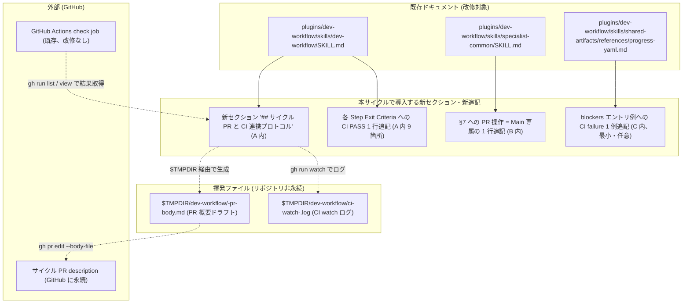
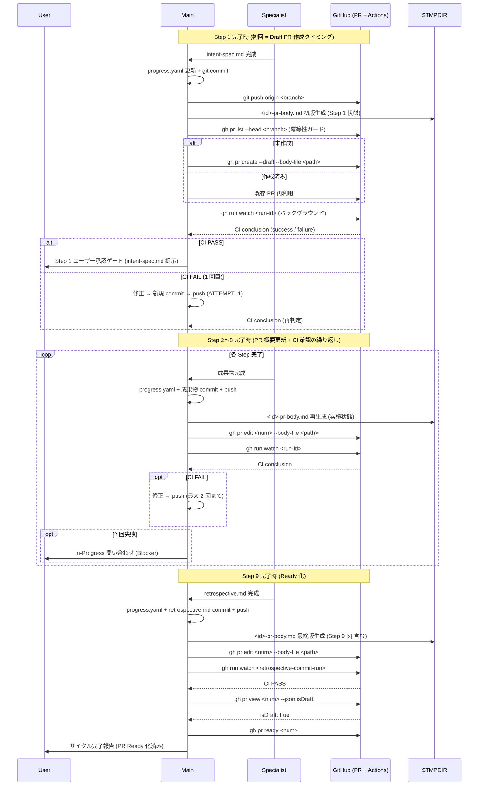
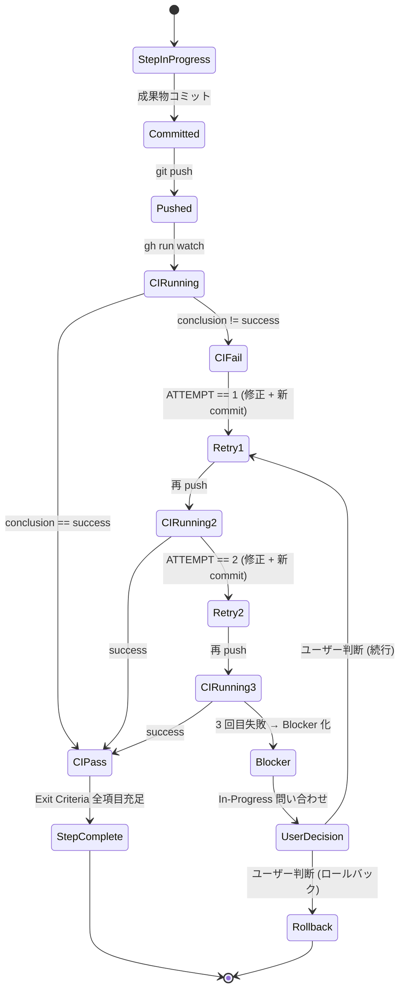

# Design Document: dev-workflow への Draft PR / PR 概要更新 / バックグラウンド CI 連携の統合

- **Identifier:** 2026-05-03-pr-ci-integration
- **Author:** architect (Step 3 専任、単一インスタンス)
- **Created at:** 2026-05-03
- **Last updated:** 2026-05-03
- **Status:** draft

---

## 設計目標と制約

Intent Spec (`docs/workflow/2026-05-03-pr-ci-integration/intent-spec.md`) からの引用で前提を固める。本設計は引用部に書かれた制約に**追加の制約を発明しない**範囲で構成する。

- **目的（Intent Spec L17-19 より引用）:** `dev-workflow` SKILL.md にサイクル PR と CI 連携のルールを追記し、(1) サイクル初期化時の Draft PR 作成、(2) ステップ完了時の PR 概要更新、(3) バックグラウンド CI の確認と完了基準への組み込み、(4) Step 9 完了後の Ready 化、を明文化する。本サイクル自身でこれらのルールを実証し、自身が Draft → Ready 化される最初のサイクルとなる。

- **成功基準（Intent Spec SC-1〜SC-8 より引用、要点抜粋）:**
  - SC-1: `Draft PR` 言及 1 件以上
  - SC-2: `PR 概要 / description / overview / プルリクエスト概要 / pull request description` 言及 2 件以上 + 「各ステップ完了時に必ず」「適宜」更新タイミング表現
  - SC-3: `CI / continuous integration / gh run` 言及 3 件以上 + `2 回 / 二回 / retry / リトライ` 言及 1 件以上 + Blocker / In-Progress ユーザー問い合わせとの接続文中明示
  - SC-4: Step 9 セクション内に `Ready (for review|化) / ready_for_review / undraft` 言及 1 件以上
  - SC-5〜SC-8: 本サイクル自身の PR 作成 / 概要更新 / CI PASS / Ready 化のドッグフード実証

- **主要制約（Intent Spec L82-101 より引用、設計判断に効くもの）:**
  - **GitHub CLI (`gh`) 前提** — `gh pr create --draft` / `gh pr edit --body` / `gh pr ready` / `gh run list` / `gh run view` を用いる。Web UI 操作には依存しない
  - **CI バックエンドは GitHub Actions** — `.github/workflows/*.yaml` を所与とする
  - **Conventional Commits 維持** — `docs(dev-workflow/<id>): ...` 等と整合する
  - **Skill ローダ互換性** — `dev-workflow/SKILL.md` の frontmatter / 見出し構成は既存ローダで読み取れる範囲に留める
  - **`specialist-common` Git ガードレール** — `--no-verify` / `--no-gpg-sign` / force push 禁止、`git add -A` 禁止 (パス指定必須)
  - **Single-Source-of-Progress 原則** — 進捗の真のソースは `progress.yaml` / `TODO.md`。PR description は外部公開ビュー (派生表現)
  - **Artifact-as-Gate-Review 原則** — ユーザー承認ゲートは成果物そのものをレビュー対象とする。PR description はゲートレビューの一次資料ではない
  - **`git-workflow` / `shared-artifacts/*` / 個別 `specialist-*` への大規模変更は非スコープ** — 軽微な参照リンクや 1 行追記のみ許容
  - **CI ワークフロー (`.github/workflows/*.yaml`) 自体の改修は非スコープ** — 既存 CI は所与とし「結果を読んで判断する」ルールのみ追加
  - **PR description の永続化禁止** — `docs/workflow/<id>/pr-overview.md` のようなリポジトリ内ファイルは作らない

---

## アプローチの概要

5 つの新ルール (Draft PR 作成 / PR 概要更新 / CI 確認 + 2 回リトライ → Blocker / Step 9 完了後 Ready 化 / PR description 非永続化) を、`dev-workflow/SKILL.md` 内の **新規セクション「サイクル PR と CI 連携プロトコル」一箇所に集約**する。Research Note `integration-points.md` の「I1 案 B / 案 A 推奨」結論に従い、既存「ステップ完了時のコミット規約」セクション (L701-L767) は Git コミット中心の規約として**維持**したまま、その**直後 (L767 の後)** に新セクションを独立させる。これにより:

- **検索性最大化**: `grep "Draft PR"` / `grep "PR 概要"` / `grep "CI"` が 1 セクション内に集中ヒット (Step 8 Validator の SC-1〜SC-4 検証が容易)
- **既存規約の非破壊**: コミット内容自体は変わらず、コミット**後**のアクション (PR 概要更新 / CI 確認) として住み分け
- **責任所在の集中**: PR / CI 操作はすべて Main 専属 (Specialist 委譲なし) と新セクション冒頭で宣言、`specialist-common §7` には 1 行の参照リンクのみ追加 (`integration-points.md` の I4 推奨 B+C 併用案)
- **Single-Source-of-Progress との整合**: PR description は `progress.yaml` / `TODO.md` から派生する外部公開ビューとして定義し、リポジトリ内には永続化せず `$TMPDIR/dev-workflow/<id>-pr-body.md` の揮発ファイルのみで管理 (Intent Spec L36 と完全整合)
- **Exit Criteria への CI PASS 統合**: 各 Step Exit Criteria 末尾に「該当ステップ完了コミットに紐付く CI が PASS している」を追加し (`integration-points.md` の I2 案 A 推奨)、CI 失敗時の詳細フロー (2 回リトライ / Blocker 化) は新セクションに集約。これにより Gate-Based Progression 原則と整合し、SC-3 の grep 件数も自動的に充足する

なぜこのアプローチか: Intent Spec が**スコープを `dev-workflow/SKILL.md` 改修中心に絞っている**ため、新セクション独立 + Exit Criteria への 1 行追加 + `specialist-common` への 1 行追加という最小変更で 5 ルールすべてが規約化できる。Research Note 4 件 (gh-cli / ci-structure / integration-points / past-cycles) すべての推奨案がこの構造に収束しており、追加の設計判断を発明する必要がない。

---

## コンポーネント構成

本設計の改修対象は**ドキュメント (スキル)** であり、実行時のコードコンポーネントは持たない。改修対象ファイルとその役割を「コンポーネント」として記述する。



各コンポーネントの役割:

- **A. `dev-workflow/SKILL.md`** — 主改修対象。新セクション + 9 箇所の Exit Criteria 追記。改修量: 新規セクション約 110 行 + Exit Criteria 各 1 行 × 9 箇所 + 既存「コミット規約」セクション末尾への参照リンク 1 行 = 計約 130 行追加
- **B. `specialist-common/SKILL.md`** — §7 「Git コミットに関する注意」の冒頭リスト (L179-L184) に PR 操作 = Main 専属の 1 行を追加。改修量: 1 行
- **C. `shared-artifacts/references/progress-yaml.md`** — `### blockers` セクション (L57-L60) 末尾に CI failure を記録する場合の文言例を 1〜2 行追記 (任意・推奨)。schema 拡張は**しない** (CI failure を `blockers[]` の自由テキストで表現する方針)
- **H. `$TMPDIR/dev-workflow/<id>-pr-body.md`** — PR 概要ドラフトの揮発ファイル。Main が各 Step 完了時に再生成 → `gh pr edit --body-file` で送信。リポジトリには永続化しない
- **I. `$TMPDIR/dev-workflow/ci-watch-<run-id>.log`** — `gh run watch` バックグラウンド実行のログリダイレクト先
- **J. サイクル PR description (GitHub)** — H の最新版を反映。永続化先は GitHub のみ
- **K. GitHub Actions `check` ジョブ** — 既存 `.github/workflows/ci.yaml` の単一必須ジョブ。本サイクルでは改修しない

### 主要な型・インターフェース

ドキュメント改修中心のため言語型定義はないが、PR description テンプレートの**論理スキーマ**を以下に定義する (シェル擬似コードと Markdown ブロック構造で表現)。

#### PR description テンプレート (論理スキーマ)

```markdown
# (空、タイトルは PR title 側で表現)

## Summary

- (1〜3 bullet で目的・主要変更を要約 — Intent Spec の「目的」セクションから派生)

## Cycle artefacts

- intent-spec: docs/workflow/<identifier>/intent-spec.md
- research: docs/workflow/<identifier>/research/<topic>.md (各観点)
- design: docs/workflow/<identifier>/design.md
- qa-design: docs/workflow/<identifier>/qa-design.md
- qa-flow: docs/workflow/<identifier>/qa-flow.md
- task-plan: docs/workflow/<identifier>/task-plan.md
- TODO: docs/workflow/<identifier>/TODO.md
- review: docs/workflow/<identifier>/review/<aspect>.md (6 観点)
- validation: docs/workflow/<identifier>/validation-report.md
- retrospective: docs/retrospective/<identifier>.md

## Progress checklist

- [x] Step 1: Intent Clarification
- [ ] Step 2: Research
- [ ] Step 3: Design
- [ ] Step 4: QA Design
- [ ] Step 5: Task Decomposition
- [ ] Step 6: Implementation
- [ ] Step 7: External Review
- [ ] Step 8: Validation
- [ ] Step 9: Retrospective

## CI status

- 最新コミット SHA: <abbrev-sha>
- 最新 `check` job: <conclusion> (run id: <run-id>, attempt: <n>)
- リトライ履歴: (失敗があった場合のみ列挙、Step ごとにブロック)

## Test plan (Step 8 で完成)

- [ ] SC-N (criteria): <観測値 / 検証コマンド>

## Notable incidents (該当があった場合のみ)

- ロールバック・前提崩壊履歴

---

🤖 Generated with [Claude Code](https://claude.com/claude-code)
```

このテンプレートは `past-cycles.md` で抽出した PR #92 / #94 の最大公約数 (Summary / Cycle artefacts / Test plan / Notable / フッター) に、本サイクル独自要素 (Progress checklist / CI status) を加えた構造。サイクル進行に応じて段階的に埋まる:

- Step 1 完了時: Summary + Cycle artefacts (intent-spec のみ) + Progress checklist (Step 1 のみ `[x]`) + CI status (初回コミットの結果)
- Step 2〜5 完了時: Cycle artefacts に成果物リンク追記、Progress checklist 更新、CI status 更新
- Step 6 完了時: Cycle artefacts に TODO.md 追記、CI status に「Wave 単位で集約」表示
- Step 7 完了時: review/ 6 観点リンク追加、Round 履歴を Notable に転記 (発生時のみ)
- Step 8 完了時: Test plan セクション完成 (SC-1〜SC-N の PASS チェックリスト)
- Step 9 完了時: retrospective.md リンク追加、Ready 化

#### `gh` 操作のシェル擬似コード (実装パターン定義)

Step 6 implementer が SKILL.md にコピーペースト可能なレベルで以下を定義する。

##### Draft PR 初期化 (Step 1 完了直後・冪等)

```bash
# 既存 PR の存在確認 (冪等性ガード) — 詳細は研究 D-7
existing_pr=$(gh pr list --head "$BRANCH" --state open --json number,isDraft --jq '.[0]')
if [ -z "$existing_pr" ] || [ "$existing_pr" = "null" ]; then
  # 未作成 → Draft PR を新規作成
  gh pr create \
    --draft \
    --base main \
    --head "$BRANCH" \
    --title "feat(dev-workflow/<identifier>): <one-line summary>" \
    --body-file "$TMPDIR/dev-workflow/<identifier>-pr-body.md"
else
  # 既存 PR 再利用 — Step 1 再実行や手動作成済みケース
  echo "Reusing existing PR: $existing_pr"
fi
```

##### PR 概要更新 (各 Step 完了コミット直後)

```bash
# Main がテンプレートから $TMPDIR/dev-workflow/<id>-pr-body.md を再生成した後
PR_NUMBER=$(gh pr list --head "$BRANCH" --state open --json number --jq '.[0].number')
gh pr edit "$PR_NUMBER" --body-file "$TMPDIR/dev-workflow/<identifier>-pr-body.md"
```

##### バックグラウンド CI watch + 結果取得 (各 Step 完了コミット push 直後)

```bash
# コミット push 直後に最新 SHA で実行された run id を取得 — 詳細は研究 F-6
SHA=$(git rev-parse HEAD)

# run id 出現を待つループ (race 回避、最大 30 秒)
for i in 1 2 3 4 5 6; do
  RUN_ID=$(gh run list --branch "$BRANCH" --workflow CI --commit "$SHA" \
    --json databaseId --jq '.[0].databaseId')
  if [ -n "$RUN_ID" ] && [ "$RUN_ID" != "null" ]; then break; fi
  sleep 5
done

# バックグラウンドで watch (3 オプション必須: --exit-status / --interval 10 / --compact)
gh run watch "$RUN_ID" --exit-status --interval 10 --compact \
  > "$TMPDIR/dev-workflow/ci-watch-$RUN_ID.log" 2>&1 &
WATCH_PID=$!

# (他作業を進めても良い)
# 完了待ち + exit code 回収
wait $WATCH_PID
RC=$?

if [ $RC -eq 0 ]; then
  echo "CI PASS"
else
  # 失敗内容を確認
  gh run view "$RUN_ID" --log-failed > "$TMPDIR/dev-workflow/ci-fail-$RUN_ID.log"
  # → CI 失敗時のリトライフローへ (下記参照)
fi
```

##### CI 失敗時のリトライフロー (最大 2 回、新規 commit push 方式)

```bash
# attempt は「失敗 → 修正 → 再 push」のサイクル数を Main が手動でカウント
ATTEMPT=1   # 1, 2 まで許容、3 で Blocker 化

while [ $ATTEMPT -le 2 ]; do
  # 1. 失敗内容を Main が解析 (本リポでは過去 100% が oxfmt Formatting)
  #    対応: vp check --fix && vp check && vp test をローカルで通す
  # 2. 修正 diff をパス指定で git add → 新規コミット (例: style(...): apply oxfmt)
  # 3. git push origin "$BRANCH"
  # 4. 上記の watch ブロックを再実行して新規 RUN_ID を取得
  # 5. 結果が PASS → ループを抜けてステップ完了確定

  ATTEMPT=$((ATTEMPT + 1))
done

# 2 回再 push しても失敗継続 → Blocker 化
# progress.yaml.blockers[] に CI failure エントリを追記してコミット
# In-Progress ユーザー問い合わせ形式で $TMPDIR/dev-workflow/step<N>-ci-blocker.md を作成
# ユーザー判断 (Step 3 ロールバック / 設計再検討 / 別アプローチ) を仰ぐ
```

##### Step 9 完了後 Ready 化 (冪等)

```bash
# Retrospective コミット直後
PR_NUMBER=$(gh pr list --head "$BRANCH" --state open --json number --jq '.[0].number')
IS_DRAFT=$(gh pr view "$PR_NUMBER" --json isDraft --jq '.isDraft')

if [ "$IS_DRAFT" = "true" ]; then
  gh pr ready "$PR_NUMBER"
  echo "PR #$PR_NUMBER: Draft → Ready"
elif [ "$IS_DRAFT" = "false" ]; then
  echo "PR #$PR_NUMBER: already Ready (no-op)"
else
  echo "Unexpected isDraft value: $IS_DRAFT" >&2
  exit 1
fi
```

---

## データフロー / API 設計

### サイクル進行と PR / CI 連携のシーケンス



### 「ステップ完了 → CI 確認 → 次ステップ」の判定状態遷移



### gh CLI コマンド一覧 (本設計で使用するもの)

| Command                                       | 用途                                | 呼び出し主体 | 冪等性 | 備考                                                                                                                              |
| --------------------------------------------- | ----------------------------------- | ------------ | ------ | --------------------------------------------------------------------------------------------------------------------------------- |
| `gh pr list --head <branch> --json ...`       | 既存 PR 存在確認 (Draft 作成前)     | Main         | ○      | 副作用なし (read 系)。Specialist も呼んでよい                                                                                     |
| `gh pr create --draft --body-file <path>`     | Draft PR 新規作成                   | **Main 専属** | ×      | 既存 open PR があるとエラー → 事前 `gh pr list` で分岐。本設計では `--body-file` を必須化 (HEREDOC 不採用、研究 D-1)                |
| `gh pr edit <num> --body-file <path>`         | PR 概要更新                         | **Main 専属** | ○      | 同一内容での再呼び出し安全 (研究 F-3)。`--body-file` で shell quoting 事故を回避                                                  |
| `gh pr view <num> --json isDraft`             | Ready 化前後の状態確認              | Main         | ○      | 副作用なし。Ready 化の冪等性ガードに必須 (研究 D-2)                                                                               |
| `gh pr ready <num>`                           | Draft → Ready 化                    | **Main 専属** | △      | 既に Ready の PR への再呼び出しは未保証 (研究 F-2)。本設計では事前 `isDraft: true` 確認後に呼ぶ                                    |
| `gh run list --branch <b> --commit <sha>`     | コミットに紐付く run id 取得        | Main         | ○      | race 対策で出現待ちループ (研究 F-6)                                                                                              |
| `gh run watch <id> --exit-status --interval 10 --compact` | バックグラウンド CI 完了待ち | Main | ○ | 3 オプション必須 (研究 D-5)。`> $TMPDIR/dev-workflow/ci-watch-<id>.log 2>&1 &` でリダイレクト + バックグラウンド実行              |
| `gh run view <id> --log-failed`               | 失敗ログ取得                        | Main         | ○      | Blocker 化時の症状サマリ収集 (研究 F-6)                                                                                           |
| `gh pr checks <num> --required`               | 必須チェックのみ抽出 (代替検証)     | Main         | ○      | exit code 8 = pending あり。本設計の主検証は `gh run watch` だが、最終確認の代替として使用可 (研究 D-4)                            |

「Main 専属」と記した write 系コマンドは Specialist が呼ばない。read 系 (`--json` 出力のみのコマンド) は Specialist も整合性チェック等で呼んでよい。

---

## 代替案と採用理由

### 代替案 1: 5 ルールの SKILL.md 内配置構造

| 案                                                                                                              | 概要                                                                                          | 採用 / 却下 | 理由                                                                                                                                                                                                                  |
| --------------------------------------------------------------------------------------------------------------- | --------------------------------------------------------------------------------------------- | ----------- | --------------------------------------------------------------------------------------------------------------------------------------------------------------------------------------------------------------------- |
| **A. 単一新セクション「サイクル PR と CI 連携プロトコル」を独立** (採用)                                         | 既存「コミット規約」直後 (L767 の後) に新規セクションを追加し、5 ルールすべてを集約          | **採用**    | 検索性最大化 (`grep` 1 セクションでヒット)、既存規約の非破壊、SC-1〜SC-4 の grep 件数を自然に充足、Step 8 Validator の検証クエリが単純化、`integration-points.md` I1 案 B + Research 4 件の合意                       |
| B. 既存「コミット規約」セクションを拡張 (`## ステップ完了時のコミット・PR 概要・CI 確認規約` に改名)            | 既存セクション (L701-L767) に PR / CI を追加して三位一体化                                    | 却下        | セクション名変更で外部参照リンク (`integration-points.md` 含む他スキルからの参照) の更新が必要、変更影響が大きい                                                                                                       |
| C. 各 Step セクション (L143-L557) に分散追記                                                                     | Step 1 セクションに「Draft PR 作成」、Step 2-9 各セクションに「PR 概要更新 + CI 確認」を分散  | 却下        | 9 ステップ × 重複文言で記述肥大化、grep ヒット件数のばらつき、メンテナンス時の更新漏れリスク、Single-Source 原則違反                                                                                                   |

### 代替案 2: PR 概要更新の自動化レベル

| 案                                                                  | 概要                                                                            | 採用 / 却下 | 理由                                                                                                                                                                                                       |
| ------------------------------------------------------------------- | ------------------------------------------------------------------------------- | ----------- | ---------------------------------------------------------------------------------------------------------------------------------------------------------------------------------------------------------- |
| **A. Main 手動再生成 + `gh pr edit --body-file`** (採用)             | 各 Step 完了時に Main が `$TMPDIR` のテンプレートを再生成 → `gh pr edit --body-file` | **採用**    | shell quoting 事故を回避 (`gh-cli.md` D-1)、既存規約への影響最小、テンプレート構造を SKILL.md に書ける、Single-Source-of-Progress と整合 (`progress.yaml` から派生)                                          |
| B. HEREDOC で `gh pr edit --body "$(cat <<'EOF'... EOF)"`            | shell ヒアドキュメントで body を直接埋め込み                                    | 却下        | PR description 内のバッククォート / `$` / コードブロック内 EOF 風文字列で quoting 事故が起きやすい (`gh-cli.md` F-3)                                                                                       |
| C. 自動化 hook (post-commit hook 等)                                 | コミット時に hook で PR description を自動更新                                  | 却下        | 本サイクル非スコープ (Intent Spec L38「自動化は本サイクル外」)、初期実証段階で複雑化を避けるべき                                                                                                            |
| D. `pr-overview.md` をリポジトリに永続化 → CI で gh pr edit 同期    | リポジトリ内ファイルを真のソースにする                                          | 却下        | Intent Spec L36「PR 概要を成果物として永続化する仕組みは作らない」「PR description は GitHub 側に置くのみ」と明確に矛盾                                                                                    |

### 代替案 3: CI リトライ手段

| 案                                                                                                          | 概要                                                              | 採用 / 却下 | 理由                                                                                                                                                                                                                                              |
| ----------------------------------------------------------------------------------------------------------- | ----------------------------------------------------------------- | ----------- | ------------------------------------------------------------------------------------------------------------------------------------------------------------------------------------------------------------------------------------------------ |
| **A. 新規コミット push (修正 + push) を「1 リトライ」とカウント** (採用)                                     | 失敗内容を解析 → 修正 → `style(...) / fix(...)` 等の新コミット → push | **採用**    | `ci-structure.md` F-5 で本リポの直近 failed 100% が oxfmt Formatting (=決定的な問題、修正なしの rerun では治らない)、`ci-structure.md` F-6 で flaky 性ゼロ、過去サイクル F-6 で 100% この方式 → 本リポの現実に最も合致                            |
| B. `gh run rerun --failed <id>` を最大 2 回                                                                  | 同一 SHA で失敗 job のみ再実行                                    | 却下        | 修正なしの rerun では本リポの失敗 (Formatting) は治らない (`ci-structure.md` I-3)、flaky 想定が不要、過去事例で `gh run rerun` 形跡なし                                                                                                          |
| C. A + B 併用 (一過性失敗は rerun、決定的失敗は修正 push)                                                    | 失敗種別を Main が判別して使い分け                                | 却下        | 判別ロジックが複雑、本リポでは flaky がほぼゼロのため B の出番がない、初期実証では単純化を優先                                                                                                                                                   |

### 代替案 4: PR description の永続化

| 案                                                                  | 概要                                                                            | 採用 / 却下 | 理由                                                                                                                                                                  |
| ------------------------------------------------------------------- | ------------------------------------------------------------------------------- | ----------- | --------------------------------------------------------------------------------------------------------------------------------------------------------------------- |
| **A. GitHub のみで永続化、`$TMPDIR` で揮発管理** (採用)              | リポジトリ内には何も置かず、`$TMPDIR/dev-workflow/<id>-pr-body.md` で揮発管理   | **採用**    | Intent Spec L36 と完全整合、Single-Source-of-Progress 原則維持、`past-cycles.md` I-8 推奨、本サイクルが初の実証                                                       |
| B. `docs/workflow/<id>/pr-overview.md` をリポジトリ内に置く          | リポジトリ内ファイルを真のソースにし、Git diff で更新履歴を残す                 | 却下        | Intent Spec L36「pr-overview.md のようなファイルは作らない」と明確に矛盾                                                                                              |
| C. `progress.yaml` 内に PR description を文字列フィールドとして埋め込む | 既存 progress.yaml 内に `pr_overview_text:` のような新フィールドを追加            | 却下        | progress.yaml は機械可読な進捗記録であり Markdown body の保持先として不適切、新フィールド追加は shared-artifacts 改修が必要 (Intent 非スコープ)                          |

### 代替案 5: Specialist の gh CLI 操作権限

| 案                                                                                       | 概要                                                                                  | 採用 / 却下 | 理由                                                                                                                                                                                                                                          |
| ---------------------------------------------------------------------------------------- | ------------------------------------------------------------------------------------- | ----------- | -------------------------------------------------------------------------------------------------------------------------------------------------------------------------------------------------------------------------------------------- |
| **A. Main 専属 (write 系)、Specialist は read 系のみ許容** (採用)                         | `pr create / edit / ready / run rerun` は Main、`pr view --json` 等は Specialist 可    | **採用**    | 並列 implementer での PR 概要更新競合回避 (Single-Source 原則)、`gh-cli.md` D-6 と `integration-points.md` F3 / F6 の合意、`specialist-common §7` の「Git コミット = Main 実行」と整合、最小変更 (§7 への 1 行追記)                          |
| B. 全 Specialist 自由 (write 系含む)                                                     | implementer が PR 概要を直接更新する等                                                | 却下        | 並列 implementer 同士の上書き競合、Single-Source 原則違反、責任所在の分散                                                                                                                                                                    |
| C. 特定 Specialist (例: implementer) に部分委譲                                            | implementer がタスクコミット直後に PR 概要更新                                        | 却下        | Step 6 並列実行時の競合リスクが残る、「どの Specialist が委譲対象か」のリストを保守する必要、複雑性増                                                                                                                                          |

### 代替案 6: 既存 L888「このスキルが扱わないこと」の改修要否

| 案                                                                            | 概要                                                                                    | 採用 / 却下 | 理由                                                                                                                                                                            |
| ----------------------------------------------------------------------------- | --------------------------------------------------------------------------------------- | ----------- | ------------------------------------------------------------------------------------------------------------------------------------------------------------------------------- |
| **A. L888 はそのまま、新セクションで住み分け宣言** (採用)                      | L888「デプロイ・観測・SLA 監視 → 本ワークフロー外 (CI/CD パイプライン等)」は変更なし、新セクション冒頭で「CI ワークフロー定義は扱わず、CI 結果を読んで完了基準に組み込むことのみを規定する」と明示 | **採用**    | L888 はスキル全体の境界宣言で改変の影響波及大、住み分け宣言で読者の誤解を防げる、`integration-points.md` F8 推奨案 2                                                            |
| B. L888 に修飾語を追加 (「CI/CD パイプライン**そのものの設計**等」)             | L888 を 1 行修正                                                                        | 却下        | 影響範囲は小さいが、新セクションの住み分け宣言で十分カバーできるため、改変箇所を最小化したい                                                                                    |

### 代替案 7: `progress.yaml.blockers[]` への schema 拡張要否

| 案                                                                                                                       | 概要                                                                                                                            | 採用 / 却下 | 理由                                                                                                                                                                                                          |
| ------------------------------------------------------------------------------------------------------------------------ | ------------------------------------------------------------------------------------------------------------------------------- | ----------- | ------------------------------------------------------------------------------------------------------------------------------------------------------------------------------------------------------------ |
| **A. schema 変更なし、`progress-yaml.md` `### blockers` セクション末尾に CI failure 例を 1〜2 行追記** (採用、最小)        | `blockers[]` の自由テキスト形式 (`事象 + 影響 + 対応方針`) のまま CI failure を記録するスタイルの例だけを追加                  | **採用**    | `past-cycles.md` F-9 で過去 5 サイクル全て `blockers: []` のため空き枠を活用できる、Intent Spec L30「整合性を崩さない最小限の追記は許容」と整合、shared-artifacts 改修最小化、Step 6 implementer の作業量最小   |
| B. `blockers[]` に `kind: ci_failure` / `attempts: <n>` / `last_run_url: <url>` の補助フィールドを追加                    | schema 拡張版                                                                                                                   | 却下        | shared-artifacts 改修量が増える (Intent Spec 非スコープ寄り)、機械検証の利点はあるが、Intent Spec の SC-7 検証は `gh run list` ベースで完結するため schema 拡張の便益は小さい                                  |
| C. 何も追記しない                                                                                                        | 既存 `blockers` フィールドの汎用形式で十分とし、CI failure 用の例文も追加しない                                                  | 却下        | `progress-yaml.md` を見ても CI Blocker の書き方が読者に伝わらない、Step 6 implementer がスタイルを推測する必要、最小限の例追記のコストが小さい                                                                |

採用案 A の具体追記文例 (`shared-artifacts/references/progress-yaml.md` の `### blockers` セクション L60 の直後、ネスト記述のため `~~~` で外側を区切って提示):

~~~markdown
CI 失敗を Blocker 化した場合の例 (本リポでは 2 回リトライ後の失敗継続時):

```yaml
blockers:
  - 'Step 3 完了コミット <abbrev-sha> の CI が 3 回連続失敗 (oxfmt Formatting)。Step 3 を完了と認められない。対応方針: ユーザー判断仰ぎ中 (run URL: https://github.com/<owner>/<repo>/actions/runs/<id>)'
```
~~~

---

## 想定される拡張ポイント

本サイクルでは扱わないが、将来の別サイクルで触る可能性のある拡張点。Intent Spec の非スコープ (L33-40) と整合させるため、ここでは「将来の別サイクルで判断する」ことのみを示し、**今回の SKILL.md 内には拡張余地として明示記述しない** (YAGNI 原則)。

| 拡張領域                                           | 想定される将来サイクル                                                                                | トリガー条件                                                                                       |
| -------------------------------------------------- | ----------------------------------------------------------------------------------------------------- | -------------------------------------------------------------------------------------------------- |
| **CI 自動再実行 / 自動 revert**                    | 「CI 失敗時の自動リカバリ」サイクル                                                                   | flaky test が頻発して手動リトライがコスト過大になった場合 (現状 `ci-structure.md` F-6 で flaky ゼロのため不要) |
| **post-commit / post-push hook 統合**              | 「PR 概要更新の自動化」サイクル                                                                       | 各 Step 完了時の手動 `gh pr edit --body-file` がボトルネックになった場合                            |
| **matrix CI 対応 (複数 job への展開)**             | 「CI 必須チェック構成変更」サイクル                                                                   | `.github/workflows/ci.yaml` に matrix が導入され、複数 job の合算判定が必要になった場合              |
| **複数 PR 並走サポート**                          | 「branch-split-workflow との統合」サイクル                                                            | 1 サイクル = 複数 PR (例: feat / refactor 分離) を扱うようになった場合                              |
| **post-merge Round 2 ロールバック時の Ready 化反転** | 「dev-workflow Round 2 サポート」サイクル                                                             | `2026-04-29-add-dev-roadmap-skill` のような post-merge 修正フェーズが定常化した場合 (`past-cycles.md` I-7 / F-12) |
| **`progress.yaml.blockers[]` への CI 補助フィールド** | 「進捗 schema 拡張」サイクル                                                                          | 自由テキスト形式での記録から機械検索可能な構造化記録への移行が必要になった場合 (代替案 7 案 B)      |
| **PR description の自動生成 (progress.yaml → body)** | 「PR description 生成器」サイクル                                                                     | 手動再生成のミスが頻発した場合                                                                     |
| **`merge_queue` (ALLGREEN) の活用**               | 「merge 戦略変更」サイクル                                                                            | 通常 PR merge から merge_queue への移行を判断した場合 (`ci-structure.md` 残存不明点 #2)               |

---

## 運用上の考慮事項

- **監視 / 観測:**
  - 本サイクル中の CI 実行は `gh run watch` のバックグラウンド実行ログを `$TMPDIR/dev-workflow/ci-watch-<run-id>.log` に蓄積し、Blocker 化時に Main が参照する
  - PR description の更新は `gh pr view <num> --json updatedAt` で観測可能だが、description 編集とそれ以外の更新を区別するには `gh api repos/<owner>/<repo>/issues/<num>/timeline` で `event: edited` を抽出する (`gh-cli.md` D-8)
  - SC-6 の検証は「現在の description text が initial commit 直後の text と差分がある」で代替可能

- **移行 / 切替:**
  - 本サイクル自身が初の実証対象 (ドッグフード)。Step 1 完了済み時点で既に発生している過去コミットへの遡及適用は**しない** (本サイクル開始時点の Step 1 完了コミット `1cb5743` には Draft PR が紐付いていない可能性があり、Step 6 implementer は SKILL.md 改修コミット以降から新ルールを適用すれば良い、Intent Spec L93 と整合)
  - 既存の他サイクル (`docs/workflow/2026-04-29-*/` 等) の遡及改修は**しない**

- **ロールアウト:**
  - SKILL.md 改修は単一コミットで反映 (Step 6 で 1〜3 タスクに分解、後述「Task Decomposition への引き継ぎポイント」参照)
  - 改修後すぐに本サイクル自身が新ルールを適用 (= 本サイクルの Step 6 以降、各 Step 完了時に PR 概要更新 + CI 確認 + 2 回リトライルールを実行)
  - 他サイクルへの伝播は次サイクル以降の自然進行で起きる (CLAUDE.md 周知不要、SKILL.md が唯一のソース)

- **ロールバック:**
  - SKILL.md の改修内容に問題が見つかった場合、Step 7 External Review (Round 2) で Step 6 へ差し戻し → 修正 → 再 Review。Round 3 まで進んだ場合は Step 3 (本 design.md) へのロールバックを検討
  - 本サイクル PR が CI 失敗 → 2 回リトライ → 失敗継続のケースでは、Blocker 化して In-Progress ユーザー問い合わせを起動。ユーザー判断で「Step 3 ロールバック」「Step 6 再実装」「設計の代替案採用」のいずれかに分岐
  - 既に Ready 化された PR を Draft に戻す必要が出た場合は `gh pr ready --undo` で対応 (本サイクルでは想定外、`gh-cli.md` F-2 で plan 制限ありとの注記あり)

- **セキュリティ:**
  - PR description / コミットメッセージ / `$TMPDIR` の揮発ファイルに API キー・トークン・本番データを含めない (`specialist-common §9` 秘匿情報取り扱いと整合)
  - `gh` CLI 認証は既存の `gh auth login` の OAuth flow または classic PAT を前提 (fine-grained PAT は `checks:read` 不可のため非対応、`gh-cli.md` F-6)
  - CI run の `--log-failed` 出力に環境変数値が含まれる可能性は低いが、ログ転載時にマスキングを徹底
  - 本サイクルでは新たな認証フローや権限拡張は導入しない

- **パフォーマンス予測:**
  - CI `check` ジョブの中央値 109s / p90 120s / 最大 140s (`ci-structure.md` F-3) → 9 ステップ × 約 2 分 = **約 18 分の CI 待機時間** (リトライなしの場合)
  - リトライ発生時は + 1〜2 分 / 1 リトライ。過去サイクル比 (PR #92 / #94) で CI fix commit は 2-5% (`past-cycles.md` F-6) → 本サイクル 9 ステップで 1〜2 件のリトライを想定、+ 2〜4 分
  - 全体オーバーヘッド: 約 20〜25 分の CI 待機 + Main の手動操作 (PR 概要再生成 + `gh pr edit`) 約 1〜2 分 / Step × 9 ステップ = 約 9〜18 分
  - **本サイクルでは現実的に許容範囲** (`ci-structure.md` I-2 結論「ステップ完了ごとに CI 完走を待つ運用は十分実用的」と整合)
  - バックグラウンド `gh run watch` 採用により、Main は CI 待機中も他作業 (次 Step の Specialist 起動準備など) を並行可能

---

## プロジェクト横断 ADR への参照

本サイクルでは**プロジェクト横断 ADR を起票しない**。理由:

- 本サイクルの改修対象は `dev-workflow` プラグイン内の SKILL.md 1〜3 ファイルに局所化される
- 「PR / CI 操作は Main 専属」「PR description は GitHub のみで永続化」は dev-workflow ワークフロー内の規約であり、他プラグイン (例: `pr-review-toolkit` / `git-workflow`) の前提と矛盾しないことを確認済み:
  - `git-workflow` (`past-cycles.md` F-10): PR 作成までは扱うが Draft / 概要更新 / CI 確認は未規定 → 重複・矛盾なし。`gh pr create` のフラグセットを共有する程度
  - `pr-review-toolkit`: 本リポで存在する場合は別途確認が必要だが、本サイクル時点で本リポ内に該当プラグインの確認が取れていないため Main にエスカレーション (Step 7 External Review の `holistic` 観点で確認推奨)
  - `specialist-common §7` への 1 行追記は「Specialist 共通ルールの最小拡張」であり、`dev-workflow` 内に閉じる規約のため ADR 起票不要

- ADR 起票判定基準 (`shared-artifacts/references/design.md` L88-L98 の表):
  - ADR 対象: 「プロジェクト全体で Effect を採用」「全サービスで gRPC を使う」レベル
  - 本サイクルの判断は「dev-workflow 内のサイクル PR 運用」に閉じ、他プラグイン・他チーム・将来の他サイクルが従うべき規範ではない
  - → **ADR 起票不要、`design.md` 内で完結**

将来 `pr-review-toolkit` 等の別プラグインが PR 操作の主体権を主張するケースが出てきた場合は、その時点で別途 ADR を起票して整理する (本サイクル外)。

---

## Task Decomposition への引き継ぎポイント

Step 5 (`planner`) が `task-plan.md` を作る際の参考情報。本設計から導かれる**タスク分割の粒度目安**と**並列性**を以下に示す。

### タスク分割の見立て (推奨 5 タスク)

| Task ID | 概要                                                                                                                                                | 並列可否           | 依存                       | 想定規模 |
| ------- | --------------------------------------------------------------------------------------------------------------------------------------------------- | ------------------ | -------------------------- | -------- |
| T1      | `dev-workflow/SKILL.md` に新セクション「## サイクル PR と CI 連携プロトコル」を追加 (本 design.md の「コンポーネント構成 § A」「主要な型・インターフェース § シェル擬似コード」「データフロー」セクションの内容を SKILL.md にコピー、約 110 行) | 単独 (T2 と並列可) | なし                       | 中 (約 1〜2 時間) |
| T2      | `dev-workflow/SKILL.md` の Step 1〜Step 9 各 Exit Criteria 末尾に「該当ステップ完了コミットに紐付く CI が PASS している」1 行を追加 (9 箇所、Step 6 のみ「タスク単位で全 CI PASS」表現に微修正) | 単独 (T1 と並列可) | なし                       | 小 (約 30 分)    |
| T3      | `dev-workflow/SKILL.md` の「## ステップ完了時のコミット規約」末尾 (L767 の後) に「PR 概要更新および CI 確認は『## サイクル PR と CI 連携プロトコル』を参照」の 1 行参照リンクを追加                                                  | T1 完了後          | T1 (新セクションが存在すること) | 小 (約 5 分)     |
| T4      | `specialist-common/SKILL.md` §7「Git コミットに関する注意」(L184 の直後) に「PR 操作 (`gh pr create/edit/ready`) は Main が単独で実行する」1 行を追加                                                                          | 単独 (T1〜T3 と並列可) | なし                       | 小 (約 10 分)    |
| T5      | `shared-artifacts/references/progress-yaml.md` `### blockers` セクション末尾に CI failure を `blockers[]` の自由テキスト形式で記録する例を 1〜2 行追記 (任意・推奨)                                                                | 単独 (T1〜T4 と並列可) | なし                       | 小 (約 10 分)    |

### 並列性の手掛かり

- **T1 / T2 / T4 / T5 は独立タスク** — 4 並列で実行可能 (実装ファイルが異なる、編集箇所が別セクション)
- **T3 のみ T1 完了後** — T1 で新セクションが追加されてから参照リンクを貼る
- **Wave 1 (並列): T1 + T2 + T4 + T5**
- **Wave 2 (T1 完了後): T3**

### 各タスクの実装で留意すべき点

- **T1**: 本 design.md の「主要な型・インターフェース § シェル擬似コード」をそのまま SKILL.md にコピーペースト可能。シェルコードブロック内の `<identifier>` / `<branch>` / `<num>` / `<path>` 等のプレースホルダはサンプル形式のまま残し、Main が実行時に置換する形で記述
- **T2**: 9 ステップ Exit Criteria への追記は `integration-points.md` I2 表に沿って機械的に行える。Step 6 のみ「全タスクコミットそれぞれに対応する CI が PASS している」と微修正
- **T3**: 1 行追記のみ。T1 のセクション名と完全一致させる
- **T4**: `specialist-common` への追記は 1 行に厳密に絞る (Intent Spec L34「specialist-* スキルへの大規模変更は行わない」と整合)。文例は本 design.md の代替案 5 案 A 採用案を参照
- **T5**: `progress-yaml.md` への追記は 1〜2 行に厳密に絞る (Intent Spec L30「整合性を崩さない最小限の追記は許容」と整合)。schema 拡張は**しない** (代替案 7 案 A)

### 想定される Step 6 実装後の検証 (Step 8 Validator が実測)

各 SC の grep 期待件数を Step 6 実装で自動的に充足する見込み:

- SC-1 (`Draft PR` 1 件以上): T1 で新セクション内に「Draft PR」言及が 5+ 件含まれる
- SC-2 (`PR 概要 / description` 2 件以上): T1 + T3 で計 5+ 件 (新セクション内 + 参照リンク内)
- SC-3 (`CI / continuous integration / gh run` 3 件以上): T1 で新セクションに 10+ 件、T2 で 9 箇所 + Step 6 微修正で 1 件 = 計 20+ 件
- SC-3 (`2 回 / リトライ` 1 件以上): T1 で「最大 2 回」「リトライ」が複数件
- SC-4 (Step 9 内の `Ready (for review|化)` 1 件以上): T2 で Step 9 Exit Criteria に Ready 化 1 行 + T1 で新セクション内に Ready 化フロー詳述 = 計 3+ 件

### Step 6 implementer 起動時の前提知識

`task-plan.md` で各タスクに以下の入力を渡すよう明記推奨:

- 本 `design.md` (本ファイル全体、特に「主要な型・インターフェース」と「コンポーネント構成」セクション)
- `intent-spec.md` (制約と非スコープ確認用)
- 該当する Research Notes (T1 では `gh-cli.md` + `ci-structure.md` + `integration-points.md` + `past-cycles.md` 全件、T2 では `integration-points.md` の I2 表のみ、T4 では `integration-points.md` I4 と本 design.md 代替案 5、T5 では `past-cycles.md` I-6 + 本 design.md 代替案 7)
- 改修対象ファイルの該当行範囲 (`integration-points.md` F1 のセクション境界マップ)
- Specialist 固有スキルとして `git-workflow` (コミット規約) + `effect-*` 等の参照 (T1 のシェルコード例は bash であり言語スキル不要)

