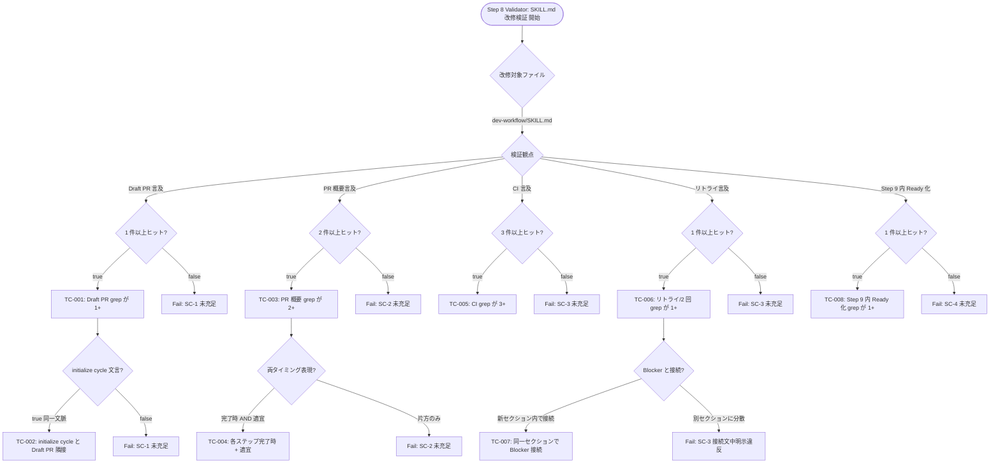
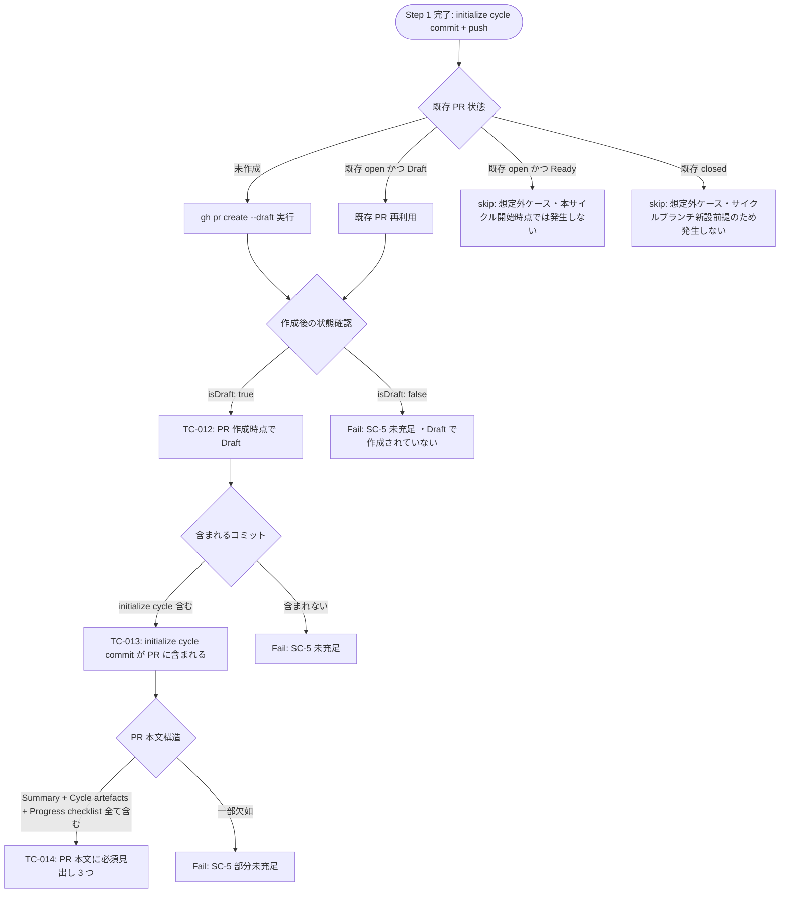
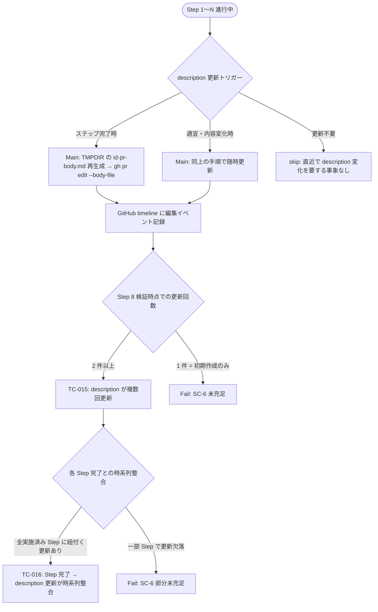
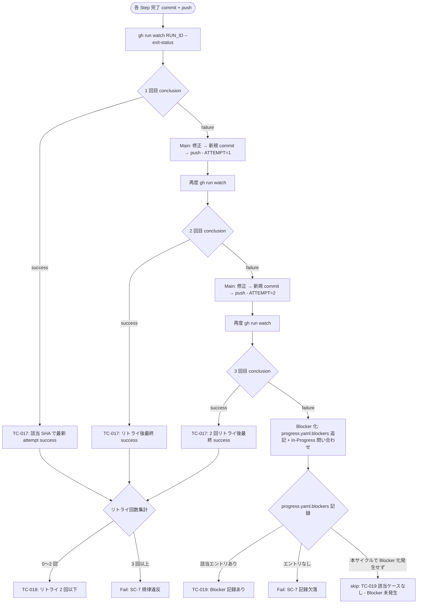
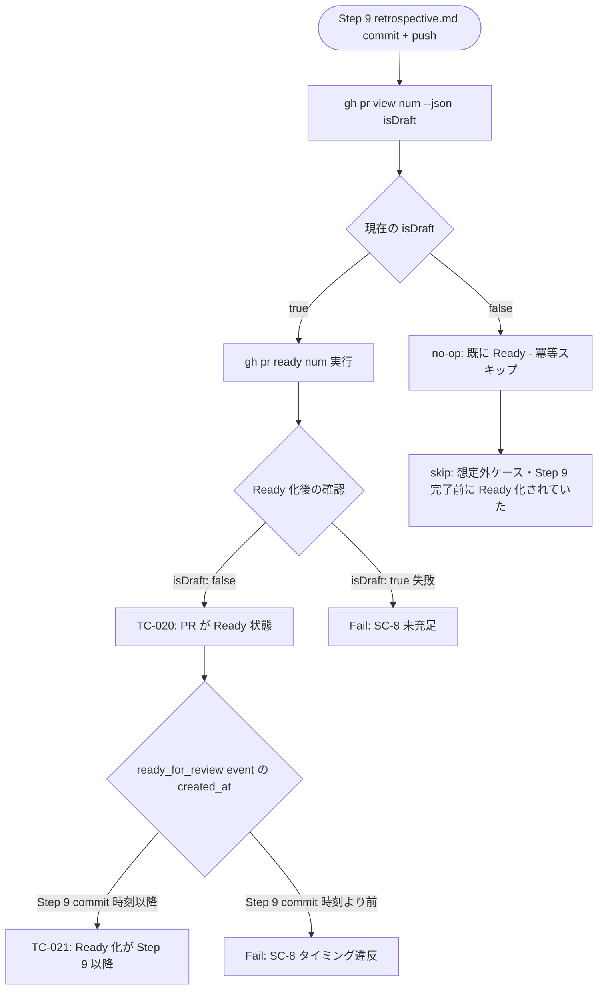
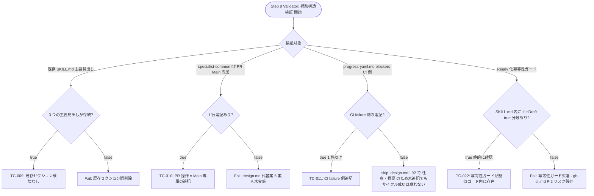
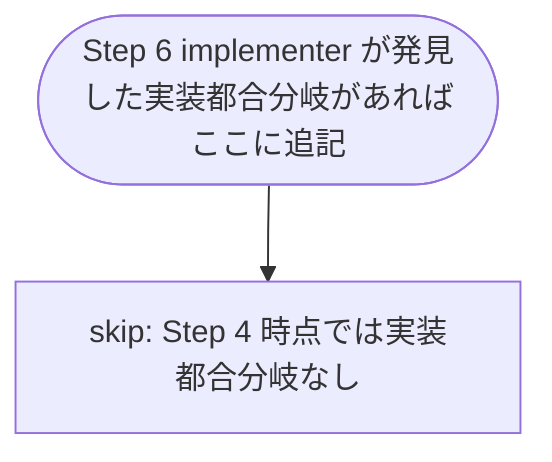

# QA Flow: dev-workflow への Draft PR / PR 概要更新 / バックグラウンド CI 連携の統合

- **Identifier:** 2026-05-03-pr-ci-integration
- **Author:** qa-analyst (Step 4 専任、単一インスタンス)
- **Source:** `docs/workflow/2026-05-03-pr-ci-integration/qa-design.md`
- **Created at:** 2026-05-03
- **Last updated:** 2026-05-03
- **Status:** draft

このドキュメントは `qa-design.md` のテストケースを **Mermaid flowchart で可視化**した網羅性確認用の図集。テストの分岐構造をレビュアーが俯瞰できる形で図示することで、認知負荷を下げる。書き方の詳細は `plugins/dev-workflow/skills/shared-artifacts/references/qa-flow.md` を参照。

## 概要

本サイクルの本質ロジックは「ドキュメント改修の静的検証」と「PR / CI ライフサイクルの動的検証」の 2 系統に大別される。前者は SKILL.md 群の grep ベース、後者は本サイクル PR (#95 想定) の状態遷移ベース。

セクション分割:

1. **SKILL.md 改修の静的検証** — SC-1〜SC-4 を 1 つの flowchart に集約 (改修対象ファイル選択 → 観測点 → TC)
2. **Draft PR 作成フロー** — SC-5 を「既存 PR あり / なし / 既に Ready / 既に Draft」の 4 分岐で検証
3. **PR 概要更新フロー** — SC-6 を「ステップ完了時 / 適宜更新時」の 2 分岐で検証
4. **CI 確認 + リトライフロー** — SC-7 を「PASS / 1 回目 FAIL / 2 回目 FAIL / 3 回目 FAIL = Blocker 化」の境界値分岐で検証
5. **Ready 化フロー** — SC-8 を「`isDraft: true` / `false` (no-op)」の 2 分岐で検証
6. **横断的処理 (補助構造の前提検証)** — `(なし)` 系 TC (TC-009 / TC-010 / TC-011 / TC-022) を集約

実装都合分岐 (TC-IMPL-NNN) セクションは Step 4 では空とする (Step 6 で必要に応じて追加)。

---

## SKILL.md 改修の静的検証

このセクションがカバーする成功基準: SC-1, SC-2, SC-3, SC-4

---

## Draft PR 作成フロー

このセクションがカバーする成功基準: SC-5

---

## PR 概要更新フロー

このセクションがカバーする成功基準: SC-6

---

## CI 確認 + リトライフロー

このセクションがカバーする成功基準: SC-7

---

## Ready 化フロー

このセクションがカバーする成功基準: SC-8

---

## 横断的処理 (補助構造の前提検証)

このセクションがカバーする成功基準: (なし) — 設計上必要な前提条件 / リグレッション防止 / 冪等性ガード

design.md で実施が確定している補助改修と冪等性ガードを観測する。SC に対応しないため独立セクションとして集約する。

---

## 実装都合分岐 (任意)

既存セクションの flowchart に組み込めない `TC-IMPL-NNN` をここに集約する。Step 6 で implementer が発見した分岐のうち、独立性が高く既存図に自然に入らないものを追記する。**Step 4 時点では空。**

