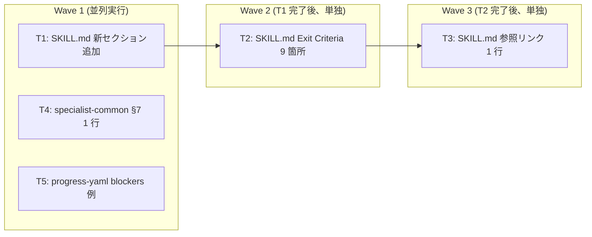

# Task Plan: dev-workflow への Draft PR / PR 概要更新 / バックグラウンド CI 連携の統合

- **Identifier:** 2026-05-03-pr-ci-integration
- **Author:** planner (Step 5 専任、単一インスタンス)
- **Source:** `docs/workflow/2026-05-03-pr-ci-integration/design.md`, `docs/workflow/2026-05-03-pr-ci-integration/intent-spec.md`, `docs/workflow/2026-05-03-pr-ci-integration/qa-design.md`
- **Created at:** 2026-05-03
- **Status:** draft

このドキュメントは **Step 5 で確定する不変な計画書**。Step 6〜7 中のタスク状態追跡は `docs/workflow/2026-05-03-pr-ci-integration/TODO.md` で行う。後発追加タスクは `task-plan.md` 本体を書き換えず TODO.md の「後発追加タスク」セクションにのみ記録する。

## 前提

### Intent Spec / Design からの粒度前提

- 改修対象はすべて **ドキュメント (Markdown スキル)** のみ。コード変更・テスト追加・CI ワークフロー定義変更は本サイクル非スコープ
- 主改修対象 `plugins/dev-workflow/skills/dev-workflow/SKILL.md` (888 行) に新セクション「## サイクル PR と CI 連携プロトコル」を追加 + 各 Step Exit Criteria 末尾に 1 行追記 + 既存「コミット規約」セクションに参照リンク 1 行追加
- 補助改修対象として `plugins/dev-workflow/skills/specialist-common/SKILL.md` (227 行) §7 への 1 行追記、`plugins/dev-workflow/skills/shared-artifacts/references/progress-yaml.md` (142 行) `### blockers` への CI failure 例 1〜2 行追記 (任意・推奨)
- design.md L519-L546 (「Task Decomposition への引き継ぎポイント」) で architect が 5 タスク 2 Wave 案を提示済み。本計画は粒度・依存・並列性を再検証した上で採用方針を確定する

### 採用したタスク構成案 (案 A) と根拠

architect 暫定案 (Wave 1: T1+T2+T4+T5 / Wave 2: T3) は **`dev-workflow/SKILL.md` を T1・T2・T3 が同時編集する** 点でファイル衝突が起きる。implementer は別インスタンスでも同一ファイルへのコンフリクトリスクが残るため、本計画では同一ファイル編集タスクを **直列化** する 3 Wave 構成に再構築した。

3 案を比較した結論 (採用: **案 A**):

| 案 | 構成 | タスク数 | Wave 数 | 採否 | 主な根拠 |
| --- | --- | --- | --- | --- | --- |
| **案 A (採用)** | T1 / T2 / T3 を独立タスクとして直列化、T4 / T5 を T1 と並列実行 | 5 | 3 | **採用** | コミット粒度が明確 (新セクション / Exit Criteria 9 箇所 / 参照リンクを別コミット化)、SC-TC 対応追跡性が高い、Step 7 での部分 revert が容易 |
| 案 B | T1+T2+T3 を 1 タスクに統合 | 3 | 1 | 却下 | 性質の異なる変更が混在しレビュー粒度が荒くなる、SC ごとの寄与追跡が困難、ロールバック単位が大きすぎる |
| 案 C | T1+T3 統合、T2 独立 | 4 | 2 | 却下 | T13 統合と T2 は依然 SKILL.md 衝突、案 A 比でメリットが小さく粒度判断が曖昧 |

採用案 A の Wave 構成:

- **Wave 1 (3 並列)**: T1 (SKILL.md 新セクション追加) / T4 (specialist-common §7 1 行追記) / T5 (progress-yaml.md blockers 1〜2 行追記)
- **Wave 2 (T1 完了後、単独)**: T2 (SKILL.md Exit Criteria 9 箇所追記)
- **Wave 3 (T2 完了後、単独)**: T3 (SKILL.md コミット規約セクション末尾に参照リンク 1 行追加)

### 直列化が必要な理由 (再掲)

T1 / T2 / T3 はいずれも `plugins/dev-workflow/skills/dev-workflow/SKILL.md` を編集する。並列 implementer が同時に編集すると:

- 行番号ベースの Edit が衝突 (T1 は L767 直後への新規セクション追加、T2 は 9 箇所の `**Exit Criteria:**` ブロック末尾編集、T3 は L763 付近の参照リンク追加)
- Git stage 段階でコンフリクト発生
- 後続タスクが「直前タスクの編集後の行番号」を必要とする (T2 の Step 6 微修正 = T1 の文言と整合させる、T3 は T1 セクション名と完全一致が要件)

このため Wave を分け、各 Wave 完了後の最新 SKILL.md を入力にして次タスクを実行する。**T4 / T5 は別ファイル編集のため T1 と完全並列可**。

### コミット粒度の指針 (本計画全体共通)

- **1 タスク = 1 コミット** を原則とする (本サイクルの粒度確定方針)
- コミットメッセージ規約 (Conventional Commits + サイクル識別子):
  - T1: `feat(dev-workflow/2026-05-03-pr-ci-integration): add cycle PR-CI protocol section to dev-workflow SKILL`
  - T2: `feat(dev-workflow/2026-05-03-pr-ci-integration): add CI PASS exit criteria to all 9 steps`
  - T3: `docs(dev-workflow/2026-05-03-pr-ci-integration): cross-link commit convention to PR-CI protocol`
  - T4: `feat(dev-workflow/2026-05-03-pr-ci-integration): clarify PR ops are Main-only in specialist-common`
  - T5: `docs(dev-workflow/2026-05-03-pr-ci-integration): add CI failure blocker example to progress-yaml reference`
- 各コミット後に **新ルール (Draft PR + PR 概要更新 + バックグラウンド CI watch + 2 回リトライ) をドッグフード適用** する (本サイクル自身は SKILL.md 反映前から Main が同じ運用を実践している)
- **Test 追加なし** (改修対象がドキュメントのみ、Step 4 qa-design.md は既存の grep / gh CLI ベース検証で完結)

## タスク一覧

### T1: dev-workflow/SKILL.md に新セクション「## サイクル PR と CI 連携プロトコル」を追加

- **概要:** design.md「コンポーネント構成 § A」「主要な型・インターフェース § PR description テンプレート + § シェル擬似コード」「データフロー」セクションの内容を、`dev-workflow/SKILL.md` の既存「ステップ完了時のコミット規約」セクション末尾 (L767 直後) に新規セクションとして追加する。約 110 行。Draft PR 作成 / PR 概要更新 / バックグラウンド CI watch / 2 回リトライ → Blocker 化 / Step 9 完了後 Ready 化 の 5 ルールすべてを 1 セクションに集約する。
- **成果物:**
  - 変更ファイル: `plugins/dev-workflow/skills/dev-workflow/SKILL.md` (1 ファイル)
  - 新規追加: 約 110 行の新セクション (見出し含む)
  - 新セクションには以下を含める:
    - サイクル PR の位置づけ (Single-Source-of-Progress 原則との関係)
    - Draft PR 初期化シェル擬似コード (冪等性ガード付き、design.md L168-L185)
    - PR 概要更新シェル擬似コード (`gh pr edit --body-file`、design.md L188-L193)
    - PR description テンプレート (Summary / Cycle artefacts / Progress checklist / CI status / Test plan / Notable incidents、design.md L104-L153)
    - バックグラウンド CI watch シェル擬似コード (`gh run watch --exit-status --interval 10 --compact`、design.md L196-L226)
    - CI 失敗時のリトライフロー (新規コミット push 方式、最大 2 回、3 回目で Blocker 化、design.md L228-L249)
    - Step 9 完了後 Ready 化シェル擬似コード (冪等性ガード付き、design.md L251-L267)
    - PR / CI 操作は Main 専属の宣言 (代替案 5 案 A、design.md L412-L417)
    - PR description はリポジトリに永続化しない宣言 (代替案 4 案 A、design.md L405-L409)
    - CI ワークフロー定義は本ワークフロー外との住み分け (代替案 6 案 A、design.md L420-L424)
- **依存タスク:** なし (Wave 1 起点)
- **並列可否:** yes (T4, T5 と別ファイル編集のため完全並列可)
- **見積り規模:** **M** (約 1〜2 時間 — 110 行のセクション追加 + 既存擬似コードのコピーペースト + 文体・用語統一)
- **カバーするテストケース ID:**
  - 直接寄与: TC-001 (Draft PR 言及), TC-002 (initialize cycle 文言), TC-003 (PR 概要言及 2 件以上), TC-004 (両タイミング表現), TC-005 (CI 言及 3 件以上), TC-006 (リトライ言及), TC-007 (Blocker 接続), TC-022 (冪等性ガード)
  - 補助寄与: TC-008 (Step 9 内 Ready 化 — 新セクション内のフロー詳述で件数加算), TC-014 (PR 本文構造)
- **設計ドキュメント参照箇所:**
  - design.md「アプローチの概要」(L38-L48)
  - design.md「コンポーネント構成」§ A (L88-L96)
  - design.md「主要な型・インターフェース」(L98-L267) 全体
  - design.md「データフロー / API 設計」(L271-L373) 全体
  - design.md「代替案 1 案 A 採用」(L380-L385)
  - design.md「Task Decomposition への引き継ぎポイント — 各タスクの実装で留意すべき点 § T1」(L542)
- **Step 6 implementer 入力契約:**
  - 必読: design.md (全体)、intent-spec.md (制約と非スコープ)、Research Notes (`gh-cli.md`, `ci-structure.md`, `integration-points.md`, `past-cycles.md` 全件)
  - 改修対象行範囲: 既存 SKILL.md L767 直後 (「## ステップ完了時のコミット規約」セクションの末尾の後)。`L767` は本計画作成時点の行番号であり、Step 6 開始時に再確認すること
  - シェルブロック内のプレースホルダ (`<identifier>` / `<branch>` / `<num>` / `<path>` 等) はサンプル形式のまま残し、実行時に Main が置換する形で記述すること (design.md L542)
  - Skill ローダ互換性: frontmatter は変更せず、見出しは既存階層 (`## ` レベル) に揃える
- **動作確認手順 (implementer がコミット前に実施):**
  - `ggrep -cE "(Draft PR|draft pull request|Draft Pull Request)" plugins/dev-workflow/skills/dev-workflow/SKILL.md` が `1` 以上 (TC-001 仮検証 = SC-1 半分)
  - `ggrep -cE "(PR (概要|description|overview)|プルリクエスト概要|pull request description)" plugins/dev-workflow/skills/dev-workflow/SKILL.md` が `2` 以上 (TC-003 仮検証 = SC-2 半分)
  - `ggrep -cE "(CI|continuous integration|gh run)" plugins/dev-workflow/skills/dev-workflow/SKILL.md` が `3` 以上 (TC-005 仮検証 = SC-3 半分)
  - `ggrep -cE "(2 回|二回|retry|リトライ)" plugins/dev-workflow/skills/dev-workflow/SKILL.md` が `1` 以上 (TC-006 仮検証)
  - `ggrep -cE "^## サイクル PR と CI 連携プロトコル" plugins/dev-workflow/skills/dev-workflow/SKILL.md` が `1` (新セクション見出しが正確に存在)
  - `ggrep -cE "^## (サイクル全体の流れ|各ステップの責務|ステップ完了時のコミット規約)" plugins/dev-workflow/skills/dev-workflow/SKILL.md` が変更前後で同件数 (TC-009 既存セクション破壊なし)
  - `vp check` (oxfmt + lint + typecheck) が PASS

### T2: dev-workflow/SKILL.md の各 Step Exit Criteria に CI PASS 条件を追記

- **概要:** `dev-workflow/SKILL.md` の Step 1〜Step 9 各 Exit Criteria セクション末尾に「該当ステップ完了コミットに紐付く CI が PASS している」相当の 1 行を追記する。Step 6 のみ「全タスク単位コミットそれぞれの CI が PASS している」と微修正する。計 9 箇所。
- **成果物:**
  - 変更ファイル: `plugins/dev-workflow/skills/dev-workflow/SKILL.md` (1 ファイル)
  - 編集対象行 (本計画作成時点の行番号、Step 6 開始時に T1 の追加内容反映後の行番号で再確認):
    - L158 Step 1 Exit Criteria
    - L187 Step 2 Exit Criteria
    - L221 Step 3 Exit Criteria
    - L265 Step 4 Exit Criteria
    - L305 Step 5 Exit Criteria
    - L369 Step 6 Exit Criteria (微修正: 「タスク単位コミット = 全タスク CI PASS」表現)
    - L424 Step 7 Exit Criteria
    - L512 Step 8 Exit Criteria
    - L547 Step 9 Exit Criteria
  - 各箇所に追加する文言例 (Step 6 以外):
    - `- 該当ステップ完了コミットに紐付く CI (`check` job) の最終 conclusion が `success` である (詳細は「## サイクル PR と CI 連携プロトコル」を参照)`
  - Step 6 用の文言例:
    - `- 各タスク完了コミットに紐付く CI (`check` job) の最終 conclusion がすべて `success` である (詳細は「## サイクル PR と CI 連携プロトコル」を参照)`
- **依存タスク:** T1 (新セクション「## サイクル PR と CI 連携プロトコル」が SKILL.md に存在することが Exit Criteria の参照リンクとして必要、かつ同一ファイル編集のためコンフリクト回避)
- **並列可否:** no (T1 完了後の Wave 2 単独タスク。T3 とも直列)
- **見積り規模:** **S** (約 30 分 — 9 箇所への機械的な 1 行追記、Step 6 のみ微修正)
- **カバーするテストケース ID:**
  - 直接寄与: TC-005 (CI 言及件数 9 増加 → SC-3 充足を強化), TC-008 (Step 9 Exit Criteria 内に Ready 化文言 — T1 との合算)
- **設計ドキュメント参照箇所:**
  - design.md「アプローチの概要」(L46) — Exit Criteria への CI PASS 統合
  - design.md「Task Decomposition への引き継ぎポイント — 各タスクの実装で留意すべき点 § T2」(L543)
  - 元 Research: `integration-points.md` I2 表 (planner 直接アクセス不可だが design.md L46 で I2 案 A 推奨が明示)
- **Step 6 implementer 入力契約:**
  - 必読: design.md (アプローチの概要)、Research Note `integration-points.md` の I2 表 (該当行は Researcher 成果物にあり)
  - 改修対象行範囲: 9 箇所の Exit Criteria。各箇所は `**Exit Criteria:**` で始まる箇条書きブロックの末尾
  - 文言は SKILL.md 内で統一すること (Step 6 のみ「タスク単位コミット = 全タスク CI PASS」に微修正、それ以外の 8 箇所は同一文言)
  - 参照リンク表現は T1 で追加した新セクション名 `## サイクル PR と CI 連携プロトコル` と完全一致させること
- **動作確認手順 (implementer がコミット前に実施):**
  - `ggrep -cE "CI .* (PASS|success|`check` job)" plugins/dev-workflow/skills/dev-workflow/SKILL.md` が変更前 + 9 件以上
  - `awk '/^### Step ([1-9])/,/^### /' plugins/dev-workflow/skills/dev-workflow/SKILL.md` で各 Step ブロックを抽出 → 各ブロック内に CI PASS 文言が 1 件存在することを確認
  - Step 9 ブロック内に Ready 化言及 (T1 で追加されている想定) が引き続き存在 (TC-008 維持)
  - `vp check` PASS

### T3: dev-workflow/SKILL.md コミット規約セクション末尾に PR-CI プロトコルへの参照リンクを追加

- **概要:** `dev-workflow/SKILL.md` の既存「## ステップ完了時のコミット規約」セクション末尾 (本計画作成時点の L767 直後 = T1 で追加された新セクション開始の直前) に、「PR 概要更新および CI 確認の運用は『## サイクル PR と CI 連携プロトコル』を参照」相当の 1 行参照リンクを追加する。
- **成果物:**
  - 変更ファイル: `plugins/dev-workflow/skills/dev-workflow/SKILL.md` (1 ファイル)
  - 追加行例 (1 行のみ):
    - `> 各ステップ完了コミット後に必須となる **PR 概要更新** および **CI 確認 (PASS まで完了と認めない)** の運用は、後続セクション「## サイクル PR と CI 連携プロトコル」を参照すること。`
- **依存タスク:** T1 (新セクションが存在すること) + T2 (Exit Criteria の文言と整合 — 同一ファイル編集の直列化要件)
- **並列可否:** no (Wave 3 単独タスク)
- **見積り規模:** **S** (約 5〜10 分 — 1 行追記)
- **カバーするテストケース ID:**
  - 補助寄与: TC-003 (PR 概要言及件数 +1)、TC-005 (CI 言及件数 +1)
- **設計ドキュメント参照箇所:**
  - design.md「アプローチの概要」(L43) — 「既存規約の非破壊」「コミット内容自体は変わらず、コミット後のアクション (PR 概要更新 / CI 確認) として住み分け」
  - design.md「Task Decomposition への引き継ぎポイント — 各タスクの実装で留意すべき点 § T3」(L544)
- **Step 6 implementer 入力契約:**
  - 必読: design.md (アプローチの概要)、T1 / T2 完了時点の SKILL.md 最新版
  - 改修対象行: 既存「## ステップ完了時のコミット規約」セクションの末尾 (T1 / T2 完了後の最新行番号で再確認)
  - 参照リンクのセクション名は T1 で追加した名称 `## サイクル PR と CI 連携プロトコル` と完全一致させること (リンク切れ防止)
- **動作確認手順 (implementer がコミット前に実施):**
  - `ggrep -cE "サイクル PR と CI 連携プロトコル" plugins/dev-workflow/skills/dev-workflow/SKILL.md` が T1 / T2 完了時点 +1 件
  - `awk '/^## ステップ完了時のコミット規約/,/^## /' plugins/dev-workflow/skills/dev-workflow/SKILL.md` で当該セクションを抽出 → 末尾に参照リンクが含まれることを確認
  - `vp check` PASS

### T4: specialist-common/SKILL.md §7 に PR 操作 = Main 専属の 1 行を追記

- **概要:** `plugins/dev-workflow/skills/specialist-common/SKILL.md` §7「Git コミットに関する注意」(L177-L194) のリスト末尾 (L184 直後) に、「PR 操作 (`gh pr create` / `gh pr edit` / `gh pr ready` / `gh run rerun`) は Main が単独で実行する。Specialist は read 系 (`gh pr view --json` / `gh run list --json`) のみ使用してよい」相当の 1 行を追記する。
- **成果物:**
  - 変更ファイル: `plugins/dev-workflow/skills/specialist-common/SKILL.md` (1 ファイル)
  - 追加行例 (1 行):
    - `- **PR 操作は Main 専属**: \`gh pr create\` / \`gh pr edit\` / \`gh pr ready\` / \`gh run rerun\` 等の write 系 \`gh\` コマンドは Main が単独で実行する。Specialist は \`gh pr view --json\` / \`gh pr list --json\` / \`gh run list --json\` 等の read 系のみ使用してよい (詳細は \`dev-workflow\` SKILL の「## サイクル PR と CI 連携プロトコル」参照)`
- **依存タスク:** なし (Wave 1 並列可)
- **並列可否:** yes (T1, T5 と別ファイル編集のため完全並列可)
- **見積り規模:** **S** (約 10 分 — 1 行追記)
- **カバーするテストケース ID:**
  - 直接寄与: TC-010 (specialist-common §7 への PR Main 専属 1 行追記)
- **設計ドキュメント参照箇所:**
  - design.md「コンポーネント構成」§ B (L91)
  - design.md「代替案 5 案 A 採用」(L412-L417)
  - design.md「gh CLI コマンド一覧」(L360-L372) — 「Main 専属」と read 系の区分
  - design.md「Task Decomposition への引き継ぎポイント — 各タスクの実装で留意すべき点 § T4」(L545)
- **Step 6 implementer 入力契約:**
  - 必読: design.md (代替案 5 採用案 + gh CLI コマンド一覧)、Research Note `integration-points.md` I4 採用案 (該当行は Researcher 成果物にあり、design.md L44 で B+C 併用方針として要約済)
  - 改修対象行: `specialist-common/SKILL.md` §7「Git コミットに関する注意」(L177-L194) のリスト末尾 (L184 の `- **コミット前チェック**` 行の直後)
  - **追記は 1 行に厳密に絞る** (Intent Spec L34「specialist-* スキルへの大規模変更は行わない」と整合)
  - 既存 §7 の冒頭文・Git ガードレール小見出し・他のリスト項目は変更しない
- **動作確認手順 (implementer がコミット前に実施):**
  - `ggrep -cE "(PR 操作.*Main|gh pr (create|edit|ready).*Main)" plugins/dev-workflow/skills/specialist-common/SKILL.md` が `1` 以上 (TC-010 仮検証)
  - `awk '/^## 7\. Git コミットに関する注意/,/^## 8\./' plugins/dev-workflow/skills/specialist-common/SKILL.md` で §7 を抽出 → 末尾リスト末項目として追加されていることを確認
  - 既存 §7 のリスト項目数が変更前 +1 件 (削除・改変なし)
  - `vp check` PASS

### T5: progress-yaml.md `### blockers` セクションに CI failure 記録例を追記

- **概要:** `plugins/dev-workflow/skills/shared-artifacts/references/progress-yaml.md` の `### blockers` セクション (L57-L60) 末尾に、CI 失敗を `blockers[]` の自由テキスト形式で記録する例を 1〜2 行追記する。schema 拡張はしない (代替案 7 案 A 採用)。
- **成果物:**
  - 変更ファイル: `plugins/dev-workflow/skills/shared-artifacts/references/progress-yaml.md` (1 ファイル)
  - 追加内容 (design.md L436-L443 に提示済の例文を採用):

    ```markdown
    CI 失敗を Blocker 化した場合の例 (本リポでは 2 回リトライ後の失敗継続時):

    ```yaml
    blockers:
      - 'Step 3 完了コミット <abbrev-sha> の CI が 3 回連続失敗 (oxfmt Formatting)。Step 3 を完了と認められない。対応方針: ユーザー判断仰ぎ中 (run URL: https://github.com/<owner>/<repo>/actions/runs/<id>)'
    ```
    ```
- **依存タスク:** なし (Wave 1 並列可)
- **並列可否:** yes (T1, T4 と別ファイル編集のため完全並列可)
- **見積り規模:** **S** (約 10 分 — 例文追記、design.md にコピー元あり)
- **カバーするテストケース ID:**
  - 直接寄与: TC-011 (progress-yaml.md blockers に CI failure 例追記)
- **設計ドキュメント参照箇所:**
  - design.md「コンポーネント構成」§ C (L92)
  - design.md「代替案 7 案 A 採用」(L430-L443) — 採用文例の出典
  - design.md「Task Decomposition への引き継ぎポイント — 各タスクの実装で留意すべき点 § T5」(L546)
- **Step 6 implementer 入力契約:**
  - 必読: design.md (代替案 7 採用案 + 採用文例 L436-L443)、Research Note `past-cycles.md` I-6 (本リポ過去 5 サイクルの blockers が空き枠であった事実)
  - 改修対象行: `progress-yaml.md` の `### blockers` セクション (L57-L60) 末尾。L60 の直後に追記
  - **schema 拡張は行わない** (`kind: ci_failure` などの新フィールド追加禁止、代替案 7 案 B 却下)
  - 追記は 1〜2 行に厳密に絞る (Intent Spec L30「整合性を崩さない最小限の追記は許容」と整合)
- **動作確認手順 (implementer がコミット前に実施):**
  - `awk '/^### blockers/,/^### /' plugins/dev-workflow/skills/shared-artifacts/references/progress-yaml.md` で `### blockers` セクションを抽出 → `ggrep -cE "(CI .*失敗|CI failure|oxfmt)"` が `1` 以上 (TC-011 仮検証)
  - 既存 `### blockers` セクションの本文 (L57-L60) は変更されていない
  - `vp check` PASS

## 依存グラフ



依存関係の解説:

- **T1 → T2**: 同一ファイル `dev-workflow/SKILL.md` 編集のため直列化必須。かつ T2 の文言が T1 で追加した新セクション名と整合する必要がある
- **T2 → T3**: 同一ファイル編集のため直列化必須。T3 は T1 / T2 完了後の最新 SKILL.md を入力にして参照リンクを追加する
- **T1 と T4 / T5 は完全独立**: 別ファイル編集 (T4 = specialist-common, T5 = progress-yaml) のため並列実行可
- **T4 と T5 は相互独立**: 別ファイル編集のため並列実行可

## 並列実行可能グループ

Step 6 で Main が並列起動単位として参照する Wave 構成。

- **Wave 1 (3 並列起動)**: T1 + T4 + T5
  - 各タスクは別ファイルを編集するため衝突なし
  - Wave 1 完了 = 3 タスクすべての implementer がコミット完了 + CI PASS (新ルールに従う)
  - **新ルール適用**: 各タスクコミット後に Main は (a) PR 概要更新、(b) バックグラウンド `gh run watch` で CI PASS 確認、(c) CI 失敗時は最大 2 回リトライ
- **Wave 2 (1 タスク、単独実行)**: T2
  - T1 完了後の最新 SKILL.md を入力に Exit Criteria 9 箇所を編集
  - 同一ファイル編集のため T1 と直列、T3 ともこの後に直列
- **Wave 3 (1 タスク、単独実行)**: T3
  - T1 / T2 完了後の最新 SKILL.md を入力に参照リンクを追加
  - サイクル全体の最終実装タスク

### Wave 跨ぎでの Main 操作 (新ルールのドッグフード)

各 Wave 完了時、Main は以下を実行する (本サイクル自身がドッグフード対象):

1. **PR 概要更新**: `$TMPDIR/dev-workflow/2026-05-03-pr-ci-integration-pr-body.md` を再生成 → `gh pr edit <pr-num> --body-file <path>`
2. **CI 確認**: 各タスクコミットに紐付く `gh run watch <run-id> --exit-status --interval 10 --compact` をバックグラウンド実行して PASS 確認
3. **CI 失敗時**: 最大 2 回リトライ (新規修正コミット push)。3 回目失敗で Blocker 化し In-Progress 問い合わせ (本サイクル中の Step 6 で初の実証)
4. **Wave 2 / Wave 3 起動条件**: 直前 Wave の全タスク CI PASS 確認後にのみ次 Wave の implementer を起動

### 想定される Step 6 全体所要時間

design.md L491-L496 のパフォーマンス予測 + 本計画の Wave 構成に基づく見積り:

- **Wave 1**: 3 並列で M (T1) サイズが律速 → 約 1〜2 時間 + CI 待機 (3 commit × 約 2 分 = 6 分、リトライ想定で +2〜4 分)
- **Wave 2**: T2 サイズ S → 約 30 分 + CI 待機約 2 分
- **Wave 3**: T3 サイズ S → 約 5〜10 分 + CI 待機約 2 分
- **合計**: 約 2〜3 時間 + CI 待機・リトライ累計約 12〜16 分 = **Step 6 全体で約 2.5〜3.5 時間**

## リスク / 想定される Blocker

本計画実行中に発生しうる障害と対応方針を予測列挙する (Step 6 implementer は遭遇時に Main へ Blocker 報告)。

- **R1 (高): 行番号ずれによる Edit 衝突** — T1 で SKILL.md に約 110 行追加された後、T2 の編集対象行番号 (本計画作成時点の L158 / L187 / ... / L547) が無効化される。**対応**: T2 implementer は編集前に `ggrep -nE '^\*\*Exit Criteria:\*\*$' plugins/dev-workflow/skills/dev-workflow/SKILL.md` で最新行番号を再取得してから Edit を実行する。同様に T3 implementer は L767 ではなく `ggrep -n '^## ステップ完了時のコミット規約' SKILL.md` で動的に位置特定する
- **R2 (中): Skill ローダ互換性違反** — 新セクション追加に伴い frontmatter / 見出し階層がローダ仕様を超える可能性。**対応**: Step 6 implementer は frontmatter を変更せず、既存階層 (`## ` レベル) と整合する見出しのみ追加する。Step 7 holistic 観点 reviewer がローダ互換性を最終確認
- **R3 (中): T1 シェルコード例の用語不統一** — T1 のシェル擬似コードで `<identifier>` / `<branch>` / `<num>` / `<id>` などプレースホルダ表記が design.md と異なる可能性。**対応**: implementer は design.md L168-L267 のプレースホルダ表記に厳密に従う (置換しない、実行時 Main が置換)。
- **R4 (中): T2 Step 6 微修正の文言ばらつき** — 「タスク単位コミット = 全タスク CI PASS」の表現が他 8 箇所の Step Exit Criteria と異質になり、grep 検索結果の整合性が崩れる。**対応**: implementer は Step 6 のみ「各タスク完了コミットに紐付く CI ... がすべて success」と表現し、他 8 箇所は「該当ステップ完了コミットに紐付く CI ... が success」と統一する (詳細は T2 タスク欄の文言例)
- **R5 (低): T5 schema 拡張の誤解** — implementer が「CI failure 例追記」を「`blockers[]` schema 拡張」と勘違いし、不要なフィールド (`kind` / `attempts` / `last_run_url`) を追加する。**対応**: T5 タスク欄に「schema 拡張は行わない (代替案 7 案 B 却下)」を明示済。Step 7 reviewer (api-design 観点) が確認
- **R6 (低): ドッグフード PR 概要更新漏れ** — Main が Wave 1 / Wave 2 / Wave 3 完了後に PR 概要更新を忘れる → SC-6 (description 複数回更新トレース) が満たせない。**対応**: 本計画自体が新ルールのドッグフードであり、Main は各 Wave 完了時に必ず PR 概要更新と CI 確認を実行する規律を徹底する。Step 8 Validator が `gh api .../timeline` で更新トレース不足を検出
- **R7 (低): CI 連続失敗による Blocker 化** — Step 6 中の 3 タスクのいずれかで oxfmt Formatting や typecheck エラーが 3 回連続発生 → Blocker 化。**対応**: 設計通りの動作 (Intent Spec の SC-7 / SC-3 が許容するケース)。Main は In-Progress 問い合わせをユーザーに送信し、判断を待つ
- **R8 (低): T3 リンク切れ** — T3 の参照リンクが T1 で追加したセクション名と微妙に異なる (例: 「サイクル PR-CI プロトコル」vs「サイクル PR と CI 連携プロトコル」)。**対応**: T3 implementer は T1 完了後の SKILL.md を `ggrep '^## サイクル PR と CI 連携プロトコル'` で正確な見出しを再取得してから参照リンクを記述

## task-plan の不変性に関する注意

- 本ドキュメントは **Step 5 で確定した不変な計画書**。Step 6〜7 中の差し替えは禁止
- 後発追加タスクが発生した場合は `docs/workflow/2026-05-03-pr-ci-integration/TODO.md` の「後発追加タスク」セクションにのみ追記し、本 task-plan.md は変更しない
- 後発追加が 3 件以上発生する場合、または既存 5 タスクの粒度に問題が判明した場合は Step 5 へのロールバックを Main に検討依頼
