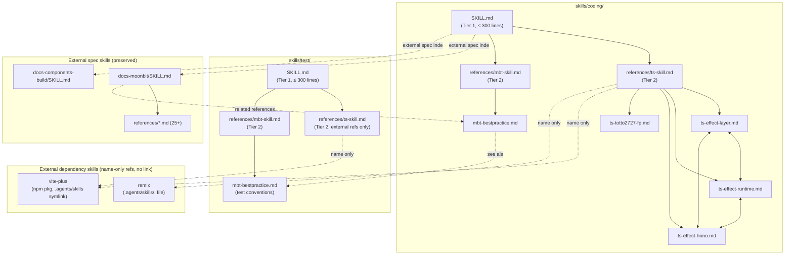
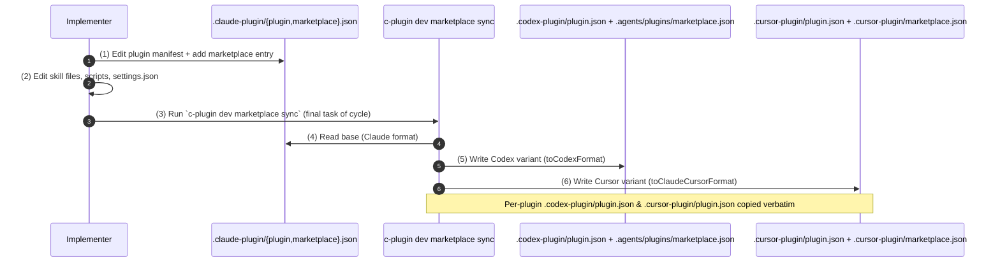
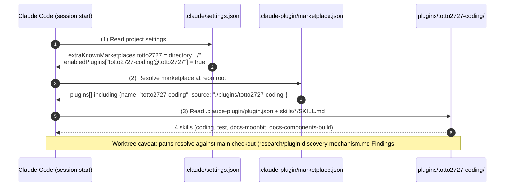

# Design Document: Consolidate coding/test/docs skills into `totto2727-coding` plugin

- **Identifier:** 2026-05-04-totto2727-coding-plugin
- **Author:** architect (dev-workflow Step 3, single instance)
- **Created at:** 2026-05-04
- **Last updated:** 2026-05-04
- **Status:** draft

## Design goals and constraints

The intent of this cycle (quoted directly from `intent-spec.md`):

- **Purpose (from Intent Spec, `intent-spec.md:38-40`):**

  > totto2727 固有のコーディング規約 (言語非依存方針 + 言語別ベストプラクティス) とテスト規約、および totto2727 が日常的に参照する外部仕様リファレンス (MoonBit 言語仕様 / components-build 仕様) を、単一の `plugins/totto2727-coding` プラグイン配下に集約・再構成し、Skill 探索の単一エントリポイント (`coding/SKILL.md` および `test/SKILL.md`) を確立する。

- **Success criteria (summary, full list at `intent-spec.md:174-227`):** ten observable acceptance checks ranging from "old paths gone" (SC-1) and "new paths present" (SC-2) through "300-line hard cap on `coding/SKILL.md` and `test/SKILL.md`" (SC-3), "3-tier relative-link integrity" (SC-4), "three marketplace.json variants consistent" (SC-5), "no hardcoded references to old skill names" (SC-6), "`deno check` passes on both Deno scripts" (SC-7), "three plugin manifest variants identical" (SC-8), "`.claude/settings.json.enabledPlugins` updated" (SC-9), and "`vp check` exit 0" (SC-10).

- **Key constraints (`intent-spec.md:228-247`):**
  - `plugin.json` follows the Claude Agent SDK spec; `plugins/dev-workflow/.claude-plugin/plugin.json:1-11` is the canonical template.
  - `generate-docs-moonbit.ts` and `generate-docs-components-build.ts` must keep running on Deno.
  - `docs-moonbit/references/*.md` must keep their MoonBit-official license header verbatim.
  - `coding/SKILL.md` / `test/SKILL.md` are capped at 300 lines (hard cap, user-mandated).
  - "Coding conventions (hand-written)" and "external spec references (auto-generated)" must stay separate skills, never mixed.
  - Skill **structure** is preserved (SKILL.md + references/), but skill **names** are renamed to the `docs-*` convention (`docs-moonbit`, `docs-components-build`) per user instruction during Step 3 review. The structure-preservation constraint applies to the internal layout, not the name.
  - **Out of scope:** dotfiles repo updates, large-scale rewrites of conventions, new languages, big new write-ups, TS test conventions, project/user CLAUDE.md updates (`intent-spec.md:158-172`).

## Approach overview

We adopt the **same plugin layout pattern that `plugins/dev-workflow/` already uses** (validated by `research/plugin-discovery-mechanism.md` Findings #1-#5: Claude Code reads this repo's `.claude-plugin/marketplace.json` directly via `extraKnownMarketplaces`, with no dotfiles round-trip, and resolves directory-source plugins in place without copying to `~/.claude/plugins/cache/`). The new `plugins/totto2727-coding/` will hold **four sibling skills** under `skills/`:

1. **`coding/`** — entry point for hand-written conventions, with a 3-tier structure (`SKILL.md` → `references/<lang>-skill.md` → `references/<lang>-*.md`).
2. **`test/`** — entry point for hand-written test conventions, same 3-tier shape (MoonBit only this cycle).
3. **`docs-moonbit/`** (renamed from `moonbit-docs/`) — auto-generated MoonBit language reference, structurally preserved from `plugins/moonbit/skills/moonbit-docs/`.
4. **`docs-components-build/`** (renamed from `components-build-docs/`) — auto-generated Vercel components.build spec, structurally preserved from `plugins/components-build/skills/components-build-docs/`.

The split mirrors the two distinct skill _natures_ identified in `intent-spec.md:30-36`: hand-written conventions (`coding/`, `test/`) vs. auto-generated external spec references (`docs-moonbit/`, `docs-components-build/`). The naming convention reinforces this split: top-level skills (`coding`, `test`) carry no prefix, while external-doc clone skills use the `docs-` prefix per user instruction. Keeping them as four sibling skills (not nested) preserves the "responsibility separation" constraint and lets each retain its own activation `description:`, while a single new `coding/SKILL.md` table-of-contents acts as the human-facing single entry point that points "down" into both natures (the hand-written `references/` and the cross-skill `../docs-moonbit/SKILL.md` / `../docs-components-build/SKILL.md`).

The **edit base is `.claude-plugin/plugin.json` and `.claude-plugin/marketplace.json` only**; both `.codex-plugin/` and `.cursor-plugin/` derivatives are produced by running `c-plugin dev marketplace sync` once at the end of the cycle (transformation logic verified at `js/app/c-plugin/src/service/marketplace-sync.ts:62-79`). This eliminates the previous triple-maintenance burden seen in `plugins/dev-workflow/.{claude,codex,cursor}-plugin/plugin.json` (today they happen to be identical because they were generated by the same sync run on `5e92483`).

## Component breakdown

### 1. Plugin root (`plugins/totto2727-coding/`)

| Component                                        | Role                                                                                                                                                                                                                                                                | Edit policy                                  |
| ------------------------------------------------ | ------------------------------------------------------------------------------------------------------------------------------------------------------------------------------------------------------------------------------------------------------------------- | -------------------------------------------- |
| `.claude-plugin/plugin.json`                     | Plugin manifest (Claude format). Single source of truth for `name` / `description` / `version` / `author`. New file (created in Step 6).                                                                                                                            | Hand-edited (base)                           |
| `.codex-plugin/plugin.json`                      | Codex-flavored manifest. Identical content to the Claude one (sync produces verbatim copy; see `marketplace-sync.ts:93-114` `syncPluginJson`).                                                                                                                      | Generated by `c-plugin dev marketplace sync` |
| `.cursor-plugin/plugin.json`                     | Cursor-flavored manifest. Identical content to the Claude one (same sync path).                                                                                                                                                                                     | Generated by `c-plugin dev marketplace sync` |
| `.script/generate-docs-moonbit.ts`               | Deno script that fetches MoonBit official docs and writes `skills/docs-moonbit/`. Migrated and renamed from `plugins/moonbit/.script/process-moonbit-docs.ts`; output dir + frontmatter `name:` template + Related-Skills template string + null guard all updated. | Hand-edited                                  |
| `.script/generate-docs-components-build.ts`      | Deno script that fetches `components.build` spec and writes `skills/docs-components-build/SKILL.md`. Migrated and renamed from `plugins/components-build/.script/generate-skill.ts`; comment + null guard updated.                                                  | Hand-edited                                  |
| `.claude/skills/update-docs-moonbit.md`          | Slash command that wraps `deno run .script/generate-docs-moonbit.ts`. Migrated and renamed from `plugins/moonbit/.claude/skills/update-moonbit-docs.md`; internal `deno run` path updated to the new script name.                                                   | Hand-edited                                  |
| `.claude/skills/update-docs-components-build.md` | Slash command that wraps `deno run .script/generate-docs-components-build.ts`. Migrated; the embedded script name updated.                                                                                                                                          | Hand-edited                                  |
| `skills/coding/`                                 | New 3-tier hand-written skill for coding conventions. See **§2** below.                                                                                                                                                                                             | Hand-edited                                  |
| `skills/test/`                                   | New 3-tier hand-written skill for test conventions. See **§3** below.                                                                                                                                                                                               | Hand-edited                                  |
| `skills/docs-moonbit/`                           | Auto-generated MoonBit language reference (structure preserved from `plugins/moonbit/skills/moonbit-docs/`). Frontmatter `name:` updated to `docs-moonbit` (script template string + migrated SKILL.md).                                                            | Generated by Deno script                     |
| `skills/docs-components-build/`                  | Auto-generated `components.build` spec (structure preserved from `plugins/components-build/skills/components-build-docs/`). Frontmatter `name:` updated to `docs-components-build`.                                                                                 | Generated by Deno script                     |

### 2. `skills/coding/` (3-tier)

```
skills/coding/
├── SKILL.md                                # Tier 1: ≤ 300 lines, hard cap
└── references/
    ├── ts-skill.md                         # Tier 2: TS index (incl. external skill refs: vite-plus, remix)
    ├── ts-effect-layer.md                  # Tier 3: detail (migrated from .agents/skills/effect-layer/)
    ├── ts-effect-runtime.md                # Tier 3: detail (migrated from .agents/skills/effect-runtime/)
    ├── ts-effect-hono.md                   # Tier 3: detail (migrated from .agents/skills/effect-hono/)
    ├── ts-totto2727-fp.md                  # Tier 3: detail (migrated from .agents/skills/totto2727-fp/)
    ├── mbt-skill.md                        # Tier 2: MoonBit index
    └── mbt-bestpractice.md                 # Tier 3: detail (migrated from plugins/moonbit/skills/moonbit-bestpractice/SKILL.md)
```

**Tier responsibilities (binding for Step 6 implementer):**

- **Tier 1 (`SKILL.md`)** holds:
  - Language-agnostic principles (type safety / locality of side effects / naming intent / testability) — short paragraphs, no language-specific code.
  - **Language index** with one bullet per `ts-` / `mbt-` entry, each linking to `references/<lang>-skill.md`.
  - **External spec reference index** (Q3 decision below) — a parallel section linking to the sibling skills `../docs-moonbit/SKILL.md` and `../docs-components-build/SKILL.md`.
- **Tier 2 (`references/<lang>-skill.md`)** is a flat table of contents for that language. Two parts:
  1. **In-plugin detail files** — one row per `<lang>-<topic>.md` with a one-sentence "use when …" description, with a Markdown link.
  2. **External skill references** (= related skills owned outside this plugin, e.g. project-scoped `.agents/skills/`, npm-package-bundled skills, sibling plugins) — listed by **skill name only with no Markdown link**, because their on-disk paths are unstable (symlinks, npm-package-bundled, may move between plugins). Reader resolves each name via Claude Code's auto-discovery. See A10 for rationale.
- **Tier 3 (`references/<lang>-<topic>.md`)** carries the actual migrated body (rename + relative-path fix only; no semantic edits).

### 3. `skills/test/` (3-tier, MoonBit only as in-plugin detail; TS index for external refs)

```
skills/test/
├── SKILL.md                                # Tier 1: ≤ 300 lines, hard cap
└── references/
    ├── ts-skill.md                         # Tier 2: TS test index (external skill refs only: vite-plus)
    ├── mbt-skill.md                        # Tier 2: MoonBit test index
    └── mbt-bestpractice.md                 # Tier 3: detail (migrated from plugins/moonbit/skills/moonbit-bestpractice/references/moonbit-test.md)
```

Per Q4 (revised) decision below, `test/SKILL.md` language index now lists **both TS and MoonBit** because `test/references/ts-skill.md` is created — but its content is **only the external skill reference to `vite-plus`** (Vitest via `vp test`). No `ts-<topic>.md` detail files this cycle; future TS test conventions add detail files without retroactive cleanup.

### 4. `skills/docs-moonbit/` and `skills/docs-components-build/` (preserved)

- Both keep their full frontmatter (`name:` + `description:` + `metadata:`) because Claude Code resolves them as **independent skills**, not as references files.
- `docs-moonbit/SKILL.md:17` (the `Related Skills` link) and `generate-docs-moonbit.ts:130-132` (the `relatedSkillsBlock` template that re-emits that link on every regeneration) both need to point to the new `mbt-bestpractice.md` location across the skill boundary; see `research/skill-content-migration.md` R-7 and `research/scripts-and-slash-commands.md` F-1 / I-3.
- `docs-components-build/SKILL.md:20` carries the comment `<!-- Run .script/generate-docs-components-build.ts to update -->` (updated from old `generate-skill.ts` reference); it is regenerated by the script every run, so the change goes into `generate-docs-components-build.ts:131-132` (template string), not the SKILL.md body.
- **frontmatter `name:` rename** is part of script template strings: `generate-docs-moonbit.ts` template emits `name: docs-moonbit`, `generate-docs-components-build.ts` template emits `name: docs-components-build`. Both SKILL.md bodies must also be hand-edited at copy-time (the next regen will overwrite them with the same value).

### Component diagram (cross-skill reference graph)



### Key types and interfaces

The plugin is documentation-only; the only "interface" is the file layout above plus the JSON schemas of the three manifest variants and the marketplace.json variants.

#### `plugin.json` (Claude / Codex / Cursor — identical content after sync)

```json
{
  "name": "totto2727-coding",
  "description": "totto2727's coding & test conventions and external spec references (TypeScript Effect / @totto2727/fp / MoonBit best practices, plus MoonBit language reference and Vercel components.build spec).",
  "version": "0.1.0",
  "author": {
    "name": "totto2727",
    "url": "https://github.com/totto2727",
    "email": "kaihatu.totto2727@gmail.com"
  }
}
```

(Author / version / shape mirror `plugins/dev-workflow/.claude-plugin/plugin.json:1-11` so the sync round-trip stays trivially diff-clean.)

#### Root marketplace entries (after the cycle)

- **`.claude-plugin/marketplace.json`** (edit base) — append fifth entry, drop `moonbit` and `components-build`:
  ```json
  { "name": "totto2727-coding", "source": "./plugins/totto2727-coding" }
  ```
- **`.cursor-plugin/marketplace.json`** — same shape, regenerated by `toClaudeCursorFormat` (`marketplace-sync.ts:62-69`):
  ```json
  { "name": "totto2727-coding", "source": "./plugins/totto2727-coding" }
  ```
- **`.agents/plugins/marketplace.json`** — Codex format, regenerated by `toCodexFormat` (`marketplace-sync.ts:71-79`):
  ```json
  {
    "category": "Productivity",
    "name": "totto2727-coding",
    "policy": { "authentication": "ON_INSTALL", "installation": "AVAILABLE" },
    "source": { "path": "./plugins/totto2727-coding", "source": "local" }
  }
  ```
  Note: the existing file currently shows `././plugins/...` (double `./`); that is `marketplace-sync.ts:77` doing `\`./${p.source}\`` over an already-`./`-prefixed source. We do not "fix" that here — sync owns this output. The same pattern will apply to the new entry.

#### `.claude/settings.json` `enabledPlugins` (after the cycle)

```json
{
  "dev-workflow@totto2727": true,
  "totto2727-coding@totto2727": true,
  "totto2727@totto2727": true
}
```

(`moonbit@totto2727` and `components-build@totto2727` deleted; `dev-workflow@totto2727` and `totto2727@totto2727` retained.)

## Data flow / API design

This plugin exposes no runtime API. Two data flows matter for design:

### Flow A — Editing & manifest sync (cycle-internal)



The single `sync` invocation at the end of the cycle is what makes SC-5 (three marketplace.json consistency) and SC-8 (three plugin.json consistency) green.

### Flow B — Skill discovery (runtime, by Claude Code)



### API endpoints

N/A — this plugin has no HTTP / RPC API.

## Alternatives and rationale for the chosen approach

### A1. Top-level plugin shape

| Option                                                                                        | Summary                                                                                    | Adopted / Rejected | Rationale                                                                                                                                                                                                                                                                                                                                                                              |
| --------------------------------------------------------------------------------------------- | ------------------------------------------------------------------------------------------ | ------------------ | -------------------------------------------------------------------------------------------------------------------------------------------------------------------------------------------------------------------------------------------------------------------------------------------------------------------------------------------------------------------------------------- |
| **A. Four sibling skills (`coding/` / `test/` / `docs-moonbit/` / `docs-components-build/`)** | Mirror `plugins/dev-workflow/skills/<name>/SKILL.md` pattern, one entry skill per concern. | **Adopted**        | Honors the user constraint "keep current skill structure" for the external-doc clones (`intent-spec.md` Normative constraints), keeps the hand-written vs. auto-generated separation enforceable, and lets each skill carry its own `description:` for Claude Code's auto-discovery. The `docs-*` prefix on the auto-generated pair makes the nature visible in the skill name itself. |
| B. Single `totto2727-coding` skill with everything nested under `references/`                 | One SKILL.md + deep references tree.                                                       | Rejected           | Violates the responsibility-separation constraint (mixing hand-written and generated content under one frontmatter), and forces the 25+ docs-moonbit files plus docs-components-build into a single discoverability bucket. Activation `description:` becomes either too narrow or too broad to trigger reliably.                                                                      |
| C. Two skills (`conventions/` + `external-docs/`)                                             | Group by nature (hand-written vs. generated).                                              | Rejected           | Loses the user-mandated independent identity of `docs-moonbit` and `docs-components-build`; also blurs the intuitive "I want test rules" vs. "I want coding rules" entry, which the four-skill split keeps clean.                                                                                                                                                                      |

### A2. External spec reference placement in `coding/SKILL.md` (Q3)

| Option                                                                                            | Summary                                                                                                                                                                           | Adopted / Rejected | Rationale                                                                                                                                                                                                                                                                                                                                                                                               |
| ------------------------------------------------------------------------------------------------- | --------------------------------------------------------------------------------------------------------------------------------------------------------------------------------- | ------------------ | ------------------------------------------------------------------------------------------------------------------------------------------------------------------------------------------------------------------------------------------------------------------------------------------------------------------------------------------------------------------------------------------------------- |
| **(a) Parallel "External spec references" section alongside "Language index"**                    | `coding/SKILL.md` has two top-level index sections at peer level: one for `references/<lang>-skill.md`, one for `../docs-moonbit/SKILL.md` & `../docs-components-build/SKILL.md`. | **Adopted**        | The two are different _natures_ (hand-written vs. auto-generated), so peer placement is the most honest representation. `docs-components-build` is language-agnostic, which makes it impossible to file under any single `<lang>-skill.md` cleanly (option (b) breaks for it). LLM/human navigation is faster with a flat 2-section TOC than with hidden cross-references buried inside `mbt-skill.md`. |
| (b) Indirect reference from each `<lang>-skill.md` (`mbt-skill.md` links to `docs-moonbit`, etc.) | Hide external specs behind language indexes.                                                                                                                                      | Rejected           | (1) `docs-components-build` has no natural language index home (it is JS/TS-and-framework-agnostic). (2) Adds an extra hop from the user's perspective ("which language index do I open to find the MoonBit reference?"). (3) Fights the responsibility-separation constraint by entangling a generated spec into a hand-written language conventions index.                                            |
| (c) No top-level mention; only `coding/SKILL.md` body prose hints at them                         | Rely on Claude Code skill auto-discovery for both.                                                                                                                                | Rejected           | Loses the "single entry point" property the Intent Spec explicitly promises (`intent-spec.md:38-40`).                                                                                                                                                                                                                                                                                                   |

### A3. TypeScript section in `test/SKILL.md` (Q4, **revised** after the user's external-skill-reference instruction)

The original Q4 was "should `test/SKILL.md` mention TS at all if no migrated TS content exists?". Revision driver: user instructed that **`vite-plus` (Vitest tooling) must be referenced from the test side as an external skill**, even though no in-plugin TS detail file is migrated. That makes the TS section non-empty and the dilemma vanishes.

| Option                                                                                                                 | Summary                                                                                   | Adopted / Rejected    | Rationale                                                                                                                                                                                                                                                                                                                                                                                               |
| ---------------------------------------------------------------------------------------------------------------------- | ----------------------------------------------------------------------------------------- | --------------------- | ------------------------------------------------------------------------------------------------------------------------------------------------------------------------------------------------------------------------------------------------------------------------------------------------------------------------------------------------------------------------------------------------------- |
| (a) Empty `test/references/ts-skill.md` placeholder                                                                    | Pre-create empty TS index.                                                                | Rejected              | An empty TOC is actively harmful (no value, dead link).                                                                                                                                                                                                                                                                                                                                                 |
| (b) Omit TS entirely from `test/SKILL.md` (original Step 3 plan)                                                       | List MoonBit only.                                                                        | Rejected (revised)    | User instructed `vite-plus` must be reachable from `test`. Omitting TS would force users to look in `coding` for a test-tool reference, breaking the test/coding split.                                                                                                                                                                                                                                 |
| **(c) Create `test/references/ts-skill.md` with external skill reference (`vite-plus`) and no in-plugin detail files** | TS index exists, but its body is **only** the external-skill section. No `ts-<topic>.md`. | **Adopted (revised)** | (1) Concrete content (one external ref) avoids the empty-placeholder objection. (2) Future TS test conventions add `ts-<topic>.md` files without retroactive cleanup. (3) Aligns with the user-mandated external-skill-reference policy (A10). (4) `intent-spec.md` Out-of-scope still bars writing **TS test convention bodies** (`ts-<topic>.md`); this option only adds an external-reference index. |
| (d) Drop `test/SKILL.md` entirely                                                                                      | Delay creating the test entry skill.                                                      | Rejected              | SC-2 / migration table require `test/SKILL.md` as the new home for `moonbit-test.md`.                                                                                                                                                                                                                                                                                                                   |

### A4. dev-workflow placeholder rewrites (Q5, cross-references UQ-1)

The 12 occurrences enumerated at `research/cross-references.md` F-2 (e.g. `plugins/dev-workflow/skills/specialist-architect/SKILL.md:64` and `plugins/dev-workflow/skills/dev-workflow/SKILL.md:181`) are **example placeholders** — they say things like _"project-specific design conventions live in skills like `effect-layer`, `effect-runtime`, `effect-hono`, `totto2727-fp`"_. They are not real cross-references; the names are meant as illustrative examples of "what a project-specific skill looks like".

| Option                                                                                                                                     | Summary                     | Adopted / Rejected | Rationale                                                                                                                                                                                                                                                                                                                                                                                                                                                                                             |
| ------------------------------------------------------------------------------------------------------------------------------------------ | --------------------------- | ------------------ | ----------------------------------------------------------------------------------------------------------------------------------------------------------------------------------------------------------------------------------------------------------------------------------------------------------------------------------------------------------------------------------------------------------------------------------------------------------------------------------------------------- |
| **(a) Rewrite all 12 in this cycle, swapping example names to the new ones** (`coding`, `test`, `coding/references/ts-effect-layer.md`, …) | Implementer task in Step 6. | **Adopted**        | (1) SC-6 (no leftover hardcoded references) gives a clean grep result without bespoke exclude lists. (2) The dev-workflow plugin docs become factually correct again — they will be pointing at non-existent skills the moment we delete `.agents/skills/effect-*`. (3) Mechanical, low-risk edits. The replacements should preserve the _example_ nature: keep them as one-or-two illustrative names per occurrence (e.g. `e.g.` `coding`, `git-workflow`, `macos-cli-rules`), not exhaustive lists. |
| (b) Defer to a separate cycle and exclude dev-workflow from the SC-6 grep                                                                  | Leave docs stale.           | Rejected           | Forces SC-6 to grow exclusion clauses (`--exclude-dir=plugins/dev-workflow`), which then masks any _real_ leftover reference inside dev-workflow. Worse fidelity for marginal time savings.                                                                                                                                                                                                                                                                                                           |

**Concrete replacement strategy** (binding for Step 6 implementer): for each of the 12 occurrences, replace the inline-code list `effect-layer / effect-runtime / effect-hono / totto2727-fp` with `coding / test`. Where the surrounding sentence implies "Effect-specific conventions exist", rewrite to "language-specific conventions exist (see e.g. `coding`)" or similar — preserving meaning, not adding new claims. Concretely the 12 sites are: `plugins/dev-workflow/README.md:305`, `plugins/dev-workflow/skills/dev-roadmap/SKILL.md:297`, `plugins/dev-workflow/skills/step-roadmap-decomposition/SKILL.md:45`, `plugins/dev-workflow/skills/specialist-architect/SKILL.md:64`, `plugins/dev-workflow/agents/implementer.md:37`, `plugins/dev-workflow/skills/dev-workflow/SKILL.md:85` and `:181`, `plugins/dev-workflow/skills/step-design/SKILL.md:8` and `:35`, `plugins/dev-workflow/skills/specialist-common/SKILL.md:41-42`, `plugins/dev-workflow/skills/specialist-implementer/SKILL.md:62`, `plugins/dev-workflow/skills/step-implementation/SKILL.md:40`.

### A5. Frontmatter on migrated `references/*.md` files (Q6)

| Option                                                         | Summary                                                                                                                                                                                                                 | Adopted / Rejected | Rationale                                                                                                                                                                                            |
| -------------------------------------------------------------- | ----------------------------------------------------------------------------------------------------------------------------------------------------------------------------------------------------------------------- | ------------------ | ---------------------------------------------------------------------------------------------------------------------------------------------------------------------------------------------------- |
| (a) Keep the original frontmatter (`name: effect-layer`, etc.) | Risk: Claude Code discovers each `references/*.md` as an independent skill, defeating the consolidation.                                                                                                                | Rejected           | The whole point of moving these to `references/` is to demote them from auto-activated skills to look-up material reachable from the parent SKILL.md. Keeping `name:` re-promotes them.              |
| **(b) Remove the entire frontmatter block**                    | Match the `shared-artifacts/references/*.md` convention (verified at `plugins/dev-workflow/skills/share-artifacts/references/intent-spec.md:1` and `…/research-note.md:1` — both start with `# Reference: …`, no YAML). | **Adopted**        | Establishes a clean repo-wide convention: SKILL.md owns frontmatter, `references/*.md` are pure Markdown. This also removes the temptation to drift the `name:` field out of sync with the filename. |
| (c) Keep frontmatter but delete `name:` only                   | Half-measure.                                                                                                                                                                                                           | Rejected           | If we are going to touch the frontmatter we may as well make the rule simple: "no frontmatter on references files". Easier to verify (just `head -1 file` shows `# H1`).                             |

**Migration recipe (binding for Step 6 implementer):** when copying `effect-layer/SKILL.md` → `coding/references/ts-effect-layer.md` (and the four siblings + `mbt-bestpractice.md`), strip the leading `---\n…\n---\n` block entirely; the file should start with the existing H1. Apply the same to the moonbit-test.md → `test/references/mbt-bestpractice.md` move (it already has no frontmatter per `research/skill-content-migration.md` F-3, so no-op). Do **not** strip frontmatter from `docs-moonbit/SKILL.md` or `docs-components-build/SKILL.md` — those remain top-level skills (only update the `name:` field).

### A6. `import.meta.dirname` null guard implementation (Q7)

| Option                               | Summary                                                                                             | Adopted / Rejected | Rationale                                                                                                                                                                                                                                                                                                                                                                                                                             |
| ------------------------------------ | --------------------------------------------------------------------------------------------------- | ------------------ | ------------------------------------------------------------------------------------------------------------------------------------------------------------------------------------------------------------------------------------------------------------------------------------------------------------------------------------------------------------------------------------------------------------------------------------- |
| **(a) Early throw at top of script** | `if (import.meta.dirname === undefined) throw new Error("...")` before any `join(scriptDir, '..')`. | **Adopted**        | (1) `generate-docs-moonbit.ts` and `generate-docs-components-build.ts` are Deno scripts run as file URLs; `dirname` being undefined is genuinely an _abnormal_ state, never a normal fallback. (2) Throwing surfaces the error with stack trace at line 1, which is the most diagnosable failure mode. (3) Satisfies SC-7 (`deno check` exit 0) cleanly because TypeScript narrows `string \| undefined` to `string` after the throw. |
| (b) `??` fallback to `Deno.cwd()`    | Silently substitute CWD.                                                                            | Rejected           | `Deno.cwd()` depends on where the user invoked the script (could be repo root, plugin dir, or anywhere); silent fallback would write `skills/docs-moonbit/` into an arbitrary directory. Data-loss hazard.                                                                                                                                                                                                                            |
| (c) Shared `assertExists` helper     | Extract a tiny utility module.                                                                      | Rejected           | YAGNI. Two scripts, two lines each. A helper module would also force creating a `lib/` subtree and reasoning about Deno import paths for two callers.                                                                                                                                                                                                                                                                                 |

**Concrete null-guard line (binding for Step 6 implementer):**

```ts
const scriptDir = import.meta.dirname
if (scriptDir === undefined) {
  throw new Error(
    'import.meta.dirname is undefined; this script must be run as a file URL (e.g. `deno run .script/generate-docs-moonbit.ts`)',
  )
}
const projectRoot = join(scriptDir, '..')
```

(Identical block at the top of both scripts; insert immediately after the existing `const scriptDir = import.meta.dirname` line, replacing the un-guarded assignment.)

### A7. `coding/references/mbt-bestpractice.md` cross-skill back-link (handles `research/skill-content-migration.md` R-5 L311)

| Option                                                                                              | Summary                                             | Adopted / Rejected | Rationale                                                                                                                                                                                           |
| --------------------------------------------------------------------------------------------------- | --------------------------------------------------- | ------------------ | --------------------------------------------------------------------------------------------------------------------------------------------------------------------------------------------------- |
| **(a) Keep the See-also link, target `../../test/references/mbt-bestpractice.md`**                  | A direct cross-skill reference from coding to test. | **Adopted**        | Preserves the existing semantic — "MoonBit coding regs and test regs were always read together". Two-level relative path (`../../test/`) is unambiguous, and the link checker (SC-4) can verify it. |
| (b) Drop the link; rely on `coding/SKILL.md`'s top-level index to direct readers to `test/SKILL.md` | Force navigation up to Tier 1.                      | Rejected           | Adds a navigation hop for a one-line "see also" hint; the original document treats the two as logically adjacent.                                                                                   |

### A8. `docs-moonbit/SKILL.md` Related Skills line + frontmatter `name:` rename (handles `research/skill-content-migration.md` R-7 L17 + Step 3 review user instruction)

| Option                                                                                                                                         | Summary                                                         | Adopted / Rejected | Rationale                                                                                                                                                                                                            |
| ---------------------------------------------------------------------------------------------------------------------------------------------- | --------------------------------------------------------------- | ------------------ | -------------------------------------------------------------------------------------------------------------------------------------------------------------------------------------------------------------------- |
| **(a) Update the link to `../coding/references/mbt-bestpractice.md` and re-word the bullet ("MoonBit coding standards — see `coding` skill")** | Rename label from `moonbit-bestpractice` to `mbt-bestpractice`. | **Adopted**        | Honest about the demotion: it is no longer a sibling skill, it's a section inside the new `coding` skill. The label change keeps Claude Code from inferring a still-existing top-level `moonbit-bestpractice` skill. |
| (b) Leave the line out entirely; let `coding/SKILL.md` be the only entry point                                                                 | Removes a legitimate cross-skill hint.                          | Rejected           | The `docs-moonbit` user often does want the conventions next; removing the breadcrumb hurts navigation.                                                                                                              |

This change must land in **two places synchronized** for **both** the Related Skills line **and** the frontmatter `name:` rename (`moonbit-docs` → `docs-moonbit`):

1. The **migrated** `plugins/totto2727-coding/skills/docs-moonbit/SKILL.md` (one-time hand-edit at copy time):
   - Line 1-7 (frontmatter): `name: moonbit-docs` → `name: docs-moonbit`
   - Line 17 (Related Skills bullet): `[moonbit-bestpractice](../moonbit-bestpractice/SKILL.md)` → `[mbt-bestpractice](../coding/references/mbt-bestpractice.md) — MoonBit coding standards in the new `coding` skill`
2. The **template strings** in `plugins/totto2727-coding/.script/generate-docs-moonbit.ts` (so the next regeneration does not undo it):
   - L135-140 `skillContent` template: `name: moonbit-docs` → `name: docs-moonbit`
   - L130-132 `relatedSkillsBlock` template: same as SKILL.md L17 above

Same recipe applies to `docs-components-build` (rename frontmatter `name: components-build-docs` → `name: docs-components-build` in both `docs-components-build/SKILL.md` and the `generate-docs-components-build.ts` template). No Related Skills migration is needed for components-build because its source SKILL.md does not have one.

### A9. `mbt/package/geo/CLAUDE.md:35` `@SKILL.md` (cross-references UQ-2)

| Option                                                                             | Summary                  | Adopted / Rejected  | Rationale                                                                                                                                                                                                                                 |
| ---------------------------------------------------------------------------------- | ------------------------ | ------------------- | ----------------------------------------------------------------------------------------------------------------------------------------------------------------------------------------------------------------------------------------- |
| (a) Rewrite to `@coding` or `@coding/references/mbt-bestpractice.md` in this cycle | In-cycle fix.            | Rejected (deferred) | The `@SKILL.md` form looks like a typo (no `SKILL.md` exists in `mbt/package/geo/`) but we have not confirmed user intent. Touching it risks changing behavior we do not understand.                                                      |
| **(b) Defer to a follow-up; record in retrospective**                              | Out of scope this cycle. | **Adopted**         | Per `intent-spec.md:158-172`, project CLAUDE.md updates are out of scope. The line is pre-existing weirdness, not regression caused by this cycle. We add it to the retrospective so the next cycle can pick it up after asking the user. |

### A10. External dependency skill references in `<lang>-skill.md` (user instruction during Step 3 review)

**Background.** The user instructed during Step 3 review that `<lang>-skill.md` should reference **external dependency skills** (= related skills owned outside this plugin) as well, but **with skill name only and no Markdown link**, because the on-disk path of those skills is unstable (symlinks, npm-package-bundled, may relocate between plugins).

Concrete external skills targeted this cycle:

| Skill name (frontmatter `name:`) | Where it currently lives                                                     | Stability                                                                                   | Referenced from                                                |
| -------------------------------- | ---------------------------------------------------------------------------- | ------------------------------------------------------------------------------------------- | -------------------------------------------------------------- |
| `vite-plus`                      | `.agents/skills/vite-plus` → `node_modules/vite-plus/skills/…` (npm symlink) | Unstable: path tied to npm package version + node_modules layout                            | `coding/references/ts-skill.md`, `test/references/ts-skill.md` |
| `remix`                          | `.agents/skills/remix/SKILL.md` (real dir)                                   | Unstable: was at `js/app/hono-remix-v3-cloudflare-example/.claude/skills/` before `5e92483` | `coding/references/ts-skill.md`                                |

| Option                                                                                                    | Summary                                                                 | Adopted / Rejected | Rationale                                                                                                                                                                                                                                                                                                                                                                                     |
| --------------------------------------------------------------------------------------------------------- | ----------------------------------------------------------------------- | ------------------ | --------------------------------------------------------------------------------------------------------------------------------------------------------------------------------------------------------------------------------------------------------------------------------------------------------------------------------------------------------------------------------------------- |
| **(a) Skill name + one-sentence purpose, no Markdown link**                                               | E.g. ``- `vite-plus` — Vite+ unified toolchain (build / dev / Vitest)`` | **Adopted**        | (1) Direct match for user instruction. (2) SC-4 link-integrity check stays clean (no link to validate). (3) Path-stability decoupled — when `vite-plus` moves npm versions or `remix` relocates again, no edits in `totto2727-coding/` are needed. (4) Claude Code resolves skills by `name:` from any registered marketplace, so the reader still finds the actual skill via auto-discovery. |
| (b) Markdown link to the current path (e.g. `[vite-plus](../../../../.agents/skills/vite-plus/SKILL.md)`) | Conventional reference style.                                           | Rejected           | Path-fragile. Both `.agents/skills/` symlinks and the npm node_modules path can change without notice; the link will rot.                                                                                                                                                                                                                                                                     |
| (c) Reference by `name:` and embed a "current-path-as-of-yyyy-mm-dd" hint                                 | Best of both?                                                           | Rejected           | The hint instantly turns into stale advice; readers waste time chasing it. The `name:` is enough for auto-discovery.                                                                                                                                                                                                                                                                          |
| (d) Add a top-level "External dependencies" section in `coding/SKILL.md` instead of `<lang>-skill.md`     | Centralized list.                                                       | Rejected           | Mixes language-agnostic top-tier with language-specific deps; loses the per-language locality the 3-tier structure promises. Better to surface them at Tier 2 where the language context already exists.                                                                                                                                                                                      |

**Concrete writing guideline (binding for Step 6 implementer).** Each `<lang>-skill.md` Tier-2 file gets a section structured as:

```markdown
## In-plugin detail files

- [`ts-effect-layer.md`](./ts-effect-layer.md) — Effect Layer / Service definition patterns. Use when defining services or DI.
- [`ts-effect-runtime.md`](./ts-effect-runtime.md) — Layer composition + ManagedRuntime. Use when wiring runtimes or request-scoped lifecycle.
- (... etc ...)

## External skill references

- `vite-plus` — Vite+ unified toolchain (Vite / Vitest / monorepo orchestration). Use for `vp run` / `vp test` / build pipelines.
- `remix` — Remix 3 application development (routes / controllers / middleware / hydration / etc.). Use when building or reviewing Remix apps.
```

Two rules: (1) no Markdown link in the External skill references section, (2) one-sentence "Use for/when" so the reader knows when to fetch that skill. SC-4 ignores this section because it scans Markdown links only.

**SC-4 verification update.** When implementing the SC-4 check (Step 8 validator), exclude the External skill references section from the Markdown-link extraction. Concrete recipe: scan `<lang>-skill.md` only up to (but not including) the heading `## External skill references` for link integrity.

## Anticipated extension points

The 3-tier structure (`SKILL.md` → `<lang>-skill.md` → `<lang>-<topic>.md`) is the primary extension point. Two concrete future scenarios:

### E1. Adding `js-` (JavaScript-common) or `go-` languages

Procedure (no schema change required):

1. Add the topic detail file(s): `coding/references/js-<topic>.md`.
2. Add the language index: `coding/references/js-skill.md` listing those topics with one-line "use when" descriptions.
3. Add a row to `coding/SKILL.md`'s "Language index" section: `- **JavaScript** — see [js-skill.md](references/js-skill.md)`.
4. Stay under the 300-line cap for `coding/SKILL.md` (the index row is one line; cap pressure should remain low).

The same recipe applies to `go-`, `rust-`, etc. The `js-` prefix is already reserved per `intent-spec.md:151-156`.

### E2. Adding `test/references/ts-skill.md` (TypeScript test conventions)

Procedure:

1. Author one or more `test/references/ts-<topic>.md` detail files (e.g. `ts-vitest-rules.md`).
2. Create `test/references/ts-skill.md` indexing them.
3. Add a row to `test/SKILL.md`'s language index: `- **TypeScript** — see [ts-skill.md](references/ts-skill.md)`.
4. No retroactive cleanup needed (no placeholder existed; this was the explicit reason for Q4 (b)).

### E3. New external-spec auto-generated skill (e.g. `effect-docs/`)

Procedure:

1. Create `plugins/totto2727-coding/skills/effect-docs/SKILL.md` with frontmatter `name: effect-docs`.
2. Add a generation script `.script/generate-docs-effect.ts` (mirror of `generate-docs-components-build.ts`, following the `docs-*` naming convention).
3. Add a slash command `.claude/skills/update-effect-docs.md`.
4. Add a row to the **External spec references** section of `coding/SKILL.md`.

Crucially, **no plugin.json change** is required for any of E1-E3 (Claude Code auto-discovers `skills/*/SKILL.md` by directory presence; `plugin.json` only needs metadata).

### E4. Refactoring conventions content

Out of scope this cycle (see `intent-spec.md:163-165`), but the structure is set up so any single `references/<lang>-<topic>.md` can be edited in place without touching the SKILL.md or the index. This is the "edit one file at a time" property the dev-workflow specialist-implementer model relies on.

## Operational considerations

- **Monitoring / observability:** N/A (documentation-only plugin). The only operational signals are `vp check` (lint/format/types — SC-10) and `deno check` (script types — SC-7), both wired into CI per `.github/workflows/`.
- **Migration / cutover:** Single atomic cycle. The Step 6 implementer wave produces commits that simultaneously (a) create new files under `plugins/totto2727-coding/`, (b) edit the three settings files, and (c) delete the old `plugins/moonbit/`, `plugins/components-build/`, `.agents/skills/effect-*`, `.agents/skills/totto2727-fp`. The cycle's final task runs `c-plugin dev marketplace sync` once to regenerate the derived manifests.
- **Rollout:** Not a runtime rollout — this is a documentation reorganization. After the PR merges to `main`, contributors get the new skill layout next time their session reads the marketplace. Worktree caveat: `research/plugin-discovery-mechanism.md` Findings #3 documents that _worktree-resident plugins are read from the main checkout_, so the Step 8 validator must verify SC-2 against the main checkout (or post-merge), not the worktree.
- **Rollback:** `git revert` of the cycle's PR. No state to migrate; no infrastructure. The only post-revert step is rerunning `c-plugin dev marketplace sync` to regenerate the three derived marketplace files from the (rolled-back) base.
- **Security:** N/A. No secrets, no network calls at runtime. The two Deno scripts fetch from public URLs (`docs.moonbitlang.com`, `www.components.build`) and write to repo-local paths only.
- **Performance expectations:** N/A. The only "performance" concern is the 300-line cap on `coding/SKILL.md` and `test/SKILL.md` (SC-3), which exists to keep the entry skill from blowing up the LLM's context window during skill activation.

## References to ADRs that span beyond this cycle

No ADR is filed for this cycle. Reasoning: every design decision recorded here (Q3-Q7 plus A7-A9) is **scoped to this single plugin reorganization** and concludes inside `design.md`. The two patterns that _would_ warrant an ADR are already in place project-wide:

- **3 manifest variants + `c-plugin dev marketplace sync` operation** is already established as project-wide practice; the conversion was committed in `5e92483` and ratified by `docs/adr/2026-04-06-c-plugin-cli-tool.md`. No new ADR needed.
- **Plugin discovery via `extraKnownMarketplaces` (directory source)** is similarly already in place (`.claude/settings.json:9-16`); `research/plugin-discovery-mechanism.md` documented it as a finding, not as a new decision.

The retrospective (Step 9) will record `mbt/package/geo/CLAUDE.md:35` as a follow-up, but this is a cleanup hint, not an architectural decision.

## Handoff notes for Task Decomposition

The Step 5 planner should look at this design and produce roughly **the following task waves** (binding is the _granularity_, not the exact wave count):

### Wave W1 — Foundations (parallelizable)

- **W1-T1: Create `plugins/totto2727-coding/.claude-plugin/plugin.json`** (use template at "Key types and interfaces §plugin.json" above). No dependencies.
- **W1-T2: Append entry to `.claude-plugin/marketplace.json`**, drop `moonbit` and `components-build` entries. No dependencies.
- **W1-T3: Update `.claude/settings.json` `enabledPlugins`** (add `totto2727-coding@totto2727`, remove `moonbit@totto2727` and `components-build@totto2727`). No dependencies.

### Wave W2 — Migrate generated-spec skills (parallelizable across W2 tasks; depend on W1-T1)

- **W2-T1: Move + rename `plugins/moonbit/skills/moonbit-docs/`** (entire directory) to `plugins/totto2727-coding/skills/docs-moonbit/`; in `SKILL.md` update frontmatter `name: moonbit-docs` → `name: docs-moonbit` and rewrite L17 Related-Skills link per A8(a).
- **W2-T2: Move + rename `plugins/moonbit/.script/process-moonbit-docs.ts`** to `plugins/totto2727-coding/.script/generate-docs-moonbit.ts`; insert null-guard per A6; update output dir from `'skills', 'moonbit-docs'` to `'skills', 'docs-moonbit'`; update `skillContent` template `name: moonbit-docs` → `name: docs-moonbit`; update `relatedSkillsBlock` template per A8 step 2.
- **W2-T3: Move + rename `plugins/moonbit/.claude/skills/update-moonbit-docs.md`** to `plugins/totto2727-coding/.claude/skills/update-docs-moonbit.md`; update internal `deno run` path from `.script/process-moonbit-docs.ts` to `.script/generate-docs-moonbit.ts`; update slash command `name:` if present in frontmatter.
- **W2-T4: Move + rename `plugins/components-build/skills/components-build-docs/`** (entire directory) to `plugins/totto2727-coding/skills/docs-components-build/`; update `SKILL.md` frontmatter `name: components-build-docs` → `name: docs-components-build` and L20 `<!-- Run .script/generate-skill.ts to update -->` → `<!-- Run .script/generate-docs-components-build.ts to update -->`.
- **W2-T5: Move + rename `plugins/components-build/.script/generate-skill.ts`** to `plugins/totto2727-coding/.script/generate-docs-components-build.ts`; insert null-guard per A6; update output dir from `'skills', 'components-build-docs'` to `'skills', 'docs-components-build'`; update template string `name: components-build-docs` → `name: docs-components-build`; update L6 / L131-132 comments to reflect new script + skill names.
- **W2-T6: Move + rename `plugins/components-build/.claude/skills/update-components-build-docs.md`** to `plugins/totto2727-coding/.claude/skills/update-docs-components-build.md`; update L17 `deno run` path to `.script/generate-docs-components-build.ts`; update slash command `name:` if present in frontmatter.

### Wave W3 — Migrate hand-written conventions to references/ (parallelizable)

For each migration source S → target T, the implementer (a) copies S to T, (b) **strips the leading frontmatter block** (per A5(b)), (c) rewrites every cross-reference per `research/skill-content-migration.md` R-1…R-8, (d) deletes S.

- **W3-T1:** `.agents/skills/effect-layer/SKILL.md` → `coding/references/ts-effect-layer.md` (5 link rewrites per R-1).
- **W3-T2:** `.agents/skills/effect-runtime/SKILL.md` → `coding/references/ts-effect-runtime.md` (4 link rewrites per R-2).
- **W3-T3:** `.agents/skills/effect-hono/SKILL.md` → `coding/references/ts-effect-hono.md` (9 link rewrites per R-3).
- **W3-T4:** `.agents/skills/totto2727-fp/SKILL.md` → `coding/references/ts-totto2727-fp.md` (1 external URL, no relative-path rewrite per R-4).
- **W3-T5:** `plugins/moonbit/skills/moonbit-bestpractice/SKILL.md` → `coding/references/mbt-bestpractice.md` (2 link rewrites per R-5; the L311 link follows A7(a)).
- **W3-T6:** `plugins/moonbit/skills/moonbit-bestpractice/references/moonbit-test.md` → `test/references/mbt-bestpractice.md` (no link rewrites per R-6).

### Wave W4 — Author new entry skills (sequential within wave; depend on W3 done)

- **W4-T1: Author `coding/SKILL.md`** (≤ 300 lines, structure per §2 above + Q3(a) external-spec section pointing to `../docs-moonbit/SKILL.md` and `../docs-components-build/SKILL.md`). Author ts and mbt index files.
  - W4-T1a: `coding/SKILL.md`
  - W4-T1b: `coding/references/ts-skill.md` (in-plugin links to `ts-effect-*.md` / `ts-totto2727-fp.md` + external skill refs `vite-plus`, `remix` per A10)
  - W4-T1c: `coding/references/mbt-skill.md`
- **W4-T2: Author `test/SKILL.md`** (≤ 300 lines, revised Q4(c): TS index + MoonBit index).
  - W4-T2a: `test/SKILL.md`
  - W4-T2b: `test/references/ts-skill.md` (external skill ref `vite-plus` only, per A10; no in-plugin detail files this cycle)
  - W4-T2c: `test/references/mbt-skill.md`

### Wave W5 — Repo-wide cleanup (depend on W2/W3 done)

- **W5-T1: Delete `plugins/moonbit/`** entirely (after W2-T1, W2-T2, W2-T3, W3-T5, W3-T6).
- **W5-T2: Delete `plugins/components-build/`** entirely (after W2-T4, W2-T5, W2-T6).
- **W5-T3: Delete `.agents/skills/effect-layer/`** (after W3-T1).
- **W5-T4: Delete `.agents/skills/effect-runtime/`** (after W3-T2).
- **W5-T5: Delete `.agents/skills/effect-hono/`** (after W3-T3).
- **W5-T6: Delete `.agents/skills/totto2727-fp/`** (after W3-T4).
- **W5-T7: Rewrite the 12 dev-workflow placeholder occurrences per A4(a)** (sites enumerated in §A4). Independent of W2/W3, but logically belongs to cleanup.
- **W5-T8: Update `js/package/fp/README.md:5` and `js/package/fp/CLAUDE.md:3`** per `research/cross-references.md` IMPL-1-C (the symlink will break otherwise).

### Wave W6 — Final sync (single task, depends on all of W1-W5)

- **W6-T1: Run `c-plugin dev marketplace sync`** from repo root. Verify the three derived files (`plugins/totto2727-coding/.codex-plugin/plugin.json`, `plugins/totto2727-coding/.cursor-plugin/plugin.json`, `.cursor-plugin/marketplace.json`, `.agents/plugins/marketplace.json`) regenerate cleanly. Commit the result. After this task, run `vp check` to satisfy SC-10.

### Granularity / parallelism guidance

- W1, W2, W3 tasks are **all task-internal one-file (or one-directory) operations** in the dev-workflow `implementer` size class (hours, single PR-sized commit each). Strong parallel candidates.
- W4 tasks (authoring new SKILL.md) require thinking and 300-line discipline — single-implementer, but each entry skill (coding vs. test) is independent.
- W5-T1…T6 are pure deletions; can fan out to one task per directory, or be combined into one cleanup task at planner discretion.
- W6 is a hard serialization point (must run _after_ every other task).
- Total estimated tasks: ~20 (W1: 3, W2: 6, W3: 6, W4: 2 (or 5 if split), W5: 8, W6: 1). Planner may merge W5 deletions into one task.

### Validator hints (for Step 8)

- **SC-2 must be measured against the main checkout**, not the worktree (Implications #4 of `research/plugin-discovery-mechanism.md`). Practically: validate after the PR merges, or in a session opened against the main checkout post-rebase.
- **SC-4 link integrity** can use the script sketched at `research/skill-content-migration.md` I-3. Filter out the known pre-existing stale links inside `docs-moonbit/references/` (F-2-a/b) so the report distinguishes "new breakage" (must be 0) from "pre-existing breakage" (informational).
- **SC-6 grep** can use `research/cross-references.md` IMPL-4 verbatim once W5-T7 removes the dev-workflow placeholders — no exclusion needed for the dev-workflow plugin.
- **SC-7** simply runs `deno check` on the two scripts after W2-T2 and W2-T5 land the null guards (per A6).
- **SC-8** is satisfied automatically by W6-T1 (`syncPluginJson` copies the base plugin.json verbatim to the two targets).
