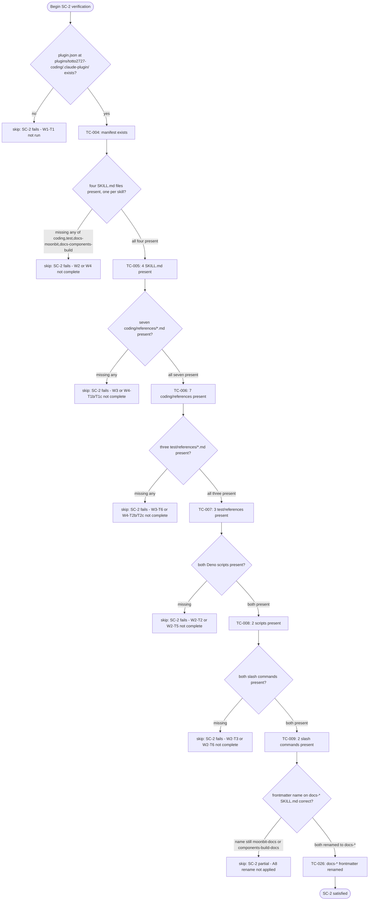
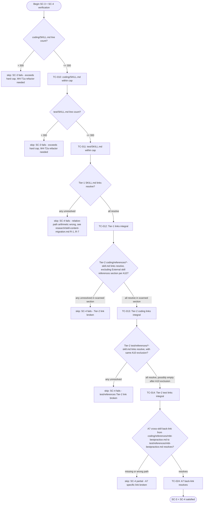
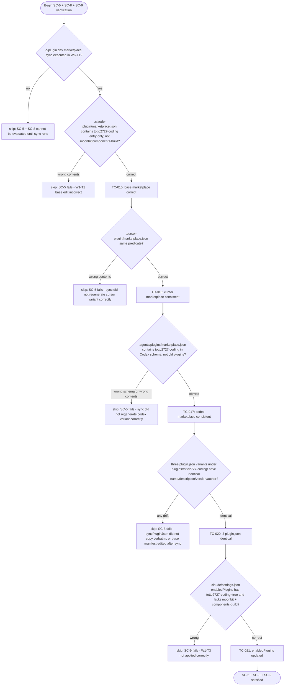
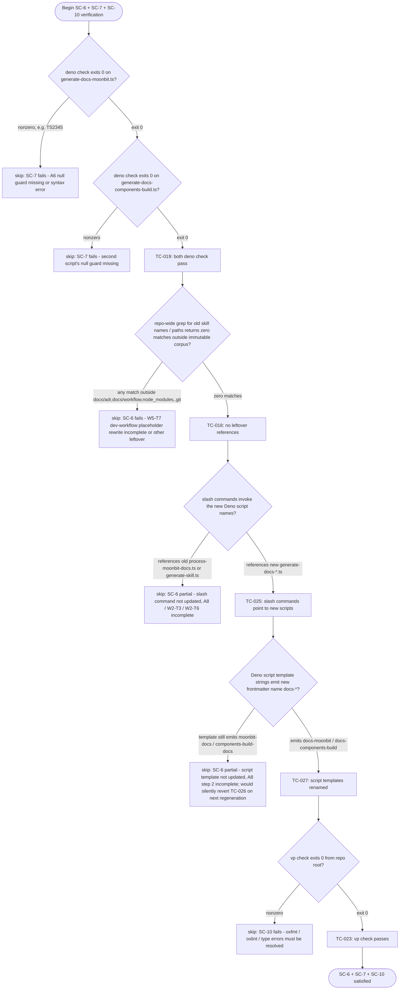
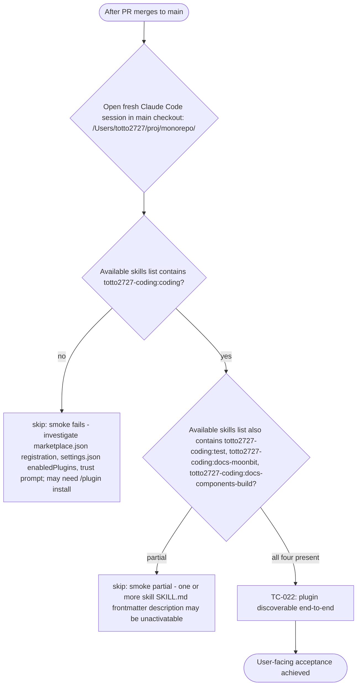
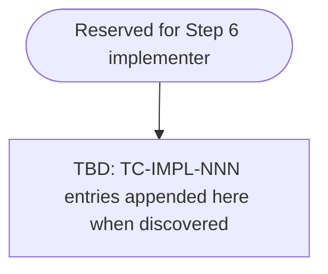

# QA Flow: Consolidate coding/test/docs skills into `totto2727-coding` plugin

- **Identifier:** 2026-05-04-totto2727-coding-plugin
- **Author:** qa-analyst (dev-workflow Step 4, single instance)
- **Source:** `qa-design.md`
- **Created at:** 2026-05-04
- **Last updated:** 2026-05-04
- **Status:** draft

This document visualizes the test cases of `qa-design.md` as Mermaid flowcharts so coverage can be confirmed at a glance. See `share-artifacts/references/qa-flow.md` for authoring details.

## Overview

This cycle is a **documentation / plugin restructuring** cycle, so the "essential logic" being tested is the post-migration **filesystem and configuration state**, not runtime branching of code. The flow diagrams below are organized into five concerns following the data-flow direction of the migration: (1) old-path deletion, (2) new-path presence, (3) content invariants of the new files (line count + link integrity), (4) configuration consistency (three marketplace.json + three plugin.json + `enabledPlugins`), and (5) tooling validation (`deno check` + `vp check`). A sixth section captures the cross-cutting end-user smoke test (TC-022). Implementation-driven branches are intentionally left empty in Step 4 and will be appended by the implementer in Step 6 if discovered.

---

## 1. Old paths gone (cleanup verification)

Success criteria covered by this section: SC-1

```mermaid
flowchart TD
  Start([Begin SC-1 verification]) --> Q1{plugins/moonbit/ directory exists?}
  Q1 -->|yes| Fail1[skip: SC-1 fails - cleanup task W5-T1 not run]
  Q1 -->|no, absent| TC1[TC-001: plugins/moonbit removed]
  TC1 --> Q2{plugins/components-build/ directory exists?}
  Q2 -->|yes| Fail2[skip: SC-1 fails - cleanup task W5-T2 not run]
  Q2 -->|no, absent| TC2[TC-002: plugins/components-build removed]
  TC2 --> Q3{any of .agents/skills/{effect-layer,effect-runtime,effect-hono,totto2727-fp} present?}
  Q3 -->|any present| Fail3[skip: SC-1 fails - cleanup tasks W5-T3 to W5-T6 not run]
  Q3 -->|all absent| TC3[TC-003: four .agents/skills entries removed]
  TC3 --> EndCleanup([SC-1 satisfied])
```

---

## 2. New paths present (creation verification)

Success criteria covered by this section: SC-2



---

## 3. Content invariants (line cap + link integrity)

Success criteria covered by this section: SC-3, SC-4



---

## 4. Configuration consistency (marketplace.json + plugin.json + enabledPlugins)

Success criteria covered by this section: SC-5, SC-8, SC-9



---

## 5. Tooling validation (deno check + vp check + grep no-leftover + slash command refs + script template name)

Success criteria covered by this section: SC-6, SC-7, SC-10



---

## 6. End-user smoke test (cross-cutting, post-merge)

Success criteria covered by this section: (none) - this TC has Target SC = (none) per qa-design.md, but it is the operational acceptance gate.



Note on TC-022 placement: this is a `manual × scenario` test that cannot run inside the worktree (per `research/plugin-discovery-mechanism.md` Implications #4: directory-source plugins resolve against the main checkout, not the worktree). The Step 8 validator records the result in `validation-report.md` after the PR merges. Until then, this branch leaf is a "deferred" success.

---

## Implementation-driven branches (optional)

Empty at the end of Step 4. The implementer in Step 6 appends a flowchart here for any `TC-IMPL-NNN` cases that cannot be naturally folded into sections 1-6 above.


