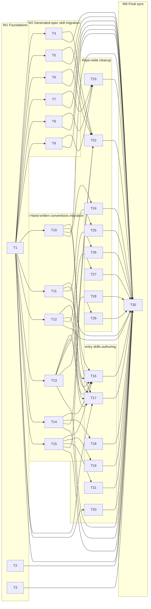

# Task Plan: Consolidate coding/test/docs skills into `totto2727-coding` plugin

- **Identifier:** 2026-05-04-totto2727-coding-plugin
- **Author:** planner (dev-workflow Step 5, single instance)
- **Source:** `design.md`
- **Created at:** 2026-05-04
- **Status:** approved

This document is the **immutable plan finalized in Step 5**. Task state tracking during Steps 6-7 happens in `TODO.md`. Late-added tasks during Step 6 are appended to `TODO.md`'s "Subsequently added tasks" section, never to this file.

## Premises

- Tasks decompose `design.md` §Component breakdown + §Handoff notes for Task Decomposition into 23 atomic units. Granularity: each task is completable by a single `implementer` in **a few hours up to one day**.
- **One task = one Git commit** (per `step-implementation` commit conventions). Each task's `Artifacts` field enumerates the file paths that must appear in the commit.
- **Verification source of truth is `qa-design.md` (TC-001…TC-027)**. The `Test cases covered` field on each task is informational; Step 6 implementer references `qa-design.md` directly. Per task `Definition of Done` includes (a) the listed file changes are committed, (b) `vp check` exits 0 from repo root, (c) the related TCs would pass when measured (full TC measurement happens in Step 8).
- **Constraint A8 (script-template lockstep)**: any task touching `docs-moonbit/SKILL.md` or `docs-components-build/SKILL.md` body content **must** also update the corresponding template string in the generator script in the same commit (or a directly-paired commit if file ownership requires split). Tasks below mark this explicitly.
- **Constraint A10 (external skill reference style)**: `<lang>-skill.md` Tier-2 files reference external skills (`vite-plus`, `remix`) **by skill name only with no Markdown link**, under the heading `## External skill references`. SC-4 / TC-013 / TC-014 link integrity scans exclude this section. Tasks W4-T1b / W4-T2b enforce this format.
- **Hard serialization point**: W6-T1 (`c-plugin dev marketplace sync`) **must** run last; it depends on all of W1-W5. Three derived files (`.codex-plugin/plugin.json`, `.cursor-plugin/plugin.json`, two derivative marketplace.json) are regenerated and committed in this single task.
- **Move-and-rename ordering rule**: For each pair (old path → new path), Wave W2/W3 creates the new path first; Wave W5 deletes the old path only after the corresponding W2/W3 task is committed. This makes every cycle-internal commit individually revertible without losing source content.
- **Pre-existing stale link exclusion (informational)**: `docs-moonbit/references/*.md` contains pre-existing stale links (`research/skill-content-migration.md` F-2-a/b). These are not introduced by this cycle; SC-4 / TC-013 / TC-014 only scan the Tier-1 / Tier-2 entry files, not these references. Step 8 validator separates "new breakage" (must be 0) from "pre-existing breakage" (informational).

## Wave summary

| Wave      | Task count | Parallelism                                                                                                                                                  | Blocker for                                                                                           |
| --------- | ---------- | ------------------------------------------------------------------------------------------------------------------------------------------------------------ | ----------------------------------------------------------------------------------------------------- |
| W1        | 3          | All 3 parallel (no inter-W1 deps)                                                                                                                            | W2, W3, gate for new plugin manifest existence                                                        |
| W2        | 6          | All 6 parallel (each touches a distinct directory/file pair)                                                                                                 | W5-T1 / W5-T2 (deletion safety)                                                                       |
| W3        | 6          | All 6 parallel (each touches a distinct source file)                                                                                                         | W5-T3…W5-T6 (deletion safety) and W4 (entry SKILL.md author needs final reference layout)             |
| W4        | 6          | W4-T1a/b/c parallel within coding; W4-T2a/b/c parallel within test; both groups parallel — total 6 parallel                                                  | None (consumed by W6 sync only via marketplace registration, but W4 outputs do not block W6 directly) |
| W5        | 8          | W5-T1…T6 parallel (six deletions, distinct dirs); W5-T7 parallel (single multi-file edit, exclusively dev-workflow scope); W5-T8 parallel (single file pair) | W6 (final sync expects clean tree)                                                                    |
| W6        | 1          | Single task, hard serialization                                                                                                                              | (terminal)                                                                                            |
| **Total** | **30**     | (see DAG)                                                                                                                                                    | —                                                                                                     |

(See "Dependency graph" below for the DAG; "Parallelizable groups" lists the recommended Wave launch order.)

## Task list

### W1: Foundations (parallelizable)

#### T1: Create new plugin manifest `plugins/totto2727-coding/.claude-plugin/plugin.json`

- **Summary:** Create the new plugin's hand-edited manifest using the template in `design.md:166-181` (Key types and interfaces §`plugin.json`). Field values: `name: totto2727-coding`, `description: …`, `version: 0.1.0`, `author: {name: totto2727, url: https://github.com/totto2727, email: kaihatu.totto2727@gmail.com}`. Author / version / shape mirror `plugins/dev-workflow/.claude-plugin/plugin.json:1-11` so the W6 sync round-trip stays diff-clean.
- **Artifact:** `plugins/totto2727-coding/.claude-plugin/plugin.json` (new file, single commit).
- **Dependencies:** none.
- **Parallelizable:** yes (with T2, T3).
- **Estimated size:** S
- **Test cases covered:** TC-004
- **Design document references:** §Component breakdown ① (`design.md:43-58`); §Key types and interfaces (`design.md:166-181`).

#### T2: Edit `.claude-plugin/marketplace.json` — add `totto2727-coding`, drop `moonbit` and `components-build`

- **Summary:** Update the **edit-base** marketplace JSON. Remove `{"name":"moonbit", …}` and `{"name":"components-build", …}` entries from `plugins[]`; append `{"name": "totto2727-coding", "source": "./plugins/totto2727-coding"}`. Per design A1 / Q3 rationale and `design.md:183-202`, do NOT touch `.cursor-plugin/marketplace.json` or `.agents/plugins/marketplace.json` here — those are regenerated in W6 by the sync command. Note: doing this in W1 (before plugin.json + skills are fully populated) creates a brief window where Claude Code might discover an incomplete plugin — acceptable for this cycle because W1-T1 lands the manifest in the same Wave and W2-T1/T4 land the SKILL.md files immediately after. If a stricter "no incomplete plugin" guarantee is needed, Main may sequence T2 to land after W4-T1a / W4-T2a (annotated as a tradeoff in this task plan, not enforced as a hard dependency).
- **Artifact:** `.claude-plugin/marketplace.json` (modified, single commit).
- **Dependencies:** none.
- **Parallelizable:** yes (with T1, T3).
- **Estimated size:** S
- **Test cases covered:** TC-015
- **Design document references:** §Key types and interfaces §Root marketplace entries (`design.md:183-202`); §Approach overview (`design.md:39`).

#### T3: Update `.claude/settings.json` `enabledPlugins`

- **Summary:** Mutate the JSON to: add `"totto2727-coding@totto2727": true`; remove `"moonbit@totto2727": true` and `"components-build@totto2727": true`; retain `"dev-workflow@totto2727": true` and `"totto2727@totto2727": true`. Final shape per `design.md:204-214`.
- **Artifact:** `.claude/settings.json` (modified, single commit).
- **Dependencies:** none.
- **Parallelizable:** yes (with T1, T2).
- **Estimated size:** S
- **Test cases covered:** TC-021
- **Design document references:** §Key types and interfaces §`.claude/settings.json` `enabledPlugins` (`design.md:204-214`).
- **Notes:** Implementer should confirm with `jq -e '.enabledPlugins["dev-workflow@totto2727"] == true'` after edit that the existing entries are preserved.

### W2: Migrate generated-spec skills (parallelizable across W2; depend on W1-T1)

#### T4: Move + rename `moonbit-docs/` SKILL.md and references → `docs-moonbit/`

- **Summary:** Move the entire directory `plugins/moonbit/skills/moonbit-docs/` to `plugins/totto2727-coding/skills/docs-moonbit/`. Apply two SKILL.md edits at copy time (the next regen will overwrite with same values; A8 ensures the script template stays in sync via T5):
  1. Frontmatter `name: moonbit-docs` → `name: docs-moonbit` (line 1-7).
  2. Related Skills bullet at line 17: `[moonbit-bestpractice](../moonbit-bestpractice/SKILL.md)` → `[mbt-bestpractice](../coding/references/mbt-bestpractice.md) — MoonBit coding standards in the new \`coding\` skill`.

  Do NOT delete the old `plugins/moonbit/skills/moonbit-docs/` source directory in this task — that happens in W5-T1 (entire `plugins/moonbit/` deletion). Preserve all 25+ files in `references/` verbatim (including pre-existing stale internal links per F-2-a/b — those are not in scope for this cycle).

- **Artifact:** Add: `plugins/totto2727-coding/skills/docs-moonbit/SKILL.md` + `plugins/totto2727-coding/skills/docs-moonbit/references/*.md` (~25 files). Modified vs. source: only SKILL.md frontmatter `name:` and L17 Related Skills line.
- **Dependencies:** T1 (plugin manifest must exist so the new skills directory has a parent plugin).
- **Parallelizable:** yes (with T5, T6, T7, T8, T9).
- **Estimated size:** M
- **Test cases covered:** TC-005 (partial — `docs-moonbit/SKILL.md` existence), TC-026 (frontmatter `name:`)
- **Design document references:** §Component breakdown ④ (`design.md:98-103`); A8 (`design.md:344-360`).
- **Notes:** Implementer must NOT strip frontmatter from `docs-moonbit/SKILL.md` (it remains a top-level skill, only `name:` updates). Per design A5 the frontmatter-strip rule applies only to migrated `references/<lang>-<topic>.md` files in W3, not to top-level SKILL.md.

#### T5: Move + rename + edit `process-moonbit-docs.ts` → `generate-docs-moonbit.ts`

- **Summary:** Move `plugins/moonbit/.script/process-moonbit-docs.ts` to `plugins/totto2727-coding/.script/generate-docs-moonbit.ts`. Apply four edits:
  1. Insert null-guard for `import.meta.dirname` (per design A6 (a), `design.md:316-335`): replace the un-guarded `const scriptDir = import.meta.dirname` with the early-throw block (5 lines).
  2. Update output dir from `'skills', 'moonbit-docs'` to `'skills', 'docs-moonbit'`.
  3. Update `skillContent` template `name: moonbit-docs` → `name: docs-moonbit` (script L135-140 region per `design.md:355-357`).
  4. Update `relatedSkillsBlock` template (L130-132 region) to emit the new bullet matching T4 step 2: `[mbt-bestpractice](../coding/references/mbt-bestpractice.md) — MoonBit coding standards in the new \`coding\` skill`.

  After these edits, the script must pass `deno check` (TC-019). The old script `plugins/moonbit/.script/process-moonbit-docs.ts` is deleted in W5-T1.

- **Artifact:** Add: `plugins/totto2727-coding/.script/generate-docs-moonbit.ts`.
- **Dependencies:** T1.
- **Parallelizable:** yes (with T4, T6, T7, T8, T9).
- **Estimated size:** M
- **Test cases covered:** TC-008 (partial — script existence), TC-019 (partial — `deno check` pass), TC-027 (partial — template emits new `name:`)
- **Design document references:** §Component breakdown ① row `.script/generate-docs-moonbit.ts` (`design.md:50`); A6 (`design.md:316-335`); A8 step 2 (`design.md:355-358`).
- **Notes:** Implementer should run `deno check plugins/totto2727-coding/.script/generate-docs-moonbit.ts` locally before commit (TC-019 precondition). May add TC-IMPL if a Deno-specific defensive branch surfaces (e.g. fetch failure handling — see `intent-spec.md` Out-of-scope §3 caveats).

#### T6: Move + rename slash command `update-moonbit-docs.md` → `update-docs-moonbit.md`

- **Summary:** Move `plugins/moonbit/.claude/skills/update-moonbit-docs.md` to `plugins/totto2727-coding/.claude/skills/update-docs-moonbit.md`. Update internal `deno run` invocation path from `.script/process-moonbit-docs.ts` to `.script/generate-docs-moonbit.ts`. If frontmatter `name:` exists, update to `update-docs-moonbit` (filename-matching convention).
- **Artifact:** Add: `plugins/totto2727-coding/.claude/skills/update-docs-moonbit.md`.
- **Dependencies:** T1.
- **Parallelizable:** yes (with T4, T5, T7, T8, T9).
- **Estimated size:** S
- **Test cases covered:** TC-009 (partial — slash command existence), TC-025 (partial — `deno run` path correctness)
- **Design document references:** §Component breakdown ① row `.claude/skills/update-docs-moonbit.md` (`design.md:52`).

#### T7: Move + rename `components-build-docs/` SKILL.md → `docs-components-build/`

- **Summary:** Move `plugins/components-build/skills/components-build-docs/` to `plugins/totto2727-coding/skills/docs-components-build/`. Apply two SKILL.md edits at copy time:
  1. Frontmatter `name: components-build-docs` → `name: docs-components-build`.
  2. L20 comment `<!-- Run .script/generate-skill.ts to update -->` → `<!-- Run .script/generate-docs-components-build.ts to update -->`.

  No Related Skills migration needed (per `design.md:360`, source SKILL.md does not have one).

- **Artifact:** Add: `plugins/totto2727-coding/skills/docs-components-build/SKILL.md` (and any references files if present in source).
- **Dependencies:** T1.
- **Parallelizable:** yes (with T4, T5, T6, T8, T9).
- **Estimated size:** S
- **Test cases covered:** TC-005 (partial — `docs-components-build/SKILL.md` existence), TC-026 (frontmatter `name:`)
- **Design document references:** §Component breakdown ④ (`design.md:98-103`); A8 (`design.md:360`).

#### T8: Move + rename + edit `generate-skill.ts` → `generate-docs-components-build.ts`

- **Summary:** Move `plugins/components-build/.script/generate-skill.ts` to `plugins/totto2727-coding/.script/generate-docs-components-build.ts`. Apply four edits:
  1. Insert null-guard for `import.meta.dirname` (same block as T5 step 1).
  2. Update output dir from `'skills', 'components-build-docs'` to `'skills', 'docs-components-build'`.
  3. Update template string `name: components-build-docs` → `name: docs-components-build`.
  4. Update L6 / L131-132 comments (or equivalent) to reflect the new script name + skill name (must include the string emitted by T7 step 2, namely `Run .script/generate-docs-components-build.ts to update`).

  The script must pass `deno check` (TC-019).

- **Artifact:** Add: `plugins/totto2727-coding/.script/generate-docs-components-build.ts`.
- **Dependencies:** T1.
- **Parallelizable:** yes (with T4, T5, T6, T7, T9).
- **Estimated size:** M
- **Test cases covered:** TC-008 (partial), TC-019 (partial), TC-027 (partial)
- **Design document references:** §Component breakdown ① row `.script/generate-docs-components-build.ts` (`design.md:51`); A6, A8.
- **Notes:** Same `deno check` precondition discipline as T5.

#### T9: Move + rename slash command `update-components-build-docs.md` → `update-docs-components-build.md`

- **Summary:** Move `plugins/components-build/.claude/skills/update-components-build-docs.md` to `plugins/totto2727-coding/.claude/skills/update-docs-components-build.md`. Update internal `deno run` invocation from `.script/generate-skill.ts` to `.script/generate-docs-components-build.ts`. If frontmatter `name:` exists, update to `update-docs-components-build`.
- **Artifact:** Add: `plugins/totto2727-coding/.claude/skills/update-docs-components-build.md`.
- **Dependencies:** T1.
- **Parallelizable:** yes (with T4, T5, T6, T7, T8).
- **Estimated size:** S
- **Test cases covered:** TC-009 (partial), TC-025 (partial)
- **Design document references:** §Component breakdown ① row `.claude/skills/update-docs-components-build.md` (`design.md:53`).

### W3: Migrate hand-written conventions to `references/` (parallelizable)

For each migration source S → target T below: (a) copy S to T, (b) **strip the leading frontmatter block** per A5 (`design.md:305-313`) — file should start with the existing H1, (c) rewrite cross-references per `research/skill-content-migration.md` R-1…R-8, (d) the source file is deleted in W5 (W5-T3…T6), not in this Wave. SC-2 / TC-006 / TC-007 verify the new paths exist; SC-1 / TC-003 verifies old paths gone after W5.

#### T10: Migrate `effect-layer/SKILL.md` → `coding/references/ts-effect-layer.md`

- **Summary:** Copy `.agents/skills/effect-layer/SKILL.md` to `plugins/totto2727-coding/skills/coding/references/ts-effect-layer.md`. Strip the leading `---\n…\n---\n` frontmatter block. Rewrite **5 internal links** per `research/skill-content-migration.md` R-1: links to sibling `effect-runtime` / `effect-hono` / `totto2727-fp` skills must repoint to `./ts-effect-runtime.md` / `./ts-effect-hono.md` / `./ts-totto2727-fp.md` (sibling-in-same-references). Source deleted in W5-T3.
- **Artifact:** Add: `plugins/totto2727-coding/skills/coding/references/ts-effect-layer.md`.
- **Dependencies:** T1.
- **Parallelizable:** yes (with T11, T12, T13, T14, T15).
- **Estimated size:** S
- **Test cases covered:** TC-006 (partial — `ts-effect-layer.md` existence), TC-013 (partial — Tier-2 link integrity from `ts-skill.md`; TC-013 actually scans `ts-skill.md` not this file, but this file's outgoing links must resolve for downstream scans)
- **Design document references:** §Component breakdown §2 (`design.md:59-72`); A5 (`design.md:305-313`); `research/skill-content-migration.md` R-1.

#### T11: Migrate `effect-runtime/SKILL.md` → `coding/references/ts-effect-runtime.md`

- **Summary:** Copy `.agents/skills/effect-runtime/SKILL.md` to `plugins/totto2727-coding/skills/coding/references/ts-effect-runtime.md`. Strip frontmatter. Rewrite **4 internal links** per R-2 (sibling links to `effect-layer` / `effect-hono` / `totto2727-fp` repoint to `./ts-effect-layer.md` / `./ts-effect-hono.md` / `./ts-totto2727-fp.md`). Source deleted in W5-T4.
- **Artifact:** Add: `plugins/totto2727-coding/skills/coding/references/ts-effect-runtime.md`.
- **Dependencies:** T1.
- **Parallelizable:** yes (with T10, T12, T13, T14, T15).
- **Estimated size:** S
- **Test cases covered:** TC-006 (partial)
- **Design document references:** §Component breakdown §2; A5; R-2.

#### T12: Migrate `effect-hono/SKILL.md` → `coding/references/ts-effect-hono.md`

- **Summary:** Copy `.agents/skills/effect-hono/SKILL.md` to `plugins/totto2727-coding/skills/coding/references/ts-effect-hono.md`. Strip frontmatter. Rewrite **9 internal links** per R-3 (sibling links to `effect-layer` / `effect-runtime` repoint accordingly; HTTP error / Hono-specific cross-skill mentions). Source deleted in W5-T5.
- **Artifact:** Add: `plugins/totto2727-coding/skills/coding/references/ts-effect-hono.md`.
- **Dependencies:** T1.
- **Parallelizable:** yes (with T10, T11, T13, T14, T15).
- **Estimated size:** M
- **Test cases covered:** TC-006 (partial)
- **Design document references:** §Component breakdown §2; A5; R-3.

#### T13: Migrate `totto2727-fp/SKILL.md` → `coding/references/ts-totto2727-fp.md`

- **Summary:** Copy `.agents/skills/totto2727-fp/SKILL.md` to `plugins/totto2727-coding/skills/coding/references/ts-totto2727-fp.md`. Strip frontmatter. R-4 records 1 external URL only; **no relative-path rewrite** required. Source deleted in W5-T6.
- **Artifact:** Add: `plugins/totto2727-coding/skills/coding/references/ts-totto2727-fp.md`.
- **Dependencies:** T1.
- **Parallelizable:** yes (with T10, T11, T12, T14, T15).
- **Estimated size:** S
- **Test cases covered:** TC-006 (partial)
- **Design document references:** §Component breakdown §2; A5; R-4.

#### T14: Migrate `moonbit-bestpractice/SKILL.md` → `coding/references/mbt-bestpractice.md`

- **Summary:** Copy `plugins/moonbit/skills/moonbit-bestpractice/SKILL.md` to `plugins/totto2727-coding/skills/coding/references/mbt-bestpractice.md`. Strip frontmatter. Rewrite **2 internal links** per R-5: in particular the L311 cross-skill link must point to `../../test/references/mbt-bestpractice.md` per A7(a) (`design.md:337-343`). Source deleted in W5-T1 (as part of `plugins/moonbit/` directory removal).
- **Artifact:** Add: `plugins/totto2727-coding/skills/coding/references/mbt-bestpractice.md`.
- **Dependencies:** T1.
- **Parallelizable:** yes (with T10, T11, T12, T13, T15).
- **Estimated size:** S
- **Test cases covered:** TC-006 (partial), TC-024 (cross-skill back-link verification)
- **Design document references:** §Component breakdown §2; A5; A7 (`design.md:337-343`); R-5.
- **Notes:** TC-024 is the most error-prone path arithmetic in this migration (`../../test/`); implementer should manually trace the relative path before commit.

#### T15: Migrate `moonbit-bestpractice/references/moonbit-test.md` → `test/references/mbt-bestpractice.md`

- **Summary:** Copy `plugins/moonbit/skills/moonbit-bestpractice/references/moonbit-test.md` to `plugins/totto2727-coding/skills/test/references/mbt-bestpractice.md`. Per R-6 the source has no frontmatter (no-op for the strip step), no link rewrites required. Source deleted with W5-T1.
- **Artifact:** Add: `plugins/totto2727-coding/skills/test/references/mbt-bestpractice.md`.
- **Dependencies:** T1.
- **Parallelizable:** yes (with T10, T11, T12, T13, T14).
- **Estimated size:** S
- **Test cases covered:** TC-007 (partial — `mbt-bestpractice.md` existence under `test/references/`)
- **Design document references:** §Component breakdown §3 (`design.md:86-96`); A5; R-6.

### W4: Author new entry skills (parallelizable; depend on W3 done)

W4 depends on W3 because the entry SKILL.md authors need final reference filenames (`ts-effect-*.md`, `mbt-bestpractice.md`) to write accurate links. Within W4, all six tasks are parallelizable (each touches a distinct file).

#### T16: Author `coding/SKILL.md`

- **Summary:** Write the Tier-1 entry SKILL.md per design §2 (`design.md:74-84`). Three sections: (a) language-agnostic principles (type safety / locality of side effects / naming intent / testability — short paragraphs, no language-specific code), (b) **Language index** with two bullets linking to `references/ts-skill.md` and `references/mbt-skill.md`, (c) **External spec references** section per Q3(a) — peer-level section linking to `../docs-moonbit/SKILL.md` and `../docs-components-build/SKILL.md`. Frontmatter `name: coding` with appropriate `description:` (must trigger Claude Code skill auto-discovery for "coding conventions" / "language conventions"). **Hard cap: ≤ 300 lines** (TC-010). Each Markdown link must resolve at the time of authoring (TC-012).
- **Artifact:** Add: `plugins/totto2727-coding/skills/coding/SKILL.md`.
- **Dependencies:** T10, T11, T12, T13, T14, T15 (need final reference filenames). Also depends on T1 (plugin manifest).
- **Parallelizable:** yes (with T17, T18, T19, T20, T21).
- **Estimated size:** M
- **Test cases covered:** TC-005 (partial — `coding/SKILL.md` existence), TC-010 (300-line cap), TC-012 (Tier-1 link integrity)
- **Design document references:** §Component breakdown §2 (`design.md:59-84`); A2 / Q3(a) (`design.md:275-281`).
- **Notes:** Implementer should run `wc -l plugins/totto2727-coding/skills/coding/SKILL.md` locally and confirm ≤ 300 before commit. If draft exceeds 300, demote prose to `<lang>-skill.md` Tier-2 — the planner explicitly does not budget overflow into a separate task because the cap is a Tier-1 discipline.

#### T17: Author `coding/references/ts-skill.md`

- **Summary:** Write the Tier-2 TypeScript index per design §2 + A10 (`design.md:80-83`, `design.md:387-402`). Two sections: (1) **In-plugin detail files** — table-of-contents bullets with Markdown links to `./ts-effect-layer.md`, `./ts-effect-runtime.md`, `./ts-effect-hono.md`, `./ts-totto2727-fp.md`, each with one-sentence "use when …" description. (2) **External skill references** — bullets for `vite-plus` (Vite+ unified toolchain — Vite / Vitest / monorepo orchestration; use for `vp run` / `vp test` / build pipelines) and `remix` (Remix 3 application development; use when building or reviewing Remix apps). **NO Markdown links** in section (2); skill-name-only with one-sentence purpose per A10(a). The heading **must** be exactly `## External skill references` so SC-4 / TC-013 scan-exclusion works. **No frontmatter** per A5 (file starts with H1 `# TypeScript skill index` or similar).
- **Artifact:** Add: `plugins/totto2727-coding/skills/coding/references/ts-skill.md`.
- **Dependencies:** T10, T11, T12, T13 (need ts-effect-\* + ts-totto2727-fp.md to link to). Also T1.
- **Parallelizable:** yes (with T16, T18, T19, T20, T21).
- **Estimated size:** S
- **Test cases covered:** TC-006 (partial — `ts-skill.md` existence), TC-013 (Tier-2 link integrity with A10 exclusion)
- **Design document references:** §Component breakdown §2 (`design.md:80-83`); A10 (`design.md:369-404`).

#### T18: Author `coding/references/mbt-skill.md`

- **Summary:** Write the Tier-2 MoonBit index per design §2. Section (1) **In-plugin detail files** — single Markdown-link bullet to `./mbt-bestpractice.md` with "MoonBit coding conventions / patterns. Use when writing MoonBit code." Section (2) **External skill references** — empty in this cycle (no MoonBit-side external dep skills beyond the auto-generated ones already linked from `coding/SKILL.md` Tier-1). Per A10 the section heading is still emitted (even if body is "_No external skill references this cycle._" or omitted entirely; planner recommends omitting the section if empty to reduce noise — implementer judgment). **No frontmatter** per A5.
- **Artifact:** Add: `plugins/totto2727-coding/skills/coding/references/mbt-skill.md`.
- **Dependencies:** T14. Also T1.
- **Parallelizable:** yes (with T16, T17, T19, T20, T21).
- **Estimated size:** S
- **Test cases covered:** TC-006 (partial), TC-013 (partial)
- **Design document references:** §Component breakdown §2 (`design.md:80-83`); A10.

#### T19: Author `test/SKILL.md`

- **Summary:** Write the Tier-1 test entry SKILL.md per design §3 + Q4(c) (`design.md:86-96`, `design.md:283-292`). Three sections: (a) language-agnostic test principles (test independence / observable assertions / fixture hygiene), (b) **Language index** with bullets linking to `references/ts-skill.md` and `references/mbt-skill.md`, (c) optional external spec link to `../docs-moonbit/SKILL.md` if useful for MoonBit test reading. Frontmatter `name: test`. **Hard cap: ≤ 300 lines** (TC-011).
- **Artifact:** Add: `plugins/totto2727-coding/skills/test/SKILL.md`.
- **Dependencies:** T15. Also T1.
- **Parallelizable:** yes (with T16, T17, T18, T20, T21).
- **Estimated size:** M
- **Test cases covered:** TC-005 (partial — `test/SKILL.md` existence), TC-011 (300-line cap), TC-012 (Tier-1 link integrity from `test/SKILL.md`)
- **Design document references:** §Component breakdown §3 (`design.md:86-96`); A3 / Q4(c) (`design.md:283-292`).
- **Notes:** Same 300-line discipline as T16.

#### T20: Author `test/references/ts-skill.md`

- **Summary:** Write the Tier-2 TS test index per Q4(c) (`design.md:283-292`). Body is **only** the External skill references section (per design A3/A10): one bullet for `vite-plus` (Vite+ unified toolchain — Vitest via `vp test`. Use for unit / integration test execution and watch loops). **No in-plugin detail files this cycle** (Out-of-scope per Intent Spec §"Out of scope" item: TS test convention bodies). NO Markdown link in the External skill references bullet (A10). Section heading exactly `## External skill references` (TC-014 exclusion). After exclusion the link set is empty — TC-014 still passes (zero unresolved links is a pass).
- **Artifact:** Add: `plugins/totto2727-coding/skills/test/references/ts-skill.md`.
- **Dependencies:** T1.
- **Parallelizable:** yes (with T16, T17, T18, T19, T21).
- **Estimated size:** S
- **Test cases covered:** TC-007 (partial), TC-014 (partial)
- **Design document references:** §Component breakdown §3; A3 / Q4(c); A10.

#### T21: Author `test/references/mbt-skill.md`

- **Summary:** Write the Tier-2 MoonBit test index per design §3. Section (1) **In-plugin detail files** — single Markdown-link bullet to `./mbt-bestpractice.md` (the migrated `moonbit-test.md`) with "MoonBit test conventions and patterns. Use when writing MoonBit unit tests." Section (2) external skill refs empty (omit section). **No frontmatter** per A5.
- **Artifact:** Add: `plugins/totto2727-coding/skills/test/references/mbt-skill.md`.
- **Dependencies:** T15.
- **Parallelizable:** yes (with T16, T17, T18, T19, T20).
- **Estimated size:** S
- **Test cases covered:** TC-007 (partial), TC-014 (partial)
- **Design document references:** §Component breakdown §3; A10.

### W5: Repo-wide cleanup (depend on W2 / W3 done)

#### T22: Delete `plugins/moonbit/` (entire directory)

- **Summary:** `git rm -r plugins/moonbit/`. Single deletion task. Removes the old SKILL.md / references for both `moonbit-docs` and `moonbit-bestpractice` (sources of T4 / T14 / T15) plus the old `.script/process-moonbit-docs.ts` (source of T5) plus the old `.claude/skills/update-moonbit-docs.md` (source of T6).
- **Artifact:** Delete: `plugins/moonbit/` (entire tree).
- **Dependencies:** T4, T5, T6, T14, T15.
- **Parallelizable:** yes (with T23, T24, T25, T26, T27, T28, T29).
- **Estimated size:** S
- **Test cases covered:** TC-001 (`plugins/moonbit/` gone)
- **Design document references:** §Operational considerations §Migration / cutover (`design.md:447-451`); Handoff §W5-T1.

#### T23: Delete `plugins/components-build/` (entire directory)

- **Summary:** `git rm -r plugins/components-build/`. Removes sources for T7 / T8 / T9.
- **Artifact:** Delete: `plugins/components-build/` (entire tree).
- **Dependencies:** T7, T8, T9.
- **Parallelizable:** yes (with T22, T24, T25, T26, T27, T28, T29).
- **Estimated size:** S
- **Test cases covered:** TC-002 (`plugins/components-build/` gone)
- **Design document references:** Handoff §W5-T2.

#### T24: Delete `.agents/skills/effect-layer/`

- **Summary:** `git rm -r .agents/skills/effect-layer/`. Source of T10.
- **Artifact:** Delete: `.agents/skills/effect-layer/`.
- **Dependencies:** T10.
- **Parallelizable:** yes (with T22, T23, T25, T26, T27, T28, T29).
- **Estimated size:** S
- **Test cases covered:** TC-003 (partial — `effect-layer` gone)
- **Design document references:** Handoff §W5-T3.

#### T25: Delete `.agents/skills/effect-runtime/`

- **Summary:** `git rm -r .agents/skills/effect-runtime/`. Source of T11.
- **Artifact:** Delete: `.agents/skills/effect-runtime/`.
- **Dependencies:** T11.
- **Parallelizable:** yes (with T22, T23, T24, T26, T27, T28, T29).
- **Estimated size:** S
- **Test cases covered:** TC-003 (partial)
- **Design document references:** Handoff §W5-T4.

#### T26: Delete `.agents/skills/effect-hono/`

- **Summary:** `git rm -r .agents/skills/effect-hono/`. Source of T12.
- **Artifact:** Delete: `.agents/skills/effect-hono/`.
- **Dependencies:** T12.
- **Parallelizable:** yes (with T22, T23, T24, T25, T27, T28, T29).
- **Estimated size:** S
- **Test cases covered:** TC-003 (partial)
- **Design document references:** Handoff §W5-T5.

#### T27: Delete `.agents/skills/totto2727-fp/`

- **Summary:** `git rm -r .agents/skills/totto2727-fp/`. Source of T13.
- **Artifact:** Delete: `.agents/skills/totto2727-fp/`.
- **Dependencies:** T13.
- **Parallelizable:** yes (with T22, T23, T24, T25, T26, T28, T29).
- **Estimated size:** S
- **Test cases covered:** TC-003 (partial)
- **Design document references:** Handoff §W5-T6.

#### T28: Rewrite 12 dev-workflow placeholder occurrences

- **Summary:** Per A4(a) (`design.md:294-303`), replace each occurrence of the inline-code list `effect-layer / effect-runtime / effect-hono / totto2727-fp` with a representative-only example list (e.g. `coding`, `git-workflow`, `macos-cli-rules`) — preserve the **example** nature; do not introduce new exhaustive lists. The 12 sites enumerated in `design.md:303` are: (1) `plugins/dev-workflow/README.md:305`, (2) `plugins/dev-workflow/skills/dev-roadmap/SKILL.md:297`, (3) `plugins/dev-workflow/skills/step-roadmap-decomposition/SKILL.md:45`, (4) `plugins/dev-workflow/skills/specialist-architect/SKILL.md:64`, (5) `plugins/dev-workflow/agents/implementer.md:37`, (6) `plugins/dev-workflow/skills/dev-workflow/SKILL.md:85`, (7) `plugins/dev-workflow/skills/dev-workflow/SKILL.md:181`, (8) `plugins/dev-workflow/skills/step-design/SKILL.md:8`, (9) `plugins/dev-workflow/skills/step-design/SKILL.md:35`, (10) `plugins/dev-workflow/skills/specialist-common/SKILL.md:41-42`, (11) `plugins/dev-workflow/skills/specialist-implementer/SKILL.md:62`, (12) `plugins/dev-workflow/skills/step-implementation/SKILL.md:40`. Where surrounding sentence implies "Effect-specific conventions exist", rewrite to "language-specific conventions exist (see e.g. `coding`)" or similar.
- **Artifact:** Modify: 12 files in `plugins/dev-workflow/` (single commit; this is the largest non-deletion task in W5).
- **Dependencies:** none beyond W1 plugin manifest existence (T1).
- **Parallelizable:** yes (with T22-T27, T29).
- **Estimated size:** M
- **Test cases covered:** TC-018 (repo-wide grep — this task is the load-bearing prerequisite for SC-6 / TC-018 to pass without exclude-dirs)
- **Design document references:** A4 (`design.md:294-303`).
- **Notes:** Implementer should run TC-018's grep command locally after edit and confirm zero matches. If a match remains in a non-`docs/` non-`node_modules/` file outside the listed 12, treat as a Blocker and report — could indicate a missed cross-reference not catalogued by `research/cross-references.md` F-2.

#### T29: Update `js/package/fp/README.md:5` and `js/package/fp/CLAUDE.md:3`

- **Summary:** Per `research/cross-references.md` IMPL-1-C, the symlink `.agents/skills/totto2727-fp` → `js/package/fp/SKILL.md` (or similar) will break when T27 deletes `.agents/skills/totto2727-fp/`. Update `js/package/fp/README.md:5` and `js/package/fp/CLAUDE.md:3` to either (a) remove the obsolete reference, or (b) repoint to the new home `plugins/totto2727-coding/skills/coding/references/ts-totto2727-fp.md`. Implementer chooses based on local context.
- **Artifact:** Modify: `js/package/fp/README.md`, `js/package/fp/CLAUDE.md`.
- **Dependencies:** T13 (logically — must repoint after the new file exists). Tightly: T27 deletion makes the old reference stale, but the cross-reference can be fixed before/after T27.
- **Parallelizable:** yes (with T22-T28).
- **Estimated size:** S
- **Test cases covered:** TC-018 (partial — these references must not match the SC-6 grep patterns), TC-023 (partial — `vp check` would catch broken README/CLAUDE.md links if a project has a Markdown linter rule)
- **Design document references:** Handoff §W5-T8; `research/cross-references.md` IMPL-1-C.

### W6: Final sync (single task, depends on all of W1-W5)

#### T30: Run `c-plugin dev marketplace sync` and commit derivatives

- **Summary:** From repo root, run `vp run --filter c-plugin build` (if needed for fresh build), then `c-plugin dev marketplace sync` (per `design.md:222-238`). This regenerates four files from the W1-W5 base: (a) `plugins/totto2727-coding/.codex-plugin/plugin.json`, (b) `plugins/totto2727-coding/.cursor-plugin/plugin.json`, (c) `.cursor-plugin/marketplace.json`, (d) `.agents/plugins/marketplace.json`. Verify with `git diff` that the four files (plus possibly `dev-workflow` derivatives if the sync also touches them — should be no-op) regenerate cleanly and reflect the new plugin entry. Then run `vp check` from repo root to satisfy SC-10 / TC-023. Single commit containing all four regenerated files.
- **Artifact:** Add: `plugins/totto2727-coding/.codex-plugin/plugin.json`, `plugins/totto2727-coding/.cursor-plugin/plugin.json`. Modify: `.cursor-plugin/marketplace.json`, `.agents/plugins/marketplace.json`.
- **Dependencies:** T1, T2, T3, T4, T5, T6, T7, T8, T9, T10, T11, T12, T13, T14, T15, T16, T17, T18, T19, T20, T21, T22, T23, T24, T25, T26, T27, T28, T29 (every other task).
- **Parallelizable:** **no** (hard serialization point).
- **Estimated size:** S
- **Test cases covered:** TC-016, TC-017, TC-020, TC-023 (and indirectly: TC-019 if the `vp check` invocation catches `deno check` regressions on the two scripts; planner notes `vp check` does not run `deno check` directly — TC-019 must be measured separately by Step 8 validator).
- **Design document references:** §Data flow §Flow A — Editing & manifest sync (`design.md:222-238`); §Operational considerations (`design.md:447-451`); Handoff §W6-T1.
- **Notes:** **Definition of Done** requires `vp check` exit 0 (TC-023). If `vp check` fails, the sync is rolled back and the originating task is identified before re-attempting (do not amend this commit per dev-workflow `git-workflow` policy — fix and create a new commit). Optional: implementer may also run `deno check` on both scripts here as a smoke check, but it's not in the formal task scope.

## Dependency graph

## Parallelizable groups

The unit of parallel launching that Main consults during Step 6.

- **Wave 1 (root, 3 tasks parallel):** T1, T2, T3
- **Wave 2 (6 tasks parallel; depend on T1):** T4, T5, T6, T7, T8, T9
- **Wave 3 (6 tasks parallel; depend on T1):** T10, T11, T12, T13, T14, T15
  - Note: Wave 2 and Wave 3 share T1 as their only Wave 1 prerequisite. Main MAY launch Wave 2 + Wave 3 simultaneously (12 implementers in parallel) once T1 is done, since no W2 task touches a W3 file or vice versa. Recommended for cycle wall-clock optimization.
- **Wave 4 (6 tasks parallel; depend on W3 fully done):** T16, T17, T18, T19, T20, T21
  - Within W4, T16 and T17 specifically depend on T10/T11/T12/T13. T18 depends on T14. T19/T21 depend on T15. T20 depends only on T1 (no W3 dep) — so T20 may actually launch in Wave 2 timeframe in practice; recorded as Wave 4 here for organizational clarity.
- **Wave 5 (8 tasks parallel; depend on W2/W3):** T22, T23, T24, T25, T26, T27, T28, T29
  - Note: T28 has no W2/W3 deps (only T1) — may launch as early as Wave 2 in practice. Recorded as Wave 5 for the "cleanup" semantic grouping.
- **Wave 6 (single task, hard serialization):** T30
  - Must run after all 29 prior tasks are committed.

**Practical scheduling tip:** Main may collapse Waves 2–5 into a "single big parallel batch" of up to 26 tasks once Wave 1 commits land, because the inter-task deps within W2-W5 are all on Wave 1 (T1) plus a few intra-Wave handoffs (W3 → W4 entry skills, W2/W3 → W5 deletions). The DAG above is the authoritative dependency record; the Wave grouping is a presentation aid.

## Risks / anticipated Blockers

- **R1 (medium): Sync command produces unexpected diff in `dev-workflow` derivative manifests.** `c-plugin dev marketplace sync` may regenerate files outside `totto2727-coding/`. If the diff is non-empty for `dev-workflow`, Main should inspect whether it's a benign formatting change (acceptable to commit alongside T30) or an unintended side effect (Blocker → roll back T30, investigate `c-plugin` source). Mitigation: pre-cycle, commit a clean `c-plugin dev marketplace sync` baseline so the cycle's T30 diff isolates this cycle's effect only.

- **R2 (medium): `wc -l` on `coding/SKILL.md` exceeds 300.** Hard cap from Intent Spec. If T16 draft exceeds 300 lines, implementer must demote prose into `<lang>-skill.md` Tier-2 (without spawning a new task — the demotion is part of T16's discipline). If even after demotion the cap is breached, treat as a Blocker → ask user whether to relax the cap or restructure. Same risk for T19 / `test/SKILL.md`.

- **R3 (low): Pre-existing stale links inside `docs-moonbit/references/*.md` (F-2-a/b) trip a future link checker.** Step 8 SC-4 / TC-013 / TC-014 only scan Tier-1 / Tier-2 entry files, not these references. If a follow-up cycle adds a deeper link checker, these need addressing — recorded as a known-limitation in `validation-report.md`. Not in scope here.

- **R4 (low): Worktree caveat for SC-2 / TC-022.** Per `research/plugin-discovery-mechanism.md` Implications #4, Claude Code resolves directory-source plugins against the **main checkout**, not the worktree. SC-2 file-presence checks pass against the worktree (file existence is path-local), but SC-2's "Claude Code recognizes the new plugin" interpretation (= TC-022, manual scenario) requires post-merge verification. Step 8 validator is responsible for this distinction; planner only flags it.

- **R5 (low): `.agents/plugins/marketplace.json` retains the `././plugins/...` (double `./`) pattern after sync.** Per `design.md:202`, this is `marketplace-sync.ts:77` doing `\`./${p.source}\`` over an already-`./`-prefixed source. Not "fixed" in this cycle — sync owns the output. If TC-017 fails because of this prefix, treat as a sync-tool issue (separate cycle) rather than a totto2727-coding plugin issue.

- **R6 (low): `mbt/package/geo/CLAUDE.md:35` `@SKILL.md` (cross-references UQ-2) deferred per A9.** Recorded in retrospective; not a Blocker for this cycle.

- **R7 (medium): Slash command frontmatter `name:` mismatch.** T6 / T9 update slash command filenames but `name:` frontmatter (if present) must also update or Claude Code may fail discovery. Implementer should verify by `grep -E '^name:' plugins/totto2727-coding/.claude/skills/update-docs-*.md` after T6 / T9 commit.

- **R8 (medium): Late-discovered cross-references not catalogued by `research/cross-references.md`.** If T28 leaves residual matches in TC-018's grep that are NOT among the 12 listed sites, treat as a Blocker → escalate to Main (consider rolling back to Step 2 for additional research, or extending T28's scope per `specialist-common §4 Case C`).
