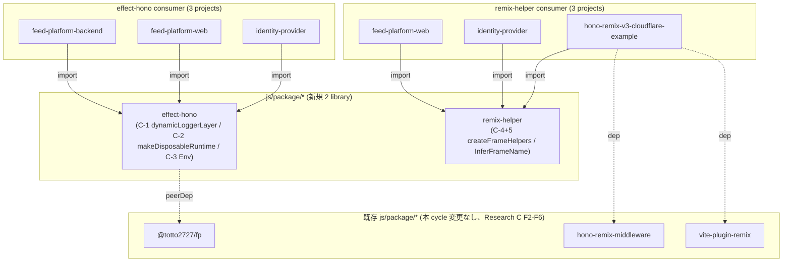

# Design Document: feed-platform Shared Libraries (ms-01 Phase 2)

- **Identifier:** feed-platform-ms-01-shared-libraries
- **Author:** architect (single instance)
- **Created at:** 2026-05-08T00:50:00Z
- **Last updated:** 2026-05-08T00:50:00Z
- **Status:** draft
- **Roadmap:** `feed-platform` / milestone `ms-01-workspace-foundation` (Phase 2)

## Design goals and constraints

本 cycle の目的は、Phase 1 で 3 プロジェクトに完全同形コピーされた共通ロジックを **factory のみ抽出** の原則 (Intent Spec L44-L53) で `js/package/effect-hono` と `js/package/remix-helper` の 2 library に切り出し、4 consumer projects (`feed-platform-backend` / `feed-platform-web` / `identity-provider` / `hono-remix-v3-cloudflare-example`) を一括移行することにある。

- **Purpose (from Intent Spec L18-L29):** 2 library + 4 consumer の合計 6 packages で `vp run check` / `vp run -r build` / `vp test` が PASS し、5 candidates (C-1〜C-5) が「具体は consumer / 抽象化部分は library」の境界で実装される。`hono-remix-v3-cloudflare-example` の Counter / TODO / Frame ナビゲーション既存 behavior は refactor 後も保持する。
- **Success criteria (Intent Spec L146-L168):** SC-1〜SC-10。詳細は本 design 末尾の "Mapping to Success Criteria"。
- **Key constraints:**
  - TypeScript 5.9.2 (`@tsconfig/strictest` + `target: esnext` + `verbatimModuleSyntax: true` + `erasableSyntaxOnly: true`、catalog `build`)
  - Effect `4.0.0-beta.60` (catalog `effect: beta`)
  - 既存 `js/package/*` 5 packages とは完全分離維持 (Intent Spec Q6 / Research Note `existing-js-package-isolation-check.md` F2-F5)
  - 抽象化原則: 「具体を後から渡すべき箇所と抽象化するべき箇所を一緒くたにしない」(Intent Spec L198) — 各 candidate ごとに **library 提供 vs consumer 提供** の境界を明示

### User confirm 済の必須採用事項 (`progress.yaml.step3_design_inputs`)

本 design.md は以下を **絶対遵守** する。Step 2 → Step 3 移行時 User gate で確定済 (2026-05-08T00:30:00Z):

- **U-1**: `frame name` 型は **`F[keyof F]`** (= string literal value union)。Intent Spec L82 案の `keyof F` (key union) は誤りで、本 design.md で訂正。既存実装 (`hono-remix-v3-cloudflare-example/app/routes.ts:15` の `(typeof frames)[keyof typeof frames]`) と整合。
- **U-3**: `isFrameRequest` の signature を **`(request: Request, frame)` 形** に変更し `remix-helper` を **完全 Hono フリー化**。consumer 側 (4 projects) で `c.req.raw` を渡す adapter を各 project 内に置く (= adapter 自体は `remix-helper` には含めない)。
- **U-other-A**: `makeDisposableRuntime` は **wrapper class パターン継承必須** (Effect 4.0.0-beta.60 の `ManagedRuntime` interface に `[Symbol.asyncDispose]` が組み込まれていないため、library 側で wrap する以外に選択肢なし)。Research A I-1 推奨形 `<Args extends readonly unknown[], R, ER>(make: (...args: Args) => ManagedRuntime<R, ER>) => class { ... }` を採用。
- **U-other-B**: SC-6 (web / IdP / hono-remix-v3-cloudflare-example で `createFrameHelpers` ≥ 1 hit) は **refactor only option A** (PageOrFrame の web/IdP 導入はスコープ外、`routes.ts` のみ更新) で達成。
- **U-other-D**: `InferFrameName<T>` は **Pattern P2** (`<const T extends readonly string[]>` + `T[number]`) を採用。本 design.md 内で TS 5.9 環境での実機検証可能性を確認 (後述「Public API surface — InferFrameName」)。

## Approach overview

採用するアプローチは以下の 3 軸:

1. **2 package 分割 (`effect-hono` と `remix-helper`)** — Intent Spec Q2 で確定。Effect / Hono 統合領域 (C-1〜C-3) と Remix v3 Frame UI 領域 (C-4 + C-5) は責務 / 依存とも独立し (Research C F2-F5、grep evidence で重複なし)、命名上もユーザー強調「remix-helper は Hono と無関係」(Intent Spec L61) と整合する。Research B I-8 で発見された `getContext()` 依存問題は U-3 採用 (`Request` 直接受け取り) で完全解消。
2. **factory のみ抽出 / 具体は consumer に残す** — C-2 / C-4+5 は generic factory として library 化、C-1 / C-3 は **factory 化せずそのまま移植** (Intent Spec L62-L72: 「ひとまずそのまま」「library 内で 1 本に統一」)。これにより library API surface は最小化され、consumer 側の差分は import 切替の機械的作業に縮約 (Research A I-7: 各 project 約 50 行削減見込)。
3. **既存 reference 慣行の踏襲** — `package.json` / `tsconfig.json` は `hono-remix-middleware` (`scope なし flat / private: true / @totto2727/fp/tsconfig/vite extends`) と同形。`pnpm-workspace.yaml` の `js/package/*` glob で自動取り込み (Research C F7、変更不要)。

中心理由: **Intent Spec が「factory のみ抽出」「2 package 分割」「Hono フリー化」を User judgment 済として確定しており、新規パターン創出余地はゼロ**。設計の主作業は (a) 各 candidate の library / consumer 境界を実装可能な詳細度で固定すること、(b) U-3 によって新たに必要となる consumer 側 adapter pattern を全 4 project で統一すること、の 2 点に集約される。

## Component breakdown

### 全体構成 (2 library + 4 consumer)



### Consumer migration の adapter 統一 pattern

U-3 採用により、各 consumer project の `routes.ts` (またはそれに相当する場所) は以下の **3 行 helper** を持つ:

```typescript
// consumer 側 (例: hono-remix-v3-cloudflare-example/app/routes.ts)
import { getContext } from 'hono/context-storage'
import { createFrameHelpers, type InferFrameName } from 'remix-helper'

export const helpers = createFrameHelpers(['content'] as const)
export const isFrameRequest = (frame: InferFrameName<typeof helpers.frames>) =>
  helpers.isFrameRequest(getContext().req.raw, frame)
export type FrameName = InferFrameName<typeof helpers.frames>
```

これにより `remix-helper` 側は `hono` への直接依存がなく (= `peerDependencies` に `hono` を持たない)、consumer 側は **3 行の機械的 boilerplate** で従来の `isFrameRequest` API を維持できる (= `frame-link.tsx` 等の既存 consumer は import path 不変、Research B I-6 / U-6 の解決経路と整合)。

## Public API surface

### Package: `effect-hono`

#### Exports (public API)

```typescript
// package.json: { "exports": { ".": "./src/index.ts" } }
// src/index.ts (re-export barrel)
export * as Env from './env.ts'
export * from './runtime.ts' // makeDisposableRuntime
export * from './logger.ts' // dynamicLoggerLayer
```

#### `src/env.ts` (C-3, factory 化せずそのまま移植)

```typescript
import { Context, Layer } from 'effect'

export interface Type {
  readonly ENV: 'production' | 'development'
}
export const Service = Context.Service<Type>('@app/effect-hono/env/Service')

// production code 用 layer。`process.env.NODE_ENV` を単一ソースに採用
// (wrangler / vite 自動設定、Phase 1 ADR-01 D-6 + ms-01 retrospective 整合)
export const layer = Layer.sync(
  Service,
  (): Type => ({
    ENV: process.env.NODE_ENV === 'production' ? 'production' : 'development',
  }),
)

// test 用 layer。明示値で注入することで Vitest 上での Logger 形式や ENV 振る舞いを固定できる。
export const makeLayer = (env: Type) => Layer.succeed(Service, env)
```

**library 提供:** `Env.Service` tag を `'@app/effect-hono/env/Service'` の **library 内 1 本** に統一 (Intent Spec L70-L72)。Phase 1 で各 project が個別に持っていた `'@app/<project-name>/feature/env/Service'` namespace は廃止、3 consumer すべてが library 提供の同一 Service tag を使う。

**consumer 提供:** なし (= library を import するだけで使える)。

#### `src/logger.ts` (C-1, factory 化せずそのまま移植)

```typescript
import { Effect, Layer, Logger } from 'effect'
import * as Env from './env.ts'

// Env Service から `ENV` を取得して Logger 形式 (consoleJson / consolePretty) を選択する Layer。
// `Layer.unwrap` で `Effect<Layer<...>, ...>` を `Layer` に flatten する。
// 内部で `yield* Env.Service` するため、unwrap 後の Layer は Env を依存として要求する。
// `Layer.provide(Env.layer)` で Env 依存を閉じ、Logger 専用の独立 Layer に整える。
export const dynamicLoggerLayer: Layer.Layer<never> = Layer.unwrap(
  Effect.gen(function* () {
    const env = yield* Env.Service
    return Logger.layer([env.ENV === 'production' ? Logger.consoleJson : Logger.consolePretty()])
  }),
).pipe(Layer.provide(Env.layer))
```

**library 提供:** `Layer<never>` (= Env-closed) として完成形 export。consumer は `Layer.provide(dynamicLoggerLayer)` で合成するだけ。

**consumer 提供:** なし。Logger 形式判定の条件式 (`env.ENV === 'production'`) と Logger 関数 (`consoleJson` / `consolePretty()`) は library 内ハードコード (Intent Spec L64-L66 「ひとまず」「将来 factory 化する余地は残すが本 cycle では未抽象」)。

#### `src/runtime.ts` (C-2, generic factory)

Research A F-9 + I-1 + U-other-A 採用形:

```typescript
import type { ManagedRuntime } from 'effect'

/**
 * `await using` 構文で自動破棄するための AsyncDisposable wrapper class を生成する factory。
 *
 * @param make - `ManagedRuntime` を生成する関数。`Layer<R, ER, never>` 制約は consumer 側の
 *               `ManagedRuntime.make(layer)` 呼び出しが Effect 側型システムで強制するため
 *               library 側で再表明する必要なし。
 *
 * 戻り値: `new Klass(...args)` で構築可能な class。`instance: ManagedRuntime<R, ER>` を持ち、
 * scope 離脱時に `Symbol.asyncDispose` 経由で `instance.dispose()` を await する。
 */
export const makeDisposableRuntime = <Args extends readonly unknown[], R, ER>(
  make: (...args: Args) => ManagedRuntime.ManagedRuntime<R, ER>,
) =>
  class implements AsyncDisposable {
    readonly instance: ManagedRuntime.ManagedRuntime<R, ER>
    constructor(...args: Args) {
      this.instance = make(...args)
    }
    async [Symbol.asyncDispose](): Promise<void> {
      await this.instance.dispose()
    }
  }
```

**library 提供:** **anonymous class を返す factory のみ**。class 名は consumer 側で `const DisposableRuntime = makeDisposableRuntime(makeRuntime)` と命名する形を継続 (Phase 1 既存 pattern、Research A I-2)。

**consumer 提供:**

- `make` 関数 (= `Layer` 合成内容、Service tag namespace、runtime バリアント数)
- 公開 entry (例: `Runtime.make = () => new DisposableRuntime()`)
- 型 alias (例: `export type Runtime = ReturnType<typeof makeRuntime>` を Hono `Variables` 用に export)

ジェネリクスは `<Args, R, ER>` の 3 つで足りる (Research A I-1)。`memoMap` option (`ManagedRuntime.make` 第 2 引数) は consumer 側 `make` 関数内部で扱える (Research A I-9)。

### Package: `remix-helper`

#### Exports (public API)

```typescript
// package.json: { "exports": { ".": "./src/index.ts" } }
// src/index.ts
export * from './frame-helpers.ts' // createFrameHelpers + InferFrameName
```

#### `src/frame-helpers.ts` (C-4 + C-5, U-3 + U-other-D 採用)

```typescript
import { createElement, type Handle, type RemixNode } from 'remix/ui'

// ----- 型関数 (U-other-D 採用 = Pattern P2) -----

/**
 * 入力 frame names tuple から string literal value union を抽出する型関数。
 * Pattern P2: input `readonly string[]` 直接ジェネリクス + `<const T>` + `T[number]`。
 *
 * @example
 *   const helpers = createFrameHelpers(['content', 'sidebar'] as const)
 *   type FrameName = InferFrameName<typeof helpers.frames>  // 'content' | 'sidebar'
 */
export type InferFrameName<T extends readonly string[]> = T[number]

// ----- value 側 factory (U-3 採用 = Hono フリー signature) -----

interface FrameHelpers<const T extends readonly string[]> {
  readonly frames: T
  /**
   * `request.headers.get('x-remix-target')` を frame と比較。
   * `hono/context-storage` 等の context primitive には依存しない。consumer 側 adapter で
   * `c.req.raw` (Hono) / `request` (Remix loader) 等を渡す責務を持つ (design.md "Consumer
   * migration の adapter 統一 pattern" 参照)。
   */
  readonly isFrameRequest: (request: Request, frame: T[number]) => boolean
  /**
   * Layout を受け取り「frame fragment 出力 / 完全 page 出力」を切り替える Remix 3 component
   * factory を返す HOF (`hono-remix-v3-cloudflare-example/app/ui/page-or-frame.tsx:20-31` 完全継承)。
   * consumer 側で context から `Request` を取り出して引数に bind する形で利用する。
   */
  readonly createPageOrFrame: <P extends { children?: RemixNode }>(
    frameName: T[number],
    layout: (handle: Handle<P>) => () => RemixNode,
  ) => (request: Request) => (handle: Handle<P>) => () => RemixNode
}

export const createFrameHelpers = <const T extends readonly string[]>(frames: T): FrameHelpers<T> => ({
  frames,
  isFrameRequest: (request, frame) => request.headers.get('x-remix-target') === frame,
  createPageOrFrame: (frameName, layout) => (request) => (handle) => () => {
    if (request.headers.get('x-remix-target') === frameName) {
      return handle.props.children
    }
    // `<layout {...handle.props} />` ではなく `createElement(layout, handle.props)`。
    // TS が generic `P` を JSX runtime の variance で reduce できないため (元実装コメント継承)。
    return createElement(layout, handle.props)
  },
})
```

**library 提供:** `createFrameHelpers` factory + `InferFrameName<T>` 型関数。**`hono` への直接依存ゼロ** (U-3 完全達成、`peerDependencies` も `hono` 不要)。

**consumer 提供:**

- frame names registry (例: `['content'] as const`)
- adapter (`getContext().req.raw` を渡す 1 行 helper、上記 "Consumer migration の adapter 統一 pattern" 参照)
- `Layout` 関数 (`createPageOrFrame` の第 2 引数、frame UI 構造)
- `PageOrFrame` の `Request` bind (例: `const PageOrFrameForRequest = helpers.createPageOrFrame(frames[0], Layout)(getContext().req.raw)`)

#### TS 5.9 環境での実機検証 (U-other-D 確認)

- `<const T extends readonly string[]>` (TS 5.0+ const type parameters) は `@tsconfig/strictest` + `target: esnext` 環境で利用可能 (Research D F-4)
- inline literal `createFrameHelpers(['content'])` は **`as const` 不要** (`<const T>` 効果)
- 変数経由 `const FRAMES = [...]; createFrameHelpers(FRAMES)` は **consumer 側 `as const` 必要** (TS 言語仕様、Research D F-4 / I-4)
- `frames = []` (空 tuple) を渡した場合 `T[number] = never` で `isFrameRequest` が型レベル uncallable に縮退 — Phase 1 と同じ挙動を継承 (Research B I-5、web / IdP の現状 `frames = {} as const` と同様)
- `verbatimModuleSyntax: true` 環境のため `InferFrameName` は `export type InferFrameName<...>` 形で export (Research D I-5、`erasableSyntaxOnly: true` 整合)

## Implementation strategy

### Library 構成 (2 packages 同形)

```text
js/package/effect-hono/
├── package.json    # name: "effect-hono" / private: true / type: module / exports: { ".": "./src/index.ts" }
├── tsconfig.json   # extends: ["@totto2727/fp/tsconfig/vite"]
├── vite.config.ts  # 不要 (root vp が check / test を提供、setup/build なし) — hono-remix-middleware と同形
└── src/
    ├── index.ts    # barrel
    ├── env.ts      # C-3
    ├── logger.ts   # C-1
    ├── runtime.ts  # C-2
    └── runtime.test.ts  # SC-3 smoke test (>= 1 件)

js/package/remix-helper/
├── package.json    # name: "remix-helper" / private: true / exports: { ".": "./src/index.ts" }
├── tsconfig.json   # extends: ["@totto2727/fp/tsconfig/vite"] + jsxImportSource: "remix/ui"
├── vite.config.ts  # 不要
└── src/
    ├── index.ts
    ├── frame-helpers.ts
    └── frame-helpers.test.ts  # SC-3 smoke test
```

#### `package.json` 依存関係 (factory-only 抽出原則 + Research C I-2/I-3)

| Package        | dependencies | devDependencies                                         | peerDependencies         |
| -------------- | ------------ | ------------------------------------------------------- | ------------------------ |
| `effect-hono`  | (なし)       | `@totto2727/fp: workspace:*` / `effect: catalog:effect` | `effect: catalog:effect` |
| `remix-helper` | (なし)       | `@totto2727/fp: workspace:*` / `remix: catalog:remix`   | `remix: catalog:remix`   |

- `effect-hono` は **`hono` を peerDependencies に書かない** (本 cycle の C-1〜C-3 はいずれも hono 直接依存ゼロ)。将来 Hono middleware factory が増えたら追加 (Intent Spec L60、Research C Q-Open-2)。
- `remix-helper` は **`hono` を peerDependencies に書かない** (U-3 採用で完全 Hono フリー化、本 design.md の核心)。
- 全依存を `devDependencies` に集約する Phase 1 ADR-01 慣行 (フルバンドル運用整合) を踏襲、+ `peerDependencies` で consumer 側依存を宣言。
- ランタイム依存ゼロ: `dependencies` は両 package とも空。

### Consumer migration order (4 projects)

`progress.yaml.step3_design_inputs.U-other-B` で確定済の **option A (refactor only)** を採用。Intent Spec L98-L104 の commit 構造に従い:

1. **Library skeleton 作成** (atomic 単位 1):
   - `js/package/effect-hono/` skeleton (`package.json` / `tsconfig.json` / `src/{env,logger,runtime,index}.ts` + test)
   - `js/package/remix-helper/` skeleton (`package.json` / `tsconfig.json` / `src/{frame-helpers,index}.ts` + test)
   - `pnpm install` で workspace に取り込まれることを確認
2. **Consumer migration** (atomic 単位 2、中間状態は許容しない):
   - **`feed-platform-backend`**: `src/feature/{env,runtime/server}.ts` を library import に切替、旧コード削除。`src/feature/runtime/hono.ts` の `Variables.runtime: Runtime.Runtime` の型源は consumer 側 `makeRuntime` の `ReturnType` に変更 (= Phase 1 と同形、Research A I-3)。
   - **`feed-platform-web`**: 上記同形 + `app/routes.ts` を library + adapter pattern に置換 (空 tuple `[]` で SC-6 達成、option A)。
   - **`identity-provider`**: 上記同形 (web と完全並列実装可)。
   - **`hono-remix-v3-cloudflare-example`**: `app/routes.ts` を library + adapter pattern に置換 (`['content'] as const`)。`app/ui/page-or-frame.tsx` ファイル自体は **削除可能** (library で代替) — ただし `app/ui/content-layout.tsx` の `createPageOrFrame(frames[0], Layout)(request)` の `request` bind は consumer adapter で行う必要があり、これは `getContext().req.raw` を渡す 1 行 helper として `routes.ts` に追加。Counter / TODO 既存 behavior は SC-7 で保持。
3. **削除確認**: `grep -rE 'dynamicLoggerLayer|DisposableRuntime' js/app/{feed-platform-backend,feed-platform-web,identity-provider,hono-remix-v3-cloudflare-example}/` で 0 hit (SC-5 観測仕様)。

### Consumer 側の旧 / 新コード差分 (例: `feed-platform-backend/src/feature/runtime/server.ts`)

- 削除: `dynamicLoggerLayer` 定義 (約 8 行) + `makeDisposableRuntime` HOF + `DisposableRuntimeInterface` interface (約 17 行)、合計 約 25 行
- 追加: `import { Env, makeDisposableRuntime, dynamicLoggerLayer } from 'effect-hono'` (1 行)
- 残存: `makeRuntime = () => ManagedRuntime.make(...)` 関数定義 / `Health.layer.pipe(...)` Layer 合成内容 / `export const DisposableRuntime = makeDisposableRuntime(makeRuntime)` / `export const make = () => new DisposableRuntime()`
- 純減: 各 project 約 24 行 × 3 projects = 約 72 行 (Research A I-7 の概算と整合)

## Alternatives and rationale

| Option          | Summary                                                                                             | Adopted / Rejected | Rationale                                                                                                                                                                           |
| --------------- | --------------------------------------------------------------------------------------------------- | ------------------ | ----------------------------------------------------------------------------------------------------------------------------------------------------------------------------------- |
| **A** (Adopted) | 2 package 分割 + factory-only 抽出 + Hono フリー remix-helper + wrapper class makeDisposableRuntime | Adopted            | Intent Spec Q1〜Q7 / step3_design_inputs U-1/U-3/U-other-A/B/D を完全反映。既存 `js/package/*` 慣行と整合、Research A〜D の事実裏取り済                                             |
| **B**           | 1 package 統合 (`effect-remix-helpers`)                                                             | Rejected           | Intent Spec Q2 で 2 分割確定済、責務範囲が異なる (Effect runtime layer vs Remix Frame UI layer)、命名上 User 強調「remix-helper は Hono と無関係」(L61) と矛盾                      |
| **C**           | `remix-helper` で `hono/context-storage` peer-dep 許容 (Research B 案 b、現状実装継承)              | Rejected           | step3_design_inputs U-3 で User confirm 済 (= 案 A `Request` 直接受け取り採用)。consumer 側 adapter 3 行で吸収可能、library 純度が optimal                                          |
| **D**           | `InferFrameName<T>` を Pattern P1 (`Record<string, string>` + `keyof T['frames']`)                  | Rejected           | step3_design_inputs U-other-D で P2 確定済。既存実装の意味論 (value union) と整合、conditional type 不要で reviewer 認知負荷最小 (Research D I-1 / I-3)                             |
| **E**           | C-1 dynamicLoggerLayer / C-3 Env も generic factory 化                                              | Rejected           | Intent Spec L62-L72 で「ひとまずそのまま移植」確定 (User 表現)、本 cycle scope を最小化、将来 factory 化の余地は extension point として記録                                         |
| **F**           | `makeDisposableRuntime` を Layer 直接受け取る factory (Research A 案 B)                             | Rejected           | step3_design_inputs U-other-A で案 A (= make 関数を受け取る形) 確定。既存 Phase 1 / saas-example pattern との互換性、`Layer<R,ER,never>` 制約再表明不要 (Research A I-1 / U-5)      |
| **G**           | SC-6 達成のため web / IdP にも PageOrFrame パターン導入 (option B)                                  | Rejected           | step3_design_inputs U-other-B で option A (refactor only) 確定。Intent Spec L98-L99 atomic commit + SC-7 既存 behavior 保持と整合、機能変更は本 cycle scope 外 (ms-04 / ms-07 委譲) |

## Anticipated extension points

YAGNI 原則の範囲内で以下を予約する:

- **C-1 dynamicLoggerLayer の factory 化**: 将来「条件判定式 + 2 つの Logger 関数」を引数に取る generic factory に拡張可能 (Intent Spec L66 「将来 factory 化する余地」)。本 cycle では `Layer<never>` のシグネチャを維持し、新 factory が追加されても破壊的変更なしに成立する形で初期化。
- **C-3 Env の type extension**: 現状 `Type = { ENV: 'production' | 'development' }` を library 内で固定するが、将来 `Type` を generic 化する際は **Service tag を別 namespace** にして両立 (= 既存 `'@app/effect-hono/env/Service'` を保持しつつ `'@app/effect-hono/env/v2/Service'` 等で並走)。本 cycle では Phase 1 ADR-01 D-6 の制約 (`process.env.NODE_ENV` 単一ソース) を維持。
- **`remix-helper` への `FrameLink` factory 統合**: 現状 `FrameLink` (`hono-remix-v3-cloudflare-example/app/ui/frame-link.tsx`) は consumer 側に残置 (Research B I-6、Intent Spec scope 外)。将来 cycle で `createFrameHelpers` 戻り値に `FrameLink` factory を追加する余地を残す。
- **`effect-hono` への Hono middleware factory 追加**: Intent Spec L60「将来 Hono middleware factory が増えたときに自然に absorb できる名前」。本 cycle では `peerDependencies` に `hono` を含めない初期化、将来追加時に optional peer として追加。
- **JSR 公開**: 本 cycle では `private: true` (workspace 限定)。将来 OSS 化判断時に `@totto2727/fp` (= JSR 公開済) と同じ慣行で promote 可能。

## Operational considerations

- **Monitoring / observability:** library 内ロジックは pure factory (副作用なし、外部 IO なし) のため監視対象なし。consumer 側 Cloudflare Workers の `observability` 設定 (Phase 1 ADR-01 D-6) はそのまま継承。
- **Migration / cutover:** atomic commit (= 中間状態許容なし、Intent Spec L98-L99)。`vp run --filter <pkg> check` / `vp test` を migration commit 直前に通すことで semantic 不変を保証。consumer 4 projects の library import 切替は同一 commit で実施。
- **Rollout:** library 単独 → consumer migration の 2-step (本 design.md "Consumer migration order" 参照)。CI (`vp run --parallel ci`) PASS で SC-9 達成。
- **Rollback:** atomic commit のため `git revert` 1 回で元に戻せる。中間状態がないため部分 rollback は不要。
- **Security:** library 内に外部 IO ゼロ / 機密情報ゼロ。`process.env.NODE_ENV` のみが env source (Phase 1 ADR-01 D-6 既決)。
- **Performance expectations:** 本 cycle は refactor only (Intent Spec L96-L97)、性能影響なし。bundle size は consumer 側で約 70 行削減 + library 側で同程度追加 = 全体収支ほぼ neutral (= duplicate 解消による DRY 改善が主便益)。

## References to ADRs that span beyond this cycle

本 cycle で起票する Roadmap mode ADR (Step 6 で `share-adr` 経由実体化、本 design.md 「ADR-03 outline」相当の決定束):

- [ADR-03: feed-platform 共通ライブラリ抽出 (Roadmap mode)](../../roadmap/feed-platform/adr/2026-05-08-shared-libraries-extraction.md) — D-1〜D-5 を 1 つの決定束として記録 (本 design.md 起票時に `confirmed: false` 起草、Step 6 ADR タスクで雛形作成と並行 `confirmed: true` 化)

Phase 1 ADR-01 / ADR-02 は historical record として完結 (Intent Spec L122)、本 cycle では touch しない。

### ADR-03 が含む決定束 (起草対応)

ADR-03 本体に以下 5 件を記載 (各 D-N の根拠 / Alternatives は ADR ファイル本体参照):

- **D-1**: 2 package 分割 (`effect-hono` + `remix-helper`)
- **D-2**: factory-only 抽出 (具体 implementation は consumer に残す)
- **D-3**: `remix-helper` の Hono 切り離し signature (`isFrameRequest(request: Request, frame)`)
- **D-4**: `makeDisposableRuntime` wrapper class 継承 (Effect 4.0.0-beta.60 制約)
- **D-5**: 既存 `js/package/*` との分離維持 (`@totto2727/fp` / `hono-remix-middleware` / `vite-plugin-remix` / `@package/ui` / `@package/oxlint-plugin` 5 packages いずれとも責務 disjoint)

## Test boundary (Step 4 QA Design への引き継ぎ)

各 candidate の smoke test 方針 (Step 4 で TC-NNN に展開):

- **`effect-hono/src/runtime.test.ts`**: `makeDisposableRuntime` factory を `Layer.empty` + `ManagedRuntime.make(empty)` 経由で生成、`await using rt = new Klass()` で構築、scope 離脱で `Symbol.asyncDispose` が呼ばれることを確認。`rt.instance` が `ManagedRuntime` interface (`runFork` / `runPromise`) を持つことを type-level + runtime で検証 (Research A I-6 推奨形)。
- **`effect-hono/src/env.test.ts`** (任意、SC-3 達成は最小 1 件で十分): `Env.makeLayer({ ENV: 'production' })` + `Effect.runPromise(yield* Env.Service)` で `ENV: 'production'` 取得を確認 (Phase 1 既存 test と同形、検証コスト最小)。
- **`effect-hono/src/logger.test.ts`** (任意): `dynamicLoggerLayer` を `Layer.provide(Env.makeLayer(...))` で合成、Logger output (consoleJson vs consolePretty) の切替を確認 — ただし Logger 内部状態の検証は重いため Step 4 で QA-analyst 判断 (smoke level で OK)。
- **`remix-helper/src/frame-helpers.test.ts`**: `createFrameHelpers(['a', 'b'] as const)` で生成、`new Request('http://x', { headers: { 'x-remix-target': 'a' } })` を渡して `isFrameRequest` の true / false 動作を確認。`InferFrameName<typeof helpers.frames>` の type-level assertion (`expectTypeOf` または `// @ts-expect-error`) で `'a' | 'b'` 復元を確認 (Research D I-6 推奨形)。
- **SC-7 (`hono-remix-v3-cloudflare-example`)**: 既存 example の test 群があれば PASS 維持、なければ smoke level (`vp run --filter hono-remix-v3-cloudflare-example test` exit 0) で OK (Intent Spec L162)。

Step 4 で TC ID を付与し qa-design.md / qa-flow.md に展開する。

## Risks and open questions

本 design.md 内で確定済 / 後続 Step 委譲が明確な以下を除き、Step 4 / Step 6 で解消すべき残論点はなし。

| 残論点                                                                                                                | 解決経路                                                                                                                                                      |
| --------------------------------------------------------------------------------------------------------------------- | ------------------------------------------------------------------------------------------------------------------------------------------------------------- |
| Step 6 で発見されうる Effect 4.0.0-beta.60 API 制約 (Phase 1 `ServiceMap.Service` → `Context.Service` deviation 同様) | Phase 1 retrospective 反映の「即時 corrigendum」プロセス (= design.md に追記、Main 経由 User 確認)                                                            |
| `<const T extends readonly string[]>` の TS 5.9 実機推論 (Research D I-2 / I-4)                                       | Step 6 implementer が library 実装直後に `vp run --filter remix-helper check` で TS error 不在を確認、type-level test (`expectTypeOf`) で union 復元を assert |
| Counter / TODO ページの既存 behavior 検証手段 (Intent Spec Open question 3)                                           | Step 4 QA Design で SC-7 観測仕様確定 (smoke level `vp test` 想定、本 design test boundary 参照)                                                              |
| consumer 側 adapter pattern (3 行 helper) の DRY 違反懸念                                                             | 本 cycle scope 外 (4 project 各 1 箇所のみ、機械的 boilerplate)。将来 cycle で `effect-hono` に Hono adapter として追加する余地を残す (extension points 参照) |

## Mapping to Success Criteria

| SC ID | 内容 (Intent Spec L146-L168 抜粋)                                                           | 本 design での充足                                                                                                                        |
| ----- | ------------------------------------------------------------------------------------------- | ----------------------------------------------------------------------------------------------------------------------------------------- |
| SC-1  | `js/package/{effect-hono,remix-helper}/package.json` 配置                                   | "Library 構成" 節のディレクトリツリー (`package.json` 同形)                                                                               |
| SC-2  | 6 packages で `vp run --filter <pkg> check` exit 0                                          | "package.json 依存関係" 節 (`@tsconfig/strictest` extends + `@totto2727/fp/tsconfig/vite` 整合) + Phase 1 root vp 慣行踏襲                |
| SC-3  | 2 library に smoke test ≥ 1 件 + `vp run --filter <pkg> test` exit 0                        | "Test boundary" 節 (`runtime.test.ts` / `frame-helpers.test.ts`)                                                                          |
| SC-4  | `vp run -r build` exit 0、4 consumer の `dist/client/` 出力                                 | library は `vite.config.ts` 不要 (build task 未定義 = Vite+ auto-skip、Phase 1 ADR-01 D-6 慣行) / consumer 4 projects は既存 build を継承 |
| SC-5  | 4 consumer projects で旧 `dynamicLoggerLayer` / `DisposableRuntime` 等が削除済              | "Consumer migration order" 節 + "削除確認" grep 観測仕様                                                                                  |
| SC-6  | 3 projects (web / IdP / hono-remix-example) で `createFrameHelpers` + `InferFrameName` 利用 | "Consumer migration の adapter 統一 pattern" 節 (各 project の `routes.ts` で 1 hit、option A 採用)                                       |
| SC-7  | `hono-remix-v3-cloudflare-example` の Counter / TODO / Frame ナビゲーション behavior 保持   | refactor only 採用 (option A)、`createPageOrFrame` semantic を library 完全継承 (Research B F-2 / I-3)                                    |
| SC-8  | ADR-03 起票 + D-1〜D-5 記録                                                                 | 本 design.md "References to ADRs" 節 + 同時起草 ADR-03 ファイル                                                                           |
| SC-9  | GitHub Actions CI PASS                                                                      | 既存 CI ワークフロー (Phase 1 CC-9 整合)、追加変更不要                                                                                    |
| SC-10 | `roadmap-progress.yaml.milestones[ms-01]` を `completed` 再遷移可能                         | SC-1〜SC-9 全充足の前提条件のため、Phase 2 cycle Step 9 で自動成立                                                                        |

## Handoff notes for Task Decomposition

Step 5 (Task Decomposition) で planner が以下の粒度で分割することを推奨:

### タスク粒度の目安 (各タスク = implementer 1 人 / 数時間〜1 日)

1. **Library skeleton 作成** (atomic 単位 1):
   - **T-A**: `js/package/effect-hono/{package.json,tsconfig.json,src/{env,logger,runtime,index}.ts}` 配置 + smoke test
   - **T-B**: `js/package/remix-helper/{package.json,tsconfig.json,src/{frame-helpers,index}.ts}` 配置 + smoke test

2. **Consumer migration** (atomic 単位 2、中間状態許容なし):
   - **T-C**: `feed-platform-backend` の `feature/{env,runtime/server}.ts` を library import に切替、旧コード削除
   - **T-D**: `feed-platform-web` の同形 + `app/routes.ts` 置換 (空 tuple `[] as const`)
   - **T-E**: `identity-provider` の同形 (T-D と完全並列、コピー作業に近い)
   - **T-F**: `hono-remix-v3-cloudflare-example` の `app/routes.ts` + `app/ui/page-or-frame.tsx` 削除 + `app/ui/content-layout.tsx` の `createPageOrFrame` 呼出 adapter 経由化 (`['content'] as const`)

3. **ADR-03 起票** (Step 6 終盤):
   - **T-G**: ADR-03 (`docs/roadmap/feed-platform/adr/2026-05-08-shared-libraries-extraction.md`) を `confirmed: false → true` に promote (本 design.md と同時起草された draft を Step 6 で実装と整合させて確定)

### 並列化のヒント

- **T-A と T-B は完全並列**: 2 library は依存関係なく独立
- **T-C / T-D / T-E は完全並列**: T-A / T-B 完了後、3 effect-hono consumer が独立に migration 可能 (web / IdP は構造同形でコピー作業中心)
- **T-F は T-B 完了後に開始可能**: T-C-T-E と並列化 OK だが、`hono-remix-v3-cloudflare-example` のみ frames registry が non-empty で test 設計の難易度が高い (SC-7 観測のため Step 4 QA Design で smoke 仕様確定後に着手推奨)
- **T-G は T-A〜T-F の atomic commit 完了後**

### 品質チェックポイント (Step 6 implementer が常に確認)

- 各 commit 直前に `vp run --filter <pkg> check` (lint / format / typecheck) exit 0 / `vp test` exit 0
- consumer migration commit は **atomic** (中間状態に library 未参照 + 旧コード残存が混在しない)
- `grep -rE 'dynamicLoggerLayer|DisposableRuntime' js/app/{4 projects}/` で 0 hit (SC-5)
- `grep -rn 'createFrameHelpers\|InferFrameName' js/app/{web,IdP,hono-remix-example}/` で各 ≥ 1 hit (SC-6)
- `vp run -r build` で 4 consumer projects の build PASS (SC-4)

## Out of scope reaffirmed

Intent Spec L130-L143 の Out of scope を再確認:

- C-6 〜 C-12 の追加 candidate 抽出 — ms-02 以降で個別判断
- 既存 `js/package/*` 5 packages への変更 — 完全分離維持
- 将来の `@totto2727/fp` への `effect-hono` 統合判断 — 別 cycle / 別 roadmap 責務
- C-1 dynamicLoggerLayer の generic factory 化 — 将来 cycle (本 design extension points 記録のみ)
- 認証認可実装 / イベントストア / プラグイン契約 — ms-02〜ms-07 各責務
- web / IdP への PageOrFrame パターン導入 — option B 不採用 (本 design Alternatives G)
- `FrameLink` の library 化 — Research B I-6、Phase 2 retrospective に「次サイクル候補」として記録
