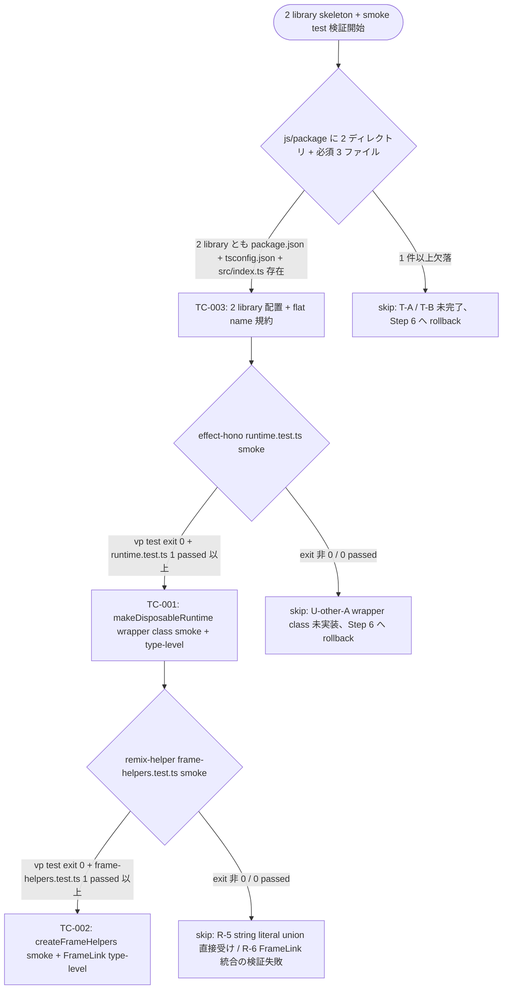
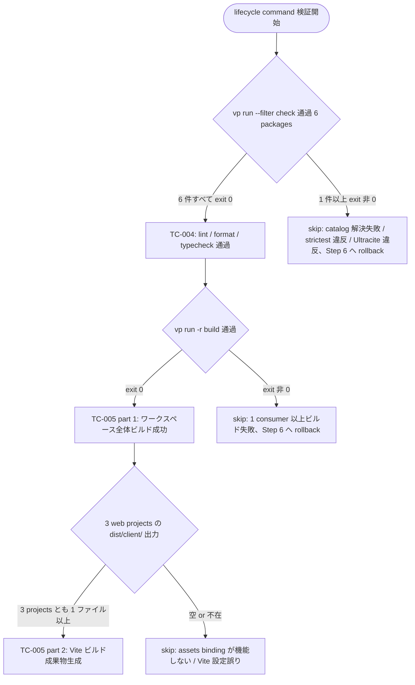
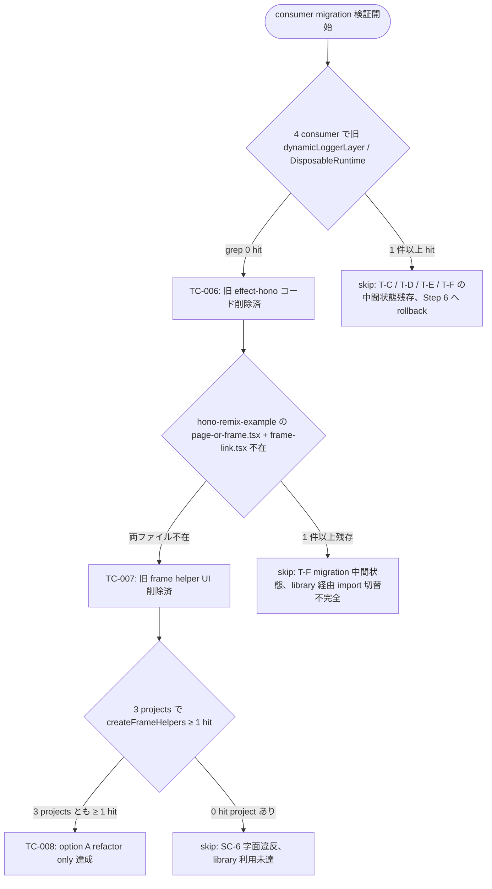
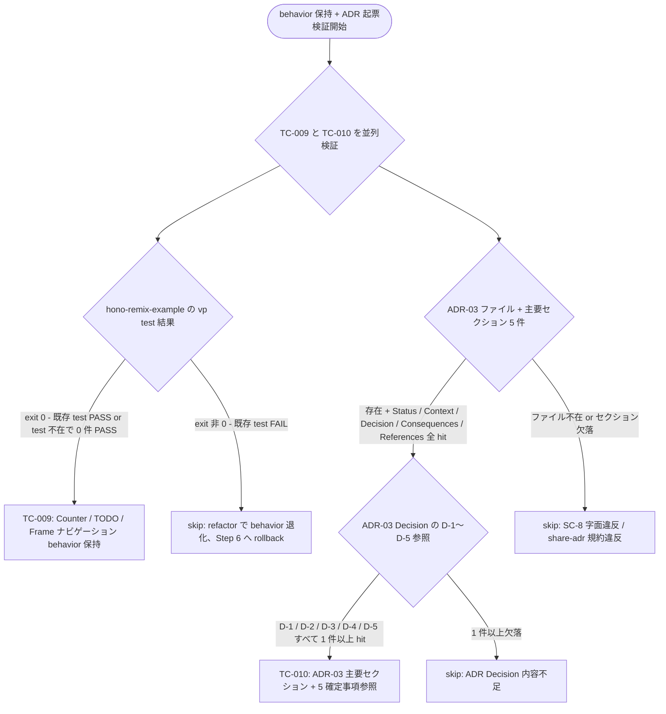
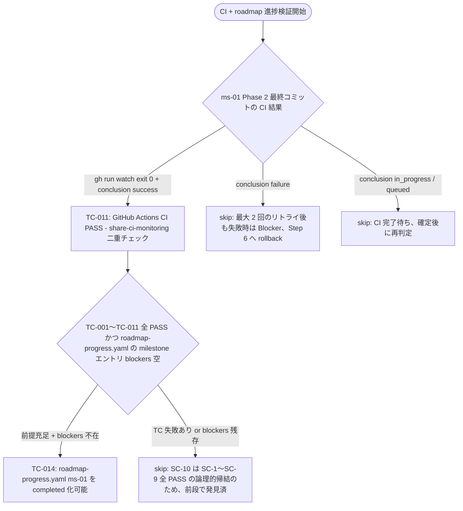
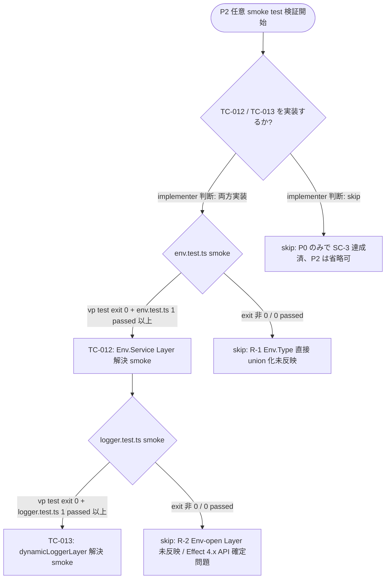
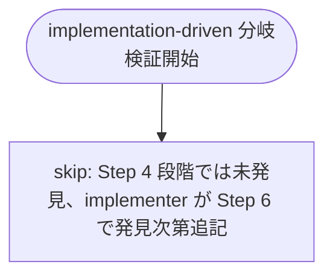

# QA Flow: feed-platform Shared Libraries (ms-01 Phase 2)

- **Identifier:** feed-platform-ms-01-shared-libraries
- **Author:** qa-analyst (single instance)
- **Source:** `docs/workflow/feed-platform-ms-01-shared-libraries/qa-design.md`
- **Created at:** 2026-05-10T09:00:00Z
- **Last updated:** 2026-05-10T09:00:00Z
- **Status:** draft

本ドキュメントは `qa-design.md` の test cases (TC-001〜TC-014) を **Mermaid flowchart + 実行可能コマンド列** で可視化し、SC 評価の主要分岐ロジックと Step 6 implementer / Step 8 validator が再現可能な手順をレビュー可能な形で示す。詳細な記法ルールは `share-artifacts/references/qa-flow.md` 参照。

## Overview

ms-01 Phase 2 は **2 library skeleton 作成 → 4 consumer 一括 migration → ADR-03 起票** の 3 atomic commit 構造 (design.md L338-352 + L455-466 / Intent Spec L98-L104) に従う。本ドキュメントは関心ごとに 5 セクションへ分割する:

1. **Library skeleton & smoke tests** (SC-1, SC-3 関連) — 2 library 配置 + P0 必須 smoke test 2 件
2. **Lifecycle commands** (SC-2, SC-4 関連) — 6 packages の `vp run --filter <pkg> check` / `vp run -r build` 成功検証
3. **Consumer migration verification** (SC-5, SC-6 関連) — 4 consumer の旧コード削除 + library 利用箇所確認
4. **Behavior preservation & ADR** (SC-7, SC-8 関連) — hono-remix-v3-cloudflare-example smoke + ADR-03 起票
5. **CI & roadmap progression** (SC-9, SC-10 関連) — GitHub Actions PASS + roadmap-progress.yaml `completed` 化可能性

横断的な関心 (error handling 等) は本サイクル特性 (= 観測コマンド失敗時はそのまま FAIL となり追加分岐なし) のため別セクション化しない (Phase 1 同方針)。

### Atomic commit の自動 / 手動検証順序

Step 6 implementer は以下の順序で各 atomic commit を実装し、commit 直前に **対応する TC を local 実行** する:

```text
[atomic 単位 1] Library skeleton 作成 (T-A + T-B)
  ├─ T-A: js/package/effect-hono/ skeleton (package.json, tsconfig.json, src/{env,logger,runtime,index}.ts)
  ├─ T-B: js/package/remix-helper/ skeleton (package.json, tsconfig.json, src/{frame-helpers,index}.ts)
  └─ commit 直前 local 検証:
      ├─ TC-003: ls / node -p で 2 library 配置確認
      ├─ TC-004 (部分): vp run --filter effect-hono check / vp run --filter remix-helper check
      ├─ TC-001: vp run --filter effect-hono test (runtime.test.ts 含む)
      └─ TC-002: vp run --filter remix-helper test (frame-helpers.test.ts 含む)
        ↓
        commit (atomic 単位 1)

[atomic 単位 2] Consumer migration (T-C + T-D + T-E + T-F、中間状態許容なし)
  ├─ T-C: feed-platform-backend feature/{env,runtime/server}.ts → library import
  ├─ T-D: feed-platform-web 同形 + app/routes.ts (type FrameName = never)
  ├─ T-E: identity-provider 同形
  ├─ T-F: hono-remix-v3-cloudflare-example app/routes.ts (type FrameName = 'content') + ui/page-or-frame.tsx + ui/frame-link.tsx 削除
  └─ commit 直前 local 検証:
      ├─ TC-004 (全 6 packages): vp run --filter <pkg> check ×6
      ├─ TC-005: vp run -r build + dist/client/ 出力確認
      ├─ TC-006: grep -rE 'dynamicLoggerLayer|DisposableRuntime' で 0 hit
      ├─ TC-007: ls -la で旧 page-or-frame.tsx / frame-link.tsx 不在確認
      ├─ TC-008: grep -rn 'createFrameHelpers' で 3 projects ≥ 1 hit
      └─ TC-009: vp run --filter hono-remix-v3-cloudflare-example test exit 0
        ↓
        commit (atomic 単位 2)

[atomic 単位 3] ADR-03 起票 (T-G)
  ├─ T-G: docs/roadmap/feed-platform/adr/2026-05-08-shared-libraries-extraction.md を draft → confirmed: true 化
  └─ commit 直前 local 検証:
      └─ TC-010: ファイル存在 + 主要セクション 5 件 + D-1〜D-5 参照の grep
        ↓
        commit (atomic 単位 3)
        ↓
[push 後 CI 検証] Step 8 validator が share-ci-monitoring で観測
  ├─ TC-011: gh run watch --exit-status で CI PASS 確認
  └─ TC-014: roadmap-progress.yaml の completed 化可能性確認 (TC-001〜TC-011 全 PASS の論理的帰結)

[P2 任意 TC] 必要に応じて T-A 完了後に追記
  ├─ TC-012: env.test.ts (Env.Service Layer 解決 smoke)
  └─ TC-013: logger.test.ts (dynamicLoggerLayer 解決 smoke、Effect 4.x API 確定後)
```

各 TC で実行する具体的コマンド列は以下の各セクションの flow chart と「Reproducible commands」ブロックに記載。

---

## 1. Library skeleton & smoke tests

このセクションが対応する成功基準: SC-1, SC-3

2 library の構造存在 + P0 必須 smoke test 2 件 (TC-001 / TC-002) を直列に検証。1 段でも欠落があれば後続 SC は無意味なため**最も先に走らせる** (Phase 1 同方針)。



### Reproducible commands

```bash
# TC-003: 2 library 配置 + flat name 規約
[ -f js/package/effect-hono/package.json ] && [ -f js/package/effect-hono/tsconfig.json ] && [ -f js/package/effect-hono/src/index.ts ]
[ -f js/package/remix-helper/package.json ] && [ -f js/package/remix-helper/tsconfig.json ] && [ -f js/package/remix-helper/src/index.ts ]
node -p "require('./js/package/effect-hono/package.json').name"
# 期待: effect-hono
node -p "require('./js/package/remix-helper/package.json').name"
# 期待: remix-helper
node -p "require('./js/package/effect-hono/package.json').private"
# 期待: true
node -p "require('./js/package/remix-helper/package.json').private"
# 期待: true

# TC-001: effect-hono runtime.test.ts smoke
vp run --filter effect-hono test
echo "exit: $?"
# 期待: exit 0、Vitest 出力に runtime.test.ts の "1 passed" 以上 / "0 failed"

# TC-002: remix-helper frame-helpers.test.ts smoke
vp run --filter remix-helper test
echo "exit: $?"
# 期待: exit 0、Vitest 出力に frame-helpers.test.ts の "1 passed" 以上 / "0 failed"
```

---

## 2. Lifecycle commands

このセクションが対応する成功基準: SC-2, SC-4

6 packages (2 library + 4 consumer) を通した lint / format / typecheck / build の連続検証。コマンドが exit 0 を返すことが PASS の必要十分条件 (Phase 1 同方針)。



### Reproducible commands

```bash
# TC-004: 6 packages の vp run --filter <pkg> check exit 0
for pkg in effect-hono remix-helper feed-platform-backend feed-platform-web identity-provider hono-remix-v3-cloudflare-example; do
  echo "=== ${pkg} ==="
  vp run --filter "${pkg}" check
  echo "exit: $?"
done
# 期待: 6 件すべて exit 0

# TC-005: vp run -r build + 3 web projects の dist/client/ 出力
vp run -r build
echo "exit: $?"
# 期待: exit 0

find js/app/feed-platform-web/dist/client -type f | wc -l
# 期待: ≥ 1
find js/app/identity-provider/dist/client -type f | wc -l
# 期待: ≥ 1
find js/app/hono-remix-v3-cloudflare-example/dist/client -type f | wc -l
# 期待: ≥ 1
```

---

## 3. Consumer migration verification

このセクションが対応する成功基準: SC-5, SC-6

4 consumer projects の **atomic commit (中間状態許容なし)** で実施する migration の完了を grep ベースで検証。effect-hono 移植分 (旧 `dynamicLoggerLayer` / `DisposableRuntime` 削除) と remix-helper 移植分 (旧 `frame-link.tsx` / `page-or-frame.tsx` 削除 + `createFrameHelpers` 利用) の 2 軸を並列に観測する。



### Reproducible commands

```bash
# TC-006: 4 consumer で旧 dynamicLoggerLayer / DisposableRuntime 0 hit (SC-5)
grep -rE 'dynamicLoggerLayer|DisposableRuntime' \
  --include='*.ts' --include='*.tsx' \
  js/app/feed-platform-backend/ \
  js/app/feed-platform-web/ \
  js/app/identity-provider/ \
  js/app/hono-remix-v3-cloudflare-example/ \
  | wc -l
# 期待: 0 (consumer 側に旧コード残存なし)

# TC-007: hono-remix-example の旧 page-or-frame.tsx + frame-link.tsx 削除確認
[ ! -f js/app/hono-remix-v3-cloudflare-example/app/ui/page-or-frame.tsx ] && echo "page-or-frame.tsx removed: OK"
[ ! -f js/app/hono-remix-v3-cloudflare-example/app/ui/frame-link.tsx ] && echo "frame-link.tsx removed: OK"
# 期待: 両ファイル不在 (両行とも "OK" 出力)

# TC-008: 3 projects で createFrameHelpers ≥ 1 hit (SC-6)
for pkg_dir in js/app/feed-platform-web js/app/identity-provider js/app/hono-remix-v3-cloudflare-example; do
  hit_count=$(grep -rn 'createFrameHelpers' --include='*.ts' --include='*.tsx' "${pkg_dir}/" | wc -l)
  echo "${pkg_dir}: ${hit_count} hits"
done
# 期待: 3 projects とも 1 以上
```

---

## 4. Behavior preservation & ADR

このセクションが対応する成功基準: SC-7, SC-8

`hono-remix-v3-cloudflare-example` の既存 behavior 保持 (SC-7) と ADR-03 起票 (SC-8) を並列に検証 (両者は完全独立、相互依存なし)。



### Reproducible commands

```bash
# TC-009: hono-remix-v3-cloudflare-example smoke (既存 behavior 保持)
vp run --filter hono-remix-v3-cloudflare-example test
echo "exit: $?"
# 期待: exit 0 (既存 test 群があれば全 PASS、test 不在の場合は 0 件 PASS で exit 0)

# TC-010 part 1: ADR-03 ファイル存在 + 主要セクション
ADR_PATH="docs/roadmap/feed-platform/adr/2026-05-08-shared-libraries-extraction.md"
[ -f "${ADR_PATH}" ] && echo "ADR-03 file exists: OK"
section_count=$(grep -cE '^## (Status|Context|Decision|Consequences|References)' "${ADR_PATH}")
echo "section count: ${section_count}"
# 期待: ファイル存在 + section count = 5

# TC-010 part 2: D-1〜D-5 参照
for d_id in D-1 D-2 D-3 D-4 D-5; do
  hit=$(grep -c "${d_id}" "${ADR_PATH}")
  echo "${d_id}: ${hit} hits"
done
# 期待: D-1 〜 D-5 すべて 1 hit 以上
```

---

## 5. CI & roadmap progression

このセクションが対応する成功基準: SC-9, SC-10

GitHub Actions の `vp run --parallel ci` 結果を `share-ci-monitoring` 二重チェックで観測し、TC-001〜TC-011 全 PASS の前提下で `roadmap-progress.yaml` の `completed` 化可能性を最終ゲートとして判定する (Phase 1 同方針)。



### Reproducible commands

```bash
# TC-011: GitHub Actions CI PASS (share-ci-monitoring 二重チェック)
BRANCH="feed-platform-ms-01-shared-libraries"
gh run list --branch "${BRANCH}" --workflow ci.yaml --json conclusion,headSha,databaseId --limit 1
# 期待: conclusion = "success"

RUN_ID=$(gh run list --branch "${BRANCH}" --workflow ci.yaml --json databaseId --limit 1 -q '.[0].databaseId')
gh run watch --exit-status "${RUN_ID}"
echo "exit: $?"
# 期待: exit 0

# TC-014: roadmap-progress.yaml ms-01 completed 化可能性
yq '.milestones[] | select(.id == "ms-01-workspace-foundation")' \
  docs/roadmap/feed-platform/roadmap-progress.yaml
# 期待: blockers が空 or 未定義、status を completed に書き換え可能
```

---

## P2 (任意) — Optional library smoke tests

このセクションが対応する成功基準: SC-3 補完 (P0 で達成済、P2 で品質向上)

`effect-hono` の env / logger smoke test を **必要に応じて** 追加。Step 6 implementer が library 実装後に判断し、書く場合は P0 と同一 file 配置規約 (`src/<name>.test.ts` colocation) に従う。



### Reproducible commands (P2 任意、書く場合のみ実行)

```bash
# TC-012: effect-hono env.test.ts smoke (任意)
vp run --filter effect-hono test
echo "exit: $?"
# 期待: exit 0、Vitest 出力に env.test.ts の "1 passed" 以上 (実装した場合のみ)

# TC-013: effect-hono logger.test.ts smoke (任意、Step 6 implementer の Effect 4.x API 確定後)
vp run --filter effect-hono test
echo "exit: $?"
# 期待: exit 0、Vitest 出力に logger.test.ts の "1 passed" 以上 (実装した場合のみ)
```

---

## Cross-cutting concerns

本サイクルでは以下の理由で**横断的セクションを設けない** (Phase 1 同方針):

- **エラーハンドリング**: 各 TC の観測コマンド (`ls` / `grep` / `vp run` / `gh run view` / `yq`) が exit 非 0 を返した場合は **そのまま FAIL** として扱い、本図の各 `FAIL<N>` 葉に集約済み
- **リトライ**: TC-011 (CI) のみ share-ci-monitoring の最大 2 回リトライ規約を持つが、これはセクション 5 の `FAIL1` 葉内で「最大 2 回のリトライ後も失敗時は Blocker」として吸収
- **ロギング**: Step 8 の validator が各 TC の実行ログを `validation-evidence/<TC-ID>.log` に残す方針 (qa-design.md test file placement policy 節)。ロギング自体の構造的要件は本サイクルでも存在しない
- **adapter pattern verification**: consumer 側 `getContext().req.raw` 1 行 helper (design.md L82-99) は機械的 boilerplate (4 project 各 1 箇所のみ) のため独立 TC 不要、TC-004 (typecheck) + TC-009 (hono-example smoke) で間接担保

---

## Implementation-driven branches

Step 4 段階では空。Step 6 で implementer が `effect@4.0.0-beta.60` の `Logger.replaceEffect` / `Layer.effect` 等の固有挙動、Vitest `expectTypeOf` の `T extends string` 推論、`vite-plus/test` の library package 振る舞いに起因する追加分岐を発見した場合のみ、本セクションに `TC-IMPL-NNN` 葉を持つ Mermaid 図を追加する。



---

## Summary

Step 4 で TC-001〜TC-014 の **14 件** を 5 セクション (Library skeleton & smoke / Lifecycle / Migration / Behavior & ADR / CI & roadmap) + P2 任意セクションに分類して flow chart 化、SC-1〜SC-10 のうち **10 件すべて** が観測手段確定。Step 6 implementer が atomic 単位 1〜3 の各 commit 直前に対応 TC を local 実行することで、push 前に SC 達成を局所的に確認可能。carry-over to Step 5 (Task Decomposition) は qa-design.md Summary に記載の 4 件 (CO-1〜CO-4)。
