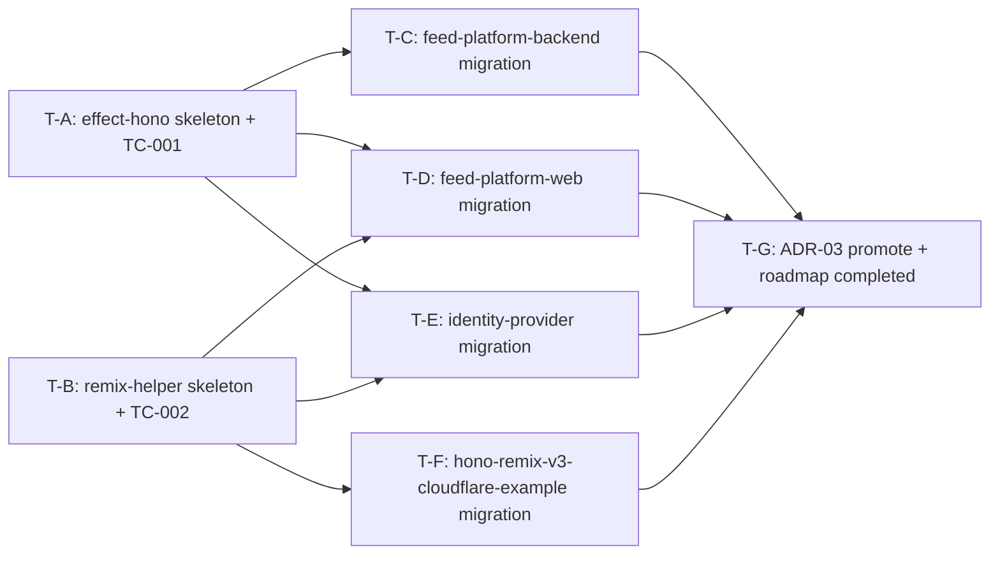

# Task Plan: feed-platform Shared Libraries (ms-01 Phase 2)

- **Identifier:** feed-platform-ms-01-shared-libraries
- **Author:** task-decomposer (single instance)
- **Source:** `design.md` (R-1〜R-6 反映済), `qa-design.md` (TC-001〜TC-014), `qa-flow.md`, `progress.yaml.step3_design_inputs` + `step3_design_revisions` + `step4_qa_carry_over`
- **Created at:** 2026-05-10T10:30:00Z
- **Status:** draft

本 task-plan は Step 5 で確定する **immutable plan**。Step 6-7 のタスク状態追跡は `TODO.md` (implementer × Main で更新) と Main の `TaskCreate` を併用する。

## Premises

- design.md の Handoff notes (T-A〜T-G、7 タスク) を一次入力に sub-task 粒度まで分解
- 1 タスク = 1 atomic commit (= 中間状態許容なし、Phase 1 ADR-01 D-6 慣行継承、design.md L387-389)
- 1 タスク = 1 implementer specialist で完遂可能 (S = ≤30min / M = 30min〜2h / L = 2h+、Phase 1 同規約)
- 並列実行可能な単位は "Parallelizable groups" 節の Wave で示す
- 各タスクの完了は **対応 TC が PASS する状態 + 該当 commit が push 済 + CI PASS** で判定 (Step 6 での Main gate 判定は qa-design.md TC を観測)
- ADR-03 は本 cycle Step 3 で draft 起票済 (`docs/roadmap/feed-platform/adr/2026-05-08-shared-libraries-extraction.md`、`confirmed: false`)、T-G で `confirmed: true` に promote
- `vp run` ベースの操作のみ採用 (`npx` / `bunx` / 直接 `tsc` は使用しない)
- design.md "Public API surface" は本 task-plan で変更不可 (= 実装ステップの定義のみ)

## Step 4 carry-over の反映 (CO-1〜CO-4)

`progress.yaml.step4_qa_carry_over` の 4 件を以下の通り task に紐付ける:

- **CO-1**: TC-001 (P0 makeDisposableRuntime smoke) を **T-A 内 sub-task** として `runtime.test.ts` 実装 + 通過確認の形で含める。実装 + smoke test を同一 atomic commit に置く (split しない)。TC-002 (P0 createFrameHelpers smoke) を **T-B 内 sub-task** として同様に含める
- **CO-2**: TC-006 (旧 `dynamicLoggerLayer` / `DisposableRuntime` 0 hit) を **T-C / T-D / T-E** の各 atomic commit 直前に `grep` 観測として実行。TC-007 (旧 `page-or-frame.tsx` / `frame-link.tsx` 不在) を **T-F** の atomic commit 直前に `ls`/`[ ! -f ]` 観測として実行。TC-008 (`createFrameHelpers` ≥ 1 hit) を **T-D / T-E / T-F** の各 commit 直前に `grep` 観測として実行 (3 projects = web / IdP / hono-remix-example)
- **CO-3**: TC-013 (P2 logger.test.ts) は **T-A 内 sub-task として書かない**。Effect 4.x の Logger 構成 API (`Logger.replaceEffect` / `Layer.effect`) は Step 6 implementer が `node_modules/effect/dist/dts/Logger.d.ts` / `Layer.d.ts` を引いて確定するため、T-A 完了後に implementer 判断で `src/logger.test.ts` を追加する余地のみ残す (本 task-plan には sub-task として記載しない)
- **CO-4**: TC-009 (hono-example smoke、test 不在の場合の `vp run --filter <pkg> test` exit 0 振る舞い) を **T-F の前提**として明記。Vite+ は test 0 件 PASS でも exit 0 を返す仕様 (qa-flow.md L239、Phase 1 既存 example test 群があれば全 PASS、なければ 0 件 PASS で OK)

## Task list

### T-A: effect-hono library skeleton + TC-001 smoke test

- **Summary:** `js/package/effect-hono/` を作成し、`package.json` / `tsconfig.json` / `src/{env,logger,runtime,index}.ts` + `src/runtime.test.ts` を配置する。R-1 (`Env.Type` 直接 union) / R-2 (`dynamicLoggerLayer` Env-open) / U-other-A (`makeDisposableRuntime` wrapper class) を反映。`pnpm install` 後に workspace に取り込まれ、`vp run --filter effect-hono check` / `vp run --filter effect-hono test` がいずれも exit 0
- **Atomic commit content (中間状態許容なし):**
  - `js/package/effect-hono/package.json` (新規、name: `effect-hono` / private: true / type: module / exports: `{ ".": "./src/index.ts" }`)
  - `js/package/effect-hono/tsconfig.json` (新規、`extends: ["@totto2727/fp/tsconfig/vite"]`)
  - `js/package/effect-hono/src/env.ts` (新規、R-1 `Type = 'production' | 'development'` 直接 union + `Service` Context.Service tag + `layer` (Layer.sync from `process.env.NODE_ENV`) + `makeLayer` (test 用))
  - `js/package/effect-hono/src/logger.ts` (新規、R-2 `dynamicLoggerLayer: Layer.Layer<never, never, Env.Type>` Env-open。具体 Effect 4.x API は implementer が `effect/dist/dts/Logger.d.ts` / `Layer.d.ts` を引いて確定、`Layer.unwrap` / `Layer.provide(Env.layer)` は library 側で行わない)
  - `js/package/effect-hono/src/runtime.ts` (新規、`makeDisposableRuntime<Args, R, ER>` wrapper class factory)
  - `js/package/effect-hono/src/index.ts` (新規、barrel: `export * as Env from './env.ts'` + `export * from './runtime.ts'` + `export * from './logger.ts'`)
  - `js/package/effect-hono/src/runtime.test.ts` (新規、TC-001 P0: `Layer.empty` + `ManagedRuntime.make(empty)` 経由 `await using` scope smoke + `expectTypeOf` 型レベル assertion)
- **TC binding:** TC-001 (P0、本 commit 内 verification として `vp run --filter effect-hono test` exit 0 で観測) / TC-003 (本 commit で 2 library のうち effect-hono 部分を充足) / TC-004 (本 commit 直前 `vp run --filter effect-hono check` exit 0 で観測)
- **依存関係:** なし (Wave 1 root、T-B と完全並列)
- **完了条件:**
  - 6 ファイル (package.json / tsconfig.json / src の 5 ファイル) が配置済
  - `pnpm install` 後 workspace に取り込み確認 (`pnpm ls --filter effect-hono`)
  - `vp run --filter effect-hono check` exit 0
  - `vp run --filter effect-hono test` exit 0、Vitest 出力に `runtime.test.ts` の `1 passed` 以上 / `0 failed`
  - atomic commit 1 本 (中間 push 不可)
- **見積り粒度:** M (30min〜2h、Effect 4.x API 確定を含む)
- **手順:**

```bash
# 1. ディレクトリ + package.json + tsconfig.json + src/{env,logger,runtime,index}.ts + src/runtime.test.ts 作成
#    (詳細は design.md "Library 構成" L300-322 / "Public API surface" L102-205 参照)

# 2. workspace 取り込み確認
pnpm install
pnpm ls --filter effect-hono

# 3. lint / format / typecheck
vp run --filter effect-hono check

# 4. smoke test (TC-001)
vp run --filter effect-hono test

# 5. atomic commit (中間状態許容なし、push は Main agent が判断)
git add js/package/effect-hono/
git commit -m "feat(dev-workflow/feed-platform-ms-01-shared-libraries/T-A): effect-hono skeleton + TC-001"
```

### T-B: remix-helper library skeleton + TC-002 smoke test

- **Summary:** `js/package/remix-helper/` を作成し、`package.json` / `tsconfig.json` / `src/{frame-helpers,index}.ts` + `src/frame-helpers.test.ts` を配置する。R-5 (`<T extends string>` で string literal union 直接受け、`InferFrameName` 廃止) / R-6 (`FrameLink` を `helpers.FrameLink` として統合) / U-3 (Hono フリー化、`getContext` 等の context primitive 不使用) を反映
- **Atomic commit content (中間状態許容なし):**
  - `js/package/remix-helper/package.json` (新規、name: `remix-helper` / private: true / exports: `{ ".": "./src/index.ts" }`、peerDependencies に `remix: catalog:remix`、`hono` は **含めない**)
  - `js/package/remix-helper/tsconfig.json` (新規、`extends: ["@totto2727/fp/tsconfig/vite"]` + `jsxImportSource: "remix/ui"`)
  - `js/package/remix-helper/src/frame-helpers.ts` (新規、`createFrameHelpers<T extends string>()` factory + `FrameHelpers<T>` interface (`isFrameRequest` / `createPageOrFrame` / `FrameLink`))
  - `js/package/remix-helper/src/index.ts` (新規、barrel: `export * from './frame-helpers.ts'`)
  - `js/package/remix-helper/src/frame-helpers.test.ts` (新規、TC-002 P0: `createFrameHelpers<'a' | 'b'>()` + `Request` smoke + `expectTypeOf` 型レベル + `// @ts-expect-error`)
- **TC binding:** TC-002 (P0、本 commit 内 verification として `vp run --filter remix-helper test` exit 0 で観測) / TC-003 (本 commit で 2 library のうち remix-helper 部分を充足) / TC-004 (本 commit 直前 `vp run --filter remix-helper check` exit 0 で観測)
- **依存関係:** なし (Wave 1 root、T-A と完全並列)
- **完了条件:**
  - 5 ファイル (package.json / tsconfig.json / src の 3 ファイル) が配置済
  - `pnpm install` 後 workspace に取り込み確認 (`pnpm ls --filter remix-helper`)
  - `vp run --filter remix-helper check` exit 0
  - `vp run --filter remix-helper test` exit 0、Vitest 出力に `frame-helpers.test.ts` の `1 passed` 以上 / `0 failed`
  - `grep -n 'hono' js/package/remix-helper/package.json` で 0 hit (U-3 Hono フリー化担保)
  - atomic commit 1 本
- **見積り粒度:** M (30min〜2h)
- **手順:**

```bash
# 1. ディレクトリ + 5 ファイル作成
#    (詳細は design.md "Library 構成" L312-322 / "Public API surface" L207-294 参照)

# 2. workspace 取り込み確認
pnpm install
pnpm ls --filter remix-helper

# 3. Hono フリー化担保 (U-3)
grep -n 'hono' js/package/remix-helper/package.json
# 期待: 0 hit

# 4. lint / format / typecheck
vp run --filter remix-helper check

# 5. smoke test (TC-002)
vp run --filter remix-helper test

# 6. atomic commit
git add js/package/remix-helper/
git commit -m "feat(dev-workflow/feed-platform-ms-01-shared-libraries/T-B): remix-helper skeleton + TC-002"
```

### T-C: feed-platform-backend を effect-hono に migrate

- **Summary:** `feed-platform-backend/src/feature/env.ts` / `src/feature/runtime/server.ts` を library import に切替、旧 `dynamicLoggerLayer` 定義 / 旧 `makeDisposableRuntime` HOF / 旧 `DisposableRuntime` interface を削除。`src/feature/runtime/hono.ts` の `Variables.runtime: Runtime.Runtime` 型源を `ReturnType<typeof makeRuntime>` に変更 (Phase 1 同形、design.md L345-347)
- **Atomic commit content (中間状態許容なし、library import 未参照 + 旧コード残存の中間状態は禁止):**
  - `js/app/feed-platform-backend/src/feature/env.ts` (修正、`import { Env } from 'effect-hono'` に切替 + 旧 `Env.Type` / `Env.Service` / `Env.layer` / `Env.makeLayer` 定義削除)
  - `js/app/feed-platform-backend/src/feature/runtime/server.ts` (修正、`import { dynamicLoggerLayer, makeDisposableRuntime } from 'effect-hono'` に切替 + 旧 `dynamicLoggerLayer` 定義 + 旧 `makeDisposableRuntime` HOF + 旧 `DisposableRuntime` interface 削除)
  - `js/app/feed-platform-backend/src/feature/runtime/hono.ts` (修正、`Variables.runtime` 型源を `ReturnType<typeof makeRuntime>` に変更)
  - `js/app/feed-platform-backend/package.json` (修正、`devDependencies` に `effect-hono: workspace:*` 追加、Phase 1 ADR-01 D-6 のフルバンドル運用整合)
- **TC binding:** TC-004 (本 commit 直前 `vp run --filter feed-platform-backend check` exit 0) / TC-006 (本 commit 直前 `grep -rE 'dynamicLoggerLayer\|DisposableRuntime' --include='*.ts' --include='*.tsx' js/app/feed-platform-backend/` で 0 hit、CO-2 反映)
- **依存関係:** T-A 完了。T-D / T-E と完全並列実行可能
- **完了条件:**
  - 3 ファイル (`feature/env.ts` / `feature/runtime/server.ts` / `feature/runtime/hono.ts`) 修正済
  - `package.json.devDependencies['effect-hono']` が `workspace:*` で追加済
  - `vp run --filter feed-platform-backend check` exit 0
  - `vp run --filter feed-platform-backend test` exit 0 (既存 `feature/health.test.ts` 等の regression なし)
  - `grep -rE 'dynamicLoggerLayer|DisposableRuntime' --include='*.ts' --include='*.tsx' js/app/feed-platform-backend/` hit 数 **0** (TC-006 充足)
  - atomic commit 1 本
- **見積り粒度:** S (≤30min、機械的 import 切替 + 旧コード削除のみ)
- **手順:**

```bash
# 1. feature/env.ts / feature/runtime/server.ts / feature/runtime/hono.ts を修正
#    (詳細は design.md "Consumer 側の旧 / 新コード差分" L355-360 参照)

# 2. package.json.devDependencies に effect-hono 追加 + pnpm install
pnpm install

# 3. lint / format / typecheck
vp run --filter feed-platform-backend check

# 4. regression test
vp run --filter feed-platform-backend test

# 5. CO-2 (TC-006): 旧コード残存 0 hit 確認
grep -rE 'dynamicLoggerLayer|DisposableRuntime' \
  --include='*.ts' --include='*.tsx' \
  js/app/feed-platform-backend/ \
  | wc -l
# 期待: 0

# 6. atomic commit
git add js/app/feed-platform-backend/
git commit -m "refactor(dev-workflow/feed-platform-ms-01-shared-libraries/T-C): migrate feed-platform-backend to effect-hono"
```

### T-D: feed-platform-web を effect-hono + remix-helper に migrate

- **Summary:** `feed-platform-web/app/feature/env.ts` / `app/feature/runtime/server.ts` を effect-hono に切替 (T-C 同形)。`app/routes.ts` を `type FrameName = never` + `import { createFrameHelpers } from 'remix-helper'` + `c.req.raw` adapter pattern (design.md L82-99) に置換。SC-6 を refactor only option A で達成
- **Atomic commit content (中間状態許容なし):**
  - `js/app/feed-platform-web/app/feature/env.ts` (修正、effect-hono import 切替)
  - `js/app/feed-platform-web/app/feature/runtime/server.ts` (修正、effect-hono import 切替)
  - `js/app/feed-platform-web/app/feature/runtime/hono.ts` (修正、`Variables.runtime` 型源変更、T-C 同形)
  - `js/app/feed-platform-web/app/routes.ts` (修正、`type FrameName = never` 1 行宣言 + `const helpers = createFrameHelpers<FrameName>()` + `getContext().req.raw` adapter)
  - `js/app/feed-platform-web/package.json` (修正、`devDependencies` に `effect-hono: workspace:*` + `remix-helper: workspace:*` 追加)
- **TC binding:** TC-004 (本 commit 直前 `vp run --filter feed-platform-web check` exit 0) / TC-006 (本 commit 直前 grep 0 hit、CO-2 反映) / TC-008 (本 commit 直前 `grep -rn 'createFrameHelpers' --include='*.ts' --include='*.tsx' js/app/feed-platform-web/` で ≥ 1 hit、CO-2 反映)
- **依存関係:** T-A 完了 + T-B 完了。T-C / T-E と完全並列実行可能
- **完了条件:**
  - 4 ファイル修正済 (`feature/env.ts` / `feature/runtime/server.ts` / `feature/runtime/hono.ts` / `routes.ts`)
  - `package.json.devDependencies` に 2 library 追加済
  - `vp run --filter feed-platform-web check` exit 0
  - `vp run --filter feed-platform-web test` exit 0 (既存 `feature/{greeting,health}.test.ts` 等の regression なし)
  - `grep -rE 'dynamicLoggerLayer|DisposableRuntime' --include='*.ts' --include='*.tsx' js/app/feed-platform-web/` 0 hit (TC-006)
  - `grep -rn 'createFrameHelpers' --include='*.ts' --include='*.tsx' js/app/feed-platform-web/` ≥ 1 hit (TC-008)
  - atomic commit 1 本
- **見積り粒度:** M (30min〜2h、`routes.ts` の adapter 構築 + 2 library 同時 migration)
- **手順:**

```bash
# 1. feature/env.ts / feature/runtime/{server,hono}.ts / routes.ts を修正
#    (routes.ts の adapter pattern は design.md "Consumer migration の adapter 統一 pattern" L82-99 参照)

# 2. package.json.devDependencies に effect-hono + remix-helper 追加 + pnpm install
pnpm install

# 3. lint / format / typecheck
vp run --filter feed-platform-web check

# 4. regression test
vp run --filter feed-platform-web test

# 5. CO-2 verification
grep -rE 'dynamicLoggerLayer|DisposableRuntime' --include='*.ts' --include='*.tsx' js/app/feed-platform-web/ | wc -l
# 期待: 0
grep -rn 'createFrameHelpers' --include='*.ts' --include='*.tsx' js/app/feed-platform-web/ | wc -l
# 期待: ≥ 1

# 6. atomic commit
git add js/app/feed-platform-web/
git commit -m "refactor(dev-workflow/feed-platform-ms-01-shared-libraries/T-D): migrate feed-platform-web to effect-hono + remix-helper"
```

### T-E: identity-provider を effect-hono + remix-helper に migrate

- **Summary:** T-D と完全同形 (`identity-provider/app/feature/{env,runtime/server,runtime/hono}.ts` + `app/routes.ts`)。`type FrameName = never` で空相当 (option A、SC-6 達成)
- **Atomic commit content (中間状態許容なし):**
  - `js/app/identity-provider/app/feature/env.ts` (修正、T-D 同形)
  - `js/app/identity-provider/app/feature/runtime/server.ts` (修正、T-D 同形)
  - `js/app/identity-provider/app/feature/runtime/hono.ts` (修正、T-D 同形)
  - `js/app/identity-provider/app/routes.ts` (修正、`type FrameName = never` + `createFrameHelpers<FrameName>()` + adapter)
  - `js/app/identity-provider/package.json` (修正、`devDependencies` に `effect-hono: workspace:*` + `remix-helper: workspace:*` 追加)
- **TC binding:** TC-004 / TC-006 (本 commit 直前 grep 0 hit、CO-2 反映) / TC-008 (本 commit 直前 grep ≥ 1 hit、CO-2 反映)
- **依存関係:** T-A 完了 + T-B 完了。T-C / T-D と完全並列実行可能
- **完了条件:** T-D 同形 (`vp run --filter identity-provider check` / `test` exit 0、TC-006 / TC-008 観測)
- **見積り粒度:** M (30min〜2h、T-D とほぼコピー作業)
- **手順:**

```bash
# 1. feature/env.ts / feature/runtime/{server,hono}.ts / routes.ts を修正 (T-D 同形)

# 2. package.json.devDependencies 追加 + pnpm install
pnpm install

# 3. lint / format / typecheck
vp run --filter identity-provider check

# 4. regression test
vp run --filter identity-provider test

# 5. CO-2 verification
grep -rE 'dynamicLoggerLayer|DisposableRuntime' --include='*.ts' --include='*.tsx' js/app/identity-provider/ | wc -l
# 期待: 0
grep -rn 'createFrameHelpers' --include='*.ts' --include='*.tsx' js/app/identity-provider/ | wc -l
# 期待: ≥ 1

# 6. atomic commit
git add js/app/identity-provider/
git commit -m "refactor(dev-workflow/feed-platform-ms-01-shared-libraries/T-E): migrate identity-provider to effect-hono + remix-helper"
```

### T-F: hono-remix-v3-cloudflare-example を remix-helper に migrate

- **Summary:** `hono-remix-v3-cloudflare-example/app/routes.ts` を `type FrameName = 'content'` + `createFrameHelpers<FrameName>()` + adapter pattern に置換。`app/ui/page-or-frame.tsx` (PageOrFrame、約 30 行) と `app/ui/frame-link.tsx` (FrameLink、約 30 行) を **両ファイル削除**。`app/ui/content-layout.tsx` の `createPageOrFrame(frame, Layout)(request)` の `request` bind は consumer adapter (`getContext().req.raw`) で行う形に修正。Counter / TODO 既存 behavior は SC-7 で保持
- **Atomic commit content (中間状態許容なし):**
  - `js/app/hono-remix-v3-cloudflare-example/app/routes.ts` (修正、`type FrameName = 'content'` + `createFrameHelpers<FrameName>()` + `FrameLink` re-export + adapter)
  - `js/app/hono-remix-v3-cloudflare-example/app/ui/page-or-frame.tsx` (**削除**)
  - `js/app/hono-remix-v3-cloudflare-example/app/ui/frame-link.tsx` (**削除**)
  - `js/app/hono-remix-v3-cloudflare-example/app/ui/content-layout.tsx` (修正、`createPageOrFrame(frame, Layout)(request)` 経由化)
  - `js/app/hono-remix-v3-cloudflare-example/package.json` (修正、`devDependencies` に `remix-helper: workspace:*` 追加)
- **TC binding:** TC-004 / TC-007 (本 commit 直前 `[ ! -f .../page-or-frame.tsx ]` + `[ ! -f .../frame-link.tsx ]` 両成立、CO-2 反映) / TC-008 (本 commit 直前 grep ≥ 1 hit、CO-2 反映) / TC-009 (本 commit 直前 `vp run --filter hono-remix-v3-cloudflare-example test` exit 0、test 不在の場合は 0 件 PASS で exit 0、CO-4 前提)
- **依存関係:** T-B 完了 (T-A は不要、effect-hono は本 project の consumer 対象外)。T-C / T-D / T-E と完全並列実行可能
- **完了条件:**
  - `routes.ts` 修正済 + `page-or-frame.tsx` / `frame-link.tsx` の 2 ファイル削除済 + `content-layout.tsx` 修正済
  - `package.json.devDependencies['remix-helper']` 追加済
  - `vp run --filter hono-remix-v3-cloudflare-example check` exit 0
  - `vp run --filter hono-remix-v3-cloudflare-example test` exit 0 (既存 test 群があれば全 PASS、なければ 0 件 PASS で OK = CO-4)
  - `[ ! -f js/app/hono-remix-v3-cloudflare-example/app/ui/page-or-frame.tsx ]` 成立 (TC-007)
  - `[ ! -f js/app/hono-remix-v3-cloudflare-example/app/ui/frame-link.tsx ]` 成立 (TC-007)
  - `grep -rn 'createFrameHelpers' --include='*.ts' --include='*.tsx' js/app/hono-remix-v3-cloudflare-example/` ≥ 1 hit (TC-008)
  - atomic commit 1 本
- **見積り粒度:** M (30min〜2h、`routes.ts` 置換 + 2 ファイル削除 + `content-layout.tsx` adapter 経由化)
- **手順:**

```bash
# 1. app/routes.ts を修正 (type FrameName = 'content' + createFrameHelpers<FrameName>() + adapter + FrameLink re-export)
# 2. app/ui/page-or-frame.tsx + app/ui/frame-link.tsx を削除
git rm js/app/hono-remix-v3-cloudflare-example/app/ui/page-or-frame.tsx
git rm js/app/hono-remix-v3-cloudflare-example/app/ui/frame-link.tsx
# 3. app/ui/content-layout.tsx を修正 (createPageOrFrame(frame, Layout)(request) 経由化、request は adapter で bind)

# 4. package.json.devDependencies に remix-helper 追加 + pnpm install
pnpm install

# 5. lint / format / typecheck
vp run --filter hono-remix-v3-cloudflare-example check

# 6. regression test (CO-4: 既存 test 群があれば全 PASS、なければ 0 件 PASS で exit 0)
vp run --filter hono-remix-v3-cloudflare-example test

# 7. CO-2 verification (TC-007 + TC-008)
[ ! -f js/app/hono-remix-v3-cloudflare-example/app/ui/page-or-frame.tsx ] && echo "page-or-frame.tsx removed: OK"
[ ! -f js/app/hono-remix-v3-cloudflare-example/app/ui/frame-link.tsx ] && echo "frame-link.tsx removed: OK"
grep -rn 'createFrameHelpers' --include='*.ts' --include='*.tsx' js/app/hono-remix-v3-cloudflare-example/ | wc -l
# 期待: ≥ 1

# 8. atomic commit
git add js/app/hono-remix-v3-cloudflare-example/
git commit -m "refactor(dev-workflow/feed-platform-ms-01-shared-libraries/T-F): migrate hono-remix-v3-cloudflare-example to remix-helper"
```

### T-G: ADR-03 を `confirmed: true` に promote + roadmap-progress completed 化

- **Summary:** `docs/roadmap/feed-platform/adr/2026-05-08-shared-libraries-extraction.md` の frontmatter `confirmed` を `false → true` に切り替え、本 cycle の実装結果と整合させる。`docs/roadmap/feed-platform/roadmap-progress.yaml` の `milestones[ms-01-workspace-foundation]` を Phase 1 + Phase 2 完了状態として `completed` に再遷移可能化 (SC-10 達成)。最終 push 後 GitHub Actions CI PASS を share-ci-monitoring 二重チェックで確認
- **Atomic commit content (中間状態許容なし):**
  - `docs/roadmap/feed-platform/adr/2026-05-08-shared-libraries-extraction.md` (修正、`confirmed: true` 化 + 必要に応じて Status / Context / Decision / Consequences / References 5 セクション + D-1〜D-5 参照を最終確認)
  - `docs/roadmap/feed-platform/roadmap-progress.yaml` (修正、`milestones[ms-01-workspace-foundation].status` を `completed` に再遷移、Phase 2 完了 note を追記)
- **TC binding:** TC-005 (`vp run -r build` exit 0 + 3 web projects `dist/client/` ≥ 1 ファイル) / TC-010 (ADR-03 ファイル存在 + 5 セクション + D-1〜D-5 参照) / TC-011 (本 commit push 後 GitHub Actions CI PASS、share-ci-monitoring 二重チェック) / TC-014 (本 commit 後 `roadmap-progress.yaml` の `blockers` が空 + `completed` 化可能)
- **依存関係:** T-A〜T-F 完了 (= 全実装 commit が main branch ベースで揃った状態)
- **完了条件:**
  - ADR-03 ファイルが `confirmed: true` で更新済、5 セクション + D-1〜D-5 参照を満たす
  - `roadmap-progress.yaml` の `milestones[ms-01-workspace-foundation]` が `completed` 化可能 (Phase 2 完了 note 追記済 + `blockers` 空)
  - `vp run -r build` exit 0、3 web projects (`feed-platform-web` / `identity-provider` / `hono-remix-v3-cloudflare-example`) の `dist/client/` がそれぞれ ≥ 1 ファイル (TC-005)
  - `vp run --parallel ci` または GitHub Actions CI が PASS (TC-011)
  - atomic commit 1 本
- **見積り粒度:** S (≤30min、ADR `confirmed` フラグ切替 + roadmap-progress 更新 + 検証コマンド実行)
- **手順:**

```bash
# 1. ADR-03 を confirmed: true に切替、必要なら 5 セクション + D-1〜D-5 参照を再確認
ADR_PATH="docs/roadmap/feed-platform/adr/2026-05-08-shared-libraries-extraction.md"

# 2. ADR-03 構造検証 (TC-010)
[ -f "${ADR_PATH}" ] && echo "ADR-03 file exists: OK"
grep -cE '^## (Status|Context|Decision|Consequences|References)' "${ADR_PATH}"
# 期待: 5
for d_id in D-1 D-2 D-3 D-4 D-5; do
  hit=$(grep -c "${d_id}" "${ADR_PATH}")
  echo "${d_id}: ${hit} hits"
done
# 期待: D-1 〜 D-5 すべて ≥ 1 hit

# 3. roadmap-progress.yaml を更新 (ms-01 を Phase 2 完了状態として記録)

# 4. ワークスペース全体のビルド検証 (TC-005)
vp run -r build
find js/app/feed-platform-web/dist/client -type f | wc -l                           # 期待: ≥ 1
find js/app/identity-provider/dist/client -type f | wc -l                           # 期待: ≥ 1
find js/app/hono-remix-v3-cloudflare-example/dist/client -type f | wc -l            # 期待: ≥ 1

# 5. roadmap-progress.yaml 検証 (TC-014)
yq '.milestones[] | select(.id == "ms-01-workspace-foundation")' \
  docs/roadmap/feed-platform/roadmap-progress.yaml
# 期待: blockers が空 or 未定義、status が completed に書き換え可能

# 6. atomic commit
git add docs/roadmap/feed-platform/
git commit -m "docs(dev-workflow/feed-platform-ms-01-shared-libraries/T-G): promote ADR-03 to confirmed + ms-01 Phase 2 completed"

# 7. push 後 CI PASS 確認 (TC-011) — Main agent が share-ci-monitoring で実施
```

## Dependency graph



## Parallelizable groups

Step 6 で Main が implementer を起動する際の並列単位。

- **Wave 1 (root):** **T-A || T-B** — 2 library skeleton (完全独立、依存関係なし)
- **Wave 2 (T-A / T-B 完了後):** **T-C || T-D || T-E || T-F** — 4 consumer migration
  - T-C は T-A 完了で開始可能 (effect-hono のみ)
  - T-D / T-E は T-A + T-B 両方完了で開始可能 (effect-hono + remix-helper 両 library 利用)
  - T-F は T-B 完了で開始可能 (remix-helper のみ、effect-hono は consumer 対象外)
- **Wave 3 (Wave 1 + Wave 2 すべて完了後):** **T-G** — ADR-03 promote + roadmap completed (単独)

実用上、Main が同時起動する implementer 数は **2〜3 並列**を上限とする (Phase 1 同方針、specialist-common §6 + Intent Spec 並行サイクル上限 2 整合)。

実行例:

1. **Phase 1**: implementer-A が T-A を実行、**並列に** implementer-B が T-B を実行
2. **Phase 2**: implementer-C が T-C → T-D を逐次実行、**並列に** implementer-D が T-E → T-F を逐次実行 (合計 4 atomic commit)
   - または implementer-C が T-C のみ、implementer-D が T-D + T-F、implementer-E が T-E のように 3 並列も可
3. **Phase 3**: implementer-F が T-G を単独実行

## Risks / anticipated Blockers

- **Effect 4.0.0-beta.60 の Logger 構成 API**: `dynamicLoggerLayer` を `Layer.unwrap` 不使用で構成する具体 API (`Logger.replaceEffect` / `Layer.effect` 等) は Step 6 で `node_modules/effect/dist/dts/Logger.d.ts` / `Layer.d.ts` を引いて確定する (CO-3、design.md L155-160)。Phase 1 retrospective の "即時 corrigendum" プロセス継承
- **`<T extends string>` の string literal union 直接受け推論**: TS 5.9 + `@tsconfig/strictest` 環境で素直に通る前提だが、推論失敗時は T-B の `frame-helpers.test.ts` で `expectTypeOf` 型レベル assertion が早期に検出する (design.md L290-294)
- **`Variables.runtime` 型源変更の影響範囲**: `Phase 1` の `Runtime.Runtime` 型 alias を `ReturnType<typeof makeRuntime>` に切替えた際、Hono `c.var.runtime` の型推論が consumer 側 `makeRuntime` の Layer 内容に依存する。`vp run --filter <pkg> check` exit 0 で typecheck 通過すれば semantic 整合 (Phase 1 既存 pattern 継承、design.md L345-347)
- **`hono-remix-v3-cloudflare-example` の `content-layout.tsx` adapter 経由化**: T-F の最も難易度が高いステップ。`createPageOrFrame(frame, Layout)(request)` の `request` bind を `getContext().req.raw` で行う形に修正する際、Hono context の利用箇所が `routes.ts` 経由になることに注意 (design.md L348)
- **CI 失敗の許容**: T-A〜T-F の各 atomic commit 単独では SC-2 (6 packages all check) を満たさない場合がある (例: T-A 完了時点で T-D / T-E が未着手のため `feed-platform-web` の typecheck が effect-hono 不在で失敗するケース)。Wave 2 完了時点 (T-C / T-D / T-E / T-F すべて完了) で 6 packages の `vp run --parallel ci` PASS を達成すれば許容 (Phase 1 同方針)。最終 push (T-G commit 後) で CI PASS 必須 (TC-011)
- **`vp run -r build` の library 振る舞い**: 2 library (`effect-hono` / `remix-helper`) は `vite.config.ts` を持たないため `build` task 未定義 = Vite+ auto-skip (Phase 1 ADR-01 D-6 慣行整合、design.md L304 / L441)。`vp run -r build` 実行時に library パッケージがエラーで stop しないことを T-G で確認

## Summary

Step 5 で **7 task / 50 sub-task (T-A 9 + T-B 8 + T-C 6 + T-D 8 + T-E 6 + T-F 9 + T-G 4)** を定義、TC binding **14 件** (TC-001〜TC-014 全件、CO-1〜CO-4 反映済) を atomic commit 単位 / 各 commit 直前 verification 単位に紐付け、Step 6 implementer の起動準備完了。並列実行可能タスク: T-A || T-B (Wave 1 skeleton)、T-C || T-D || T-E || T-F (Wave 2 migration)、T-G (Wave 3 single)。
