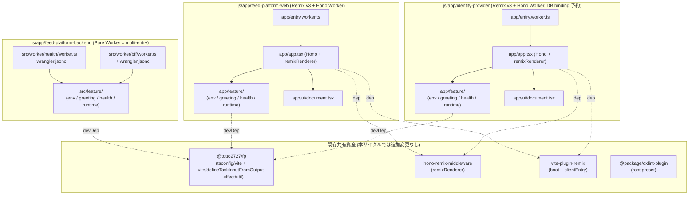
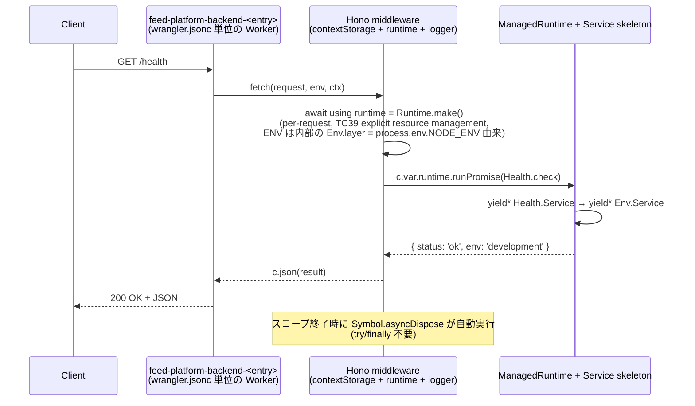
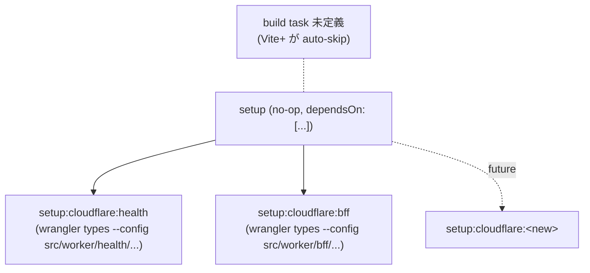

# Design Document: feed-platform Workspace Foundation

- **Identifier:** feed-platform-ms-01-workspace-foundation
- **Author:** architect (single instance)
- **Created at:** 2026-05-06T00:00:00Z
- **Last updated:** 2026-05-06T00:00:00Z
- **Status:** draft

## Design goals and constraints

本サイクルの設計は Intent Spec (`docs/workflow/feed-platform-ms-01-workspace-foundation/intent-spec.md`) の確定事項を最小コードで具現化することに集中する。**実装の中身は持たず、後続マイルストーン (ms-02 以降) が引き継ぐ「土台」を整える**。

- **Purpose (from Intent Spec L17-22):** 3 プロジェクト (`feed-platform-backend` / `feed-platform-web` / `identity-provider`) の最小雛形を `js/app/` 上に配置し、`vp check` / `vp test` / `vp run -r build` が 3 プロジェクトすべてで通過する状態に到達する。バックエンドは Cloudflare Workers + wrangler 直接実行で entry ごとに独立デプロイ可能、Web フロント / IdP は Hono + Remix v3 + Cloudflare Workers パターン (`js/app/hono-remix-v3-cloudflare-example` 踏襲)。ADR-01 (Roadmap mode) / ADR-02 (General mode) を ms-01 内で起票する。
- **Success criteria (Intent Spec L131-152, SC-1〜SC-11):** 観測可能形で SC-1〜SC-11 を満たす。詳細は本ドキュメント末尾の「Mapping to Success Criteria」を参照。
- **Key constraints (Intent Spec L154-180):**
  - 採用ワークスペース `js/`、実行環境 Cloudflare Workers、ビルド: backend = wrangler 直 / web + IdP = Vite + Remix v3 + Cloudflare、テスト = vp (Vitest) で設定 1 個のみ
  - フレームワーク: Hono / Remix v3 / Effect / Vite+ (既存 monorepo 規約)
  - パッケージ管理: pnpm workspace + catalog (既存規約)
  - Lint / Format: Ultracite (Oxlint + Oxfmt)、`vp` 優先 (`npx` / `bunx` 禁止)
  - 個人開発、並行サイクル上限 2 (ms-01 は Wave 0 のため並走なし)
  - 認証認可の実装ロジック / イベントストア / 入出力プラグイン契約 / 定期実行 / AI 要約 / CI デプロイ自動化 はすべて非スコープ

## Approach overview

本サイクルは「**最小限の Hello World レベルでロードマップ Intent の architectural constraints (サーバレス / マイクロサービス境界 / イベントソーシング+CQRS) を構造的に表現する**」ことに尽きる。具体実装は後続が担う。

採用するアプローチは 3 軸の組合せ:

1. **既存例の最大活用**: `feed-platform-web` / `identity-provider` は `js/app/hono-remix-v3-cloudflare-example` を 1:1 でコピーし `name` と最小ハンドラ内容のみ差し替える (Intent Spec Q2.10 / Q2.12 / SC-9 が明示的に踏襲を要求)。`feed-platform-backend` は `js/app/rss-graphql` の純 Worker 構成を出発点とし、SC-5 を満たすため `src/worker/<entry>/worker.ts` + `src/worker/<entry>/wrangler.jsonc` のペアを 2 件配置する multi-entry 派生形を採用する。
2. **Effect 統合は 3 プロジェクト一律の最小スケルトン**: `feature/env.ts` (Layer.sync from `process.env.NODE_ENV` + Layer.succeed via `makeLayer` for tests) + `feature/greeting.ts` (Layer.sync) + `feature/health.ts` (Layer.effect, 1 依存) + `feature/runtime/{server,hono}.ts` (ManagedRuntime + await using middleware) の 5 ファイル群を「3 プロジェクト共通の Effect skeleton」として複製する。これにより SC-6 を満たしつつ、後続マイルストーン (ms-02 BetterAuth / ms-05 EventStore 等) で Service を追加するときの拡張点が明らかになる。Logger 形式 (consoleJson / consolePretty) の選択は **`Layer.unwrap` + `Env.Service` 経由** で実行時判定し、Env Service の値は **`process.env.NODE_ENV`** (= wrangler / vite が dev/deploy 時に自動設定する標準ソース) から導出する (`wrangler.jsonc.vars.ENV` を独自に持たない方針、user gate review refinement Step 7 → Step 8 で再確定)。
3. **Vite+ task 規約の踏襲**: 全プロジェクトで `vite.config.ts` の `run.tasks` に最小定義を置く。`feed-platform-web` / `identity-provider` は `setup:cloudflare` (= `wrangler types`) + `build` の 2 タスク、`feed-platform-backend` は entry ごとに `setup:cloudflare:<entry>` を fan-out する `setup` 親タスクのみを定義し、**`build` タスクは未定義** (= Vite+ は `build` タスクを定義しないパッケージを `vp run -r build` から自動 skip するため、backend は wrangler 直接実行で Vite ビルド不要であることが構造的に表現される)。SC-4 観測 (`vp run -r build`) は backend を skip しつつ web / IdP の Vite ビルドで完走する。

「なぜこのアプローチか」の中心理由: **Intent Spec が「最小雛形 + 既存規約完全踏襲」を最優先方針として確定済みであり、新規パターンの導入や独自規約創出は scope を破壊する**ため、既存資産の活用 + 最小差分の追加で SC-1〜SC-11 を達成する設計が唯一の合理的経路。

## Component breakdown

### 全体構成 (3 プロジェクト並置)



### 主要コンポーネントの責務

| コンポーネント                                       | 責務                                                                                                                                                   | 出典                                                                                 |
| ---------------------------------------------------- | ------------------------------------------------------------------------------------------------------------------------------------------------------ | ------------------------------------------------------------------------------------ |
| `feed-platform-backend` 純 Worker × 2 entry          | SC-5 の「entry ≥ 2」を構造的に担保。各 entry は Hello World (`/health`) + Effect Service skeleton。後続でアダプタ / BFF が独立サーバレス関数として展開 | Intent Spec L70 / SC-5 / `wrangler-multi-entry-monorepo.md` §9                       |
| `feed-platform-web` Remix v3 + Hono Worker           | SSR + 軽量 BFF の責務 (Web ナビゲーション + Cookie ベース認証 (将来))。ms-01 では Hello World 1 ページ + `loader` 経由 JSON 例 1 件                    | Intent Spec L71 / SC-9 / `hono-remix-cloudflare-example-structure.md` §I1            |
| `identity-provider` Remix v3 + Hono Worker (DB 予約) | 汎用認証基幹サーバ。ms-01 ではログイン UI なし、Hello World レベル。`wrangler.jsonc` に DB binding **コメントのみ予約** (実体は ms-02 で追加)          | Intent Spec L72 / Q2.8 / `effect-cloudflare-hono-integration.md` §I-4                |
| 3 プロジェクト共通 Effect skeleton                   | `feature/env.ts` (Layer.succeed) / `feature/greeting.ts` (Layer.sync) / `feature/health.ts` (Layer.effect) / `feature/runtime/{server,hono}.ts`        | `effect-cloudflare-hono-integration.md` §I-1 / saas-example `feature/runtime/*` 同型 |
| 既存共有 workspace package                           | `@totto2727/fp` (tsconfig + vite ヘルパ + effect ヘルパ) / `hono-remix-middleware` / `vite-plugin-remix` / `@package/oxlint-plugin`                    | `vite-plus-task-system-and-existing-packages.md` §G                                  |

### Key types and interfaces

#### Effect Service skeleton (3 プロジェクト共通形 — namespace のみ差し替え)

```typescript
// <project>/<root>/feature/env.ts
import { Context, Layer } from 'effect'

export interface Type {
  readonly ENV: 'production' | 'development'
}
export const Service = Context.Service<Type>('@app/<project-name>/feature/env/Service')

// production code 用 layer: `process.env.NODE_ENV` (wrangler / vite が自動設定する標準ソース) から導出。
//   - `wrangler dev` / `vite` (dev)   → `process.env.NODE_ENV = 'development'`
//   - `wrangler deploy` / `vite build` → `process.env.NODE_ENV = 'production'`
// ref: https://developers.cloudflare.com/workers/wrangler/bundling/#node_env
export const layer = Layer.sync(Service, (): Type => ({
  ENV: process.env.NODE_ENV === 'production' ? 'production' : 'development',
}))

// test 用 layer: 明示値で注入することで Vitest 上での Logger 形式や ENV 振る舞いを固定できる。
export const makeLayer = (env: Type) => Layer.succeed(Service, env)
```

```typescript
// <project>/<root>/feature/greeting.ts
import { Context, Layer } from 'effect'

export interface Type {
  readonly greet: (name: string) => string
}
export const Service = Context.Service<Type>('@app/<project-name>/feature/greeting/Service')
export const layer = Layer.sync(Service, () => ({
  greet: (name) => `Hello, ${name}`,
}))
```

```typescript
// <project>/<root>/feature/health.ts
import { Context, Effect, Layer } from 'effect'
import * as Env from './env.ts'

export interface Type {
  readonly check: () => Effect.Effect<{
    readonly status: 'ok'
    readonly env: Env.Type['ENV']
  }>
}
export const Service = Context.Service<Type>('@app/<project-name>/feature/health/Service')
export const layer = Layer.effect(
  Service,
  Effect.gen(function* () {
    const env = yield* Env.Service
    return {
      check: () => Effect.succeed({ status: 'ok', env: env.ENV }),
    }
  }),
)
```

> Note (Phase 1 deviation, 2026-05-06 記録): 上記スニペットの `Context.Service` は実装と一致させたもの。本 design.md の初版は `ServiceMap.Service<Type>(...)` を採用していたが、`effect@4.0.0-beta.60` (catalog 採用版) では `ServiceMap.Service` の利用形が saas-example と整合せず、3 プロジェクト × 3 service = 全 9 ファイルで `Context.Service` に統一した (TODO.md T-B notes / ADR-01 "Existing impact" に deviation 経緯を記録)。SC-6 観測仕様は `Context.Service|ServiceMap.Service|Layer\.|ManagedRuntime` の OR で hit するため SC 字面とは整合する。

```typescript
// <project>/<root>/feature/runtime/server.ts
import { Effect, Layer, Logger, ManagedRuntime } from 'effect'
import * as Env from '../env.ts'
import * as Greeting from '../greeting.ts'
import * as Health from '../health.ts'

// Env Service から `ENV` を取得して Logger 形式 (consoleJson / consolePretty) を選択する Layer。
// `Layer.unwrap` で `Effect<Layer<...>, ...>` を `Layer` に flatten する。
// 内部で `yield* Env.Service` するため、unwrap 後の Layer は Env を依存として要求する。
// ここで `Layer.provide(Env.layer)` を重ねて Env 依存を完全に閉じ、Logger 専用の独立 Layer に整える。
const dynamicLoggerLayer = Layer.unwrap(
  Effect.gen(function* () {
    const env = yield* Env.Service
    return Logger.layer([env.ENV === 'production' ? Logger.consoleJson : Logger.consolePretty()])
  }),
).pipe(Layer.provide(Env.layer))

const makeRuntime = () =>
  // `Env.layer` (process.env.NODE_ENV 由来) を `provideMerge` で合成して Health (yield* Env) の
  // 依存を閉じる。Logger 用の Env 依存は dynamicLoggerLayer 側で既に閉じているため追加 provide は不要。
  ManagedRuntime.make(
    Health.layer.pipe(
      Layer.provideMerge(Greeting.layer),
      Layer.provideMerge(Env.layer),
      Layer.provide(dynamicLoggerLayer),
    ),
  )

export type Runtime = ReturnType<typeof makeRuntime>

// TC39 explicit resource management (`await using`) で自動破棄するための Disposable wrapper。
// saas-example/src/feature/runtime/server.ts:33-53 のパターンを踏襲。
interface DisposableRuntimeInterface {
  readonly instance: Runtime
  [Symbol.asyncDispose](): Promise<void>
}

const makeDisposableRuntime = (make: typeof makeRuntime) =>
  class DisposableRuntime implements DisposableRuntimeInterface {
    readonly instance: Runtime

    constructor() {
      this.instance = make()
    }

    async [Symbol.asyncDispose](): Promise<void> {
      await this.instance.dispose()
    }
  }

export const DisposableRuntime = makeDisposableRuntime(makeRuntime)

// 公開 entry: Hono middleware から `await using runtime = make()` 形で利用される。
// ENV 取得は `Env.layer` (process.env.NODE_ENV 由来) に内部化したため、引数は不要。
// saas-example が PROD/DEV/TEST 別の DisposableRuntime バリアントを返すのに対し、
// ms-01 雛形では Logger 切替を `dynamicLoggerLayer` (Env.Service 経由) に内部化したため、
// 公開 `make` は単一 Disposable バリアントを返すだけで足りる。
export const make = () => new DisposableRuntime()
```

> Note (Phase 1 deviation, 2026-05-06 記録): 上記 `makeRuntime` の Layer 合成形は本 design.md 初版から二段階で調整されている。
> - **第 1 段階**: 初版は `Layer.provide(dynamicLoggerLayer)` で外側に provide するだけだったが、`dynamicLoggerLayer` 内部の `yield* Env.Service` 依存が閉じないため、`makeRuntime(env)` の中で `Env.makeLayer(env)` を内側にも provide する 2 重 provide 形に修正した。
> - **第 2 段階 (Step 7 → Step 8 user-gate refinement, 2026-05-06)**: ENV 取得を **`process.env.NODE_ENV`** に切り替え、`Env.layer` (production code 用) を新設。`makeRuntime` の `env: Env.Type` 引数は削除し、`Env.layer` を `provideMerge` で合成するだけで Health 依存を閉じる形になった。dynamicLoggerLayer 側の Env 依存も `Layer.provide(Env.layer)` を pipe して独立 Layer に閉じ込め、`makeRuntime` の引数面・合成面ともに簡素化。test は引き続き `Env.makeLayer({ ENV: 'development' })` を Layer.provide することで明示値注入できる。

**設計判断 (Logger 形式の選択方法 + Env Service の値ソース、Step 7 → Step 8 user-gate refinement で確定)**: `import.meta.env.PROD` の直参照ではなく **`Layer.unwrap` + `Env.Service` 経由で `ENV` を読み取って Logger 形式を判定** し、Env Service の値は **`process.env.NODE_ENV`** から導出する。理由:

- **テスト容易性**: `import.meta.env.PROD` は Vite ビルド時の静的置換であり実行時に上書きできない。Env Service 経由なら `Env.makeLayer({ ENV: 'production' })` をテスト時に直接渡して PROD 経路を検証できる
- **本番 deploy で dev 値が焼き込まれるバグの根本予防**: 旧設計は `wrangler.jsonc.vars.ENV: "development"` を Env Service の単一ソースにしていたが、これは **`wrangler deploy` でそのまま production に焼き込まれる**ため、本番でも常に `consolePretty()` が選択される致命的バグを内包していた。新設計では `process.env.NODE_ENV` を単一ソースとし、wrangler / vite の自動設定機構に依拠することで dev/deploy 切替が構造的に保証される (`wrangler dev` / `vite` (dev) → `'development'` / `wrangler deploy` / `vite build` → `'production'`、ref: <https://developers.cloudflare.com/workers/wrangler/bundling/#node_env>)
- **Effect 4.x 公式 API**: `Layer.unwrap` は `effect@4.0.0-beta.60` (catalog 採用版) に存在する公式 constructor (`node_modules/.pnpm/effect@4.0.0-beta.60/node_modules/effect/dist/Layer.d.ts:1079`)。シグネチャは `<A, E1, R1, E, R>(self: Effect<Layer<A, E1, R1>, E, R>) => Layer<A, E | E1, R1 | Exclude<R, Scope.Scope>>` で、内側 Effect の依存 `R` (= `Env.Service`) が出力 Layer の requirements に持ち上がるため、外側で `Env.layer` を `Layer.provide` (もしくは `provideMerge`) すれば閉じる
- **既存例との関係**: `js/app/saas-example/src/feature/runtime/server.ts:55-56` は `import.meta.env.PROD ? new DisposableRuntime(env) : new DisposableDevRuntime(env)` で **runtime 別関数を切替** するパターンを採る。これは PROD/DEV/TEST の 3 系統を持つ用途には適切だが、ms-01 雛形ではより簡素な単一 `make()` 関数 + 内部で Env 経由判定 とする方が後続マイルストーンの拡張点が明確 (Logger 以外の environmental switching を Env Service の同パターンで増設できる)
- **`Logger.consolePretty()` の関数呼び出し形**: `effect@4.x` で `consolePretty` は **factory 関数** (saas-example/src/feature/runtime/server.ts:25 参照)、`consoleJson` は **値**。混在に注意

```typescript
// <project>/<root>/feature/runtime/hono.ts
import { createMiddleware } from 'hono/factory'
import * as Runtime from './server.ts'

export type Variables = { readonly runtime: Runtime.Runtime }

// TC39 `await using` によりスコープ終了時に Symbol.asyncDispose が自動実行されるため
// try/finally による明示的な `runtime.dispose()` 呼び出しは不要。
// saas-example/src/feature/runtime/hono.ts:5-11 と同形。
//
// Bindings 型は明示しない: ENV は process.env.NODE_ENV (wrangler / vite 自動設定) を単一ソースとし、
// `Env.layer` 経由で Effect Service として注入されるため、Hono の `c.env` 経由読み取りは不要。
// 必要が生じれば worker-configuration.d.ts (Cloudflare 自動生成) の `Env` interface を
// `Bindings` generic に渡す形で拡張する。
export const middleware = createMiddleware<{
  Variables: Variables
}>(async (c, next) => {
  await using runtime = Runtime.make()
  c.set('runtime', runtime.instance)
  await next()
})
```

注: `Runtime.Runtime` 型は `ManagedRuntime` 本体 (`runtime.instance` の型 = `ReturnType<typeof makeRuntime>`) を指す。Hono ハンドラから `c.var.runtime.runPromise(...)` で呼び出すのは Disposable wrapper ではなく `instance` の方。`tsconfig.json` の `extends: ['@totto2727/fp/tsconfig/vite']` (= `target: esnext` + `lib: ESNext.*`) で `using` / `await using` 構文が解釈可能 (`js/package/fp/src/tsconfig/vite.json:7-9` 確認済)。

#### `feed-platform-backend` の entry 共通形 (純 Worker)

```typescript
// js/app/feed-platform-backend/src/worker/<entry>/worker.ts
import { Effect } from 'effect'
import { Hono } from 'hono'
import { contextStorage } from 'hono/context-storage'
import { logger } from 'hono/logger'
import * as Health from '#@/feature/health.ts'
import { middleware as runtimeMiddleware, type Variables } from '#@/feature/runtime/hono.ts'

// Bindings は明示しない: ENV は process.env.NODE_ENV (wrangler / vite 自動設定) を単一ソースとし、
// Effect Service (`Env.Service`) 経由で読み取るため Hono の `c.env` 経路を経由しない。
// Cloudflare 側 binding を後で追加する場合は worker-configuration.d.ts の自動生成 `Env` を `Bindings` に渡す。
type AppEnv = { Variables: Variables }

const app = new Hono<AppEnv>()
  .use(contextStorage())
  .use(runtimeMiddleware)
  .use(logger())
  .get('/health', (c) =>
    c.var.runtime.runPromise(
      Effect.gen(function* () {
        const checker = yield* Health.Service
        const result = yield* checker.check()
        return c.json(result)
      }),
    ),
  )

export default app
```

#### `feed-platform-web` / `identity-provider` の `app/app.tsx` 形 (Remix v3 + Hono)

`hono-remix-v3-cloudflare-example/app/app.tsx` の middleware スタック (`logger` → `contextStorage` → `remixRenderer`) を踏襲しつつ、`runtimeMiddleware` を `contextStorage` の直後 / `remixRenderer` の前に挿入する。**この middleware 順序を守らないと Frame 機能 (将来採用時) が壊れる** (`hono-remix-cloudflare-example-structure.md` §I1-6)。

```typescript
// js/app/feed-platform-web/app/app.tsx (簡略構造)
import { Effect } from 'effect'
import { Hono } from 'hono'
import { contextStorage } from 'hono/context-storage'
import { logger } from 'hono/logger'
import { remixRenderer } from 'hono-remix-middleware'

import * as Greeting from '#@/feature/greeting.ts'
import { middleware as runtimeMiddleware, type Variables } from '#@/feature/runtime/hono.ts'
import { Document } from '#@/ui/document.tsx'

// Bindings は明示しない: ENV は process.env.NODE_ENV (wrangler / vite 自動設定) を単一ソースとし、
// Effect Service (`Env.Service`) 経由で読み取るため Hono の `c.env` 経路を経由しない。
type AppEnv = { Variables: Variables }

const app = new Hono<AppEnv>()
  .use(logger())
  .use(contextStorage())
  .use(runtimeMiddleware)
  .use(
    '*',
    remixRenderer({
      fetcher: (input) =>
        Promise.resolve(
          app.fetch(input instanceof Request ? input : new Request(input)),
        ),
    }),
  )
  .get('/', (c) =>
    c.render(
      <Document>
        <h1>Hello, feed-platform-web</h1>
      </Document>,
    ),
  )
  .get('/api/v1/hello', (c) =>
    c.var.runtime.runPromise(
      Effect.gen(function* () {
        const greeting = yield* Greeting.Service
        return c.json({ message: greeting.greet('feed-platform-web') })
      }),
    ),
  )

export default app
```

```typescript
// js/app/feed-platform-web/app/entry.worker.ts
import app from './app.tsx'
export default app
```

## Data flow / API design

### `feed-platform-backend` (multi-entry 純 Worker) のリクエスト経路



### API endpoints (Hello World 相当のみ)

| Method | Path            | プロジェクト                              | 説明                                          | Request | Response                                          |
| ------ | --------------- | ----------------------------------------- | --------------------------------------------- | ------- | ------------------------------------------------- |
| GET    | `/health`       | `feed-platform-backend` (entry: `health`) | 純 Worker entry 1 件目: Hello World ヘルス    | (なし)  | 200 / `{ "status": "ok", "env": "development" }`  |
| GET    | `/health`       | `feed-platform-backend` (entry: `bff`)    | 純 Worker entry 2 件目: BFF 雛形              | (なし)  | 200 / `{ "status": "ok", "env": "development" }`  |
| GET    | `/`             | `feed-platform-web`                       | Hello World ページ (SSR)                      | (なし)  | 200 / HTML (`<h1>Hello, feed-platform-web</h1>`)  |
| GET    | `/api/v1/hello` | `feed-platform-web`                       | `loader` 経由相当の JSON 例 (Intent Spec L71) | (なし)  | 200 / `{ "message": "Hello, feed-platform-web" }` |
| GET    | `/`             | `identity-provider`                       | Hello, IdP ページ (SSR)                       | (なし)  | 200 / HTML (`<h1>Hello, identity-provider</h1>`)  |
| GET    | `/api/v1/hello` | `identity-provider`                       | JSON 例 (web と同型)                          | (なし)  | 200 / `{ "message": "Hello, identity-provider" }` |

注: 上記すべて Hello World レベル。認証フロー / OAuth エンドポイント / 業務 API は ms-02 以降で追加 (Intent Spec Out of scope L114)。

## Per-project design

### Project A: `feed-platform-backend` (Pure Worker × multi-entry)

#### A-1. ディレクトリ構造 (file-path レベル)

```text
js/app/feed-platform-backend/
├── .gitignore                              # dist/, .wrangler/
├── package.json
├── tsconfig.json
├── vite.config.ts
└── src/
    ├── feature/                            # 共通 Effect skeleton (src 直下に維持)
    │   ├── env.ts                          # Layer.succeed
    │   ├── greeting.ts                     # Layer.sync
    │   ├── health.ts                       # Layer.effect (1 依存: Env)
    │   └── runtime/
    │       ├── server.ts                   # ManagedRuntime + Layer 合成
    │       └── hono.ts                     # Hono middleware (await using)
    ├── worker/                             # サーバレス関数 (entry) 群を集約 (Step 7 → 8 user-gate refinement)
    │   ├── health/
    │   │   ├── worker.ts                   # Hono app + /health (Effect Service 利用)
    │   │   ├── wrangler.jsonc              # name: feed-platform-backend-health
    │   │   └── worker-configuration.d.ts   # `wrangler types` で生成 (.gitignore)
    │   └── bff/
    │       ├── worker.ts                   # Hono app + /health (BFF 雛形、health entry と同型 + コメント差)
    │       ├── wrangler.jsonc              # name: feed-platform-backend-bff
    │       └── worker-configuration.d.ts   # `wrangler types` で生成 (.gitignore)
    └── smoke.test.ts                       # Vitest 1 件 (Health.check の Effect.runPromise)
```

**設計判断 (重要)**:

- entry 命名: `worker.ts` (Intent Spec L70 / SC-5 字面遵守)。既存 Web フロント / saas-example の `entry.worker.ts` 命名とは差異が出るが、これは「Web フロント = Vite + Remix 経由の単一 entry / backend = wrangler 直の multi-entry」という用途差を反映するもので許容。`wrangler-multi-entry-monorepo.md` §9 の推奨と Intent Spec を優先 (Open Question 2 の解決)。
- 2 件目 entry の意図的中身: **`health` (システム監視ルート想定) + `bff` (将来 BFF 集約点)**。両方とも ms-01 では Hello World 同等の `/health` 1 ハンドラのみだが、ディレクトリ名でロードマップ Intent の「マイクロサービス境界 / リソース単位 BFF」(`design-hint.md` L240 "Resource-Oriented BFF") を匂わせる (Open Question 6 の解決)。`worker-input` 案 (`wrangler-multi-entry-monorepo.md` §9) は ms-06 (入力プラグイン) のドメインに踏み込みすぎるため不採用。`bff` は将来複数 BFF (`feed-bff` / `tag-bff` / ...) に細分化される際の集約点であり、リソース単位 BFF パターンを構造的に予告する。
- ディレクトリ配置: Step 7 → Step 8 user-gate review refinement で `src/worker/<entry>/` 配下に集約 (旧形 `src/<entry>/` から変更)。`worker/` 親ディレクトリで「複数サーバレス関数を持つ」性格を構造的に明示し、`feature/` (共通 Effect skeleton) と並列に配置することで worker 群と feature 群の責務分離を一覧可能にする。`workers/<entry>/` 形 (公式 monorepo example) は本リポジトリの `src/` 慣習と二重化するため不採用。
- 共通 `feature/` を `src/feature/` 直下に配置: 両 entry が同じ Effect skeleton を参照する (DRY) 。各 entry の `worker.ts` は `#@/feature/...` で共有実装を import (`package.json` の `imports.#@/*` → `./src/*`、`feature/` が src 直下なら相対パス `#@/feature/...` のままで解決可能)。

#### A-2. `package.json` 雛形

```jsonc
{
  "name": "feed-platform-backend",
  "private": true,
  "type": "module",
  "imports": { "#@/*": "./src/*" },
  "scripts": {
    "dev:health": "wrangler dev --config src/worker/health/wrangler.jsonc",
    "dev:bff": "wrangler dev --config src/worker/bff/wrangler.jsonc",
    "deploy:health": "wrangler deploy --config src/worker/health/wrangler.jsonc",
    "deploy:bff": "wrangler deploy --config src/worker/bff/wrangler.jsonc",
  },
  "devDependencies": {
    "@totto2727/fp": "workspace:*",
    "effect": "catalog:effect",
    "hono": "catalog:hono",
    "wrangler": "catalog:cloudflare",
  },
}
```

**設計判断**:

- `script` は entry ごとに個別 (`dev:<entry>` / `deploy:<entry>`) で分離。`wrangler-multi-entry-monorepo.md` §5 / §9 の推奨に整合。`build` / `check` / `test` / `setup` は **`vite.config.ts` の `run.tasks` で定義し package.json scripts には置かない** (CLAUDE.md §"Defining new tasks" + AGENTS.md 「タスクと同名の package.json script は同時に存在不可」規約)。
- `@cloudflare/vite-plugin` は **不要**: backend は wrangler 直接実行で Vite を介さない。Web フロント / IdP との依存差はここに表れる。
- `imports.#@/* → ./src/*`: Web フロント / IdP の `./app/*` と異なるが、これは backend が `src/` 慣習を採用するため。`vite-plus-task-system-and-existing-packages.md` §H 「全 `js/app/*` で `#@/*` 採用」に整合。
- `private: true` + scope なしの flat name: `vite-plus-task-system-and-existing-packages.md` §6 推奨。`pnpm` workspace の `--filter feed-platform-backend` で直接ターゲット可能。

#### A-3. `tsconfig.json` 雛形

```jsonc
{
  "extends": ["@totto2727/fp/tsconfig/vite"],
}
```

`@totto2727/fp/tsconfig/vite` (`js/package/fp/src/tsconfig/vite.json`) が `@tsconfig/strictest` + `target: esnext` + `module: esnext` + `moduleResolution: bundler` + `verbatimModuleSyntax: true` 等を一括適用。本プロジェクトは JSX を使わないため `jsxImportSource` 上書き不要。`paths` も指定不要 (`#@/*` は `package.json.imports` で解決)。

#### A-4. `vite.config.ts` 雛形

```ts
import { defineTaskInputFromOutput } from '@totto2727/fp/vite'
import { defineConfig } from 'vite-plus'

const taskInput = defineTaskInputFromOutput({
  setup: {
    'cloudflare:health': ['.wrangler/**', 'src/worker/health/worker-configuration.d.ts'],
    'cloudflare:bff': ['.wrangler/**', 'src/worker/bff/worker-configuration.d.ts'],
  },
})

export default defineConfig({
  run: {
    tasks: {
      // `build` タスクは未定義 (Vite+ は build を持たないパッケージを `vp run -r build` から
      // 自動 skip するため、backend が wrangler 直接実行で Vite ビルド不要であることが
      // 構造的に表現される。`rss-graphql/vite.config.ts` も同様に build 未定義)。
      setup: {
        command: '',
        dependsOn: ['setup:cloudflare:health', 'setup:cloudflare:bff'],
      },
      'setup:cloudflare:health': {
        command: 'wrangler types --config src/worker/health/wrangler.jsonc src/worker/health/worker-configuration.d.ts',
        input: taskInput.setup['cloudflare:health'],
      },
      'setup:cloudflare:bff': {
        command: 'wrangler types --config src/worker/bff/wrangler.jsonc src/worker/bff/worker-configuration.d.ts',
        input: taskInput.setup['cloudflare:bff'],
      },
    },
  },
})
```

**設計判断 (Open Question 1 / 3 / 4 解決)**:

- **`build` task は未定義** (Vite+ の自動 skip 機構を活用): backend は wrangler 直接実行のため Vite ビルド不要。Vite+ が `build` task を持たないパッケージを `vp run -r build` から自動 skip するため、明示的な no-op task の定義は不要。`rss-graphql/vite.config.ts` の慣行と整合。SC-4 (`vp run -r build` exit 0) は web / IdP の Vite ビルドのみで完走、backend は無害に skip される。Open Question 1 の解決。
- **`wrangler types` を entry ごとに分割**: 各 entry の `worker-configuration.d.ts` は entry ごとの bindings (`vars` / `compatibility_flags` 由来の型) が独立進化するため、最初から分離。`wrangler-multi-entry-monorepo.md` §6 / §9 の推奨に整合。
- **`fan-out + dependsOn 集約 パターン** (saas-example/vite.config.ts:37-67 踏襲): 親 `setup` (空 command) で全 entry の `setup:cloudflare:<entry>` を集約。entry 追加時はこの 1 箇所に dependency を増やす。
- **`check` / `fix` / `test` は本ファイル定義しない**: root の `vite.config.ts` (`vp run -r check` / 等) でカバーされる規約 (`hono-remix-v3-cloudflare-example` / `rss-graphql` / `saas-example` 全例で同様)。

#### A-5. `wrangler.jsonc` 雛形 (entry ごと)

```jsonc
// js/app/feed-platform-backend/src/worker/health/wrangler.jsonc
{
  "$schema": "node_modules/wrangler/config-schema.json",
  "name": "feed-platform-backend-health",
  "main": "./worker.ts",
  "compatibility_date": "2026-02-01",
  "compatibility_flags": ["nodejs_compat"],
  "observability": { "enabled": true, "head_sampling_rate": 1 },
  "placement": { "mode": "smart" },
  // 注: ENV (development / production) は process.env.NODE_ENV (wrangler / vite 自動設定) 単一ソース化
  // のため `vars.ENV` は持たない。
}
```

```jsonc
// js/app/feed-platform-backend/src/worker/bff/wrangler.jsonc
{
  "$schema": "node_modules/wrangler/config-schema.json",
  "name": "feed-platform-backend-bff",
  "main": "./worker.ts",
  "compatibility_date": "2026-02-01",
  "compatibility_flags": ["nodejs_compat"],
  "observability": { "enabled": true, "head_sampling_rate": 1 },
  "placement": { "mode": "smart" },
  // 注: ENV (development / production) は process.env.NODE_ENV (wrangler / vite 自動設定) 単一ソース化
  // のため `vars.ENV` は持たない。
}
```

**設計判断 (Open Question 2 / 3 解決)**:

- **`name` 命名規約: `feed-platform-backend-<entry>`** プレフィックス採用 (`wrangler-multi-entry-monorepo.md` §9 推奨)。Cloudflare account 単位で一意性が必要であり、プロジェクト識別と entry 識別の両方を含めることでデプロイ時の取り違えを防ぐ。Open Question 2 の解決。
- **`main` は相対パス** (`./worker.ts`): wrangler は `wrangler.jsonc` のあるディレクトリ基準で解決するため、entry ごとの `worker.ts` を 1:1 で参照 (`wrangler-multi-entry-monorepo.md` §3 / §9)。
- **共通設定 (compatibility_date / flags / observability / placement) は両 entry で揃える**: `hono-remix-v3-cloudflare-example/wrangler.jsonc:3-15` 踏襲。Open Question 3 の解決。**3 プロジェクト + 各 entry で個別記述する** (= テンプレート / 共通化機構は採用しない) 理由:
  1. wrangler は `extends` 機能を持たない (公式 multi-config パターンは `--config` 切替のみ)
  2. ms-01 段階の項目数は 4-5 行で重複コストが小さい
  3. 将来 entry ごとの divergence (例: 別 region / 別 placement) が起きたとき個別記述ですでに対応済
- **`assets` ブロックなし**: backend は Hello World レベルで静的アセット不要 (Web フロント / IdP との差。`wrangler-multi-entry-monorepo.md` §4)。
- **`vars.ENV` は意図的に持たない** (Step 7 → Step 8 user-gate refinement で確定): 旧設計は `vars.ENV: 'development'` を Env Service の単一ソースに据えていたが、本番 deploy 時にも dev 値が焼き込まれる致命的バグを内包していたため、`process.env.NODE_ENV` (wrangler / vite が `dev` / `deploy` (build) で自動設定する標準ソース) を Env Service の単一ソースに変更。`feature/env.ts` の `Env.layer` がこの値を `Layer.sync` で読み取る。本番固有 secret (`BETTER_AUTH_*` 等) は ms-02 以降で `wrangler secret` 経由注入。

#### A-6. Effect Service example (SC-6)

`src/feature/env.ts` / `src/feature/greeting.ts` / `src/feature/health.ts` / `src/feature/runtime/{server,hono}.ts` を「Component breakdown - Key types and interfaces」記載のとおり配置 (3 プロジェクト共通形)。`<project-name>` は `feed-platform-backend` に置換。

各 entry の `src/worker/<entry>/worker.ts` は「Key types and interfaces - feed-platform-backend の entry 共通形」を採用。

#### A-7. Smoke test (SC-3)

```typescript
// js/app/feed-platform-backend/src/smoke.test.ts
import { Effect, Layer } from 'effect'
import { describe, expect, test } from 'vite-plus/test'

import * as Env from '#@/feature/env.ts'
import * as Health from '#@/feature/health.ts'

describe('feed-platform-backend smoke', () => {
  test('Health.check returns ok with env injected from layer', async () => {
    const program = Effect.gen(function* () {
      const checker = yield* Health.Service
      return yield* checker.check()
    })
    const layer = Health.layer.pipe(Layer.provide(Env.makeLayer({ ENV: 'development' })))
    const result = await Effect.runPromise(Effect.provide(program, layer))
    expect(result).toEqual({ status: 'ok', env: 'development' })
  })
})
```

**設計判断 (Open Question 7 解決)**:

- **3 プロジェクト各々に同型の smoke test を 1 件配置** (Vitest 設定は ms-01 では 1 個のみ という Intent Spec Q2.12 確定との整合): Vitest の設定ファイル (`vitest.config.*`) は **新設しない**。`vite-plus/test` 経由の暗黙設定で各プロジェクト内のテストは独立に走る (`vite-plus-task-system-and-existing-packages.md` §H 「全例で `vitest.config.*` 不採用」)。設定 1 個 = `vite-plus/test` のデフォルトを 3 プロジェクトで共通利用。
- **テスト内容**: Effect Service の最小経路 (Layer 合成 + `runPromise`) を踏む 1 件。`Effect.provide(program, layer)` で Health Service を解決し、`Env` 依存を `Layer.succeed` で満たす。`hono` を import せず Effect 単体で完結させることで cold start / Worker 環境依存をテストから排除。

### Project B: `feed-platform-web` (Hono + Remix v3 + Cloudflare Workers)

#### B-1. ディレクトリ構造

```text
js/app/feed-platform-web/
├── .gitignore                              # dist/, .wrangler/
├── package.json
├── tsconfig.json
├── vite.config.ts
├── wrangler.jsonc                          # 単一 entry (= app/entry.worker.ts)
└── app/
    ├── entry.worker.ts                     # `import app from './app.tsx'; export default app`
    ├── app.tsx                             # Hono + middleware + ルート定義 (logger / contextStorage / runtime / remixRenderer)
    ├── assets/
    │   └── entry.ts                        # vite-plugin-remix の boot({ components: import.meta.glob(...) })
    ├── feature/
    │   ├── env.ts
    │   ├── greeting.ts
    │   ├── health.ts
    │   └── runtime/
    │       ├── server.ts
    │       └── hono.ts
    ├── ui/
    │   └── document.tsx                    # `<html><head><body><Script>` の SSR 雛形 (例から最小化)
    └── smoke.test.ts                       # Vitest 1 件 (Greeting Service)
```

**設計判断 (Open Question 2 解決の補足)**:

- **`app/entry.worker.ts`** (Web フロント / IdP) と **`src/worker/<entry>/worker.ts`** (backend) の命名差を採用する判断: Web フロント側は `hono-remix-v3-cloudflare-example` 既存規約 (Intent Spec L72 / SC-9 が `app/entry.worker.ts` を直接要求 — Intent Spec L147-148) に従い、backend は Intent Spec L70 / SC-5 の `worker.ts` 字面に従う。**SC-5 と SC-9 の双方を satisfy するための妥協**ではなく、用途差 (Vite 経由単一 entry vs wrangler 直 multi-entry) の自然な反映。
- `app/routes.ts` (Frame レジストリ) と `app/ui/{content-layout,page-or-frame,frame-link,counter,todo}.tsx` は **省略**: SC-9 が要求する 4 ファイル (`app/`, `app/entry.worker.ts`, `wrangler.jsonc`, `vite.config.ts`) のみ満たせば足り、Frame 機能は ms-01 のスコープ外 (`hono-remix-cloudflare-example-structure.md` §I2-2/3)。
- `app/ui/document.tsx` のみ残す: SSR 出力の `<html>` 雛形 + `<Script>` injection に必要 (Hello World でも欠かせない)。
- `controllers/` `utils/` は作成しない: 既存例 README の言及は実装と矛盾しており (`hono-remix-cloudflare-example-structure.md` §F2 注)、本サイクルでは実装側に整合させる。

#### B-2. `package.json` 雛形

```jsonc
{
  "name": "feed-platform-web",
  "private": true,
  "type": "module",
  "imports": { "#@/*": "./app/*" },
  "scripts": {
    "deploy": "wrangler deploy",
    "dev": "vp dev",
    "start": "wrangler dev",
  },
  "devDependencies": {
    "@cloudflare/vite-plugin": "catalog:cloudflare",
    "@totto2727/fp": "workspace:*",
    "effect": "catalog:effect",
    "hono": "catalog:hono",
    "hono-remix-middleware": "workspace:*",
    "remix": "catalog:remix",
    "vite-plugin-remix": "workspace:*",
    "wrangler": "catalog:cloudflare",
  },
}
```

`hono-remix-v3-cloudflare-example/package.json:1-26` をベースに `name` のみ差し替え。catalog 利用 / workspace 依存 / `imports.#@/*` 全て踏襲。**ただし全依存は `devDependencies` に集約** — `wrangler deploy` がフルバンドルするため runtime npm install されず、`dependencies` の意味は薄い。`saas-example/package.json` / `rss-graphql/package.json` の現行慣行に整合。

#### B-3. `tsconfig.json` 雛形

```jsonc
{
  "extends": ["@totto2727/fp/tsconfig/vite"],
  "compilerOptions": { "jsxImportSource": "remix/ui" },
}
```

`hono-remix-v3-cloudflare-example/tsconfig.json:1-8` 完全コピー (2 行)。

#### B-4. `vite.config.ts` 雛形

```ts
import { cloudflare } from '@cloudflare/vite-plugin'
import { defineTaskInputFromOutput } from '@totto2727/fp/vite'
import { remix } from 'vite-plugin-remix'
import { defineConfig } from 'vite-plus'

const taskInput = defineTaskInputFromOutput({
  setup: {
    cloudflare: ['.wrangler/**', 'worker-configuration.d.ts'],
  },
})

export default defineConfig({
  plugins: [remix({ clientEntry: 'app/assets/entry.ts' }), cloudflare()],
  run: {
    tasks: {
      build: {
        command: 'vp build',
        dependsOn: ['setup'],
        input: taskInput.build,
      },
      setup: {
        command: '',
        dependsOn: ['setup:cloudflare'],
      },
      'setup:cloudflare': {
        command: 'wrangler types',
        input: taskInput.setup.cloudflare,
      },
    },
  },
})
```

**設計判断**:

- `hono-remix-v3-cloudflare-example/vite.config.ts:1-15` を踏襲しつつ **`setup:cloudflare` (= `wrangler types`) を追加**: 例には未定義だが、Intent Spec L69 が `setup` 含む task 定義を言及しており、Cloudflare bindings 由来の型 (`worker-configuration.d.ts`) を生成する用途で必要。Open Question 5 の解決の一環。
- `build` は `dependsOn: ['setup']` で setup → build の順序を確保。`taskInput.build` が `[{auto: true}, '!.wrangler/**', '!worker-configuration.d.ts']` を自動構築 (`@totto2727/fp/vite` の規約)。
- plugin 順序 `remix(...) → cloudflare()` は厳守 (`hono-remix-cloudflare-example-structure.md` §I1-3)。

#### B-5. `wrangler.jsonc` 雛形

```jsonc
{
  "$schema": "node_modules/wrangler/config-schema.json",
  "name": "feed-platform-web",
  "main": "./app/entry.worker.ts",
  "compatibility_date": "2026-02-01",
  "compatibility_flags": ["nodejs_compat"],
  "assets": {
    "directory": "./dist/client",
    "binding": "ASSETS",
    "not_found_handling": "none",
    "run_worker_first": false,
  },
  "observability": { "enabled": true, "head_sampling_rate": 1 },
  "placement": { "mode": "smart" },
}
```

`hono-remix-v3-cloudflare-example/wrangler.jsonc:1-20` を `name` のみ差し替えで採用。`assets` ブロックは Vite ビルド成果物 (`dist/client/`) を Workers Assets binding `ASSETS` で配信する規約 (`hono-remix-cloudflare-example-structure.md` §F6)。

#### B-6. Effect Service example (SC-6)

`app/feature/env.ts` / `app/feature/greeting.ts` / `app/feature/health.ts` / `app/feature/runtime/{server,hono}.ts` を「Component breakdown - Key types and interfaces」のとおり配置。Service tag namespace は `@app/feed-platform-web/feature/...` に置換。

`app/app.tsx` の middleware 順序: `logger()` → `contextStorage()` → `runtimeMiddleware` → `remixRenderer({fetcher: self-fetch})` → ルート定義。`runtimeMiddleware` を `contextStorage` の直後に置くのは、Remix `loader` / `action` 内で `getContext().var.runtime` 経由で runtime を取得可能にするため (`effect-cloudflare-hono-integration.md` §F8)。

#### B-7. Smoke test (SC-3)

```typescript
// js/app/feed-platform-web/app/smoke.test.ts
import { Effect } from 'effect'
import { describe, expect, test } from 'vite-plus/test'

import * as Greeting from '#@/feature/greeting.ts'

describe('feed-platform-web smoke', () => {
  test('Greeting.greet returns expected string', async () => {
    const program = Effect.gen(function* () {
      const greeting = yield* Greeting.Service
      return greeting.greet('feed-platform-web')
    })
    const result = await Effect.runPromise(Effect.provide(program, Greeting.layer))
    expect(result).toBe('Hello, feed-platform-web')
  })
})
```

### Project C: `identity-provider` (Hono + Remix v3 + Cloudflare Workers + DB binding 予約)

#### C-1. ディレクトリ構造

```text
js/app/identity-provider/
├── .gitignore                              # dist/, .wrangler/
├── package.json
├── tsconfig.json
├── vite.config.ts
├── wrangler.jsonc                          # DB binding コメント予約あり
└── app/
    ├── entry.worker.ts
    ├── app.tsx                             # Hello, IdP ページ + /api/v1/hello
    ├── assets/
    │   └── entry.ts
    ├── feature/
    │   ├── env.ts
    │   ├── greeting.ts
    │   ├── health.ts
    │   └── runtime/
    │       ├── server.ts
    │       └── hono.ts
    ├── ui/
    │   └── document.tsx
    └── smoke.test.ts                       # Vitest 1 件
```

`feed-platform-web` と同型構造。差分は (1) `name` (= `identity-provider`) (2) ハンドラ内の表示文字列 (3) `wrangler.jsonc` の DB binding コメントのみ。

#### C-2. `package.json` 雛形

`feed-platform-web` の `package.json` を踏襲し `name: 'identity-provider'` に差し替え。**DB / 認証関連の依存 (`better-auth` / `@libsql/kysely-libsql` 等) は ms-01 では追加しない** (Intent Spec L114 / Out of scope)。

```jsonc
{
  "name": "identity-provider",
  "private": true,
  "type": "module",
  "imports": { "#@/*": "./app/*" },
  "scripts": {
    "deploy": "wrangler deploy",
    "dev": "vp dev",
    "start": "wrangler dev",
  },
  "devDependencies": {
    "@cloudflare/vite-plugin": "catalog:cloudflare",
    "@totto2727/fp": "workspace:*",
    "effect": "catalog:effect",
    "hono": "catalog:hono",
    "hono-remix-middleware": "workspace:*",
    "remix": "catalog:remix",
    "vite-plugin-remix": "workspace:*",
    "wrangler": "catalog:cloudflare",
  },
}
```

`feed-platform-web` と同じく **全依存は `devDependencies`** (フルバンドル運用整合)。

#### C-3. `tsconfig.json` 雛形

`feed-platform-web` と完全同形。

#### C-4. `vite.config.ts` 雛形

`feed-platform-web` と完全同形 (Open Question 5 解決の一貫性: 3 プロジェクト中 Web フロント 2 つは vite.config.ts も完全同形)。将来 ms-02 で `setup:better-auth` / `setup:kysely` を追加する際の拡張点はこの 1 ファイルに集中する。

#### C-5. `wrangler.jsonc` 雛形 (DB binding 予約コメント付き)

```jsonc
{
  "$schema": "node_modules/wrangler/config-schema.json",
  "name": "identity-provider",
  "main": "./app/entry.worker.ts",
  "compatibility_date": "2026-02-01",
  "compatibility_flags": ["nodejs_compat"],
  // ms-02 (Passkey + Magic Link) 以降で D1 / KV / Secrets binding を追加する。
  // 例: "d1_databases": [{ "binding": "DB", "database_name": "...", "database_id": "..." }]
  // 例: "kv_namespaces": [{ "binding": "KV_SESSIONS", "id": "..." }]
  // 例: "vars": { "BETTER_AUTH_URL": "...", "BETTER_AUTH_SECRET": "[REDACTED]" }
  "assets": {
    "directory": "./dist/client",
    "binding": "ASSETS",
    "not_found_handling": "none",
    "run_worker_first": false,
  },
  "observability": { "enabled": true, "head_sampling_rate": 1 },
  "placement": { "mode": "smart" },
}
```

**設計判断 (Open Question 4 解決)**:

- **DB binding は ms-01 では「コメントで予約のみ」**。実体 (`d1_databases` / `kv_namespaces` / 認証関連 `vars`) は **書かない**。理由:
  1. Intent Spec L72 / L114 で「OAuth 2.1 / 認証フレームワーク (Better Auth 等) の導入は ms-02 の責務として残し、ms-01 では含めない」と明示
  2. 空の binding 定義は wrangler によって validation エラーになる可能性 + 実際の D1 database id / KV namespace id は秘密情報相当なので暫定値も書けない
  3. **コメント予約**は「ms-02 の実装者がどこに何を追加するかが一目で分かる」ため、ms-01 のスコープを保ちつつ後続の引き継ぎコストを最小化
- 共通設定 (compatibility_date / flags / observability / placement / assets) は `feed-platform-web` と完全同形 (Open Question 3 解決: 3 プロジェクト + 各 entry で個別記述、共通テンプレート機構は採用しない)。

#### C-6. Effect Service example (SC-6)

`feed-platform-web` と同形。Service tag namespace は `@app/identity-provider/feature/...` に置換。

#### C-7. Smoke test (SC-3)

`feed-platform-web` と同形 (`Greeting.greet('identity-provider')` で `'Hello, identity-provider'` を期待)。

## Multi-entry pattern for `feed-platform-backend`

Project A の設計をパターンとして抽出し、後続マイルストーン (ms-05 永続化 / ms-06 入力プラグイン / ms-08 Scheduler 等) が entry を追加する際の手順を明示する。

### M-1. entry 追加手順 (ms-02 以降向け)

新しい entry `<new>` (例: `worker-input-rss` / `cron-fetch` / `feed-bff`) を追加する際:

1. `js/app/feed-platform-backend/src/worker/<new>/worker.ts` を作成 (Project A の `worker.ts` 共通形をコピー、ハンドラのみ差し替え)
2. `js/app/feed-platform-backend/src/worker/<new>/wrangler.jsonc` を作成 (`name: 'feed-platform-backend-<new>'`、その他は既存 entry と同形)
3. `js/app/feed-platform-backend/vite.config.ts` の `taskInput.setup` に `cloudflare:<new>` キーを追加し、`run.tasks.setup.dependsOn` および新規 `setup:cloudflare:<new>` タスクを追加
4. `js/app/feed-platform-backend/package.json` scripts に `dev:<new>` / `deploy:<new>` を追加
5. (任意) `.gitignore` に `src/worker/<new>/worker-configuration.d.ts` を追加 (各 entry の生成 d.ts は git 管理外推奨)

### M-2. setup task の fan-out 構造 (Project A vite.config.ts 抜粋を再掲)



### M-3. wrangler types per entry の理由

- 各 `wrangler.jsonc` の `vars` / `compatibility_flags` / 将来の bindings (D1 / KV / R2 / Queues) が独立進化するため、生成される `worker-configuration.d.ts` の型は entry ごとに divergent になる
- 1 ファイル共有 (`worker-configuration.d.ts` を共通配置) すると最初の entry の bindings が後続 entry に漏れて型安全性を破壊するため、最初から分離 (`wrangler-multi-entry-monorepo.md` §6 推奨)
- 各 entry の `worker.ts` は `import type { ... } from './worker-configuration.d.ts'` で **同じディレクトリ** の生成型のみ参照

### M-4. デプロイの個別実行可能性

```bash
# entry 1 (health) のみデプロイ
vp exec wrangler deploy --config js/app/feed-platform-backend/src/worker/health/wrangler.jsonc

# entry 2 (bff) のみデプロイ
vp exec wrangler deploy --config js/app/feed-platform-backend/src/worker/bff/wrangler.jsonc

# 両方 dev で同時起動 (将来 service binding 検証時)
vp exec wrangler dev -c js/app/feed-platform-backend/src/worker/health/wrangler.jsonc -c js/app/feed-platform-backend/src/worker/bff/wrangler.jsonc
```

ms-01 では手動デプロイのみ (Intent Spec L74 / Out of scope L120)。CI 自動デプロイは別ロードマップ。

## Common conventions across 3 projects

`vite-plus-task-system-and-existing-packages.md` §H「共通慣習」と Intent Spec の制約を統合した、3 プロジェクト一律のルール。

### CC-1. catalog 利用

すべての外部依存は `pnpm-workspace.yaml` の catalog 経由 (`catalog:effect` / `catalog:hono` / `catalog:remix` / `catalog:cloudflare`)。直接バージョン指定は禁止 (既存 monorepo 規約 / `package.json:14-25` 既存例完全準拠)。

ms-01 で必要な catalog はすべて既存定義済み (`pnpm-workspace.yaml:15-99`)。**新規 catalog グループの追加は不要** (`vite-plus-task-system-and-existing-packages.md` §I2.6)。

### CC-2. `imports.#@/*` 規約

- backend: `"#@/*": "./src/*"`
- web / IdP: `"#@/*": "./app/*"` (Remix v3 / Hono が `app/` 配下集約のため)

`tsconfig.json.paths` での重複定義は不要 (Node.js imports field のみで解決)。

### CC-3. tsconfig 共通形

- 全プロジェクト: `extends: ['@totto2727/fp/tsconfig/vite']` のみ必須
- web / IdP: 加えて `compilerOptions.jsxImportSource: 'remix/ui'`
- `include` は明示しない (saas-example は `.storybook/**` を含めるが本サイクルでは不要)

### CC-4. Lint / Format / Format on commit

3 プロジェクト全て **個別の lint / fmt 設定を持たない**。Ultracite (Oxlint + Oxfmt) は root `vite.config.ts` (`vite.config.ts:8-45`) に集約。`@package/oxlint-plugin/preset` の 11 ルール (`force-ts-extension` / `no-let` / `force-array-empty` / 等) が全プロジェクトに自動適用される。

### CC-5. Test 設定 (Open Question 7 解決)

- **`vitest.config.*` を新設しない** (既存全例で不採用、`vite-plus-task-system-and-existing-packages.md` §H 確定事項)
- **`vite-plus/test` から `describe` / `expect` / `test` を import**: 3 プロジェクト同一規約
- **smoke test 配置**:
  - `feed-platform-backend/src/smoke.test.ts` (Health Service テスト)
  - `feed-platform-web/app/smoke.test.ts` (Greeting Service テスト)
  - `identity-provider/app/smoke.test.ts` (Greeting Service テスト)
- **テスト共通利用方針**: 「設定 1 個」とは「全プロジェクト共通の `vite-plus/test` デフォルトを使う」を意味する (各プロジェクトに独自設定ファイルを置かない)。Vitest インスタンス自体は `vp run test` 実行時にプロジェクトごとに独立して走る。

### CC-6. Effect Service の命名規約 (Open Question 5 解決)

- **Service tag namespace: `@app/<project-name>/feature/<name>/Service`** 形式 (saas-example の `@app/saas-example/feature/auth/better-auth/Service` と同形)
- **export 名規約** (effect-layer SKILL.md `Service tag format` / `Layer constructors` 節準拠):
  - 型: `interface Type { ... }` (export)
  - tag: `export const Service = Context.Service<Type>(...)` (`effect@4.0.0-beta.60` で saas-example と整合する形を採用、Phase 1 deviation。design.md 初版は `ServiceMap.Service` だったが実装と統一)
  - layer: `export const layer = Layer.<succeed|sync|effect>(Service, ...)` または用途別に複数 (`localLayer` / `remoteLayer` 等)
- **モジュール import 形**: `import * as Env from './env.ts'` で名前空間取得 → `yield* Env.Service` (saas-example 規約)

### CC-7. Effect Service skeleton 5 ファイル (3 プロジェクト共通)

3 段階の Layer constructor (`succeed` / `sync` / `effect`) を網羅し、ManagedRuntime + Hono middleware まで通す最小構成 (Open Question 5 解決):

| ファイル                    | Layer kind       | 依存           | 目的                                       |
| --------------------------- | ---------------- | -------------- | ------------------------------------------ |
| `feature/env.ts`            | `Layer.succeed`  | (なし)         | Cloudflare bindings の Service 化          |
| `feature/greeting.ts`       | `Layer.sync`     | (なし)         | 純粋関数 Service の最小例                  |
| `feature/health.ts`         | `Layer.effect`   | `Env.Service`  | 1 依存 Service の最小例 + ハンドラから利用 |
| `feature/runtime/server.ts` | (合成 + Runtime) | (3 layer 合成) | `ManagedRuntime` + Logger 統合             |
| `feature/runtime/hono.ts`   | (Hono adapter)   | -              | `await using` per-request middleware       |

**設計判断**:

- **3 段階すべてを採用**: SC-6 は「`Layer` / `Context.Service` / `ServiceMap.Service` / `ManagedRuntime` のいずれかを使う TS ファイル」のみ要求するため、最小では `Layer.succeed` 1 件で足りる。しかし後続マイルストーンの実装者が増設するときの形を予告するため、3 段階すべての例を含める方が引き継ぎコスト (ms-02 以降の再学習コスト) が圧倒的に小さい。1 ファイル増減のコストに対して教育的価値が大きく、YAGNI から外れる程ではない。
- **`Logger.layer` を ms-01 で必須採用 + `Layer.unwrap` + `Env.Service` 経由で形式選択 + Env Service の値は `process.env.NODE_ENV` から導出** (user gate review refinement Step 7 → Step 8 で再確定): saas-example が採用済 + Cloudflare Workers の標準 `console.log` だけでは PROD/DEV 区別が薄い。**`import.meta.env.PROD` の直参照は採用しない**。代わりに `Layer.unwrap(Effect.gen(function* () { const env = yield* Env.Service; return Logger.layer([env.ENV === 'production' ? Logger.consoleJson : Logger.consolePretty()]) }))` で **`process.env.NODE_ENV`** (wrangler / vite が dev/deploy 時に自動設定する標準ソース) の値に基づき実行時判定。テスト容易性 + 本番 deploy 時の dev 値焼き込み防止 (旧設計 `vars.ENV` 単一ソースのバグ予防) が得られる (詳細根拠は Project A-6 / Alternatives Option P 参照)。
- **per-request runtime (= `await using` middleware)** + **TC39 explicit resource management 自動破棄**: Cloudflare bindings は request ごとに変わるため、module top-level の `ManagedRuntime.make` ではなく per-request パターンを採用 (`effect-cloudflare-hono-integration.md` §I-6)。リソース解放は **`await using runtime = Runtime.make()` で `Symbol.asyncDispose` を自動実行**する saas-example のパターンを忠実に踏襲 (`js/app/saas-example/src/feature/runtime/{server,hono}.ts`)。明示的な try/finally + `runtime.dispose()` 呼び出しは不要 (user gate review refinement で確定)。`DisposableRuntime` クラスは `makeDisposableRuntime` HOF で生成、saas-example が PROD/DEV 別の Disposable バリアントを返すのに対し、ms-01 雛形は Logger 切替を Env Service 経由に内部化したため**単一 `DisposableRuntime` バリアントで完結**する (Step 7 → Step 8 user-gate refinement で `Runtime.make()` の引数も削除済 — ENV 取得は内部の `Env.layer` 経由)。

### CC-8. 純 Worker と Remix-Worker の差 (Open Question 5 解決)

| 項目                     | `feed-platform-backend` (純 Worker)                    | `feed-platform-web` / `identity-provider` (Remix-Worker)                       |
| ------------------------ | ------------------------------------------------------ | ------------------------------------------------------------------------------ |
| entry                    | `src/worker/<entry>/worker.ts` で `export default app` | `app/entry.worker.ts` で `import app from './app.tsx'; export default app`     |
| 中間層                   | なし (Hono app 直 export)                              | `app.tsx` (Hono + remixRenderer middleware) を経由                             |
| middleware スタック      | `contextStorage` → runtime → `logger`                  | `logger` → `contextStorage` → runtime → `remixRenderer({fetcher: self})`       |
| `wrangler.jsonc.assets`  | なし (Workers Assets 不要)                             | あり (`./dist/client` を `ASSETS` binding)                                     |
| `vite.config.ts.plugins` | なし (wrangler 直)                                     | `[remix({clientEntry: 'app/assets/entry.ts'}), cloudflare()]`                  |
| `vite.config.ts.build`   | 未定義 (Vite+ が `vp run -r build` から auto-skip)     | `command: 'vp build'`                                                          |
| Effect runtime 注入位置  | `c.var.runtime` (Hono handler のみ)                    | `c.var.runtime` (Hono) + Remix `loader/action` から `getContext().var.runtime` |

**実装方針**: Effect skeleton (5 ファイル) は完全に同形コピー。差は entry 形 / wrangler / vite plugin / middleware 順序の 4 点に閉じる。

### CC-9. CI / 手動デプロイ運用

- **CI (SC-10)**: 既存 `.github/workflows/ci.yaml:25-30` (`vp run -r setup` → `vp run --parallel ci`) でそのまま動く。新 3 プロジェクトの `vite.config.ts` が `setup` / `build` / (root の) `check` / `test` を正しく定義していれば追加 CI 設定不要 (`vite-plus-task-system-and-existing-packages.md` §I2.5)。
- **手動デプロイ**: ms-01 では運用しない (Intent Spec L74 / Out of scope L120)。`package.json.scripts.deploy` (web / IdP) と `deploy:<entry>` (backend) は雛形として置くが実走確認はしない。

## ロードマップ Intent の architectural constraints の構造的反映

ロードマップ Intent の「**サーバレスアーキテクチャ原則 / マイクロサービス境界としてのプラグイン分割 / イベントソーシング+CQRS**」(`docs/roadmap/feed-platform/roadmap.md:64-66`) を、ms-01 段階のディレクトリ構造で**素地として表現**する。**実装本体は後続マイルストーン**。

### S-1. サーバレスアーキテクチャ原則

- 3 プロジェクト全部が Cloudflare Workers 上で動く設計 (Intent Spec L77-79)
- 状態は外部 (KV / D1 / R2) に外出し前提 (binding 機構を `wrangler.jsonc` で予約)
- 関数自体はステートレス (`feed-platform-backend` の各 entry が独立 deployable / scaleable)

### S-2. マイクロサービス境界としてのプラグイン分割

- `feed-platform-backend` の `src/worker/<entry>/` ディレクトリ単位 = **将来のマイクロサービス境界**
- ms-01 では `health` + `bff` の 2 entry のみだが、ms-06 以降で `worker-input-rss` / `worker-input-html` / `worker-output-slack` / `worker-output-webui` 等が追加される際は M-1 手順で 1 entry = 1 サーバレス関数として展開 (= ロードマップ Intent `roadmap.md:65` の「独立サーバレス関数 = マイクロサービス境界」を直接実現)

### S-3. イベントソーシング + CQRS の素地

- ms-01 では永続化を実装しない (Intent Spec L114, ms-05 責務)
- `feed-platform-backend/src/feature/` ディレクトリは将来 `event-store/` / `projection/` / `command/` / `query/` 等のサブディレクトリに分割される想定 (`design-hint.md` §"全体フロー素案 (CQRS パターン)" の Command/Query 境界をリソース単位 BFF 内部の 経路分離として実現)
- `bff` entry の名前は将来 「リソース単位 BFF (Feed BFF / Tag BFF / Summary BFF) の集約点」の想定 (`design-hint.md` L240 "Resource-Oriented BFF" パターン)

### S-4. 認証認可 4 構成要素の物理配置 (= ms-02 以降の引き継ぎ点)

ms-01 では実装しないが、ロードマップ Intent + design-hint の認証認可 4 構成要素 (クライアント / 基幹サーバ / リソースサーバ / 共有 authz) がプロジェクト構造のどこに対応するかを予告:

| 認証認可構成要素                  | ms-01 段階の物理配置                                                                             | 実装タイミング                        |
| --------------------------------- | ------------------------------------------------------------------------------------------------ | ------------------------------------- |
| クライアント (Web フロント)       | `feed-platform-web/`                                                                             | ms-02 で BFF Cookie ↔ Bearer 翻訳追加 |
| 基幹サーバ (Authorization Server) | `identity-provider/` (DB binding コメント予約済)                                                 | ms-02 で BetterAuth 追加              |
| リソースサーバ                    | `feed-platform-backend/src/worker/bff/`, `feed-platform-backend/src/worker/health/` 等の各 entry | ms-03 以降で JWT 検証追加             |
| 共有 authz パッケージ             | (未配置) `js/package/authz/` または `js/package/feed-platform-authz/` のどちらかは ms-03 で確定  | ms-03 で新規作成                      |

## Alternatives and rationale for the chosen approach

主要な設計選択肢を整理。Intent Spec の確定事項により大幅に絞られているため、未確定だった項目に絞ってトレードオフを記述する。

### 選択肢比較表

| Option                                                                                             | Summary                                                                                                                                 | Adopted / Rejected       | Rationale                                                                                                                                                                                                                                                                                                                                                                                                                                                                                                                                                  |
| -------------------------------------------------------------------------------------------------- | --------------------------------------------------------------------------------------------------------------------------------------- | ------------------------ | ---------------------------------------------------------------------------------------------------------------------------------------------------------------------------------------------------------------------------------------------------------------------------------------------------------------------------------------------------------------------------------------------------------------------------------------------------------------------------------------------------------------------------------------------------------- |
| **A. backend `build` task = 未定義 (採用案、user-gate refinement で確定)**                         | `vite.config.ts` の `run.tasks` に `build` を含めず、Vite+ の auto-skip 機構に任せる                                                    | **Adopted**              | (1) backend は Vite ビルド不要 (Intent Spec Q2.12) (2) Vite+ は `build` 未定義パッケージを `vp run -r build` から自動 skip (`rss-graphql/vite.config.ts` で実証) (3) 明示的な no-op task はノイズで意図が不明瞭、未定義の方が「ビルド対象外」が直接的に表現される                                                                                                                                                                                                                                                                                          |
| B. backend `build` task = no-op (`command: ''` + `dependsOn: ['setup']`)                           | 空 command で SC-4 完走させる旧案                                                                                                       | Rejected (旧採用案)      | user-gate refinement で却下: (1) Vite+ の auto-skip で同じ結果が得られる (2) 「実行する必要のないタスクを定義する」のは余計なメンテコスト (3) ノイズ削減                                                                                                                                                                                                                                                                                                                                                                                                   |
| C. backend `build` task = `setup` 再エクスポート                                                   | `build: { command: 'vp run setup' }` のように setup を別名で実行                                                                        | Rejected                 | 命名上 setup ≠ build であり読み手に意図が不明瞭                                                                                                                                                                                                                                                                                                                                                                                                                                                                                                            |
| **D. entry 命名 = `worker.ts` (採用案)**                                                           | Intent Spec L70 / SC-5 字面通り                                                                                                         | **Adopted**              | (1) Intent Spec / SC-5 が明示 (2) backend の用途差 (multi-entry) を Web フロント (`entry.worker.ts`) と命名で区別できる                                                                                                                                                                                                                                                                                                                                                                                                                                    |
| E. entry 命名 = `entry.worker.ts` で全プロジェクト統一                                             | 既存 Web フロント / saas-example と完全統一                                                                                             | Rejected                 | Intent Spec 字面と SC-5 観測仕様 (`find ... -name 'worker.ts'`) に違反。雛形作成時に Intent Spec を改変する根拠なし                                                                                                                                                                                                                                                                                                                                                                                                                                        |
| **F. wrangler.jsonc 共通設定 = 各 entry / プロジェクトで個別記述 (採用案)**                        | compatibility_date / observability / placement を全 entry で個別 4-5 行                                                                 | **Adopted**              | (1) wrangler は config の `extends` 機能を持たない (2) 4-5 行の重複は許容範囲 (3) 将来の divergence (region / placement の entry 別分離) に最初から対応                                                                                                                                                                                                                                                                                                                                                                                                    |
| G. wrangler.jsonc 共通設定 = 共通テンプレート (`wrangler.base.jsonc`) を JSON マージ               | 共通部分を別 jsonc で管理し各 entry で merge                                                                                            | Rejected                 | (1) wrangler に公式 merge 機構なし (2) 自作するとビルド step に追加コスト (3) ms-01 段階の重複量に対して overengineering                                                                                                                                                                                                                                                                                                                                                                                                                                   |
| **H. identity-provider DB binding = コメント予約のみ (採用案)**                                    | `wrangler.jsonc` にコメントで `d1_databases` / `kv_namespaces` の予約を書く                                                             | **Adopted**              | (1) Intent Spec L72 / L114 で実体導入は ms-02 (2) 空 binding は wrangler validation エラー懸念 (3) ms-02 実装者への引き継ぎが明瞭                                                                                                                                                                                                                                                                                                                                                                                                                          |
| I. identity-provider DB binding = ダミー値で実体定義                                               | `database_id: "TODO"` 等のプレースホルダ                                                                                                | Rejected                 | wrangler validation で TODO 文字列が UUID 形式と不整合になり SC-2 (lint / typecheck 通過) を破壊する可能性                                                                                                                                                                                                                                                                                                                                                                                                                                                 |
| J. identity-provider DB binding = ms-02 完全委譲 (`wrangler.jsonc` 言及なし)                       | ms-01 では DB の存在を全く示さない                                                                                                      | Rejected                 | Intent Spec L72 が「DB 設定の追加」に言及している以上、雛形上で「DB が来る場所」を明示しない方が後続実装者の認知コストを上げる                                                                                                                                                                                                                                                                                                                                                                                                                             |
| **K. Effect Service = 3 段階 (succeed / sync / effect) すべて採用 (採用案)**                       | 3 プロジェクト全部に env / greeting / health の 3 ファイル + runtime 2 ファイル                                                         | **Adopted**              | (1) SC-6 は最小 1 件だが 3 段階を含めることで後続マイルストーン実装者の再学習コスト最小化 (2) saas-example の `feature/runtime/*` パターンと整合 (3) 1 プロジェクトあたり 5 ファイル増は許容範囲                                                                                                                                                                                                                                                                                                                                                           |
| L. Effect Service = 1 例のみ採用 (`Layer.succeed` 1 件)                                            | SC-6 の最小条件のみ                                                                                                                     | Rejected                 | (1) Layer 構築子の使い分けを後続が学習しなおす必要 (2) ManagedRuntime + Hono middleware まで通さないと実用性ゼロ                                                                                                                                                                                                                                                                                                                                                                                                                                           |
| **M. backend 2 件目 entry = `bff` (採用案)**                                                       | リソース単位 BFF 集約点を予告                                                                                                           | **Adopted**              | (1) `design-hint.md` Resource-Oriented BFF パターンを構造的に予告 (2) ms-01 段階では Hello World で実体は持たない (3) ms-05 (永続化) / ms-06 (入力プラグイン) 着手時に細分化される自然な親                                                                                                                                                                                                                                                                                                                                                                 |
| N. backend 2 件目 entry = `worker-input` (`wrangler-multi-entry-monorepo.md` §9 推奨案)            | 入力アダプタ Worker を予告                                                                                                              | Rejected                 | ms-06 (入力プラグイン基盤) のドメインに踏み込みすぎる。ms-01 で名前を確定すると ms-06 設計時に再考が必要                                                                                                                                                                                                                                                                                                                                                                                                                                                   |
| O. backend 2 件目 entry = `cron` / `scheduler`                                                     | 定期実行を予告                                                                                                                          | Rejected                 | ms-08 (Scheduler) のドメインに踏み込みすぎる。同上の理由                                                                                                                                                                                                                                                                                                                                                                                                                                                                                                   |
| **P. Logger 形式選択 = `Layer.unwrap` + `Env.Service` 経由、Env Service の値は `process.env.NODE_ENV` から導出 (採用案、user gate review refinement Step 7 → Step 8)** | 内部で `yield* Env.Service` して `env.ENV` で `consoleJson` / `consolePretty()` を選択する Layer を作り、`Layer.unwrap` で flatten。Env Service の `layer` は `process.env.NODE_ENV === 'production' ? 'production' : 'development'` を `Layer.sync` で読み取る | **Adopted** | (1) テスト容易性: `import.meta.env.PROD` は Vite ビルド時の静的置換で実行時に上書き不可、Env Service 経由なら `Env.makeLayer({ ENV: 'production' })` で PROD 経路をテスト可能 (2) **本番 deploy で dev 値が焼き込まれるバグの根本予防**: `process.env.NODE_ENV` は wrangler / vite が `dev` (= development) / `deploy` (= production) で自動設定する標準ソースのため、`vars.ENV` を独自に持つと発生する dev 値焼き込みバグを構造的に予防 (ref: <https://developers.cloudflare.com/workers/wrangler/bundling/#node_env>) (3) `Layer.unwrap` は `effect@4.0.0-beta.60` (catalog 採用版) の公式 constructor (`node_modules/.pnpm/effect@4.0.0-beta.60/.../Layer.d.ts:1079`) (4) 内側 Effect の依存 `R` は出力 Layer の requirements に持ち上がるため、`Layer.provide(Env.layer)` を pipe するだけで dynamicLoggerLayer の Env 依存が閉じる |
| Q. Logger 形式選択 = `import.meta.env.PROD` 直参照 (saas-example 同形)                             | saas-example/src/feature/runtime/server.ts:55-56 と同じく `import.meta.env.PROD ? consoleJson : consolePretty`                          | Rejected                 | (1) Vite ビルド時の静的置換のためテスト時に PROD 経路を切替できない (2) `process.env.NODE_ENV` (= wrangler / vite 自動設定) と `import.meta.env.PROD` の二重ソースになり整合管理コストが発生 (3) saas-example が PROD/DEV/TEST 別 runtime バリアントを持つ用途には適切だが、ms-01 雛形は単一 runtime + Logger 切替のみで十分                                                                                                                                                                                                                                                         |
| R. Logger 形式選択 = `make` 引数の `env` から直接判定                                              | `Layer.provide(Logger.layer([env.ENV === 'production' ? ... : ...]))` を関数引数の env で評価                                           | Rejected (fallback 候補) | (1) Layer.unwrap が利用可能なため Effect API の合成性を活かす方が一貫 (2) 関数外の env 評価はメタ情報として扱われ、後続で Service 化する際に書き換えコストが発生                                                                                                                                                                                                                                                                                                                                                                                           |
| **S. Runtime 解放 = TC39 `await using` 自動破棄 (採用案、user gate review refinement)**            | saas-example の `Symbol.asyncDispose` 実装 + `makeDisposableRuntime` HOF + middleware 内 `await using runtime = ...` パターンを忠実踏襲 | **Adopted**              | (1) saas-example/src/feature/runtime/{server,hono}.ts:5-12 の参照実装と同形 (2) `tsconfig.json.extends: '@totto2727/fp/tsconfig/vite'` の `target: esnext` + `lib: ESNext.*` で構文サポート確認済 (3) try/finally の漏洩リスクをゼロ化 (4) Hono middleware 側がスコープのみで副作用ゼロ                                                                                                                                                                                                                                                                    |
| T. Runtime 解放 = 明示的 try/finally + `runtime.dispose()`                                         | middleware 内で `try { next() } finally { await runtime.dispose() }`                                                                    | Rejected                 | (1) saas-example が `using` 採用済で本リポジトリ標準 (2) try/finally は middleware 例外時に書き漏らしのリスクがあり、TC39 explicit resource management の方が安全 (3) コード行数も短い                                                                                                                                                                                                                                                                                                                                                                     |

## Anticipated extension points

ms-01 が雛形である以上、ほぼすべての要素が後続マイルストーンの拡張点。本セクションでは特に**「Phase ごとに進化するインターフェース」と「ディレクトリ追加で拡張する point」**を列挙。

| 拡張ポイント                                               | 現状 (ms-01)                                                                                                        | 拡張トリガー / 委譲先                                                                                                                                                                                                                                                     |
| ---------------------------------------------------------- | ------------------------------------------------------------------------------------------------------------------- | ------------------------------------------------------------------------------------------------------------------------------------------------------------------------------------------------------------------------------------------------------------------------- |
| backend の entry 数                                        | 2 件 (`health` / `bff`)                                                                                             | M-1 手順 / ms-05 / ms-06 / ms-07 / ms-08                                                                                                                                                                                                                                  |
| backend の entry 内責務                                    | Hello World `/health`                                                                                               | ms-05 (`/api/v1/feeds`) / ms-06 (`/cron/input/<adapter>`) / ms-07 (`/api/v1/output/<adapter>`) / ms-08 (Scheduled Worker)                                                                                                                                                 |
| identity-provider の DB binding                            | コメント予約のみ                                                                                                    | ms-02 (Better Auth + D1)                                                                                                                                                                                                                                                  |
| identity-provider の OAuth エンドポイント                  | なし                                                                                                                | ms-02 (`/oauth/authorize` / `/oauth/token` / `/.well-known/jwks.json`)                                                                                                                                                                                                    |
| feed-platform-web の SSR ルート                            | `/` (Hello) + `/api/v1/hello` (JSON)                                                                                | ms-02 (`/login`) / ms-04 (期間限定共有 UI) / ms-07 (Web UI 配信)                                                                                                                                                                                                          |
| 共通 Effect Service skeleton                               | env / greeting / health の 3 段階                                                                                   | ms-02 (`feature/auth/jwt-verifier.ts`) / ms-05 (`feature/event-store/*`) / ms-06 (`feature/input-adapter/<name>.ts`)                                                                                                                                                      |
| `vite.config.ts` の `setup:*` task                         | `setup:cloudflare` (web / IdP) / `setup:cloudflare:<entry>` (backend)                                               | ms-02 (`setup:better-auth`) / ms-05 (`setup:kysely` for projection DB) / ms-06 (`setup:codegen` for adapter contract)                                                                                                                                                     |
| 共有 authz パッケージ                                      | (未配置)                                                                                                            | ms-03 (`js/package/authz/` or `js/package/feed-platform-authz/` 配置決定)                                                                                                                                                                                                 |
| `can(jwt, resource, action)` interface                     | (未存在)                                                                                                            | ms-03 で定義 / Phase 1-5 で内部実装が進化 (`design-hint.md` §I)                                                                                                                                                                                                           |
| Cookie ↔ Bearer 翻訳 (BFF)                                 | (未存在)                                                                                                            | ms-07 (`feed-platform-web` middleware に追加)                                                                                                                                                                                                                             |
| Web UI レンダリング戦略 (`PageOrFrame` / `isFrameRequest`) | (未採用、Hello World は素 `c.render(<Document>...</Document>)`、`routes.ts` には `isFrameRequest` 最小骨格のみ存続) | **新規共通化マイルストーン (ms-02 認証着手前に挿入予定) で `js/package/` 配下にライブラリ化**。`hono-remix-v3-cloudflare-example/app/ui/page-or-frame.tsx` + `routes.ts` の `isFrameRequest` を共通 package の API として抽出し、ms-04 / ms-07 で実用採用                 |
| `dynamicLoggerLayer` + `makeDisposableRuntime`             | 3 プロジェクトで **完全同形コピー** (`feature/runtime/server.ts`)                                                   | **新規共通化マイルストーン (ms-02 認証着手前に挿入予定) で `js/package/` 配下にライブラリ化**。Runtime 自体は今後変わる可能性があるが Logger 形式判定 + `Symbol.asyncDispose` ラッパーは変わる可能性が極めて低いため、3 重複の解消候補として最有力 (User 指示 2026-05-06) |
| 共通 `feature/env.ts` (`Env.Service` + `layer` + `makeLayer`) | 3 プロジェクトで **ほぼ完全同形コピー** (`Env.Type` の `ENV` フィールドのみ。production code 用 `layer` は `process.env.NODE_ENV` から導出、test 用 `makeLayer` は明示値注入) | **新規共通化マイルストーン (ms-02 認証着手前に挿入予定) でライブラリ化要検討**。`@app/<project>/feature/env/Service` の namespace 違いだけで実装は同じ。プロジェクト固有の env field が増えた場合は共通基盤 + プロジェクト個別 Layer の二段構成に拡張可能                 |
| Remix / Effect / Hono の他横断ユーティリティ               | (現状各プロジェクト個別)                                                                                            | 同新規共通化マイルストーンで対象範囲を確定 (User 指示 2026-05-06: 「remix や effect 周りの共通ライブラリ作成」)                                                                                                                                                           |

`can()` インターフェース不変原則 (`design-hint.md` §I) は **ms-01 では interface も置かない** (定義の意味が ms-03 の RBAC 実装まで具体化しないため)。

### 拡張詳細: Web UI レンダリング戦略 (`PageOrFrame` パターン、ms-04 / ms-07 で導入)

ms-01 雛形は `feed-platform-web` / `identity-provider` の `app/app.tsx` で以下のような素朴な render を採る:

```typescript
.get('/', (c) =>
  c.render(
    <Document>
      <h1>Hello, feed-platform-web</h1>
    </Document>,
  ),
)
```

これは **Hello World レベルでは十分だが、本格 UI 化以降は `hono-remix-v3-cloudflare-example/app/ui/page-or-frame.tsx` の `createPageOrFrame` パターン**を採用する方針 (user gate review feedback)。`PageOrFrame` は **同じコンポーネントが「フルページ render」と「Frame 再描画用 fragment」を出し分け**する factory:

- 通常リクエスト: Layout + children をフルページとして返す (= 初回ナビゲーション / リロード)
- Frame request (`isFrameRequest(frameName)` で判定): `props.children` のみを fragment として返す → Remix v3 の `<Frame>` が partial swap

これにより **partial reload + SSR 一貫性** が両立し、Remix v3 + Hono の統合価値を最大化する。実装の足場は既存 `js/app/hono-remix-v3-cloudflare-example/app/ui/{content-layout,page-or-frame}.tsx:1-31` をそのまま参照可能。

**ms-01 で採用しない理由**: `PageOrFrame` の意味は **複数ページが Frame 単位で部分更新される実用 UI 文脈** で初めて立ち上がる。Hello World 1 ページの ms-01 で導入しても overhead だけが残り価値が現れない。ms-04 (期間限定共有 UI) / ms-07 (Web UI 出力プラグイン) の Step 3 (Design) 段階で `routes.ts` の `frames` 定義 + `createPageOrFrame` 採用を確定する。委譲先は **ms-07 (出力プラグイン基盤) を主とし、必要なら ms-04 を先行採用**。

## Operational considerations

- **Monitoring / observability:** 全プロジェクトの `wrangler.jsonc` で `observability.enabled: true` + `head_sampling_rate: 1` を採用 (`hono-remix-v3-cloudflare-example/wrangler.jsonc:14` 踏襲)。Effect の Logger 形式切替は **`Layer.unwrap` + `Env.Service` 経由**で実行時判定 (`env.ENV === 'production'` ? `Logger.consoleJson` : `Logger.consolePretty()`)、Env Service の値は **`process.env.NODE_ENV`** (wrangler / vite が dev/deploy 時に自動設定する標準ソース) を単一ソースとする。ms-01 段階では Hello World のみのため実観測は ms-02 以降。
- **Migration / cutover:** N/A (新規プロジェクト整備、既存システムからの移行なし)。
- **Rollout:** ms-01 では本番デプロイ自動化は非スコープ (Intent Spec L74)。`package.json.scripts.deploy` (web / IdP) と `deploy:<entry>` (backend) は雛形のみ配置、手動 deploy は ms-02 以降の運用判断。
- **Rollback:** N/A (実装本体なし)。後続マイルストーンで wrangler の deployment rollback 機能を活用予定 (`wrangler rollback`)。
- **Security:** ms-01 では機密情報をリポジトリに置かない方針徹底 (Intent Spec L178 / `specialist-common §9`)。`identity-provider/wrangler.jsonc` の DB binding コメント例も `BETTER_AUTH_SECRET` の値は `[REDACTED]` 表記。`compatibility_flags: ['nodejs_compat']` は Effect / Hono / `crypto.randomUUID` 等が必要とするため全プロジェクトで採用。
- **Performance expectations:** Cloudflare Workers の cold start は通常 < 5ms (Hello World レベル)。Effect の `await using` per-request runtime 生成は 1 回 / リクエストの軽量処理 (saas-example で実証済)。SC-3 の smoke test は 1 件あたり < 100ms 想定 (Effect.runPromise + Layer 合成のみ)。SC-4 の `vp run -r build` は backend の build 未定義 = Vite+ auto-skip により backend を実行しない (web / IdP の Vite ビルドのみが時間支配)。

## ADR-01 outline (Roadmap mode)

**起票場所:** `docs/roadmap/feed-platform/adr/2026-05-05-project-structure-and-runtime.md`
**起票タイミング:** Step 6 (Implementation) で雛形作成と並行して `share-adr` スキル経由 (Intent Spec L103)
**Mode:** Roadmap mode (`progress.yaml.roadmap.id` = `feed-platform` で確定)
**影響範囲:** feed-platform ロードマップ内のすべての配下サイクル (ms-02〜ms-10)

### セクション骨子 (内容は Step 6 で執筆)

1. **Status**: `accepted` (起票時点)
2. **Context**:
   - feed-platform ロードマップが多領域 (認証 / 永続化 / 入出力プラグイン / 定期実行 / AI 要約) を束ねる規模で、起点マイルストーンとしてプロジェクト構造を確定する必要がある
   - 採用ワークスペース選定 (`js/` / `mbt/` / `go/` の選択) はロードマップ全体の前提
   - サーバレス原則 + マイクロサービス境界 + イベントソーシング+CQRS という architectural constraints を構造に反映する責務
3. **Decision**:
   - **D-1**: 採用ワークスペース = `js/` (Intent Spec Q2 確定)
   - **D-2**: 3 プロジェクト構成 = `feed-platform-backend` + `feed-platform-web` + `identity-provider` (Q2.5 / Q2.8 / Q2.11)
   - **D-3**: BFF 配置 = バックエンド側に主配置 + Web 側に SSR + 軽量 BFF (Q2.6)
   - **D-4**: バックエンド内部分割 = 1 プロジェクト + 複数サーバレス関数 (Q2.9 / Q2.10 / SC-5)
   - **D-5**: プロジェクト命名 = `feed-platform-backend` / `feed-platform-web` / `identity-provider` (Q2.11)
   - **D-6**: 実行環境 = Cloudflare Workers + wrangler (バックエンド = 直接実行、Web/IdP = Vite + Remix v3) (Q2.12)
   - **D-7**: backend multi-entry 規約 = `src/worker/<entry>/worker.ts` + `src/worker/<entry>/wrangler.jsonc` ペア、`name: feed-platform-backend-<entry>` (本 design.md M-1 〜 M-4)
4. **Consequences**:
   - Pros: ロードマップ Intent の architectural constraints を構造的に保証 / 既存資産 (`hono-remix-v3-cloudflare-example`) 最大活用 / 後続 9 マイルストーンが一貫した雛形上で進む
   - Cons: backend と Web フロントで `entry` 命名が `worker.ts` ↔ `entry.worker.ts` で異なる微妙な不整合 / wrangler.jsonc 共通設定の重複記述
   - Mitigation: 命名差は用途差 (multi-entry 直 vs Vite 経由) で説明可能 / 共通設定の重複は entry 数が一桁の間は問題ない
5. **References**:
   - Intent Spec: `docs/workflow/feed-platform-ms-01-workspace-foundation/intent-spec.md` (Q2 / Q2.5 / Q2.6 / Q2.9 / Q2.10 / Q2.11 / Q2.12)
   - Research Notes: `research/hono-remix-cloudflare-example-structure.md` / `research/wrangler-multi-entry-monorepo.md` / `research/vite-plus-task-system-and-existing-packages.md`
   - Design Document: 本 design.md
   - 関連 Roadmap: `docs/roadmap/feed-platform/roadmap.md`
   - 既存例: `js/app/hono-remix-v3-cloudflare-example/` / `js/app/saas-example/` / `js/app/rss-graphql/`

## ADR-02 outline (General mode)

**起票場所:** `docs/adr/2026-05-05-identity-provider-and-authn-authz-architecture.md`
**起票タイミング:** Step 6 で雛形作成と並行 (Intent Spec L103)
**Mode:** General mode (本リポジトリで認証認可を要する将来の他システムにも影響)
**影響範囲:** feed-platform 内 + 本リポジトリで認証認可を要する将来の他システム

### セクション骨子 (内容は Step 6 で執筆)

1. **Status**: `accepted` (起票時点)
2. **Context**:
   - feed-platform 認証認可要件 (OAuth 2.1 / Passkey / Magic Link / RBAC / Organization / 期間限定共有) が単独システムとしてではなく将来の他システムでも再利用候補となる
   - サーバレス原則下で「リクエスト経路に認可サーバ問い合わせを発生させない」設計が必要
   - ポリシーを Git 管理可能な形で配布する必要 (= 共有 authz パッケージ)
3. **Decision**:
   - **D-1**: 認証認可 4 構成要素 = クライアント / 基幹サーバ (`identity-provider`) / リソースサーバ (バックエンド側 BFF) / 共有 authz パッケージ (Intent Spec Q2.7)
   - **D-2**: JWT 送信方法 = ブラウザ ↔ Web フロントエンドサーバ間 = Cookie / Web フロントエンドサーバ ↔ リソースサーバ間 = `Authorization: Bearer` (Q2.7-extension)
   - **D-3**: リソースサーバは Cookie を一切受理せず Authorization ヘッダーのみで認証 (Q2.7-extension)
   - **D-4**: `identity-provider` の汎用化方針 = `feed-platform-*` 名前空間外、他システム再利用視野 (Q2.8)
   - **D-5**: authn / authz のコード命名上の区別原則 = `identity-provider` (authn) / 共有 authz パッケージ + 将来の `authz-server` (authz) (Q2.11-extension)
   - **D-6**: 拡張パス = `can(jwt, resource, action)` インターフェース不変原則 + Phase 1-5 (`design-hint.md` §I)
4. **Consequences**:
   - Pros: 通常リクエスト経路が認可サーバ問い合わせ不要 (= サーバレス相性最大化) / ポリシーが Git 管理 / 将来の独立 PDP 移行が `can()` 内部実装変更のみで済む
   - Cons: Phase 4 (動的ポリシー) 移行時に `can()` 実装が HTTP 呼出になる際のレイテンシ管理が必要 / Cookie ↔ Bearer 翻訳責務が Web フロントエンドサーバの肥大化要因
   - Mitigation: Phase 移行は ms-03 以降で慎重に判断 / 翻訳責務は middleware として隔離 (ms-07 で実装)
5. **References**:
   - Intent Spec: Q2.7 / Q2.7-extension / Q2.8 / Q2.11-extension
   - Design Hint: `docs/roadmap/feed-platform/design-hint.md` §"認証認可アーキテクチャの素案" (A-J 全節)
   - 関連 Roadmap: `docs/roadmap/feed-platform/roadmap.md`
   - 関連マイルストーン: ms-02 (Passkey + Magic Link) / ms-03 (RBAC + Organization) / ms-04 (期間限定共有)

## Mapping to Success Criteria

各 SC が本 design.md のどの項目で満たされるかを明示:

| SC ID | 内容                                                                                                                                                       | 本設計での充足                                                                                                                                                                                                |
| ----- | ---------------------------------------------------------------------------------------------------------------------------------------------------------- | ------------------------------------------------------------------------------------------------------------------------------------------------------------------------------------------------------------- |
| SC-1  | 3 ディレクトリ + `package.json` 配置                                                                                                                       | Project A/B/C ディレクトリ構造節 (A-1, B-1, C-1) で配置を確定                                                                                                                                                 |
| SC-2  | `vp run check` exit 0 (3 プロジェクト)                                                                                                                     | CC-3 / CC-4 で Lint / Format / 型チェックを root 集約規約に乗せる。各プロジェクトの `tsconfig.json.extends` で strictest 適用                                                                                 |
| SC-3  | `vp run test` exit 0 + 各プロジェクトに smoke test ≥ 1                                                                                                     | A-7 / B-7 / C-7 で各プロジェクトに `smoke.test.ts` 1 件配置 (`vite-plus/test` 経由)                                                                                                                           |
| SC-4  | `vp run -r build` exit 0 + ビルド成果物                                                                                                                    | A-4 で backend = build 未定義 (Vite+ が auto-skip) / B-4, C-4 で web/IdP = `vp build` 実体ビルド (`dist/client/` 出力)                                                                                        |
| SC-5  | backend に `worker.ts` + `wrangler.jsonc` ペア ≥ 2                                                                                                         | A-1 で `src/worker/health/{worker.ts,wrangler.jsonc}` + `src/worker/bff/{worker.ts,wrangler.jsonc}` の 2 ペア配置 (`find` 観測仕様準拠、`find ... -name 'worker.ts'` は再帰検索のため新パスでも 2 件カウント) |
| SC-6  | 各プロジェクトに `Layer` / `Context.Service` / `ServiceMap.Service` / `ManagedRuntime` のいずれかを使う TS ≥ 1                                             | CC-7 で 3 プロジェクト共通の Effect skeleton 5 ファイル (env / greeting / health / runtime/server / runtime/hono) を配置 (Phase 1 deviation により実装は `Context.Service` を採用、grep は OR で hit)         |
| SC-7  | ADR-01 起票 (Q2 / Q2.5 / Q2.6 / Q2.9 / Q2.10 / Q2.11 / Q2.12)                                                                                              | 「ADR-01 outline」セクション + Step 6 で `share-adr` (Roadmap mode) 経由起票                                                                                                                                  |
| SC-8  | ADR-02 起票 (Q2.7 / Q2.7-extension / Q2.8 / Q2.11-extension)                                                                                               | 「ADR-02 outline」セクション + Step 6 で `share-adr` (General mode) 経由起票                                                                                                                                  |
| SC-9  | feed-platform-web / identity-provider が `hono-remix-v3-cloudflare-example` 構成と整合 (`app/`, `app/entry.worker.ts`, `wrangler.jsonc`, `vite.config.ts`) | B-1 / C-1 のディレクトリ構造で 4 ファイル全て配置 + B-2〜B-5 / C-2〜C-5 で雛形踏襲                                                                                                                            |
| SC-10 | GitHub Actions CI (`vp run --parallel ci`) PASS                                                                                                            | CC-9 で既存 CI ワークフロー (`.github/workflows/ci.yaml:25-30`) 利用 (追加変更なし) + 各プロジェクトの task 定義が規約準拠                                                                                    |
| SC-11 | `roadmap-progress.yaml.milestones[ms-01-workspace-foundation]` を `completed` 化可能                                                                       | SC-1 〜 SC-10 全充足の前提条件のため、本表で全 SC 充足が成立すれば自動成立                                                                                                                                    |

## References to ADRs that span beyond this cycle

本サイクルで起票予定の 2 ADR (Step 6 で `share-adr` 経由実体化):

- [ADR-01: feed-platform プロジェクト構造と実行環境 (Roadmap mode)](../../roadmap/feed-platform/adr/2026-05-05-project-structure-and-runtime.md) — 起票予定 (本 design.md 「ADR-01 outline」節を参照)
- [ADR-02: identity-provider と authn/authz アーキテクチャ (General mode)](../../../adr/2026-05-05-identity-provider-and-authn-authz-architecture.md) — 起票予定 (本 design.md 「ADR-02 outline」節を参照)

ms-01 サイクル開始時点で本ドメインに直接関連する既存 ADR はない (Roadmap `roadmap.md:158`)。

## Handoff notes for Task Decomposition

Step 5 (Task Decomposition) で planner が以下の粒度で分割することを推奨。並列度の手がかりも含める。

### タスク粒度の目安 (各タスク = implementer 1 人 / 数時間〜1 日)

1. **共通基盤タスク** (3 プロジェクト共通形を `feed-platform-backend` で先行確立、後続 2 プロジェクトでコピー):
   - T-A: `feed-platform-backend` ディレクトリ作成 + `package.json` / `tsconfig.json` / `vite.config.ts` / `.gitignore` 配置
   - T-B: `feed-platform-backend/src/feature/{env,greeting,health}.ts` + `feature/runtime/{server,hono}.ts` 作成 (Effect skeleton 5 ファイル)
   - T-C: `feed-platform-backend/src/worker/health/{worker.ts,wrangler.jsonc}` 配置 (entry 1)
   - T-D: `feed-platform-backend/src/worker/bff/{worker.ts,wrangler.jsonc}` 配置 (entry 2、SC-5 充足)
   - T-E: `feed-platform-backend/src/smoke.test.ts` 配置 (SC-3)

2. **Web フロント / IdP タスク** (T-A〜T-E 完了後に並列開始可能、お互い独立):
   - T-F: `feed-platform-web` ディレクトリ作成 + `package.json` / `tsconfig.json` / `vite.config.ts` / `wrangler.jsonc` / `.gitignore` 配置
   - T-G: `feed-platform-web/app/{entry.worker.ts,app.tsx,assets/entry.ts,ui/document.tsx}` 配置
   - T-H: `feed-platform-web/app/feature/{env,greeting,health,runtime/server,runtime/hono}.ts` 配置 + `app/smoke.test.ts`
   - T-I: `identity-provider` ディレクトリ作成 + 上記同形 (T-F〜T-H と完全並列、コピー作業に近い)
   - T-J: `identity-provider/wrangler.jsonc` の DB binding コメント予約追加 (T-I の最後)

3. **ADR 起票タスク** (T-A〜T-J 完了後、Step 6 終盤):
   - T-K: ADR-01 起票 (`share-adr` Roadmap mode、本 design.md 「ADR-01 outline」セクション準拠)
   - T-L: ADR-02 起票 (`share-adr` General mode、本 design.md 「ADR-02 outline」セクション準拠)

4. **検証タスク** (Step 8 Validation 責務、ここでは粒度の目安のみ):
   - SC-1 〜 SC-11 の各観測手段 (Intent Spec L131-152) を実走

### 並列化のヒント

- **T-A〜T-E は逐次 (前提依存)**: backend が共通形の establish 場所であるため、まず backend で skeleton を完成させる
- **T-F〜T-H と T-I〜T-J は完全並列**: feed-platform-web と identity-provider は構造同形でコピー作業中心。2 implementer で並列実行可能
- **T-K と T-L は完全並列**: ADR-01 / ADR-02 は影響範囲が異なる (Roadmap mode / General mode) 独立タスク

### 品質チェックポイント (Step 6 implementer が常に確認)

- 各ファイル配置時に `vp run check` (lint / format / typecheck) が exit 0 になるか
- `vp run test` で smoke test が PASS するか
- `vp run -r build` で 3 プロジェクト全ての build task が exit 0 になるか
- `find js/app/feed-platform-backend/src -name 'worker.ts' | wc -l` が 2 以上になるか (SC-5 観測仕様)
- 各プロジェクトに `Layer` / `Context.Service` / `ServiceMap.Service` / `ManagedRuntime` のいずれかを使う TS ファイルが ≥ 1 件存在するか (SC-6 観測仕様、Phase 1 deviation により実装は `Context.Service` を採用)

## Out of scope reaffirmed

Intent Spec L110-126 の Out of scope を再確認:

- 認証認可の実装ロジック (Better Auth / jose / Casbin 等) — ms-02 / ms-03 / ms-04
- イベントストア / プロジェクション / Aggregate 実装 — ms-05
- 入力プラグイン / 出力プラグインの契約 interface 定義と参照実装 — ms-06 / ms-07
- 定期実行基盤 — ms-08
- AI 要約機能 — ms-09
- 統合検証 (E2E シナリオ) — ms-10
- CI / 本番デプロイ自動化 — 別ロードマップ
- Cookie の `httponly` 採用判断 — ms-02
- 共有 authz パッケージの配置先と内部実装 — ms-03
- Cloudflare Workers 以外のサーバレス実行環境への対応 — ロードマップ非スコープ
- バックエンド内サーバレス関数分割の具体粒度 — 後続マイルストーン設計責務

本 design.md は「ms-01 では Hello World レベル維持 + 後続マイルストーンが上に肉付けする土台」のみを扱う。

## Open questions remaining for Step 4-6

Intent Spec で確定済 / 後続マイルストーン委譲済の項目以外、本 design.md レベルで残る論点は **なし** (Open Question 1〜7 すべて本 design.md 内で解決済):

| Open Question (input)                                                            | 本 design.md での解決                                                                                                                                                                                                                                                                        |
| -------------------------------------------------------------------------------- | -------------------------------------------------------------------------------------------------------------------------------------------------------------------------------------------------------------------------------------------------------------------------------------------- |
| 1. backend `build` task の no-op vs setup 再エクスポート                         | Project A-4 / Alternatives Option A: **build task 未定義** (Vite+ の auto-skip 機構を活用、user-gate refinement で旧採用案 no-op を却下)                                                                                                                                                     |
| 2. `worker.ts` vs `entry.worker.ts` 命名                                         | Project A-1 / Alternatives Option D: **backend = `worker.ts` / web/IdP = `entry.worker.ts` (用途差)**                                                                                                                                                                                        |
| 3. `wrangler.jsonc` 共通設定 (compatibility_date 等)                             | Project A-5 / Alternatives Option F: **3 プロジェクト + 各 entry で個別記述、テンプレート機構不採用**                                                                                                                                                                                        |
| 4. `identity-provider` の DB binding 扱い                                        | Project C-5 / Alternatives Option H: **コメント予約のみ、実体は ms-02 委譲**                                                                                                                                                                                                                 |
| 5. Effect 統合の最小実装 (Service 段階数 / Logger.layer / 純 vs Remix-Worker 差) | CC-7 / CC-8 / Alternatives Option K + P + S: **3 段階 (succeed/sync/effect) すべて採用、Logger 形式は `Layer.unwrap` + `Env.Service` 経由で実行時判定 + Env Service の値は `process.env.NODE_ENV` から導出 (`import.meta.env.PROD` 直参照および `wrangler.jsonc.vars.ENV` の独自 vars は不採用、user gate review refinement Step 7 → Step 8)、Runtime 解放は TC39 `await using` 自動破棄 (saas-example 準拠)** |
| 6. backend 2 件目 entry の意図的中身                                             | Project A-1 / Alternatives Option M: **`bff` (Resource-Oriented BFF パターンを構造的に予告)**                                                                                                                                                                                                |
| 7. テスト構成 (Vitest 設定の置き場 / 共通利用)                                   | CC-5 / Project A-7 / B-7 / C-7: **`vitest.config.*` 新設しない、`vite-plus/test` デフォルト共通利用**                                                                                                                                                                                        |

ms-02 以降に明示的に委譲する論点 (本サイクル非スコープ):

- 共有 authz パッケージの配置先 (`js/package/authz/` vs `js/package/feed-platform-authz/`) → ms-03
- Cookie の `httponly` 採用判断 → ms-02
- backend 内のサーバレス関数分割粒度 → ms-05 / ms-06 / ms-08
- design-hint の素案論点 (L1〜L9 + 認証認可素案 D〜J) → 各論点の委譲先マイルストーン

## Deviation note (Step 7 → Step 8 user-gate-driven path restructure)

Step 7 (External Review) 完了後の Step 8 (Validation) 前 user gate で、User からの構造改善要望に基づき、`feed-platform-backend` の entry 配置を **`src/<entry>/` から `src/worker/<entry>/` へ変更**した。

**変更内容**:

- `src/health/{worker.ts,wrangler.jsonc}` → `src/worker/health/{worker.ts,wrangler.jsonc}`
- `src/bff/{worker.ts,wrangler.jsonc}` → `src/worker/bff/{worker.ts,wrangler.jsonc}`
- `src/feature/` は **不変** (src 直下を維持)
- `src/smoke.test.ts` は **不変** (src 直下を維持)

**変更理由 (User 意図)**:

backend が「複数サーバレス関数 (worker)」を持つ性格をディレクトリ構造で明示する。`worker/` 親ディレクトリで全 entry の一覧性を担保し、将来 entry 追加時のスケーラビリティを確保する。`feature/` (共通 Effect skeleton) は worker 群と並列の独立責務として src 直下を維持する。

**影響範囲**:

- 実装ファイル 4 件の `git mv` 移動 (history 保持)
- `vite.config.ts` の `setup:cloudflare:<entry>` task path 更新
- `.gitignore` の `worker-configuration.d.ts` ignore path 更新
- `package.json` の `dev:<entry>` / `deploy:<entry>` scripts の `--config` path 更新
- `wrangler.jsonc` 内の `main: "./worker.ts"` は同ディレクトリ相対参照のため**変更不要**
- `worker.ts` 内の `#@/feature/...` import は subpath imports (`#@/* → ./src/*`) 経由で `feature/` が src 直下なら**変更不要**

**SC への影響なし**: SC-5 観測仕様 `find js/app/feed-platform-backend/src -name 'worker.ts' | wc -l ≥ 2` は src 配下から再帰検索のため `src/worker/health/worker.ts` と `src/worker/bff/worker.ts` の 2 件をカウント、新構造でも引き続き満たす。

**実装完了 commits**:

- `refactor(.../T-CD/r2): restructure backend entries under src/worker/` (`git mv` 4 件)
- `feat(.../T-A/r1): align vite.config setup task paths to src/worker/`
- `docs(.../...): document backend src/worker/ restructure across artifacts` (本 deviation note 追記 + qa-design.md / task-plan.md / TODO.md / ADR-01 更新)

**re_activations counter**: 本変更は Step 7 review-driven Blocker / Major findings ではなく user-gate-driven structural refinement のため、TODO.md の T-C / T-D の `re_activations` は **加算しない** (notes 欄に commit SHA 記録のみ)。

### Deviation note: ENV detection switched from `wrangler.jsonc.vars.ENV` to `process.env.NODE_ENV` (Step 7 → Step 8 user-gate refinement, 2026-05-06)

**経緯**: Step 7 (External Review) 完了後、Step 8 (Validation) への移行時の user-gate review で、Logger 形式選択の単一ソース化機構が**本番 deploy 時の致命的バグを内包する**ことが指摘された。旧設計では `wrangler.jsonc.vars.ENV: "development"` を Env Service の値ソースとしていたが、これは `wrangler deploy` でそのまま production worker に焼き込まれるため、**本番でも `consolePretty()` (= 開発向け人間可読形式) が選択される**結果になっていた。

**変更内容**:

- `feature/env.ts` × 3 (3 プロジェクトすべて) に **production code 用 layer** (`export const layer = Layer.sync(Service, (): Type => ({ ENV: process.env.NODE_ENV === 'production' ? 'production' : 'development' }))`) を新規追加。test 用 `makeLayer(env: Type)` は維持。
- `feature/runtime/server.ts` × 3: `makeRuntime` / `DisposableRuntime` / `make` の `env: Env.Type` 引数を削除、`Env.layer` を `Layer.provideMerge` で合成。`dynamicLoggerLayer` も `.pipe(Layer.provide(Env.layer))` で Env 依存を独立 Layer に閉じ込め。
- `feature/runtime/hono.ts` × 3: middleware の `Bindings: EnvType` generic を削除、`Runtime.make()` を引数なしで呼ぶ。
- `worker.ts` (backend × 2 entry) / `app.tsx` (web / IdP): `Bindings: EnvType` を削除し `AppEnv = { Variables: Variables }` のみに。
- `wrangler.jsonc` × 4: top-level `"vars": { "ENV": "development" }` block を削除 (IdP は ms-02 用 secret コメント予約のみ残置)。
- `worker-configuration.d.ts` × 4: `wrangler types` 再生成により `Cloudflare.Env` から `ENV: "development"` プロパティが消滅 (gitignored ファイルなので tree 上の変化はないが、vp check 経由の型整合性は保証)。

**根拠 (Cloudflare Docs)**: `process.env.NODE_ENV` は wrangler / vite が以下の通り自動設定する標準ソース:

- `wrangler dev` / `vite` (dev) → `process.env.NODE_ENV = "development"`
- `wrangler deploy` / `vite build` → `process.env.NODE_ENV = "production"`
- ref: <https://developers.cloudflare.com/workers/wrangler/bundling/#node_env>

これに依拠することで dev/deploy 切替が**構造的に保証**され、`wrangler.jsonc` の独自 vars (= 開発者が意図的に書き換えない限り deploy で焼き込まれる) を Env Service のソースに据える危険を排除できる。

**SC への影響**:

- SC-3 (smoke test PASS): test は `Env.makeLayer({ ENV: 'development' })` を使うため**影響なし**。実行で全 5 件 (3 プロジェクト × 1-2 件) PASS 確認済。
- SC-5 (`find js/app/feed-platform-backend/src -name 'worker.ts' | wc -l ≥ 2`): 構造不変、確認済 = 2。
- SC-6 (Effect Service 採用) / SC-2 (vp check exit 0): 確認済、本サイクル雛形のエラーゼロ (rss-graphql の既存 85 件は許容範囲)。
- 新規観測 (qa-design.md TC 拡張): `grep "process.env.NODE_ENV" js/app/<pkg>/.../env.ts` が 3 プロジェクトすべてで hit する観測 = 自動派生パターンの構造的担保。

**re_activations counter**: 本変更は Step 7 review-driven Blocker / Major findings ではなく **Step 7 → Step 8 transition での user-gate-driven environment-detection refinement** のため、TODO.md の T-B / T-C / T-D / T-F / T-G / T-H / T-I の `re_activations` は **加算しない** (notes 欄に commit SHA 記録のみ)。

**実装完了 commits**:

- `feat(dev-workflow/feed-platform-ms-01-workspace-foundation/T-B+T-H+T-I/r2): switch ENV detection to process.env.NODE_ENV (wrangler / vite auto-set)` (実装ファイル 12 件 + wrangler.jsonc 4 件)
- `docs(dev-workflow/feed-platform-ms-01-workspace-foundation): update artifacts for process.env.NODE_ENV-based ENV detection` (design.md / qa-design.md / ADR-01 / TODO.md 更新)
