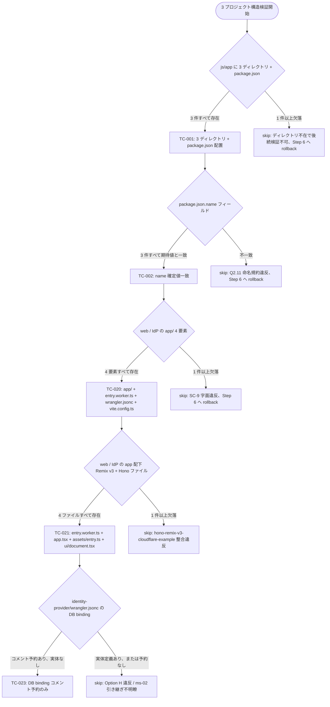
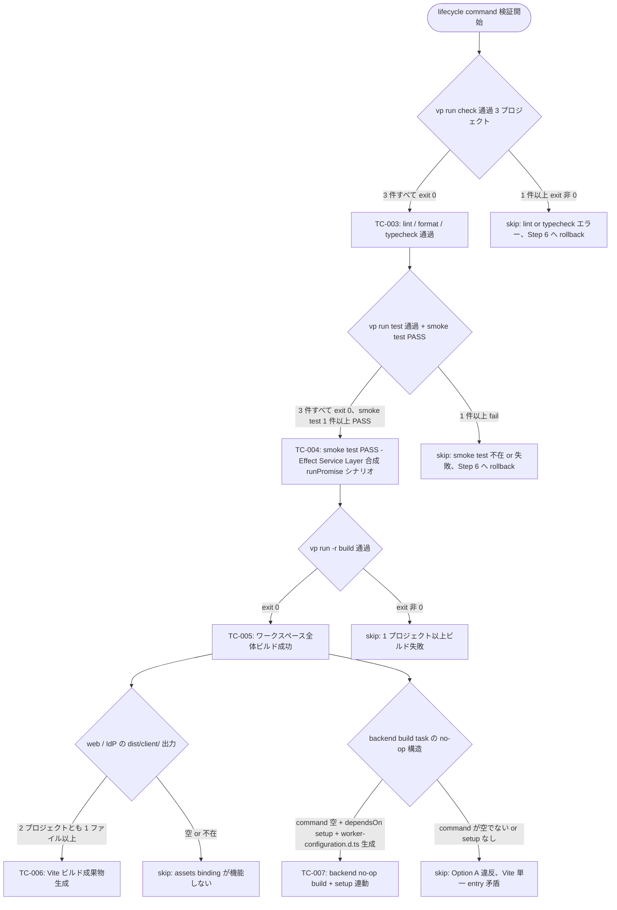
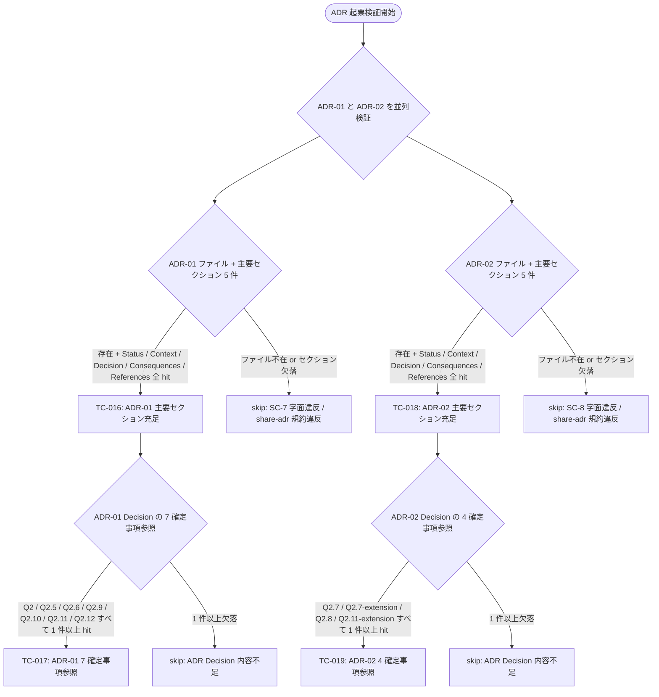
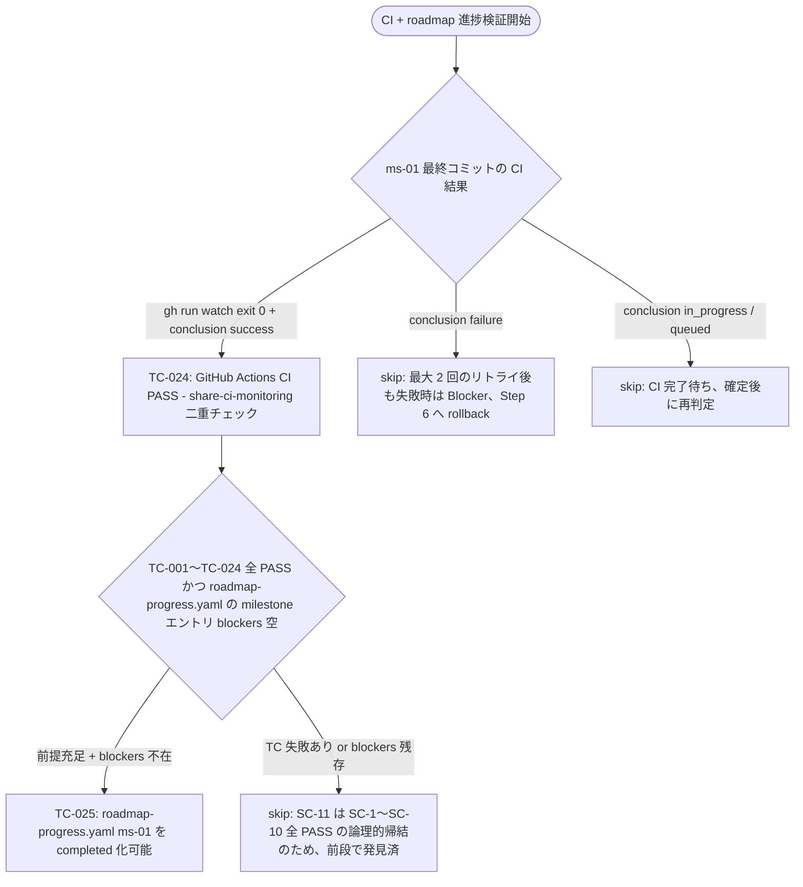
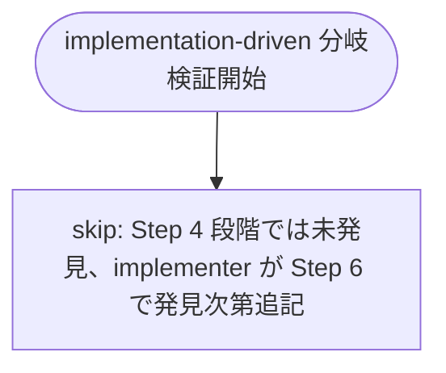

# QA Flow: feed-platform Workspace Foundation

- **Identifier:** feed-platform-ms-01-workspace-foundation
- **Author:** qa-analyst (single instance)
- **Source:** `docs/workflow/feed-platform-ms-01-workspace-foundation/qa-design.md`
- **Created at:** 2026-05-06T00:00:00Z
- **Last updated:** 2026-05-06T00:00:00Z
- **Status:** draft

本ドキュメントは `qa-design.md` の test cases (TC-001〜TC-025) を **Mermaid flowchart** で可視化し、SC 評価の主要分岐ロジックをレビュー可能な形で示す。詳細な記法ルールは `share-artifacts/references/qa-flow.md` 参照。

## Overview

ms-01 は雛形整備サイクルであり、SC 評価は **構造存在 → コマンド成功 → コード内含 → ADR 起票 → CI 結果 → 進捗連携** という直列依存に近い。本ドキュメントは関心ごとに 5 セクションへ分割する:

1. **Project structure & configuration** (SC-1, SC-9 関連) — 3 プロジェクトのディレクトリ / 必須ファイルの配置検証
2. **Build & lifecycle commands** (SC-2, SC-3, SC-4 関連) — `vp run check` / `vp run test` / `vp run -r build` の成功検証
3. **Backend multi-entry & Effect skeleton** (SC-5, SC-6 関連) — backend の `worker.ts` × 2 entry + 3 プロジェクト共通 Effect skeleton 5 ファイルの構造検証 + design refinement (Logger 設定方法、Runtime 解放、UI render 戦略) の使用パターン検証
4. **ADR issuance** (SC-7, SC-8 関連) — ADR-01 / ADR-02 のファイル存在 + 主要セクション + 確定事項参照
5. **CI & roadmap progression** (SC-10, SC-11 関連) — GitHub Actions PASS + roadmap-progress.yaml `completed` 化可能性

横断的な関心 (error handling 等) は本サイクル特性 (= 観測コマンド失敗時はそのまま FAIL となり追加分岐なし) のため別セクション化しない。

---

## 1. Project structure & configuration

このセクションが対応する成功基準: SC-1, SC-9

3 プロジェクトのディレクトリ / `package.json` 配置 + Web/IdP の Remix v3 構造 + 各種設定ファイルの存在を直列に検証。1 段でも欠落があれば後続 SC は無意味なため**最も先に走らせる**。



---

## 2. Build & lifecycle commands

このセクションが対応する成功基準: SC-2, SC-3, SC-4

3 プロジェクトを通した lint / format / typecheck / test / build の連続検証。コマンドが exit 0 を返すことが PASS の必要十分条件。



---

## 3. Backend multi-entry & Effect skeleton

このセクションが対応する成功基準: SC-5, SC-6

backend の `worker.ts` × 2 entry の構造検証 + 3 プロジェクト共通 Effect skeleton 5 ファイル + design refinement (Logger 設定方法、Runtime 解放、Service tag namespace、UI render 戦略) の使用パターン検証。SC-6 は **5 段** に分解されており、最も観測点が多い。

```mermaid
flowchart TD
  Start([backend multi-entry + Effect skeleton 検証開始]) --> Q1{worker.ts 件数 + wrangler.jsonc 共存}
  Q1 -->|2 件以上 + 同階層に wrangler.jsonc| TC8[TC-008: worker.ts ≥ 2 + wrangler.jsonc 共存]
  Q1 -->|2 件未満 or 共存違反| FAIL1[skip: SC-5 字面違反、Step 6 へ rollback]
  TC8 --> Q2{wrangler.jsonc.name 命名規約}
  Q2 -->|feed-platform-backend-health + feed-platform-backend-bff| TC9[TC-009: name プレフィックス規約準拠]
  Q2 -->|不一致| FAIL2[skip: 命名規約違反 / Cloudflare 一意性懸念]
  TC9 --> Q3{2 件目 entry の名前}
  Q3 -->|bff| TC10[TC-010: 2 件目 entry が bff Resource-Oriented BFF 予告]
  Q3 -->|worker-input| FAIL3[skip: Option N 採用 = ms-06 ドメインに踏み込み]
  Q3 -->|cron / scheduler| FAIL4[skip: Option O 採用 = ms-08 ドメインに踏み込み]
  Q3 -->|その他| FAIL5[skip: design 未確定の意図不明な命名]
  TC10 --> Q4{Effect 利用 TS ファイル存在 3 プロジェクト}
  Q4 -->|3 件すべて 1 件以上 hit| TC11[TC-011: Layer / ServiceMap.Service / ManagedRuntime 利用ファイル存在]
  Q4 -->|0 件のプロジェクトあり| FAIL6[skip: SC-6 字面違反]
  TC11 --> Q5{Effect skeleton 5 ファイル全配置}
  Q5 -->|3 プロジェクトとも 5 ファイル| TC12[TC-012: env + greeting + health + runtime/server + runtime/hono]
  Q5 -->|1 件以上欠落| FAIL7[skip: CC-7 違反 / 後続マイルストーン引き継ぎコスト増]
  TC12 --> Q6{runtime/server.ts の Logger 設定方法}
  Q6 -->|Layer.unwrap あり + import.meta.env.PROD なし| TC13[TC-013: Logger.unwrap + Env.Service 経由判定]
  Q6 -->|import.meta.env.PROD 直参照あり| FAIL8[skip: Option Q 採用 = テスト容易性違反、user gate review refinement 違反]
  TC13 --> Q7{runtime/hono.ts の解放パターン}
  Q7 -->|await using あり + runtime.dispose 明示呼び出しなし| TC14[TC-014: TC39 await using 自動破棄]
  Q7 -->|runtime.dispose 明示呼び出しあり| FAIL9[skip: Option T 採用 = try/finally 漏洩リスク、refinement 違反]
  TC14 --> Q8{feature/env.ts の Service tag namespace}
  Q8 -->|@app/<project>/feature/env/Service 形式| TC15[TC-015: Service tag namespace 規約準拠]
  Q8 -->|別形式| FAIL10[skip: CC-6 違反 / saas-example 規約逸脱]
  TC15 --> Q9{web / IdP の app.tsx の UI render 戦略}
  Q9 -->|c.render あり + createPageOrFrame なし| TC22[TC-022: 素朴 c.render Hello World レベル]
  Q9 -->|createPageOrFrame 採用| FAIL11[skip: ms-04 / ms-07 ドメインに踏み込み、ms-01 スコープ違反]
```

---

## 4. ADR issuance

このセクションが対応する成功基準: SC-7, SC-8

ADR-01 (Roadmap mode) と ADR-02 (General mode) のファイル存在 + 主要セクション充足 + Decision セクションでの確定事項参照を並列に検証 (両 ADR は完全独立、相互依存なし)。



---

## 5. CI & roadmap progression

このセクションが対応する成功基準: SC-10, SC-11

GitHub Actions の `vp run --parallel ci` 結果を share-ci-monitoring 二重チェックで観測し、SC-1〜SC-10 全 PASS の前提下で roadmap-progress.yaml の `completed` 化可能性を最終ゲートとして判定する。



---

## Cross-cutting concerns

本サイクルでは以下の理由で**横断的セクションを設けない**:

- **エラーハンドリング**: 各 TC の観測コマンド (find / grep / vp run / gh run view) が exit 非 0 を返した場合は **そのまま FAIL** として扱い、本図の各 `FAIL<N>` 葉に集約済み
- **リトライ**: TC-024 (CI) のみ share-ci-monitoring の最大 2 回リトライ規約を持つが、これはセクション 5 の `FAIL1` 葉内で「最大 2 回のリトライ後も失敗時は Blocker」として吸収
- **ロギング**: Step 8 の validator が各 TC の実行ログを `validation-evidence/<TC-ID>.log` に残す方針 (qa-design.md の test file placement policy 節)。ロギング自体の構造的要件は ms-01 では存在しない

---

## Implementation-driven branches

Step 4 段階では空。Step 6 で implementer が `vite-plus` / `wrangler` / `effect@4.x` の固有挙動に起因する追加分岐を発見した場合のみ、本セクションに `TC-IMPL-NNN` 葉を持つ Mermaid 図を追加する。


