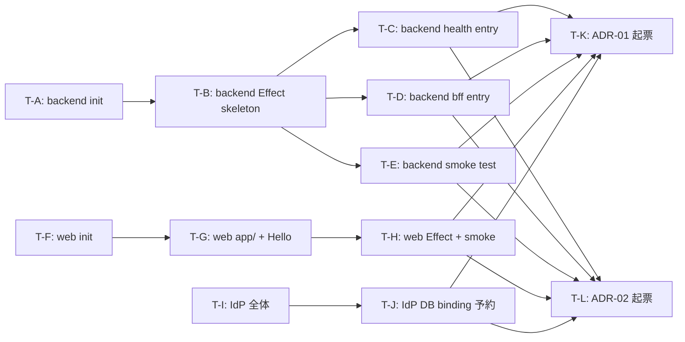

# Task Plan: feed-platform Workspace Foundation

- **Identifier:** feed-platform-ms-01-workspace-foundation
- **Author:** Main (totto2727)
- **Source:** `design.md` (commit `e61e309` の最新形 = 3 refinement 適用後)
- **Created at:** 2026-05-06T10:25:00Z
- **Status:** approved

本 task-plan は Step 5 で確定する **immutable plan**。Step 6-7 のタスク状態追跡は `TODO.md` (implementer × Main で更新) と Main の `TaskCreate` を併用する。

## Premises

- design.md の Handoff notes (T-A〜T-L、12 タスク) を一次入力として 12 タスクに分割
- 1 タスク = 1 implementer specialist で完遂可能 (数時間〜1 日規模)
- 並列実行可能な単位を明示し、Wave で整理
- 各タスクの完了は **対応 TC が PASS する状態 + 該当 commit が push 済 + CI PASS** で判定 (Step 6 での Main gate 判定は qa-design.md の TC を観測)
- ADR 起票 (T-K, T-L) は `share-adr` スキル経由
- 各タスクは原則 1 commit (= 「タスク単位 = 論理単位 commit」)。複数 sub-commit を含めて良いが最終的に branch 上で task に対応する commit ハッシュが特定可能であること

## Task list

### T-A: feed-platform-backend プロジェクト初期化

- **Summary:** `js/app/feed-platform-backend/` ディレクトリを作成し、最小構成の `package.json` / `tsconfig.json` / `vite.config.ts` / `.gitignore` を配置する。`pnpm install` 後に依存解決が成功する状態にする
- **Artifact:**
  - `js/app/feed-platform-backend/package.json` (新規)
  - `js/app/feed-platform-backend/tsconfig.json` (新規、`@totto2727/fp/tsconfig/vite` を extends)
  - `js/app/feed-platform-backend/vite.config.ts` (新規、Vite+ `run.tasks` 定義: `setup` parent + `build` no-op)
  - `js/app/feed-platform-backend/.gitignore` (新規、wrangler / dist 等を ignore)
- **Dependencies:** なし (root)
- **Parallelizable:** no (Wave 1 root)
- **Estimated size:** S (1-2h)
- **Test cases covered:** TC-001 (3 プロジェクトのうち backend 部分) / TC-002 (package.json ピン catalog 利用) / TC-013 (vp run check 通過の足場) / TC-014 (vp run -r setup 起点)
- **Design document references:** Project A-1 / A-2 / A-3 / A-4 (design.md L362-510 周辺)

### T-B: feed-platform-backend Effect skeleton 5 ファイル

- **Summary:** `feed-platform-backend/src/feature/{env,greeting,health}.ts` + `feature/runtime/{server,hono}.ts` の 5 ファイルを配置する。`runtime/server.ts` は `Layer.unwrap` + `Env.Service` 経由 Logger 判定 + `DisposableRuntime` HOF + `Symbol.asyncDispose` パターンを採用 (refinement #1, #2 反映)
- **Artifact:**
  - `js/app/feed-platform-backend/src/feature/env.ts` (新規、Layer.succeed)
  - `js/app/feed-platform-backend/src/feature/greeting.ts` (新規、Layer.sync)
  - `js/app/feed-platform-backend/src/feature/health.ts` (新規、Layer.effect、Env 依存)
  - `js/app/feed-platform-backend/src/feature/runtime/server.ts` (新規、ManagedRuntime + DisposableRuntime + Layer.unwrap dynamicLoggerLayer)
  - `js/app/feed-platform-backend/src/feature/runtime/hono.ts` (新規、`await using` middleware)
- **Dependencies:** T-A
- **Parallelizable:** no (T-C, T-D, T-E が依存するため先行)
- **Estimated size:** M (2-3h)
- **Test cases covered:** TC-016 (Effect Service 利用) / TC-017 (skeleton 5 ファイル) / TC-018 (Service tag namespace) / TC-019 (Logger.unwrap 経由) / TC-020 (Env.Service 経由判定) / TC-021 (await using パターン)
- **Design document references:** "Key types and interfaces" L99-237 / CC-7 / CC-8

### T-C: feed-platform-backend health entry

- **Summary:** `feed-platform-backend/src/health/{worker.ts,wrangler.jsonc}` を配置。`worker.ts` は Hono + `await using runtime` + `/health` Hello World ハンドラ。`wrangler.jsonc.name` は `feed-platform-backend-health`、`compatibility_date` 等は個別記述
- **Artifact:**
  - `js/app/feed-platform-backend/src/health/worker.ts` (新規)
  - `js/app/feed-platform-backend/src/health/wrangler.jsonc` (新規)
- **Dependencies:** T-A, T-B
- **Parallelizable:** yes (T-D と並列実行可能、ただし同一 implementer が連続実行する方が現実的)
- **Estimated size:** S (1-2h)
- **Test cases covered:** TC-007 (worker.ts 配置) / TC-008 (wrangler.jsonc 配置) / TC-013 (vp run check 通過への寄与)
- **Design document references:** "feed-platform-backend の entry 共通形" L239-294 / Project A-5

### T-D: feed-platform-backend bff entry

- **Summary:** `feed-platform-backend/src/bff/{worker.ts,wrangler.jsonc}` を配置 (T-C と同形、`name = feed-platform-backend-bff`)。SC-5 (≥ 2 entry) の構造的担保を完成させる
- **Artifact:**
  - `js/app/feed-platform-backend/src/bff/worker.ts` (新規)
  - `js/app/feed-platform-backend/src/bff/wrangler.jsonc` (新規)
- **Dependencies:** T-A, T-B
- **Parallelizable:** yes (T-C と並列実行可能)
- **Estimated size:** S (1-2h)
- **Test cases covered:** TC-007 (worker.ts 配置) / TC-008 (worker.ts ≥ 2、SC-5 観測仕様の `find ... wc -l ≥ 2` 充足)
- **Design document references:** Project A-5 / S-2 (マイクロサービス境界の構造的予告)

### T-E: feed-platform-backend smoke test

- **Summary:** `feed-platform-backend/src/smoke.test.ts` (or 同等の test ファイル 1 件) を配置。Effect Service の `Layer.provide` + `Effect.runPromise` の最小経路を踏んで Hello World 確認。`vite-plus/test` デフォルト共通利用 (vitest.config 新設しない)
- **Artifact:**
  - `js/app/feed-platform-backend/src/smoke.test.ts` (新規)
- **Dependencies:** T-B (Effect skeleton 利用)
- **Parallelizable:** yes (T-C, T-D と並列、ただし T-B 完了が前提)
- **Estimated size:** S (1h)
- **Test cases covered:** TC-004 (smoke test PASS) / TC-005 (各プロジェクト smoke test ≥ 1)
- **Design document references:** Project A-7 (smoke test) / CC-5 (Test 設定)

### T-F: feed-platform-web プロジェクト初期化

- **Summary:** `js/app/feed-platform-web/` ディレクトリを作成し、`hono-remix-v3-cloudflare-example` 最新構成 (commit `dae111f`) を 1:1 でコピーをベースに、`package.json.name` / `wrangler.jsonc.name` 等のみ差し替え。`app/` ディレクトリ内の Counter / TODO / Frame 関連サンプルは削除し Hello World 1 ページに置換 (research note hono-remix-cloudflare-example-structure.md の "再考すべき 5 項目" 反映)
- **Artifact:**
  - `js/app/feed-platform-web/package.json` (新規)
  - `js/app/feed-platform-web/tsconfig.json` (新規、`@totto2727/fp/tsconfig/vite` extends)
  - `js/app/feed-platform-web/vite.config.ts` (新規)
  - `js/app/feed-platform-web/wrangler.jsonc` (新規、`name = feed-platform-web`)
  - `js/app/feed-platform-web/.gitignore` (新規)
- **Dependencies:** なし (Wave 2 ルート、ただし backend 完了を待ってから着手することで CC-7 等の共通形を参考可能)
- **Parallelizable:** yes (T-I と完全並列、別 implementer instance 推奨)
- **Estimated size:** S (1-2h)
- **Test cases covered:** TC-001 (web 部分) / TC-002 / TC-009 (hono-remix-v3-cloudflare-example 構成整合)
- **Design document references:** Project B-1 / B-2 / B-3 / B-4 (design.md L562-728 周辺)

### T-G: feed-platform-web app/ ディレクトリ + Hello World 1 ページ

- **Summary:** `feed-platform-web/app/{entry.worker.ts, app.tsx, routes.ts, assets/entry.ts, ui/document.tsx}` を配置。`app.tsx` は `logger → contextStorage → runtimeMiddleware → remixRenderer` の middleware 順序、Hello World 1 ページ + `loader` 経由 JSON 例 1 件 (`/api/v1/hello`) を実装。`PageOrFrame` は **未採用** (TC-022 観測、ms-04 / ms-07 委譲)
- **Artifact:**
  - `js/app/feed-platform-web/app/entry.worker.ts` (新規)
  - `js/app/feed-platform-web/app/app.tsx` (新規)
  - `js/app/feed-platform-web/app/routes.ts` (新規、Frame name registry のみ最小)
  - `js/app/feed-platform-web/app/assets/entry.ts` (新規、Vite client entry)
  - `js/app/feed-platform-web/app/ui/document.tsx` (新規)
- **Dependencies:** T-F
- **Parallelizable:** no (同一 implementer で T-F → T-G → T-H をチェーン推奨)
- **Estimated size:** M (2-3h)
- **Test cases covered:** TC-009 (構成整合) / TC-010 (`app/entry.worker.ts` 等の存在) / TC-022 (PageOrFrame 未採用)
- **Design document references:** Project B-5 / B-6 / "feed-platform-web / identity-provider の app/app.tsx 形" L296-323

### T-H: feed-platform-web Effect skeleton + smoke test

- **Summary:** `feed-platform-web/app/feature/{env,greeting,health,runtime/server,runtime/hono}.ts` の 5 ファイルを配置 (backend と同形、namespace のみ差し替え)。`app/smoke.test.ts` も配置
- **Artifact:**
  - `js/app/feed-platform-web/app/feature/env.ts` (新規)
  - `js/app/feed-platform-web/app/feature/greeting.ts` (新規)
  - `js/app/feed-platform-web/app/feature/health.ts` (新規)
  - `js/app/feed-platform-web/app/feature/runtime/server.ts` (新規)
  - `js/app/feed-platform-web/app/feature/runtime/hono.ts` (新規)
  - `js/app/feed-platform-web/app/smoke.test.ts` (新規)
- **Dependencies:** T-F, T-G
- **Parallelizable:** no (同一 implementer で T-G → T-H チェーン)
- **Estimated size:** M (2-3h)
- **Test cases covered:** TC-004 / TC-005 / TC-016 / TC-017 / TC-018 / TC-019 / TC-020 / TC-021 (T-B と同等の TC を web プロジェクトで充足)
- **Design document references:** "Key types and interfaces" L99-237 / CC-7

### T-I: identity-provider プロジェクト全体 (T-F〜T-H 同形コピー)

- **Summary:** `js/app/identity-provider/` を T-F〜T-H と同形構造で配置。`package.json.name = identity-provider`、`wrangler.jsonc.name = identity-provider`。`app.tsx` は `Hello, IdP` 相当の Hello World レベル。**Better Auth / OAuth 2.1 / 認証フレームワーク導入は ms-02 委譲 (ms-01 では含めない)**
- **Artifact:**
  - `js/app/identity-provider/{package.json, tsconfig.json, vite.config.ts, .gitignore}` (新規、T-F 同形)
  - `js/app/identity-provider/app/{entry.worker.ts, app.tsx, routes.ts, assets/entry.ts, ui/document.tsx}` (新規、T-G 同形)
  - `js/app/identity-provider/app/feature/{env, greeting, health, runtime/server, runtime/hono}.ts` (新規、T-H 同形)
  - `js/app/identity-provider/app/smoke.test.ts` (新規)
- **Dependencies:** なし (Wave 2 ルート、T-F〜T-H と完全並列)
- **Parallelizable:** yes (T-F〜T-H と完全並列、別 implementer instance)
- **Estimated size:** L (3-4h、T-F〜T-H 相当 + DB binding 予約)
- **Test cases covered:** TC-001 (IdP 部分) / TC-002 / TC-009 / TC-010 / TC-016〜TC-021 (web と同等のフルセット)
- **Design document references:** Project C-1 〜 C-7 (design.md L730-836 周辺)

### T-J: identity-provider DB binding コメント予約

- **Summary:** `identity-provider/wrangler.jsonc` 末尾 (or appropriate location) に **`d1_databases` / `kv_namespaces` / `vars` (BETTER*AUTH*\*) の 3 種類のコメント予約**を追加。実体は ms-02 で BetterAuth 導入時に追加
- **Artifact:**
  - `js/app/identity-provider/wrangler.jsonc` (修正、コメント追加)
- **Dependencies:** T-I
- **Parallelizable:** no (T-I の最後に組み込む、または T-I と同 commit でも可)
- **Estimated size:** S (0.5h)
- **Test cases covered:** TC-023 (DB binding コメント予約) / TC-010 (IdP wrangler.jsonc 構造)
- **Design document references:** Project C-5 / Alternatives Option H

### T-K: ADR-01 起票 (Roadmap mode)

- **Summary:** `docs/roadmap/feed-platform/adr/2026-05-05-project-structure-and-runtime.md` を `share-adr` スキル経由で起票。design.md の "ADR-01 outline" セクション (L1056-1087) のセクション骨子に従って執筆。含む決定事項: Q2 / Q2.5 / Q2.6 / Q2.9 / Q2.10 / Q2.11 (命名) / Q2.12
- **Artifact:**
  - `docs/roadmap/feed-platform/adr/2026-05-05-project-structure-and-runtime.md` (新規)
- **Dependencies:** T-A〜T-J (実装内容を ADR に反映するため、実装完了後に起票)
- **Parallelizable:** yes (T-L と完全並列)
- **Estimated size:** M (1-2h)
- **Test cases covered:** TC-024 (ADR-01 ファイル存在 + 主要セクション) / SC-7
- **Design document references:** "ADR-01 outline (Roadmap mode)" L1056-1087

### T-L: ADR-02 起票 (General mode)

- **Summary:** `docs/adr/2026-05-05-identity-provider-and-authn-authz-architecture.md` を `share-adr` スキル経由で起票。design.md の "ADR-02 outline" セクション (L1089-1119) のセクション骨子に従って執筆。含む決定事項: Q2.7 / Q2.7-extension / Q2.8 / Q2.11-extension
- **Artifact:**
  - `docs/adr/2026-05-05-identity-provider-and-authn-authz-architecture.md` (新規)
- **Dependencies:** T-A〜T-J (T-K と同条件、実装完了後)
- **Parallelizable:** yes (T-K と完全並列)
- **Estimated size:** M (1-2h)
- **Test cases covered:** TC-025 (ADR-02 ファイル存在 + 主要セクション) / SC-8
- **Design document references:** "ADR-02 outline (General mode)" L1089-1119

## Dependency graph

## Parallelizable groups

Step 6 で Main が implementer を起動する際の並列単位。

- **Wave 1 (root):** T-A (backend ルート、これだけは先行必須)
- **Wave 2 (T-A 完了後):** T-B (backend Effect skeleton、後続 T-C/D/E が依存)
- **Wave 3 (T-B 完了後):** T-C / T-D / T-E (3 並列可能、ただし同一 implementer で連続実行も可)
- **Wave 4 (Wave 1〜3 と独立に開始可能):** T-F → T-G → T-H (web プロジェクトチェーン、1 implementer)、**並列に** T-I → T-J (IdP プロジェクトチェーン、別 implementer)
- **Wave 5 (Wave 1〜4 すべて完了後):** T-K / T-L (2 並列、ADR 起票)

実用上、Main が同時起動する implementer 数は **2〜3 並列**を上限とする (specialist-common §6 + Intent Spec L171 の並行サイクル上限 2 を超えないため、本サイクル内 implementer も自重)。

実行例:

1. Phase 1: implementer-A が T-A → T-B → T-C → T-D → T-E を逐次実行 (backend 確立)
2. Phase 2: implementer-B が T-F → T-G → T-H を実行、**並列に** implementer-C が T-I → T-J を実行
3. Phase 3: implementer-D が T-K、implementer-E が T-L を並列実行

## Risks / anticipated Blockers

- **TypeScript `using` / `await using` 構文サポート**: `tsconfig.json` の `extends: ['@totto2727/fp/tsconfig/vite']` で `target: esnext` が継承されているはずだが、Vite バージョンや TypeScript バージョンによっては transpile エラーの可能性。Blocker 発生時は `@totto2727/fp` の tsconfig を確認 / 必要なら `Symbol.asyncDispose` polyfill 検討
- **`Layer.unwrap` の振る舞い**: `effect@4.0.0-beta.60` (catalog 採用版) の API。型定義 (`node_modules/.pnpm/effect@4.0.0-beta.60/.../Layer.d.ts:1079`) 上は問題ないが、実行時に依存解決が想定通りいかない可能性。Blocker 発生時は第 2 候補 (env 引数経由判定) に fallback (design.md Alternatives Option Q 参照)
- **`hono-remix-v3-cloudflare-example` の最新化**: コピーベースだが、`merge origin/main` 後の最新形 (commit `dae111f` の Counter Frame 機能等) を**削除する範囲**が研究 note (hono-remix-cloudflare-example-structure.md §"再考すべき 5 項目") の通りに整理できているか implementer が個別判断する必要 (typo 等含めて)
- **`wrangler.jsonc` の `compatibility_flags: ["nodejs_compat"]` 必須性**: backend / web / IdP すべてで必要か / backend のみ不要かは Step 6 で実装中に検証 (Effect runtime / Hono が node 互換 API に依存する場合は必須)
- **`vp run -r build` の backend での扱い**: Project A-4 の no-op build (`command: ''` + `dependsOn: ['setup']`) パターンで `vp run -r build` が exit 0 になる前提だが、Vite+ の挙動次第で `vp run --filter ... build` 直接呼び出しは exit 0 でも `-r` オプション経由で別動作する可能性。Blocker 発生時は Vite+ ドキュメント or saas-example 構成を再確認
- **CI 失敗の許容**: Step 6 の各 task commit が CI を通すことが望ましいが、Wave 1 の T-A 単独 (まだ Effect skeleton も entry も未配置) では `vp check` が型チェックエラーを出す可能性。CI が中間 commit で失敗しても Wave 完了時 (例: T-E 完了時) に PASS していれば許容 (TC-024 は最終 commit のみ対象)
