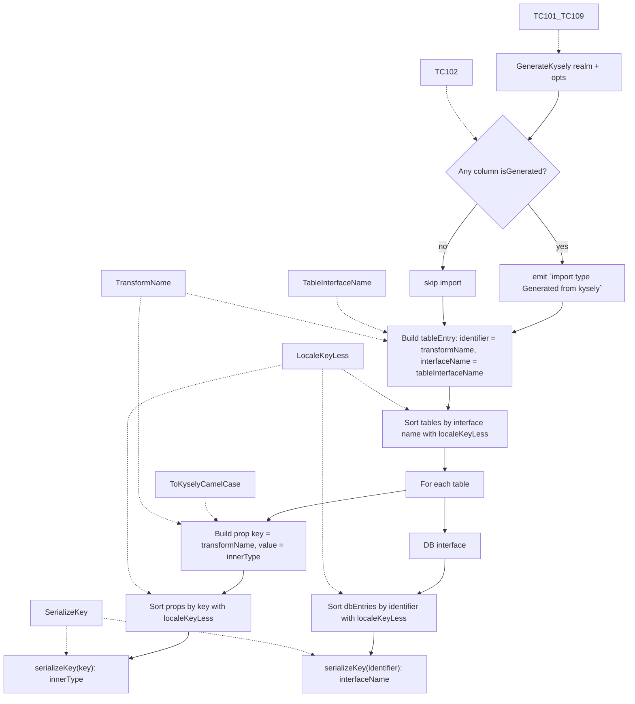

# generator.test — Test inventory for `generator.go`

> Retrospective qa-design analysis for `generator_test.go`. All test cases are framework-agnostic (Go `testing` table-driven + golden-file fixtures). Each TC carries the 2-axis tag (Execution agent × Verification style).

## Overview

`generator.go` is the top-level code-generator: it takes an `*atlas/sql/schema.Realm` plus `GenerateOptions{CamelCase}` and emits the kysely-codegen-compatible TypeScript source string. The case-conversion helpers (`toKyselyCamelCase`, `toKyselyPascalCase`, `replaceNonWordChars`, `tableInterfaceName`, `transformName`, `serializeKey`, `localeKeyLess`) live in the same file and have their own tests.

The generator is intentionally a 1:1 port of kysely-codegen 0.19's transformer + serializer for the subset of options exposed here (`--camel-case` only). Every helper either mirrors a function in `node_modules/kysely-codegen/dist/generator/utils/case-converter.js`, `generator/transformer/transformer.js`, `generator/transformer/symbol-collection.js`, or `generator/generator/serializer.js`.

| Function                  | Kysely-codegen counterpart                                                                                                              |
| ------------------------- | --------------------------------------------------------------------------------------------------------------------------------------- |
| `GenerateKysely`          | `serializer.serializeFile` + `transformer.transform`                                                                                    |
| `transformName`           | `transformer.transformName`                                                                                                             |
| `tableInterfaceName`      | `SymbolCollection.set` (with the default `kysely-pascal-case` style)                                                                    |
| `toKyselyCamelCase`       | `case-converter.toKyselyCamelCase` = `new CaseConverter().toCamelCase(s)` = `createCamelCaseMapper({})` (default opts, `upperCase=false`) |
| `toKyselyPascalCase`      | `case-converter.toKyselyPascalCase` = `toUpperFirst(toKyselyCamelCase(s))`                                                              |
| `replaceNonWordChars`     | `id.replaceAll(/[^\w$]/g, '_')` inside `SymbolCollection.set`                                                                           |
| `serializeKey`            | `TypeScriptSerializer.serializeKey`                                                                                                     |
| `localeKeyLess`           | The `localeCompare` callback used by `serializeObjectExpression`, `createDatabaseExportNode`, and `transformer.transformTables`         |

## Auto vs. manual decision policy

Pure functions and golden-file comparison. All TCs are `automated × assertion` (Go test runner + byte-equality on string output). No scenario / observation / inspection cases — the generator is deterministic and offline.

## Test file placement policy

- Co-located: `generator.go` ↔ `generator_test.go`.
- Fixtures: `fixture/<scenario>/{schema.hcl, generated.ts.fixture}`. Golden TS files use the `.ts.fixture` extension to opt out of the workspace's TS formatting / type-check passes.

## Essential test cases

### `TestGenerateKysely_Fixtures` (9 cases, golden-file)

End-to-end byte-equality comparison between `GenerateKysely(realm, opts)` and the corresponding `.ts.fixture` file.

| ID      | Expected behavior                                                                                                | `CamelCase` | Pass criteria                            |
| ------- | ---------------------------------------------------------------------------------------------------------------- | ----------- | ---------------------------------------- |
| TC-101  | `default_camel`: better-auth-style 4-table schema with `--camel-case=true` → `fixture/generated.ts.fixture`      | `true`      | Full byte-equality.                      |
| TC-102  | `generated_wrapper`: 2 tables with `auto_increment` + `default`, camel → `Generated<...>` emitted                | `true`      | Wrapper presence + `import type Generated`. |
| TC-103  | `snake_identity`: same schema as default, `--camel-case=false` → identity passthrough                            | `false`     | No transformation applied.               |
| TC-104  | `camel_kysely_upper_snake`: UPPER_SNAKE_CASE columns + `--camel-case=true` → kysely-codegen-aligned output       | `true`      | `USER_ID` stays `USERID` (upperCase=false). |
| TC-105  | `all_types`: SQLite all-types table, `--camel-case=false`                                                        | `false`     | Full type mapping snapshot.              |
| TC-106  | `generated_nullable`: default × nullable matrix, `--camel-case=false`                                            | `false`     | `Generated<T \| null>` ordering preserved. |
| TC-107  | `empty_table`: 1 table, 0 columns, `--camel-case=false`                                                          | `false`     | `export interface EmptyTable {\n}` shape. |
| TC-108  | `single_table`: 1 table, 1 column, `--camel-case=false`                                                          | `false`     | Smallest non-empty output.               |
| TC-109  | `none_identity`: snake_case columns, `--camel-case=false`                                                        | `false`     | Identity transform.                      |

**Reason needed:** Golden-file tests are the contract for the generator's output grammar (header / `import` / interface ordering / `;` / DB-key case-conversion / etc.). Any change to generator logic surfaces as a fixture diff.

### `TestToKyselyCamelCase` (27 cases)

Port of `createCamelCaseMapper({})` from kysely's `plugin/camel-case/camel-case.js`. Covers snake → camel, idempotency on already-camel input, and the underscore edge cases enumerated in the JS source.

| Bucket             | Examples                                                                                          | Notes |
| ------------------ | ------------------------------------------------------------------------------------------------- | ----- |
| Standard snake     | `access_token` → `accessToken`, `refresh_token_expires_at` → `refreshTokenExpiresAt`              | The common path. |
| UPPER_SNAKE_CASE   | `USER_ID` → `USERID`, `HTTP_STATUS` → `HTTPSTATUS`, `MAX_RETRY_COUNT` → `MAXRETRYCOUNT`           | With `upperCase=false` (kysely-codegen default), screaming input is kept screaming. |
| Already camel      | `userId` → `userId`, `accessToken` → `accessToken`                                                | Idempotent. |
| Single char        | `a` → `a`, `A` → `A`, `id` → `id`                                                                 | No `_`, no transform. |
| Empty input        | `""` → `""`                                                                                       | Early return. |
| Digits             | `ITEM_2_NAME` → `ITEM2NAME`, `2nd_item` → `2ndItem`, `123` → `123`                                | Digits are uppercased to themselves; otherwise treated like letters. |
| Underscore edges   | `_private` → `_Private`, `trailing_` → `trailing`, `double__under` → `doubleUnder`, `___` → `_`    | First char preserved; trailing `_` dropped; consecutive `_` collapse. |
| Single underscore  | `_` → `_`                                                                                          | Length-1 input bypasses the loop. |
| Mixed-case input   | `myFieldName` → `myFieldName`                                                                      | Idempotent on no-underscore input. |
| Single-letter pair | `a_b` → `aB`, `A_B` → `AB`                                                                          | Smallest non-trivial transform. |

**Reason needed:** This function must match `CamelCasePlugin.camelCase()` byte-for-byte for ASCII identifiers, since users typically pair the generated types with the runtime plugin.

### `TestToKyselyPascalCase` (11 cases)

Verifies `toUpperFirst(toKyselyCamelCase(s))`. Note that hyphens / spaces / dots are NOT pre-replaced here; that is the responsibility of `tableInterfaceName`. The test cases for `kebab-case-name` and `user-profiles` therefore preserve the hyphen.

### `TestTableInterfaceName` (8 cases)

Verifies the full table-interface-name pipeline: `toKyselyPascalCase(replaceNonWordChars(s))`. This is the function actually invoked by `GenerateKysely` to compute the TS interface name. Covers hyphens, spaces, dots, and the `USER_ID → USERID` divergence (the `replaceNonWord` step is a no-op for `_`, so SCREAMING_SNAKE remains screaming).

### `TestReplaceNonWordChars` (8 cases)

Verifies the JS regex `/[^\w$]/g` behavior: every byte outside `[A-Za-z0-9_$]` is replaced with `_`. Covers hyphens, spaces, dots, dollar signs (preserved), digit-only strings, and the empty string.

### `TestTransformName` (10 cases)

Verifies the `--camel-case` boolean dispatcher. Two truth-rows per shape ensure the on / off forks both behave correctly:

- snake input × camel mode → camelCased
- snake input × identity → unchanged
- UPPER_SNAKE × camel → screaming preserved (kysely-codegen behavior)
- already-camel × either mode → idempotent

### `TestSerializeKey` (9 cases)

Verifies `TypeScriptSerializer.serializeKey`'s identifier-vs-quoted decision. Bare keys (`userId`, `_private`, `$dollar`, `A`, `_`) pass through; non-identifier keys (`123abc`, `kebab-case`, `with space`) are wrapped in JSON-style double quotes via `strconv.Quote`.

### `TestLocaleKeyLess` (9 cases)

Verifies the locale-approximating comparator used by all three sort sites in the generator (interface order, column order, DB-key order). Covers:

- different primary level → byte order on `strings.ToLower`
- equal primary, case-only tie → lowercase first (matches en-US ICU default)

## Coverage table (success criteria → TC-ID)

No formal `intent-spec.md` for this package. Behavior contract is implicit:

| Implicit success criterion                                                                  | TC-IDs / suite                                |
| ------------------------------------------------------------------------------------------- | --------------------------------------------- |
| Generator produces stable byte-equal output for representative schemas                      | TC-101 … TC-109                               |
| `--camel-case=true` matches kysely-codegen's `toKyselyCamelCase`                            | TC-101, TC-102, TC-104, `TestToKyselyCamelCase` |
| `--camel-case=false` is identity on column and DB-interface keys                            | TC-103, TC-105 … TC-109                       |
| Table-interface name = `toKyselyPascalCase(replaceNonWord(identifier))`                     | `TestTableInterfaceName`                      |
| `Generated<T>` wraps auto_increment / default columns                                       | TC-102, TC-106                                |
| Empty / single-column tables produce valid TS                                               | TC-107, TC-108                                |
| Object keys are quoted iff they are not valid TS identifiers                                | `TestSerializeKey`                            |
| Properties / interfaces / DB entries are sorted with locale-approximating order             | `TestLocaleKeyLess`, observable via TC-104    |

## Gaps / redundancies (review notes)

### Gaps

1. **Multi-schema realm** — every fixture uses a single `schema "main"`. Atlas supports multiple schemas; behavior on a multi-schema realm (table-name collision, namespacing) is untested.
2. **Mixed-camelCase input** — `--camel-case=true` is exercised on snake (TC-101) and UPPER_SNAKE (TC-104) inputs only. A schema with already-camel column names would harden idempotency.
3. **CLI argument validation** — `main.go` has no test (entire `main` function is untested).
4. **HCL parser failure paths** — `ParseHCLBytes` is invoked but errors aren't exercised (only happy-path schemas).
5. **`fixture/snake/schema.hcl` is byte-equal to `fixture/schema.hcl`** — schema duplication. Could be replaced by reusing the parent fixture from the `snake_identity` test case.
6. **Non-ASCII column names** — `replaceNonWordChars` and `localeKeyLess` are byte-based and approximate JS Unicode semantics. Inputs with multibyte characters are out of scope but untested.

### Redundancies

- **`snake` / `none` modes were collapsed**. The `camel` ↔ `snake` ↔ `none` triad from the previous `--case` flag is now a single boolean (`--camel-case`); there is no longer a redundant pair of identity modes.
- **`fixture/schema.hcl` ≡ `fixture/snake/schema.hcl`** (verified byte-equal). One could be removed.

## qa-flow (essential logic)

## Cross-file relationships

- **`mapper.go` integration**: `GenerateKysely` calls `columnToTsType` and `isGenerated` from `mapper.go`. Tests in `mapper.test.md` (TC-001…TC-082) cover those building blocks; the `generator_test.go` golden files exercise the integrated output.
- **Fixture coupling**: TC-101…TC-109 read `.ts.fixture` files. The `.fixture` extension is a deliberate opt-out from workspace TS lint/format passes (the files contain intentionally raw generator output: `;` line endings, double-quoted imports, multi-line empty interface bodies).
- **Upstream coupling**: every helper has a documented JS counterpart (see the table at the top of this file). When upgrading `kysely-codegen` or `kysely`, diff the listed JS files and re-port any changes.
