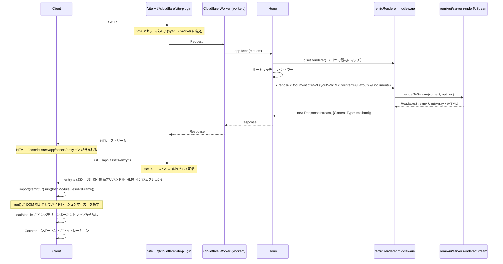

# hono-remix-v3-cloudflare-example

**Remix v3 UI/SSR** を **Cloudflare Workers** 上で動作させ、**Hono** をリクエストルーターとして使用します。ローカル開発とバンドルは Vite（`@cloudflare/vite-plugin` 経由）で処理されます。

2つのページ:

- `/` — インメモリカウンター
- `/todo` — インメモリTODOリスト（永続化なし）

## 技術スタック

| レイヤー                  | 選択肢                                                                         |
| ------------------------- | ------------------------------------------------------------------------------ |
| HTTP ルーター             | **Hono**（`remix/fetch-router` の代替）                                        |
| SSR / UI                  | **Remix v3 `remix/ui` + `remix/ui/server`** （そのまま使用）                   |
| クライアントバンドル/開発 | **Vite** + `@cloudflare/vite-plugin`（`remix/assets` ランタイムの代替）        |
| ランタイム                | **Cloudflare Workers**（開発は Vite プラグイン経由の workerd、本番も Workers） |

重要なポイントは、Remix v3 の Node 限定 API（`remix/node-serve`、`remix/assets` など）をすべて除去し、Web API ベースの部分のみを Workers 上で直接実行していることです。

## コマンド

`build` は Vite+ タスク（`vite.config.ts` 内）として定義され、`dist/**` と `.wrangler/**` を入力から除外してキャッシュが再実行時に機能するようにしています。`dev` / `start` / `deploy` / `typecheck` は `package.json` のスクリプトとして残っています。リポジトリルートからは `--filter` を使用してターゲットを指定します:

```sh
vp run --filter hono-remix-v3-cloudflare-example dev        # vp dev — Worker が Vite 内で HMR 付きで実行
vp run --filter hono-remix-v3-cloudflare-example start      # wrangler dev — ビルド済み出力を workerd で実行
vp run --filter hono-remix-v3-cloudflare-example build      # vp build — Worker とクライアントバンドルの両方を生成（キャッシュあり）
vp run --filter hono-remix-v3-cloudflare-example deploy     # wrangler deploy
vp run --filter hono-remix-v3-cloudflare-example typecheck  # tsgo --noEmit
```

`vp run <task>` はこのアプリディレクトリ内でも動作します。依存関係の解決はリポジトリルートで `pnpm install` を使用して行います。Bun は使用しません。

## ディレクトリ構造

```text
app/
├── entry.worker.ts          # Cloudflare Worker エントリー — Hono アプリを再エクスポート
├── app.tsx                  # Hono ルーティング + インラインハンドラー + ミドルウェア登録
├── ui/
│   ├── document.tsx         # <html><head><body>... + 開発/本番を切り替える <script src=>
│   ├── layout.tsx           # Nav + <main> ラッパー
│   ├── counter.client.tsx   # clientEntry — インタラクティブカウンター
│   └── todo.client.tsx      # clientEntry — インタラクティブ TODO
└── assets/
    └── entry.ts             # クライアントエントリー — vite-plugin-remix の boot() を呼び出し
```

SSR ミドルウェアは [`hono-remix-middleware`](../../package/hono-remix-middleware/README.md) パッケージからインポートされるため、アプリにミドルウェアディレクトリはありません。ルーティングとハンドラーの実装は単一の `app.tsx` ファイルに集約されています。コントローラー層やユーティリティ層もありません。

## SSR フロー

### シーケンス（単一ページリクエスト）


