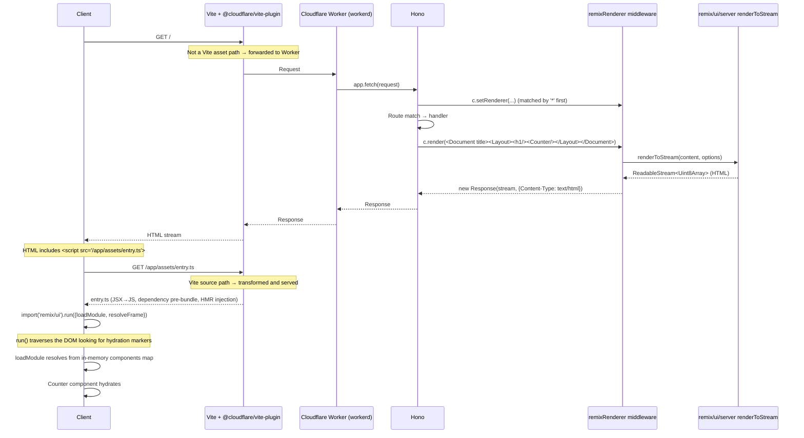

# hono-remix-v3-cloudflare-example

**Remix v3 UI/SSR** running on **Cloudflare Workers** with **Hono** as the request router. Local development and bundling are handled by Vite (via `@cloudflare/vite-plugin`).

Two pages:

- `/` — In-memory counter
- `/todo` — In-memory TODO list (no persistence)

## Tech Stack

| Layer                     | Choice                                                                       |
| ------------------------- | ---------------------------------------------------------------------------- |
| HTTP Router               | **Hono** (replacement for `remix/fetch-router`)                              |
| SSR / UI                  | **Remix v3 `remix/ui` + `remix/ui/server`** (used as-is)                     |
| Client bundle / dev       | **Vite** + `@cloudflare/vite-plugin` (replacement for `remix/assets` runtime) |
| Runtime                   | **Cloudflare Workers** (dev via workerd through Vite plugin, prod also Workers) |

The key point is that all Node-only APIs from Remix v3 (`remix/node-serve`, `remix/assets`, etc.) have been removed, leaving only the Web API-based parts running directly on Workers.

## Commands

`build` is defined as a Vite+ task (in `vite.config.ts`), excluding `dist/**` and `.wrangler/**` from inputs so the cache works on re-run. `dev` / `start` / `deploy` / `typecheck` remain scripts in `package.json`. From the repository root, use `--filter` to target:

```sh
vp run --filter hono-remix-v3-cloudflare-example dev        # vp dev — Worker runs inside Vite with HMR
vp run --filter hono-remix-v3-cloudflare-example start      # wrangler dev — runs built output in workerd
vp run --filter hono-remix-v3-cloudflare-example build      # vp build — generates both Worker and client bundles (cached)
vp run --filter hono-remix-v3-cloudflare-example deploy     # wrangler deploy
vp run --filter hono-remix-v3-cloudflare-example typecheck  # tsgo --noEmit
```

`vp run <task>` works inside this app directory too. Dependency resolution is done with `pnpm install` at the repository root. No Bun.

## Directory Structure

```text
app/
├── entry.worker.ts          # Cloudflare Worker entry — re-exports the Hono app
├── app.tsx                  # Hono routing + inline handlers + middleware registration
├── ui/
│   ├── document.tsx         # <html><head><body>... + <script src=> switching between dev/prod
│   ├── layout.tsx           # Nav + <main> wrapper
│   ├── counter.client.tsx   # clientEntry — interactive counter
│   └── todo.client.tsx      # clientEntry — interactive TODO
└── assets/
    └── entry.ts             # Client entry — calls vite-plugin-remix's boot()
```

SSR middleware is imported from the [`hono-remix-middleware`](../../package/hono-remix-middleware/README.md) package, so the app has no middleware directory. Routing and handler implementation are consolidated into a single `app.tsx` file. No controller or utils layer either.

## SSR Flow

### Sequence (single page request)

