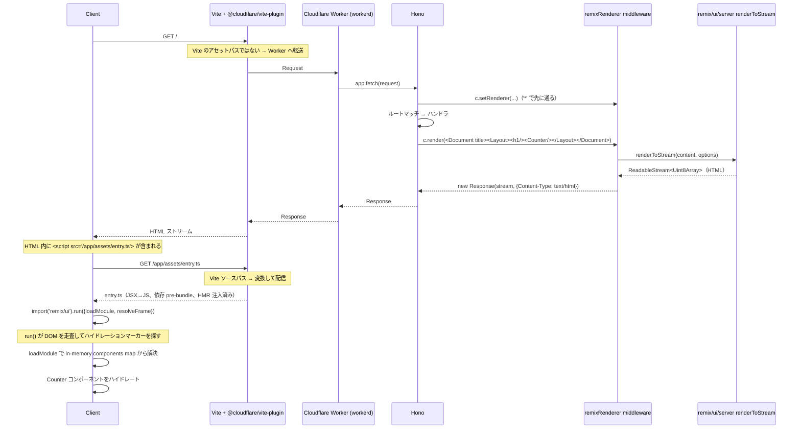

# hono-remix-v3-cloudflare-example

**Remix v3 の UI / SSR** を **Cloudflare Workers** 上で **Hono** をリクエストルーターとして動かす検証用アプリ。ローカル開発とバンドルは Vite (`@cloudflare/vite-plugin` 経由) が担当します。

ページは 2 つ:

- `/` — メモリ上のカウンター
- `/todo` — メモリ上の TODO リスト（永続化なし）

## 技術スタック

| レイヤー                   | 採用                                                                         |
| -------------------------- | ---------------------------------------------------------------------------- |
| HTTP ルーター              | **Hono**（`remix/fetch-router` の代替）                                      |
| SSR / UI                   | **Remix v3 `remix/ui` + `remix/ui/server`**（そのまま流用）                  |
| クライアントバンドル / dev | **Vite** + `@cloudflare/vite-plugin`（`remix/assets` ランタイムの代替）      |
| ランタイム                 | **Cloudflare Workers**（dev は Vite plugin 経由の workerd、prod も Workers） |

ポイントは、Remix v3 のうち Node 専用 API（`remix/node-serve`、`remix/assets` など）を全て排除し、残った Web API ベースの部分だけ Workers 上でそのまま動かしている点です。

## コマンド

`build` は Vite+ タスク（`vite.config.ts`）として定義されており、`dist/**` と `.wrangler/**` を input から除外しているため再実行でキャッシュが効きます。`dev` / `start` / `deploy` / `typecheck` は引き続き `package.json` の script です。リポジトリルートからは `--filter` で対象を絞れます:

```sh
vp run --filter hono-remix-v3-cloudflare-example dev        # vp dev — Worker は Vite 内で動作、HMR あり
vp run --filter hono-remix-v3-cloudflare-example start      # wrangler dev — ビルド済み出力を workerd で実行
vp run --filter hono-remix-v3-cloudflare-example build      # vp build — Worker / クライアント両方のバンドルを生成（キャッシュあり）
vp run --filter hono-remix-v3-cloudflare-example deploy     # wrangler deploy
vp run --filter hono-remix-v3-cloudflare-example typecheck  # tsgo --noEmit
```

このアプリディレクトリ内で `vp run <task>` も可。依存解決はリポジトリルートで `pnpm install`。Bun は使いません。

## ディレクトリ構成

```text
app/
├── entry.worker.ts          # Cloudflare Worker のエントリ — Hono アプリを再 export
├── app.tsx                  # Hono ルーティング + ハンドラ inline + middleware 登録
├── ui/
│   ├── document.tsx         # <html><head><body>... + dev/prod 切替の <script src=>
│   ├── layout.tsx           # ナビ + <main> ラッパ
│   ├── counter.client.tsx   # clientEntry — インタラクティブなカウンター
│   └── todo.client.tsx      # clientEntry — インタラクティブな TODO
└── assets/
    └── entry.ts             # クライアントエントリ — vite-plugin-remix の boot() を呼び出す
```

SSR middleware は [`hono-remix-middleware`](../../package/hono-remix-middleware/README.md) パッケージから import するため、アプリ側に middleware ディレクトリは持ちません。`app.tsx` 1 ファイルにルーティングとハンドラ本体を集約しています。controller / utils レイヤーも持っていません。

## SSR の流れ

### シーケンス（1 ページリクエスト）


