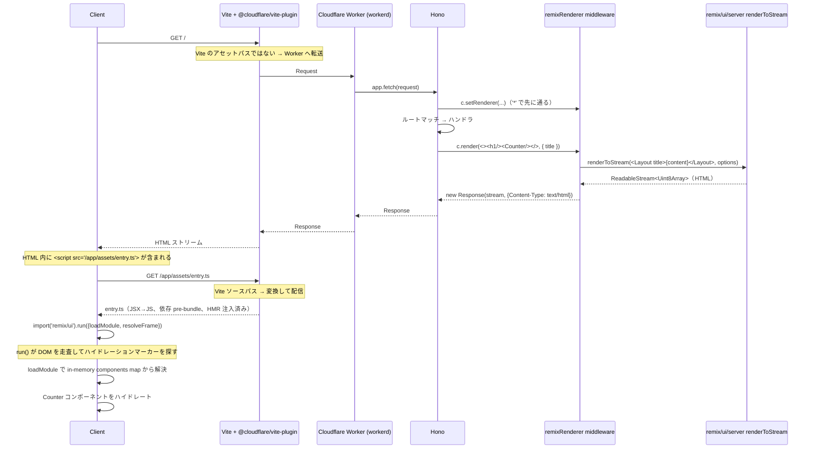

# hono-remix-v3-cloudflare-example

**Remix v3 の UI / SSR** を **Cloudflare Workers** 上で **Hono** をリクエストルーターとして動かす検証用アプリ。ローカル開発とバンドルは Vite (`@cloudflare/vite-plugin` 経由) が担当します。

ページは 2 つ:

- `/` — メモリ上のカウンター
- `/todo` — メモリ上の TODO リスト（永続化なし）

## 技術スタック

| レイヤー                   | 採用                                                                         |
| -------------------------- | ---------------------------------------------------------------------------- |
| HTTP ルーター              | **Hono**（`remix/fetch-router` の代替）                                      |
| SSR / UI                   | **Remix v3 `remix/ui` + `remix/ui/server`**（そのまま流用）                  |
| クライアントバンドル / dev | **Vite** + `@cloudflare/vite-plugin`（`remix/assets` ランタイムの代替）      |
| ランタイム                 | **Cloudflare Workers**（dev は Vite plugin 経由の workerd、prod も Workers） |

ポイントは、Remix v3 のうち Node 専用 API（`remix/node-serve`、`remix/assets` など）を全て排除し、残った Web API ベースの部分だけ Workers 上でそのまま動かしている点です。

## コマンド

`build` は Vite+ タスク（`vite.config.ts`）として定義されており、`dist/**` と `.wrangler/**` を input から除外しているため再実行でキャッシュが効きます。`dev` / `start` / `deploy` / `typecheck` は引き続き `package.json` の script です。リポジトリルートからは `--filter` で対象を絞れます:

```sh
vp run --filter hono-remix-v3-cloudflare-example dev        # vp dev — Worker は Vite 内で動作、HMR あり
vp run --filter hono-remix-v3-cloudflare-example start      # wrangler dev — ビルド済み出力を workerd で実行
vp run --filter hono-remix-v3-cloudflare-example build      # vp build — Worker / クライアント両方のバンドルを生成（キャッシュあり）
vp run --filter hono-remix-v3-cloudflare-example deploy     # wrangler deploy
vp run --filter hono-remix-v3-cloudflare-example typecheck  # tsgo --noEmit
```

このアプリディレクトリ内で `vp run <task>` も可。依存解決はリポジトリルートで `pnpm install`。Bun は使いません。

## ディレクトリ構成

```text
app/
├── entry.worker.ts       # Cloudflare Worker のエントリ — Hono アプリを再 export
├── app.tsx               # Hono ルーティング + ハンドラ inline + middleware 登録
├── middleware/
│   └── renderer.tsx      # Hono の jsxRenderer 風 middleware — c.render を SSR に差し替え
├── ui/
│   ├── document.tsx      # <html><head><body>... + dev/prod 切替の <script src=>
│   ├── layout.tsx        # ナビ + <main> ラッパ
│   ├── counter.tsx       # clientEntry — インタラクティブなカウンター
│   └── todo.tsx          # clientEntry — インタラクティブな TODO
└── assets/
    └── entry.ts          # クライアントエントリ — remix/ui の run() を呼び出す
```

`app.tsx` 1 ファイルにルーティング・middleware・ハンドラ本体まで集約しています。controller / utils レイヤーは持っていません。

## SSR の流れ

### シーケンス（1 ページリクエスト）



### ステップごとの解説

#### 1. Worker にリクエストが届くまで

`vite dev` が dev サーバ。Vite が認識できるパス（`/@vite/...`、`/node_modules/.vite/...` など）は Vite が直接さばき、それ以外は `@cloudflare/vite-plugin` の workerd shim 経由で Worker に転送されます。Worker のエントリは `app/entry.worker.ts` で、Hono アプリを再 export しているだけです。

```ts:app/entry.worker.ts
import app from './app.tsx'
export default app
```

#### 2. Hono が middleware 経由で SSR を組み立てる

```tsx:app/app.tsx
const app = new Hono()

app
  .use(logger())
  .use('*', remixRenderer((request) => app.fetch(request)))   // ← jsxRenderer 風
  .get('/', (c) =>
    c.render(<><h1>Counter</h1><Counter initial={0} /></>, { title: 'Counter' }),
  )
  .get('/todo', (c) =>
    c.render(<><h1>TODO</h1><Todo /></>, { title: 'TODO' }),
  )
```

- `remixRenderer(fetcher)` が middleware として登録され、各リクエストの `c` に `c.render(content, { title })` を仕込みます。Hono の組み込み [`jsxRenderer`](https://hono.dev/docs/middleware/builtin/jsx-renderer) と同じ作法。
- ハンドラは「中身の JSX を `c.render` に渡すだけ」の 1 行になります。`<Layout>` を巻く責務は middleware に集約。
- `app.fetch` 依存は **`app.ts` 内のクロージャ 1 箇所** に閉じます（middleware ファクトリの引数として `fetcher` を受け取るので、middleware 自体は `app` を import しません）。

#### 3. middleware が `renderToStream` を呼ぶ

```tsx:app/middleware/renderer.tsx
declare module 'hono' {
  interface ContextRenderer {
    (content: RemixNode, props?: { title?: string }): Response
  }
}

export const remixRenderer = (fetcher: typeof fetch): MiddlewareHandler => async (c, next) => {
  c.setRenderer((content, props = {}) => {
    const stream = renderToStream(<Layout title={props.title}>{content}</Layout>, {
      frameSrc: c.req.url,
      resolveClientEntry(entryId, component) {
        // 旧来の "/assets/" プレフィックスを剥がして Vite のソースパスに合わせる
        const [rawHref, hash] = entryId.split('#')
        const href = rawHref.startsWith('/assets/') ? rawHref.slice('/assets'.length) : rawHref
        return { exportName: hash || (component.name ?? ''), href }
      },
      async resolveFrame(src, target) {
        // 入れ子 SSR（frame）— closure で渡された fetcher 経由
        const headers = new Headers({ accept: 'text/html' })
        const cookie = c.req.header('cookie')
        if (cookie) headers.set('cookie', cookie)
        if (target) headers.set('x-remix-target', target)
        const response = await fetcher(new Request(new URL(src, c.req.url), { headers }))
        return response.body ?? response.text()
      },
    })
    return new Response(stream, { headers: { 'Content-Type': 'text/html; charset=utf-8' } })
  })
  return next()
}
```

設計の要点:

- **`typeof fetch` 型で依存を切る** — middleware は `Hono` を import しないし、`app` モジュールも知らない。受け取るのは Web 標準の `fetch` シグネチャだけで、テストもしやすい。`app.fetch` を読む責務は登録側（`app.tsx`）に閉じている。
- **`Layout` の組み付けは middleware の中** — controller には JSX の中身しか書かれず、レイアウト切替が必要なら別の middleware を別ルートに `app.use('/admin/*', remixRenderer2(...))` の形で当てる。
- **`resolveClientEntry`** — `clientEntry('/assets/app/ui/counter.tsx#Counter', …)` の `/assets/` プレフィックスを剥がし、Vite のソースパス（`/app/ui/counter.tsx`）に揃える。書き換え後の `href` が SSR HTML 内の `moduleUrl` になる。
- **`resolveFrame`** — frame の入れ子 SSR でも同じ Hono アプリに再投入。依存は `fetcher` クロージャだけなので循環 import が起こらない。

#### 4. SSR HTML がハイドレーションマーカーを含む

`clientEntry` のコンポーネントごとに、`renderToStream` がコメントマーカーとハイドレーション用の JSON レコードを書き込みます:

```html
<!-- rmx:h:hb1975a2c -->
<button type="button">…</button>
<!-- /rmx:h -->
… {"moduleUrl":"/app/ui/counter.tsx","exportName":"Counter","props":{"initial":0}}
```

ステートを持たない `Layout` / `Document` はマーカーを残しません — サーバ出力のみで再レンダーされません。

#### 5. クライアントが entry を実行

`Document` 内で挿入されるスクリプトは dev / prod で URL が切り替わります:

```tsx
<script type='module' src={import.meta.env.DEV ? '/app/assets/entry.ts' : '/assets/entry.js'}></script>
```

- **dev**: Vite が `/app/assets/entry.ts` を on-the-fly に変換して配信。`remix/ui` は `/node_modules/.vite/deps/remix_ui.js` に pre-bundle、HMR クライアントが注入される。
- **prod**: Workers Assets バインディングが `dist/client/assets/entry.js`（vite build 出力）を配信。ハッシュなしの固定ファイル名で発行。

`entry.ts` は `import.meta.glob` の **lazy** 形式で `app/ui/*.tsx` をローダ群として登録し、`loadModule` で per-component に動的 import を発火します。Vite が dev / prod の両方で URL 解決を担うので、SSR の `moduleUrl` (`/app/ui/<file>.tsx`) は単なる Map のキーになります:

```ts:app/assets/entry.ts
import { run } from 'remix/ui'

const loaders = import.meta.glob<Record<string, unknown>>('../ui/*.tsx')
const components = Object.fromEntries(
  Object.entries(loaders).map(([rel, loader]) => [rel.replace(/^\.\.\//, '/app/'), loader]),
)

run({
  async loadModule(moduleUrl, exportName) {
    const loader = components[moduleUrl]
    if (!loader) throw new Error(`No client entry registered for ${moduleUrl}`)
    const mod = await loader()
    return mod[exportName]
  },
  async resolveFrame(src, signal, target) {
    const headers = new Headers({ accept: 'text/html' })
    if (target) headers.set('x-remix-target', target)
    const response = await fetch(src, { credentials: 'same-origin', headers, signal })
    return response.body ?? response.text()
  },
})
```

`run()` は DOM を走査し、`<!-- rmx:h:hXXX -->` マーカーを全て見つけ、対応する `{moduleUrl, exportName, props}` レコードを引き、各々について `loadModule` を呼びます。各 component は **個別 chunk** として遅延ロードされ、Remix の asset server と同じ「コンポーネントごとに独立スクリプト」パターンを再現します。

- **dev**: ローダは `() => import('/app/ui/counter.tsx')` に解決。Vite が当該ソースをその場で変換配信。
- **prod**: ローダは `() => import('./counter-<hash>.js')` に解決。Workers Assets が `dist/client/assets/counter-<hash>.js` を配信。

ロードした component の中身は普通のインタラクティブコンポーネント — クロージャ変数が状態を保持し、`handle.update()` で再レンダーします。

### `clientEntry` の ID が `/assets/` で始まる理由

`clientEntry('/assets/app/ui/counter.tsx#Counter', …)` は `remix new` scaffold が生成するそのままの形式です。Remix のテンプレートは `createAssetServer` が `/assets` にマウントされている前提だからです。本構成では asset server を取り除いているため、`resolveClientEntry` でプレフィックスを書き換えて Vite のソースパスに合わせます。コンポーネント側のコードは Remix scaffold 規約のまま、書き換えロジックは middleware 1 箇所に集約されます。

## オリジナルの Remix テンプレートとの違い

上流のテンプレート（[remix-run/remix `template/`](https://github.com/remix-run/remix/blob/main/template/README.md)）は:

- `remix/fetch-router` でルーティング → 本構成は **Hono** + jsxRenderer 風 middleware
- `remix/assets` の `createAssetServer` で Node ランタイムにクライアントモジュールをコンパイル＆配信 → 本構成は dev で **Vite**、本番も Vite ビルドで `@cloudflare/vite-plugin` が Worker と Vite を接続
- `remix/node-serve` で Node の HTTP エントリ → 本構成は Cloudflare Worker の default export (`fetch`)
- `app/routes.ts` + `app/router.ts` + 各 controller でルート契約・配線・ハンドラを分割 → `app/app.tsx` に inline 集約
- `utils/render.tsx` でレンダリング関数を export → Hono の `c.render` に置換、Layout は `remixRenderer` middleware で適用
- scaffold ホームページは `/assets/...` 配下の `clientEntry` URL を使用 → `clientEntry` API はそのままで `resolveClientEntry` で URL を書き換え

SSR パイプライン本体（`renderToStream`、`clientEntry`、`run()`、ハイドレーションマーカー）は **テンプレートと同一**です。差し替えたのはルーティング層と asset / runtime 層、それと「レンダリングの呼び出し口」だけです。

## ビルド / デプロイ

`vp run build` は 2 段階のビルドを順に実行します（`vite.config.ts` の `builder.buildApp` でクライアント環境を先に走らせる）:

1. **client environment** — `app/assets/entry.ts` を入口に、`app/ui/*.tsx` を lazy glob で個別 chunk 化。`dist/client/assets/entry.js`（メイン）と `dist/client/assets/<name>-<hash>.js`（component / 共通モジュール chunk）を出力。manifest も `dist/client/.vite/manifest.json` に出る。
2. **worker environment** — Hono アプリ + SSR を `dist/my_remix_app/index.js` に出力。`dist/my_remix_app/wrangler.json` も同時生成され、wrangler はこちらを使ってデプロイする。

`wrangler.jsonc` には `assets.directory: ./dist/client` を設定済みで、`/assets/entry.js` 等の静的ファイルは Workers Assets バインディング経由で配信され、それ以外のリクエストは Worker (Hono) に流れます。

```sh
vp run --filter hono-remix-v3-cloudflare-example build   # 上記 2 段階ビルド
vp run --filter hono-remix-v3-cloudflare-example start   # ローカルで wrangler dev — workerd + Workers Assets で本番形態を再現
vp run --filter hono-remix-v3-cloudflare-example deploy  # wrangler deploy
```

### 既知のトレードオフ

- メインの `entry.js` は固定ファイル名（`entryFileNames: 'assets/entry.js'`）で出力しているため、cache busting が効きません。component chunk 側は `[name]-[hash].js` でハッシュ付き。リリースごとに `entry.js` も変える場合は `entry.[hash].js` に切り替え、Vite manifest を Worker から読む経路（仮想モジュール経由など）を別途実装してください。
- `import.meta.glob('../ui/*.tsx')` は `*.tsx` を全て対象にするため、`document.tsx` / `layout.tsx` のような **clientEntry を持たない** モジュールも chunk として `dist/client/assets/` に出力されます。SSR の `moduleUrl` がこれらを指さないので**クライアントは fetch しない**（無駄な network 往復は発生しない）ものの、ディスク上は残ります。完全に除外したいなら命名規約（`*.client.tsx` など）に切り替えて glob を絞ってください。
