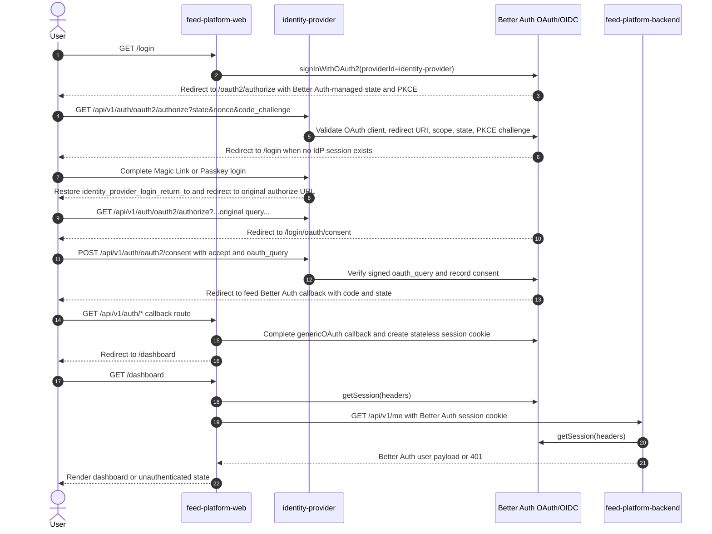

# Authentication Flow

This document describes the Identity Provider authentication flow and uses
`feed-platform-web` plus `feed-platform-backend` as the concrete relying-party
example. It also records the OAuth 2.0, OpenID Connect, and security
best-practice status of the current implementation.

## Scope

The Identity Provider is implemented with Better Auth and exposes its auth API
under `/api/v1/auth`. It currently provides:

- Magic Link login.
- Passkey login and registration.
- OAuth 2.0 Authorization Code flow for `feed-platform-web`.
- OIDC ID tokens signed by the Better Auth JWT/JWKS plugin.
- JWT access tokens for API calls when the token request includes a valid
  `resource` audience.
- Refresh tokens for the `offline_access` scope.

The feed example consists of:

- `identity-provider` on `http://localhost:8787` for Better Auth endpoints and
  IdP UI pages.
- `feed-platform-web` on `http://127.0.0.1:8789` as the OAuth client and browser
  app.
- `feed-platform-backend` on `http://127.0.0.1:8788` as the BFF API protected by
  IdP-issued JWTs.

## Sequence diagram



## Local feed Better Auth session flow

### 1. Unauthenticated request and return-to preservation

When an unauthenticated user hits a protected route in `feed-platform-web`,
`requireAuthMiddleware` stores the current path in a
`feed_platform_web_login_return_to` cookie and redirects to:

```text
/app/login?preserve_return_to=true
```

The `preserve_return_to` query parameter tells the login route not to clear the
return-to cookie. Without it, the cookie is deleted so stale values do not
survive across unrelated login attempts.

### 2. Login starts in feed-platform-web

`GET /app/login` in `feed-platform-web` delegates sign-in to its local Better
Auth instance:

```text
POST /api/v1/auth/sign-in/oauth2
```

The local Better Auth instance uses the `genericOAuth` plugin with
`identity-provider` as the provider. Better Auth owns OAuth state, PKCE,
callback handling, and the resulting browser session cookie. The web app no
longer stores `oauth_state`, `pkce_verifier`, nonce rows, ID tokens, access
tokens, or refresh tokens itself.

After Better Auth completes the genericOAuth callback, the browser is redirected
to `/api/v1/auth-callback` in `feed-platform-web`. That route reads the
`feed_platform_web_login_return_to` cookie, deletes it, and redirects the user
to the originally requested path (defaulting to `/app`).

### 3. Identity Provider login

If the user is not signed in, Better Auth redirects to the configured login page:

```text
/login
```

The IdP `/login` route is the single owner of the IdP login return target.
It uses the same `preserve_return_to=true` pattern as `feed-platform-web`:

1. If `preserve_return_to=true` is present, the route leaves the existing
   `identity_provider_login_return_to` cookie untouched.
2. Otherwise, if the current URL contains OAuth authorization parameters
   (`client_id` and `redirect_uri`), the route stores the reconstructed authorize
   URL (`/api/v1/auth/oauth2/authorize?...`) in that cookie.
3. If neither condition applies, the route deletes the cookie so stale return
   targets do not survive unrelated login attempts.

For logged-in user pages under `/app`, the IdP `requireAuthMiddleware` follows
the same behavior as `feed-platform-web`: when there is no IdP session, it stores
the requested `/app/...` path in `identity_provider_login_return_to` and redirects
to `/login?preserve_return_to=true`.

Magic Link and Passkey UI components do not receive or forward return targets.
Both authentication methods finish at the shared `/login/callback` route.
After that callback validates the IdP session, the IdP reads
`identity_provider_login_return_to`, deletes the cookie, and redirects back to
the requested `/app/...` page or the original OAuth authorize URL. OAuth authorize
requests then continue through consent and eventually redirect to the
`feed-platform-web` OAuth callback.

### 4. Consent page

Better Auth redirects to the configured consent page:

```text
/login/oauth/consent
```

The consent screen displays `client_id`, `scope`, and `redirect_uri`. The client
entry `oauth-consent.client.tsx` submits the decision to:

```text
POST /api/v1/auth/oauth2/consent
```

with JSON:

```json
{
  "accept": true,
  "oauth_query": "...signed OAuth query from window.location.search..."
}
```

Better Auth requires `oauth_query` so it can verify the signed authorization
request and reconstruct provider state. When consent is accepted, Better Auth
returns a JSON object containing `redirect: true` and the final callback URL.
The browser is then sent to `feed-platform-web` with an authorization code.

### 5. Better Auth callback and stateless session

Better Auth handles the OAuth callback under `feed-platform-web`'s auth base path:

```text
/api/v1/auth/*
```

The `genericOAuth` provider exchanges the code at the IdP token endpoint and
builds a local Better Auth user from the OIDC ID token. The feed web session is a
Better Auth stateless cookie using `session.cookieCache` with the `jwe` strategy;
there is no feed-specific session database table.

### 6. Dashboard and backend call

`feed-platform-web` auth middleware calls:

```ts
auth.api.getSession({ headers })
```

If a Better Auth session exists, the dashboard forwards the browser's Better Auth
session cookie to `feed-platform-backend` when calling:

```text
GET http://localhost:8788/api/v1/me
Cookie: better-auth session cookie
```

`feed-platform-backend` uses the same Better Auth stateless-session settings and
also calls `auth.api.getSession({ headers })`. It does not implement its own JWT,
JWKS, issuer, audience, token-use, or refresh-token validation.

### 7. Logout

`GET /app/logout` in `feed-platform-web` delegates sign-out to Better Auth
(`auth.api.signOut`), then deletes all Better Auth cookies that were set in the
sign-out response headers by reading their names dynamically from the
`Set-Cookie` response headers. Finally it redirects to `/app`.

Current logout is local to the feed web Better Auth session and does not perform
OIDC RP-Initiated Logout at the IdP.

## OAuth 2.0 and OIDC compliance status

The references used for this status are OAuth 2.0 Authorization Framework
(RFC 6749), PKCE (RFC 7636), OAuth 2.0 Security Best Current Practice
(RFC 9700), OAuth token revocation (RFC 7009), OAuth discovery metadata
(RFC 8414), JSON Web Token (RFC 7519), JSON Web Key (RFC 7517), OpenID Connect
Core 1.0, and the OWASP OAuth2 Cheat Sheet.

### Implemented or mostly compliant

| Area                      | Status                     | Evidence                                                                                      |
| ------------------------- | -------------------------- | --------------------------------------------------------------------------------------------- |
| Authorization Code flow   | Implemented                | Feed web delegates the OAuth flow to Better Auth `genericOAuth`.                              |
| PKCE                      | Implemented                | Better Auth owns state and PKCE for the generic OAuth provider.                               |
| `state` CSRF binding      | Implemented                | Better Auth owns OAuth state validation for the feed web client.                              |
| OIDC `nonce`              | Delegated                  | Feed web no longer verifies nonce itself; provider callback handling is owned by Better Auth. |
| Exact redirect URI        | Implemented for local feed | Seeded redirect URI is `http://127.0.0.1:8789/api/v1/auth/oauth2/callback/identity-provider`. |
| ID token signing and JWKS | Implemented                | IdP uses Better Auth `jwt` with ES256 and exposes `/api/v1/auth/jwks`.                        |
| Stateless session auth    | Implemented                | Feed web and backend both authorize with Better Auth `auth.api.getSession({ headers })`.      |
| Refresh token table       | Implemented                | `oauth_refresh_token` table exists and maps `scopes` to `scope`.                              |
| Consent endpoint          | Implemented                | Consent screen calls `/oauth2/consent` with Better Auth `oauth_query`.                        |

### Non-compliant, incomplete, or local-only behavior

#### Raw local client secret storage

Current behavior:

- `identity-provider` configures `storeClientSecret` with identity `hash` and
  equality `verify`.
- The local seed stores the raw dev secret.

Why this is a problem:

- OAuth clients with `client_secret` are confidential clients. A stored raw
  secret increases blast radius if the IdP database is disclosed.
- This is acceptable only as a deterministic local-development exception.

Fix:

- In production, remove the identity `storeClientSecret` override and store
  Better Auth's default hashed secret value.
- Alternatively use a custom KMS-backed encrypted storage strategy with
  rotation.
- Document the one-time migration that hashes existing stored client secrets.

#### HTTP localhost origins

Current behavior:

- Local IdP runs on `http://localhost:8787`.
- Feed web runs on `http://127.0.0.1:8789`.

Why this is a problem:

- OAuth/OIDC production deployments must use HTTPS. Plain HTTP is only suitable
  for local loopback development.
- `localhost` and `127.0.0.1` are not interchangeable in redirect validation,
  cookie scoping, or issuer strings.

Fix:

- Production origins must be HTTPS and stable.
- Keep redirect URIs exact and environment-specific.
- Avoid mixing `localhost` and `127.0.0.1` except where the local topology
  explicitly requires separate cookie scopes.

#### Consent information is minimal

Current behavior:

- Consent shows `client_id`, requested scopes, and redirect URI.

Why this is incomplete:

- OIDC consent should be understandable to users. `client_id` alone is not a
  friendly application identity.
- Users are not told what each scope permits, how long access lasts, or whether
  refresh/offline access is being granted.

Fix:

- Resolve and display registered client name, owner/contact, and client URI.
- Explain each requested scope in product language.
- Highlight `offline_access` separately because it grants refresh-token based
  access.

#### No persisted consent review or revocation UI

Current behavior:

- Consent can be recorded by Better Auth, but there is no user-facing page to
  review or revoke existing grants.

Why this is incomplete:

- Security best practices expect users or administrators to revoke application
  access without deleting the whole account.

Fix:

- Add an IdP account page section listing `oauth_consent`, access tokens, and
  refresh tokens by client.
- Provide a revoke action using token/consent deletion or Better Auth revoke
  endpoints where applicable.

#### Logout is not OIDC RP-Initiated Logout

Current behavior:

- Feed web clears its cookies and attempts Better Auth sign-out.
- It does not perform standards-based RP-Initiated Logout.
- It does not revoke the OAuth refresh token.

Why this is incomplete:

- Clearing local cookies does not necessarily invalidate server-side refresh
  tokens or all relying-party sessions.

Fix:

- Implement token revocation for server-side feed refresh sessions using
  RFC 7009-compatible revoke behavior if the provider exposes it.
- Add OIDC RP-Initiated Logout support when Better Auth configuration and client
  metadata support `end_session_endpoint` and `post_logout_redirect_uri`.

#### Feed web and backend share Better Auth stateless session validation

Current behavior:

- `feed-platform-web` owns the relying-party browser session with Better Auth
  `genericOAuth` and `session.cookieCache.strategy = "jwe"`.
- `feed-platform-web` middleware calls `auth.api.getSession({ headers })` instead
  of verifying an ID token itself.
- `feed-platform-backend` receives the forwarded Better Auth session cookie and
  also calls `auth.api.getSession({ headers })`.
- The feed backend no longer contains custom JWT/JWKS/audience/token-use
  validation code.

Why this matters:

- The feed apps now use Better Auth as the single session authority instead of
  maintaining a second OAuth token store and verifier.
- Both services must share the same Better Auth secret and stateless session
  settings. A secret mismatch invalidates backend requests even when the browser
  is logged into feed web.

Remaining hardening:

- Move the shared Better Auth session settings into a shared package if more feed
  services need to validate the same stateless session.
- Add runtime tests that prove a session cookie issued by `feed-platform-web` is
  accepted by `feed-platform-backend` and rejected after sign-out or expiry.

#### CSRF and origin policy around sign-out and consent need explicit tests

Current behavior:

- Better Auth validates signed `oauth_query` for consent.
- Feed web and IdP cookies are `HttpOnly` and `SameSite=Lax` where relevant.
- There are no explicit tests proving malicious cross-site POSTs cannot mutate
  consent or sign-out state.

Why this is incomplete:

- OAuth state protects the authorization callback. It does not automatically
  protect every state-changing endpoint.

Fix:

- Add tests for untrusted-origin POSTs to Better Auth state-changing endpoints.
- Configure `trustedOrigins` explicitly for production origins.
- Add CSRF tokens for custom state-changing UI endpoints if they are introduced
  outside Better Auth.

#### Discovery metadata warning remains

Current behavior:

- Better Auth logs a warning requesting
  `/.well-known/oauth-authorization-server/api/v1/auth`.

Why this is incomplete:

- OAuth/OIDC clients use discovery metadata for issuer, JWKS URI, token endpoint,
  supported algorithms, and logout/revocation capabilities.

Fix:

- Expose and test OAuth Authorization Server Metadata and OIDC configuration
  endpoints for the deployed issuer.
- Silence warnings only after the metadata endpoints are intentionally served and
  verified.

#### Database schema drift from Better Auth is a recurring risk

Current behavior:

- The IdP schema manually maps Better Auth OAuth models and fields.
- Recent runtime verification found missing `oauth_refresh_token`, missing access
  token columns, and an incompatible `updated_at` constraint.

Why this is a problem:

- Manual schema drift causes runtime token issuance failures that type checks do
  not catch.

Fix:

- Add a schema compatibility test that runs an authorization-code token exchange
  against the local database.
- Track Better Auth OAuth provider schema changes on dependency updates.
- Prefer generated migrations from the provider schema when available.

## Production hardening checklist

Before using this flow beyond local development:

1. Use HTTPS-only origins and exact registered redirect URIs.
2. Store client secrets hashed or encrypted; do not use the local identity
   secret verifier.
3. Keep `feed-platform-web` and `feed-platform-backend` Better Auth stateless
   session secrets and cookie-cache settings aligned.
4. Do not reintroduce feed-specific ID-token cookies, access-token stores, or
   custom JWKS verification unless the architecture intentionally moves away from
   Better Auth session clients.
5. Implement or validate token revocation for provider-side refresh tokens.
6. Add consent review and revocation UI.
7. Serve OAuth/OIDC discovery metadata and test issuer/JWKS consistency.
8. Add end-to-end tests for Better Auth generic OAuth sign-in, stateless session
   validation in both feed apps, revocation, expiry, and logout.
9. Add negative tests for invalid redirect URI, invalid client secret, replayed
   authorization code, expired stateless session cookies, and untrusted origins.
10. Keep local DB schema migrations in sync with Better Auth model names and field
    mappings.

## Key implementation files

- IdP Better Auth config: `app/feature/auth/better-auth.ts`
- IdP app routes: `app/app.tsx`
- IdP return-to cookie: `app/feature/auth/cookie.ts`
- IdP return-to utilities: `app/feature/auth/return-to.ts`
- IdP preserve-return-to query parameter: `app/feature/auth/query-parameter.ts`
- IdP login client entry: `app/ui/login.client.tsx`
- IdP consent UI: `app/ui/oauth-consent.tsx`
- IdP consent client entry: `app/ui/oauth-consent.client.tsx`
- IdP OAuth schema: `db/schema.hcl`
- Feed Better Auth config: `../../feed-platform-web/app/feature/auth/better-auth.ts`
- Feed auth middleware: `../../feed-platform-web/app/feature/auth/middleware.ts`
- Feed return-to utilities: `../../feed-platform-web/app/feature/auth/return-to.ts`
- Feed return-to cookie: `../../feed-platform-web/app/feature/auth/cookie.ts`
- Feed preserve-return-to query parameter:
  `../../feed-platform-web/app/feature/auth/query-parameter.ts`
- Feed app routes: `../../feed-platform-web/app/app.tsx`
- Feed backend client: `../../feed-platform-web/app/feature/api/client.ts`
- Backend Better Auth config: `../../feed-platform-backend/src/feature/auth/better-auth.ts`
- Backend auth middleware: `../../feed-platform-backend/src/feature/auth/middleware.ts`
