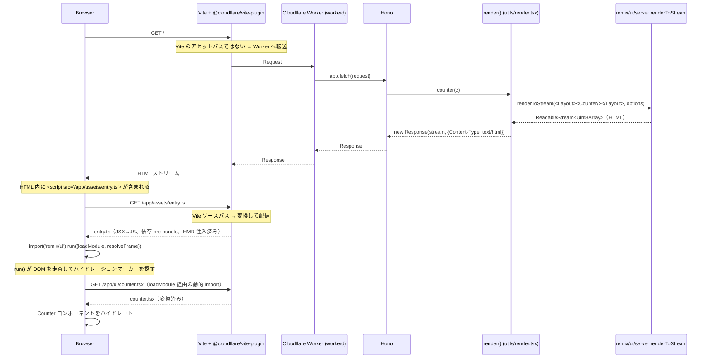

# My Remix App

**Remix v3 の UI / SSR** を **Cloudflare Workers** 上で **Hono** をリクエストルーターとして動かす検証用アプリ。ローカル開発とバンドルは Vite (`@cloudflare/vite-plugin` 経由) が担当します。

ページは 2 つ:

- `/` — メモリ上のカウンター
- `/todo` — メモリ上の TODO リスト（永続化なし）

## 技術スタック

| レイヤー                 | 採用                                                                       |
| ------------------------ | -------------------------------------------------------------------------- |
| HTTP ルーター            | **Hono**（`remix/fetch-router` の代替）                                    |
| SSR / UI                 | **Remix v3 `remix/ui` + `remix/ui/server`**（そのまま流用）                |
| ブラウザバンドル / dev   | **Vite** + `@cloudflare/vite-plugin`（`remix/assets` ランタイムの代替）    |
| ランタイム               | **Cloudflare Workers**（dev は Vite plugin 経由の workerd、prod も Workers） |

ポイントは、Remix v3 のうち Node 専用 API（`remix/node-serve`、`remix/assets` など）を全て排除し、残った Web API ベースの部分だけ Workers 上でそのまま動かしている点です。

## コマンド

このアプリディレクトリ内で実行:

```sh
vp run dev         # vite dev — Worker は Vite 内で動作、HMR あり
vp run start       # wrangler dev — ビルド済み出力を workerd で実行
vp run build       # vite build — Worker / ブラウザ両方のバンドルを生成
vp run deploy      # wrangler deploy
vp run typecheck   # tsgo --noEmit
```

依存解決はリポジトリルートで `pnpm install`。Bun は使いません。

## ディレクトリ構成

```text
app/
├── entry.worker.ts       # Cloudflare Worker のエントリ — Hono アプリを再 export
├── app.ts                # Hono ルーティング: GET / → counter, GET /todo → todo
├── controllers/
│   ├── counter.tsx       # <Layout><Counter/></Layout> をレンダー
│   └── todo.tsx          # <Layout><Todo/></Layout> をレンダー
├── ui/
│   ├── document.tsx      # <html><head><body>... + <script src=/app/assets/entry.ts>
│   ├── layout.tsx        # ナビ + <main> ラッパ
│   ├── counter.tsx       # clientEntry — インタラクティブなカウンター
│   └── todo.tsx          # clientEntry — インタラクティブな TODO
├── utils/render.tsx      # 全 controller が使う renderToStream ラッパ
└── assets/
    └── entry.ts          # ブラウザエントリ — remix/ui の run() を呼び出す
```

## SSR の流れ

### シーケンス（1 ページリクエスト）



### ステップごとの解説

#### 1. Worker にリクエストが届くまで

dev サーバは `vite dev`。Vite が認識できるパス（`/@vite/...`、`/node_modules/.vite/...` など）は Vite が直接さばき、それ以外は `@cloudflare/vite-plugin` の workerd shim 経由で Worker に転送されます。Worker のエントリは `app/entry.worker.ts` で、Hono アプリを再 export しているだけです。

```ts
// app/entry.worker.ts
import app from './app.ts'
export default app
```

#### 2. Hono がコントローラを選ぶ

```ts
// app/app.ts
const app = new Hono().use(logger()).get('/', counter).get('/todo', todo)
```

Hono は `(request, env, ctx) => Response` の素朴なルーターです。プロジェクト内のルート定義はここだけで、`app/routes.ts` も `remix/fetch-router` も残っていません。

#### 3. コントローラが `render()` を呼ぶ

各コントローラは Hono ハンドラで、JSX ツリーを `render()` に渡すだけ:

```ts
// app/controllers/counter.tsx
export const counter = (c: Context) =>
  render(<Layout title='Counter'><Counter initial={0} /></Layout>, c.req.raw)
```

`c.req.raw` は元の Web `Request` で、Remix の SSR はこれをそのまま受け付けます。

#### 4. `render()` が `renderToStream` をラップ

```ts
// app/utils/render.tsx
import { renderToStream } from 'remix/ui/server'

export function render(node, request, init?) {
  const stream = renderToStream(node, {
    frameSrc: request.url,
    resolveClientEntry(entryId, component) {
      // 旧来の "/assets/" プレフィックスを剥がして Vite のソースパスに合わせる
      const [rawHref, hash] = entryId.split('#')
      const href = rawHref.startsWith('/assets/') ? rawHref.slice('/assets'.length) : rawHref
      return { exportName: hash || component.name, href }
    },
    async resolveFrame(src, target) {
      // 入れ子 SSR（frame）— 同じ Hono アプリに再投入
      const headers = new Headers({ accept: 'text/html' })
      if (target) headers.set('x-remix-target', target)
      const response = await app.fetch(new Request(new URL(src, request.url), { headers }))
      return response.body ?? response.text()
    },
  })
  return new Response(stream, { headers: { 'Content-Type': 'text/html; charset=utf-8' } })
}
```

統合の要は次の 2 つのフック:

- **`resolveClientEntry`** — インタラクティブなコンポーネントは `clientEntry('/assets/app/ui/counter.tsx#Counter', …)` のように登録されています。リテラルの `/assets/...` プレフィックスは Remix の asset server 規約由来です。asset server を持たない本構成では Vite が `/app/ui/counter.tsx` で配信するため、ここでプレフィックスを剥がします。書き換え後の `href` が SSR HTML 内のハイドレーション情報 `moduleUrl` として埋め込まれます。
- **`resolveFrame`** — SSR が外部 `<frame>` を見つけたとき、内側の HTML を取得する必要があります。`app.fetch(...)` を呼ぶことで同じ Hono アプリに再投入され、frame もトップレベルリクエストとまったく同じルーティング・ミドルウェアを通ります。

返り値の `stream` は Web `ReadableStream<Uint8Array>` で、HTML を逐次出力します。静的部分から先に流れ、入れ子コンテンツは解決した順に追記されます。

#### 5. SSR HTML がハイドレーションマーカーを含む

`clientEntry` のコンポーネントごとに、`renderToStream` がコメントマーカーとハイドレーション用の JSON レコードを書き込みます:

```html
<!-- rmx:h:hb1975a2c -->
<button type="button">…</button>
<!-- /rmx:h -->
…
{"moduleUrl":"/app/ui/counter.tsx","exportName":"Counter","props":{"initial":0}}
```

ステートを持たない `Layout` / `Document` はマーカーを残しません — サーバ出力のみで再レンダーされません。

#### 6. ブラウザが entry を実行

`Document` 内で挿入されるスクリプトは dev / prod で URL が切り替わります:

```tsx
<script type='module' src={import.meta.env.DEV ? '/app/assets/entry.ts' : '/assets/entry.js'}></script>
```

- **dev**: Vite が `/app/assets/entry.ts` を on-the-fly に変換して配信。`remix/ui` は `/node_modules/.vite/deps/remix_ui.js` に pre-bundle、HMR クライアントが注入される。
- **prod**: Workers Assets バインディングが `dist/client/assets/entry.js`（vite build 出力）を配信。ハッシュなしの固定ファイル名で発行。

`entry.ts` は `import.meta.glob` で `app/ui/*.tsx` を全て eager 取り込みし、`loadModule` をパス参照のメモリ Map に切り替えます — ハイドレーションが per-component の動的 `import()` を発火しないので、本番でも追加のサーバ往復なしに即時マウントできます:

```ts
// app/assets/entry.ts
import { run } from 'remix/ui'

const rawModules = import.meta.glob<Record<string, unknown>>('../ui/*.tsx', { eager: true })
const components = Object.fromEntries(
  Object.entries(rawModules).map(([rel, mod]) => [rel.replace(/^\.\.\//, '/app/'), mod]),
)

run({
  async loadModule(moduleUrl, exportName) {
    const mod = components[moduleUrl]
    if (mod) return mod[exportName]
    // dev でのフォールバック（本番では到達しない）
    const dynamic = await import(/* @vite-ignore */ moduleUrl)
    return dynamic[exportName]
  },
  async resolveFrame(src, signal, target) {
    const headers = new Headers({ accept: 'text/html' })
    if (target) headers.set('x-remix-target', target)
    const response = await fetch(src, { credentials: 'same-origin', headers, signal })
    return response.body ?? response.text()
  },
})
```

`run()` は DOM を走査し、`<!-- rmx:h:hXXX -->` マーカーを全て見つけ、対応する `{moduleUrl, exportName, props}` レコードを引き、各々について `loadModule` を呼びます。動的 `import('/app/ui/counter.tsx')` は Vite が解決し（通常のソースパス）、pre-bundle 済み依存を再利用、JSX をコンパイルしてコンポーネントをマウントします。あとは普通のインタラクティブコンポーネント — クロージャ変数が状態を保持し、`handle.update()` で再レンダーします。

### `clientEntry` の ID が `/assets/` で始まる理由

`clientEntry('/assets/app/ui/counter.tsx#Counter', …)` は `remix new` scaffold が生成するそのままの形式です。Remix のテンプレートは `createAssetServer` が `/assets` にマウントされている前提だからです。本構成では asset server を取り除いているため、`resolveClientEntry` でプレフィックスを書き換えて Vite のソースパスに合わせます。コンポーネント側のコードは Remix scaffold 規約のまま、書き換えロジックは 1 箇所に集約されます。

## オリジナルの Remix テンプレートとの違い

上流のテンプレート（[remix-run/remix `template/`](https://github.com/remix-run/remix/blob/main/template/README.md)）は:

- `remix/fetch-router` でルーティング → 本構成は **Hono**
- `remix/assets` の `createAssetServer` で Node ランタイムにブラウザモジュールをコンパイル＆配信 → 本構成は dev で **Vite**、本番も Vite ビルドで `@cloudflare/vite-plugin` が Worker と Vite を接続
- `remix/node-serve` で Node の HTTP エントリ → 本構成は Cloudflare Worker の default export (`fetch`)
- `app/routes.ts` + `app/router.ts` でルート契約を宣言 → `app/app.ts` に集約
- scaffold ホームページは `/assets/...` 配下の `clientEntry` URL を使用 → `clientEntry` API はそのままで `resolveClientEntry` で URL を書き換え

SSR パイプライン本体（`renderToStream`、`clientEntry`、`run()`、ハイドレーションマーカー）は **テンプレートと同一**です。差し替えたのはルーティング層と asset / runtime 層のみです。

## ビルド / デプロイ

`vp run build` は 2 段階のビルドを順に実行します（`vite.config.ts` の `builder.buildApp` でクライアント環境を先に走らせる）:

1. **client environment** — `app/assets/entry.ts` を入口に、`app/ui/*.tsx` を eager glob で巻き込んで `dist/client/assets/entry.js` に出力。manifest も `dist/client/.vite/manifest.json` に出る（cache busting を導入する場合の参照用）。
2. **worker environment** — Hono アプリ + SSR を `dist/my_remix_app/index.js` に出力。`dist/my_remix_app/wrangler.json` も同時生成され、wrangler はこちらを使ってデプロイする。

`wrangler.jsonc` には `assets.directory: ./dist/client` を設定済みで、`/assets/entry.js` 等の静的ファイルは Workers Assets バインディング経由で配信され、それ以外のリクエストは Worker (Hono) に流れます。

```sh
vp run build       # 上記 2 段階ビルド
vp run start       # ローカルで wrangler dev — workerd + Workers Assets で本番形態を再現
vp run deploy      # wrangler deploy
```

### 既知のトレードオフ

- ブラウザバンドルは現在 `assets/entry.js` の固定ファイル名で出力（`entryFileNames: 'assets/entry.js'`）しているため、cache busting が効きません。リリースごとに変える場合は `entry.[hash].js` に切り替え、Vite manifest を Worker から読む経路（仮想モジュール経由など）を別途実装してください。
- すべての `clientEntry` コンポーネントが entry.js に同梱される一括バンドル方式です。コンポーネントごとの code splitting が必要になったら、`loadModule` を `import.meta.glob` の lazy 形式（`{ eager: false }`）に切り替え、SSR の `resolveClientEntry` で manifest 解決した URL を返すようにします。
