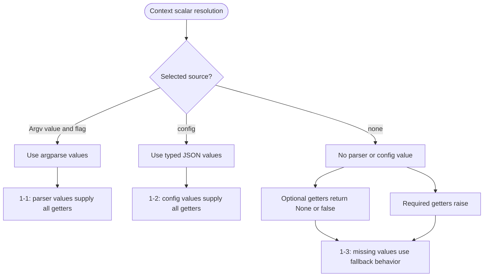
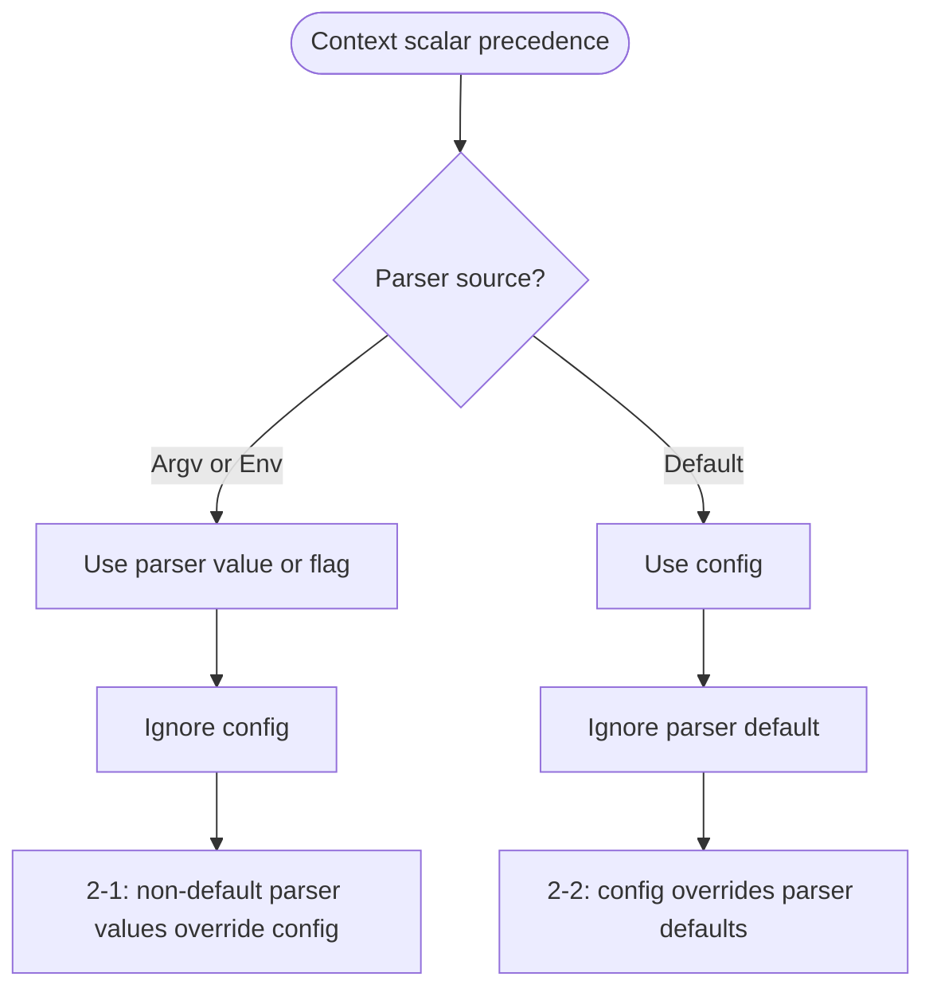
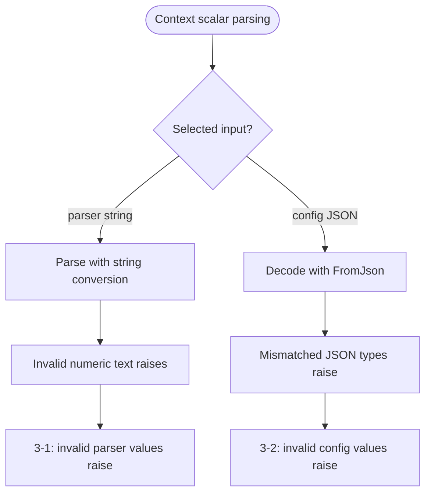
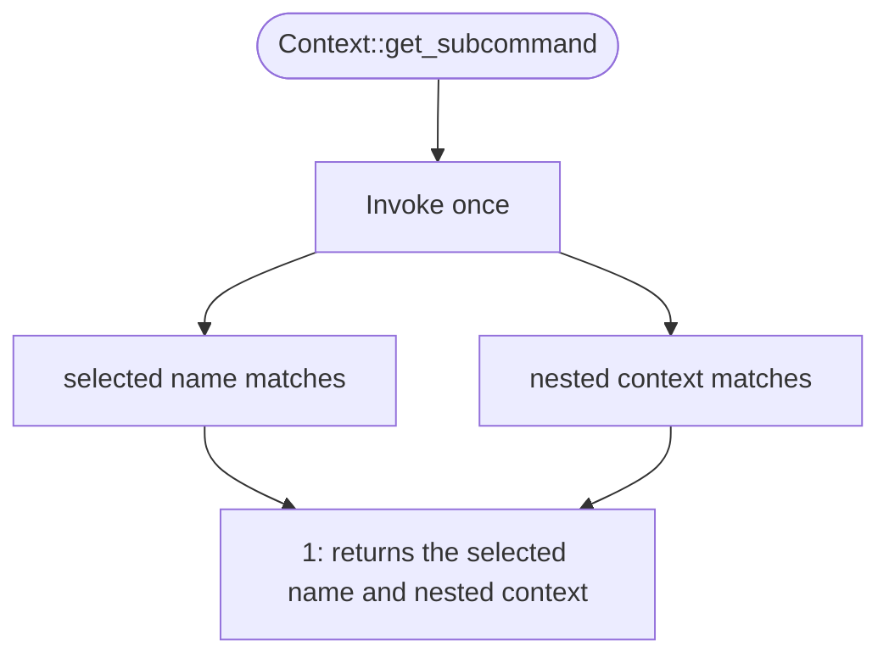

# context.mbt

`Context` resolves scalar values according to their parser source and independently loaded configuration, preserves conversion failures, and exposes the selected subcommand.

## Public API

- `Context::get_bool`
- `Context::get_string`
- `Context::get_string_required`
- `Context::get_int`
- `Context::get_int_required`
- `Context::get_int64`
- `Context::get_int64_required`
- `Context::get_uint`
- `Context::get_uint_required`
- `Context::get_uint64`
- `Context::get_uint64_required`
- `Context::get_double`
- `Context::get_double_required`
- `Context::get_subcommand`

## Test

The scalar getters intentionally share branch-oriented test cases because they implement the same resolution flow for different return types. Each numbered case invokes every applicable getter in the family. `ValueSource` is read-only, so parser-value fixtures obtain `sources` from argparse.

### Scalar resolution

#### Source-specific resolution



#### Precedence



#### Parsing



```mbt check
///|
test "Context scalar resolution 1-1 - parser values supply all getters" {
  let matches = @argparse.Command("test", flags=[@argparse.FlagArg("flag")], options=[
    @argparse.OptionArg("value"),
  ]).parse(argv=["--flag", "--value", "1"], env=Map([]))
  let ctx : Context = {
    flags: matches.flags,
    values: matches.values,
    sources: matches.sources,
    config: Map([]),
    subcommand: None,
  }
  let string_value = string("value", required=true)
  let int_value = int("value", required=true)
  let int64_value = int64("value", required=true)
  let uint_value = uint("value", required=true)
  let uint64_value = uint64("value", required=true)
  let double_value = double("value", required=true)
  inspect(ctx.get_bool(bool("flag")), content="true")
  debug_inspect(ctx.get_string(string_value), content="Some(\"1\")")
  inspect(ctx.get_string_required(string_value), content="1")
  debug_inspect(ctx.get_int(int_value), content="Some(1)")
  inspect(ctx.get_int_required(int_value), content="1")
  debug_inspect(ctx.get_int64(int64_value), content="Some(1)")
  inspect(ctx.get_int64_required(int64_value).to_string(), content="1")
  debug_inspect(ctx.get_uint(uint_value), content="Some(1)")
  inspect(ctx.get_uint_required(uint_value).to_string(), content="1")
  debug_inspect(ctx.get_uint64(uint64_value), content="Some(1)")
  inspect(ctx.get_uint64_required(uint64_value).to_string(), content="1")
  debug_inspect(ctx.get_double(double_value), content="Some(1)")
  inspect(ctx.get_double_required(double_value), content="1")
}

///|
test "Context scalar resolution 1-2 - config values supply all getters" {
  let ctx : Context = {
    flags: Map([]),
    values: Map([]),
    sources: Map([]),
    config: {
      "bool": true.to_json(),
      "string": "1".to_json(),
      "int": (1).to_json(),
      "int64": 1L.to_json(),
      "uint": 1U.to_json(),
      "uint64": 1UL.to_json(),
      "double": 1.0.to_json(),
    },
    subcommand: None,
  }
  let string_value = string("value", config="string", required=true)
  let int_value = int("value", config="int", required=true)
  let int64_value = int64("value", config="int64", required=true)
  let uint_value = uint("value", config="uint", required=true)
  let uint64_value = uint64("value", config="uint64", required=true)
  let double_value = double("value", config="double", required=true)
  inspect(ctx.get_bool(bool("flag", config="bool")), content="true")
  debug_inspect(ctx.get_string(string_value), content="Some(\"1\")")
  inspect(ctx.get_string_required(string_value), content="1")
  debug_inspect(ctx.get_int(int_value), content="Some(1)")
  inspect(ctx.get_int_required(int_value), content="1")
  debug_inspect(ctx.get_int64(int64_value), content="Some(1)")
  inspect(ctx.get_int64_required(int64_value).to_string(), content="1")
  debug_inspect(ctx.get_uint(uint_value), content="Some(1)")
  inspect(ctx.get_uint_required(uint_value).to_string(), content="1")
  debug_inspect(ctx.get_uint64(uint64_value), content="Some(1)")
  inspect(ctx.get_uint64_required(uint64_value).to_string(), content="1")
  debug_inspect(ctx.get_double(double_value), content="Some(1)")
  inspect(ctx.get_double_required(double_value), content="1")
}

///|
test "Context scalar resolution 1-3 - missing values use fallback behavior" {
  let ctx : Context = {
    flags: Map([]),
    values: Map([]),
    sources: Map([]),
    config: Map([]),
    subcommand: None,
  }
  let string_value = string("value", required=true)
  let int_value = int("value", required=true)
  let int64_value = int64("value", required=true)
  let uint_value = uint("value", required=true)
  let uint64_value = uint64("value", required=true)
  let double_value = double("value", required=true)
  inspect(ctx.get_bool(bool("flag")), content="false")
  debug_inspect(ctx.get_string(string_value), content="None")
  debug_inspect(ctx.get_int(int_value), content="None")
  debug_inspect(ctx.get_int64(int64_value), content="None")
  debug_inspect(ctx.get_uint(uint_value), content="None")
  debug_inspect(ctx.get_uint64(uint64_value), content="None")
  debug_inspect(ctx.get_double(double_value), content="None")
  try ctx.get_string_required(string_value) |> ignore catch {
    _ => ()
  } noraise {
    _ => panic()
  }
  try ctx.get_int_required(int_value) |> ignore catch {
    _ => ()
  } noraise {
    _ => panic()
  }
  try ctx.get_int64_required(int64_value) |> ignore catch {
    _ => ()
  } noraise {
    _ => panic()
  }
  try ctx.get_uint_required(uint_value) |> ignore catch {
    _ => ()
  } noraise {
    _ => panic()
  }
  try ctx.get_uint64_required(uint64_value) |> ignore catch {
    _ => ()
  } noraise {
    _ => panic()
  }
  try ctx.get_double_required(double_value) |> ignore catch {
    _ => ()
  } noraise {
    _ => panic()
  }
}

///|
test "Context scalar resolution 2-1 - non-default parser values override config" {
  let matches = @argparse.Command("test", flags=[@argparse.FlagArg("flag")], options=[
    @argparse.OptionArg("value"),
  ]).parse(argv=["--flag", "--value", "2"], env=Map([]))
  let ctx : Context = {
    flags: matches.flags,
    values: matches.values,
    sources: matches.sources,
    config: {
      "bool": false.to_json(),
      "string": "1".to_json(),
      "int": (1).to_json(),
      "int64": 1L.to_json(),
      "uint": 1U.to_json(),
      "uint64": 1UL.to_json(),
      "double": 1.0.to_json(),
    },
    subcommand: None,
  }
  let string_value = string("value", config="string", required=true)
  let int_value = int("value", config="int", required=true)
  let int64_value = int64("value", config="int64", required=true)
  let uint_value = uint("value", config="uint", required=true)
  let uint64_value = uint64("value", config="uint64", required=true)
  let double_value = double("value", config="double", required=true)
  inspect(ctx.get_bool(bool("flag", config="bool")), content="true")
  debug_inspect(ctx.get_string(string_value), content="Some(\"2\")")
  inspect(ctx.get_string_required(string_value), content="2")
  debug_inspect(ctx.get_int(int_value), content="Some(2)")
  inspect(ctx.get_int_required(int_value), content="2")
  debug_inspect(ctx.get_int64(int64_value), content="Some(2)")
  inspect(ctx.get_int64_required(int64_value).to_string(), content="2")
  debug_inspect(ctx.get_uint(uint_value), content="Some(2)")
  inspect(ctx.get_uint_required(uint_value).to_string(), content="2")
  debug_inspect(ctx.get_uint64(uint64_value), content="Some(2)")
  inspect(ctx.get_uint64_required(uint64_value).to_string(), content="2")
  debug_inspect(ctx.get_double(double_value), content="Some(2)")
  inspect(ctx.get_double_required(double_value), content="2")
}

///|
test "Context scalar resolution 2-2 - config overrides parser defaults" {
  let matches = @argparse.Command("test", options=[
    @argparse.OptionArg("value", default_values=["1"]),
  ]).parse(argv=[], env=Map([]))
  let ctx : Context = {
    flags: Map([]),
    values: matches.values,
    sources: matches.sources,
    config: {
      "bool": true.to_json(),
      "string": "2".to_json(),
      "int": (2).to_json(),
      "int64": 2L.to_json(),
      "uint": 2U.to_json(),
      "uint64": 2UL.to_json(),
      "double": 2.0.to_json(),
    },
    subcommand: None,
  }
  let string_value = string("value", config="string", required=true)
  let int_value = int("value", config="int", required=true)
  let int64_value = int64("value", config="int64", required=true)
  let uint_value = uint("value", config="uint", required=true)
  let uint64_value = uint64("value", config="uint64", required=true)
  let double_value = double("value", config="double", required=true)
  inspect(ctx.get_bool(bool("flag", config="bool")), content="true")
  debug_inspect(ctx.get_string(string_value), content="Some(\"2\")")
  inspect(ctx.get_string_required(string_value), content="2")
  debug_inspect(ctx.get_int(int_value), content="Some(2)")
  inspect(ctx.get_int_required(int_value), content="2")
  debug_inspect(ctx.get_int64(int64_value), content="Some(2)")
  inspect(ctx.get_int64_required(int64_value).to_string(), content="2")
  debug_inspect(ctx.get_uint(uint_value), content="Some(2)")
  inspect(ctx.get_uint_required(uint_value).to_string(), content="2")
  debug_inspect(ctx.get_uint64(uint64_value), content="Some(2)")
  inspect(ctx.get_uint64_required(uint64_value).to_string(), content="2")
  debug_inspect(ctx.get_double(double_value), content="Some(2)")
  inspect(ctx.get_double_required(double_value), content="2")
}

///|
test "Context scalar resolution 3-1 - invalid parser values raise" {
  let matches = @argparse.Command("test", options=[@argparse.OptionArg("value")]).parse(
    argv=["--value", "invalid"],
    env=Map([]),
  )
  let ctx : Context = {
    flags: Map([]),
    values: matches.values,
    sources: matches.sources,
    config: Map([]),
    subcommand: None,
  }
  try ctx.get_int(int("value")) |> ignore catch {
    _ => ()
  } noraise {
    _ => panic()
  }
  try ctx.get_int64(int64("value")) |> ignore catch {
    _ => ()
  } noraise {
    _ => panic()
  }
  try ctx.get_uint(uint("value")) |> ignore catch {
    _ => ()
  } noraise {
    _ => panic()
  }
  try ctx.get_uint64(uint64("value")) |> ignore catch {
    _ => ()
  } noraise {
    _ => panic()
  }
  try ctx.get_double(double("value")) |> ignore catch {
    _ => ()
  } noraise {
    _ => panic()
  }
}

///|
test "Context scalar resolution 3-2 - invalid config values raise" {
  let ctx : Context = {
    flags: Map([]),
    values: Map([]),
    sources: Map([]),
    config: {
      "bool": "invalid".to_json(),
      "string": true.to_json(),
      "int": "invalid".to_json(),
      "int64": (1).to_json(),
      "uint": (-1).to_json(),
      "uint64": (1).to_json(),
      "double": "invalid".to_json(),
    },
    subcommand: None,
  }
  try ctx.get_bool(bool("flag", config="bool")) |> ignore catch {
    _ => ()
  } noraise {
    _ => panic()
  }
  try ctx.get_string(string("value", config="string")) |> ignore catch {
    _ => ()
  } noraise {
    _ => panic()
  }
  try ctx.get_int(int("value", config="int")) |> ignore catch {
    _ => ()
  } noraise {
    _ => panic()
  }
  try ctx.get_int64(int64("value", config="int64")) |> ignore catch {
    _ => ()
  } noraise {
    _ => panic()
  }
  try ctx.get_uint(uint("value", config="uint")) |> ignore catch {
    _ => ()
  } noraise {
    _ => panic()
  }
  try ctx.get_uint64(uint64("value", config="uint64")) |> ignore catch {
    _ => ()
  } noraise {
    _ => panic()
  }
  try ctx.get_double(double("value", config="double")) |> ignore catch {
    _ => ()
  } noraise {
    _ => panic()
  }
}
```

### `Context::get_subcommand`



```mbt check
///|
test "Context get_subcommand 1 - returns nested context" {
  let port = string("port")
  let sub_ctx : Context = {
    flags: Map([]),
    values: { "port": ["8080"] },
    sources: Map([]),
    config: Map([]),
    subcommand: None,
  }
  let ctx : Context = {
    flags: Map([]),
    values: Map([]),
    sources: Map([]),
    config: Map([]),
    subcommand: Some(("serve", sub_ctx)),
  }
  match ctx.get_subcommand() {
    Some((name, sub)) => {
      inspect(name, content="serve")
      debug_inspect(sub.get_string(port), content="Some(\"8080\")")
    }
    None => fail("expected subcommand")
  }
}
```
