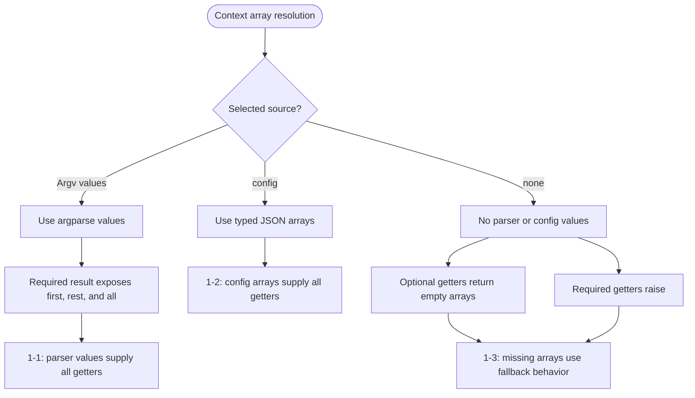
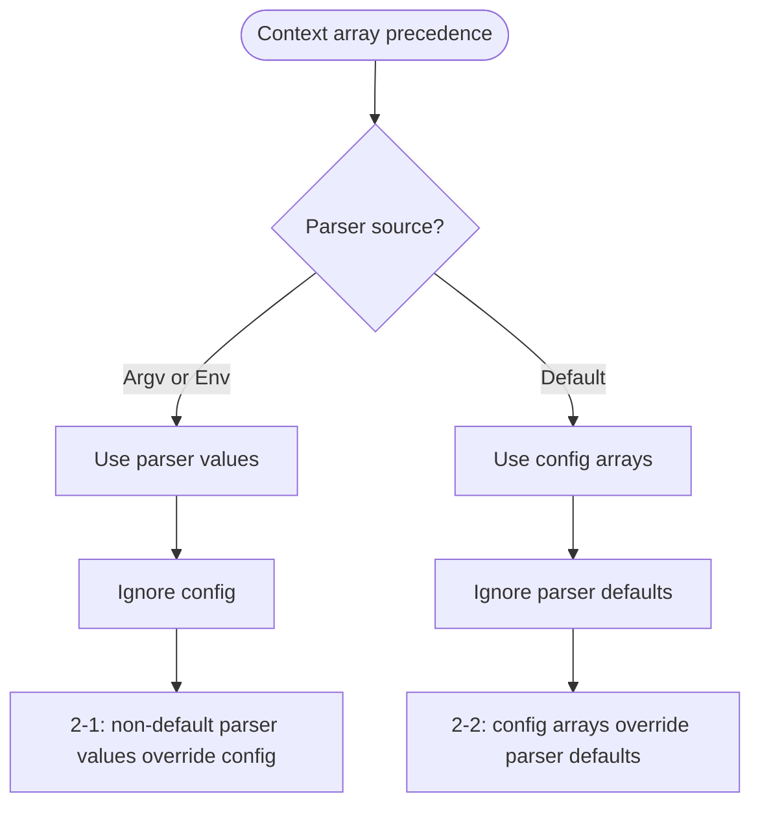
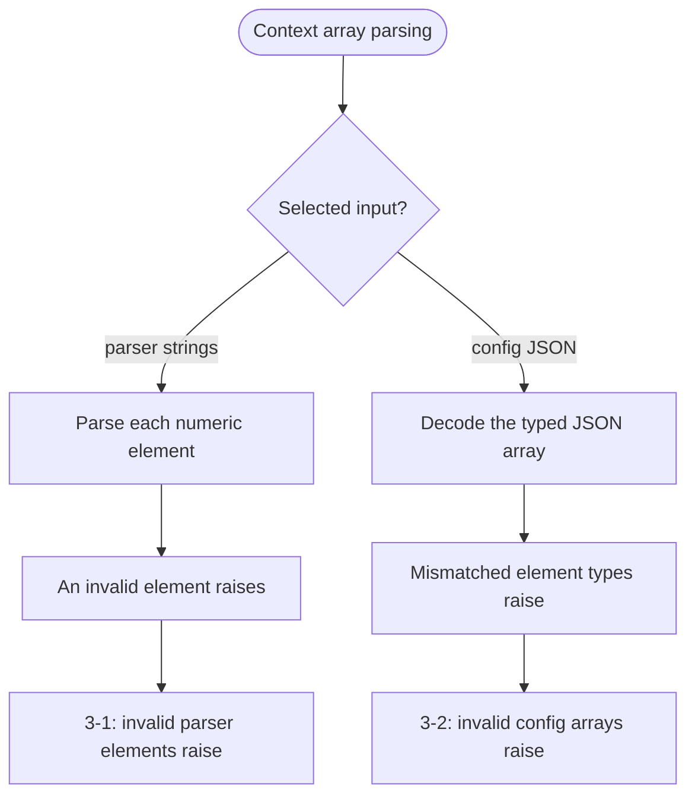

# context_arrays.mbt

`Context` resolves repeated argument values as arrays, returns empty arrays for unavailable optional values, preserves element parsing failures, and represents required values as `NonEmptyArray`.

## Public API

- `Context::get_strings`
- `Context::get_strings_required`
- `Context::get_ints`
- `Context::get_ints_required`
- `Context::get_int64s`
- `Context::get_int64s_required`
- `Context::get_uints`
- `Context::get_uints_required`
- `Context::get_uint64s`
- `Context::get_uint64s_required`
- `Context::get_doubles`
- `Context::get_doubles_required`

## Test

The array getters intentionally share branch-oriented test cases because they implement the same resolution flow for different element types. Each numbered case invokes every applicable getter in the family. `ValueSource` is read-only, so parser-value fixtures obtain `sources` from argparse.

### Array resolution

#### Source-specific resolution



#### Precedence



#### Parsing



```mbt check
///|
test "Context array resolution 1-1 - parser values supply all getters" {
  let matches = @argparse.Command("test", options=[
    @argparse.OptionArg("values", action=@argparse.OptionAction::Append),
  ]).parse(argv=["--values", "1", "--values", "2"], env=Map([]))
  let ctx : Context = {
    flags: Map([]),
    values: matches.values,
    sources: matches.sources,
    config: Map([]),
    subcommand: None,
  }
  let string_values = strings("values", required=true)
  let int_values = ints("values", required=true)
  let int64_values = int64s("values", required=true)
  let uint_values = uints("values", required=true)
  let uint64_values = uint64s("values", required=true)
  let double_values = doubles("values", required=true)
  debug_inspect(ctx.get_strings(string_values), content="[\"1\", \"2\"]")
  debug_inspect(ctx.get_ints(int_values), content="[1, 2]")
  debug_inspect(ctx.get_int64s(int64_values), content="[1, 2]")
  debug_inspect(ctx.get_uints(uint_values), content="[1, 2]")
  debug_inspect(ctx.get_uint64s(uint64_values), content="[1, 2]")
  debug_inspect(ctx.get_doubles(double_values), content="[1, 2]")
  debug_inspect(
    ctx.get_strings_required(string_values),
    content="{ first: \"1\", rest: <ArrayView: [\"2\"]>, all: [\"1\", \"2\"] }",
  )
  debug_inspect(
    ctx.get_ints_required(int_values),
    content="{ first: 1, rest: <ArrayView: [2]>, all: [1, 2] }",
  )
  debug_inspect(
    ctx.get_int64s_required(int64_values),
    content="{ first: 1, rest: <ArrayView: [2]>, all: [1, 2] }",
  )
  debug_inspect(
    ctx.get_uints_required(uint_values),
    content="{ first: 1, rest: <ArrayView: [2]>, all: [1, 2] }",
  )
  debug_inspect(
    ctx.get_uint64s_required(uint64_values),
    content="{ first: 1, rest: <ArrayView: [2]>, all: [1, 2] }",
  )
  debug_inspect(
    ctx.get_doubles_required(double_values),
    content="{ first: 1, rest: <ArrayView: [2]>, all: [1, 2] }",
  )
}

///|
test "Context array resolution 1-2 - config arrays supply all getters" {
  let ctx : Context = {
    flags: Map([]),
    values: Map([]),
    sources: Map([]),
    config: {
      "strings": ["1", "2"].to_json(),
      "ints": [1, 2].to_json(),
      "int64s": [1L, 2L].to_json(),
      "uints": [1U, 2U].to_json(),
      "uint64s": [1UL, 2UL].to_json(),
      "doubles": [1.0, 2.0].to_json(),
    },
    subcommand: None,
  }
  let string_values = strings("values", config="strings", required=true)
  let int_values = ints("values", config="ints", required=true)
  let int64_values = int64s("values", config="int64s", required=true)
  let uint_values = uints("values", config="uints", required=true)
  let uint64_values = uint64s("values", config="uint64s", required=true)
  let double_values = doubles("values", config="doubles", required=true)
  debug_inspect(ctx.get_strings(string_values), content="[\"1\", \"2\"]")
  debug_inspect(
    ctx.get_strings_required(string_values),
    content="{ first: \"1\", rest: <ArrayView: [\"2\"]>, all: [\"1\", \"2\"] }",
  )
  debug_inspect(ctx.get_ints(int_values), content="[1, 2]")
  debug_inspect(
    ctx.get_ints_required(int_values),
    content="{ first: 1, rest: <ArrayView: [2]>, all: [1, 2] }",
  )
  debug_inspect(ctx.get_int64s(int64_values), content="[1, 2]")
  debug_inspect(
    ctx.get_int64s_required(int64_values),
    content="{ first: 1, rest: <ArrayView: [2]>, all: [1, 2] }",
  )
  debug_inspect(ctx.get_uints(uint_values), content="[1, 2]")
  debug_inspect(
    ctx.get_uints_required(uint_values),
    content="{ first: 1, rest: <ArrayView: [2]>, all: [1, 2] }",
  )
  debug_inspect(ctx.get_uint64s(uint64_values), content="[1, 2]")
  debug_inspect(
    ctx.get_uint64s_required(uint64_values),
    content="{ first: 1, rest: <ArrayView: [2]>, all: [1, 2] }",
  )
  debug_inspect(ctx.get_doubles(double_values), content="[1, 2]")
  debug_inspect(
    ctx.get_doubles_required(double_values),
    content="{ first: 1, rest: <ArrayView: [2]>, all: [1, 2] }",
  )
}

///|
test "Context array resolution 1-3 - missing arrays use fallback behavior" {
  let ctx : Context = {
    flags: Map([]),
    values: Map([]),
    sources: Map([]),
    config: Map([]),
    subcommand: None,
  }
  let string_values = strings("values", required=true)
  let int_values = ints("values", required=true)
  let int64_values = int64s("values", required=true)
  let uint_values = uints("values", required=true)
  let uint64_values = uint64s("values", required=true)
  let double_values = doubles("values", required=true)
  debug_inspect(ctx.get_strings(string_values), content="[]")
  debug_inspect(ctx.get_ints(int_values), content="[]")
  debug_inspect(ctx.get_int64s(int64_values), content="[]")
  debug_inspect(ctx.get_uints(uint_values), content="[]")
  debug_inspect(ctx.get_uint64s(uint64_values), content="[]")
  debug_inspect(ctx.get_doubles(double_values), content="[]")
  try ctx.get_strings_required(string_values) |> ignore catch {
    _ => ()
  } noraise {
    _ => panic()
  }
  try ctx.get_ints_required(int_values) |> ignore catch {
    _ => ()
  } noraise {
    _ => panic()
  }
  try ctx.get_int64s_required(int64_values) |> ignore catch {
    _ => ()
  } noraise {
    _ => panic()
  }
  try ctx.get_uints_required(uint_values) |> ignore catch {
    _ => ()
  } noraise {
    _ => panic()
  }
  try ctx.get_uint64s_required(uint64_values) |> ignore catch {
    _ => ()
  } noraise {
    _ => panic()
  }
  try ctx.get_doubles_required(double_values) |> ignore catch {
    _ => ()
  } noraise {
    _ => panic()
  }
}

///|
test "Context array resolution 2-1 - non-default parser values override config" {
  let matches = @argparse.Command("test", options=[
    @argparse.OptionArg("values", action=@argparse.OptionAction::Append),
  ]).parse(argv=["--values", "2", "--values", "3"], env=Map([]))
  let ctx : Context = {
    flags: Map([]),
    values: matches.values,
    sources: matches.sources,
    config: {
      "strings": ["1"].to_json(),
      "ints": [1].to_json(),
      "int64s": [1L].to_json(),
      "uints": [1U].to_json(),
      "uint64s": [1UL].to_json(),
      "doubles": [1.0].to_json(),
    },
    subcommand: None,
  }
  let string_values = strings("values", config="strings", required=true)
  let int_values = ints("values", config="ints", required=true)
  let int64_values = int64s("values", config="int64s", required=true)
  let uint_values = uints("values", config="uints", required=true)
  let uint64_values = uint64s("values", config="uint64s", required=true)
  let double_values = doubles("values", config="doubles", required=true)
  debug_inspect(ctx.get_strings(string_values), content="[\"2\", \"3\"]")
  debug_inspect(
    ctx.get_strings_required(string_values),
    content="{ first: \"2\", rest: <ArrayView: [\"3\"]>, all: [\"2\", \"3\"] }",
  )
  debug_inspect(ctx.get_ints(int_values), content="[2, 3]")
  debug_inspect(
    ctx.get_ints_required(int_values),
    content="{ first: 2, rest: <ArrayView: [3]>, all: [2, 3] }",
  )
  debug_inspect(ctx.get_int64s(int64_values), content="[2, 3]")
  debug_inspect(
    ctx.get_int64s_required(int64_values),
    content="{ first: 2, rest: <ArrayView: [3]>, all: [2, 3] }",
  )
  debug_inspect(ctx.get_uints(uint_values), content="[2, 3]")
  debug_inspect(
    ctx.get_uints_required(uint_values),
    content="{ first: 2, rest: <ArrayView: [3]>, all: [2, 3] }",
  )
  debug_inspect(ctx.get_uint64s(uint64_values), content="[2, 3]")
  debug_inspect(
    ctx.get_uint64s_required(uint64_values),
    content="{ first: 2, rest: <ArrayView: [3]>, all: [2, 3] }",
  )
  debug_inspect(ctx.get_doubles(double_values), content="[2, 3]")
  debug_inspect(
    ctx.get_doubles_required(double_values),
    content="{ first: 2, rest: <ArrayView: [3]>, all: [2, 3] }",
  )
}

///|
test "Context array resolution 2-2 - config arrays override parser defaults" {
  let matches = @argparse.Command("test", options=[
    @argparse.OptionArg("values", action=@argparse.OptionAction::Append, default_values=[
      "1",
    ]),
  ]).parse(argv=[], env=Map([]))
  let ctx : Context = {
    flags: Map([]),
    values: matches.values,
    sources: matches.sources,
    config: {
      "strings": ["2", "3"].to_json(),
      "ints": [2, 3].to_json(),
      "int64s": [2L, 3L].to_json(),
      "uints": [2U, 3U].to_json(),
      "uint64s": [2UL, 3UL].to_json(),
      "doubles": [2.0, 3.0].to_json(),
    },
    subcommand: None,
  }
  let string_values = strings("values", config="strings", required=true)
  let int_values = ints("values", config="ints", required=true)
  let int64_values = int64s("values", config="int64s", required=true)
  let uint_values = uints("values", config="uints", required=true)
  let uint64_values = uint64s("values", config="uint64s", required=true)
  let double_values = doubles("values", config="doubles", required=true)
  debug_inspect(ctx.get_strings(string_values), content="[\"2\", \"3\"]")
  debug_inspect(
    ctx.get_strings_required(string_values),
    content="{ first: \"2\", rest: <ArrayView: [\"3\"]>, all: [\"2\", \"3\"] }",
  )
  debug_inspect(ctx.get_ints(int_values), content="[2, 3]")
  debug_inspect(
    ctx.get_ints_required(int_values),
    content="{ first: 2, rest: <ArrayView: [3]>, all: [2, 3] }",
  )
  debug_inspect(ctx.get_int64s(int64_values), content="[2, 3]")
  debug_inspect(
    ctx.get_int64s_required(int64_values),
    content="{ first: 2, rest: <ArrayView: [3]>, all: [2, 3] }",
  )
  debug_inspect(ctx.get_uints(uint_values), content="[2, 3]")
  debug_inspect(
    ctx.get_uints_required(uint_values),
    content="{ first: 2, rest: <ArrayView: [3]>, all: [2, 3] }",
  )
  debug_inspect(ctx.get_uint64s(uint64_values), content="[2, 3]")
  debug_inspect(
    ctx.get_uint64s_required(uint64_values),
    content="{ first: 2, rest: <ArrayView: [3]>, all: [2, 3] }",
  )
  debug_inspect(ctx.get_doubles(double_values), content="[2, 3]")
  debug_inspect(
    ctx.get_doubles_required(double_values),
    content="{ first: 2, rest: <ArrayView: [3]>, all: [2, 3] }",
  )
}

///|
test "Context array resolution 3-1 - invalid parser elements raise" {
  let matches = @argparse.Command("test", options=[
    @argparse.OptionArg("values", action=@argparse.OptionAction::Append),
  ]).parse(argv=["--values", "1", "--values", "invalid"], env=Map([]))
  let ctx : Context = {
    flags: Map([]),
    values: matches.values,
    sources: matches.sources,
    config: Map([]),
    subcommand: None,
  }
  try ctx.get_ints(ints("values")) |> ignore catch {
    _ => ()
  } noraise {
    _ => panic()
  }
  try ctx.get_int64s(int64s("values")) |> ignore catch {
    _ => ()
  } noraise {
    _ => panic()
  }
  try ctx.get_uints(uints("values")) |> ignore catch {
    _ => ()
  } noraise {
    _ => panic()
  }
  try ctx.get_uint64s(uint64s("values")) |> ignore catch {
    _ => ()
  } noraise {
    _ => panic()
  }
  try ctx.get_doubles(doubles("values")) |> ignore catch {
    _ => ()
  } noraise {
    _ => panic()
  }
}

///|
test "Context array resolution 3-2 - invalid config arrays raise" {
  let ctx : Context = {
    flags: Map([]),
    values: Map([]),
    sources: Map([]),
    config: {
      "strings": [true].to_json(),
      "ints": ["invalid"].to_json(),
      "int64s": [1].to_json(),
      "uints": [-1].to_json(),
      "uint64s": [1].to_json(),
      "doubles": ["invalid"].to_json(),
    },
    subcommand: None,
  }
  try ctx.get_strings(strings("values", config="strings")) |> ignore catch {
    _ => ()
  } noraise {
    _ => panic()
  }
  try ctx.get_ints(ints("values", config="ints")) |> ignore catch {
    _ => ()
  } noraise {
    _ => panic()
  }
  try ctx.get_int64s(int64s("values", config="int64s")) |> ignore catch {
    _ => ()
  } noraise {
    _ => panic()
  }
  try ctx.get_uints(uints("values", config="uints")) |> ignore catch {
    _ => ()
  } noraise {
    _ => panic()
  }
  try ctx.get_uint64s(uint64s("values", config="uint64s")) |> ignore catch {
    _ => ()
  } noraise {
    _ => panic()
  }
  try ctx.get_doubles(doubles("values", config="doubles")) |> ignore catch {
    _ => ()
  } noraise {
    _ => panic()
  }
}
```
