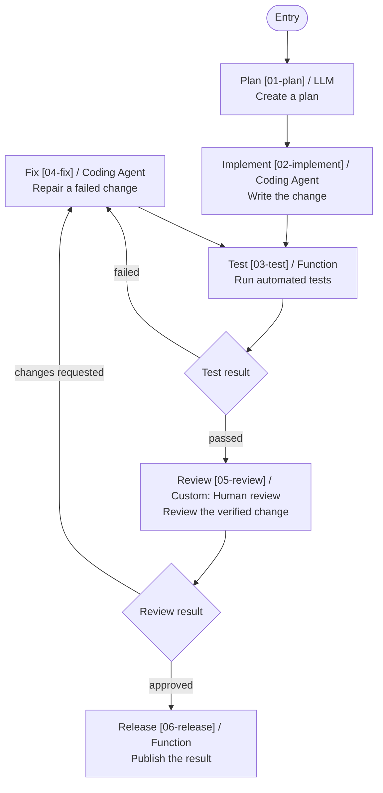

# Moon Agent Graph Visualization

Optional visualization helpers for compiled [`moon-agent-graph`](../moon-agent-graph) workflows.

## Mermaid

Render the callback-free static structure of a compiled graph:

```moonbit
let graph = definition.compile()
println(@visualization.to_mermaid(graph))
```

Import the library package as `visualization`:

```text
import {
  "totto2727/moon-agent-graph-visualization" @visualization,
}
```

Run the included example from the repository root:

```bash
moon run --target native mbt/package/moon-agent-graph-visualization/src/examples/basic
```

The output contains the entry marker, node IDs, display names, node kinds, node descriptions, router descriptions, and every statically declared destination. Routers with multiple destinations or descriptions are rendered as decision diamonds, and route labels are rendered on their edges. Runtime-only conditions, `End`, and `Fail` outcomes are intentionally omitted because they cannot be determined without evaluating a router.

Attach display metadata in core when declaring a router:

```moonbit
@core.router(
  [
    @core.DeclaredRoute::DeclaredRoute(
      fix,
      metadata=@core.DeclaredRouteMetadata::DeclaredRouteMetadata(
        label="failed",
      ),
    ),
    @core.DeclaredRoute::DeclaredRoute(
      review,
      metadata=@core.DeclaredRouteMetadata::DeclaredRouteMetadata(
        label="passed",
      ),
    ),
  ],
  evaluate,
  metadata=@core.RouterMetadata::RouterMetadata(description="Test result"),
)
```


