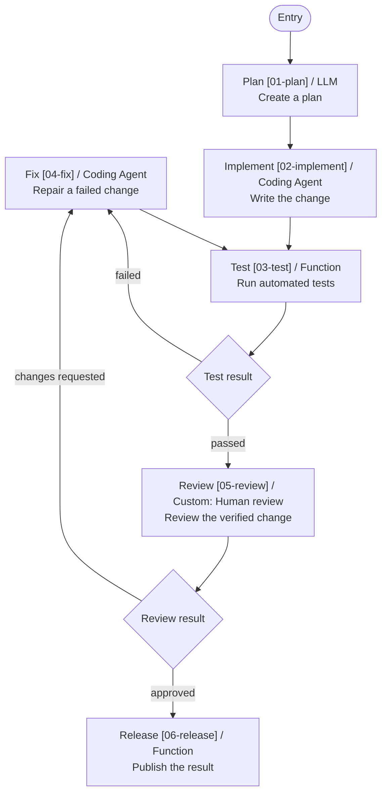

# Moon Agent Graph Runtime

Native asynchronous graph execution for MoonBit with typed state patches, deterministic routing, run-local resources, lifecycle events, MoonLLM nodes, and coding-agent adapters.

## Status

The sequential native runtime, MoonLLM boundary, common coding-agent node, Codex adapter, OpenCode adapter, deterministic test kit, and local E2E workflows are implemented. See the [architecture](docs/architecture.md), [core guide](docs/core-guide.md), [interfaces](docs/interfaces.md), [test plan](docs/testing.md), and [Japanese framework comparison](docs/framework-comparison.ja.html).

## Packages

- [`core`](src/core): graph definitions, runtime, events, resources, and coding-agent contracts.
- [`moonllm`](src/moonllm): typed MoonLLM node boundary.
- [`coding_agent`](src/coding_agent): shared coding-agent graph node.
- [`integrations/codex`](src/integrations/codex): Codex SDK adapter.
- [`integrations/opencode`](src/integrations/opencode): OpenCode CLI SDK adapter.
- [`testing`](src/testing): deterministic public fixtures and native test helpers.
- [`visualization`](src/visualization): deterministic Mermaid rendering for compiled graphs.
- [`e2e`](src/e2e): credential-free workflow tests.

## Basic example

From the repository root:

```bash
moon build --target native mbt/package/moon-agent-graph/src/examples/basic
moon run --target native mbt/package/moon-agent-graph/src/examples/basic
```

Expected output:

```text
labels=plan,test
steps=2
```

The example uses exported `core` APIs only and requires no provider credentials.

## Visualization

Import the optional visualization package from this module:

```text
import {
  "totto2727/moon-agent-graph/visualization",
}
```

Render the callback-free static structure of a compiled graph:

```moonbit
let graph = definition.compile()
println(@visualization.to_mermaid(graph))
```

Node descriptions, router descriptions, and declared route labels come from metadata in `core`. Routers with multiple destinations or descriptions are rendered as decision diamonds. Runtime-only conditions, `End`, and `Fail` outcomes are intentionally omitted because they cannot be determined without evaluating a router.

```moonbit
@core.router(
  [
    @core.DeclaredRoute::DeclaredRoute(
      fix,
      metadata=@core.DeclaredRouteMetadata::DeclaredRouteMetadata(
        label="failed",
      ),
    ),
    @core.DeclaredRoute::DeclaredRoute(
      review,
      metadata=@core.DeclaredRouteMetadata::DeclaredRouteMetadata(
        label="passed",
      ),
    ),
  ],
  evaluate,
  metadata=@core.RouterMetadata::RouterMetadata(description="Test result"),
)
```

Run the complete branching example from the repository root:

```bash
moon run --target native mbt/package/moon-agent-graph/src/examples/visualization
```



## Limitations

- Execution is sequential and native-only.
- Provider adapters require their corresponding local SDK executable or endpoint in real use.
- Remote provider calls are intentionally excluded from normal automated tests.
