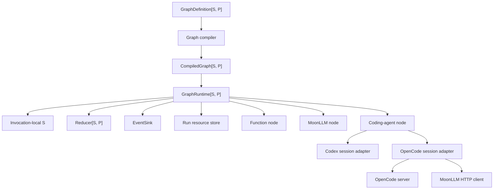
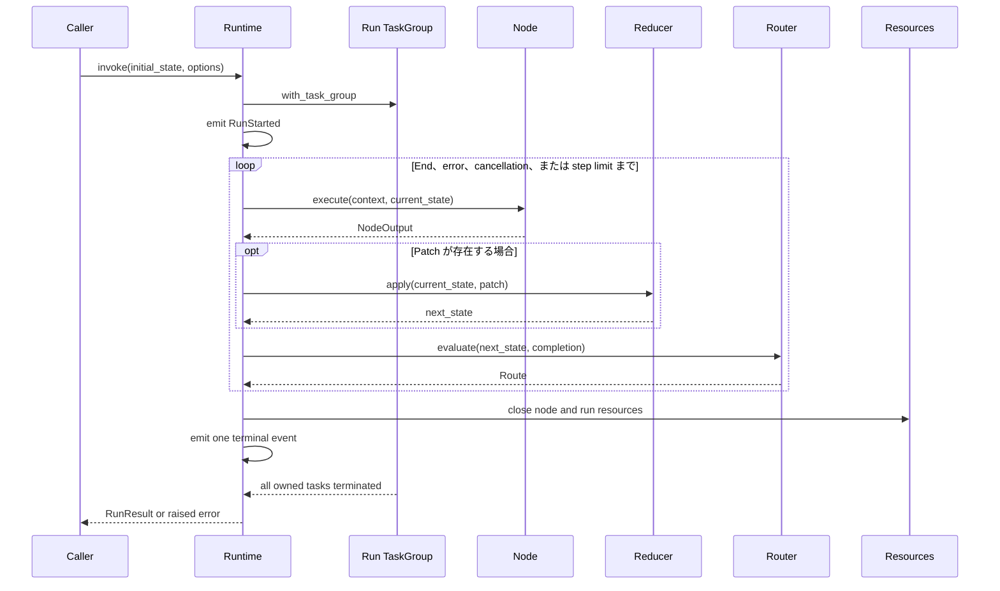

# Moon Agent Graph Runtime アーキテクチャ

## ステータス

このドキュメントは、レビュー済みのアーキテクチャベースラインと、Moon Agent Graph Runtime MVP の現在の実装状況を記録したものです。

実装ベースラインは、MoonBit コンパイラ `v0.10.4`、Moon `0.1.20260713`、`moonbitlang/async@0.20.1`、`moonbitlang/x@0.4.38`、`DC-Z-lab/moonllm@0.1.0`、`totto2727/codex-sdk@0.0.0`、および `totto2727/opencode-sdk@0.0.0` です。

ランタイムはネイティブのみで、非同期です。

## 実装状況

ネイティブ実装には、コアグラフコンパイラと逐次ランタイム、ランおよびノードリソースライフサイクル管理、関数ノード、MoonLLM コールバックノード、コーディングエージェントノード、Codex および OpenCode アダプタ、決定論的テストヘルパー、決定論的エンドツーエンドワークフローテストが含まれます。

延期された作業には、並列ノードスケジューリング、永続的チェックポイントまたは耐久性実行、人間による承認一時停止、サブグラフ、分散ワーカー、アプリケーションスコープのサーバー、および実際の認証情報を使用したプロバイダーのエンドツーエンドテストが含まれます。

## 目的

このランタイムは、型付けされた状態機械を実行し、その遷移が検証された有向グラフを形成します。

MVP は3つの実行セマンティクスをサポートします:

- 関数ノードは任意の MoonBit コールバックを実行します。
- LLM ノードは MoonLLM を通じてリモートモデルを呼び出します。
- コーディングエージェントノードは Codex または OpenCode にワークスペース作業を委譲します。

ノードカテゴリは、トランスポートではなく実行セマンティクスに基づいています。

## レビュー済み判断事項

元の設計方針は以下の修正を加えて維持されます。

1. モジュールは `preferred_target = "native"` と `supported_targets = "native"` の両方を宣言します。
2. すべての非同期処理は `moonbitlang/async` の構造化並行性を使用します。
3. 各グラフ呼び出しは1つのタスクグループを所有し、その呼び出しのために作成されたすべてのサブプロセスまたはバックグラウンドタスクはそのグループに属します。
4. キャンセルは `moonbitlang/async` のタスクキャンセルを使用します。MVP は2つ目のキャンセルトークンの抽象化を導入しません。
5. 非同期 API は MoonBit のエラーを発生させます。すべての結果を `Result` でラップすることはありません。
6. ドメイン障害は `suberror` 値を使用し、予期しない低レベルのエラーは `Error` の原因として保持されます。
7. ジェネリックグラフコールバックは、その状態およびパッチ型がグラフ固有であるため、型付けされた関数フィールドを使用します。
8. ノードは MVP では最大1つのルーターを持ちます。これにより、複数の出力エッジ間の順序の曖昧さが解消されます。
9. ルーターはすべての可能な宛先ノード ID を宣言するため、コンパイルは到達可能性と宛先を検証できます。
10. インメモリの実行状態は呼び出しが直接所有します。耐久性またはプラグイン可能な状態ストアは、チェックポイント設計まで延期されます。
11. OpenCode はコーディングエージェントアダプタですが、現在のリポジトリアダプタは、OpenCode を汎用チャット補完モデルとして扱うのではなく、MoonLLM HTTP クライアントを通じて OpenCode セッション HTTP エンドポイントを呼び出します。
12. OpenCode サーバーのシャットダウンは、ランのタスクグループ本体が戻る前に行われます。子タスクが終了した後にのみ実行されるタスクグループの defer に依存してはいけません。

## コンポーネントモデル



コアランタイムは Codex、OpenCode、または MoonLLM の具象型をインポートしません。

統合パッケージは、それらの具象 SDK をコアコールバックおよびセッション契約に適合させます。

ランタイムは、プロセス所有権がグラフの状態型に依存しないよう、各呼び出しに対して `TaskGroup[Unit]` を使用します。

## ネイティブ非同期実行モデル

`GraphRuntime::invoke` は非同期操作です。

呼び出しはネストされたタスクグループを開き、その本体の内部で完全な実行を行います。

タスクグループは以下を所有します:

- ランタイムによって生成されたノードワーク。
- ターン中に開始された Codex サブプロセス。
- OpenCode サーバープロセス。
- タイムアウトヘルパータスク。
- 任意のアダプタバックグラウンドリーダー。

MVP はノードを逐次的に実行しますが、プロセス所有権、キャンセル、タイムアウト、および将来の制限付き並列性のために、構造化並行性が依然として必要です。

呼び出し元は、呼び出し元が所有するタスクグループ内で呼び出しを生成し、返された `Task` をキャンセルすることで、呼び出しをキャンセルできます。

```moonbit
@async.with_task_group() <| group => {
  let task = group.spawn(async fn() { runtime.invoke(initial_state, options) })
  // 呼び出し元は後で task.cancel() を呼び出せます。
  task.wait()
}
```

ランタイムはキャンセルエラーを飲み込み、通常の成功結果に変換してはいけません。

キャッチオールループは、再試行または継続の前に `@async.is_being_cancelled()` をチェックします。

## ランライフサイクル



ルーターはパット適応後の状態を観測します。

ステップカウンターは、ノード実行試行ごとに正確に1回インクリメントされます。

`max_steps = 0` は、エントリノードを実行する前に実行を拒否します。

## クリーンアップとエラーの保持

リソースのクリーンアップは、成功、失敗、タイムアウト、およびキャンセル時に実行されます。

ラン本体は、`@async.with_task_group` から戻る前に、ランスコープのリソースを明示的にクローズします。

非同期 I/O を実行するクリーンアップは、呼び出し元のキャンセルから保護され、ハードタイムアウトによって制限されます。

```moonbit
@async.protect_from_cancel(
  async fn() {
    @async.with_timeout(
      cleanup_timeout_ms,
      async fn() { resources.close_all() },
    )
  },
)
```

保護は可能な限り狭く保たれます。広範なキャンセル保護はタイムアウトおよびキャンセルの抽象化を破壊する可能性があるためです。

リソースは取得順序の逆順でクローズされます。

プライマリ作業とクリーンアップの両方が失敗した場合、プライマリエラーが優先され、クリーンアップエラーはランタイム障害レコードに添付されます。

クリーンアップのみが失敗した場合、ランはクリーンアップエラーで失敗します。

ランタイムは、1つのクローズ操作が失敗した後も、残りのリソースのクローズを継続します。

## グラフセマンティクス

グラフ定義は、組み立て中は変更可能です。

コンパイルは、プライベートな内部コレクションを持つデタッチされたスナップショットを作成します。

コンパイルは以下を検証します:

- 空でないエントリノードが設定されている。
- ノード ID が一意である。
- エントリノードが存在する。
- すべてのノードが正確に1つのルーターを持つ。
- 宣言されたすべてのルーター宛先が存在する。
- すべてのノードがエントリノードから宣言された宛先を通じて到達可能である。
- ID が有効である。

循環は許可されます。

コンパイルされたグラフは、変更可能な内部マップや配列を公開しません。

MVP は、ルーターの宣言された宛先リストから省略された動的な宛先をサポートしません。

## 状態セマンティクス

状態型とパッチ型はグラフ作成者によって提供されます。

ノードは状態値を読み取り、パッチを返す場合があります。

リデューサーは状態を変更する唯一のランタイムパスです。

リデューサーは同期的かつ決定論的です。

呼び出しは、MVP が逐次的かつ非耐久性であるため、現在の状態をローカルに保持します。

チェックポイント、サスペンド/レジューム、および永続ストアは、別個の一貫性とシリアライゼーションの設計が必要であり、MVP の一部ではありません。

## ノードセマンティクス

### 関数ノード

関数ノードは非同期の MoonBit コールバックをラップします。

I/O を実行することもありますが、ルーティングのみのロジックはルーターに属します。

`NodeContext.deadline_ms` は、ノードタイムアウトが設定されていない場合は `None` であり、設定されている場合は構成されたノードタイムアウト期間（ミリ秒単位、`Int64`）を含みます。これは現在のノード試行のメタデータであり、絶対的な wall-clock の期限ではありません。ランタイムは同じ設定された期間を `@async.with_timeout` で適用します。

### LLM ノード

LLM ノードは以下を行います:

- 状態から型付けされた MoonLLM リクエストを構築する。
- 提供された非同期 MoonLLM 境界を呼び出す。
- レスポンスをノード出力にデコードする。

コールバックは完全な MoonLLM レスポンスを受け取るため、グラフ作成者が必要とする場合に、そのデコーダーはアーティファクトやイベントに使用状況情報を保持できます。現在のジェネリックノードは、使用状況を自動的に発行しません。

統合パッケージは具象の `@moonllm.Client` を所有します。

コアパッケージは非同期コールバックを受け取るため、テストは決定論的なフェイクを提供できます。

### コーディングエージェントノード

コーディングエージェントノードは以下を行います:

- 共通のコーディングエージェントリクエストを構築する。
- リソーススコープに従ってセッションを取得または再利用する。
- リクエストを実行する。
- レスポンスをパッチとアーティファクトに変換する。

Codex と OpenCode はセッションセマンティクスを共有しますが、SDK固有のオプションはそれぞれのアダプタ内に保持します。

## Codex アダプタ

Codex アダプタは、共通リクエストをリポジトリの `totto2727/codex-sdk` にマッピングします。

Codex セッションは1つの `Thread` を所有します。

`Thread::run` および `Thread::run_streamed` は、ターンごとにネイティブサブプロセスを開始およびクリーンアップします。

タスクキャンセルは、上流のアボートシグナルに相当するネイティブのものです。

Codex スレッドの継続は `Thread::id` を使用します。

アダプタは、現在の SDK イベントモデルが実際にそのデータを公開しない限り、stdout、stderr、または変更されたファイルのデータを約束してはいけません。

## OpenCode アダプタ

OpenCode アダプタは以下を所有します:

- OpenCode サーバープロセス。
- 準備完了検出。
- サーバー URL。
- `Server::moonllm_config` から構築された MoonLLM クライアント。
- OpenCode セッション ID。
- 明示的なサーバーシャットダウン。

サーバーは、ランの `TaskGroup[Unit]` を使用して作成される必要があります。これは、コーディングエージェントのオープンコンテキストを通じて提供されます。

アダプタは `POST /session` を通じてセッションを作成し、セッションメッセージエンドポイントを通じて作業を送信します。

MoonLLM クライアントは、現在のリポジトリ実装において、それらの OpenCode エンドポイントのための HTTP トランスポートです。

アダプタは、公式のタイトルのみのボディでセッションを作成し、公式のテキストのみのメッセージパーツを送信します。ワークスペースと提供されたコンテキストファイルを、エンコードされていないワークスペースクエリや添付されていないファイル URL として送信するのではなく、テキストとして正直に表現します。

アダプタは、設定された追加の環境変数を、サーバーを起動する前にオープンコンテキスト環境とマージします。呼び出し元が提供したコンテキスト値が優先されます。

セッション作成がサーバー起動後に失敗した場合、アダプタは再発生させる前に `server.close()` をキャンセルから保護します。クリーンアップの失敗を破棄しません。MoonLLM は中断された HTTP リクエストを `LLMError::Transport` として公開できるため、セッション作成とメッセージ実行の両方で、保護されていない `@async.pause()` ポイントでアクティブなキャンセルを復元してから、通常のエラーを保持します。したがって、アダプタは、部分的なオープンおよびリクエスト失敗のパスを含め、タスクグループ本体が終了する前にサーバーをクローズし、キャンセルをトランスポート障害に変換することはありません。

## パッケージレイアウト

実装は1つの MoonBit モジュールであり、少数の非循環パッケージを持ちます。

```text
mbt/package/moon-agent-graph/
├── moon.mod
├── README.mbt.md
├── README.md -> README.mbt.md
├── docs/
└── src/
    ├── core/
    ├── moonllm/
    ├── coding_agent/
    ├── integrations/
    │   ├── codex/
    │   └── opencode/
    ├── testing/
    ├── e2e/
    └── examples/
        └── basic/
```

`core` には、ID、グラフコンパイル、ノードおよびルーターコールバックコンテナ、リデューサーセマンティクス、ランイベント、ランリソース、および逐次ランタイムが含まれます。

`moonllm` は core と MoonLLM をインポートします。

`coding_agent` は core をインポートし、共通のエージェントセッション契約とノードファクトリを定義します。

2つのアダプタパッケージは `coding_agent` とそれぞれの具象 SDK をインポートします。

`testing` には再利用可能なフェイクとレコーダーが含まれます。

`e2e` には決定論的エンドツーエンドワークフローのサポートと、公開パッケージとローカルフェイクを消費するテストが含まれます。

`examples/basic` は、公開されている `core` パッケージのみをインポートする実行可能なネイティブの例です。

モジュール、Codex SDK、OpenCode SDK、および MoonLLM は `moonbitlang/async@0.20.1` を解決します。Codex SDK とグラフモジュールは `moonbitlang/x@0.4.38` を解決します。実装されたアダプタには、非同期ランタイムのバージョン調整作業は残っていません。

## MVP スコープ

MVP に含まれるもの:

- ネイティブ非同期実行。
- 関数、LLM、およびコーディングエージェントノード。
- 型付けされた状態とパッチ。
- 条件付きルーティング。
- ステップ制限付きの循環。
- ノードタイムアウト。
- タスクキャンセル。
- ランスコープおよびノードスコープのコーディングエージェントセッション。
- インメモリイベントと状態。
- Codex および OpenCode アダプタ。
- 決定論的テストヘルパーとエンドツーエンドワークフローテスト。

MVP から除外されるもの:

- 並列ノード実行。
- 永続的チェックポイント。
- 耐久性実行。
- 人間による承認一時停止。
- サブグラフ。
- 分散ワーカー。
- アプリケーションスコープのサーバー。
- 実際の認証情報を使用したプロバイダーのエンドツーエンドテスト。

## 参考文献

- [MoonBit 非同期プログラミングと構造化並行性](https://docs.moonbitlang.com/en/latest/language/async-experimental.html)
- [MoonBit エラーハンドリング](https://docs.moonbitlang.com/en/latest/language/error-handling.html)
- [MoonBit メソッド、トレイト、およびトレイトオブジェクト](https://docs.moonbitlang.com/en/latest/language/methods.html)
- [MoonBit モジュール設定とネイティブターゲット宣言](https://docs.moonbitlang.com/en/latest/toolchain/moon/module.html)
- [MoonBit パッケージ設定](https://docs.moonbitlang.com/en/latest/toolchain/moon/package.html)
- [moonbitlang/async パッケージドキュメント](https://mooncakes.io/docs/moonbitlang/async)
- [MoonLLM リポジトリ](https://github.com/DC-Z-lab/moonllm)
- [リポジトリポートによってピン留めされた Codex TypeScript SDK リファレンス](https://github.com/openai/codex/tree/f201c30c52a35f819262865a53df94b6f4ea7a50/sdk/typescript)
- [リポジトリアダプタによってピン留めされた OpenCode SDK リファレンス](https://github.com/anomalyco/opencode/tree/66495a2a22cd0a57efcc4f721e65532f0987b4e8/packages/sdk/js)