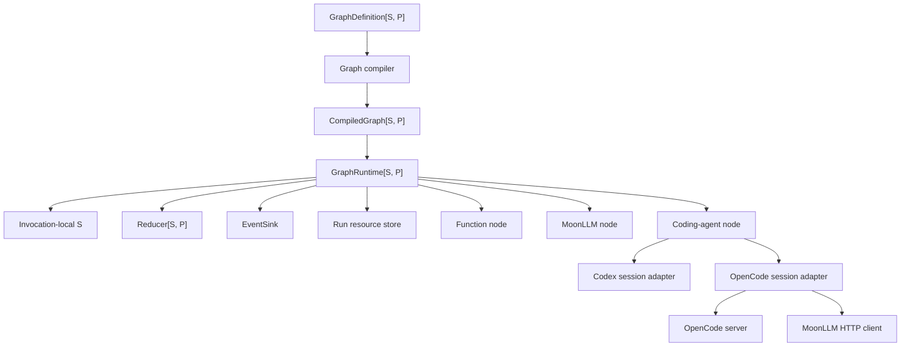
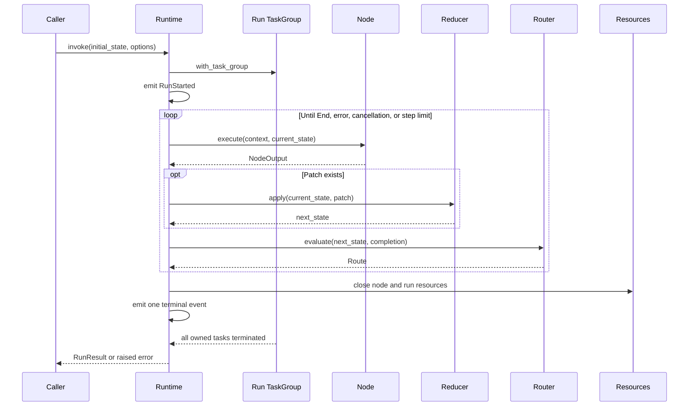

# Moon Agent Graph ランタイム アーキテクチャ

## ステータス

本ドキュメントは、Moon Agent Graph Runtime MVP のレビュー済みアーキテクチャベースラインです。

レビューベースラインは、MoonBit コンパイラ `v0.10.4`、Moon `0.1.20260713`、`moonbitlang/async@0.20.1`、`DC-Z-lab/moonllm@0.1.0`、リポジトリのネイティブ Codex SDK、およびリポジトリのネイティブ OpenCode SDK です。

ランタイムはネイティブのみで、非同期です。

## 目的

ランタイムは、型付けられたステートマシンを実行し、その遷移は検証された有向グラフを形成します。

MVP は 3 つの実行セマンティクスをサポートします。

- **関数ノード**は、任意の MoonBit コールバックを実行します。
- **LLM ノード**は、MoonLLM を介してリモートモデルを呼び出します。
- **コーディングエージェントノード**は、Codex または OpenCode のいずれかにワークスペース作業を委譲します。

ノードカテゴリは、トランスポートではなく実行セマンティクスに基づいています。

## レビュー済みの決定事項

元の設計方針は、以下の修正を加えて維持されます。

1. モジュールは `preferred_target = "native"` と `supported_targets = "native"` の両方を宣言します。
2. すべての非同期処理は `moonbitlang/async` の構造化された並行処理を使用します。
3. 各グラフ呼び出しは1つのタスクグループを所有し、その呼び出しのために作成されたすべてのサブプロセスまたはバックグラウンドタスクはそのグループに属します。
4. キャンセルは `moonbitlang/async` のタスクキャンセルを使用します。MVP は2つ目のキャンセルトークンの抽象化を導入しません。
5. 非同期 API は MoonBit エラーを発生させます。すべての結果を `Result` でラップすることはしません。
6. ドメイン障害は `suberror` 値を使用し、予期しない低レベルのエラーは `Error` の原因として保持されます。
7. ジェネリックなグラフコールバックは、そのステート型およびパッチ型がグラフ固有であるため、型付けされた関数フィールドを使用します。
8. MVP ではノードは最大1つのルーターを持ち、これにより複数の出力エッジ間の順序の曖昧さが解消されます。
9. ルーターは、取り得るすべての宛先ノード ID を宣言するため、コンパイルは到達可能性と宛先を検証できます。
10. インメモリの実行状態は呼び出しによって直接所有されます。耐久性のある、またはプラグ可能な状態ストアは、チェックポイントが設計されるまで延期されます。
11. OpenCode はコーディングエージェントアダプターですが、現在のリポジリアダプターは、OpenCode を汎用的なチャット補完モデルとして扱うのではなく、MoonLLM HTTP クライアントを介して OpenCode セッション HTTP エンドポイントを呼び出します。
12. OpenCode サーバーのシャットダウンは、実行タスクグループの本体が戻る前に行われます。子タスクが終了した後にのみ実行されるタスクグループの defer に依存してはなりません。

## コンポーネントモデル



コアランタイムは、Codex、OpenCode、または MoonLLM の具象型をインポートしません。

統合パッケージは、それらの具象 SDK をコアのコールバックおよびセッションコントラクトに適応させます。

ランタイムは各呼び出しに `TaskGroup[Unit]` を使用するため、プロセスの所有権はグラフのステート型に依存しません。

## ネイティブ非同期実行モデル

`GraphRuntime::invoke` は非同期操作です。

呼び出しはネストされたタスクグループを開き、その本体内で完全な実行を行います。

タスクグループは以下を所有します：

- ランタイムによって生成されたノード処理。
- ターン中に開始された Codex サブプロセス。
- OpenCode サーバープロセス。
- タイムアウトヘルパータスク。
- 任意のアダプターバックグラウンドリーダー。

MVP はノードを逐次的に実行しますが、プロセスの所有権、キャンセル、タイムアウト、および将来の制限付き並列処理のためには、構造化された並行処理が依然として必要です。

呼び出し元は、呼び出し元が所有するタスクグループ内で呼び出しを生成し、返された `Task` をキャンセルすることで、呼び出しをキャンセルできます。

```moonbit
@async.with_task_group() <| group => {
  let task = group.spawn(async fn() { runtime.invoke(initial_state, options) })
  // A caller may later invoke task.cancel().
  task.wait()
}
```

ランタイムは、キャンセルエラーを飲み込んで通常の成功結果に変換してはなりません。

全探索ループは、再試行または継続する前に `@async.is_being_cancelled()` をチェックします。

## 実行ライフサイクル



ルーターは、パットリダクション後の状態を観測します。

ステップカウンターは、ノード実行試行ごとに正確に1回インクリメントされます。

`max_steps = 0` は、エントリノードを実行する前に実行を拒否します。

## クリーンアップとエラーの保持

リソースのクリーンアップは、成功、失敗、タイムアウト、およびキャンセル時に実行されます。

実行本体は、`@async.with_task_group` から戻る前に、実行スコープのリソースを明示的にクローズします。

非同期 I/O を実行するクリーンアップは、呼び出し元のキャンセルから保護され、ハードタイムアウトによって制限されます。

```moonbit
@async.protect_from_cancel(
  async fn() {
    @async.with_timeout(
      cleanup_timeout_ms,
      async fn() { resources.close_all() },
    )
  },
)
```

保護は可能な限り狭く保ちます。なぜなら、広範なキャンセル保護はタイムアウトおよびキャンセルの抽象化を壊す可能性があるからです。

リソースは、取得順序の逆順でクローズされます。

主要な処理とクリーンアップの両方が失敗した場合、主要なエラーが優先され、クリーンアップエラーはランタイムの障害レコードに添付されます。

クリーンアップのみが失敗した場合、実行はクリーンアップエラーで失敗します。

ランタイムは、1つのクローズ操作が失敗した後も、残りのリソースのクローズを継続します。

## グラフセマンティクス

グラフ定義は、組み立て中はミュータブルです。

コンパイルは、プライベートな内部コレクションを持つデタッチされたスナップショットを作成します。

コンパイルは以下を検証します：

- 空でないエントリノードが設定されている。
- ノード ID が一意である。
- エントリノードが存在する。
- すべてのノードが正確に1つのルーターを持つ。
- 宣言されたルーターの宛先がすべて存在する。
- すべてのノードがエントリノードから宣言された宛先を介して到達可能である。
- ID が有効である。

サイクルは許可されます。

コンパイル済みグラフは、ミュータブルな内部マップや配列を公開しません。

MVP は、ルーターの宣言された宛先リストから省略された動的な宛先をサポートしません。

## ステートセマンティクス

ステート型とパッチ型は、グラフ作成者によって提供されます。

ノードはステート値を読み取り、パッチを返す場合があります。

リデューサーは、ステートを変更する唯一のランタイムパスです。

リデューサーは同期的かつ決定論的です。

呼び出しは、MVP が逐次的かつ非永続的であるため、現在のステートをローカルに保持します。

チェックポイント、サスペンド/レジューム、および永続ストアには、個別の一貫性とシリアライゼーションの設計が必要であり、MVP の対象外です。

## ノードセマンティクス

### 関数ノード

関数ノードは、非同期の MoonBit コールバックをラップします。

I/O を実行することもできますが、ルーティングのみのロジックはルーターに属します。

### LLM ノード

LLM ノードは以下を行います：

- ステートから型付けされた MoonLLM リクエストを構築する。
- 提供された非同期 MoonLLM 境界を呼び出す。
- レスポンスをノード出力にデコードする。
- MoonLLM の使用情報をアーティファクトまたはイベントに保持する。

統合パッケージが具象の `@moonllm.Client` を所有します。

コアパッケージは非同期コールバックを受け取るため、テストは決定論的なフェイクを提供できます。

### コーディングエージェントノード

コーディングエージェントノードは以下を行います：

- 共通のコーディングエージェントリクエストを構築する。
- リソーススコープに従ってセッションを取得または再利用する。
- リクエストを実行する。
- レスポンスをパッチとアーティファクトに変換する。

Codex と OpenCode はセッションセマンティクスを共有しますが、SDK 固有のオプションはそれぞれのアダプター内に保持します。

## Codex アダプター

Codex アダプターは、共通リクエストをリポジトリの `totto2727/codex-sdk` にマッピングします。

Codex セッションは1つの `Thread` を所有します。

`Thread::run` および `Thread::run_streamed` は、ターンごとにネイティブサブプロセスを開始およびクリーンアップします。

タスクキャンセルは、上流のアボートシグナルのネイティブ相当物です。

Codex スレッドの継続には `Thread::id` を使用します。

アダプターは、現在の SDK イベントモデルが実際にそのデータを公開しない限り、stdout、stderr、または変更されたファイルのデータを約束してはなりません。

## OpenCode アダプター

OpenCode アダプターは以下を所有します：

- OpenCode サーバープロセス。
- 準備完了検出。
- サーバー URL。
- `Server::moonllm_config` から構築された MoonLLM クライアント。
- OpenCode セッション ID。
- 明示的なサーバーシャットダウン。

サーバーは、実行の `TaskGroup[Unit]` を使用して作成する必要があり、これはコーディングエージェントのオープンコンテキストを通じて提供されます。

アダプターは `POST /session` を通じてセッションを作成し、セッションメッセージエンドポイントを通じて作業を送信します。

MoonLLM クライアントは、現在のリポジトリ実装におけるそれらの OpenCode エンドポイントの HTTP トランスポートです。

アダプターは、タスクグループの本体が終了する前にサーバーをクローズします。これには、すべての部分的な起動およびリクエスト失敗パスが含まれます。

## パッケージレイアウト

実装は、少数の非循環パッケージを持つ1つの MoonBit モジュールです。

```text
mbt/package/moon-agent-graph/
├── moon.mod
├── README.mbt.md
├── README.md -> README.mbt.md
├── docs/
└── src/
    ├── core/
    ├── moonllm/
    ├── coding_agent/
    ├── integrations/
    │   ├── codex/
    │   └── opencode/
    ├── testing/
    └── examples/
```

`core` には、ID、グラフコンパイル、ノードおよびルーターのコールバックコンテナ、リデューサーセマンティクス、実行イベント、実行リソース、および逐次ランタイムが含まれます。

`moonllm` は core と MoonLLM をインポートします。

`coding_agent` は core をインポートし、共通のエージェントセッションコントラクトとノードファクトリを定義します。

2つのアダプターパッケージは `coding_agent` とそれらの具象 SDK をインポートします。

`testing` には、再利用可能なフェイクとレコーダーが含まれます。

例は、公開パッケージのみに依存します。

Codex SDK は現在 `moonbitlang/async@0.19.2` と `moonbitlang/x@0.4.38` を固定していますが、OpenCode SDK と MoonLLM は `moonbitlang/async@0.20.1` を固定しています。

新しいモジュールが両方のアダプターをインポートする前に、実装はこれらの依存関係を調整する必要があります。

## MVP スコープ

MVP には以下が含まれます：

- ネイティブ非同期実行。
- 関数、LLM、およびコーディングエージェントノード。
- 型付けられたステートとパッチ。
- 条件付きルーティング。
- ステップ制限付きのサイクル。
- ノードタイムアウト。
- タスクキャンセル。
- 実行スコープおよびノードスコープのコーディングエージェントセッション。
- インメモリのイベントとステート。
- Codex および OpenCode アダプター。

MVP からは以下が除外されます：

- 並列ノード実行。
- 永続的なチェックポイント。
- 耐久性のある実行。
- 人間の承認による一時停止。
- サブグラフ。
- 分散ワーカー。
- アプリケーションスコープのサーバー。

## 参考文献

- [MoonBit async programming and structured concurrency](https://docs.moonbitlang.com/en/latest/language/async-experimental.html)
- [MoonBit error handling](https://docs.moonbitlang.com/en/latest/language/error-handling.html)
- [MoonBit methods, traits, and trait objects](https://docs.moonbitlang.com/en/latest/language/methods.html)
- [MoonBit module configuration and native target declarations](https://docs.moonbitlang.com/en/latest/toolchain/moon/module.html)
- [MoonBit package configuration](https://docs.moonbitlang.com/en/latest/toolchain/moon/package.html)
- [moonbitlang/async package documentation](https://mooncakes.io/docs/moonbitlang/async)
- [MoonLLM repository](https://github.com/DC-Z-lab/moonllm)
- [Codex TypeScript SDK reference pinned by the repository port](https://github.com/openai/codex/tree/f201c30c52a35f819262865a53df94b6f4ea7a50/sdk/typescript)
- [リポジトリアダプタが参照する OpenCode SDK](https://github.com/anomalyco/opencode/tree/66495a2a22cd0a57efcc4f721e65532f0987b4e8/packages/sdk/js)
