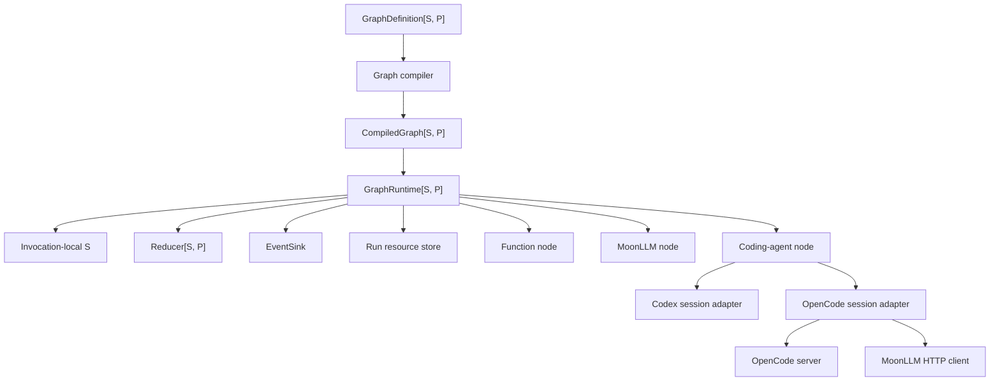
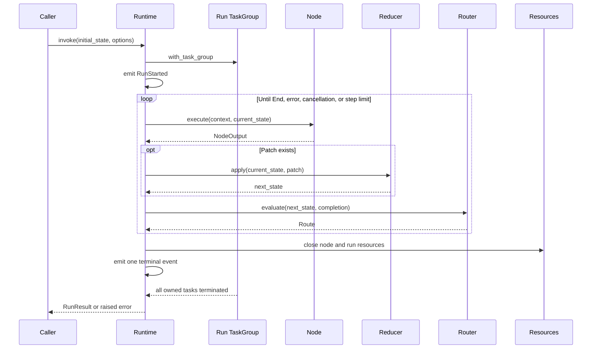

# Moon Agent Graph Runtime アーキテクチャ

## ステータス

本ドキュメントは、Moon Agent Graph Runtime MVP におけるレビュー済みアーキテクチャベースラインと現在の実装ステータスを記録するものです。

実装ベースラインは MoonBit コンパイラ `v0.10.4`、Moon `0.1.20260713`、`moonbitlang/async@0.20.1`、`moonbitlang/x@0.4.38`、`DC-Z-lab/moonllm@0.1.0`、`totto2727/codex-sdk@0.0.0`、および `totto2727/opencode-sdk@0.0.0` です。

ランタイムはネイティブのみで、非同期です。

## 実装ステータス

ネイティブ実装には、コアとなるグラフコンパイラと逐次ランタイム、ランとノードのリソースライフサイクル管理、関数ノード、MoonLLM コールバックノード、コーディングエージェントノード、Codex および OpenCode アダプタ、決定論的テストヘルパー、決定論的なエンドツーエンドワークフローテストが含まれています。

延期された作業には、並列ノードスケジューリング、永続チェックポイントまたは耐久性実行、人間による承認サスペンド、サブグラフ、分散ワーカー、アプリケーションスコープのサーバー、そして実際の認証情報を用いたプロバイダーのエンドツーエンドテストが含まれます。

## 目的

ランタイムは型付きステートマシンを実行し、その遷移は検証された有向グラフを形成します。

MVP は3つの実行セマンティクスをサポートします:

- 関数ノードは任意の MoonBit コールバックを実行します。
- LLM ノードは MoonLLM を通じてリモートモデルを呼び出します。
- コーディングエージェントノードは Codex または OpenCode にワークスペース作業を委譲します。

ノードカテゴリは、トランスポートではなく実行セマンティクスに基づいています。

## レビュー済み決定事項

元の設計方針は以下の修正を加えて維持されます。

1. モジュールは `preferred_target = "native"` と `supported_targets = "native"` の両方を宣言します。
2. すべての非同期処理は `moonbitlang/async` の構造化並行処理を使用します。
3. 各グラフ呼び出しは1つのタスクグループを所有し、その呼び出しのために起動されたすべてのサブプロセスまたはバックグラウンドタスクはそのグループに属します。
4. キャンセルには `moonbitlang/async` のタスクキャンセルを使用します。MVP は2つ目のキャンセルトークンの抽象化を導入しません。
5. 非同期 API は MoonBit エラーを発生させます。すべての結果を `Result` でラップすることはしません。
6. ドメイン障害には `suberror` 値を使用し、予期しない低レベルのエラーは `Error` 原因として保持されます。
7. ジェネリックグラフのコールバックは型付き関数フィールドを使用します。これは、ステート型とパッチ型がグラフ固有であるためです。
8. MVP ではノードは最大1つのルーターを持ちます。これにより、複数の出力エッジ間の順序付けの曖昧さが除去されます。
9. ルーターはすべての可能な宛先ノード ID を宣言するため、コンパイルは到達可能性と宛先を検証できます。
10. インメモリのラン状態は呼び出しによって直接所有されます。耐久性またはプラグイン可能な状態ストアは、チェックポインティングが設計されるまで延期されます。
11. OpenCode はコーディングエージェントアダプタですが、現在のリポジトリアダプタは、OpenCode を汎用チャット補完モデルとして扱うのではなく、MoonLLM HTTP クライアントを通じて OpenCode セッション HTTP エンドポイントを呼び出します。
12. OpenCode サーバーのシャットダウンは、ランタスクグループの本体が戻る前に行われます。子タスクが終了した後にのみ実行されるタスクグループの defer に依存してはいけません。

## コンポーネントモデル



コアランタイムは Codex、OpenCode、または MoonLLM の具象型をインポートしません。

統合パッケージは、それらの具象 SDK をコアのコールバックおよびセッション契約に適応させます。

ランタイムは各呼び出しに `TaskGroup[Unit]` を使用するため、プロセスの所有権はグラフの状態型に依存しません。

## ネイティブ非同期実行モデル

`GraphRuntime::invoke` は非同期操作です。

呼び出しはネストされたタスクグループを開き、そのボディ内で完全な実行を行います。

タスクグループは以下を所有します:

- ランタイムによって生成されたノード処理。
- ターン中に起動された Codex サブプロセス。
- OpenCode サーバープロセス。
- タイムアウトヘルパータスク。
- 任意のアダプタバックグラウンドリーダー。

MVP はノードを逐次実行しますが、プロセスの所有権、キャンセル、タイムアウト、および将来の境界付き並列処理には構造化並行処理が依然として必要です。

呼び出し元は、呼び出し元が所有するタスクグループで呼び出しを生成し、返された `Task` をキャンセルすることで、呼び出しをキャンセルできます。

```moonbit
@async.with_task_group() <| group => {
  let task = group.spawn(async fn() { runtime.invoke(initial_state, options) })
  // A caller may later invoke task.cancel().
  task.wait()
}
```

ランタイムはキャンセルエラーを飲み込み、通常の成功結果に変換してはいけません。

キャッチオールループは、再試行または継続する前に `@async.is_being_cancelled()` をチェックします。

## 実行ライフサイクル



ルーターはパット削減後の状態を観測します。

ステップカウンターは、ノード実行試行ごとに正確に1回インクリメントされます。

`max_steps = 0` は、エントリノードを実行する前に実行を拒否します。

## クリーンアップとエラー保持

リソースクリーンアップは、成功、失敗、タイムアウト、およびキャンセル時に実行されます。

実行本体は、`@async.with_task_group` から戻る前に、実行スコープのリソースを明示的に閉じます。

非同期 I/O を実行するクリーンアップは、呼び出し元のキャンセルから保護され、ハードタイムアウトによって制限されます。

```moonbit
@async.protect_from_cancel(
  async fn() {
    @async.with_timeout(
      cleanup_timeout_ms,
      async fn() { resources.close_all() },
    )
  },
)
```

保護は可能な限り狭く保ちます。広範なキャンセル保護は、タイムアウトとキャンセルの抽象化を壊す可能性があるためです。

リソースは取得順の逆順で閉じられます。

主要な処理とクリーンアップの両方が失敗した場合、主要なエラーが優先され、クリーンアップエラーはランタイム障害レコードに添付されます。

クリーンアップのみが失敗した場合、実行はクリーンアップエラーで失敗します。

ランタイムは1つのクローズ操作が失敗した後も、残りのリソースのクローズを継続します。

## グラフセマンティクス

グラフ定義は組み立て中は可変です。

コンパイルはプライベートな内部コレクションを持つデタッチされたスナップショットを作成します。

コンパイルは以下を検証します:

- 空でないエントリノードが設定されていること。
- ノード ID が一意であること。
- エントリノードが存在すること。
- すべてのノードに正確に1つのルーターがあること。
- 宣言されたすべてのルーター宛先が存在すること。
- すべてのノードがエントリノードから宣言された宛先を通じて到達可能であること。
- ID が有効であること。

サイクルは許可されます。

コンパイルされたグラフは、可変な内部マップや配列を公開しません。

MVP は、ルーターの宣言された宛先リストから省略された動的な宛先をサポートしません。

## ステートセマンティクス

ステート型とパッチ型はグラフ作成者によって提供されます。

ノードはステート値を読み取り、パッチを返すことがあります。

リデューサーはステートを変更する唯一のランタイムパスです。

リデューサーは同期的かつ決定論的です。

MVP は逐次的かつ非耐久性であるため、呼び出しは現在のステートをローカルに保持します。

チェックポインティング、サスペンド/レジューム、および永続ストアは、別途一貫性とシリアライゼーションの設計が必要であり、MVP の対象外です。

## ノードセマンティクス

### 関数ノード

関数ノードは非同期の MoonBit コールバックをラップします。

I/O を実行することもありますが、ルーティングのみのロジックはルーターに属します。

`NodeContext.deadline_ms` は、ノードタイムアウトが設定されていない場合は `None` であり、設定されている場合は設定されたノードタイムアウト期間（ミリ秒、`Int64`）を含みます。これは現在のノード試行のメタデータであり、絶対的な壁時計のデッドラインではありません。ランタイムは、`@async.with_timeout` を使用して同じ設定期間を強制します。

### LLM ノード

LLM ノードは以下を行います:

- ステートから型付き MoonLLM リクエストを構築します。
- 提供された非同期 MoonLLM 境界を呼び出します。
- レスポンスをノード出力にデコードします。

コールバックは完全な MoonLLM レスポンスを受け取るため、そのデコーダーはグラフ作成者が必要とする場合に、使用情報をアーティファクトやイベントに保持できます。現在のジェネリックノードは自動的には使用情報を発行しません。

統合パッケージは具象の `@moonllm.Client` を所有します。

コアパッケージは非同期コールバックを受け取るため、テストは決定論的なフェイクを提供できます。

### コーディングエージェントノード

コーディングエージェントノードは以下を行います:

- 共通のコーディングエージェントリクエストを構築します。
- リソーススコープに従ってセッションを取得または再利用します。
- リクエストを実行します。
- レスポンスをパッチとアーティファクトに変換します。

Codex と OpenCode はセッションセマンティクスを共有しますが、SDK 固有のオプションは各アダプタ内に保持します。

## Codex アダプタ

Codex アダプタは共通のリクエストをリポジトリの `totto2727/codex-sdk` にマッピングします。

Codex セッションは1つの `Thread` を所有します。

`Thread::run` と `Thread::run_streamed` は、ターンごとにネイティブサブプロセスを起動およびクリーンアップします。

タスクキャンセルは、上流のアボートシグナルに相当するネイティブのものです。

Codex スレッドの継続には `Thread::id` を使用します。

アダプタは、現在の SDK イベントモデルが実際にそのデータを公開しない限り、stdout、stderr、または変更されたファイルのデータを約束してはいけません。

## OpenCode アダプタ

OpenCode アダプタは以下を所有します:

- OpenCode サーバープロセス。
- 準備完了検出。
- サーバー URL。
- `Server::moonllm_config` から構築された MoonLLM クライアント。
- OpenCode セッション ID。
- 明示的なサーバーシャットダウン。

サーバーは、コーディングエージェントのオープンコンテキストを通じて提供される、実行の `TaskGroup[Unit]` を使用して作成する必要があります。

アダプタは `POST /session` を通じてセッションを作成し、セッションメッセージエンドポイントを通じて作業を送信します。

MoonLLM クライアントは、現在のリポジトリ実装におけるそれらの OpenCode エンドポイントの HTTP トランスポートです。

アダプタは、公式のタイトル専用ボディでセッションを作成し、公式のテキスト専用メッセージパーツを送信します。ワークスペースと提供されたコンテキストファイルを、エンコードされていないワークスペースクエリや未添付のファイル URL として送信するのではなく、テキストとして正直に表現します。

アダプタは、設定された追加の環境変数を、サーバー起動前にオープンコンテキスト環境とマージします。呼び出し元が提供するコンテキスト値が優先されます。

サーバー起動後にセッション作成が失敗した場合、アダプタは再発生させる前に `server.close()` をキャンセルから保護します。クリーンアップの失敗を破棄しません。MoonLLM は中断された HTTP リクエストを `LLMError::Transport` として公開できるため、セッション作成とメッセージ実行の両方で、通常のエラーを保持する前に、保護されていない `@async.pause()` ポイントでアクティブなキャンセルを復元します。したがって、アダプタは、部分オープンやリクエスト失敗のパスを含め、タスクグループ本体が終了する前にサーバーを閉じます。これにより、キャンセルがトランスポート障害に変換されるのを防ぎます。

## パッケージ構成

実装は1つの MoonBit モジュールであり、少数の非循環パッケージで構成されます。

```text
mbt/package/moon-agent-graph/
├── moon.mod
├── README.mbt.md
├── README.md -> README.mbt.md
├── docs/
└── src/
    ├── core/
    ├── moonllm/
    ├── coding_agent/
    ├── integrations/
    │   ├── codex/
    │   └── opencode/
    ├── testing/
    └── e2e/
```

`core` には、ID、グラフコンパイル、ノードおよびルーターコールバックコンテナ、リデューサーセマンティクス、実行イベント、実行リソース、および逐次ランタイムが含まれます。

`moonllm` は core と MoonLLM をインポートします。

`coding_agent` は core をインポートし、共通のエージェントセッション契約とノードファクトリを定義します。

2つのアダプタパッケージは `coding_agent` とそれぞれの具象 SDK をインポートします。

`testing` には再利用可能なフェイクとレコーダーが含まれます。

`e2e` には決定論的なエンドツーエンドワークフローのサポートと、公開パッケージとローカルフェイクを消費するテストが含まれます。

モジュール、Codex SDK、OpenCode SDK、および MoonLLM は `moonbitlang/async@0.20.1` を解決します。Codex SDK とグラフモジュールは `moonbitlang/x@0.4.38` を解決します。実装されたアダプタに関して、非同期ランタイムのバージョン調整作業は残っていません。

## MVP スコープ

MVP には以下が含まれます:

- ネイティブ非同期実行。
- 関数、LLM、およびコーディングエージェントノード。
- 型付きステートとパッチ。
- 条件付きルーティング。
- ステップ制限付きのサイクル。
- ノードタイムアウト。
- タスクキャンセル。
- 実行スコープおよびノードスコープのコーディングエージェントセッション。
- インメモリのイベントとステート。
- Codex および OpenCode アダプタ。
- 決定論的テストヘルパーとエンドツーエンドワークフローカバレッジ。

MVP からは以下が除外されます:

- 並列ノード実行。
- 永続チェックポイント。
- 耐久性実行。
- 人間による承認サスペンド。
- サブグラフ。
- 分散ワーカー。
- アプリケーションスコープのサーバー。
- 実際の認証情報を用いたプロバイダーのエンドツーエンドテスト。

## 参考文献

- [MoonBit async programming and structured concurrency](https://docs.moonbitlang.com/en/latest/language/async-experimental.html)
- [MoonBit error handling](https://docs.moonbitlang.com/en/latest/language/error-handling.html)
- [MoonBit methods, traits, and trait objects](https://docs.moonbitlang.com/en/latest/language/methods.html)
- [MoonBit module configuration and native target declarations](https://docs.moonbitlang.com/en/latest/toolchain/moon/module.html)
- [MoonBit package configuration](https://docs.moonbitlang.com/en/latest/toolchain/moon/package.html)
- [moonbitlang/async package documentation](https://mooncakes.io/docs/moonbitlang/async)
- [MoonLLM repository](https://github.com/DC-Z-lab/moonllm)
- [Codex TypeScript SDK reference pinned by the repository port](https://github.com/openai/codex/tree/f201c30c52a35f819262865a53df94b6f4ea7a50/sdk/typescript)
- [OpenCode SDK reference pinned by the repository adapter](https://github.com/anomalyco/opencode/tree/66495a2a22cd0a57efcc4f721e65532f0987b4e8/packages/sdk/js)