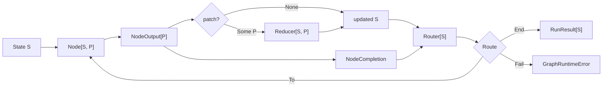

# Moon Agent グラフコア型と実行ガイド

## 対象読者と範囲

このガイドは、型付きコードを読み解くことに慣れており、データ構造とアルゴリズムに関する学部レベルの理解を持つプログラマーを対象としています。

`core` パッケージがグラフワークフローをどのようにモデル化し、その構造を検証し、ノードを実行し、状態を更新し、ルートを選択し、リソースを所有し、障害を報告するかを説明します。

引用された定義や連続した抜粋は、`src/core` 配下の現在の実装からそのまま引用したものであり、抜粋内の省略行は明示的な `// ...` マーカーで示されています。

プロバイダ固有の MoonLLM、Codex、OpenCode の詳細は、core が汎用コールバックとコーディングエージェント契約のみに依存するため、このガイドの対象外です。

## メンタルモデル

ランタイムは、有向グラフとして表現される型付き状態機械です。

- ノードは現在の状態 `S` を読み取り、`NodeOutput[P]` を非同期に生成します。
- オプションのパッチ `P` は、`Reducer[S, P]` によって状態に畳み込まれます。
- ルーターは更新された状態とノード完了を読み取り、次のノード、成功終了、または明示的な失敗を選択します。
- グラフは実行前に一度だけ検証されます。
- 1回の呼び出しは一度に1つのノードを実行し、その非同期タスクとリソースを所有します。



型パラメータは、長命な状態とノードが提案する変更を意図的に分離しています。

- `S` は、すべてのノードとルーターから参照できる完全な状態です。
- `P` は、グラフのリデューサーが受け入れるパッチ言語です。
- グラフごとに、小さなパッチ enum、コマンド風のパッチ、または完全な置換値を選択できます。

これはシーケンスに対する畳み込みに似ていますが、ルーターがシーケンスの次の要素を動的に選択する点が異なります。

## 識別子型

このパッケージは、すべての識別子を区別のない `String` として渡すわけではありません。

```moonbit
pub struct NodeId(String) derive(Eq, Hash, Debug)
pub struct RunId(String) derive(Eq, Hash, Debug)
pub struct ResourceKey(String) derive(Eq, Hash, Debug)
pub struct CodingAgentId(String) derive(Eq, Hash, Debug)
pub struct SessionId(String) derive(Eq, Hash, Debug)
```

出典: `src/core/identifiers.mbt`

これらのタプル構造体は、コンパクトな実行時表現を維持しながら、識別子同士の誤った相互使用を防ぎます。

`Eq` と `Hash` により識別子は `Map` と `Set` の有効なキーとなり、`Debug` によりエラーとテストの検査が可能になります。

構築は境界で検証されます。

```moonbit
fn parse_id(value : String, kind : String) -> String raise IdError {
  guard !value.is_empty() else { raise EmptyId(kind~) }
  value
}

pub fn NodeId::parse(value : String) -> NodeId raise IdError {
  NodeId(parse_id(value, "NodeId"))
}
```

したがって、空の識別子は即座に失敗し、後で失敗する無効なグラフキーにはなりません。

## ノード、出力、リデューサー、ルーター、ルート

中心となる実行型は `Node[S, P]` です。

```moonbit
pub(all) struct Node[S, P] {
  id : NodeId
  metadata : NodeMetadata
  execute : async (NodeContext, S) -> NodeOutput[P]
}
```

出典: `src/core/model.mbt`

`execute` フィールドは、大規模な継承階層ではなく、非同期の型付き関数です。

ノードは現在の状態の読み取り専用の値を受け取り、その結果を説明するデータを返します。

```moonbit
pub(all) struct NodeOutput[P] {
  patch : P?
  value : Json?
  artifacts : Array[Artifact]
}
```

3つの出力フィールドには異なる目的があります。

- `patch` は、型付きの状態遷移の提案です。
- `value` は、ルーティング、可観測性、または統合ペイロード用のオプションの型なしの結果です。
- `artifacts` は、生成されたファイル、ディレクトリ、テキスト、JSON、またはコマンドログを記録します。

状態の変更はリデューサーに一元化されます。

```moonbit
pub(all) struct Reducer[S, P] {
  apply : (S, P) -> S raise
}
```

この設計により、ノードはランタイムが所有する状態を直接変更せずに変更を記述できます。

リデューサーは `(state, patch)` を次の状態に変換する唯一の操作であり、遷移ルールのテストと監査が容易になります。

ルーティングも独立した関数です。

```moonbit
pub(all) enum Route {
  To(NodeId)
  End
  Fail(String)
} derive(Debug)
```

```moonbit
pub(all) struct Router[S] {
  declared_targets : ReadOnlyArray[NodeId]
  evaluate : (S, NodeCompletion) -> Route raise
}
```

`declared_targets` は、`evaluate` が返す可能性のあるすべての `To` 結果の静的な過大近似です。

これにより、コンパイラはノードが実行される前に宛先と到達可能性を検証するのに十分な情報を得られます。

`evaluate` は依然として、更新された状態と現在のノードの完了から動的な決定を行います。

## ノードコンテキスト

ランタイムは、ノードの試行ごとに新しいコンテキストを構築します。

```moonbit
pub(all) struct NodeContext {
  run_id : RunId
  node_id : NodeId
  step : Int
  deadline_ms : Int64?
  task_group : @async.TaskGroup[Unit]
  events : EventSink
  resources : RuntimeResourceStore
}
```

出典: `src/core/model.mbt`

コンテキストはグローバル変数ではなく実行能力を持ちます。

- `run_id`、`node_id`、`step` は現在の試行を識別します。
- `deadline_ms` は設定されたノードタイムアウトを公開します。
- `task_group` はアダプタに子タスクとプロセスの構造化された所有権を提供します。
- `events` は同期のベストエフォートな可観測性を公開します。
- `resources` はノードスコープと実行スコープのセッションを所有します。

同じ呼び出しレベルのタスクグループがすべてのノードに渡されるため、キャンセルは実行全体に伝播します。

## グラフの構築とコンパイル

`GraphDefinition[S, P]` は変更可能な構築フェーズです。

```moonbit
pub struct GraphDefinition[S, P] {
  reducer : Reducer[S, P]
  nodes : Map[NodeId, Node[S, P]]
  routers : Map[NodeId, Router[S]]
  mut entry : NodeId?
}
```

出典: `src/core/graph.mbt`

`add_node`、`set_router`、`set_entry` は、重複する定義と無効な識別子を拒否します。

`compile` は構造的検証を実行し、ノードとルーターのマップを不変の `CompiledGraph[S, P]` にコピーします。

```moonbit
pub fn[S, P] GraphDefinition::compile(
  self : GraphDefinition[S, P],
) -> CompiledGraph[S, P] raise GraphValidationError {
  let entry = self.entry.unwrap_or_error(MissingEntry)
  validate_graph(self.nodes, self.routers, entry)
  let nodes = self.nodes.map((_id, value) => copy_node(value))
  let routers = self.routers.map((_source, value) => copy_router(value))
  CompiledGraph::{ reducer: self.reducer, nodes, routers, entry }
}
```

検証は5つの不変条件をチェックします。

1. エントリノードが存在すること。
2. すべてのルーターのソースがノードであること。
3. すべてのノードにルーターエントリがちょうど1つ存在すること。
4. 宣言されたすべての宛先がノードであること。
5. すべてのノードが宣言された宛先を通じてエントリから到達可能であること。

到達可能性はワークリスト走査によって計算されます。

```moonbit
let reachable : Set[NodeId] = Set::default()
let pending = [entry]
while pending.pop() is Some(node_id) {
  if reachable.add_and_check(node_id) {
    let value = routers[node_id]
    for target in value.declared_targets {
      if !reachable.contains(target) {
        pending.push(target)
      }
    }
  }
}
```

これは、`pending` がスタックとして動作する場合の深さ優先探索です。

`V` 個のノードと `E` 個の宣言されたエッジに対して、その時間計算量は `O(V + E)` です。

`reachable` セットは `O(V)` の空間を使用し、`pending` は複数のエッジから到達したノードに対して重複エントリを含む可能性があるため、最悪の場合 `O(E)` の空間を使用します。

したがって、追加の総空間境界は `O(V + E)` です。

走査は実際の実行時ルートではなく宣言されたターゲットを使用します。実際のルートは将来の状態に依存するためです。

コンパイラは構造的な到達可能性を証明できますが、特定の入力状態がすべての分岐を実行することを証明することはできません。

## 逐次実行アルゴリズム

`GraphRuntime::invoke` は実行 ID を作成し、タスクグループを開き、実行ローカルのリソースストアを作成して、`run_sequential` を呼び出します。

逐次ループは3つの変数を維持します。

```moonbit
let mut state = initial_state
let mut current = runtime.graph.entry()
let mut steps = 0
```

出典: `src/core/runtime.mbt`

各反復は以下の遷移を実行します。

1. `max_steps` を強制する。
2. 現在のノードを読み込む。
3. `NodeContext` を構築する。
4. `NodeStarted` を発行する。
5. オプションのタイムアウト付きでノードを実行する。
6. 実行が失敗した場合でもノードスコープのリソースを解放する。
7. `NodeCompleted` を発行する。
8. オプションのパッチを適用する。
9. 更新された状態に対してルーターを評価する。
10. 動的なルートを `declared_targets` に対してチェックする。
11. 続行、リターン、または失敗する。

状態の更新はルート評価の前に行われます。

```moonbit
match output.patch {
  Some(patch) => {
    state = (runtime.graph.reducer.apply)(state, patch) catch {
      error => raise ReduceFailed(node_id=current, step=steps, cause=error)
    }
    runtime.events.try_emit(
      StateUpdated(run_id~, node_id=current, step=steps),
    )
  }
  None => ()
}
let router = runtime.graph.get_router(current)
let route = (router.evaluate)(state, completion) catch {
  error => raise RouteFailed(node_id=current, step=steps, cause=error)
}
```

この順序により、ルーターはちょうど完了したノードの効果に基づいて分岐できます。

ランタイムは次にルーターの静的契約を強制します。

```moonbit
match route {
  To(target) => {
    guard is_declared_target(router.declared_targets, target) else {
      raise RouteContractViolated(from=current, to=target)
    }
    current = target
  }
  End => return RunResult::{ run_id, final_state: state, steps }
  Fail(message) => raise ExplicitFailure(node_id=current, message~)
}
```

ルーターは、そのノードがグラフに存在する場合でも、宣言されていないノードに逃げることはできません。

有効な有向グラフは循環を含む可能性があるため、`max_steps` ガードは必要です。

ガードがないと、循環を繰り返し選択するルーターが永久に実行され続ける可能性があります。

ノードの検索とルーターの検索が平均 `O(1)` のマップ操作として扱われる場合、`To` 遷移は現在のルーターの宣言されたターゲットを依然として走査します。

`K` ステップと最大宣言出力次数 `D` に対して、最悪の場合の制御オーバーヘッドは `O(KD)` であり、ユーザーノード、リデューサー、ルーター、クリーンアップの作業は除外されます。

`D` が小さな定数で制限される場合、これは `O(K)` として動作します。

## タイムアウト、キャンセル、構造化並行性

ノード実行はキャンセルエラーを保持し、通常のノード障害をノードとステップのコンテキストでラップします。

```moonbit
let execute = async fn() {
  (node.execute)(context, state) catch {
    error if @async.is_being_cancelled() ||
      @async.is_cancellation_error(error) => raise error
    error =>
      raise GraphRuntimeError::NodeFailed(
        node_id=context.node_id,
        step=context.step,
        cause=error,
      )
  }
}
```

オプションのタイムアウトはこの操作を `@async.with_timeout` でラップします。

呼び出し自体は `@async.with_task_group` 内で実行されます。

```moonbit
@async.with_task_group() <| group => {
  let resources = RuntimeResourceStore::RuntimeResourceStore()
  self.events.try_emit(RunStarted(run_id))
  // ... implementation omitted ...
}
```

構造化並行性とは、子タスクが実行を偶然に長生きさせるのではなく、レキシカルなタスクグループスコープに属することを意味します。

キャンセルは通常の障害から分離されており、オブザーバーは `RunFailed` ではなく `RunCancelled` を受け取ります。

クリーンアップは、キャンセルが呼び出し元に再送出される前に依然として実行されます。

これは、タスクがタスクグループで生成され、キャンセルが構造化されたタスクツリーを通じて伝播するという、公式の MoonBit async モデルに従います。

## リソース所有権

リソースストアは現在、コーディングエージェントのセッションを所有しています。

```moonbit
pub(all) enum ResourceScope {
  Node
  Run
} derive(Debug, Eq)
```

出典: `src/core/resources.mbt`

- `Node` セッションは1回のノード試行のために開かれ、そのノードの後にクローズが試行されます。
- `Run` セッションは `ResourceKey` によってキャッシュされ、呼び出しのファイナライズがクローズを試行するまで再利用されます。

```moonbit
match scope {
  Run =>
    match self.run_entries.get(key) {
      Some(index) if !self.sessions[index].closed =>
        return self.sessions[index].session
      _ => ()
    }
  Node => if owner is None { raise NodeOwnerRequired(key) }
}
let session = open()
```

セッションは取得順序の逆順でクローズされます。

逆順のクリーンアップは、後のリソースが前のリソースに依存する場合に重要です。

ストアはクローズメソッドを呼び出す前にセッションをクローズ済みとしてマークするため、ストアの観点からは繰り返しのクリーンアップが冪等になります。

最終的なクリーンアップはキャンセルから保護され、時間制限があります。

```moonbit
@async.protect_from_cancel(async fn() {
  @async.with_timeout(
    timeout_ms,
    async fn() { self.close_all() },
    error=CleanupTimedOut(timeout_ms),
  )
})
```

保護はクリーンアップが無期限に実行されることを意味しません。クリーンアップのタイムアウトは有効なままです。

## 主要障害とクリーンアップ障害

通常の非キャンセル実行とクリーンアップは同時に失敗する可能性があります。

どちらかの障害を破棄すると診断が不完全になるため、ランタイムは両方を保持します。

```moonbit
pub(all) struct RunFailure {
  primary : Error
  cleanup : Array[Error]
} derive(Debug)

pub(all) suberror GraphRuntimeError {
  // Other variants omitted.
  ResourceCleanupFailed(failure~ : RunFailure)
}
```

出典: `src/core/graph.mbt`

`attach_cleanup` は元の障害を `primary` として保持し、クリーンアップ障害を追加します。

クリーンアップのみが失敗した場合、そのクリーンアップエラーが `ResourceCleanupFailed` の主要エラーになります。

キャンセルには異なる優先順位があります。

ランタイムは時間制限付きのクリーンアップを試行してからキャンセルを再送出するため、キャンセルパスで発生したクリーンアップエラーは抑制される可能性があります。

これは、`finally` スタイルのクリーンアップ障害がノードまたはルーティング障害を上書きすることを許すよりも情報量が多いです。

## イベントと可観測性

`GraphEvent` は、実行ライフサイクル、ノードライフサイクル、状態更新、ルート選択、リソースライフサイクルを記述します。

ランタイムはコールバックを通じてイベントを送信します。

```moonbit
pub(all) struct EventSink {
  emit : (GraphEvent) -> Unit raise
}

// ... constructors omitted ...

pub fn EventSink::try_emit(self : EventSink, event : GraphEvent) -> Unit {
  (self.emit)(event) catch {
    _ => ()
  }
}
```

出典: `src/core/model.mbt`

イベント配信は意図的にベストエフォートです。

オブザーバーの失敗はグラフのセマンティクスを変更したり、成功したノードを失敗したノードに変えたりしてはなりません。

トレードオフとして、永続的な監査ログを必要とする呼び出し元は、このプロセス内シンクの外部で永続化とリトライを提供する必要があります。

## コーディングエージェント境界

core パッケージは、プロバイダに依存しないセッショントレイトを公開します。

```moonbit
pub(open) trait CodingAgentSession {
  fn id(Self) -> SessionId?
  async fn execute(Self, CodingAgentRequest) -> CodingAgentResponse
  async fn close(Self) -> Unit
}

pub(all) struct CodingAgent {
  id : CodingAgentId
  open : async (CodingAgentOpenContext) -> &CodingAgentSession
}
```

出典: `src/core/coding_agent_contract.mbt`

したがって、グラフランタイムと一般的なコーディングエージェントノードは、セッションが Codex、OpenCode、または別のプロバイダによって実装されているかを知る必要はありません。

`open` コールバックは、実行タスクグループ、ワークスペースポリシー、承認ポリシー、ネットワークポリシー、環境、イベントシンクを受け取ります。

これはパッケージ境界での依存性逆転です。core が必要とする能力を定義し、統合パッケージがそれを実装します。

## 動作する遷移の例

グラフの状態が完了したラベルを記録し、パッチ言語が1つのラベルを追加できると仮定します。

```text
initial state: labels = []
entry node: plan
plan output: patch = AddLabel("plan")
reducer result: labels = ["plan"]
plan router: To(test)
test output: patch = AddLabel("test")
reducer result: labels = ["plan", "test"]
test router: End
run result: steps = 2
```

重要な点は、ノードが次のノードを選択せず、状態を直接置き換えないことです。

実行、状態遷移、制御フロー選択は分離されたままであり、それぞれ独立してテスト可能です。

## core が保証すること

現在の core は、コンパイルされたグラフに対して以下のプロパティを保証します。

- すべてのノードと宣言されたルートターゲットが存在すること。
- すべてのノードがエントリから構造的に到達可能であること。
- すべてのノードにルーターがあること。
- 動的な `To` ルートは、宣言されていない限り拒否されること。
- 実行は最大でも `max_steps` 回のノード試行で停止すること。
- ノードスコープのリソースクリーンアップが各ノード試行後に試行され、クリーンアップ障害は通常の非キャンセルパスで表面化されること。
- 実行スコープのファイナライズが成功、失敗、またはキャンセル時に呼び出されること。
- クローズ障害とクリーンアップタイムアウトは通常の非キャンセルパスで表面化され、キャンセルはクリーンアップ試行後に再送出され、そのクリーンアップエラーを抑制する可能性があること。
- 通常のノード、リデューサー、ルーターのエラーはノードとステップのコンテキストを保持すること。
- 同時に発生した非キャンセルの主要エラーとクリーンアップエラーの両方が保持されること。
- イベントオブザーバーの失敗は実行を変更しないこと。

現在の core は、並列スケジューリング、永続的なチェックポイント、分散実行、または永続的なイベント配信を保証しません。

## 関連資料

- [ランタイムアーキテクチャ](architecture.md)
- [公開インターフェース](interfaces.md)
- [テスト戦略](testing.md)
- [MoonBit の基礎](https://docs.moonbitlang.com/en/latest/language/fundamentals.html)
- [MoonBit のエラー処理](https://docs.moonbitlang.com/en/latest/language/error-handling.html)
- [MoonBit の非同期プログラミング](https://docs.moonbitlang.com/en/latest/language/async-experimental.html)
