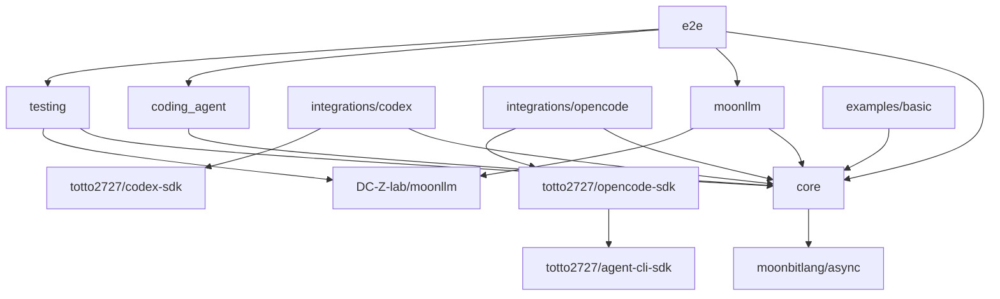
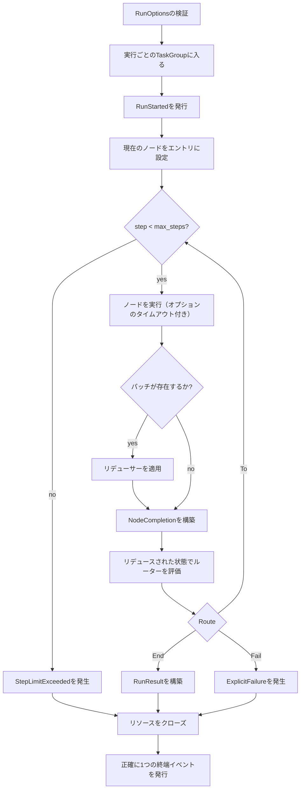

# Moon Agent Graph Runtime 実装記録

## 目的

レビュー済みのネイティブ非同期MVPは、未サポートの永続化、並列スケジューリング、または任意のリソース抽象化なしで実装されています。

実装は早期にコントラクトを固定し、具象SDKの依存関係をアダプターパッケージの背後に配置し、実際のローカルプロセスの前に決定論的フェイクで検証しました。

## デリバリーベースライン

実装されたベースラインは以下の通りです：

- MoonBitコンパイラ `v0.10.4+2cc641edf`（リポジトリ固定の `moon 0.1.20260713` 経由）
- ネイティブバックエンドのみ
- `moonbitlang/async@0.20.1`
- `moonbitlang/x@0.4.38`
- `DC-Z-lab/moonllm@0.1.0`
- `totto2727/codex-sdk@0.0.0`（このワークスペースから）
- `totto2727/agent-cli-sdk@0.1.0`（このワークスペースから）
- `totto2727/opencode-sdk@0.1.1`（このワークスペースから）

グラフモジュール、Codex SDK、OpenCode SDKはいずれも `moonbitlang/async@0.20.1` を解決しており、実装されたワークスペースコントラクト内に非同期ランタイムの第二のバージョンは存在しません。

## モジュールレイアウト

```text
mbt/package/moon-agent-graph/
├── moon.mod
├── README.mbt.md
├── README.md -> README.mbt.md
├── docs/
└── src/
    ├── core/
    ├── moonllm/
    ├── coding_agent/
    ├── integrations/
    │   ├── codex/
    │   └── opencode/
    ├── testing/
    └── e2e/
```

すべてのソースパッケージは1つの `moon.pkg` を持ちます。

モジュールメタデータは以下を使用します：

```text
preferred_target = "native"
supported_targets = "native"
```

## 依存関係の方向



本番コードからexampleやtestingパッケージをインポートしてはいけません。

## ワークストリーム概要

| ID  | 成果物                                                     | 依存先                                                     | ステータス |
| --- | ---------------------------------------------------------- | ---------------------------------------------------------- | ---------- |
| W0  | ツールチェーン、依存関係、コンパイルスパイクのベースライン | なし                                                       | 完了       |
| W1  | コアID、グラフ定義、ルーター、コンパイル                   | W0                                                         | 完了       |
| W2  | ノード、リデューサー、イベント、関数ノード                 | W0                                                         | 完了       |
| W3  | リソースストアとネイティブ非同期ライフサイクル             | W0                                                         | 完了       |
| W4  | シーケンシャルグラフランタイム                             | W1, W2, W3                                                 | 完了       |
| W5  | MoonLLMノード統合                                          | W2                                                         | 完了       |
| W6  | コーディングエージェント抽象化とノード                     | W2, W3                                                     | 完了       |
| W7  | Codexアダプター                                            | W6                                                         | 完了       |
| W8  | OpenCodeアダプター                                         | W6                                                         | 完了       |
| W9  | 共有テストキット                                           | W1インターフェース, W2インターフェース, W6インターフェース | 完了       |
| W10 | 決定論的統合ワークフロー                                   | W4, W5, W7, W8, W9                                         | 完了       |
| W11 | 例、APIレビュー、ドキュメント調整                          | W10                                                        | 最終調整中 |

## W0: ツールチェーンとコントラクトスパイク

ステータス: 完了。

### 成果物

- `moon.mod` と `moon.pkg` を使用した新しいモジュールスケルトン
- ネイティブターゲット宣言
- 共通の `moonbitlang/async` バージョン
- すべての特異な公開APIシェイプに対する最小限のコンパイルスパイク
- 初期パッケージ依存関係グラフ
- 既存のワークスペース検出に必要な場合のみリポジトリタスク統合

### コンパイルスパイク

これらのシェイプを実際のコンパイラで証明すること：

- 非同期関数フィールドを含むジェネリック構造体
- 非同期 `pub(open) trait` メソッドとトレイトオブジェクト
- ノードとコーディングエージェントのオープンコンテキストを通じて渡される実行単位の `TaskGroup[Unit]`
- `Eq`、`Hash`、`Debug` を導出する `NodeId`
- エラーを発生させる関数フィールド
- 公開エラーレコードに原因として保存される `Error`
- 公開クエリ境界での `ReadOnlyArray`
- マップに格納されるコーディングエージェントセッショントレイトオブジェクト

### 非同期依存関係ゲート

Codex SDK、OpenCode SDK、グラフモジュールは `moonbitlang/async@0.20.1` に揃えられ、それらのフォーカスされたネイティブテストが共有ランタイムコントラクトを検証します。

### 受理条件

- `moon check --target native` がスケルトンとコンパイルスパイクに対してパスする
- パッケージ依存関係グラフが非循環である
- 共通の非同期バージョンが明示されている
- 非推奨の `moon.mod.json`、`moon.pkg.json`、暗黙のトレイトメソッドアタッチメント、古い `suberror` 構文が導入されていない

## W1: グラフモデルとコンパイラ

ステータス: 完了。

### 成果物

- 識別子ラッパーとバリデーション
- `Route`
- 宣言された宛先を持つ `Router[S]`
- `GraphDefinition[S, P]`
- `CompiledGraph[S, P]`
- コンパイル検証と到達可能性
- ブラックボックスグラフテスト

### 実装ルール

- ノードあたり1つのルーターを許可する
- サイクルを許可する
- 宣言されていない、または不明な宛先を拒否する
- コンパイル時に定義コレクションをコピーする
- コンパイル済みコレクションはプライベートに保つ
- 並列エッジの順序付けセマンティクスを追加しない

### 受理条件

- 有効な循環グラフがコンパイルされる
- 不明および到達不能な宛先が具体的な `suberror` 値で失敗する
- コンパイル後の変更がコンパイル済みグラフを変更しない
- ランタイムルックアップに可変のパブリックエイリアスがない

## W2: ノード、リデューサー、イベント、関数ノード

ステータス: 完了。

### 成果物

- `Node[S, P]`
- `NodeContext`
- `NodeOutput[P]`
- アーティファクトとメタデータ
- `Reducer[S, P]`
- `GraphEvent`
- 同期 `EventSink`
- 関数ノードファクトリー
- ユニットテスト

### 実装ルール

- ノードには非同期コールバックフィールドを使用する
- リデューサーとルーターは同期的に保つ
- 非同期操作を実行しないコールバックに `async` を使用しない
- MVPで状態ストアインターフェースを導入しない
- `NodeOutput` 内にライフサイクルイベントを重複させない

### 受理条件

- 関数ノードが正しい状態とコンテキストを受け取る
- 発生したコールバックエラーがランタイムの原因として利用可能である
- イベント順序が決定論的である
- リデューサーの出力がルーターによって観測される状態である

## W3: リソースストアとネイティブ非同期ライフサイクル

ステータス: 完了。

### 成果物

- `ResourceScope`
- コーディングエージェントセッションに特化した実行ローカルリソースストア
- 実行スコープとノードスコープの取得
- 逆順でのクローズ
- 一度だけクローズする動作
- クリーンアップエラーの集約
- キャンセル保護およびタイムアウト制限付きファイナライズ
- すべての終端パスに対するユニットテスト

### 実装ルール

- 正常にオープンされたリソースのみをキャッシュする
- クローズ失敗後もクリーンアップを継続する
- キャンセル保護はクリーンアップ周辺に限定する
- ラン タスクグループの本体が戻る前にリソースをクローズする
- 長時間稼働する子プロセスの唯一のクローズパスとしてタスクグループのdeferを使用しない
- アプリケーションスコープのリソースを追加しない
- 任意の型付きダウンキャストを追加しない

### 受理条件

- 実行スコープのセッションは1回の実行内で再利用される
- ノードスコープのセッションは各試行後にクローズされる
- オープンおよびクローズの失敗はその原因を保持する
- キャンセルによってOpenCodeまたはCodex CLIのサブプロセスが実行中のまま残ることはない

## W4: シーケンシャルグラフランタイム

ステータス: 完了。

### 成果物

- `GraphRuntime[S, P]`
- 呼び出しローカル状態
- 実行ごとのタスクグループ
- ノード実行ループ
- パッチリダクション
- ルーティング
- ステップ制限
- ノードタイムアウト
- 終端イベントのディシプリン
- エラーラッピングとクリーンアップ統合
- ランタイムユニットテスト

### 実行アルゴリズム



### キャンセルルール

- 呼び出し元タスクのキャンセルはキャンセルエラーのままとする
- クリーンアップはキャンセルが再発生される前に実行される
- キャッチオールのリトライまたはポーリングループは `@async.is_being_cancelled()` が真になった時点で停止する
- `@async.is_cancellation_error` は観測されたエラーを分類するために使用できるが、唯一のキャンセル状態テストではない

### 受理条件

- シーケンシャル、分岐、ループ、ステップ制限、タイムアウト、失敗、キャンセルの各テストがパスする
- クリーンアップも失敗した場合でも、一次エラーが一次のままである
- `RunStarted` の後に正確に1つの終端イベントが続く
- すべての子タスクが `invoke` を終了する前に終了する

## W5: MoonLLMノード

ステータス: 完了。

### 成果物

- `LlmNodeSpec[S, P]`
- チャットリクエストビルダーとレスポンスデコーダー境界
- ノードファクトリー
- 決定論的呼び出しフェイク
- ローカルモックOpenAI互換統合テスト

### 実装ルール

- 具象MoonLLMクライアントは統合パッケージに保持する
- 狭い非同期呼び出しコールバックを注入する
- MoonLLMの `LLMError` を保持する
- トークン使用量をドキュメント化されたアーティファクトまたはイベントに保持する
- ワークスペース編集セマンティクスをLLMノードに混入させない

### 受理条件

- リクエスト構築の失敗はクライアントをスキップする
- トランスポートおよびデコードの失敗は状態を更新しない
- タイムアウトとキャンセルはリクエストを終了する
- 実際のMoonLLMクライアントがローカルモックサーバーに対して動作する

## W6: コーディングエージェント抽象化

ステータス: 完了。

### 成果物

- 共通のリクエスト、レスポンス、ポリシー、ワークスペース、ステータス型
- 非同期 `CodingAgentSession` トレイト
- `CodingAgent` open関数
- コーディングエージェントノードファクトリー
- フェイクセッション実装
- スコープと継続動作のユニットテスト

### 実装ルール

- キャンセルはタスクキャンセルであり、`Cancelled` 成功レスポンスではない
- セッションオープンコンテキストは、構築時に適用される環境とポリシーを所有する
- アダプター固有のオプションは共通コントラクトの外部に残す
- `changed_files` はSDKが変更セットを証明できない場合に空になる可能性がある
- Closeはインターフェースレベルで冪等であり、リソースストアによって1回だけ呼び出される

### 受理条件

- 同じノード実装がフェイクのCodexライクおよびOpenCodeライクなセッションで動作する
- 実行スコープが1つのセッションを再利用する
- ノードスコープは試行ごとにオープンおよびクローズされる
- キャンセルが実行中のセッション処理に到達する

## W7: Codexアダプター

ステータス: 完了。

### 成果物

- 共通ポリシーから `ThreadOptions` へのマッピング
- 新規および再開されたスレッドの作成
- リクエスト実行とレスポンス正規化
- 継続IDの抽出
- タスクキャンセル動作
- 既存のフェイクCodex実行可能ファイルアプローチを使用した統合テスト

### 実装ルール

- `Codex::start_thread` および `Codex::resume_thread` を使用する
- 必要な観測可能性に応じて `Thread::run` または `Thread::run_streamed` を使用する
- stdout、stderr、コマンド、変更ファイルデータを invent しない
- 進行中のすべての処理が終了した後にのみ、closeをno-opとして保持する
- `turn.failed` を発生したアダプターエラーとして保持する

### 受理条件

- 新規および再開されたターンが機能する
- ワークスペース、サンドボックス、承認、ネットワーク、追加ルートの設定が正しくマッピングされる
- ターンのキャンセルはそのサブプロセスを終了させる
- 既存のCodex SDKテストがグリーンのままである

## W8: OpenCodeアダプター

ステータス: 完了。

### 成果物

- CLIスレッドと論理セッション状態
- ワークスペース、環境、SDK固有オプションをマッピングするopen関数
- 新規および再開されたOpenCodeセッション
- 型付きプロンプトとローカルファイル入力のマッピング
- CLIターン実行と最終テキストレスポンスのマッピング
- 冪等な論理クローズ
- フェイクの `opencode run --format json` 実行可能ファイルを使用した統合テスト

### 実装ルール

- CLI実行には `totto2727/opencode-sdk` を使用し、`totto2727/opencode-server-sdk` はグラフアダプターの外部に保持する
- 相対コンテキストファイルをワークスペースルートに対して解決し、型付きローカルファイル入力として渡す
- 継承された環境変数を保持し、その後アダプターと呼び出し元のオーバーライドをその順序で適用する
- 具象SDKのプロセス、JSONL、ターンエラーを保持する
- 各 `Thread::run` 呼び出しが自身のネイティブ子プロセスを所有しクリーンアップする
- 1つの論理OpenCodeセッションIDが呼び出しのために再利用されるべき場合、呼び出し元の `CodingAgentNodeSpec` で実行スコープを選択する

### 受理条件

- 新規および再開されたセッションが正しいセッションIDをCLIに渡す
- モデル、エージェント、ディレクトリ、ファイル、バリアント、タイトル、シンキング、プロンプト、環境のマッピングが観測可能である
- プロセス障害とキャンセルが子プロセスのクリーンアップ後に伝播する
- キャンセル後もCLI子プロセスが残らない

## W9: テストキット

ステータス: 完了。

### 成果物

- スクリプト化されたノードとルーター
- 記録用リデューサーとイベントシンク
- フェイクコーディングエージェントとセッション
- フェイクMoonLLM呼び出しコールバック
- 一意の一時ワークスペースヘルパー
- 境界付き `eventually` ヘルパー
- プロセスおよびポートリークアサーション

### 実装ルール

- フィクスチャのミューテーションは、ミューテックスが必要でない限り、1つの非同期タスクが所有するようにする
- 遅延および失敗スクリプトは境界付きにする
- テストの便宜のために本番専用の抽象化を追加しない

### 受理条件

- コア、MoonLLM、コーディングエージェントの各パッケージが外部クレデンシャルなしでテストできる
- すべてのフェイクがテスト計画に必要な呼び出し、引数、クローズ順序を記録する

## W10: 決定論的統合

ステータス: 完了。

### 成果物

- 関数のみのグラフ
- MoonLLM計画から関数へのグラフ
- MoonLLM計画からCodex経由で関数テストへのグラフ
- MoonLLM計画からOpenCode経由で関数テストへのグラフ
- Codex/OpenCode選択グラフ
- リトライループ
- キャンセルワークフロー

### 受理条件

- すべてのワークフローがネイティブバックエンドで実行される
- リトライループが成功または設定された制限によって終了する
- セッションの再利用が観測可能である
- 選択されていないアダプターは決してオープンされない
- 子プロセスが残存しない

## W11: 例とAPIレビュー

ステータス: 最終調整中。

### 成果物

- 実行可能な最小限のネイティブ例
- 可能な場合は確認済みの例を含む `README.mbt.md`
- 実装とアーキテクチャ、インターフェース、テスト、制限事項の調整
- 公開API命名レビュー
- エラーレッドアクションレビュー

### 受理条件

- 例がリポジトリルートのコマンドからビルドおよび実行される
- ドキュメントがエクスポートされたシグネチャと一致する
- 将来の機能が実装済みとして説明されていない
- 英語のソースドキュメントと日本語訳がペアになったままである

## エクスポートされたAPI調整

- `GraphRuntime::invoke` は非同期メソッドであり、`initial_state` を唯一の必須位置引数とし、`options? : RunOptions` をラベル付きオプション引数とする
- `RunOptions::RunOptions` は `max_steps`、`node_timeout_ms?`、`cleanup_timeout_ms` を検証する。ランタイムはグローバルな呼び出し状態を保存しない
- `NodeContext` は呼び出しの `TaskGroup[Unit]`、同期 `EventSink`、呼び出しローカルの `RuntimeResourceStore`、オプションのデッドラインを持つ
- `CodingAgentSession` は `pub(open)` の非同期トレイトであり、`id`、`execute`、`close` を持つ。`CodingAgent.open` は `CodingAgentOpenContext` を受け取る
- `CodingAgentNodeSpec` は `open_context`、`build_request`、`decode_response` のコールバックを発生させ、`ResourceScope` を明示的に選択する
- `LlmNodeSpec` は型付きMoonLLMリクエストビルダー、狭い非同期呼び出しコールバック、レスポンスデコーダーを受け入れる
- `RuntimeResourceStore` は意図的に `CodingAgentSession` に特化されており、異種リソースコンテナではない
- `codex_agent` と `opencode_agent` はアダプターオプションレコードを公開する一方で、SDK固有のセッションおよびプロセス状態をプライベートに保つ
- 公開コレクションのスナップショットは `ReadOnlyArray` を使用する。所有された可変配列とマップは、グラフ定義、ランタイム、リソース、テストフィクスチャに対してプライベートのままである

## 既知のMVP制限事項

- 実行はシーケンシャルでネイティブのみである
- 状態は呼び出しローカルでメモリ内にあり、チェックポイント、サスペンド/レジューム、永続状態、プラグ可能な状態ストアは実装されていない
- 並列ノード、アプリケーションスコープのリソース、任意の型付きリソースダウンキャスト、動的未宣言ルートは実装されていない
- ノードあたり1つのルーターがサポートされ、すべての可能な `To` 宛先はコンパイル前に宣言されなければならない
- `EventSink` は同期的でベストエフォートである。シンクの失敗はグラフ実行を失敗させない
- コーディングエージェントの `changed_files` は、基礎となるSDKが信頼できる変更セットを証明できない場合に空になる可能性がある
- Codexアダプターは現在のSDKによって公開されるデータのみを報告し、stdout、stderr、コマンド、変更ファイルレコードを invent しない
- OpenCodeアダプターはリクエスト間で論理CLIスレッドのみを保存する。`coding_agent_node` とその `ResourceScope` の選択が、そのセッションIDが実行のために再利用されるか、ノード試行ごとに再オープンされるかを決定する
- クリーンアップは `cleanup_timeout_ms` によって制限される。クリーンアップのタイムアウトまたはクローズの失敗はランタイムエラーモデルを通じて報告される

## 完了した実装フェーズ

### フェーズ 0: ベースライン

W0は、機能実装の前にツールチェーン、依存関係バージョン、APIコンパイルスパイクを確立しました。

### フェーズ 1: コアコントラクト

W1、W2、W3のインターフェース部分、W9のインターフェース部分は、ID、ノード出力、ルーター宣言、イベント順序、エラー保存、リソーススコープを固定しました。

### フェーズ 2: ランタイムと抽象統合

W4、W5、W6は、具象コーディングエージェントプロセスなしで、フェイクに対する完全なグラフ実行を確立しました。

### フェーズ 3: 具象アダプター

W7とW8は、完全なワークフロー統合の前に決定論的フェイク実行可能ファイルを使用しました。

### フェーズ 4: ワークフロー

W10は、決定論的ネイティブワークフローを通じてすべてのパッケージ間のライフサイクル動作を調整しました。

### フェーズ 5: 安定化

W11は、最終的なルート検証、ネイティブ例、APIレビュー、ドキュメント調整の段階です。

## 固定されたコントラクト

実装は以下を固定しました：

1. 正確な非同期依存関係バージョン
2. ジェネリックなノードとルーターのコールバックシグネチャ
3. ルーターの宣言ターゲットセマンティクス
4. `NodeOutput[P]`
5. コーディングエージェントのリクエストとレスポンスの最小フィールド
6. セッショントレイトメソッド
7. リソーススコープとクローズ順序
8. イベント順序と終端イベントルール
9. ノードタイムアウトとコーラーのキャンセル
10. 一次エラーとクリーンアップエラーの保存
11. OpenCodeのターンごとのCLIサブプロセスの所有権とキャンセル

## 検証コマンド

リポジトリルートから実行します。

```bash
vp run mbt:fix
vp run mbt:check
vp run mbt:build
vp run mbt:test
```

開発中はフォーカスされたネイティブテストを使用します。

```bash
moon test --target native mbt/package/moon-agent-graph/src/core
moon test --target native mbt/package/moon-agent-graph/src/integrations/codex
moon test --target native mbt/package/moon-agent-graph/src/integrations/opencode
```

最終的な手動ゲートは、少なくとも1つの関数のみの例と1つの決定論的コーディングエージェントワークフローを、そのネイティブ実行可能ファイルの表面を通じてカバーします。

## 実装済みMVP記録

- モジュールはネイティブのみで非同期である
- グラフとアダプター間で1つの共通非同期ランタイムバージョンが使用されている
- 関数、MoonLLM、Codex、OpenCodeの各ノードを登録および実行できる
- 条件付きルートとサイクルが機能する
- ルーターの宛先はコンパイル時に検証される
- 状態はリデューサーを通じてのみ更新される
- 無限ループは `max_steps` で停止する
- ノードタイムアウトとコーラーのキャンセルは所有された処理を終了させる
- OpenCodeは1つの論理セッションIDを再利用し、各ターンは短命なCLIサブプロセスを所有する
- Codexサブプロセスのキャンセルが観測される
- 一次エラーとクリーンアップエラーは区別可能なままである
- ユニットテストと決定論的統合テストがパスする
- 子プロセスまたは一時フィクスチャのリークは残っていない
- ネイティブ例がビルドおよび実行される
- 公開APIドキュメントが実装と一致する

## 参考資料

- [MoonBit非同期プログラミング](https://docs.moonbitlang.com/en/latest/language/async-experimental.html)
- [MoonBitエラーハンドリング](https://docs.moonbitlang.com/en/latest/language/error-handling.html)
- [MoonBitメソッドとトレイト](https://docs.moonbitlang.com/en/latest/language/methods.html)
- [MoonBitモジュール設定](https://docs.moonbitlang.com/en/latest/toolchain/moon/module.html)
- [MoonBitパッケージ設定](https://docs.moonbitlang.com/en/latest/toolchain/moon/package.html)
- [moonbitlang/async パッケージ](https://mooncakes.io/docs/moonbitlang/async)
- [MoonLLM](https://github.com/DC-Z-lab/moonllm)
- [Codex SDK ソースリファレンス](https://github.com/openai/codex/tree/f201c30c52a35f819262865a53df94b6f4ea7a50/sdk/typescript)
- [OpenCode CLI ドキュメント](https://opencode.ai/docs/cli/)
- [OpenCode `run` JSONL 実装](https://github.com/anomalyco/opencode/blob/1e17856ba4b5b052650c8115060852f3f023844e/packages/opencode/src/cli/cmd/run.ts)
