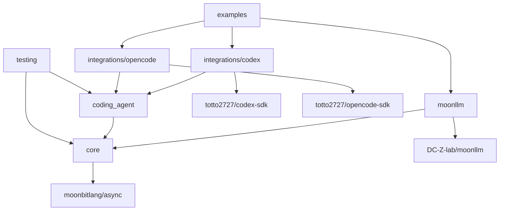
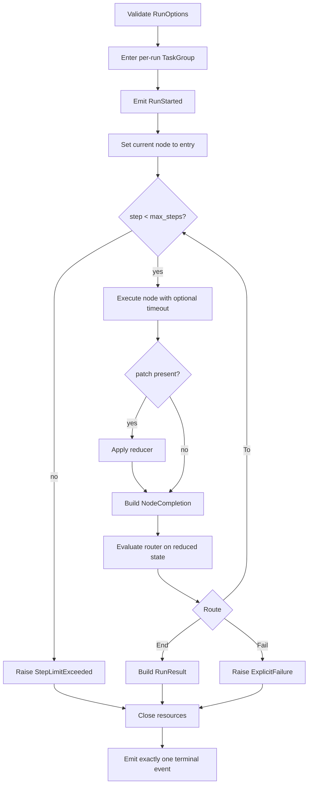

# Moon Agent Graph Runtime 実装計画

## 目的

未対応の永続性、並列スケジューリング、または任意のリソース抽象化を導入せずに、レビュー済みのネイティブ非同期MVPを実装する。

本計画はコントラクトを早期に固定し、具体的なSDK依存関係をアダプターパッケージの背後に隠蔽し、実際のローカルプロセスを使用する前に決定論的なフェイクを通じて統合する。

## デリバリーベースライン

実装の対象:

- MoonBitコンパイラ `v0.10.4` またはリポジトリで指定された後継バージョン。
- ネイティブバックエンドのみ。
- `moonbitlang/async@0.20.1` を初期の共通asyncベースラインとして使用。
- `moonbitlang/x@0.4.38` を初期のパス型ベースラインとして使用。
- `DC-Z-lab/moonllm@0.1.0`。
- `totto2727/codex-sdk`（このワークスペースのもの）。
- `totto2727/opencode-sdk`（このワークスペースのもの）。

機能実装の前に、Codex SDKの現在の `moonbitlang/async@0.19.2` 依存関係を共通ベースラインに合わせるか、ワークスペースリゾルバーと公開APIに互換性があることを証明する。

新しいモジュールが2つの未レビューのasyncランタイムバージョンに依存することを許可してはならない。

## モジュールレイアウト

```text
mbt/package/moon-agent-graph/
├── moon.mod
├── README.mbt.md
├── README.md -> README.mbt.md
├── docs/
└── src/
    ├── core/
    ├── moonllm/
    ├── coding_agent/
    ├── integrations/
    │   ├── codex/
    │   └── opencode/
    ├── testing/
    └── examples/
```

すべてのソースパッケージは1つの `moon.pkg` を持つ。

モジュールメタデータは以下を使用する:

```text
preferred_target = "native"
supported_targets = "native"
```

## 依存関係の方向



いかなるパッケージも、プロダクションコードからexampleやtestingパッケージをインポートしてはならない。

## ワークストリーム概要

| ID | 成果物 | 依存 |
|---|---|---|
| W0 | ツールチェーン、依存関係、コンパイルスパイクベースライン | なし |
| W1 | コアID、グラフ定義、ルーター、およびコンパイル | W0 |
| W2 | ノード、リデューサー、イベント、関数ノード | W0 |
| W3 | リソースストアとネイティブ非同期ライフサイクル | W0 |
| W4 | シーケンシャルグラフランタイム | W1, W2, W3 |
| W5 | MoonLLMノード統合 | W2 |
| W6 | コーディングエージェント抽象化とノード | W2, W3 |
| W7 | Codexアダプター | W6 |
| W8 | OpenCodeアダプター | W6 |
| W9 | 共有テストキット | W1インターフェース, W2インターフェース, W6インターフェース |
| W10 | 決定論的統合ワークフロー | W4, W5, W7, W8, W9 |
| W11 | 例、APIレビュー、ドキュメント調整 | W10 |

## W0: ツールチェーンとコントラクトスパイク

### 成果物

- `moon.mod` と `moon.pkg` を使用した新しいモジュールスケルトン。
- ネイティブターゲット宣言。
- 1つの共通 `moonbitlang/async` バージョン。
- すべての特異な公開APIシェイプに対する最小限のコンパイルスパイク。
- 初期パッケージ依存関係グラフ。
- 既存のワークスペース検出で必要な場合のみ、リポジトリタスク統合。

### コンパイルスパイク

実際のコンパイラで以下のシェイプを証明する:

- async関数フィールドを含むジェネリック構造体。
- Async `pub(open) trait` メソッドとトレイトオブジェクト。
- ノードとコーディングエージェントのオープンコンテキストを通じて渡される、実行ごとの `TaskGroup[Unit]`。
- `Eq`、`Hash`、`Debug` を導出する `NodeId`。
- エラーを発生させる関数フィールド。
- 公開エラーレコードに原因として保存される `Error`。
- 公開クエリ境界における `ReadOnlyArray`。
- マップに格納されるコーディングエージェントセッショントレイトオブジェクト。

### Async依存関係ゲート

Codex SDKを `moonbitlang/async@0.20.1` に対して検査する。

ソースの変更が必要な場合は、Codex SDK内に留め、グラフモジュールの依存関係を追加する前に、既存のフォーカステストを検証する。

### 受理条件

- `moon check --target native` がスケルトンとコンパイルスパイクに対してパスする。
- パッケージ依存関係グラフが非循環である。
- 共通のasyncバージョンが明示的である。
- 非推奨の `moon.mod.json`、`moon.pkg.json`、暗黙のトレイトメソッドアタッチメント、または古い `suberror` 構文が導入されていない。

## W1: グラフモデルとコンパイラ

### 成果物

- 識別子ラッパーとバリデーション。
- `Route`。
- 宣言された送信先を持つ `Router[S]`。
- `GraphDefinition[S, P]`。
- `CompiledGraph[S, P]`。
- コンパイル検証と到達可能性。
- ブラックボックスグラフテスト。

### 実装ルール

- ノードごとに1つのルーターを許可する。
- サイクルを許可する。
- 未宣言または不明な送信先を拒否する。
- コンパイル中に定義コレクションをコピーする。
- コンパイル済みコレクションを非公開に保つ。
- 並列エッジの順序付けセマンティクスを追加しない。

### 受理条件

- 有効な循環グラフがコンパイルされる。
- 不明および到達不能な送信先が、具体的な `suberror` 値で失敗する。
- コンパイル後のミューテーションがコンパイル済みグラフを変更しない。
- ランタイムルックアップにミュータブルな公開エイリアスがない。

## W2: ノード、リデューサー、イベント、関数ノード

### 成果物

- `Node[S, P]`。
- `NodeContext`。
- `NodeOutput[P]`。
- アーティファクトとメタデータ。
- `Reducer[S, P]`。
- `GraphEvent`。
- 同期 `EventSink`。
- 関数ノードファクトリー。
- ユニットテスト。

### 実装ルール

- ノードにはasyncコールバックフィールドを使用する。
- リデューサーとルーターは同期的に保つ。
- 非同期操作を実行しないコールバックに `async` を使用しない。
- MVPに状態ストアインターフェースを導入しない。
- `NodeOutput` 内にライフサイクルイベントを重複させない。

### 受理条件

- 関数ノードが正しい状態とコンテキストを受け取る。
- 発生したコールバックエラーがランタイム原因として利用可能である。
- イベント順序が決定論的である。
- リデューサーの出力がルーターによって観測される状態である。

## W3: リソースストアとネイティブ非同期ライフサイクル

### 成果物

- `ResourceScope`。
- コーディングエージェントセッションに特化した実行ローカルリソースストア。
- 実行スコープとノードスコープの取得。
- 逆順のクローズ。
- 1回のみのクローズ動作。
- クリーンアップエラーの集約。
- キャンセル保護およびタイムアウト制限付きファイナライゼーション。
- すべての終端パスに対するユニットテスト。

### 実装ルール

- 正常にオープンされたリソースのみをキャッシュする。
- クローズ失敗後もクリーンアップを継続する。
- キャンセル保護はクリーンアップの周囲に限定する。
- ランのタスクグループ本体が戻る前にリソースをクローズする。
- 長時間稼働する子プロセスの唯一のクローズパスとしてタスクグループのdeferを使用しない。
- アプリケーションスコープのリソースを追加しない。
- 任意の型ダウンキャストを追加しない。

### 受理条件

- 実行スコープのセッションが1回のラン内で再利用される。
- ノードスコープのセッションが各試行後にクローズされる。
- オープン失敗とクローズ失敗がその原因を保持する。
- キャンセルによってOpenCodeサーバーまたはCodexサブプロセスが実行されたままになることはない。

## W4: シーケンシャルグラフランタイム

### 成果物

- `GraphRuntime[S, P]`。
- 呼び出しローカル状態。
- 実行ごとのタスクグループ。
- ノード実行ループ。
- パッチリダクション。
- ルーティング。
- ステップ制限。
- ノードタイムアウト。
- 終端イベント規律。
- エラーラッピングとクリーンアップ統合。
- ランタイムユニットテスト。

### 実行アルゴリズム



### キャンセルルール

- 呼び出し元タスクのキャンセルはキャンセルエラーのままとする。
- キャンセルが再スローされる前にクリーンアップが実行される。
- `@async.is_being_cancelled()` がtrueの場合、キャッチオールのリトライまたはポーリングループは停止する。
- `@async.is_cancellation_error` は観測されたエラーを分類するために使用できるが、唯一のキャンセル状態テストではない。

### 受理条件

- シーケンシャル、分岐、ループ、ステップ制限、タイムアウト、失敗、キャンセルの各テストがパスする。
- クリーンアップも失敗した場合でも、一次エラーが一次のままである。
- `RunStarted` の後に正確に1つの終端イベントが続く。
- `invoke` が終了する前にすべての子タスクが終了する。

## W5: MoonLLM ノード

### 成果物

- `LlmNodeSpec[S, P]`。
- チャットリクエストビルダーとレスポンスデコード境界。
- ノードファクトリー。
- 決定論的呼び出しフェイク。
- ローカルモックOpenAI互換統合テスト。

### 実装ルール

- 具体的なMoonLLMクライアントは統合パッケージ内に保持する。
- 狭いasync呼び出しコールバックを注入する。
- MoonLLM `LLMError` を保持する。
- 文書化されたアーティファクトまたはイベントでトークン使用量を保持する。
- LLMノードにワークスペース編集セマンティクスを混在させない。

### 受理条件

- リクエストビルドの失敗はクライアントをスキップする。
- トランスポートおよびデコードの失敗は状態を更新しない。
- タイムアウトとキャンセルはリクエストを終了する。
- 実際のMoonLLMクライアントがローカルモックサーバーに対して動作する。

## W6: コーディングエージェント抽象化

### 成果物

- 共通のリクエスト、レスポンス、ポリシー、ワークスペース、ステータス型。
- Async `CodingAgentSession` トレイト。
- `CodingAgent` オープン関数。
- コーディングエージェントノードファクトリー。
- フェイクセッション実装。
- スコープと継続動作のユニットテスト。

### 実装ルール

- キャンセルはタスクキャンセルであり、`Cancelled` 成功レスポンスではない。
- セッションオープンコンテキストは、構築時に適用される環境とポリシーを所有する。
- アダプター固有のオプションは共通コントラクトの外部に残す。
- SDKが変更セットを証明できない場合、`changed_files` は空でもよい。
- Closeはインターフェースレベルで冪等であり、リソースストアによって1回呼び出される。

### 受理条件

- 同じノード実装が、フェイクのCodex風およびOpenCode風セッションで動作する。
- 実行スコープは1つのセッションを再利用する。
- ノードスコープは試行ごとにオープンおよびクローズする。
- キャンセルが進行中のセッション作業に到達する。

## W7: Codex アダプター

### 成果物

- 共通ポリシーから `ThreadOptions` へのマッピング。
- 新規および再開スレッドの作成。
- リクエスト実行とレスポンスの正規化。
- 継続IDの抽出。
- タスクキャンセル動作。
- 既存のフェイクCodex実行可能ファイルアプローチを使用した統合テスト。

### 実装ルール

- `Codex::start_thread` および `Codex::resume_thread` を使用する。
- 必要な観測可能性に応じて `Thread::run` または `Thread::run_streamed` を使用する。
- stdout、stderr、コマンド、または変更ファイルデータを発明しない。
- 進行中のすべての処理が終了した後でのみ、closeをno-opとして保持する。
- `turn.failed` を発生したアダプターエラーとして保持する。

### 受理条件

- 新規および再開ターンが動作する。
- ワークスペース、サンドボックス、承認、ネットワーク、追加ルートの各設定が正しくマッピングされる。
- ターンのキャンセルはそのサブプロセスを終了する。
- 既存のCodex SDKテストがグリーンのままである。

## W8: OpenCode アダプター

### 成果物

- サーバーとセッションの内部状態。
- ランの `TaskGroup[Unit]` を共通オープンコンテキストから消費するオープン関数。
- `Server::moonllm_config` からのMoonLLM HTTPクライアント作成。
- OpenCodeセッション作成。
- セッションメッセージ実行。
- レスポンスデコード。
- 明示的クローズ。
- フェイクOpenCode実行可能ファイルとローカルHTTPサーバーを使用した統合テスト。

### 実装ルール

- MoonLLMをOpenCodeエンドポイントの呼び出しに使用するHTTPクライアントとして扱う。
- OpenCodeコーディングリクエストを汎用のMoonLLMチャット補完リクエストにマッピングしない。
- 部分的な起動失敗時にサーバーをクローズする。
- 所有するタスクグループ本体が戻る前にサーバーをクローズする。
- サーバーURLを非公開に保つ。
- デフォルトを実行スコープとする。

### 受理条件

- 1回のランが1つのサーバーを起動して再利用する。
- 起動失敗、不正な準備完了、タイムアウト、セッション失敗、リクエスト失敗、クラッシュ、キャンセルはすべてクリーンアップされる。
- テスト後、サーバープロセス、ポート、一時ログディレクトリが残っていない。

## W9: テストキット

### 成果物

- スクリプト化されたノードとルーター。
- 記録用リデューサーとイベントシンク。
- フェイクコーディングエージェントとセッション。
- フェイクMoonLLM呼び出しコールバック。
- 一意の一時ワークスペースヘルパー。
- 境界のある `eventually` ヘルパー。
- プロセスおよびポートリークアサーション。

### 実装ルール

- ミューテックスが必要でない限り、フィクスチャのミューテーションを1つのasyncタスクが所有する。
- 遅延および失敗スクリプトを有界にする。
- テストの便宜のためにプロダクション専用の抽象化を追加しない。

### 受理条件

- コア、MoonLLM、コーディングエージェントパッケージが外部認証情報なしでテストできる。
- すべてのフェイクが、テスト計画に必要な呼び出し、引数、クローズ順序を記録する。

## W10: 決定論的統合

### 成果物

- 関数のみのグラフ。
- MoonLLM計画から関数へのグラフ。
- MoonLLM計画からCodex、関数テストへのグラフ。
- MoonLLM計画からOpenCode、関数テストへのグラフ。
- Codex/OpenCode選択グラフ。
- リトライループ。
- キャンセルワークフロー。

### 受理条件

- すべてのワークフローがネイティブバックエンドで実行される。
- リトライループが成功または設定された制限によって終了する。
- セッションの再利用が観測可能である。
- 選択されていないアダプターは決してオープンされない。
- 子プロセスが残存しない。

## W11: 例とAPIレビュー

### 成果物

- 最小限の実行可能なネイティブ例。
- 可能な場合はチェックされた例を含む `README.mbt.md`。
- アーキテクチャ、インターフェース、テスト、制限との実装の調整。
- 公開API命名レビュー。
- エラーレッドアクションレビュー。

### 受理条件

- 例がリポジトリルートのコマンドからビルドおよび実行される。
- ドキュメントがエクスポートされたシグネチャと一致する。
- 将来の機能が実装済みとして説明されていない。
- 英語のソースドキュメントと日本語訳がペアで維持されている。

## 推奨フェーズ

### フェーズ 0: ベースライン

W0を完了する。

asyncバージョンとAPIコンパイルスパイクが解決される前に、広範な実装を開始しない。

### フェーズ 1: コアコントラクト

W1、W2、W3のインターフェース部分、W9のインターフェース部分を実行する。

ID、ノード出力、ルーター宣言、イベント順序、エラー保持、リソーススコープを凍結する。

### フェーズ 2: ランタイムと抽象統合

W4、W5、W6をフェイクに対して実行する。

終了基準は、具体的なコーディングエージェントプロセスなしで完全なグラフ実行が完了すること。

### フェーズ 3: 具体アダプター

W7とW8をW6の後に独立して実行する。

完全なワークフロー統合の前に、決定論的フェイク実行可能ファイルを使用する。

### フェーズ 4: ワークフロー

W10を実行し、すべてのパッケージ間でライフサイクル動作を調整する。

### フェーズ 5: 安定化

W11、ルート検証、ネイティブ手動例、ドキュメント調整を実行する。

## コントラクト凍結ポイント

並列実装の前にこれらを凍結する:

1. 正確なasync依存関係バージョン。
2. ジェネリックノードとルーターのコールバックシグネチャ。
3. ルーターの宣言済みターゲットセマンティクス。
4. `NodeOutput[P]`。
5. コーディングエージェントのリクエストとレスポンスの最小フィールド。
6. セッショントレイトのメソッド。
7. リソーススコープとクローズ順序。
8. イベント順序と終端イベントルール。
9. ノードタイムアウトと呼び出し元キャンセル。
10. 一次エラーとクリーンアップエラーの保持。
11. ラインタスクグループによるOpenCodeサーバーの所有権。

## 検証コマンド

リポジトリルートから実行する。

```bash
vp run mbt:fix
vp run mbt:check
vp run mbt:build
vp run mbt:test
```

開発中はフォーカスされたネイティブテストを使用する。

```bash
moon test --target native mbt/package/moon-agent-graph/src/core
moon test --target native mbt/package/moon-agent-graph/src/integrations/codex
moon test --target native mbt/package/moon-agent-graph/src/integrations/opencode
```

最終的な手動ゲートでは、少なくとも1つの関数のみの例と1つの決定論的コーディングエージェントワークフローを、ネイティブ実行可能ファイルの表面を通じて実行する。

## 完了の定義

- モジュールはネイティブ専用かつ非同期である。
- グラフとアダプター間で1つの共通asyncランタイムバージョンが使用されている。
- 関数、MoonLLM、Codex、OpenCodeノードが登録および実行可能である。
- 条件付きルートとサイクルが動作する。
- ルーターの送信先がコンパイル時に検証される。
- 状態の更新はリデューサーを通じてのみ行われる。
- 無限ループは `max_steps` で停止する。
- ノードタイムアウトと呼び出し元キャンセルは所有する処理を終了する。
- OpenCodeは実行ごとに1つのサーバーを再利用し、明示的にクローズする。
- Codexサブプロセスのキャンセルが観測される。
- 一次エラーとクリーンアップエラーが区別可能である。
- ユニットテストと決定論的統合テストがパスする。
- 子プロセス、ポート、一時ログのリークが残っていない。
- ネイティブの例がビルドおよび実行される。
- 公開APIドキュメントが実装と一致する。

## 参考資料

- [MoonBit async programming](https://docs.moonbitlang.com/en/latest/language/async-experimental.html)
- [MoonBit error handling](https://docs.moonbitlang.com/en/latest/language/error-handling.html)
- [MoonBit methods and traits](https://docs.moonbitlang.com/en/latest/language/methods.html)
- [MoonBit module configuration](https://docs.moonbitlang.com/en/latest/toolchain/moon/module.html)
- [MoonBit package configuration](https://docs.moonbitlang.com/en/latest/toolchain/moon/package.html)
- [moonbitlang/async package](https://mooncakes.io/docs/moonbitlang/async)
- [MoonLLM](https://github.com/DC-Z-lab/moonllm)
- [Codex SDK source reference](https://github.com/openai/codex/tree/f201c30c52a35f819262865a53df94b6f4ea7a50/sdk/typescript)
- [OpenCode SDK ソースリファレンス](https://github.com/anomalyco/opencode/tree/66495a2a22cd0a57efcc4f721e65532f0987b4e8/packages/sdk/js)
